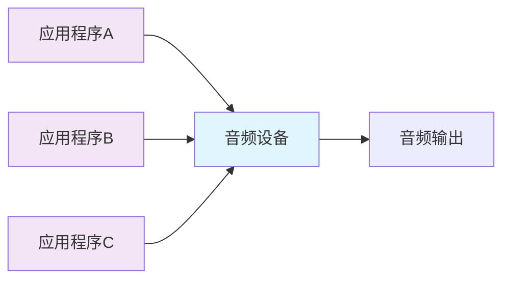
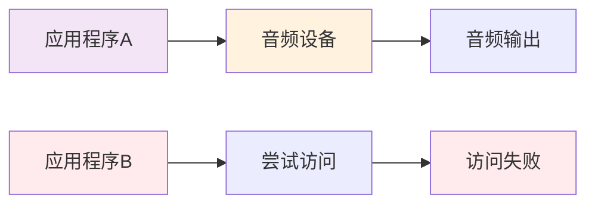
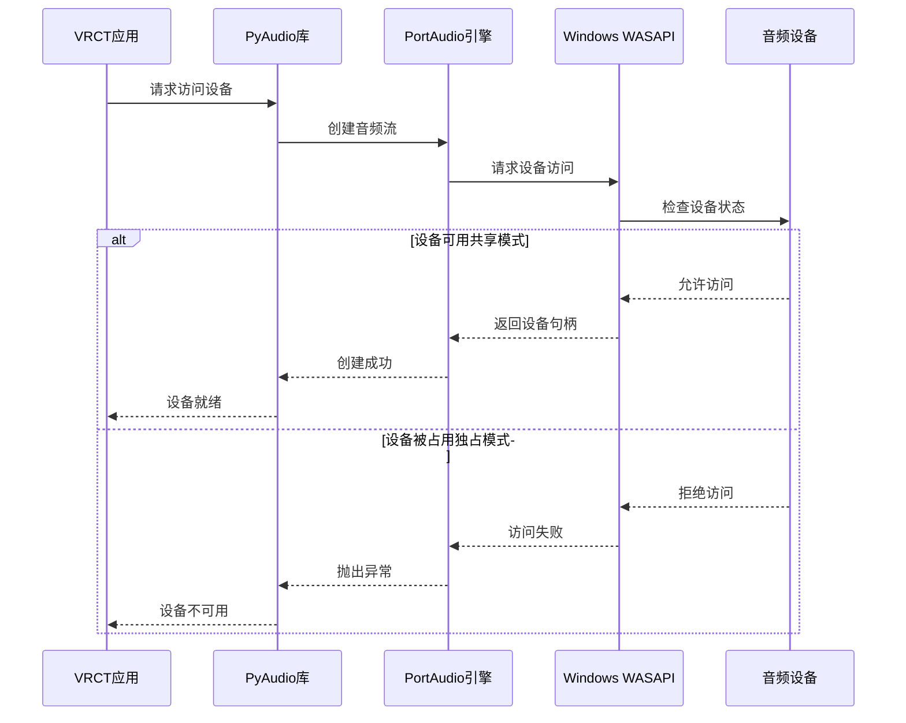
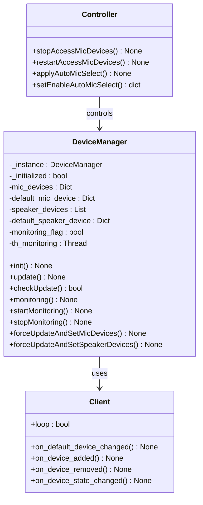
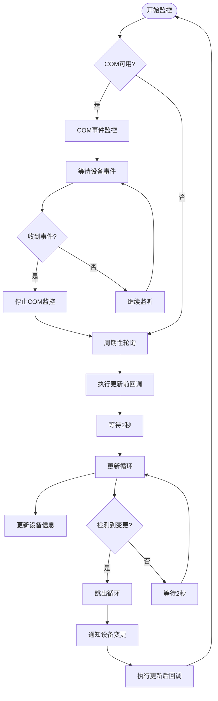
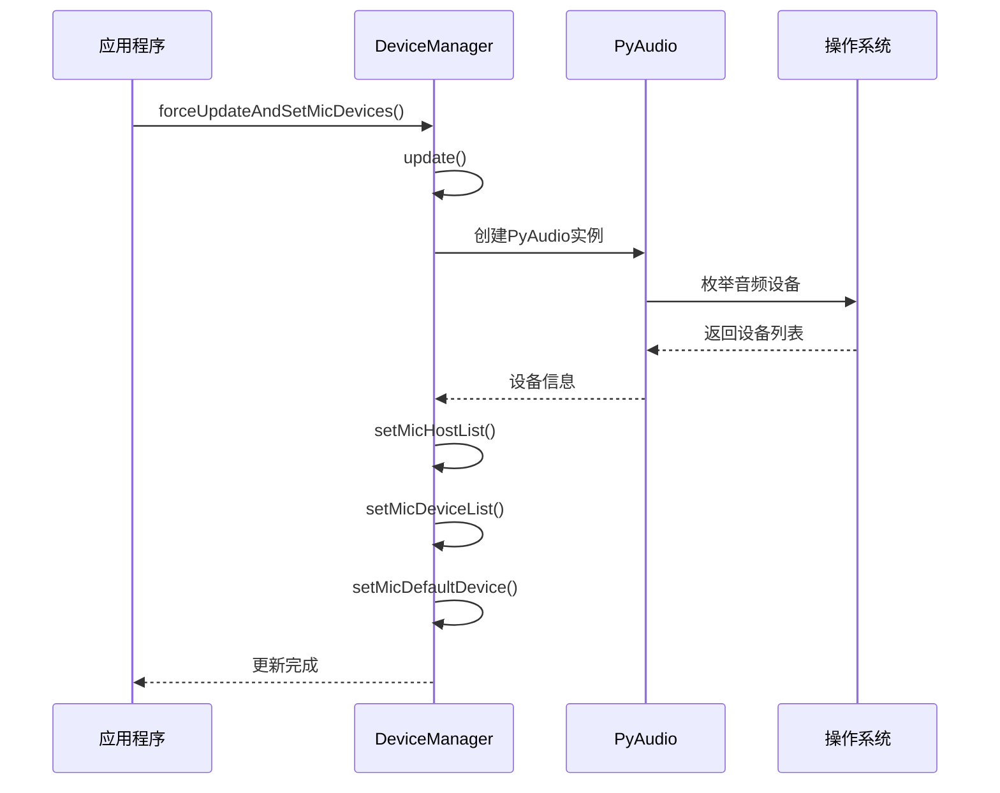

# 设备冲突问题详细指南

<cite>
**本文档中引用的文件**
- [device_manager.py](file://src-python/device_manager.py)
- [controller.py](file://src-python/controller.py)
- [device_manager_zh.md](file://src-python/docs/device_manager_zh.md)
- [utils.py](file://src-python/utils.py)
</cite>

## 目录
1. [概述](#概述)
2. [WASAPI共享模式与独占模式](#wasapi共享模式与独占模式)
3. [PyAudio设备占用机制](#pyaudio设备占用机制)
4. [设备管理器架构](#设备管理器架构)
5. [设备冲突检测机制](#设备冲突检测机制)
6. [强制更新与设备获取](#强制更新与设备获取)
7. [高级排查步骤](#高级排查步骤)
8. [常见解决方案](#常见解决方案)
9. [故障排除指南](#故障排除指南)

## 概述

VRCT应用程序中的音频设备冲突问题主要源于其他程序独占音频设备的使用权，导致PyAudio无法正常访问麦克风或扬声器设备。本指南详细解释了设备冲突的成因、检测机制以及解决方法。

设备冲突的核心问题在于Windows音频系统的WASAPI（Windows Audio Session API）机制，该机制支持两种不同的音频访问模式：共享模式和独占模式。当一个应用程序以独占模式打开音频设备后，其他应用程序在同一时间只能以共享模式访问该设备，或者完全无法访问。

## WASAPI共享模式与独占模式

### 共享模式（Shared Mode）

共享模式是Windows音频系统的主要访问方式，允许多个应用程序同时访问同一个音频设备：



**图表来源**
- [device_manager.py](file://src-python/device_manager.py#L140-L238)

**特点：**
- 多个应用程序可以同时访问同一设备
- 自动混音和音量控制
- 较低的延迟
- 支持实时音频处理

### 独占模式（Exclusive Mode）

独占模式允许应用程序完全独占音频设备，绕过系统的混音器：



**图表来源**
- [device_manager.py](file://src-python/device_manager.py#L140-L238)

**特点：**
- 应用程序独占设备使用权
- 无系统混音开销
- 更低的延迟
- 但会阻止其他应用程序访问设备

## PyAudio设备占用机制

### 设备访问流程

PyAudio通过PortAudio库与底层音频系统交互，其设备访问遵循以下流程：



**图表来源**
- [device_manager.py](file://src-python/device_manager.py#L140-L238)

### 设备状态检测

设备管理器通过周期性轮询检测设备状态变化：

**节来源**
- [device_manager.py](file://src-python/device_manager.py#L266-L300)

## 设备管理器架构

### 核心组件

设备管理器采用单例模式设计，包含以下核心组件：



**图表来源**
- [device_manager.py](file://src-python/device_manager.py#L56-L521)
- [controller.py](file://src-python/controller.py#L1113-L1136)

### 监控机制

设备管理器实现了双重监控策略：

1. **COM事件监控（Windows专用）**：使用pycaw库接收实时设备变更通知
2. **周期性轮询**：作为后备机制，在COM监控失效时启用

**节来源**
- [device_manager.py](file://src-python/device_manager.py#L266-L300)

## 设备冲突检测机制

### 轮询检测流程

设备管理器通过`monitoring()`方法实现周期性设备状态检测：



**图表来源**
- [device_manager.py](file://src-python/device_manager.py#L266-L300)

### 变更检测算法

`checkUpdate()`方法实现了智能的设备变更检测：

**节来源**
- [device_manager.py](file://src-python/device_manager.py#L240-L264)

### 回调机制

设备管理器提供了完整的回调机制来处理设备变更：

| 回调类型 | 触发时机 | 用途 |
|---------|---------|------|
| `process_before_update_mic_devices` | 设备更新前 | 停止音频处理 |
| `default_mic_device` | 默认麦克风变更 | 更新设备选择 |
| `process_after_update_mic_devices` | 设备更新后 | 重新启动音频处理 |

**节来源**
- [device_manager.py](file://src-python/device_manager.py#L354-L370)

## 强制更新与设备获取

### forceUpdateAndSetMicDevices()方法

当自动检测失效时，可以使用强制更新方法：



**图表来源**
- [device_manager.py](file://src-python/device_manager.py#L507-L512)

### 设备获取失败的处理

如果`forceUpdateAndSetMicDevices()`仍无法获取设备，系统会：

1. **记录错误日志**：通过`errorLogging()`函数记录详细信息
2. **返回默认值**：返回`{"index": -1, "name": "NoDevice"}`作为占位符
3. **保持系统稳定**：不会抛出异常，确保应用程序继续运行

**节来源**
- [device_manager.py](file://src-python/device_manager.py#L507-L512)

## 高级排查步骤

### 第一步：确认设备占用情况

1. **检查任务管理器**：
   - 打开任务管理器（Ctrl+Shift+Esc）
   - 查看"详细信息"选项卡中的音频相关进程

2. **使用设备管理器**：
   - 右键点击"此电脑" → 属性 → 设备管理器
   - 展开"声音、视频和游戏控制器"
   - 检查是否有异常的音频设备

### 第二步：重启音频服务

如果发现其他程序占用了音频设备，可以尝试以下步骤：

1. **重启Windows音频服务**：

```cmd
net stop audiosrv
net start audiosrv
```

2. **重启Windows Audio Endpoint Builder**：

```cmd
net stop "Windows Audio Endpoint Builder"
net start "Windows Audio Endpoint Builder"
```

3. **重启Windows Audio**：

```cmd
net stop "Windows Audio"
net start "Windows Audio"
```

### 第三步：调整设备共享设置

1. **修改音频驱动程序设置**：
   - 右键点击音频设备 → 属性 → 高级
   - 检查"独占模式"设置
   - 禁用可能导致冲突的高级功能

2. **调整音频优先级**：
   - 使用音频管理软件调整应用程序优先级
   - 确保VRCT具有适当的音频访问权限

### 第四步：检查系统资源

1. **内存使用情况**：
   - 确保系统有足够的可用内存
   - 关闭不必要的后台应用程序

2. **CPU使用率**：
   - 检查是否有高CPU占用的应用程序
   - 考虑重启系统释放资源

## 常见解决方案

### 解决方案1：关闭冲突应用程序

根据常见的音频冲突源，建议关闭以下应用程序：

| 应用程序类型 | 具体软件 | 关闭方法 |
|-------------|----------|----------|
| 通讯软件 | Discord、Teams、Zoom | 退出应用程序或最小化到系统托盘 |
| 录音工具 | OBS Studio、Audacity | 停止录制或禁用音频输入 |
| 游戏软件 | Steam、Epic Games | 暂停游戏或禁用语音功能 |
| 音频增强软件 | DTS Sound、Dolby Atmos | 禁用音频增强功能 |
| 浏览器扩展 | WebRTC音频权限 | 检查浏览器音频权限设置 |

### 解决方案2：配置音频优先级

1. **Windows音频优先级设置**：
   - 控制面板 → 音频 → 高级设置
   - 调整应用程序的音频优先级

2. **任务管理器优先级**：
   - 打开任务管理器
   - 右键点击VRCT进程 → 设置优先级 → 高

### 解决方案3：使用虚拟音频设备

考虑使用虚拟音频设备来隔离冲突：

1. **VB-Cable**：创建虚拟音频电缆
2. **Voicemeeter**：虚拟音频混音器
3. **BlackHole**（macOS）：虚拟音频设备

## 故障排除指南

### 常见错误及解决方案

#### 错误1：设备"NoDevice"持续出现

**症状**：设备列表始终显示"NoDevice"

**可能原因**：
- PyAudio库未正确安装
- 音频驱动程序损坏
- 系统权限不足

**解决方案**：
1. 重新安装PyAudio：`pip install pyaudio`
2. 更新音频驱动程序
3. 以管理员身份运行应用程序

#### 错误2：设备频繁切换

**症状**：默认设备在不同设备间频繁切换

**可能原因**：
- 设备热插拔检测过于敏感
- 系统音频服务不稳定

**解决方案**：
1. 增加设备检测间隔
2. 重启音频服务
3. 检查硬件连接稳定性

#### 错误3：音频延迟或中断

**症状**：音频输入输出存在明显延迟或中断

**可能原因**：
- 音频缓冲区设置不当
- 系统资源竞争
- 驱动程序兼容性问题

**解决方案**：
1. 调整音频缓冲区大小
2. 关闭不必要的音频应用程序
3. 更新音频驱动程序

### 调试技巧

1. **启用详细日志**：
   ```python
   import logging
   logging.basicConfig(level=logging.DEBUG)
   ```

2. **监控设备状态**：
   ```python
   device_manager.forceUpdateAndSetMicDevices()
   devices = device_manager.getMicDevices()
   print(f"可用设备: {devices}")
   ```

3. **测试设备访问**：
   ```python
   import pyaudio
   p = pyaudio.PyAudio()
   try:
       stream = p.open(format=pyaudio.paInt16, channels=1, rate=16000, input=True)
       print("设备访问成功")
   except Exception as e:
       print(f"设备访问失败: {e}")
   finally:
       p.terminate()
   ```

**节来源**
- [device_manager.py](file://src-python/device_manager.py#L79-L138)

### 性能优化建议

1. **减少轮询频率**：在设备变更不频繁的情况下增加轮询间隔
2. **缓存设备信息**：避免频繁的设备枚举操作
3. **异步处理**：将设备更新操作放在单独的线程中执行

通过以上详细的指南和解决方案，用户应该能够有效识别、诊断和解决VRCT应用程序中的音频设备冲突问题。如果问题仍然存在，建议联系技术支持团队并提供详细的错误日志和系统信息。