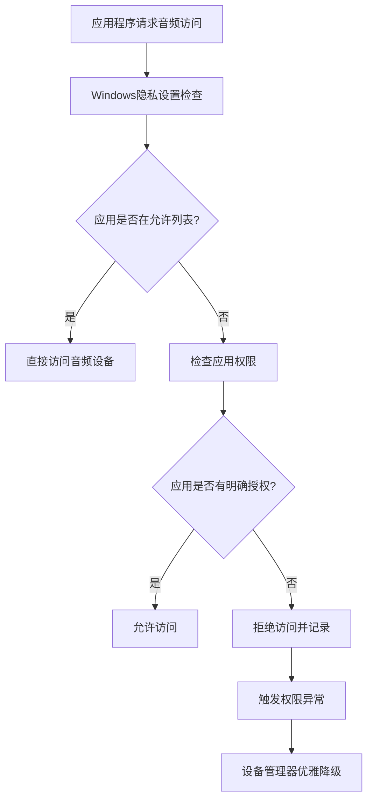
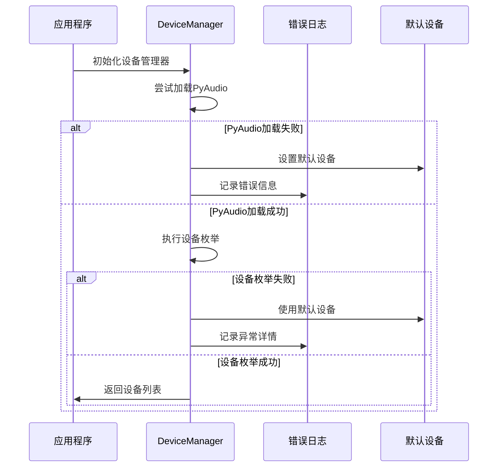
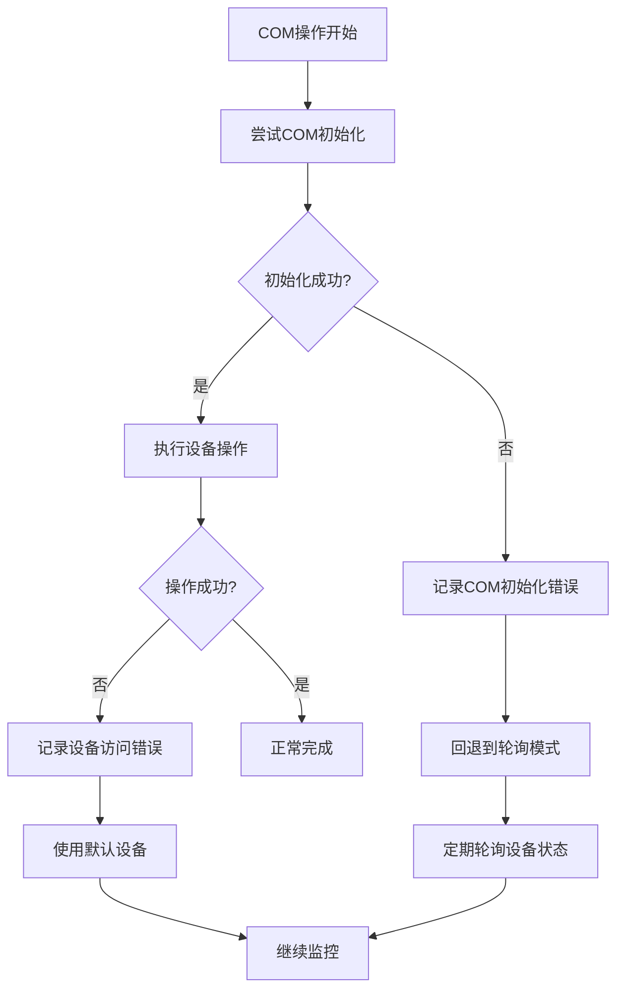
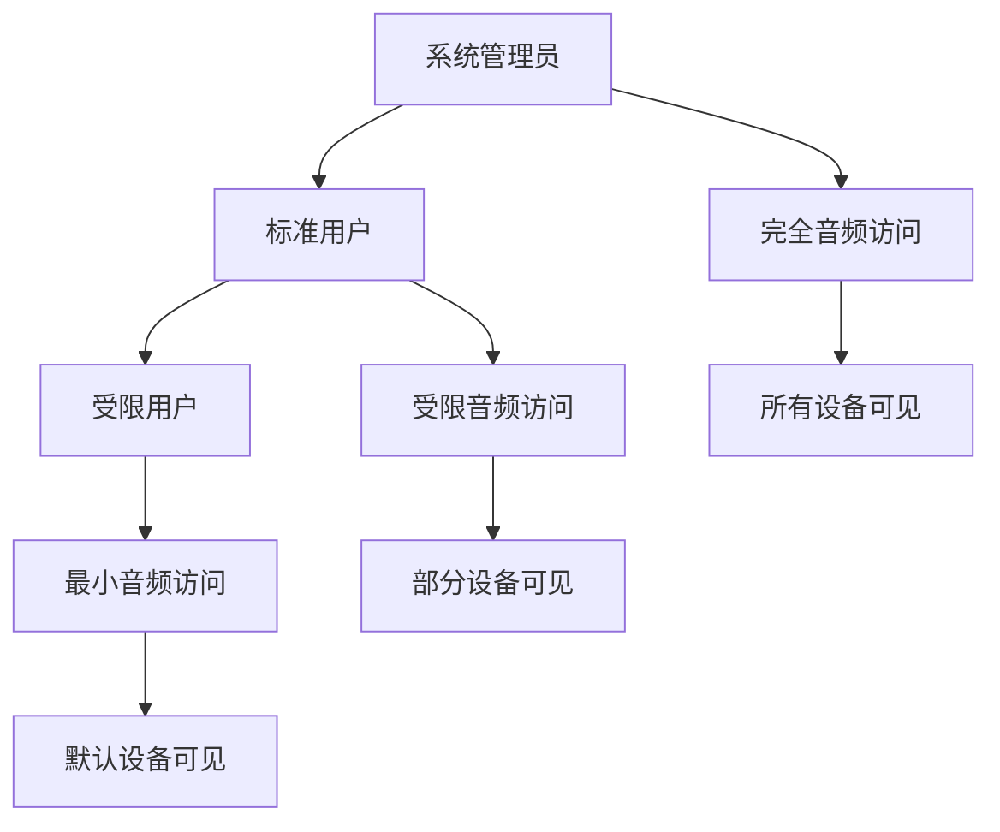
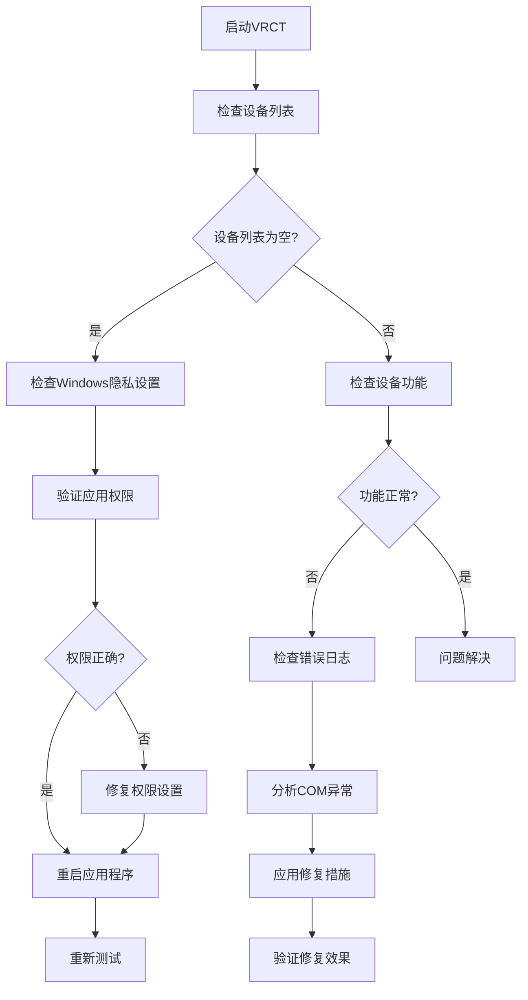

# 设备权限问题

<cite>
**本文档中引用的文件**
- [device_manager.py](file://src-python/device_manager.py)
- [utils.py](file://src-python/utils.py)
- [controller.py](file://src-python/controller.py)
- [config.py](file://src-python/config.py)
- [device_manager.md](file://src-python/docs/device_manager.md)
- [device_manager_zh.md](file://src-python/docs/device_manager_zh.md)
</cite>

## 目录
1. [简介](#简介)
2. [Windows系统下麦克风隐私设置影响](#windows系统下麦克风隐私设置影响)
3. [VRCT应用程序权限配置](#vrct应用程序权限配置)
4. [device_manager.py优雅降级机制](#device_managerpy优雅降级机制)
5. [权限相关COM异常处理](#权限相关com异常处理)
6. [杀毒软件与安全策略检查](#杀毒软件与安全策略检查)
7. [多用户环境设备访问冲突](#多用户环境设备访问冲突)
8. [故障排除指南](#故障排除指南)
9. [最佳实践建议](#最佳实践建议)

## 简介

VRCT应用程序依赖于Windows系统的音频设备访问权限来实现语音识别和翻译功能。当遇到权限不足导致的音频设备访问失败时，系统会触发一系列保护机制，包括优雅降级和详细的错误日志记录。本指南将深入解析这些问题的根本原因，并提供全面的解决方案。

## Windows系统下麦克风隐私设置影响

### 隐私设置架构

Windows操作系统为音频设备访问设置了多层次的安全控制：



**图表来源**
- [device_manager.py](file://src-python/device_manager.py#L267-L300)

### 影响范围

1. **实时语音识别**: 微软语音API需要麦克风访问权限
2. **音频录制功能**: 本地语音转文字处理
3. **音频输出控制**: 系统音频设备管理
4. **设备自动切换**: 插拔设备时的自动检测

## VRCT应用程序权限配置

### 系统设置步骤

#### 方法一：通过隐私设置面板

1. **打开设置面板**
   - Win + I 打开设置
   - 选择"隐私与安全性"
   - 点击"麦克风"

2. **配置VRCT权限**
   - 找到"应用可以访问麦克风"
   - 点击"更改应用权限"
   - 添加VRCT应用程序
   - 启用"允许该应用访问麦克风"

3. **验证权限状态**
   - 确认VRCT旁边显示"已开启"
   - 测试音频功能正常工作

#### 方法二：通过控制面板

1. **打开控制面板**
   - 搜索"控制面板"
   - 选择"硬件和声音"
   - 点击"声音"

2. **检查设备属性**
   - 右键点击目标麦克风设备
   - 选择"属性"
   - 检查"安全"选项卡中的权限设置

### 权限验证脚本

```python
# 权限检查伪代码示例
def check_microphone_permissions():
    """检查当前用户对麦克风的访问权限"""
    try:
        # 尝试访问音频设备
        import comtypes
        from pycaw.utils import AudioUtilities
        
        # 初始化COM接口
        comtypes.CoInitialize()
        
        # 获取设备枚举器
        enumerator = AudioUtilities.GetDeviceEnumerator()
        
        # 如果成功，权限正常
        return True
    except Exception as e:
        # 权限不足或COM初始化失败
        return False
```

**节来源**
- [device_manager.py](file://src-python/device_manager.py#L267-L300)

## device_manager.py优雅降级机制

### 初始化失败处理流程

设备管理器采用多层次的优雅降级策略：



**图表来源**
- [device_manager.py](file://src-python/device_manager.py#L67-L77)
- [device_manager.py](file://src-python/device_manager.py#L127-L138)

### 降级策略详解

#### 1. 导入时的降级

```python
# 设备管理器导入时的处理
try:
    import comtypes
except Exception:
    comtypes = None  # type: ignore

try:
    from pyaudiowpatch import PyAudio, paWASAPI
except Exception:
    PyAudio = None
    paWASAPI = None
```

#### 2. 初始化时的降级

```python
# 初始化失败时的处理
try:
    self.update()
except Exception:
    errorLogging()
    # 继续使用默认值
```

#### 3. 运行时的降级

```python
# 设备获取时的降级
def getMicDevices(self):
    if not getattr(self, '_initialized', False):
        try:
            self.init()
        except Exception:
            try:
                errorLogging()
            except Exception:
                pass
    return getattr(self, 'mic_devices', {"NoHost": [{"index": -1, "name": "NoDevice"}]})
```

**节来源**
- [device_manager.py](file://src-python/device_manager.py#L67-L77)
- [device_manager.py](file://src-python/device_manager.py#L460-L469)

## 权限相关COM异常处理

### COM异常类型分析

#### 常见COM异常场景

1. **权限不足异常**
   - `AccessDenied` - 用户权限不足
   - `UnauthorizedAccess` - 未授权访问

2. **COM初始化异常**
   - `CoInitialize` 失败
   - `CoUninitialize` 异常

3. **设备访问异常**
   - `DeviceNotAvailable` - 设备不可用
   - `InvalidDeviceHandle` - 无效设备句柄

### 异常处理机制



**图表来源**
- [device_manager.py](file://src-python/device_manager.py#L267-L300)

### 错误恢复策略

#### COM监控失败时的恢复

```python
# COM监控失败时的处理逻辑
try:
    comtypes.CoInitialize()
    cb = Client()
    enumerator = AudioUtilities.GetDeviceEnumerator()
    enumerator.RegisterEndpointNotificationCallback(cb)
    
    # 监听设备变化
    while cb.loop is True and self.monitoring_flag is True:
        sleep(1)
        
    # 清理资源
    enumerator.UnregisterEndpointNotificationCallback(cb)
    comtypes.CoUninitialize()
except Exception:
    # 记录错误并回退到轮询模式
    errorLogging()
    # 轮询模式将在后续逻辑中启用
```

**节来源**
- [device_manager.py](file://src-python/device_manager.py#L267-L300)

## 杀毒软件与安全策略检查

### 常见安全软件干扰

#### 主要安全软件的影响

| 安全软件 | 影响类型 | 解决方案 |
|---------|---------|---------|
| Windows Defender | 进程保护 | 添加VRCT到信任列表 |
| McAfee | 实时扫描 | 排除VRCT进程路径 |
| Norton | 行为监控 | 创建白名单规则 |
| 360安全卫士 | 系统保护 | 允许网络访问 |

#### 检查步骤

1. **进程隔离检查**
   ```python
   # 检查进程是否被安全软件隔离
   def check_process_isolation():
       try:
           import psutil
           for proc in psutil.process_iter(['pid', 'name']):
               if proc.info['name'] == 'vrct.exe':
                   # 检查进程状态
                   return proc.status() == 'running'
       except Exception:
           return False
   ```

2. **网络访问检查**
   ```python
   # 检查网络访问是否被阻止
   def check_network_access():
       try:
           import socket
           # 尝试建立连接测试
           sock = socket.socket(socket.AF_INET, socket.SOCK_STREAM)
           sock.settimeout(5)
           result = sock.connect_ex(('localhost', 80))
           sock.close()
           return result == 0
       except Exception:
           return False
   ```

### 安全策略绕过

#### 注册表权限检查

```python
# 检查注册表访问权限
def check_registry_access():
    try:
        import winreg
        # 尝试访问音频相关注册表项
        key = winreg.OpenKey(winreg.HKEY_CURRENT_USER, 
                           r'Software\Microsoft\Windows\CurrentVersion\MMDevices\Audio\Capture')
        winreg.CloseKey(key)
        return True
    except Exception:
        return False
```

**节来源**
- [device_manager.py](file://src-python/device_manager.py#L267-L300)

## 多用户环境设备访问冲突

### 用户权限层次



### 冲突解决策略

#### 1. 设备所有权检查

```python
# 检查设备所有权
def check_device_ownership(device_name):
    try:
        import wmi
        wmi_obj = wmi.WMI()
        
        for device in wmi_obj.Win32_PnPEntity():
            if device_name in str(device.Name):
                # 检查设备属性
                return device.Manufacturer
    except Exception:
        return None
```

#### 2. 权限提升机制

```python
# 请求权限提升
def request_elevation():
    try:
        import ctypes
        return ctypes.windll.shell32.IsUserAnAdmin() != 0
    except Exception:
        return False
```

#### 3. 设备锁定检测

```python
# 检测设备是否被其他进程锁定
def check_device_lock(device_path):
    try:
        # 尝试打开设备文件
        file_handle = open(device_path, 'rb')
        file_handle.close()
        return False
    except IOError:
        return True
```

**节来源**
- [device_manager.py](file://src-python/device_manager.py#L267-L300)

## 故障排除指南

### 诊断流程

#### 第一步：权限验证



#### 第二步：日志分析

##### 错误日志位置

- **主错误日志**: `error.log`
- **进程日志**: `process.log`
- **调试日志**: `debug.log`（如存在）

##### 关键错误模式

```python
# 常见错误模式识别
ERROR_PATTERNS = {
    'PERMISSION_DENIED': 'Access denied',
    'COM_INITIALIZATION_FAILED': 'CoInitialize failed',
    'DEVICE_NOT_FOUND': 'Device not found',
    'AUDIO_API_UNAVAILABLE': 'Audio API unavailable'
}

def analyze_error_log(log_file):
    """分析错误日志以识别权限问题"""
    with open(log_file, 'r') as f:
        for line in f:
            for error_type, pattern in ERROR_PATTERNS.items():
                if pattern in line:
                    return error_type, line
    return None, None
```

### 解决方案矩阵

| 问题类型 | 症状 | 解决方案 | 验证方法 |
|---------|------|---------|---------|
| 权限不足 | 设备列表为空 | 配置Windows隐私设置 | 重新启动应用 |
| COM初始化失败 | 应用崩溃 | 修复COM组件注册 | 查看事件日志 |
| 设备被占用 | 设备不可用 | 关闭其他音频应用 | 检查任务管理器 |
| 网络策略阻止 | 远程服务不可达 | 配置防火墙规则 | 测试网络连接 |

**节来源**
- [utils.py](file://src-python/utils.py#L280-L291)
- [device_manager.py](file://src-python/device_manager.py#L232)

## 最佳实践建议

### 开发阶段最佳实践

#### 1. 防御性编程

```python
# 防御性设备访问
def safe_device_access(device_manager):
    try:
        # 检查设备管理器状态
        if not device_manager._initialized:
            device_manager.init()
            
        # 获取设备列表
        devices = device_manager.getMicDevices()
        
        # 验证设备有效性
        if not devices or "NoHost" in devices:
            return None
            
        return devices
    except Exception:
        # 记录错误并返回安全默认值
        errorLogging()
        return {"NoHost": [{"index": -1, "name": "NoDevice"}]}
```

#### 2. 渐进式功能启用

```python
# 渐进式功能启用策略
def enable_audio_features():
    # 1. 检查基础权限
    if not check_basic_permissions():
        return "基础权限不足"
    
    # 2. 检查高级功能权限
    if not check_advanced_permissions():
        return "启用基本功能"
    
    # 3. 启用完整功能
    return "功能完全可用"
```

### 用户部署最佳实践

#### 1. 系统预检查清单

- [ ] **操作系统版本确认**: Windows 10/11 专业版或企业版
- [ ] **.NET Framework版本**: 4.8 或更高版本
- [ ] **Visual C++运行库**: x64版本安装
- [ ] **音频驱动程序**: 最新版本

#### 2. 权限配置清单

- [ ] **Windows隐私设置**: 启用麦克风访问
- [ ] **UAC设置**: 适当调整用户权限
- [ ] **防火墙规则**: 允许VRCT网络访问
- [ ] **杀毒软件排除**: 添加VRCT到白名单

#### 3. 监控和维护

- **定期检查**: 每周验证设备访问权限
- **日志监控**: 监控错误日志中的权限相关错误
- **更新提醒**: 及时更新音频驱动程序
- **备份配置**: 备份音频设备配置

### 故障预防措施

#### 1. 系统健康检查

```python
# 系统健康检查脚本
def system_health_check():
    checks = {
        'windows_privacy': check_windows_privacy(),
        'audio_drivers': check_audio_drivers(),
        'com_registration': check_com_registration(),
        'network_access': check_network_access()
    }
    
    unhealthy_checks = [k for k, v in checks.items() if not v]
    
    if unhealthy_checks:
        return False, unhealthy_checks
    return True, []
```

#### 2. 自动化修复

```python
# 自动修复机制
def automated_fix():
    fixes = {
        're_register_com': fix_com_registration,
        'reset_privacy_settings': reset_privacy_settings,
        'restart_audio_service': restart_audio_service
    }
    
    for fix_name, fix_func in fixes.items():
        try:
            fix_func()
            print(f"{fix_name}: 修复成功")
        except Exception as e:
            print(f"{fix_name}: 修复失败 - {e}")
```

通过遵循这些最佳实践，可以显著减少因权限问题导致的音频设备访问失败，确保VRCT应用程序在各种环境下都能稳定运行。

**节来源**
- [device_manager.py](file://src-python/device_manager.py#L67-L77)
- [device_manager.py](file://src-python/device_manager.py#L127-L138)
- [utils.py](file://src-python/utils.py#L280-L291)