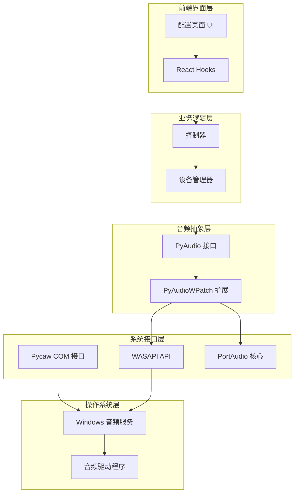
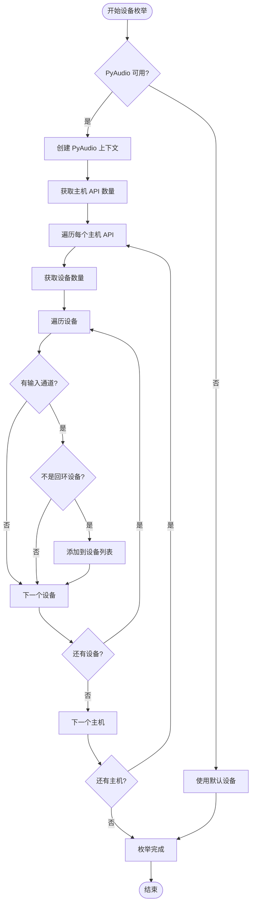
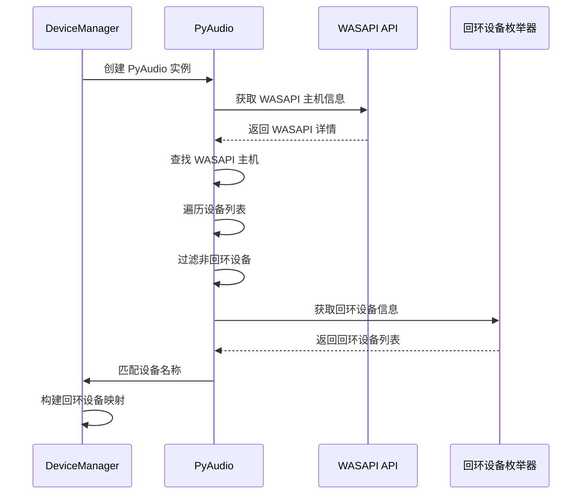
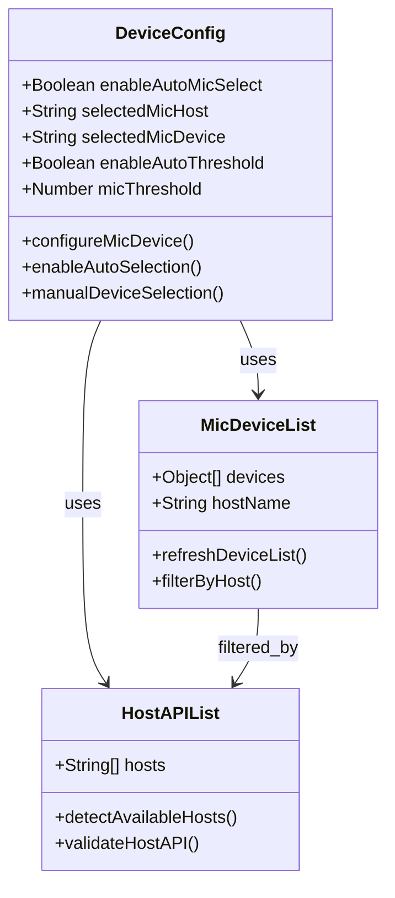
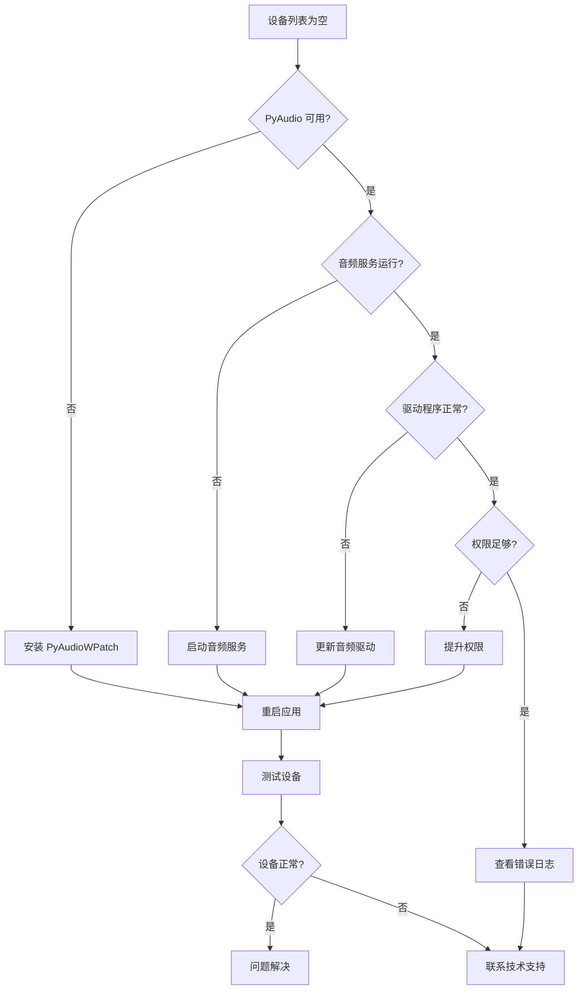
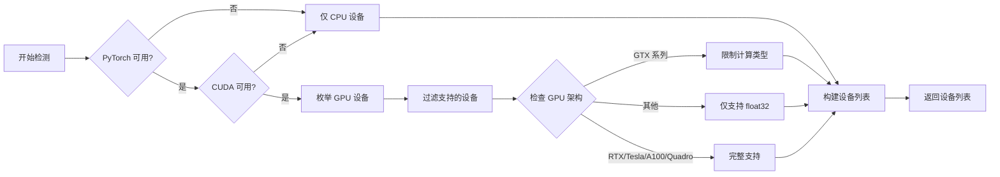

# 设备识别问题

<cite>
**本文档中引用的文件**
- [device_manager.py](file://src-python/device_manager.py)
- [transcription_recorder.py](file://src-python/models/transcription/transcription_recorder.py)
- [utils.py](file://src-python/utils.py)
- [Device.jsx](file://src-ui/views/app/config_page/setting_section/setting_box/device/Device.jsx)
- [ComputeDevice.jsx](file://src-ui/views/app/config_page/setting_section/setting_box/_components/compute_device/ComputeDevice.jsx)
- [config.py](file://src-python/config.py)
- [controller.py](file://src-python/controller.py)
</cite>

## 目录
1. [概述](#概述)
2. [系统架构](#系统架构)
3. [PyAudioWPatch 枚举机制](#pyaudiowpatch-枚举机制)
4. [WASAPI 回环设备处理](#wasapi-回环设备处理)
5. [配置页面设备设置](#配置页面设备设置)
6. [设备列表为空故障排查](#设备列表为空故障排查)
7. [GPU 设备检测辅助](#gpu-设备检测辅助)
8. [常见问题解决方案](#常见问题解决方案)
9. [最佳实践建议](#最佳实践建议)

## 概述

VRCT 应用程序的音频设备识别系统是一个复杂的多层架构，负责检测和管理计算机上的音频输入输出设备。该系统的核心是 `device_manager.py` 模块，它通过 PyAudioWPatch 库实现对 Windows 音频系统的深度集成，支持 WASAPI 回环设备的特殊处理，并提供实时的设备变化监控功能。

### 核心组件职责

- **设备枚举**: 通过 PyAudioWPatch 自动发现系统音频设备
- **WASAPI 集成**: 支持 Windows WASAPI API 的高级音频功能
- **回环设备检测**: 专门处理音频输出到输入的回环设备
- **实时监控**: 监听系统音频设备的变化并及时更新
- **自动选择**: 提供智能的设备自动选择算法

## 系统架构



**图表来源**
- [device_manager.py](file://src-python/device_manager.py#L1-L50)
- [Device.jsx](file://src-ui/views/app/config_page/setting_section/setting_box/device/Device.jsx#L1-L50)

## PyAudioWPatch 枚举机制

### 设备发现流程

`device_manager.py` 使用 PyAudioWPatch 库实现对 Windows 音频系统的深度访问。该库扩展了标准 PyAudio 的功能，提供了对 WASAPI API 的直接访问能力。



**图表来源**
- [device_manager.py](file://src-python/device_manager.py#L140-L200)

### 主机 API 类型识别

系统支持多种音频主机 API，每种都有其特定的功能和限制：

| 主机 API | 平台支持 | 特殊功能 | 用途 |
|---------|---------|---------|------|
| Windows WASAPI | Windows | 回环设备支持 | 高质量音频和回环录制 |
| Windows DirectSound | Windows | 兼容性 | 传统音频应用 |
| MME | Windows | 最大兼容性 | 旧版音频设备 |
| ALSA | Linux | 低延迟 | Linux 系统音频 |
| PulseAudio | Linux | 高级功能 | 现代 Linux 发行版 |
| Core Audio | macOS | 原生集成 | macOS 系统音频 |

**章节来源**
- [device_manager.py](file://src-python/device_manager.py#L155-L180)

## WASAPI 回环设备处理

### 回环设备概念

回环设备是一种特殊的虚拟音频设备，能够"录制"计算机扬声器输出的音频信号。这对于 VRChat 等应用程序识别对方语音至关重要。

### WASAPI 回环检测机制



**图表来源**
- [device_manager.py](file://src-python/device_manager.py#L182-L227)

### 回环设备匹配规则

系统使用设备名称包含关系进行匹配：

```python
# 匹配逻辑示例
if device.get("name") in loopback.get("name", ""):
    speaker_devices.append(loopback)
```

这种匹配方式确保了即使设备名称略有不同也能正确识别回环设备。

**章节来源**
- [device_manager.py](file://src-python/device_manager.py#L195-L198)

## 配置页面设备设置

### 麦克风设备配置

配置页面提供了两个主要的麦克风设置选项：

1. **自动选择**: 系统自动选择最佳麦克风设备
2. **手动选择**: 用户手动选择特定的音频主机和设备



**图表来源**
- [Device.jsx](file://src-ui/views/app/config_page/setting_section/setting_box/device/Device.jsx#L32-L108)

### 音频主机 API 选择

在配置页面的计算设备设置中，用户需要正确选择音频主机 API：

1. **Windows 用户**: 优先选择 "Windows WASAPI"
2. **兼容性考虑**: 如果 WASAPI 不可用，可以选择 "Windows DirectSound"
3. **Linux 用户**: 通常选择 "ALSA" 或 "PulseAudio"
4. **macOS 用户**: 选择 "Core Audio"

**章节来源**
- [Device.jsx](file://src-ui/views/app/config_page/setting_section/setting_box/device/Device.jsx#L89-L106)

## 设备列表为空故障排查

### 常见原因分析

当设备列表显示为空时，可能的原因包括：

1. **PyAudioWPatch 未正确安装**
2. **Windows 音频服务未运行**
3. **音频驱动程序问题**
4. **权限不足**
5. **系统音频配置错误**

### 诊断步骤



### PyAudioWPatch 安装检查

验证 PyAudioWPatch 是否正确安装：

```python
# 检查代码示例
try:
    from pyaudiowpatch import PyAudio, paWASAPI
    print("PyAudioWPatch 已正确安装")
    print(f"WASAPI 支持: {'paWASAPI' in globals()}")
except ImportError:
    print("PyAudioWPatch 未安装或安装不完整")
```

### Windows 音频服务检查

确保以下 Windows 音频服务正在运行：
- **Windows Audio**: Windows 音频核心服务
- **Windows Audio Endpoint Builder**: 音频端点构建器
- **Plug and Play**: 即插即用服务

**章节来源**
- [device_manager.py](file://src-python/device_manager.py#L146-L152)

## GPU 设备检测辅助

### getComputeDeviceList() 函数作用

虽然主要用于计算设备检测，但该函数也间接帮助判断系统音频环境：



**图表来源**
- [utils.py](file://src-python/utils.py#L92-L132)

### GPU 设备与音频的关系

某些情况下，GPU 设备的状态可以间接反映音频系统的健康状况：

1. **CUDA 可用性**: 表明系统具有良好的硬件加速能力
2. **设备驱动状态**: 影响整体系统稳定性
3. **内存分配能力**: 关系到音频处理的流畅性

**章节来源**
- [utils.py](file://src-python/utils.py#L107-L127)

## 常见问题解决方案

### 问题 1: 设备列表始终为空

**症状**: 配置页面显示 "NoDevice" 和 "NoHost"

**解决方案**:
1. 检查 PyAudioWPatch 安装状态
2. 验证 Windows 音频服务运行
3. 更新音频驱动程序
4. 以管理员权限运行应用

### 问题 2: WASAPI 回环设备不可用

**症状**: 无法选择回环设备进行语音识别

**解决方案**:
1. 确认系统支持 WASAPI
2. 检查音频驱动程序版本
3. 在音频设置中启用回环功能
4. 使用第三方回环软件（如 VB-Cable）

### 问题 3: 设备频繁切换

**症状**: 音频设备在多个设备间频繁切换

**解决方案**:
1. 禁用自动设备选择功能
2. 设置固定的默认设备
3. 检查音频驱动程序稳定性
4. 更新系统音频组件

### 问题 4: 音频延迟过高

**症状**: 音频输入输出存在明显延迟

**解决方案**:
1. 选择低延迟的音频主机 API
2. 调整缓冲区大小设置
3. 检查系统资源使用情况
4. 关闭不必要的音频应用程序

## 最佳实践建议

### 系统配置优化

1. **音频驱动程序**: 始终保持最新版本
2. **系统更新**: 定期更新 Windows 音频组件
3. **资源管理**: 确保足够的系统内存和 CPU 资源
4. **权限设置**: 以适当权限运行音频应用程序

### 应用配置建议

1. **设备选择**: 优先使用 WASAPI 主机 API
2. **自动选择**: 在稳定环境中启用自动设备选择
3. **阈值设置**: 根据实际使用环境调整音频阈值
4. **监控设置**: 定期检查设备状态变化

### 故障预防措施

1. **定期维护**: 定期检查和更新音频驱动
2. **备份配置**: 保存重要的设备配置设置
3. **日志监控**: 启用详细日志记录以便故障诊断
4. **测试验证**: 在重要会议前测试音频设备

通过遵循这些最佳实践和故障排查指南，用户应该能够有效解决大多数音频设备识别问题，并获得稳定的音频体验。