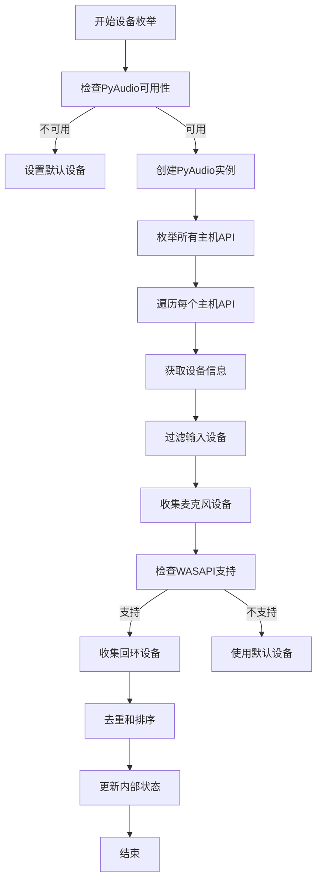
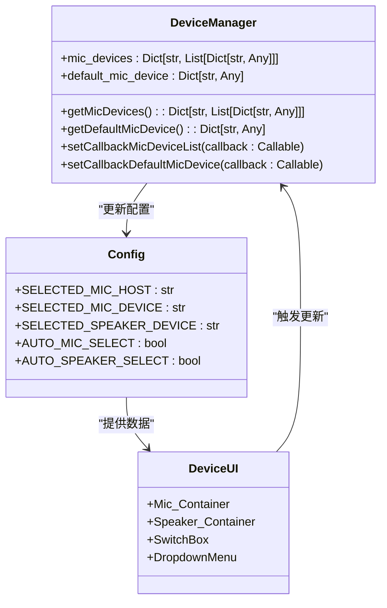

# 音频API选择问题

<cite>
**本文档引用的文件**   
- [device_manager.py](file://src-python/device_manager.py)
- [config.py](file://src-python/config.py)
- [Device.jsx](file://src-ui/views/app/config_page/setting_section/setting_box/device/Device.jsx)
</cite>

## 目录
1. [简介](#简介)
2. [音频API基础](#音频api基础)
3. [设备管理器实现](#设备管理器实现)
4. [配置页面集成](#配置页面集成)
5. [故障排查指南](#故障排查指南)
6. [最佳实践](#最佳实践)

## 简介
本指南详细解释了如何通过正确选择音频API来解决设备识别异常问题。文档重点介绍了`device_manager.py`中如何使用PyAudio枚举不同音频主机API（如WASAPI、DirectSound、MME），并说明了每种API的功能差异和适用场景。指导用户在配置页面的计算设备设置中正确选择适合其系统的音频API，特别是启用WASAPI以支持扬声器回环功能。

**Section sources**
- [device_manager.py](file://src-python/device_manager.py#L1-L529)

## 音频API基础

### 主机API概述
音频主机API（Host API）是操作系统提供的音频子系统接口，不同的API具有不同的特性和功能。在Windows系统中，主要的音频API包括：

- **WASAPI (Windows Audio Session API)**：Windows Vista及更高版本的现代音频API，提供低延迟和高质量音频处理，支持扬声器回环功能
- **DirectSound**：较旧的Windows音频API，提供基本的音频播放和录制功能
- **MME (Multimedia Extensions)**：最古老的Windows音频API，兼容性最好但功能有限

### API功能差异
不同音频API的主要功能差异体现在以下几个方面：

1. **延迟性能**：WASAPI提供最低的音频延迟，DirectSound次之，MME延迟最高
2. **功能支持**：只有WASAPI支持扬声器回环（Loopback）功能，这对于录制系统音频至关重要
3. **兼容性**：MME具有最好的向后兼容性，WASAPI需要较新的Windows版本支持

### 适用场景
根据不同的使用需求，选择合适的音频API：

- **语音识别和实时通信**：推荐使用WASAPI，以获得最佳的音频质量和最低的延迟
- **兼容性要求高的环境**：如果在较老的Windows系统上运行，可能需要使用DirectSound或MME
- **系统音频录制**：必须使用WASAPI才能启用扬声器回环功能

**Section sources**
- [device_manager.py](file://src-python/device_manager.py#L11-L15)
- [device_manager.py](file://src-python/device_manager.py#L183-L201)

## 设备管理器实现

### 设备枚举机制
`device_manager.py`通过PyAudio库实现设备枚举功能，核心流程如下：



**Diagram sources **
- [device_manager.py](file://src-python/device_manager.py#L145-L227)

### WASAPI回环实现
WASAPI回环功能的实现是本系统的关键特性，其工作原理如下：

1. **检查WASAPI支持**：通过`paWASAPI`常量检查WASAPI是否可用
2. **获取WASAPI信息**：使用`p.get_host_api_info_by_type(paWASAPI)`获取WASAPI相关信息
3. **枚举回环设备**：通过`p.get_loopback_device_info_generator()`获取回环设备信息
4. **设备匹配**：根据设备名称匹配原始设备和对应的回环设备

```python
if paWASAPI is not None:
    try:
        wasapi_info = p.get_host_api_info_by_type(paWASAPI)
        wasapi_name = wasapi_info.get("name")
        for host_index in range(p.get_host_api_count()):
            host = p.get_host_api_info_by_index(host_index)
            if host.get("name") == wasapi_name:
                device_count = host.get('deviceCount', 0)
                for device_index in range(device_count):
                    device = p.get_device_info_by_host_api_device_index(host_index, device_index)
                    if not device.get("isLoopbackDevice", True):
                        for loopback in p.get_loopback_device_info_generator():
                            if device.get("name") in loopback.get("name", ""):
                                speaker_devices.append(loopback)
    except Exception:
        pass  # WASAPI不可用时忽略
```

**Section sources**
- [device_manager.py](file://src-python/device_manager.py#L183-L201)

## 配置页面集成

### 麦克风设备选择
在配置页面中，麦克风设备的选择通过以下组件实现：



**Diagram sources **
- [device_manager.py](file://src-python/device_manager.py#L88-L91)
- [config.py](file://src-python/config.py#L731-L733)
- [Device.jsx](file://src-ui/views/app/config_page/setting_section/setting_box/device/Device.jsx#L32-L194)

### 扬声器回环配置
扬声器回环功能的配置需要特别注意API的选择。在配置页面中，用户可以通过以下步骤启用回环功能：

1. 确保音频API设置为WASAPI
2. 在扬声器设备列表中选择相应的回环设备
3. 启用自动选择功能以确保设备变更时自动更新

关键代码实现：

```python
def _speaker_device_validator(val, inst):
    if device_manager is None:
        return None
    if not isinstance(val, str):
        return None
    try:
        names = [d.get('name') for d in device_manager.getSpeakerDevices()]
        return val if val in names else None
    except Exception:
        return None
```

**Section sources**
- [config.py](file://src-python/config.py#L511-L520)

## 故障排查指南

### 设备列表为空的处理
当设备列表为空或不完整时，可以按照以下步骤进行故障排查：

1. **检查音频API选择**：确保选择了正确的音频API（推荐WASAPI）
2. **重启应用程序**：有时需要重启才能正确识别设备
3. **检查系统音频设置**：确保系统音频设备已正确配置
4. **更新音频驱动**：过时的音频驱动可能导致设备识别问题

### API切换步骤
当遇到设备识别问题时，可以尝试切换音频API：

1. 在配置页面中找到音频设备设置
2. 尝试不同的API选项（WASAPI、DirectSound、MME）
3. 每次切换后检查设备列表是否正常显示
4. 选择能够正确识别所有设备的API

### 设备类型判断
根据设备名称特征判断当前使用的API类型：

- **WASAPI设备**：通常包含"Windows WASAPI"标识，回环设备名称可能包含"Loopback"或类似字样
- **DirectSound设备**：包含"Windows DirectSound"标识
- **MME设备**：包含"MME"标识

**Section sources**
- [device_manager.py](file://src-python/device_manager.py#L157-L164)
- [device_manager.py](file://src-python/device_manager.py#L183-L201)

## 最佳实践

### WASAPI启用建议
为了获得最佳的音频体验，建议：

1. **优先使用WASAPI**：在支持的系统上始终优先选择WASAPI
2. **启用回环功能**：对于需要录制系统音频的场景，必须启用WASAPI回环
3. **定期检查设备状态**：设备管理器会监控设备变化并自动更新

### 配置保存
正确的配置保存流程：

1. 在配置页面中选择合适的音频API
2. 选择正确的输入和输出设备
3. 启用自动选择功能以适应设备变更
4. 保存配置以便下次启动时使用

### 性能考虑
在选择音频API时需要考虑性能因素：

- WASAPI提供最佳的性能和功能，但需要较新的Windows版本
- DirectSound在大多数Windows系统上都能正常工作，性能适中
- MME兼容性最好，但性能和功能最有限

**Section sources**
- [device_manager.py](file://src-python/device_manager.py#L266-L305)
- [config.py](file://src-python/config.py#L577-L800)