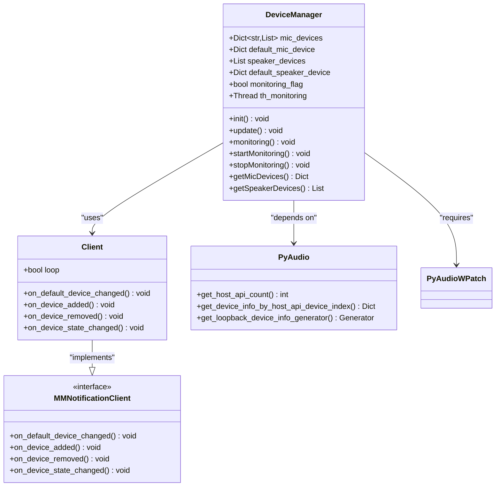
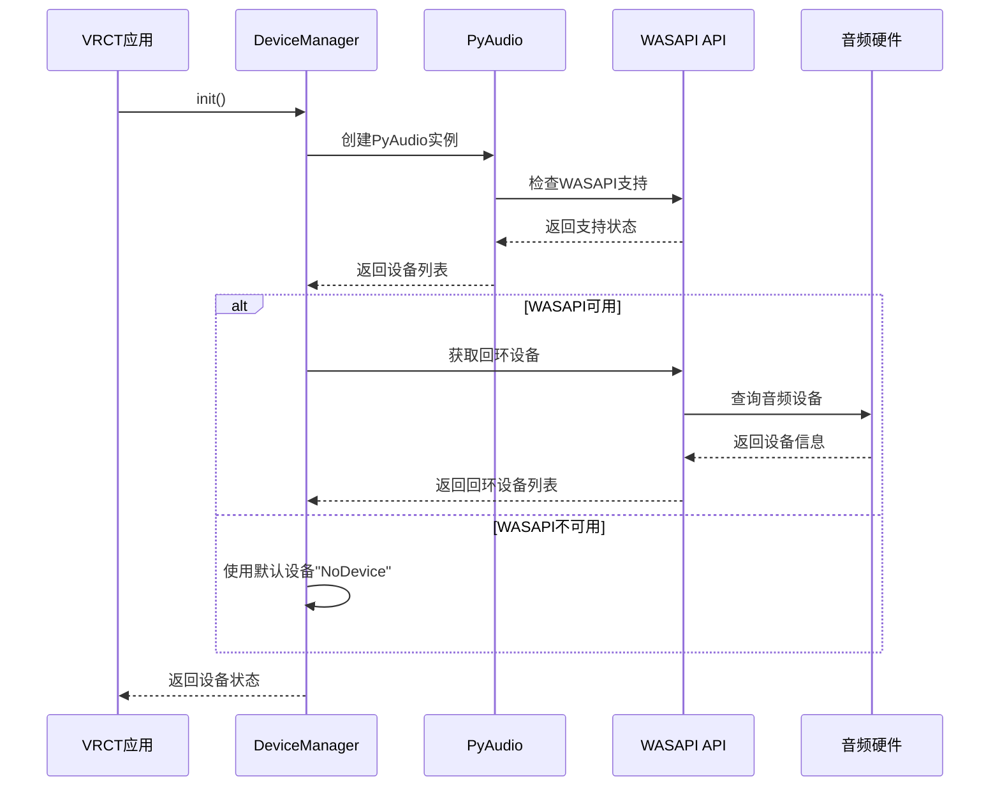

# 音频驱动问题解决指南

<cite>
**本文档引用的文件**
- [device_manager.py](file://src-python/device_manager.py)
- [utils.py](file://src-python/utils.py)
- [requirements.txt](file://requirements.txt)
- [config.py](file://src-python/config.py)
- [controller.py](file://src-python/controller.py)
- [device_manager_zh.md](file://src-python/docs/device_manager_zh.md)
</cite>

## 目录
1. [简介](#简介)
2. [问题概述](#问题概述)
3. [核心架构分析](#核心架构分析)
4. [驱动依赖关系](#驱动依赖关系)
5. [故障诊断步骤](#故障诊断步骤)
6. [驱动更新指南](#驱动更新指南)
7. [系统配置验证](#系统配置验证)
8. [Python环境测试](#python环境测试)
9. [常见厂商解决方案](#常见厂商解决方案)
10. [故障排除清单](#故障排除清单)
11. [总结](#总结)

## 简介

本指南专门针对VRCT项目中因音频驱动不兼容或缺失导致的设备无法识别问题。通过深入分析device_manager.py模块与PyAudioWPatch的交互机制，我们将提供完整的诊断和解决方案。

VRCT项目依赖于Windows特有的音频API（WASAPI）来实现回环录音功能，这是识别VRChat对方语音的核心技术。当系统缺少相应的驱动程序或配置不当时，会导致设备枚举失败，影响应用程序的正常运行。

## 问题概述

### 根本原因分析

音频设备无法识别的根本原因是系统缺少支持WASAPI回环录音的音频驱动程序。具体表现为：

1. **PyAudioWPatch初始化失败**：当系统缺少WASAPI支持时，PyAudioWPatch无法正确初始化
2. **设备枚举失败**：缺少回环设备（Loopback Device）导致麦克风和扬声器设备列表为空
3. **NoDevice错误**：系统返回默认的"NoDevice"状态，表明没有可用的音频设备

### 影响范围

- **设备管理器**：无法正确显示音频设备
- **实时监控**：设备变更检测功能失效
- **音频处理**：无法进行回环录音和语音识别
- **用户体验**：无法正常使用VRChat语音功能

## 核心架构分析

### device_manager.py架构图



**图表来源**
- [device_manager.py](file://src-python/device_manager.py#L25-L55)
- [device_manager.py](file://src-python/device_manager.py#L56-L122)

### 关键组件说明

1. **DeviceManager类**：单例模式的设备管理器，负责设备发现和监控
2. **Client类**：Windows COM事件监听器，处理设备变更事件
3. **PyAudio接口**：底层音频API封装，提供设备枚举功能
4. **WASAPI支持**：Windows特有的音频API，提供回环录音功能

**章节来源**
- [device_manager.py](file://src-python/device_manager.py#L56-L122)
- [device_manager.py](file://src-python/device_manager.py#L25-L55)

## 驱动依赖关系

### 必需组件

根据requirements.txt和代码分析，VRCT项目需要以下音频驱动组件：

| 组件 | 版本要求 | 用途 | 必需性 |
|------|----------|------|--------|
| PyAudioWPatch | 0.2.12.6 | WASAPI回环录音支持 | 必需 |
| pycaw | 最新版本 | Windows音频设备管理 | 必需 |
| comtypes | 自动安装 | COM接口支持 | 必需 |
| PortAudio | PyAudio依赖 | 跨平台音频API | 必需 |

### WASAPI回环录音机制



**图表来源**
- [device_manager.py](file://src-python/device_manager.py#L140-L238)

**章节来源**
- [requirements.txt](file://requirements.txt#L6)
- [device_manager.py](file://src-python/device_manager.py#L12-L15)

## 故障诊断步骤

### 第一步：检查基本依赖

1. **验证Python环境**
   ```bash
   python --version  # 确保Python 3.8+
   pip list | findstr PyAudioWPatch  # 检查PyAudioWPatch安装
   ```

2. **检查系统音频服务**
   - 打开"服务"管理器（Win+R输入services.msc）
   - 确认"Windows Audio"服务正在运行
   - 确认"Windows Audio Endpoint Builder"服务正在运行

### 第二步：验证PyAudioWPatch初始化

创建测试脚本来验证PyAudioWPatch的初始化：

```python
# 测试PyAudioWPatch初始化
try:
    from pyaudiowpatch import PyAudio, paWASAPI
    print("PyAudioWPatch导入成功")
    
    with PyAudio() as p:
        # 检查WASAPI支持
        wasapi_info = p.get_host_api_info_by_type(paWASAPI)
        print(f"WASAPI支持: {wasapi_info}")
        
        # 检查设备数量
        count = p.get_host_api_count()
        print(f"音频主机API数量: {count}")
        
        # 检查回环设备
        loopbacks = list(p.get_loopback_device_info_generator())
        print(f"回环设备数量: {len(loopbacks)}")
        
except ImportError as e:
    print(f"PyAudioWPatch导入失败: {e}")
except Exception as e:
    print(f"初始化错误: {e}")
```

### 第三步：检查设备管理器状态

1. **打开设备管理器**
   - Win+X选择"设备管理器"
   - 展开"声音、视频和游戏控制器"
   - 检查是否有红色叉号或黄色感叹号

2. **验证音频设备状态**
   - 右键点击每个音频设备，选择"属性"
   - 在"驱动程序"选项卡中检查驱动程序状态
   - 确认驱动程序版本是最新的

**章节来源**
- [device_manager.py](file://src-python/device_manager.py#L12-L15)
- [device_manager.py](file://src-python/device_manager.py#L124-L138)

## 驱动更新指南

### Windows音频驱动更新

#### 方法一：通过设备管理器更新

1. **打开设备管理器**
   - Win+X → 设备管理器
   - 展开"声音、视频和游戏控制器"

2. **更新驱动程序**
   - 右键点击音频设备 → "更新驱动程序"
   - 选择"自动搜索更新的驱动程序软件"
   - 如果找到更新，按照提示完成安装

3. **手动安装最新驱动**
   - 下载最新的音频驱动程序
   - 右键点击设备 → "更新驱动程序" → "浏览我的计算机..."
   - 选择下载的驱动程序文件夹

#### 方法二：使用Windows更新

1. **检查Windows更新**
   - 设置 → 更新和安全 → Windows更新
   - 点击"检查更新"
   - 安装所有可用的音频驱动更新

2. **启用自动更新**
   - 设置 → 更新和安全 → Windows更新
   - 确保"自动下载更新"已启用

### 验证驱动更新

更新完成后，验证驱动程序是否正确安装：

1. **检查驱动版本**
   - 在设备管理器中右键点击音频设备
   - 选择"属性" → "驱动程序"选项卡
   - 查看"驱动程序版本"信息

2. **测试音频功能**
   - 打开"声音设置" → 测试麦克风和扬声器
   - 确认音频输出正常工作

**章节来源**
- [device_manager.py](file://src-python/device_manager.py#L269-L298)

## 系统配置验证

### Windows音频设置

#### 1. 默认音频设备配置

```mermaid
flowchart TD
A[开始配置] --> B{检查默认设备}
B --> |麦克风未设置| C[设置默认麦克风]
B --> |扬声器未设置| D[设置默认扬声器]
B --> |都已设置| E[验证设备状态]
C --> F[右键点击麦克风设备]
F --> G[选择"设为默认设备"]
G --> H[验证设备状态]
D --> I[右键点击扬声器设备]
I --> J[选择"设为默认设备"]
J --> H
E --> K{设备状态正常?}
K --> |是| L[配置完成]
K --> |否| M[检查驱动更新]
M --> N[重新安装驱动]
N --> O[重启系统]
O --> B
```

#### 2. 高级音频设置

1. **打开声音设置**
   - 右键任务栏音量图标 → "声音设置"
   - 点击"管理音频设备"

2. **配置增强功能**
   - 选择音频设备 → "属性" → "增强功能"
   - 启用"消除噪音"和"回声消除"
   - 根据需要调整其他设置

#### 3. WASAPI设置验证

1. **检查WASAPI设置**
   - 右键音量图标 → "声音控制面板"
   - 选择"播放"选项卡
   - 右键空白区域 → "属性"
   - 确认"允许应用程序独占控制此设备"已勾选

2. **测试回环功能**
   - 使用音频测试软件验证回环设备
   - 确认可以从扬声器录制音频

### 权限配置

#### 1. 管理员权限

某些音频操作需要管理员权限：

```powershell
# 以管理员身份运行PowerShell
Set-ExecutionPolicy -ExecutionPolicy RemoteSigned -Scope CurrentUser
```

#### 2. 防火墙配置

确保防火墙不会阻止音频服务：

1. 控制面板 → 系统和安全 → Windows Defender 防火墙
2. 允许应用通过Windows Defender防火墙
3. 添加Python.exe和VRCT应用程序到允许列表

**章节来源**
- [device_manager.py](file://src-python/device_manager.py#L269-L298)

## Python环境测试

### 依赖包验证

创建综合测试脚本：

```python
#!/usr/bin/env python3
# -*- coding: utf-8 -*-

"""
VRCT音频驱动测试脚本
"""

import sys
import os
import traceback
from typing import Dict, List, Any

def test_pyaudiowpatch() -> bool:
    """测试PyAudioWPatch安装和初始化"""
    try:
        print("测试PyAudioWPatch...")
        from pyaudiowpatch import PyAudio, paWASAPI
        
        # 创建实例
        with PyAudio() as p:
            # 检查WASAPI支持
            wasapi_info = p.get_host_api_info_by_type(paWASAPI)
            print(f"WASAPI支持: {wasapi_info}")
            
            # 检查设备数量
            host_count = p.get_host_api_count()
            print(f"音频主机API数量: {host_count}")
            
            # 检查回环设备
            loopbacks = list(p.get_loopback_device_info_generator())
            print(f"回环设备数量: {len(loopbacks)}")
            
            return len(loopbacks) > 0
            
    except ImportError as e:
        print(f"PyAudioWPatch导入失败: {e}")
        return False
    except Exception as e:
        print(f"PyAudioWPatch初始化错误: {e}")
        return False

def test_pycaw() -> bool:
    """测试pycaw COM接口"""
    try:
        print("\n测试pycaw...")
        from pycaw.utils import AudioUtilities
        from pycaw.callbacks import MMNotificationClient
        
        # 测试COM初始化
        import comtypes
        comtypes.CoInitialize()
        
        # 获取设备枚举器
        enumerator = AudioUtilities.GetDeviceEnumerator()
        print("pycaw COM接口测试成功")
        
        comtypes.CoUninitialize()
        return True
        
    except ImportError as e:
        print(f"pycaw依赖缺失: {e}")
        return False
    except Exception as e:
        print(f"pycaw测试错误: {e}")
        return False

def test_audio_devices() -> Dict[str, Any]:
    """测试音频设备枚举"""
    try:
        from pyaudiowpatch import PyAudio, paWASAPI
        
        with PyAudio() as p:
            result = {
                "devices": [],
                "hosts": [],
                "loopbacks": []
            }
            
            # 枚举所有主机API
            for host_idx in range(p.get_host_api_count()):
                host = p.get_host_api_info_by_index(host_idx)
                result["hosts"].append({
                    "name": host.get("name"),
                    "deviceCount": host.get("deviceCount", 0)
                })
                
                # 枚举设备
                for dev_idx in range(host.get("deviceCount", 0)):
                    device = p.get_device_info_by_host_api_device_index(host_idx, dev_idx)
                    result["devices"].append({
                        "name": device.get("name"),
                        "index": device.get("index"),
                        "maxInputChannels": device.get("maxInputChannels", 0),
                        "maxOutputChannels": device.get("maxOutputChannels", 0),
                        "isLoopbackDevice": device.get("isLoopbackDevice", False)
                    })
                    
                    # 收集回环设备
                    if device.get("isLoopbackDevice", False):
                        result["loopbacks"].append(device.get("name"))
            
            print(f"\n音频设备统计:")
            print(f"主机API数量: {len(result['hosts'])}")
            print(f"总设备数量: {len(result['devices'])}")
            print(f"回环设备数量: {len(result['loopbacks'])}")
            
            return result
            
    except Exception as e:
        print(f"设备枚举失败: {e}")
        return {"error": str(e)}

def main():
    """主测试函数"""
    print("=" * 60)
    print("VRCT音频驱动测试工具")
    print("=" * 60)
    
    # 检查Python版本
    print(f"Python版本: {sys.version}")
    
    # 运行测试
    pwa_success = test_pyaudiowpatch()
    pycaw_success = test_pycaw()
    device_info = test_audio_devices()
    
    print("\n" + "=" * 60)
    print("测试结果总结")
    print("=" * 60)
    
    print(f"PyAudioWPatch测试: {'✓ 成功' if pwa_success else '✗ 失败'}")
    print(f"pycaw测试: {'✓ 成功' if pycaw_success else '✗ 失败'}")
    
    if "error" in device_info:
        print(f"设备枚举: {'✗ 失败' if device_info['error'] else '✓ 成功'}")
    else:
        print(f"设备枚举: {'✓ 成功' if len(device_info['devices']) > 0 else '✗ 失败'}")
    
    if pwa_success and pycaw_success and len(device_info.get('devices', [])) > 0:
        print("\n🎉 所有测试通过！音频驱动配置正常")
    else:
        print("\n⚠️  部分测试失败，请检查驱动程序和系统配置")
    
    print("\n详细信息已保存到: audio_test_report.txt")
    
    # 保存报告
    with open("audio_test_report.txt", "w", encoding="utf-8") as f:
        f.write("VRCT音频驱动测试报告\n")
        f.write("=" * 50 + "\n\n")
        f.write(f"Python版本: {sys.version}\n\n")
        f.write("测试结果:\n")
        f.write(f"PyAudioWPatch: {'✓' if pwa_success else '✗'}\n")
        f.write(f"pycaw: {'✓' if pycaw_success else '✗'}\n")
        f.write(f"设备枚举: {'✓' if len(device_info.get('devices', [])) > 0 else '✗'}\n\n")
        
        if "error" not in device_info:
            f.write("设备详情:\n")
            for host in device_info.get("hosts", []):
                f.write(f"  主机: {host['name']} ({host['deviceCount']}个设备)\n")
            for device in device_info.get("devices", []):
                f.write(f"  设备: {device['name']} (输入通道: {device['maxInputChannels']})\n")
            f.write(f"回环设备: {device_info.get('loopbacks', [])}\n")

if __name__ == "__main__":
    main()
```

### 测试结果解读

| 测试项 | 正常状态 | 异常状态 | 解决方案 |
|--------|----------|----------|----------|
| PyAudioWPatch导入 | ✓ 成功 | ✗ 导入失败 | 重新安装PyAudioWPatch |
| WASAPI支持 | ✓ 可用 | ✗ 不可用 | 更新音频驱动 |
| 设备枚举 | ✓ 发现设备 | ✗ 无设备 | 检查硬件连接 |
| 回环设备 | ✓ 发现回环设备 | ✗ 无回环设备 | 确认WASAPI支持 |

**章节来源**
- [device_manager.py](file://src-python/device_manager.py#L12-L15)
- [device_manager.py](file://src-python/device_manager.py#L140-L238)

## 常见厂商解决方案

### Realtek音频驱动

#### 问题特征
- 设备管理器中显示"Realtek High Definition Audio"
- 回环设备名称可能为"Stereo Mix"或"Wave Out Mix"
- 驱动版本过旧导致WASAPI功能受限

#### 解决方案

1. **官方网站下载**
   - 访问Realtek官网支持页面
   - 根据主板型号下载对应驱动
   - 推荐版本：最新稳定版

2. **驱动安装步骤**
   ```powershell
   # 以管理员身份运行
   # 1. 备份当前驱动
   rdman.exe /export "Realtek High Definition Audio" "C:\Backup\Realtek"
   
   # 2. 安装新驱动
   # 下载后双击安装程序
   
   # 3. 验证安装
   rdman.exe /list
   ```

3. **配置优化**
   - 打开Realtek HD Audio Manager
   - 启用"立体声混音"功能
   - 调整音频增强设置

### NVIDIA音频驱动

#### 问题特征
- 显示器集成音频输出
- 驱动程序版本不匹配
- 多显示器环境下音频路由问题

#### 解决方案

1. **官方驱动下载**
   - 访问NVIDIA官网驱动下载页面
   - 选择"GeForce Experience"或手动下载
   - 确保驱动包含音频功能

2. **音频控制面板配置**
   ```powershell
   # 打开NVIDIA音频控制面板
   nvcplui.exe
   
   # 配置音频输出设备
   # 设置默认音频输出设备
   ```

3. **多显示器音频路由**
   - 在NVIDIA控制面板中配置音频输出
   - 确保目标显示器的音频输出已启用
   - 测试不同显示器的音频输出

### Intel音频驱动

#### 问题特征
- 主板集成音频芯片
- 驱动程序更新频繁
- 与第三方音频软件冲突

#### 解决方案

1. **Intel驱动程序下载**
   - 访问Intel Driver & Support Assistant
   - 自动检测并下载推荐驱动
   - 或访问Intel官网下载中心

2. **音频增强功能**
   - 打开Realtek HD Audio Manager
   - 启用"清晰语音"和"清晰音频"功能
   - 配置音频效果预设

3. **兼容性检查**
   - 检查与其他音频软件的兼容性
   - 禁用冲突的音频增强软件
   - 重启音频服务

### AMD音频驱动

#### 问题特征
- 显卡集成音频输出
- 驱动程序稳定性问题
- 与Windows音频服务冲突

#### 解决方案

1. **AMD音频驱动**
   - 使用AMD Radeon Software进行驱动管理
   - 确保音频驱动与显卡驱动同步更新
   - 配置音频输出优先级

2. **音频服务修复**
   ```powershell
   # 修复音频服务
   net stop audiosrv
   net stop wuauserv
   net stop cryptsvc
   
   # 清理临时文件
   del /q %windir%\SoftwareDistribution\Download\*
   del /q %windir%\System32\catroot2\*
   
   # 重启服务
   net start audiosrv
   net start wuauserv
   net start cryptsvc
   ```

**章节来源**
- [device_manager.py](file://src-python/device_manager.py#L12-L15)

## 故障排除清单

### 硬件层面检查

- [ ] **音频设备物理连接**
  - 检查音频线缆是否正确连接
  - 确认耳机/麦克风插孔无灰尘
  - 测试备用音频设备

- [ ] **主板音频芯片**
  - 确认主板集成音频芯片正常工作
  - 检查BIOS设置中的音频选项
  - 验证音频芯片供电正常

### 系统层面检查

- [ ] **Windows音频服务**
  - 确认Windows Audio服务正在运行
  - 检查Windows Audio Endpoint Builder服务
  - 验证音频驱动程序完整性

- [ ] **系统更新**
  - 安装最新的Windows更新
  - 更新音频驱动程序
  - 应用系统补丁

### 软件层面检查

- [ ] **VRCT配置**
  - 检查VRCT设置中的音频设备选择
  - 验证设备管理器初始化状态
  - 确认回调函数注册正常

- [ ] **依赖包版本**
  - 验证PyAudioWPatch版本兼容性
  - 检查pycaw和comtypes版本
  - 确认Python环境完整性

### 性能层面检查

- [ ] **系统资源占用**
  - 检查CPU和内存使用率
  - 监控音频进程资源消耗
  - 确认无恶意软件干扰

- [ ] **网络连接**
  - 验证网络连接稳定性
  - 检查防火墙设置
  - 确认端口开放情况

### 日志分析

1. **错误日志收集**
   ```powershell
   # 收集系统音频日志
   wevtutil qe System /q:"*[System[Provider[@Name='AudioEndpointBuilder']]]" /rd:true /f:text > audio_logs.txt
   
   # 收集应用程序日志
   type "%APPDATA%\VRCT\logs\*.log" > vrct_logs.txt
   ```

2. **关键错误识别**
   - 查找"DeviceManager"相关的错误信息
   - 识别PyAudioWPatch初始化失败
   - 检查WASAPI相关错误代码

3. **日志分析要点**
   - 错误发生的时间戳
   - 相关的系统事件
   - 应用程序崩溃信息

**章节来源**
- [utils.py](file://src-python/utils.py#L280-L290)
- [device_manager.py](file://src-python/device_manager.py#L124-L138)

## 总结

音频驱动问题是VRCT项目中最常见的技术障碍之一。通过本指南的系统性分析和解决方案，我们可以有效诊断和解决大多数音频设备识别问题。

### 关键要点回顾

1. **预防为主**：定期更新音频驱动程序，保持系统和应用程序的最新状态
2. **分层诊断**：从硬件到软件，逐层排查问题根源
3. **系统性解决**：不仅修复表面问题，更要确保系统的长期稳定性
4. **持续监控**：建立音频设备状态的监控机制，及时发现潜在问题

### 最佳实践建议

1. **定期维护**
   - 每月检查一次音频驱动更新
   - 季度进行系统音频性能评估
   - 半年进行完整的音频系统重置

2. **备份策略**
   - 备份当前音频驱动程序
   - 记录系统音频配置
   - 建立快速恢复机制

3. **监控机制**
   - 实施音频设备状态监控
   - 建立自动化故障检测
   - 设置预警通知机制

通过遵循本指南的建议和最佳实践，可以显著提高VRCT项目的音频功能稳定性和用户体验。如果遇到本指南未覆盖的问题，建议联系技术支持团队获取进一步帮助。