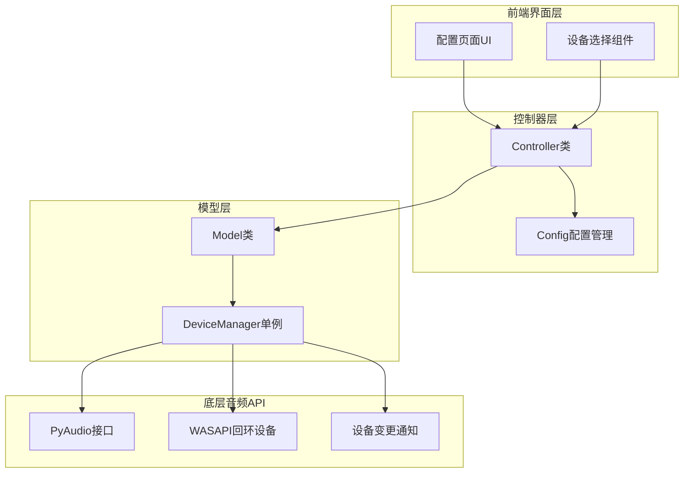
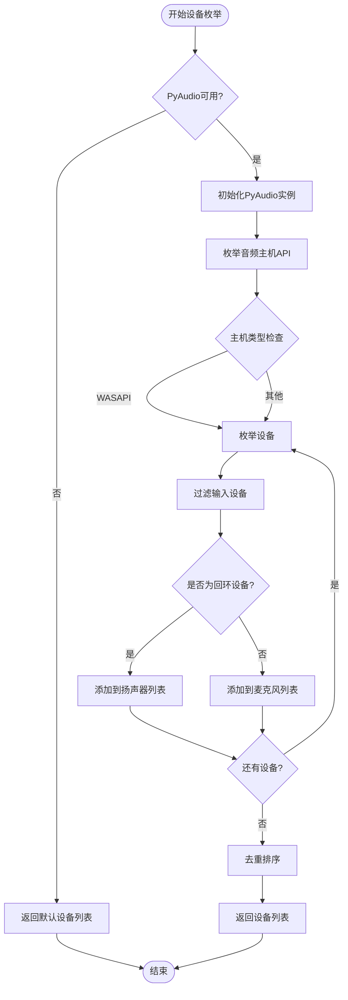
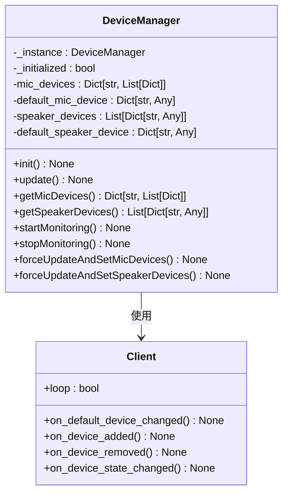
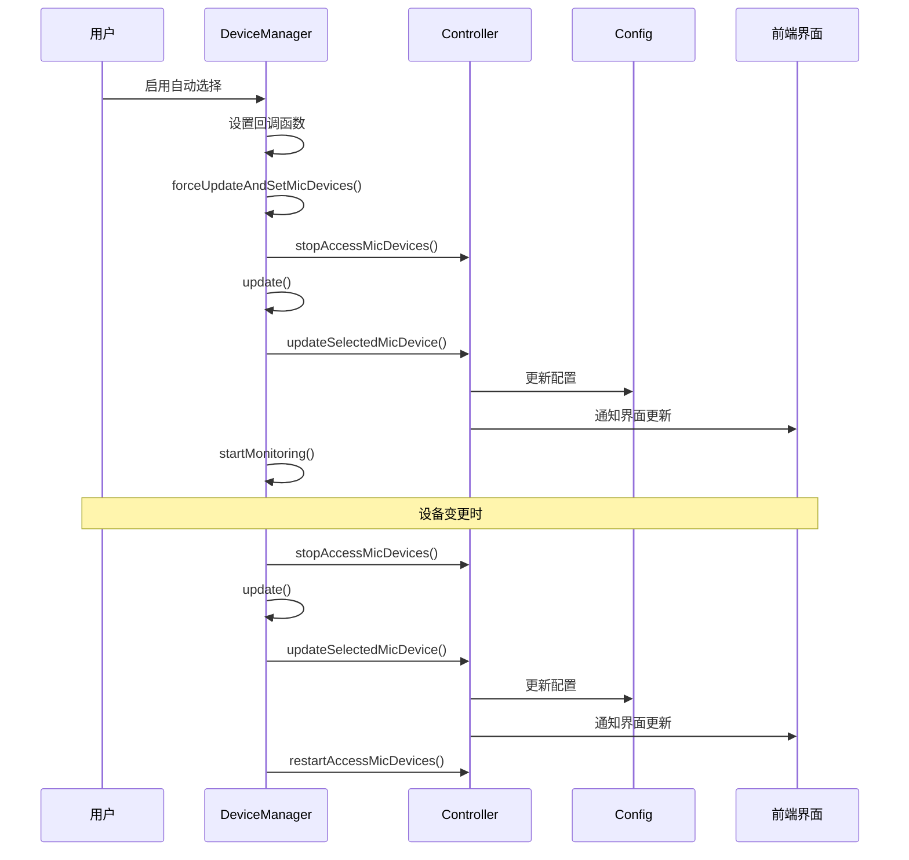
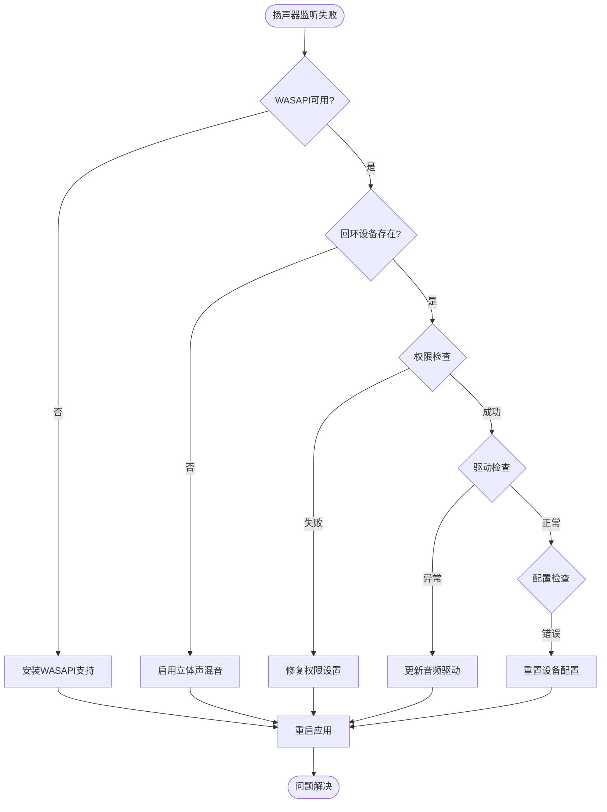
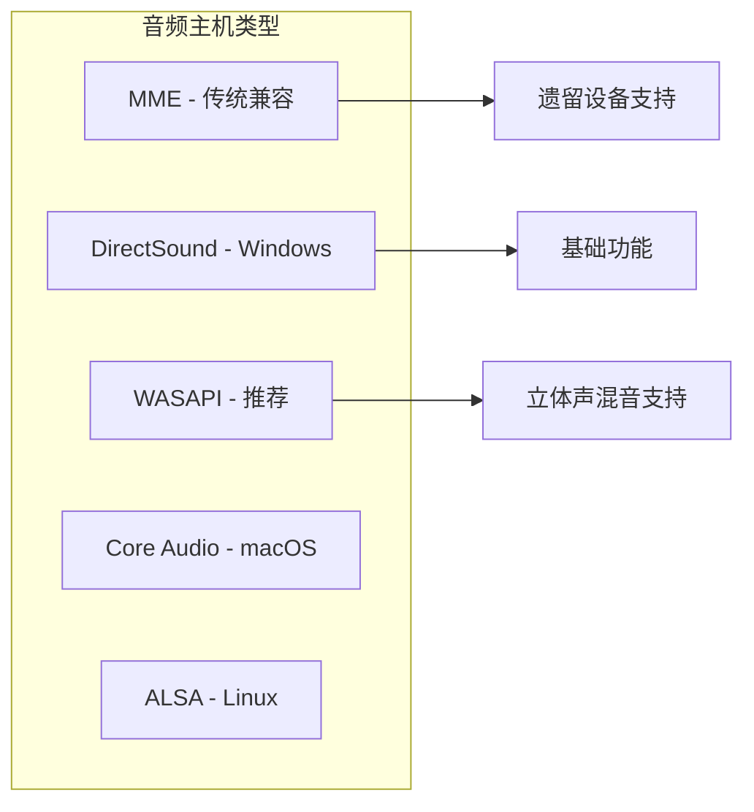
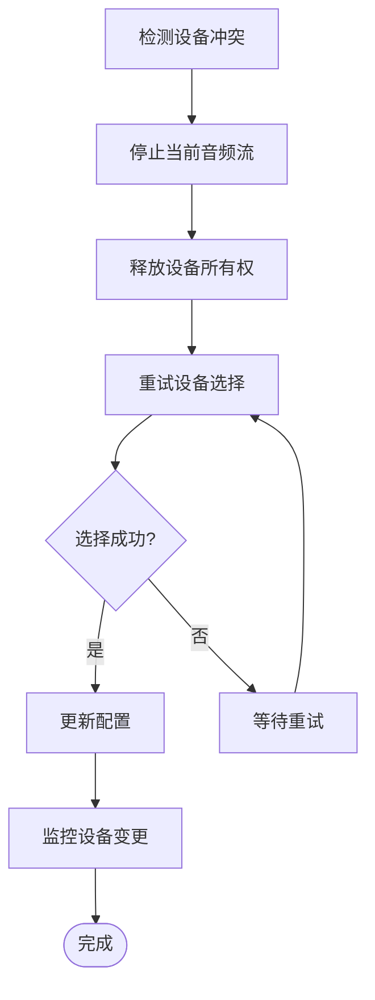
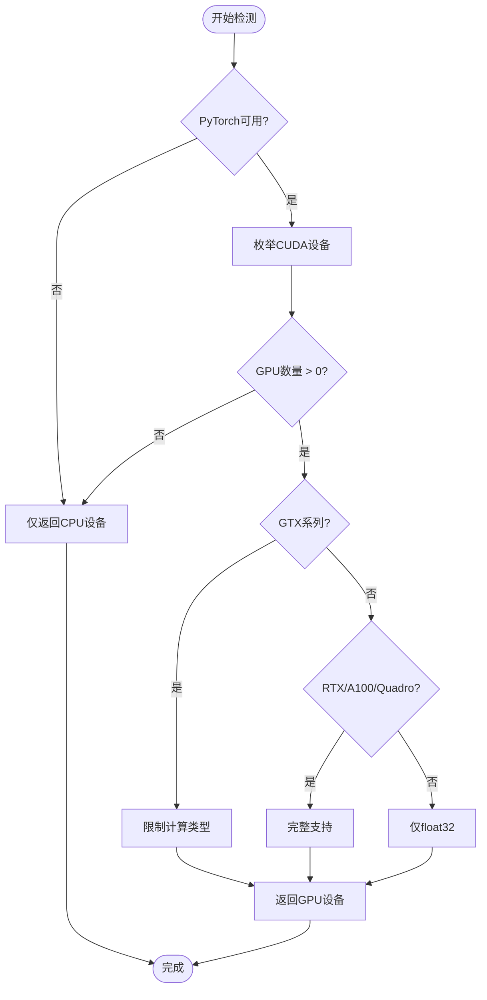
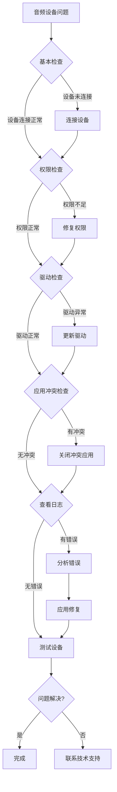

# 音频设备问题解决指南

<cite>
**本文档中引用的文件**
- [device_manager.py](file://src-python/device_manager.py)
- [utils.py](file://src-python/utils.py)
- [config.py](file://src-python/config.py)
- [controller.py](file://src-python/controller.py)
- [model.py](file://src-python/model.py)
- [ComputeDevice.jsx](file://src-ui/views/app/config_page/setting_section/setting_box/_components/compute_device/ComputeDevice.jsx)
- [Device.jsx](file://src-ui/views/app/config_page/setting_section/setting_box/device/Device.jsx)
- [device_manager.md](file://src-python/docs/device_manager.md)
- [device_manager_zh.md](file://src-python/docs/device_manager_zh.md)
</cite>

## 目录
1. [简介](#简介)
2. [系统架构概览](#系统架构概览)
3. [音频设备枚举机制](#音频设备枚举机制)
4. [设备管理器核心功能](#设备管理器核心功能)
5. [常见问题诊断](#常见问题诊断)
6. [配置页面操作指南](#配置页面操作指南)
7. [权限问题解决方案](#权限问题解决方案)
8. [设备冲突处理](#设备冲突处理)
9. [GPU驱动与计算资源检测](#gpu驱动与计算资源检测)
10. [故障排除流程](#故障排除流程)
11. [最佳实践建议](#最佳实践建议)

## 简介

VRCT项目采用了一套完整的音频设备管理系统，通过PyAudioWPatch和WASAPI技术实现跨平台音频设备枚举和管理。本指南将深入解析设备管理器的工作原理，帮助用户解决音频设备识别、麦克风输入、扬声器监听等常见问题。

## 系统架构概览

VRCT的音频设备管理系统采用分层架构设计，主要包含以下核心组件：



**图表来源**
- [controller.py](file://src-python/controller.py#L1-L50)
- [device_manager.py](file://src-python/device_manager.py#L57-L120)
- [config.py](file://src-python/config.py#L531-L540)

**章节来源**
- [device_manager.py](file://src-python/device_manager.py#L57-L120)
- [controller.py](file://src-python/controller.py#L11-L30)

## 音频设备枚举机制

### PyAudioWPatch集成

VRCT使用PyAudioWPatch库实现对Windows WASAPI API的完整支持，包括回环设备（立体声混音）的枚举功能。



**图表来源**
- [device_manager.py](file://src-python/device_manager.py#L154-L238)

### WASAPI回环设备检测

WASAPI回环设备是VRCT识别VRChat对方语音的关键功能：

| 设备类型 | WASAPI名称 | 识别特征 | 用途 |
|---------|-----------|---------|------|
| 麦克风输入 | Windows WASAPI | maxInputChannels > 0 | 录制用户语音 |
| 扬声器回环 | Windows WASAPI | isLoopbackDevice = True | 录制系统音频 |
| 默认输入设备 | defaultInputDevice | API默认值 | 自动选择首选设备 |
| 默认输出设备 | defaultOutputDevice | API默认值 | 自动选择首选输出 |

**章节来源**
- [device_manager.py](file://src-python/device_manager.py#L154-L238)

## 设备管理器核心功能

### 单例模式设计

DeviceManager采用单例模式确保全局唯一性：



**图表来源**
- [device_manager.py](file://src-python/device_manager.py#L57-L120)
- [device_manager.py](file://src-python/device_manager.py#L26-L55)

### 自动设备选择机制

当启用自动设备选择时，系统会监控设备变更并自动切换：



**图表来源**
- [controller.py](file://src-python/controller.py#L1113-L1119)
- [device_manager.py](file://src-python/device_manager.py#L507-L517)

**章节来源**
- [device_manager.py](file://src-python/device_manager.py#L57-L120)
- [controller.py](file://src-python/controller.py#L1113-L1119)

## 常见问题诊断

### 麦克风设备无法识别

**症状表现：**
- 配置页面显示"NoDevice"
- 运行时提示"没有检测到麦克风设备"
- 音量检测失败

**诊断步骤：**

| 检查项目 | 检查方法 | 正常结果 | 异常处理 |
|---------|---------|---------|---------|
| PyAudio安装 | 导入测试 | 成功导入 | 重新安装依赖包 |
| 设备权限 | Windows设置 | 已授权应用访问 | 检查隐私设置 |
| 驱动状态 | 设备管理器 | 驱动正常 | 更新或重装驱动 |
| 默认设备 | 系统设置 | 有默认输入设备 | 设置默认设备 |

**解决方案：**

1. **检查PyAudio可用性**
   ```python
   # 在Python环境中测试
   try:
       from pyaudiowpatch import PyAudio, paWASAPI
       p = PyAudio()
       print(f"主机数量: {p.get_host_api_count()}")
       p.terminate()
   except Exception as e:
       print(f"PyAudio不可用: {e}")
   ```

2. **验证设备权限**
   - Windows设置 → 隐私 → 音频访问
   - 确保VRCT应用具有麦克风访问权限

3. **检查设备连接**
   - 确认麦克风物理连接正常
   - 测试其他应用程序是否能识别设备

**章节来源**
- [device_manager.py](file://src-python/device_manager.py#L146-L152)
- [controller.py](file://src-python/controller.py#L154-L169)

### 扬声器监听失败

**症状表现：**
- 无法录制系统音频
- 扬声器设备列表为空
- 回环设备识别失败

**诊断流程：**



**图表来源**
- [device_manager.py](file://src-python/device_manager.py#L182-L230)

**章节来源**
- [device_manager.py](file://src-python/device_manager.py#L182-L230)

### 默认设备自动检测机制

系统提供智能的默认设备检测功能：

| 检测阶段 | 检测内容 | 实现方式 | 备用方案 |
|---------|---------|---------|---------|
| 主机API检测 | 音频主机类型 | p.get_host_api_count() | 使用默认主机 |
| 输入设备检测 | 可录音设备 | maxInputChannels > 0 | 显示"NoDevice" |
| 输出设备检测 | 默认输出设备 | defaultOutputDevice | 使用第一个设备 |
| 回环设备检测 | 系统音频录制 | isLoopbackDevice | 禁用回环功能 |

**章节来源**
- [device_manager.py](file://src-python/device_manager.py#L167-L230)

## 配置页面操作指南

### 音频主机选择

在配置页面的"设备"选项卡中，用户可以手动选择音频主机：



**图表来源**
- [Device.jsx](file://src-ui/views/app/config_page/setting_section/setting_box/device/Device.jsx#L81-L106)

### 手动设备选择

用户可以通过配置页面手动选择具体的音频设备：

| 选择项 | 说明 | 注意事项 |
|-------|------|---------|
| 音频主机 | 音频API类型 | 推荐使用WASAPI |
| 麦克风设备 | 输入设备名称 | 确保设备可录音 |
| 扬声器设备 | 输出设备名称 | 用于系统音频录制 |
| 自动选择 | 开启自动检测 | 关闭后需手动选择 |

**章节来源**
- [Device.jsx](file://src-ui/views/app/config_page/setting_section/setting_box/device/Device.jsx#L81-L142)

## 权限问题解决方案

### Windows麦克风访问被阻止

**问题描述：** 应用程序无法访问麦克风硬件

**解决步骤：**

1. **检查Windows隐私设置**
   ```
   设置 → 隐私和安全性 → 音频访问
   确保VRCT应用已开启麦克风访问权限
   ```

2. **检查应用权限**
   ```
   右键点击VRCT快捷方式 → 属性 → 兼容性 → 以管理员身份运行此程序
   ```

3. **检查设备属性**
   ```
   设备管理器 → 麦克风 → 右键 → 属性 → 驱动程序 → 更新驱动程序
   ```

### COM初始化权限问题

**问题描述：** 设备变更监控功能失效

**解决方案：**
```python
# 检查COM可用性
try:
    import comtypes
    comtypes.CoInitialize()
    # 执行COM操作
    comtypes.CoUninitialize()
except Exception as e:
    print(f"COM初始化失败: {e}")
    # 使用轮询模式替代
```

**章节来源**
- [device_manager.py](file://src-python/device_manager.py#L266-L305)

## 设备冲突处理

### 其他程序独占音频设备

**问题现象：**
- 设备选择后立即变回"NoDevice"
- 应用程序报告"设备正在使用中"

**处理策略：**



**图表来源**
- [controller.py](file://src-python/controller.py#L112-L138)

### 设备变更监控机制

系统提供实时的设备变更监控：

| 监控事件 | 触发条件 | 处理动作 |
|---------|---------|---------|
| 默认设备变更 | 系统默认设备改变 | 自动切换到新默认设备 |
| 设备添加 | 新设备插入 | 更新设备列表 |
| 设备移除 | 设备断开连接 | 标记设备为无效 |
| 设备状态变化 | 设备状态改变 | 重新检测设备可用性 |

**章节来源**
- [device_manager.py](file://src-python/device_manager.py#L266-L305)
- [controller.py](file://src-python/controller.py#L112-L138)

## GPU驱动与计算资源检测

### getComputeDeviceList()功能

utils.py中的`getComputeDeviceList()`函数不仅检测GPU设备，还排除可能导致音频服务启动失败的驱动问题：



**图表来源**
- [utils.py](file://src-python/utils.py#L92-L132)

### GPU驱动兼容性检查

| GPU系列 | 支持的计算类型 | 性能特点 | 注意事项 |
|---------|---------------|---------|---------|
| GTX系列 | float32 | 基础支持 | 部分类型被限制 |
| RTX系列 | int8_bfloat16等 | 高性能 | 推荐使用 |
| A100 | 完整支持 | 顶级性能 | 企业级GPU |
| Quadro系列 | 完整支持 | 专业认证 | 工作站GPU |

**章节来源**
- [utils.py](file://src-python/utils.py#L92-L132)

## 故障排除流程

### 系统化诊断步骤



### 日志分析指南

系统提供详细的错误日志记录：

| 日志级别 | 记录内容 | 查找位置 | 解决方案 |
|---------|---------|---------|---------|
| ERROR | 设备初始化失败 | error.log | 检查硬件连接 |
| INFO | 设备变更事件 | process.log | 监控设备状态 |
| DEBUG | 详细执行过程 | debug.log | 分析具体问题 |

**章节来源**
- [utils.py](file://src-python/utils.py#L280-L291)

## 最佳实践建议

### 配置优化建议

1. **优先使用WASAPI主机**
   - 提供最佳的设备兼容性和功能支持
   - 支持回环设备录制系统音频

2. **启用自动设备选择**
   - 减少手动配置工作量
   - 自动适应设备变更

3. **定期检查设备状态**
   - 监控设备可用性
   - 及时处理设备冲突

### 性能优化建议

1. **避免频繁设备切换**
   - 减少不必要的设备枚举操作
   - 使用设备缓存机制

2. **合理设置监控频率**
   - 平衡响应速度和系统资源消耗
   - 根据实际需求调整轮询间隔

3. **优化内存使用**
   - 及时释放不用的设备资源
   - 避免内存泄漏

### 维护建议

1. **定期更新驱动程序**
   - 保持音频驱动程序最新
   - 确保兼容性

2. **备份配置文件**
   - 保存重要的设备配置
   - 方便快速恢复

3. **监控系统资源**
   - 关注CPU和内存使用情况
   - 防止资源耗尽

通过遵循这些最佳实践，用户可以最大化VRCT音频设备管理系统的稳定性和性能，减少常见问题的发生概率。