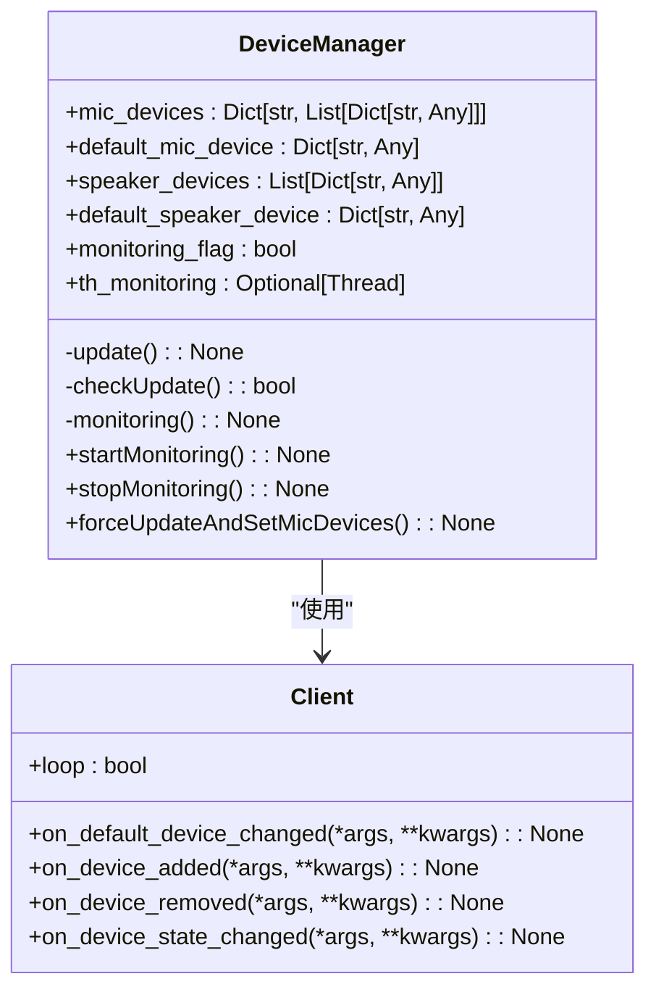
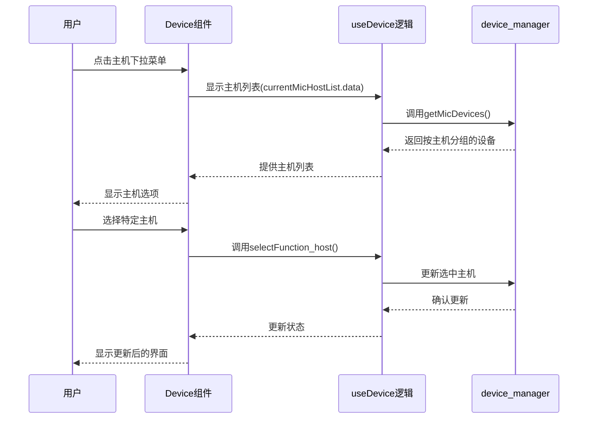
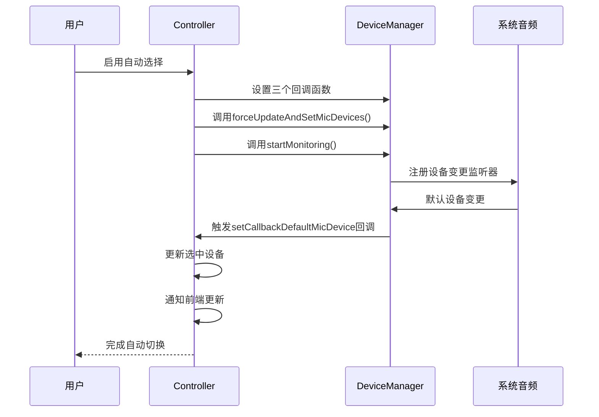
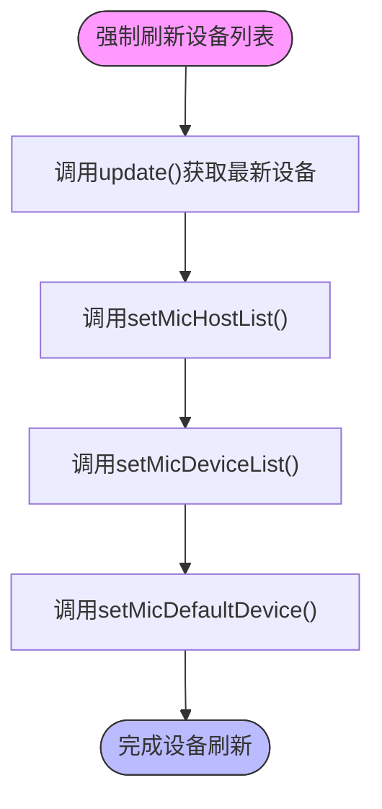

# 音频设备选择策略

<cite>
**本文档引用的文件**
- [device_manager.py](file://src-python/device_manager.py)
- [Device.jsx](file://src-ui/views/app/config_page/setting_section/setting_box/device/Device.jsx)
- [controller.py](file://src-python/controller.py)
</cite>

## 目录
1. [多音频主机环境下的麦克风设备管理](#多音频主机环境下的麦克风设备管理)
2. [前端设备选择界面实现](#前端设备选择界面实现)
3. '自动选择'功能工作原理
4. 手动设备选择与热插拔处理
5. 强制刷新设备列表机制

## 多音频主机环境下的麦克风设备管理

在多音频主机环境下，`device_manager.py` 文件中的 `mic_devices` 字典按主机API（如WASAPI、MME）分组存储设备。这种结构允许系统清晰地组织和管理来自不同音频API的麦克风设备。

`DeviceManager` 类通过 `update()` 方法从PyAudio获取所有可用的音频主机API，并为每个主机API收集其输入设备。设备信息以字典形式存储，其中键是主机API名称，值是该主机下所有麦克风设备的列表。每个设备包含索引、名称等元数据。

当系统初始化时，`DeviceManager` 会创建一个单例实例，并通过 `init()` 方法初始化内部状态。该方法设置了 `mic_devices`、`default_mic_device` 等核心属性的初始值，并为后续的设备监控做好准备。

**图表来源**
- [device_manager.py](file://src-python/device_manager.py#L56-L521)

**本节来源**
- [device_manager.py](file://src-python/device_manager.py#L56-L521)

## 前端设备选择界面实现

前端 `Device.jsx` 组件实现了主机和设备的两级下拉菜单渲染。该组件使用 `MultiDropdownMenuContainer` 容器来组织设备选择界面，其中包含一个用于"自动选择"功能的开关和两个下拉菜单：一个用于选择主机API，另一个用于选择具体设备。

组件通过 `useDevice` hook 获取当前的设备状态，包括是否启用自动选择、当前选中的主机和设备等。当用户与界面交互时，相应的回调函数（如 `selectFunction_host` 和 `selectFunction_device`）会被调用，更新应用状态。

**图表来源**
- [Device.jsx](file://src-ui/views/app/config_page/setting_section/setting_box/device/Device.jsx#L23-L209)
- [device_manager.py](file://src-python/device_manager.py#L459-L469)

**本节来源**
- [Device.jsx](file://src-ui/views/app/config_page/setting_section/setting_box/device/Device.jsx#L23-L209)

## '自动选择'功能工作原理

'自动选择'功能通过监控系统默认设备变更并自动切换来实现。当用户启用此功能时，系统会设置一系列回调函数来处理设备变更事件。

在 `controller.py` 中，`applyAutoMicSelect()` 方法配置了三个关键回调：
1. `setCallbackProcessBeforeUpdateMicDevices()`：在设备更新前停止访问麦克风设备
2. `setCallbackDefaultMicDevice()`：当默认设备变更时更新选中的麦克风设备
3. `setCallbackProcessAfterUpdateMicDevices()`：在设备更新后重新启动麦克风设备访问

**图表来源**
- [controller.py](file://src-python/controller.py#L1113-L1118)
- [device_manager.py](file://src-python/device_manager.py#L324-L353)

**本节来源**
- [controller.py](file://src-python/controller.py#L1113-L1136)
- [device_manager.py](file://src-python/device_manager.py#L324-L353)

## 手动设备选择与热插拔处理

手动选择特定设备的场景中，系统需要处理USB热插拔导致的设备索引变化。由于设备索引可能在设备重新连接时发生变化，系统不依赖索引进行设备识别，而是通过设备名称和主机API的组合来标识设备。

当USB设备被热插拔时，`DeviceManager` 的监控线程会检测到设备变更。通过 `Client` 类的回调方法（如 `on_device_added` 和 `on_device_removed`），系统能够及时感知设备状态变化，并触发设备列表的更新。

对于手动选择的设备，即使设备被暂时移除，系统也会记住用户的偏好设置。当相同型号的设备重新连接时，系统会尝试自动选择之前配置的设备，提供一致的用户体验。

**本节来源**
- [device_manager.py](file://src-python/device_manager.py#L26-L51)
- [device_manager.py](file://src-python/device_manager.py#L266-L305)

## 强制刷新设备列表机制

`forceUpdateAndSetMicDevices()` 方法用于强制刷新设备列表，其使用场景包括：
1. 应用启动时首次获取设备列表
2. 用户手动刷新设备列表
3. 启用"自动选择"功能时的初始化
4. 检测到设备异常状态后恢复

该方法执行一系列操作来确保设备信息的完整更新：
1. 调用 `update()` 获取最新的设备信息
2. 调用 `setMicHostList()` 通知主机列表变更
3. 调用 `setMicDeviceList()` 通知设备列表变更
4. 调用 `setMicDefaultDevice()` 通知默认设备变更

**图表来源**
- [device_manager.py](file://src-python/device_manager.py#L507-L512)
- [controller.py](file://src-python/controller.py#L1117)

**本节来源**
- [device_manager.py](file://src-python/device_manager.py#L507-L512)
- [controller.py](file://src-python/controller.py#L1117)