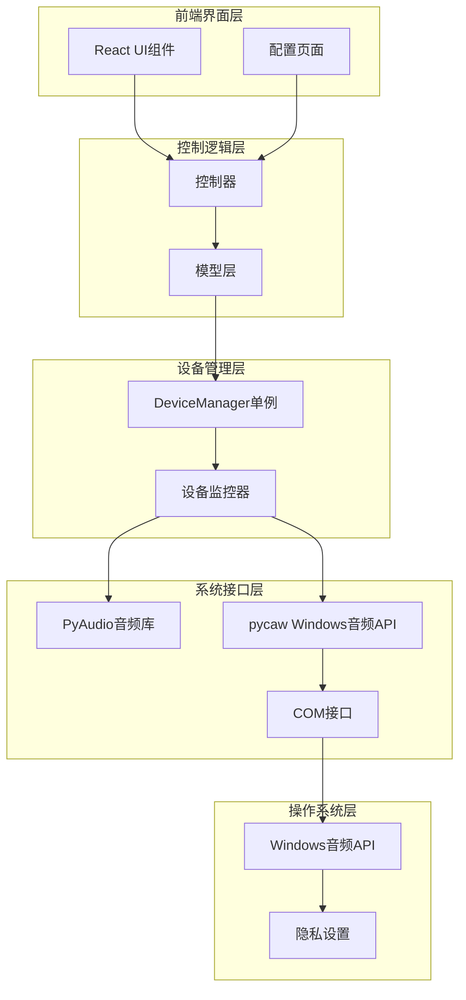
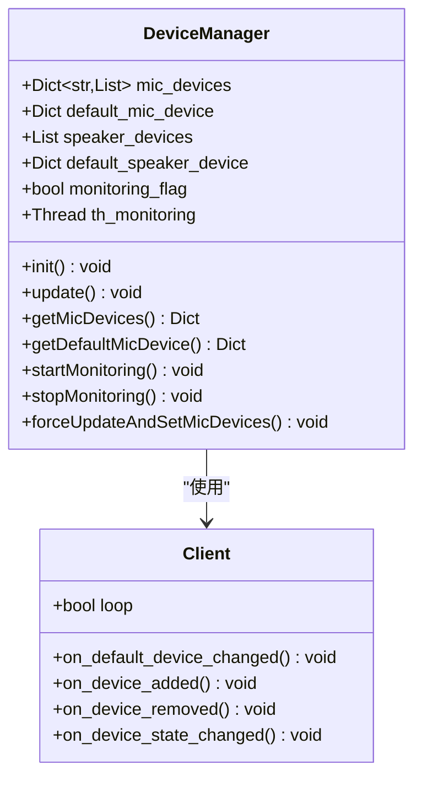
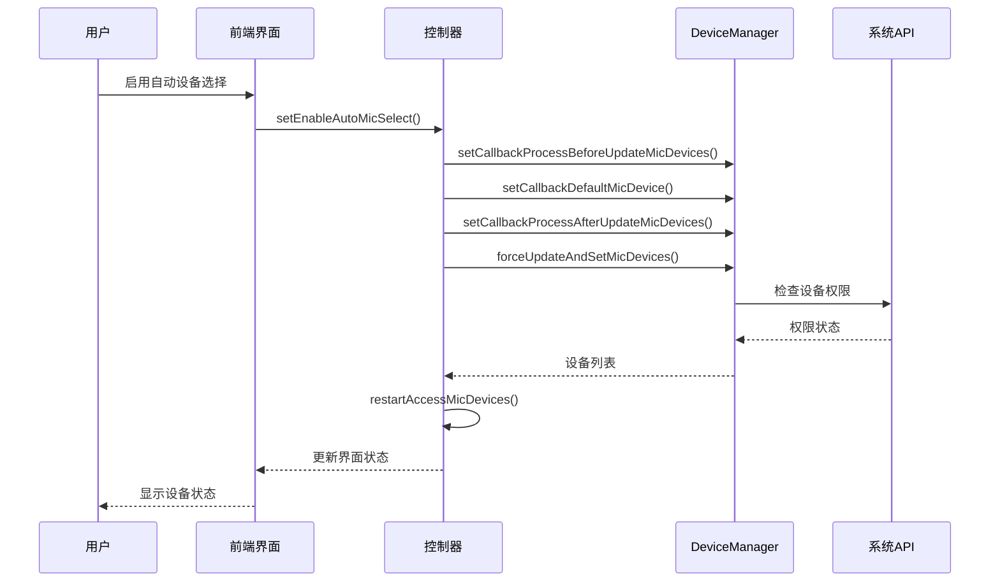
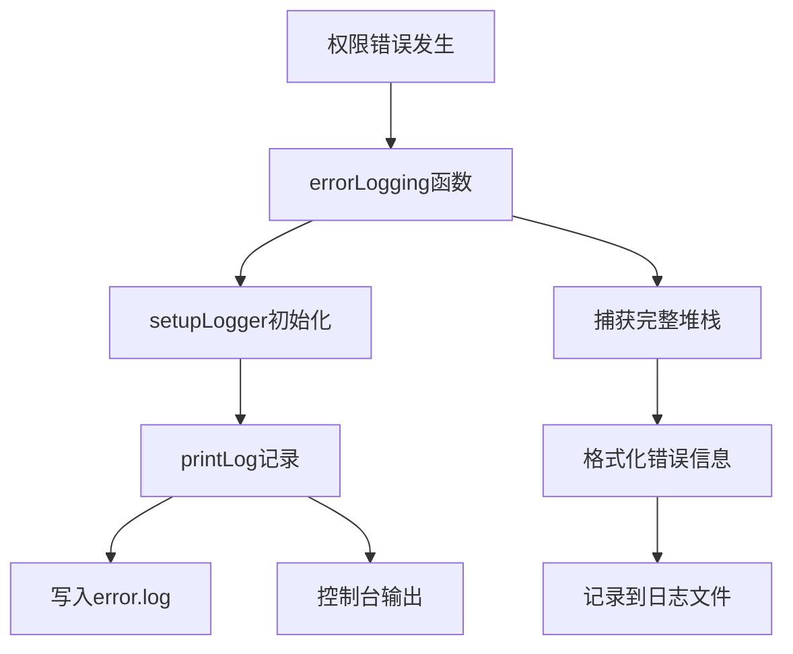

# 麦克风权限配置

<cite>
**本文档中引用的文件**
- [device_manager.py](file://src-python/device_manager.py)
- [utils.py](file://src-python/utils.py)
- [controller.py](file://src-python/controller.py)
- [model.py](file://src-python/model.py)
- [Device.jsx](file://src-ui/views/app/config_page/setting_section/setting_box/device/Device.jsx)
- [config.md](file://src-python/docs/config.md)
- [device_manager.md](file://src-python/docs/device_manager.md)
</cite>

## 目录
1. [简介](#简介)
2. [系统架构概览](#系统架构概览)
3. [麦克风设备检测机制](#麦克风设备检测机制)
4. [权限配置流程](#权限配置流程)
5. [错误处理与故障排除](#错误处理与故障排除)
6. [Windows隐私设置配置](#windows隐私设置配置)
7. [最佳实践建议](#最佳实践建议)
8. [总结](#总结)

## 简介

VRCT应用程序依赖于操作系统的音频设备访问权限来实现语音转文字功能。当应用程序无法访问麦克风时，系统会返回空设备列表或默认的"NoDevice"状态，导致语音识别功能无法正常工作。本指南将详细说明如何在Windows 10/11系统中正确配置麦克风访问权限，以及应用程序内部的权限检测和错误处理机制。

## 系统架构概览

VRCT的音频设备管理采用分层架构设计，包含以下核心组件：

**图表来源**
- [device_manager.py](file://src-python/device_manager.py#L57-L529)
- [controller.py](file://src-python/controller.py#L1-L50)

## 麦克风设备检测机制

### DeviceManager核心功能

DeviceManager是整个音频设备管理系统的核心，负责设备发现、状态监控和权限验证。

**图表来源**
- [device_manager.py](file://src-python/device_manager.py#L57-L120)
- [device_manager.py](file://src-python/device_manager.py#L26-L55)

### 设备检测流程

应用程序通过以下步骤检测麦克风设备：

1. **初始化阶段**: DeviceManager实例化时自动初始化设备容器
2. **设备扫描**: 使用PyAudio枚举所有输入设备
3. **权限验证**: 检查设备是否具有录音权限
4. **状态监控**: 启动后台线程持续监控设备变化

**章节来源**
- [device_manager.py](file://src-python/device_manager.py#L79-L138)

### 默认状态处理

当检测不到可用麦克风时，系统会设置默认状态：

| 组件 | 默认状态 | 描述 |
|------|----------|------|
| mic_devices | {"NoHost": [{"index": -1, "name": "NoDevice"}]} | 空设备列表标识 |
| default_mic_device | {"host": {"index": -1, "name": "NoHost"}, "device": {"index": -1, "name": "NoDevice"}} | 默认主机和设备 |
| 错误回调 | 返回默认值 | 防止程序崩溃 |

**章节来源**
- [device_manager.py](file://src-python/device_manager.py#L87-L91)

## 权限配置流程

### 应用程序权限管理

VRCT通过以下机制管理麦克风访问权限：

**图表来源**
- [controller.py](file://src-python/controller.py#L1113-L1118)

### 权限检查回调机制

应用程序定义了三个关键回调函数来处理权限变化：

| 回调函数 | 作用 | 触发时机 |
|----------|------|----------|
| stopAccessMicDevices | 停止当前音频处理 | 设备即将变更前 |
| updateSelectedMicDevice | 更新选中设备 | 检测到新默认设备 |
| restartAccessMicDevices | 重新启动音频处理 | 设备变更完成后 |

**章节来源**
- [controller.py](file://src-python/controller.py#L1113-L1118)

## 错误处理与故障排除

### 日志记录系统

VRCT使用统一的日志记录系统来跟踪权限相关问题：

**图表来源**
- [utils.py](file://src-python/utils.py#L278-L290)

### 常见错误场景

| 错误类型 | 症状 | 解决方案 |
|----------|------|----------|
| 权限被拒绝 | 设备列表为空 | 检查Windows隐私设置 |
| 设备不可用 | 返回"NoDevice" | 重新插拔设备或重启 |
| COM初始化失败 | 监控功能失效 | 检查系统音频服务 |
| PyAudio加载失败 | 设备检测受限 | 安装必要的音频库 |

**章节来源**
- [device_manager.py](file://src-python/device_manager.py#L266-L300)

### 故障诊断步骤

1. **检查设备连接**: 确认麦克风物理连接正常
2. **验证系统权限**: 检查Windows隐私设置
3. **重启应用程序**: 清除临时状态
4. **查看日志文件**: 分析具体错误原因

**章节来源**
- [utils.py](file://src-python/utils.py#L227-L240)

## Windows隐私设置配置

### 导航至隐私设置

用户需要按照以下步骤配置Windows隐私设置：

#### 步骤1：打开设置面板
- 按下 `Win + I` 打开Windows设置
- 选择"隐私和安全性"选项

#### 步骤2：访问麦克风设置
- 在左侧菜单中选择"麦克风"
- 确保"允许应用访问麦克风"开关处于开启状态

#### 步骤3：配置应用权限
- 向下滚动找到"应用权限"部分
- 点击"VRCT"应用条目
- 确保"麦克风"权限开关已开启

### 权限验证

完成配置后，用户应验证权限设置：

1. **确认开关状态**: 确保所有相关开关都处于"开启"状态
2. **测试设备功能**: 在其他应用程序中测试麦克风功能
3. **重启VRCT**: 应用权限更改后需要重启应用程序

**章节来源**
- [Device.jsx](file://src-ui/views/app/config_page/setting_section/setting_box/device/Device.jsx#L58-L60)

## 最佳实践建议

### 系统配置建议

1. **定期更新驱动程序**: 确保音频设备驱动程序为最新版本
2. **禁用音频增强**: 在设备属性中禁用不必要的音频增强功能
3. **检查电源管理**: 确保音频设备不会因节能而被禁用

### 应用程序使用建议

1. **启用自动设备选择**: 让应用程序自动处理设备变更
2. **定期重启应用**: 避免长时间运行导致的状态异常
3. **监控日志文件**: 定期检查error.log了解潜在问题

### 故障排除清单

- [ ] 检查硬件连接
- [ ] 验证Windows隐私设置
- [ ] 确认应用权限已授予
- [ ] 重启音频服务
- [ ] 更新驱动程序
- [ ] 查看应用程序日志

**章节来源**
- [controller.py](file://src-python/controller.py#L1120-L1136)

## 总结

VRCT的麦克风权限配置涉及多个层面的协作：从Windows系统隐私设置到应用程序内部的权限检测机制。当遇到麦克风访问问题时，用户应该首先检查Windows隐私设置中的应用权限，然后根据应用程序提供的错误信息进行进一步排查。

关键要点包括：
- Windows隐私设置中的"允许应用访问麦克风"必须开启
- VRCT需要明确的麦克风访问权限才能正常工作
- 应用程序具备完善的错误处理和日志记录机制
- 权限更改后需要重启应用程序才能生效

通过遵循本指南的步骤和建议，用户可以有效解决大多数麦克风权限相关的问题，确保VRCT应用程序的语音识别功能正常运行。