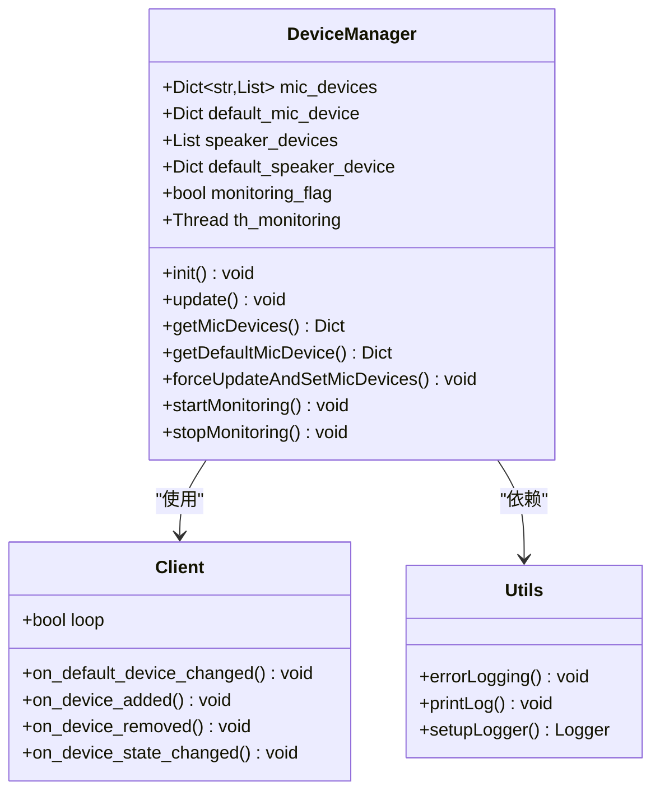
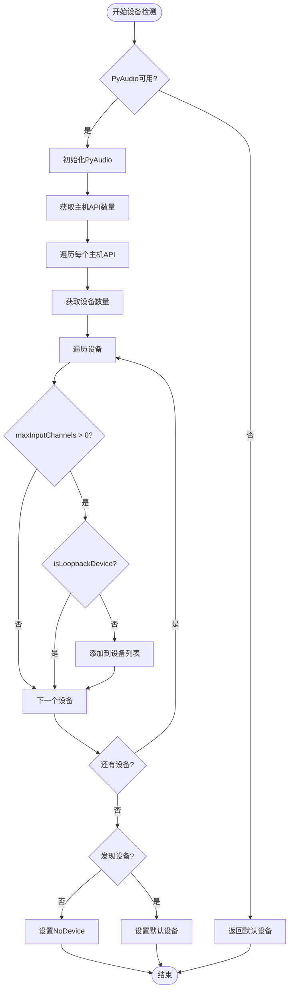
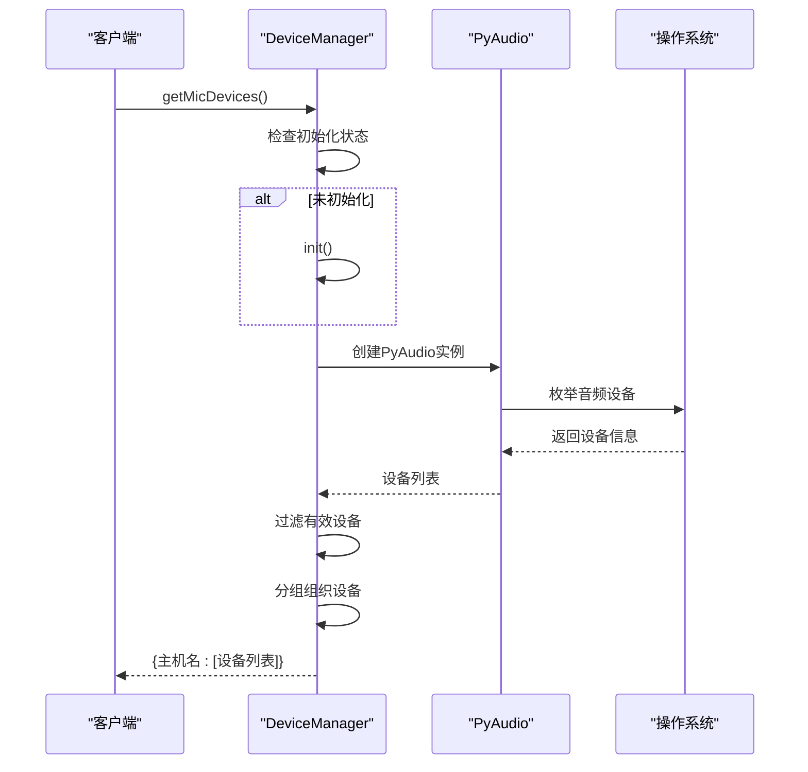
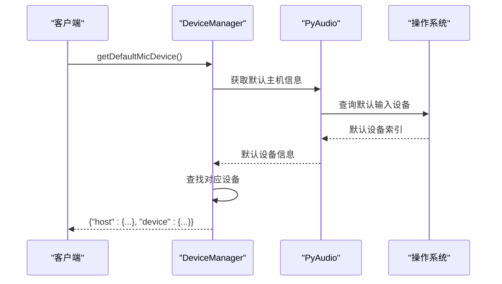
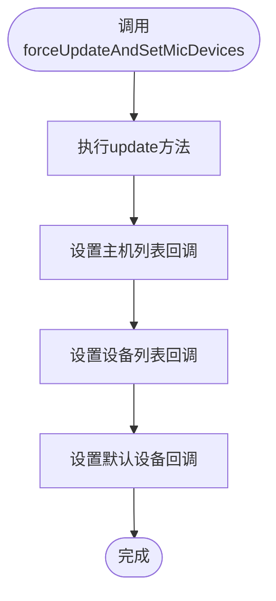
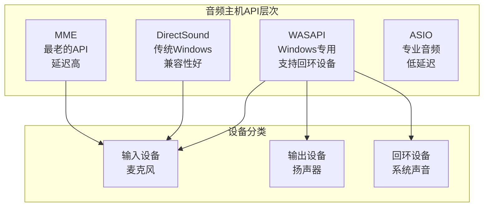
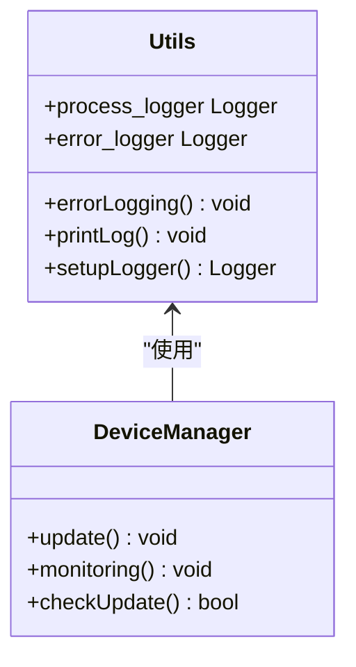
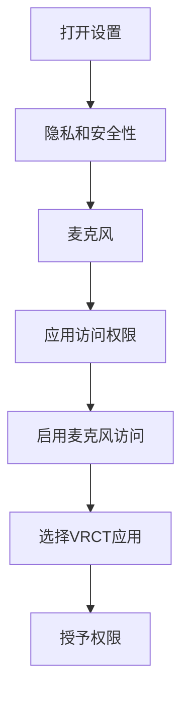
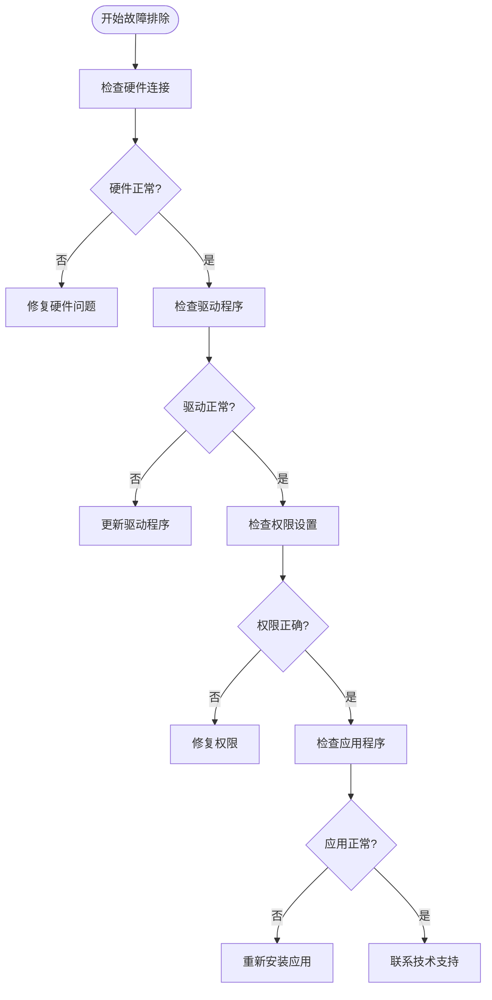

# 麦克风输入问题详细指南

<cite>
**本文档引用的文件**
- [device_manager.py](file://src-python/device_manager.py)
- [utils.py](file://src-python/utils.py)
- [controller.py](file://src-python/controller.py)
- [config.py](file://src-python/config.py)
- [model.py](file://src-python/model.py)
- [device_manager_zh.md](file://src-python/docs/device_manager_zh.md)
</cite>

## 目录
1. [概述](#概述)
2. [核心组件架构](#核心组件架构)
3. [设备检测机制详解](#设备检测机制详解)
4. [麦克风设备获取方法](#麦克风设备获取方法)
5. [强制刷新机制](#强制刷新机制)
6. [多音频主机环境处理](#多音频主机环境处理)
7. [错误诊断与日志分析](#错误诊断与日志分析)
8. [操作系统权限配置](#操作系统权限配置)
9. [故障排除步骤](#故障排除步骤)
10. [最佳实践建议](#最佳实践建议)

## 概述

VRCT应用程序的麦克风输入问题主要涉及设备检测、权限配置和音频流管理等方面。本指南将详细解析`device_manager.py`模块中负责麦克风设备管理的核心机制，帮助用户快速定位和解决输入问题。

## 核心组件架构

### 设备管理器类结构



**图表来源**
- [device_manager.py](file://src-python/device_manager.py#L56-L521)
- [utils.py](file://src-python/utils.py#L240-L290)

**章节来源**
- [device_manager.py](file://src-python/device_manager.py#L56-L123)
- [device_manager_zh.md](file://src-python/docs/device_manager_zh.md#1-L50)

## 设备检测机制详解

### maxInputChannels检测逻辑

设备管理器通过`update()`方法中的关键逻辑检测可用的麦克风设备：



**图表来源**
- [device_manager.py](file://src-python/device_manager.py#L140-L238)

### 关键检测参数

| 参数 | 描述 | 作用 | 默认值 |
|------|------|------|--------|
| `maxInputChannels` | 最大输入声道数 | 确保设备支持录音 | 0 |
| `isLoopbackDevice` | 是否为回环设备 | 过滤系统回环设备 | True |
| `deviceCount` | 设备数量 | 控制遍历范围 | 0 |

**章节来源**
- [device_manager.py](file://src-python/device_manager.py#L162-L163)

## 麦克风设备获取方法

### getMicDevices()方法详解

该方法负责获取所有可用的麦克风设备列表：



**图表来源**
- [device_manager.py](file://src-python/device_manager.py#L458-L469)

### getDefaultMicDevice()方法详解

获取当前系统的默认麦克风设备：



**图表来源**
- [device_manager.py](file://src-python/device_manager.py#L470-L481)

**章节来源**
- [device_manager.py](file://src-python/device_manager.py#L458-L481)

## 强制刷新机制

### forceUpdateAndSetMicDevices()方法

当遇到设备检测问题时，可以使用此方法强制刷新设备状态：



**图表来源**
- [device_manager.py](file://src-python/device_manager.py#L507-L512)

### 使用场景

| 场景 | 方法调用 | 效果 |
|------|----------|------|
| 自动设备选择首次应用 | `applyAutoMicSelect()` | 初始化设备监控 |
| 用户手动刷新 | `forceUpdateAndSetMicDevices()` | 强制重新检测设备 |
| 设备变更后恢复 | `restartAccessMicDevices()` | 重新启用设备功能 |

**章节来源**
- [device_manager.py](file://src-python/device_manager.py#L507-L512)
- [controller.py](file://src-python/controller.py#L1113-L1118)

## 多音频主机环境处理

### 主机API分组机制

设备管理器支持多种音频主机API，每种都有其特点：



**图表来源**
- [device_manager.py](file://src-python/device_manager.py#L156-L166)

### 设备选择策略

| 主机API | 优势 | 劣势 | 推荐场景 |
|---------|------|------|----------|
| WASAPI | 低延迟、支持回环 | 仅Windows | 专业音频应用 |
| DirectSound | 兼容性好 | 延迟较高 | 通用应用 |
| MME | 最广泛的兼容性 | 性能较差 | 兼容性优先 |
| ASIO | 专业级性能 | 需要驱动支持 | 录音制作 |

**章节来源**
- [device_manager.py](file://src-python/device_manager.py#L156-L191)

## 错误诊断与日志分析

### 日志系统架构

VRCT使用专门的日志系统记录设备管理过程中的错误：



**图表来源**
- [utils.py](file://src-python/utils.py#L277-L290)
- [device_manager.py](file://src-python/device_manager.py#L232-L233)

### 常见错误类型及解决方案

| 错误类型 | 症状 | 可能原因 | 解决方案 |
|----------|------|----------|----------|
| 设备枚举失败 | `NoDevice`显示 | PyAudio库缺失 | 安装`pyaudio`包 |
| 权限拒绝 | 访问被拒绝错误 | 麦克风权限未授予 | 检查系统权限设置 |
| COM初始化失败 | Windows特定错误 | COM组件问题 | 重启应用程序 |
| 设备不可用 | 设备状态异常 | 设备被其他程序占用 | 关闭冲突程序 |

**章节来源**
- [utils.py](file://src-python/utils.py#L280-L290)
- [device_manager.py](file://src-python/device_manager.py#L232-L233)

## 操作系统权限配置

### Windows麦克风访问设置

#### 步骤1：打开隐私设置
1. 按`Win + I`打开设置
2. 选择"隐私和安全性"
3. 点击"麦克风"选项

#### 步骤2：启用应用访问权限


#### 步骤3：验证权限状态
- 确保"允许应用访问麦克风"开关处于开启状态
- 检查VRCT应用是否在权限列表中
- 验证"其他应用"的麦克风访问权限

### 权限检查清单

| 检查项 | 状态 | 说明 |
|--------|------|------|
| 系统级麦克风权限 | ✅ 已授权 | Windows隐私设置中启用 |
| 应用程序权限 | ✅ 已授权 | VRCT具有麦克风访问权 |
| 防火墙设置 | ✅ 无阻止 | 网络防火墙未阻止音频访问 |
| 驱动程序状态 | ✅ 正常 | 音频驱动程序正常工作 |

**章节来源**
- [device_manager.py](file://src-python/device_manager.py#L273-L288)

## 故障排除步骤

### 第一步：基本检查



### 第二步：设备检测测试

1. **手动刷新设备列表**
   ```python
   # 在Python交互环境中测试
   from device_manager import device_manager
   device_manager.forceUpdateAndSetMicDevices()
   devices = device_manager.getMicDevices()
   print(devices)
   ```

2. **检查默认设备**
   ```python
   default_device = device_manager.getDefaultMicDevice()
   print(default_device)
   ```

3. **监控设备变化**
   ```python
   device_manager.startMonitoring()
   # 等待设备变化事件
   ```

### 第三步：日志分析

查看应用程序日志文件：
- `process.log` - 进程操作日志
- `error.log` - 错误信息日志

重点关注以下内容：
- 设备枚举失败的详细错误信息
- 权限检查相关的警告
- COM初始化失败的记录

**章节来源**
- [device_manager.py](file://src-python/device_manager.py#L507-L512)
- [controller.py](file://src-python/controller.py#L1113-L1118)

## 最佳实践建议

### 配置优化

1. **定期刷新设备列表**
   - 在应用程序启动时调用`forceUpdateAndSetMicDevices()`
   - 设置定时任务定期检查设备状态

2. **错误处理策略**
   - 实现设备切换的降级机制
   - 提供手动选择设备的界面
   - 记录设备变更的历史信息

3. **性能优化**
   - 避免频繁的设备枚举操作
   - 使用设备监控而非轮询
   - 缓存设备信息减少重复查询

### 开发建议

1. **回调函数设计**
   ```python
   def on_device_change(host, device):
       """设备变更回调"""
       # 实现设备切换逻辑
       pass
   ```

2. **错误恢复机制**
   ```python
   try:
       device_manager.update()
   except Exception as e:
       # 记录错误并尝试恢复
       errorLogging()
       # 使用备用设备或提示用户
   ```

3. **用户体验优化**
   - 提供清晰的设备状态指示
   - 显示详细的错误信息和解决建议
   - 实现自动重试机制

**章节来源**
- [device_manager.py](file://src-python/device_manager.py#L266-L305)
- [controller.py](file://src-python/controller.py#L1113-L1118)

## 结论

通过本指南的详细分析，用户可以全面了解VRCT应用程序中麦克风设备管理的工作原理，掌握设备检测、权限配置和故障排除的关键技能。当遇到麦克风输入问题时，按照本指南的步骤逐一排查，通常能够快速定位并解决问题。如果问题仍然存在，建议查看详细的日志文件或联系技术支持团队获取进一步的帮助。