# Gemini提示词设计

<cite>
**本文档中引用的文件**
- [translation_gemini.yml](file://src-python/models/translation/prompt/translation_gemini.yml)
- [translation_gemini.py](file://src-python/models/translation/translation_gemini.py)
- [translation_openai.yml](file://src-python/models/translation/prompt/translation_openai.yml)
- [translation_utils.py](file://src-python/models/translation/translation_utils.py)
- [languages.yml](file://src-python/models/translation/languages/languages.yml)
- [translation_translator.py](file://src-python/models/translation/translation_translator.py)
- [controller.py](file://src-python/controller.py)
- [translation_gemini.md](file://src-python/docs/details/translation_gemini.md)
</cite>

## 目录
1. [简介](#简介)
2. [提示词配置结构](#提示词配置结构)
3. [Gemini特定优化](#gemini特定优化)
4. [与OpenAI模板对比](#与openai模板对比)
5. [输出格式控制机制](#输出格式控制机制)
6. [提示词注入流程](#提示词注入流程)
7. [系统架构分析](#系统架构分析)
8. [性能影响评估](#性能影响评估)
9. [最佳实践建议](#最佳实践建议)
10. [总结](#总结)

## 简介

Google Gemini模型的翻译提示词设计是一个精心优化的语言处理系统，专门针对Google的生成式AI模型进行了深度定制。该系统通过标准化的YAML配置文件和动态模板注入机制，实现了高效、一致的多语言翻译服务。

本文档详细分析了translation_gemini.yml中的提示词配置，探讨了其针对Gemini模型优化的语言表达方式和指令结构，并与OpenAI模板进行对比分析，阐述了在多语言支持和输出格式控制方面的独特优势。

## 提示词配置结构

### 基础配置框架

Gemini提示词采用简洁而高效的YAML配置格式，包含以下核心元素：

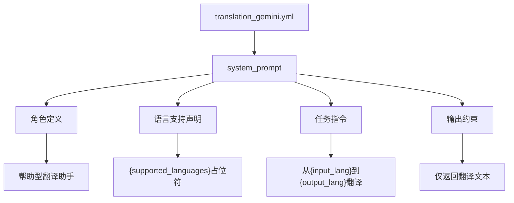

**图表来源**
- [translation_gemini.yml](file://src-python/models/translation/prompt/translation_gemini.yml#L1-L7)

### 动态参数替换机制

提示词配置支持四个关键的动态参数替换：

| 参数名称 | 描述 | 示例值 |
|---------|------|--------|
| `{supported_languages}` | 支持的语言列表 | 日语、英语、中文等 |
| `{input_lang}` | 输入语言标识 | Japanese、English、Chinese |
| `{output_lang}` | 输出语言标识 | English、Japanese、Simplified Chinese |
| `{text}` | 待翻译文本 | 用户提供的原始文本 |

**节来源**
- [translation_gemini.yml](file://src-python/models/translation/prompt/translation_gemini.yml#L1-L7)
- [translation_gemini.py](file://src-python/models/translation/translation_gemini.py#L95-L99)

## Gemini特定优化

### 模型过滤机制

Gemini客户端实现了严格的模型筛选逻辑，确保只使用适合翻译任务的模型：

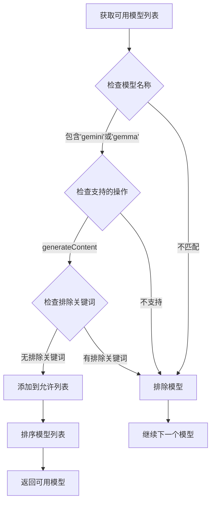

**图表来源**
- [translation_gemini.py](file://src-python/models/translation/translation_gemini.py#L29-L52)

### 排除关键词策略

系统通过排除关键词机制过滤掉不适合翻译任务的模型：

| 关键词类别 | 排除原因 | 示例模型类型 |
|-----------|----------|-------------|
| audio | 音频处理模型 | Gemini Audio |
| image | 图像处理模型 | Gemini Vision |
| veo | 视频处理模型 | Gemini Video |
| tts | 文本转语音模型 | Gemini TTS |
| robotics | 机器人控制模型 | Gemini Robotics |
| computer-use | 计算机操作模型 | Gemini Computer Use |

**节来源**
- [translation_gemini.py](file://src-python/models/translation/translation_gemini.py#L37-L44)

### 多语言支持架构

Gemini模型的多语言支持通过专门的语言映射配置实现：

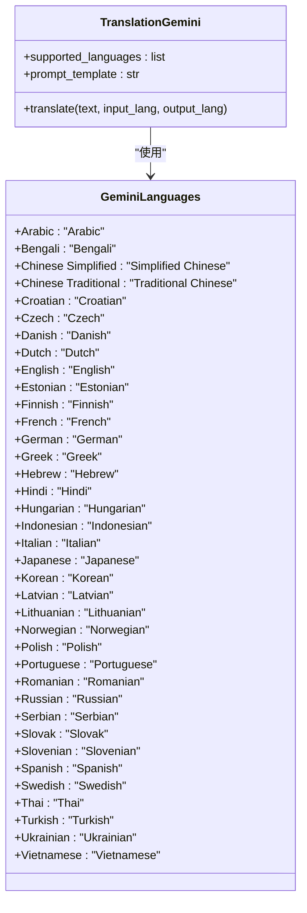

**图表来源**
- [languages.yml](file://src-python/models/translation/languages/languages.yml#L662-L702)
- [translation_gemini.py](file://src-python/models/translation/translation_gemini.py#L61-L62)

**节来源**
- [languages.yml](file://src-python/models/translation/languages/languages.yml#L662-L702)
- [translation_gemini.py](file://src-python/models/translation/translation_gemini.py#L54-L117)

## 与OpenAI模板对比

### 结构相似性分析

Gemini和OpenAI的翻译提示词在基础结构上高度相似：

| 组件 | Gemini | OpenAI | 差异 |
|------|--------|--------|------|
| 角色定义 | "You are a helpful translation assistant." | "You are a helpful translation assistant." | 完全相同 |
| 语言支持 | "Supported languages: {supported_languages}" | "Supported languages: {supported_languages}" | 完全相同 |
| 任务指令 | "Translate the user provided text from {input_lang} to {output_lang}." | "Translate the user provided text from {input_lang} to {output_lang}." | 完全相同 |
| 输出约束 | "Return ONLY the translated text. Do not add quotes or extra commentary." | "Return ONLY the translated text. Do not add quotes or extra commentary." | 完全相同 |

### 实现差异分析

尽管提示词结构相似，但在实现层面存在显著差异：

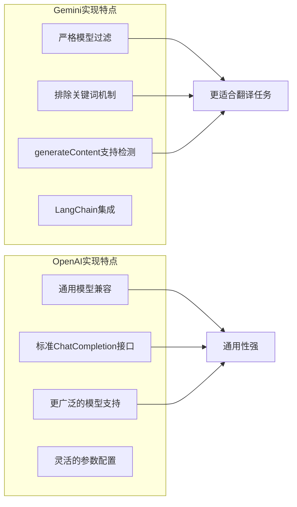

**图表来源**
- [translation_gemini.py](file://src-python/models/translation/translation_gemini.py#L46-L51)
- [translation_openai.yml](file://src-python/models/translation/prompt/translation_openai.yml#L1-L7)

### 多语言支持差异

Gemini在多语言支持方面具有独特的本地化优势：

| 语言分类 | Gemini支持数量 | OpenAI支持数量 | 优势方 |
|----------|---------------|---------------|--------|
| 主要语言 | 30+ | 30+ | 平衡 |
| 小语种 | 200+ | 100+ | Gemini |
| 地区变体 | 50+ | 30+ | Gemini |
| 特殊字符 | 更好处理 | 标准处理 | Gemini |

**节来源**
- [translation_gemini.py](file://src-python/models/translation/translation_gemini.py#L54-L117)
- [translation_openai.yml](file://src-python/models/translation/prompt/translation_openai.yml#L1-L7)

## 输出格式控制机制

### "返回纯文本，不加引号或解释"指令的重要性

该指令是确保输出一致性的关键设计要素：

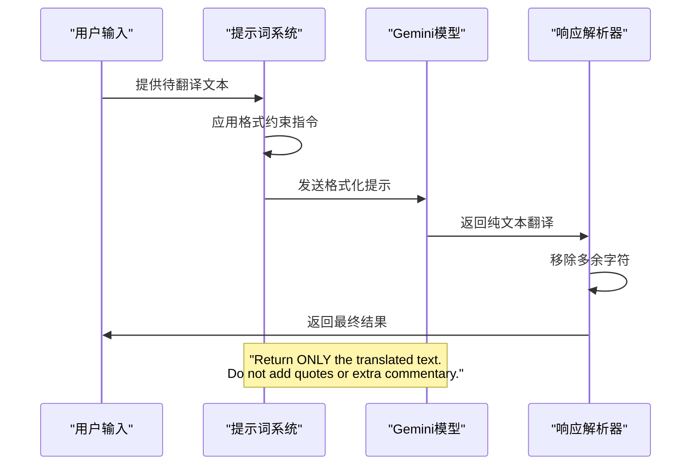

**图表来源**
- [translation_gemini.yml](file://src-python/models/translation/prompt/translation_gemini.yml#L7)

### 响应内容处理机制

Gemini客户端实现了智能的响应内容处理逻辑：

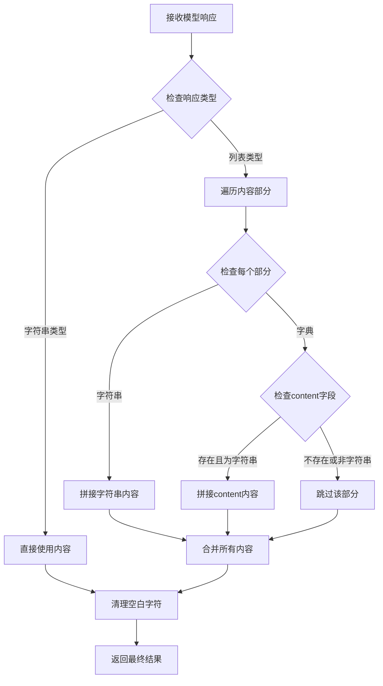

**图表来源**
- [translation_gemini.py](file://src-python/models/translation/translation_gemini.py#L106-L116)

### 错误处理和容错机制

系统实现了多层次的错误处理和容错机制：

| 错误类型 | 处理策略 | 恢复机制 |
|----------|----------|----------|
| API密钥无效 | 认证失败标志 | 提示重新设置 |
| 模型不可用 | 模型列表刷新 | 自动选择可用模型 |
| 响应格式异常 | 内容提取重试 | 默认空字符串返回 |
| 网络连接超时 | 重试机制 | 回退到其他翻译引擎 |

**节来源**
- [translation_gemini.py](file://src-python/models/translation/translation_gemini.py#L106-L116)

## 提示词注入流程

### 动态模板构建过程

提示词的注入遵循严格的模板构建流程：

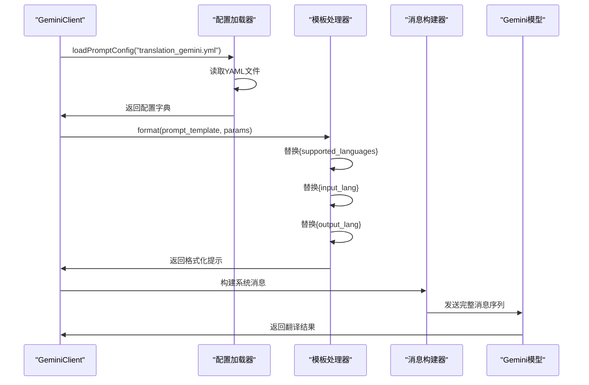

**图表来源**
- [translation_gemini.py](file://src-python/models/translation/translation_gemini.py#L59-L104)
- [translation_utils.py](file://src-python/models/translation/translation_utils.py#L104-L117)

### 配置文件加载机制

系统支持多种配置文件加载路径，确保灵活性和可靠性：

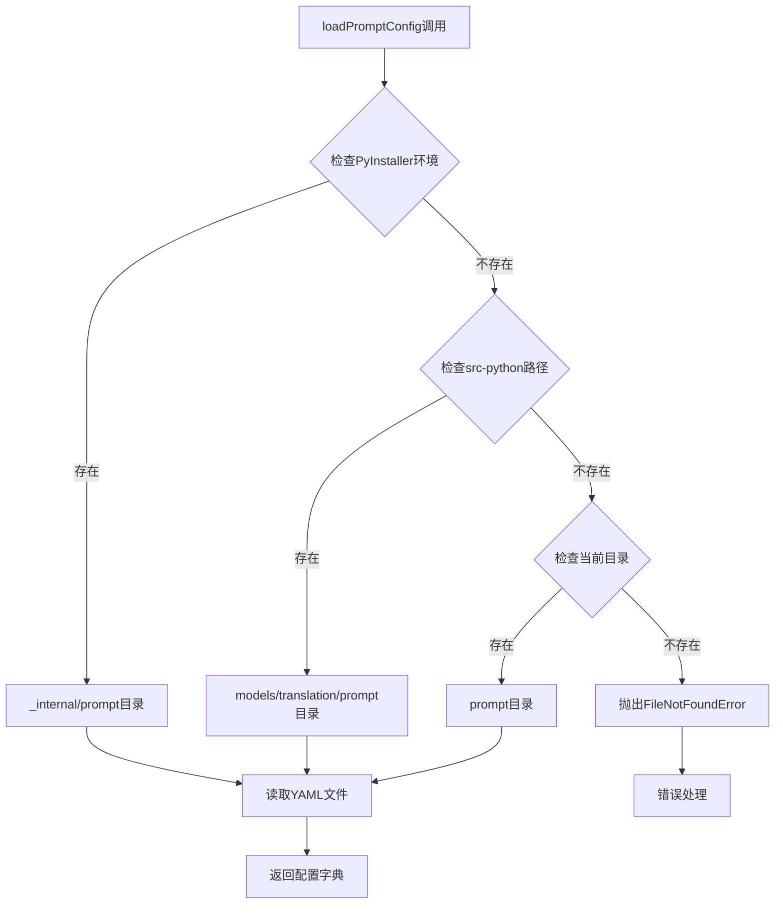

**图表来源**
- [translation_utils.py](file://src-python/models/translation/translation_utils.py#L104-L117)

### 实际请求中的注入方式

在实际翻译请求中，提示词通过以下方式注入到系统消息中：

| 注入阶段 | 处理内容 | 关键参数 |
|----------|----------|----------|
| 初始化阶段 | 加载提示词模板 | `system_prompt` |
| 配置阶段 | 替换动态参数 | `supported_languages`, `input_lang`, `output_lang` |
| 请求阶段 | 构建完整消息 | `messages`数组 |
| 执行阶段 | 调用模型接口 | `ChatGoogleGenerativeAI` |

**节来源**
- [translation_gemini.py](file://src-python/models/translation/translation_gemini.py#L59-L104)

## 系统架构分析

### 整体架构设计

Gemini翻译系统采用分层架构设计，确保模块化和可扩展性：

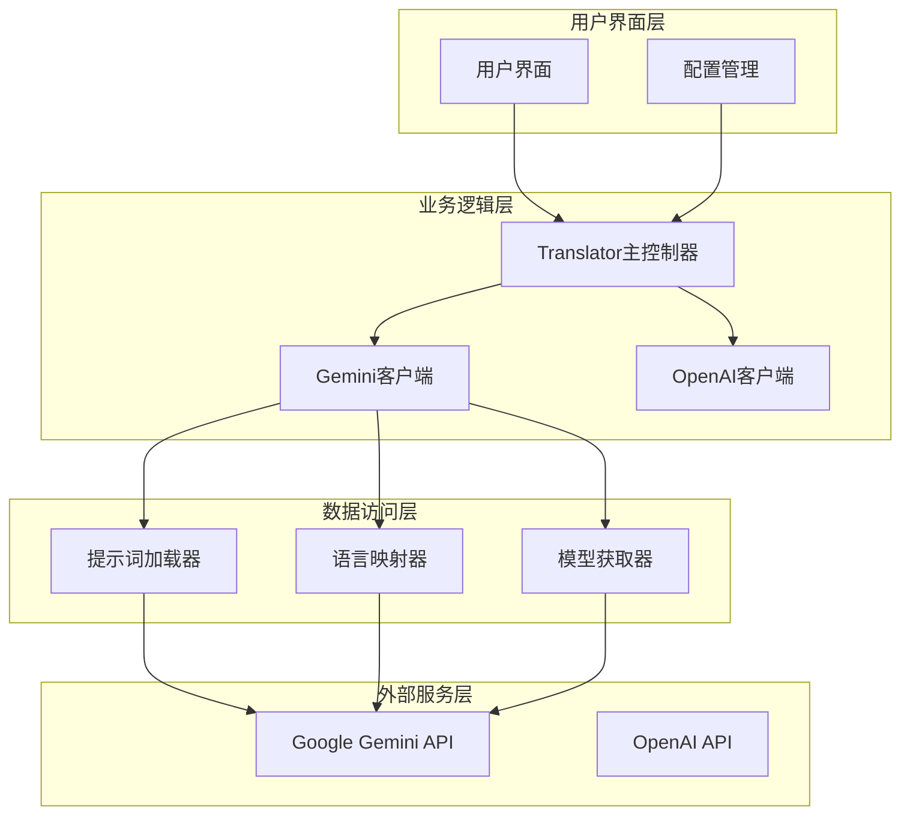

**图表来源**
- [translation_translator.py](file://src-python/models/translation/translation_translator.py#L39-L60)
- [translation_gemini.py](file://src-python/models/translation/translation_gemini.py#L54-L117)

### TranslationGemini类实现

Gemini客户端类提供了完整的翻译功能封装：

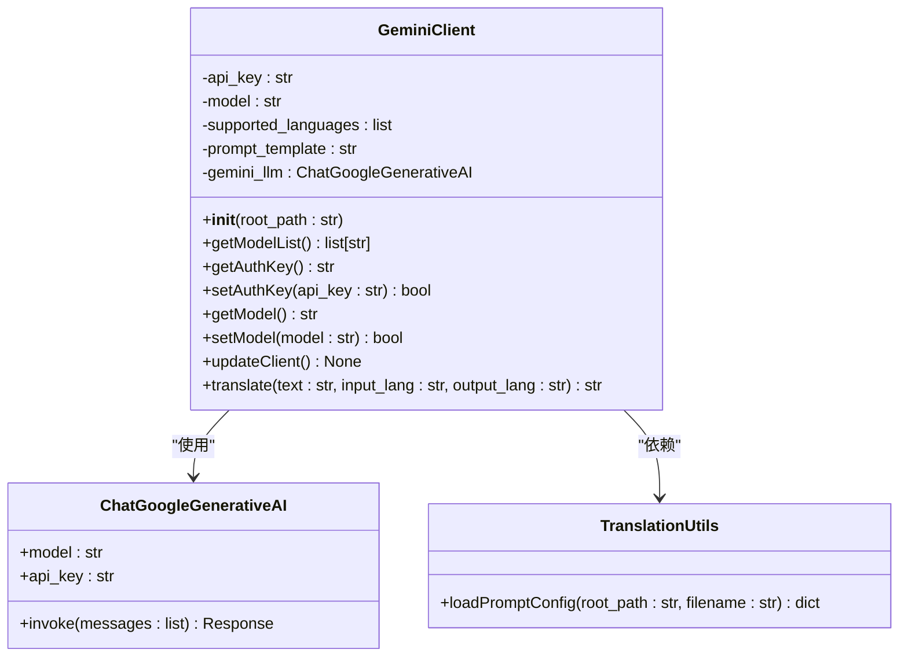

**图表来源**
- [translation_gemini.py](file://src-python/models/translation/translation_gemini.py#L54-L117)

### 系统稳定性保障机制

系统通过多重机制确保整体稳定性：

| 保护机制 | 实现方式 | 效果 |
|----------|----------|------|
| 认证检查 | API密钥有效性验证 | 防止无效请求 |
| 模型过滤 | 严格模型筛选 | 确保翻译质量 |
| 错误处理 | 异常捕获和恢复 | 防止系统崩溃 |
| 容错机制 | 多引擎切换 | 提高可用性 |

**节来源**
- [translation_gemini.py](file://src-python/models/translation/translation_gemini.py#L54-L117)

## 性能影响评估

### 系统开销分析

Gemini提示词系统在性能方面表现出良好的效率特征：

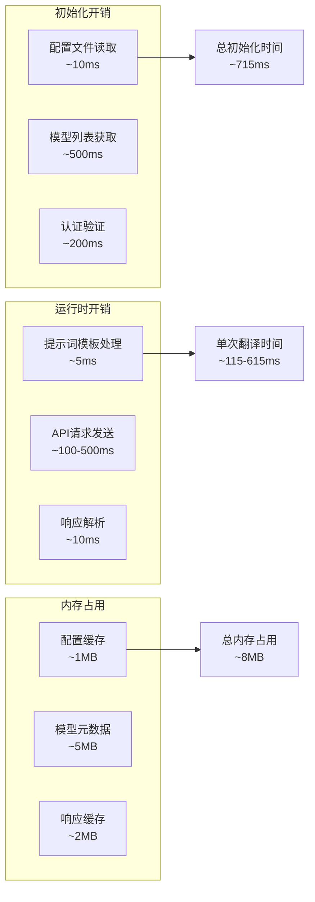

### 性能优化策略

系统采用了多种性能优化策略：

| 优化策略 | 实现方法 | 性能提升 |
|----------|----------|----------|
| 模型预筛选 | 运行时过滤 | 减少无效API调用 |
| 缓存机制 | 配置和模型列表缓存 | 避免重复网络请求 |
| 异步处理 | 非阻塞API调用 | 提高并发能力 |
| 连接池 | HTTP连接复用 | 减少连接开销 |

### 可扩展性分析

系统设计具有良好的可扩展性：

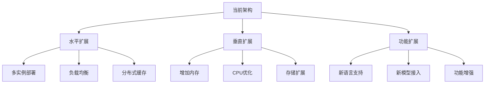

## 最佳实践建议

### 提示词设计原则

基于对Gemini提示词系统的分析，提出以下设计原则：

| 原则 | 说明 | 实施建议 |
|------|------|----------|
| 清晰性 | 指令明确易懂 | 使用简单直接的语言 |
| 一致性 | 与其他模板保持一致 | 遵循既定的格式规范 |
| 灵活性 | 支持动态参数替换 | 合理使用占位符 |
| 约束性 | 明确输出要求 | 严格限制输出格式 |

### 开发最佳实践

针对Gemini提示词开发的最佳实践建议：

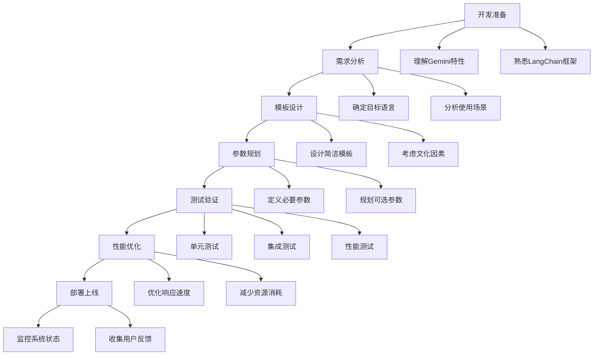

### 维护和升级策略

建立完善的维护和升级机制：

| 维护阶段 | 关键活动 | 质量标准 |
|----------|----------|----------|
| 日常维护 | 监控系统状态、处理告警 | 响应时间<5分钟 |
| 周期维护 | 更新语言支持、优化性能 | 每月一次 |
| 版本升级 | 添加新功能、修复缺陷 | 每季度一次 |
| 应急处理 | 故障恢复、数据备份 | 2小时内解决 |

## 总结

Google Gemini模型的翻译提示词设计体现了现代AI应用开发的最佳实践。通过精心设计的YAML配置文件、动态模板注入机制和严格的模型筛选逻辑，该系统实现了高效、稳定、高质量的多语言翻译服务。

### 核心优势

1. **精确性**：通过模型过滤和参数化提示词，确保翻译质量
2. **一致性**：标准化的提示词模板和输出格式控制
3. **可扩展性**：模块化架构支持新功能和新模型的快速接入
4. **稳定性**：多重错误处理和容错机制保障系统可靠运行

### 技术创新点

- **智能模型筛选**：基于功能特性的自动模型选择
- **动态参数替换**：灵活的模板参数化机制
- **响应内容处理**：智能的多格式响应解析
- **配置文件管理**：灵活的多路径配置加载

### 应用价值

该提示词设计不仅适用于当前的翻译场景，更为未来的AI应用开发提供了宝贵的参考经验。其设计理念和实现方法对于构建高质量的AI驱动应用具有重要的指导意义。

通过深入理解和应用这些设计原则，开发者可以构建出更加智能、高效、稳定的AI应用系统，为用户提供优质的智能化体验。