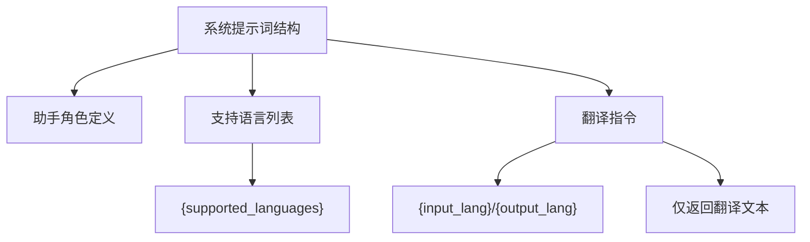
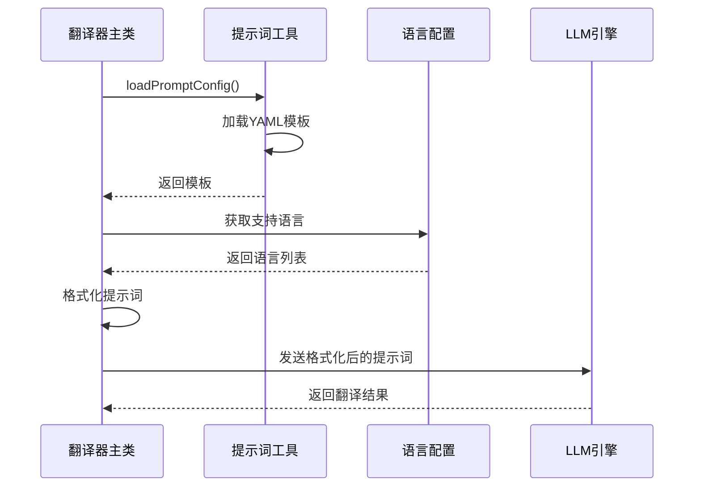
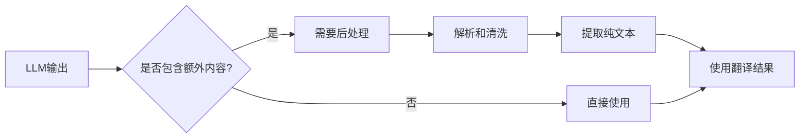
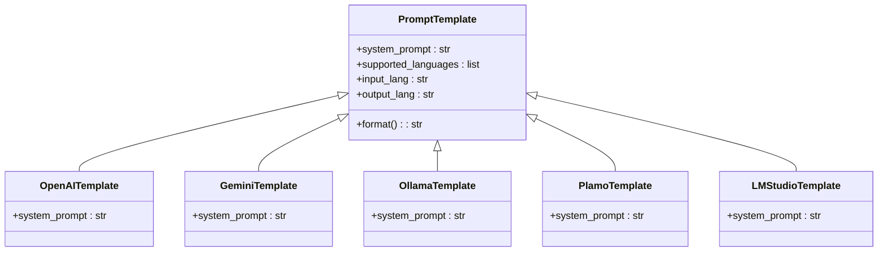
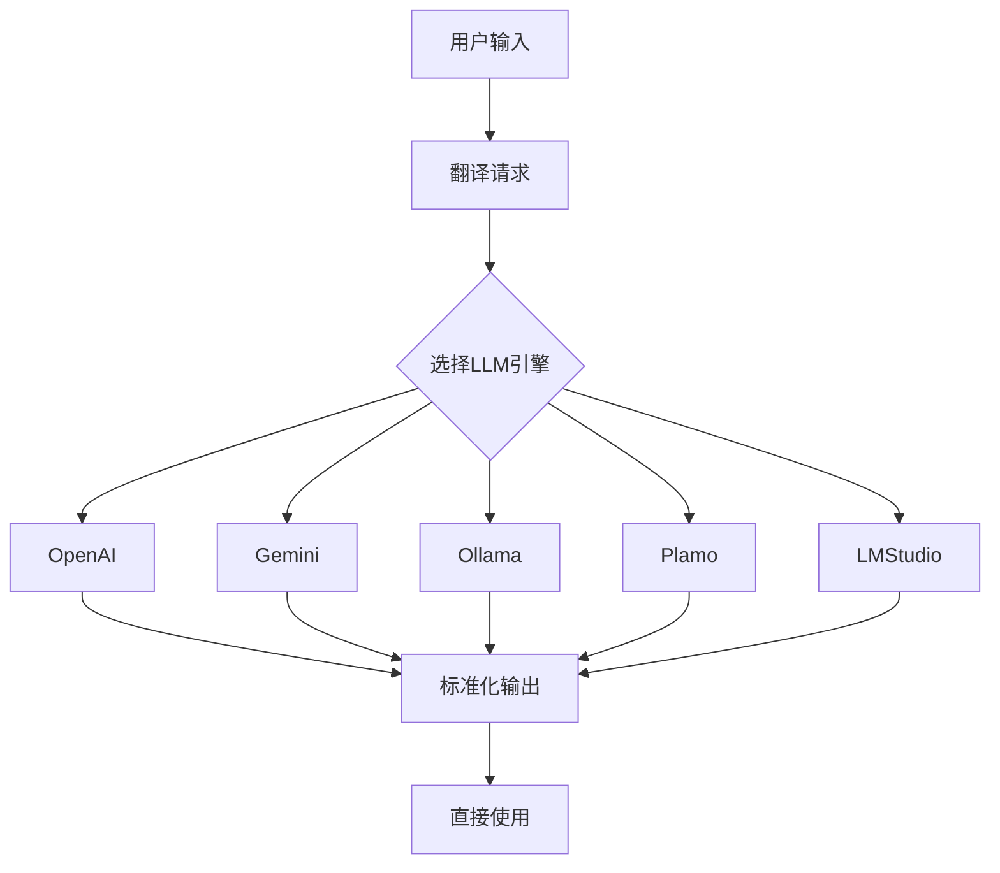

# 提示词工程设计

<cite>
**本文档引用的文件**  
- [translation_openai.yml](file://src-python/models/translation/prompt/translation_openai.yml)
- [translation_gemini.yml](file://src-python/models/translation/prompt/translation_gemini.yml)
- [translation_ollama.yml](file://src-python/models/translation/prompt/translation_ollama.yml)
- [translation_plamo.yml](file://src-python/models/translation/prompt/translation_plamo.yml)
- [translation_lmstudio.yml](file://src-python/models/translation/prompt/translation_lmstudio.yml)
- [translation_openai.py](file://src-python/models/translation/translation_openai.py)
- [translation_gemini.py](file://src-python/models/translation/translation_gemini.py)
- [translation_ollama.py](file://src-python/models/translation/translation_ollama.py)
- [translation_plamo.py](file://src-python/models/translation/translation_plamo.py)
- [translation_lmstudio.py](file://src-python/models/translation/translation_lmstudio.py)
- [translation_utils.py](file://src-python/models/translation/translation_utils.py)
- [languages.yml](file://src-python/models/translation/languages/languages.yml)
- [translation_languages.py](file://src-python/models/translation/translation_languages.py)
- [translation_translator.py](file://src-python/models/translation/translation_translator.py)
</cite>

## 目录
1. [引言](#引言)
2. [提示词模板设计原理](#提示词模板设计原理)
3. [translation_openai.yml结构解析](#translation_openai.yml结构解析)
4. [多引擎提示词模板对比分析](#多引擎提示词模板对比分析)
5. [动态注入机制实现](#动态注入机制实现)
6. [输出格式约束的重要性](#输出格式约束的重要性)
7. [统一提示词工程策略](#统一提示词工程策略)
8. [系统集成影响分析](#系统集成影响分析)
9. [结论](#结论)

## 引言
本项目采用统一的提示词工程策略，为多个LLM引擎（包括OpenAI、Gemini、Ollama、Plamo、LMStudio等）设计标准化的翻译提示词模板。通过精心设计的系统提示词，确保不同LLM服务返回格式一致的翻译结果，降低后处理复杂度，提高系统集成效率。

## 提示词模板设计原理
项目中的提示词模板设计遵循统一的设计原则，通过YAML文件定义系统提示词，支持动态注入语言列表和输入输出语言参数。所有提示词模板都强调返回纯文本翻译结果，避免添加额外注释或引号，确保输出格式的一致性。

**Section sources**
- [translation_openai.yml](file://src-python/models/translation/prompt/translation_openai.yml)
- [translation_gemini.yml](file://src-python/models/translation/prompt/translation_gemini.yml)
- [translation_ollama.yml](file://src-python/models/translation/prompt/translation_ollama.yml)
- [translation_plamo.yml](file://src-python/models/translation/prompt/translation_plamo.yml)
- [translation_lmstudio.yml](file://src-python/models/translation/prompt/translation_lmstudio.yml)

## translation_openai.yml结构解析
`translation_openai.yml`文件定义了OpenAI引擎的系统提示词结构，包含三个关键部分：助手角色定义、支持语言列表和翻译指令。该模板使用占位符{supported_languages}、{input_lang}和{output_lang}实现动态内容注入，确保提示词的灵活性和可重用性。



**Diagram sources**
- [translation_openai.yml](file://src-python/models/translation/prompt/translation_openai.yml)

**Section sources**
- [translation_openai.yml](file://src-python/models/translation/prompt/translation_openai.yml)
- [translation_openai.py](file://src-python/models/translation/translation_openai.py)

## 多引擎提示词模板对比分析
通过对不同LLM引擎的提示词模板进行对比分析，可以发现项目采用了高度一致的设计模式，同时针对特定引擎进行了微调。所有模板都包含支持语言动态注入、输入输出语言占位符和严格的输出格式约束。

```mermaid
table
title 不同LLM引擎提示词模板对比
header 模板名称, 助手角色, 支持语言, 翻译指令, 输出约束
row translation_openai.yml, "You are a helpful translation assistant.", "{supported_languages}", "Translate the user provided text from {input_lang} to {output_lang}.", "Return ONLY the translated text. Do not add quotes or extra commentary."
row translation_gemini.yml, "You are a helpful translation assistant.", "{supported_languages}", "Translate the user provided text from {input_lang} to {output_lang}.", "Return ONLY the translated text. Do not add quotes or extra commentary."
row translation_ollama.yml, "You are a helpful translation assistant.", "{supported_languages}", "Translate the user provided text from {input_lang} to {output_lang}.", "Return ONLY the translated text. Do not add quotes or extra commentary."
row translation_plamo.yml, "You are a translation assistant that uses the `plamo-translate` tool.", "{supported_languages}", "Translate the following text from {input_lang} to {output_lang}.", "output only the translated text without any additional commentary."
row translation_lmstudio.yml, "You are a helpful translation assistant.", "{supported_languages}", "Translate the user provided text from {input_lang} to {output_lang}.", "Return ONLY the translated text. Do not add quotes or extra commentary."
```

**Diagram sources**
- [translation_openai.yml](file://src-python/models/translation/prompt/translation_openai.yml)
- [translation_gemini.yml](file://src-python/models/translation/prompt/translation_gemini.yml)
- [translation_ollama.yml](file://src-python/models/translation/prompt/translation_ollama.yml)
- [translation_plamo.yml](file://src-python/models/translation/prompt/translation_plamo.yml)
- [translation_lmstudio.yml](file://src-python/models/translation/prompt/translation_lmstudio.yml)

**Section sources**
- [translation_openai.yml](file://src-python/models/translation/prompt/translation_openai.yml)
- [translation_gemini.yml](file://src-python/models/translation/prompt/translation_gemini.yml)
- [translation_ollama.yml](file://src-python/models/translation/prompt/translation_ollama.yml)
- [translation_plamo.yml](file://src-python/models/translation/prompt/translation_plamo.yml)
- [translation_lmstudio.yml](file://src-python/models/translation/prompt/translation_lmstudio.yml)

## 动态注入机制实现
提示词模板中的动态注入机制通过Python的字符串格式化功能实现。系统在运行时从`languages.yml`文件加载支持的语言列表，并将其注入到提示词模板中。输入语言和输出语言占位符也在翻译请求时被实际语言值替换。



**Diagram sources**
- [translation_utils.py](file://src-python/models/translation/translation_utils.py)
- [translation_languages.py](file://src-python/models/translation/translation_languages.py)
- [translation_translator.py](file://src-python/models/translation/translation_translator.py)

**Section sources**
- [translation_utils.py](file://src-python/models/translation/translation_utils.py)
- [translation_languages.py](file://src-python/models/translation/translation_languages.py)
- [languages.yml](file://src-python/models/translation/languages/languages.yml)

## 输出格式约束的重要性
提示词中"仅返回翻译文本，不要添加引号或额外注释"的指令对系统集成至关重要。这种严格的输出格式约束降低了后处理复杂度，确保了翻译结果可以直接使用，无需额外的文本清洗和解析步骤。



**Diagram sources**
- [translation_openai.yml](file://src-python/models/translation/prompt/translation_openai.yml)
- [translation_gemini.yml](file://src-python/models/translation/prompt/translation_gemini.yml)

**Section sources**
- [translation_openai.py](file://src-python/models/translation/translation_openai.py)
- [translation_gemini.py](file://src-python/models/translation/translation_gemini.py)
- [translation_ollama.py](file://src-python/models/translation/translation_ollama.py)

## 统一提示词工程策略
项目通过统一的提示词工程策略，确保不同LLM服务返回格式一致的翻译结果。这种策略不仅提高了系统的可维护性，还增强了扩展性，使得添加新的LLM引擎变得更加容易。



**Diagram sources**
- [translation_openai.yml](file://src-python/models/translation/prompt/translation_openai.yml)
- [translation_gemini.yml](file://src-python/models/translation/prompt/translation_gemini.yml)
- [translation_ollama.yml](file://src-python/models/translation/prompt/translation_ollama.yml)
- [translation_plamo.yml](file://src-python/models/translation/prompt/translation_plamo.yml)
- [translation_lmstudio.yml](file://src-python/models/translation/prompt/translation_lmstudio.yml)

**Section sources**
- [translation_utils.py](file://src-python/models/translation/translation_utils.py)
- [translation_translator.py](file://src-python/models/translation/translation_translator.py)

## 系统集成影响分析
统一的提示词工程设计显著降低了系统集成的复杂度。通过确保所有LLM引擎返回一致的输出格式，系统可以以相同的方式处理来自不同引擎的翻译结果，提高了代码的可重用性和可维护性。



**Diagram sources**
- [translation_translator.py](file://src-python/models/translation/translation_translator.py)

**Section sources**
- [translation_translator.py](file://src-python/models/translation/translation_translator.py)
- [translation_openai.py](file://src-python/models/translation/translation_openai.py)
- [translation_gemini.py](file://src-python/models/translation/translation_gemini.py)

## 结论
本项目的提示词工程设计通过统一的模板结构、动态注入机制和严格的输出格式约束，成功实现了多LLM引擎的标准化集成。这种设计不仅确保了翻译结果的一致性，还显著降低了后处理复杂度，提高了系统的可维护性和扩展性。未来可以在此基础上进一步优化提示词，提高翻译质量和效率。