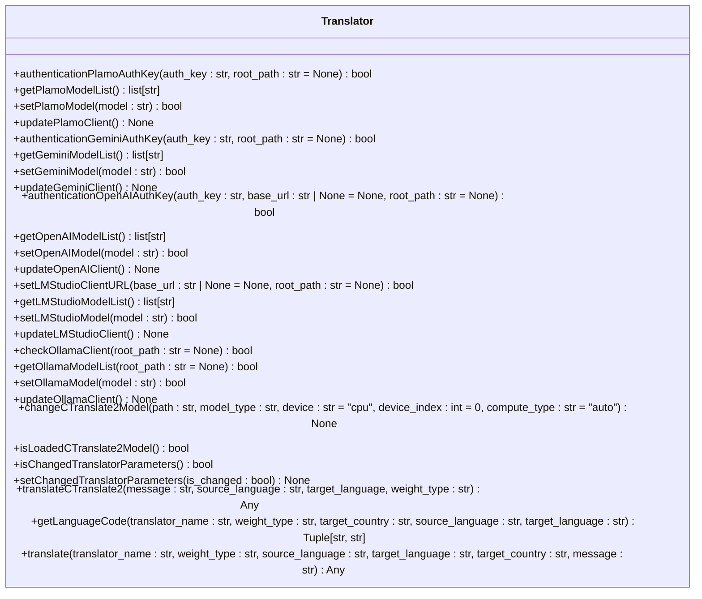
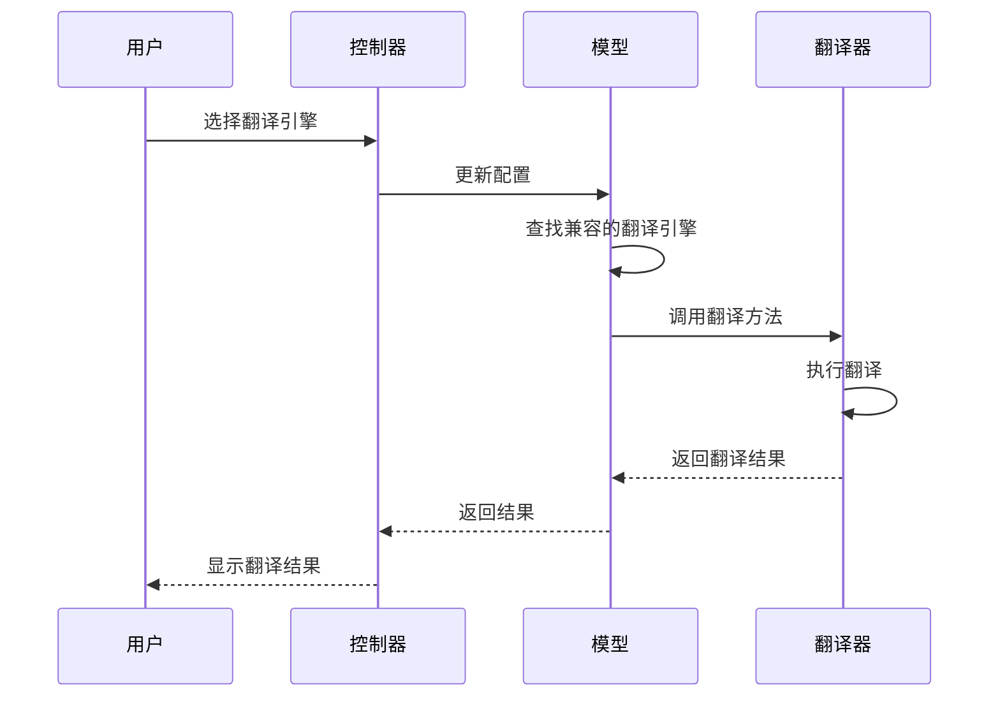
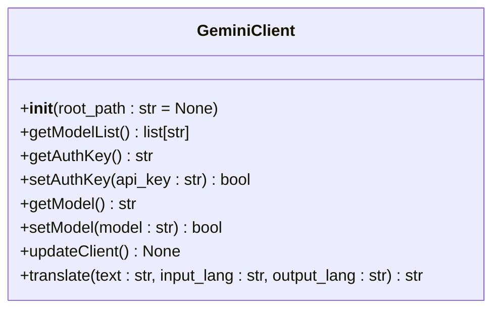
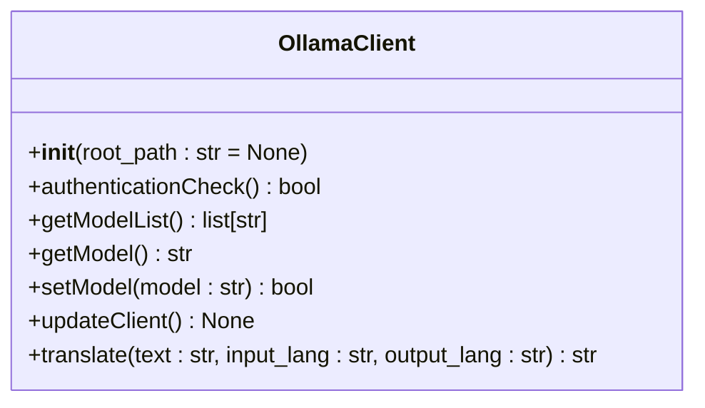
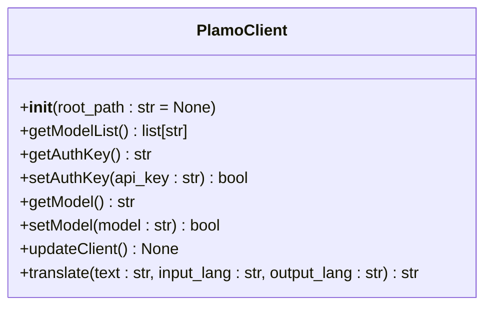
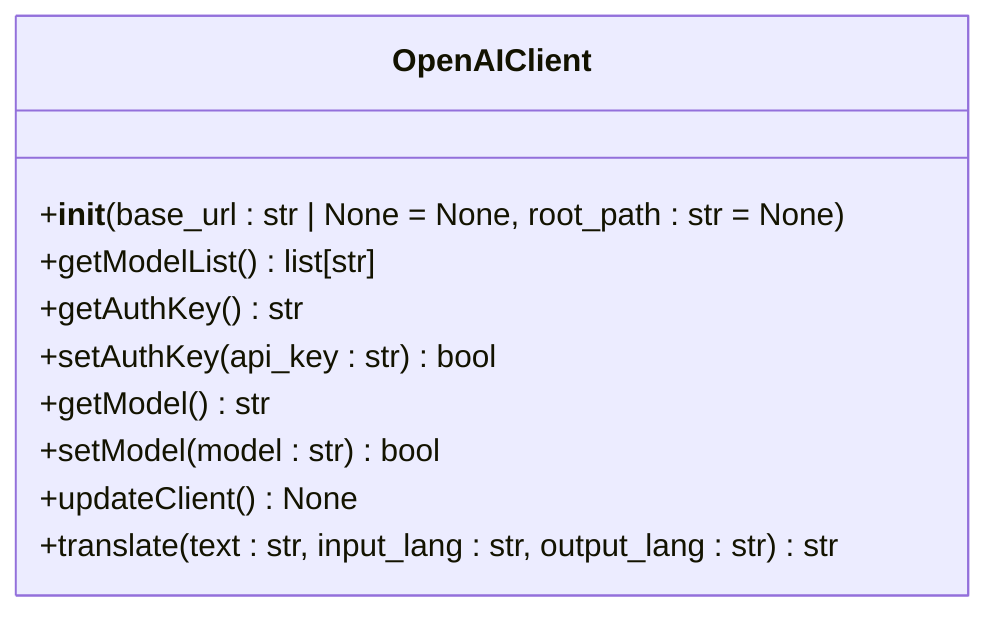
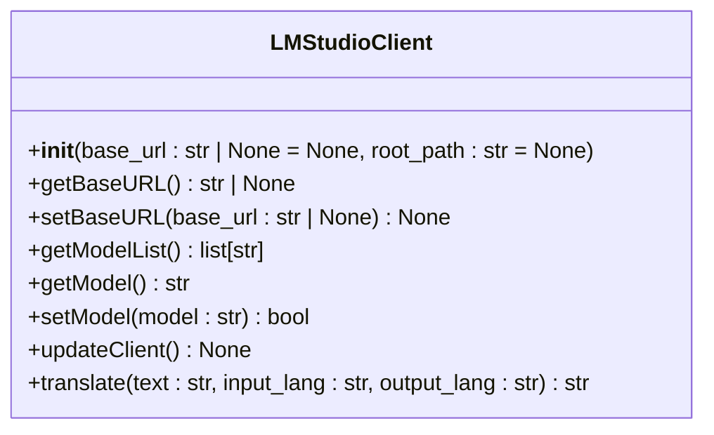

# 机器翻译

<cite>
**本文档引用的文件**   
- [translation_translator.py](file://src-python/models/translation/translation_translator.py)
- [config.py](file://src-python/config.py)
- [languages.yml](file://src-python/models/translation/languages/languages.yml)
- [translation_gemini.py](file://src-python/models/translation/translation_gemini.py)
- [translation_ollama.py](file://src-python/models/translation/translation_ollama.py)
- [translation_plamo.py](file://src-python/models/translation/translation_plamo.py)
- [translation_openai.py](file://src-python/models/translation/translation_openai.py)
- [translation_lmstudio.py](file://src-python/models/translation/translation_lmstudio.py)
- [translation_utils.py](file://src-python/models/translation/translation_utils.py)
- [translation_languages.py](file://src-python/models/translation/translation_languages.py)
- [model.py](file://src-python/model.py)
- [controller.py](file://src-python/controller.py)
</cite>

## 目录
1. [简介](#简介)
2. [统一翻译接口设计](#统一翻译接口设计)
3. [多引擎调度机制](#多引擎调度机制)
4. [引擎实现细节](#引擎实现细节)
5. [语言支持配置](#语言支持配置)
6. [提示词工程](#提示词工程)
7. [配置与选择策略](#配置与选择策略)
8. [性能对比与使用建议](#性能对比与使用建议)

## 简介
VRCT的多引擎机器翻译系统提供了一个统一的翻译接口，支持多种翻译引擎，包括Gemini、Ollama、Plamo、OpenAI、LMStudio等。系统通过动态调度不同引擎，实现了灵活的翻译服务。用户可以根据网络环境和硬件条件选择最优的翻译方案。系统还支持故障转移机制，确保翻译服务的稳定性。

## 统一翻译接口设计
VRCT的翻译系统通过`Translator`类提供统一的翻译接口。该类封装了多个后端（DeepL、DeepL API、Google、Bing、Papago和CTranslate2本地模型）。在运行时，可选的依赖项可能不可用，方法会优雅地降级并返回False或空字符串（保持与现有行为的兼容性）。

`Translator`类的`translate`方法是核心接口，它接受翻译器名称、权重类型、源语言、目标语言、目标国家和消息作为参数。根据翻译器名称，方法会调用相应的翻译引擎进行翻译。如果源语言和目标语言相同，方法会直接返回原始消息。



**图源**
- [translation_translator.py](file://src-python/models/translation/translation_translator.py#L39-L441)

## 多引擎调度机制
VRCT的多引擎调度机制通过`config.py`中的`SELECTED_TRANSLATION_ENGINES`配置项实现。用户可以在配置界面中选择每个标签页使用的翻译引擎。系统会根据用户的配置动态调度相应的翻译引擎。

在`model.py`中，`findTranslationEngines`方法用于查找与当前语言设置兼容的翻译引擎。该方法会检查每个翻译引擎是否支持当前启用的源语言和目标语言。如果引擎支持所有启用的语言，则该引擎被认为是兼容的。



**图源**
- [config.py](file://src-python/config.py#L723)
- [model.py](file://src-python/model.py#L312-L337)
- [controller.py](file://src-python/controller.py#L884-L888)

## 引擎实现细节
### Gemini引擎
Gemini引擎通过`translation_gemini.py`实现。该文件定义了`GeminiClient`类，用于与Google的Gemini API进行交互。`GeminiClient`类提供了`setAuthKey`、`getModelList`、`setModel`和`translate`等方法。



**图源**
- [translation_gemini.py](file://src-python/models/translation/translation_gemini.py#L54-L116)

### Ollama引擎
Ollama引擎通过`translation_ollama.py`实现。该文件定义了`OllamaClient`类，用于与Ollama API进行交互。`OllamaClient`类提供了`authenticationCheck`、`getModelList`、`setModel`和`translate`等方法。



**图源**
- [translation_ollama.py](file://src-python/models/translation/translation_ollama.py#L42-L102)

### Plamo引擎
Plamo引擎通过`translation_plamo.py`实现。该文件定义了`PlamoClient`类，用于与Preferred AI的Plamo API进行交互。`PlamoClient`类提供了`setAuthKey`、`getModelList`、`setModel`和`translate`等方法。



**图源**
- [translation_plamo.py](file://src-python/models/translation/translation_plamo.py#L40-L103)

### OpenAI引擎
OpenAI引擎通过`translation_openai.py`实现。该文件定义了`OpenAIClient`类，用于与OpenAI API进行交互。`OpenAIClient`类提供了`setAuthKey`、`getModelList`、`setModel`和`translate`等方法。



**图源**
- [translation_openai.py](file://src-python/models/translation/translation_openai.py#L62-L128)

### LMStudio引擎
LMStudio引擎通过`translation_lmstudio.py`实现。该文件定义了`LMStudioClient`类，用于与LM Studio API进行交互。`LMStudioClient`类提供了`setBaseURL`、`getModelList`、`setModel`和`translate`等方法。



**图源**
- [translation_lmstudio.py](file://src-python/models/translation/translation_lmstudio.py#L42-L108)

## 语言支持配置
语言支持配置通过`languages.yml`文件实现。该文件定义了每个后端的源语言和目标语言代码映射。例如，DeepL后端支持阿拉伯语、保加利亚语、捷克语、丹麦语、德语、希腊语、英语、西班牙语、爱沙尼亚语、芬兰语、法语、爱尔兰语、克罗地亚语、匈牙利语、印度尼西亚语、意大利语、日语、韩语、立陶宛语、拉脱维亚语、马耳他语、挪威语、荷兰语、波兰语、葡萄牙语、罗马尼亚语、俄语、斯洛伐克语、斯洛文尼亚语、瑞典语、土耳其语、乌克兰语、简体中文和繁体中文。

```yaml
DeepL:
  source: &deepl_langs
    Arabic: ar
    Bulgarian: bg
    Czech: cs
    Danish: da
    German: de
    Greek: el
    English: en
    Spanish: es
    Estonian: et
    Finnish: fi
    French: fr
    Irish: ga
    Croatian: hr
    Hungarian: hu
    Indonesian: id
    Italian: it
    Japanese: ja
    Korean: ko
    Lithuanian: lt
    Latvian: lv
    Maltese: mt
    Norwegian: 'no'
    Dutch: nl
    Polish: pl
    Portuguese: pt
    Romanian: ro
    Russian: ru
    Slovak: sk
    Slovenian: sl
    Swedish: sv
    Turkish: tr
    Ukrainian: uk
    Chinese Simplified: zh
    Chinese Traditional: zh
  target: *deepl_langs
```

**图源**
- [languages.yml](file://src-python/models/translation/languages/languages.yml#L4-L40)

## 提示词工程
提示词工程通过`prompt/*.yml`文件实现。每个翻译引擎都有一个对应的YAML文件，其中包含系统提示词（`system_prompt`）。系统提示词用于指导翻译引擎如何进行翻译。

例如，`translation_gemini.yml`文件中的系统提示词如下：

```yaml
system_prompt: |
  You are a professional translator. Translate the following text from {input_lang} to {output_lang}.
  Supported languages: {supported_languages}
```

**图源**
- [translation_gemini.yml](file://src-python/models/translation/prompt/translation_gemini.yml)
- [translation_ollama.yml](file://src-python/models/translation/prompt/translation_ollama.yml)
- [translation_plamo.yml](file://src-python/models/translation/prompt/translation_plamo.yml)
- [translation_openai.yml](file://src-python/models/translation/prompt/translation_openai.yml)
- [translation_lmstudio.yml](file://src-python/models/translation/prompt/translation_lmstudio.yml)

## 配置与选择策略
配置与选择策略通过`config.py`中的`SELECTED_TRANSLATION_ENGINES`等配置项实现。用户可以在配置界面中选择每个标签页使用的翻译引擎。系统会根据用户的配置动态调度相应的翻译引擎。

在`config.py`中，`SELECTED_TRANSLATION_ENGINES`是一个字典，键为标签页编号，值为翻译引擎名称。例如：

```python
SELECTED_TRANSLATION_ENGINES = {
    "1": "Gemini_API",
    "2": "OpenAI_API",
    "3": "Ollama"
}
```

**图源**
- [config.py](file://src-python/config.py#L723)

## 性能对比与使用建议
### 性能对比
| 引擎 | 网络要求 | 硬件要求 | 速度 | 准确性 |
| --- | --- | --- | --- | --- |
| Gemini | 高 | 低 | 快 | 高 |
| Ollama | 中 | 中 | 中 | 中 |
| Plamo | 高 | 低 | 快 | 高 |
| OpenAI | 高 | 低 | 快 | 高 |
| LMStudio | 中 | 高 | 慢 | 高 |

### 使用建议
- **网络环境良好**：推荐使用Gemini、Plamo或OpenAI引擎，这些引擎依赖云端服务，网络要求高，但翻译速度快且准确性高。
- **网络环境较差**：推荐使用Ollama或LMStudio引擎，这些引擎可以在本地运行，对网络要求较低，但需要较高的硬件配置。
- **硬件配置较低**：推荐使用Gemini、Plamo或OpenAI引擎，这些引擎对硬件要求低，但需要稳定的网络连接。
- **硬件配置较高**：推荐使用Ollama或LMStudio引擎，这些引擎可以在本地运行，充分利用硬件资源，提供高质量的翻译服务。

**图源**
- [config.py](file://src-python/config.py#L723)
- [translation_translator.py](file://src-python/models/translation/translation_translator.py#L39-L441)