# 多引擎客户端管理

<cite>
**本文档中引用的文件**
- [translation_translator.py](file://src-python/models/translation/translation_translator.py)
- [translation_plamo.py](file://src-python/models/translation/translation_plamo.py)
- [translation_gemini.py](file://src-python/models/translation/translation_gemini.py)
- [translation_openai.py](file://src-python/models/translation/translation_openai.py)
- [translation_lmstudio.py](file://src-python/models/translation/translation_lmstudio.py)
- [translation_ollama.py](file://src-python/models/translation/translation_ollama.py)
- [translation_utils.py](file://src-python/models/translation/translation_utils.py)
- [model.py](file://src-python/model.py)
- [controller.py](file://src-python/controller.py)
- [utils.py](file://src-python/utils.py)
</cite>

## 目录
1. [简介](#简介)
2. [系统架构概览](#系统架构概览)
3. [Translator核心类](#translator核心类)
4. [客户端初始化机制](#客户端初始化机制)
5. [认证方法详解](#认证方法详解)
6. [模型管理与切换](#模型管理与切换)
7. [统一接口设计](#统一接口设计)
8. [异常处理策略](#异常处理策略)
9. [依赖可选性设计](#依赖可选性设计)
10. [性能优化考虑](#性能优化考虑)
11. [总结](#总结)

## 简介

VRCT项目实现了一个高度模块化的多引擎翻译客户端管理系统，通过`Translator`类统一管理多个翻译服务提供商的客户端实例。该系统支持包括Plamo、Gemini、OpenAI、LMStudio和Ollama在内的多种翻译引擎，为用户提供灵活、可靠的翻译服务选择。

系统采用统一接口设计，隐藏了不同翻译引擎的差异性，同时提供了完善的错误处理和故障转移机制，确保在某个引擎不可用时能够自动切换到备用引擎。

## 系统架构概览

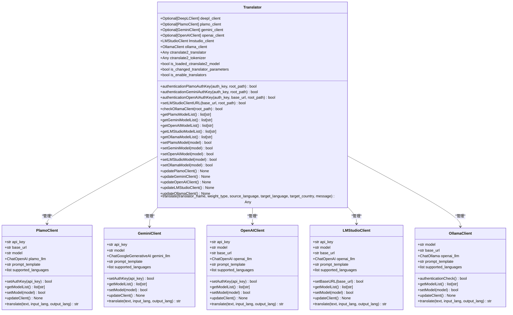

**图表来源**
- [translation_translator.py](file://src-python/models/translation/translation_translator.py#L38-L440)
- [translation_plamo.py](file://src-python/models/translation/translation_plamo.py#L40-L115)
- [translation_gemini.py](file://src-python/models/translation/translation_gemini.py#L54-L128)
- [translation_openai.py](file://src-python/models/translation/translation_openai.py#L62-L140)
- [translation_lmstudio.py](file://src-python/models/translation/translation_lmstudio.py#L42-L118)
- [translation_ollama.py](file://src-python/models/translation/translation_ollama.py#L42-L112)

## Translator核心类

`Translator`类是整个多引擎客户端管理系统的核心，它封装了所有翻译引擎的客户端实例，并提供了统一的接口来管理这些客户端。

### 类结构设计

```mermaid
graph TD
A[Translator类] --> B[客户端实例字段]
A --> C[认证方法]
A --> D[模型管理方法]
A --> E[客户端更新方法]
A --> F[翻译执行方法]
B --> B1[deepl_client]
B --> B2[plamo_client]
B --> B3[gemini_client]
B --> B4[openai_client]
B --> B5[lmstudio_client]
B --> B6[ollama_client]
B --> B7[ctranslate2_translator]
B --> B8[ctranslate2_tokenizer]
C --> C1[authenticationDeepLAuthKey]
C --> C2[authenticationPlamoAuthKey]
C --> C3[authenticationGeminiAuthKey]
C --> C4[authenticationOpenAIAuthKey]
C --> C5[setLMStudioClientURL]
C --> C6[checkOllamaClient]
D --> D1[getPlamoModelList]
D --> D2[getGeminiModelList]
D --> D3[getOpenAIModelList]
D --> D4[getLMStudioModelList]
D --> D5[getOllamaModelList]
E --> E1[updatePlamoClient]
E --> E2[updateGeminiClient]
E --> E3[updateOpenAIClient]
E --> E4[updateLMStudioClient]
E --> E5[updateOllamaClient]
F --> F1[translate]
F --> F2[translateCTranslate2]
```

**图表来源**
- [translation_translator.py](file://src-python/models/translation/translation_translator.py#L48-L59)

### 初始化流程

Translator类的初始化过程采用了延迟加载策略，只有在需要时才会创建特定引擎的客户端实例：

**章节来源**
- [translation_translator.py](file://src-python/models/translation/translation_translator.py#L48-L59)

## 客户端初始化机制

每个翻译引擎都有其独特的初始化流程，但都遵循相似的模式：创建客户端实例、设置基础参数、加载配置文件、初始化语言支持列表。

### Plamo客户端初始化

Plamo客户端的初始化过程展示了标准的客户端创建模式：

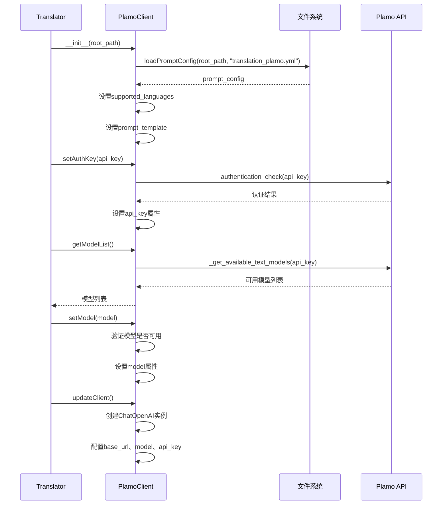

**图表来源**
- [translation_plamo.py](file://src-python/models/translation/translation_plamo.py#L41-L80)

### Gemini客户端初始化

Gemini客户端的初始化过程包含了额外的模型过滤逻辑：

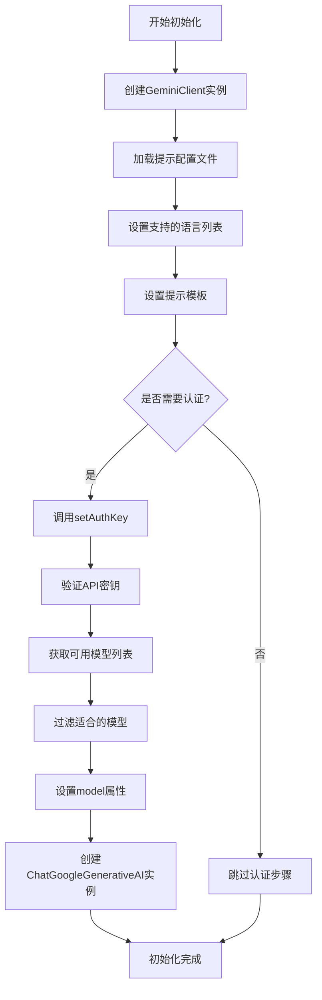

**图表来源**
- [translation_gemini.py](file://src-python/models/translation/translation_gemini.py#L55-L92)

### OpenAI客户端初始化

OpenAI客户端支持自定义基础URL，使其能够兼容Azure OpenAI和其他代理服务：

**章节来源**
- [translation_openai.py](file://src-python/models/translation/translation_openai.py#L62-L105)

### LMStudio客户端初始化

LMStudio客户端具有特殊的URL认证机制：

**章节来源**
- [translation_lmstudio.py](file://src-python/models/translation/translation_lmstudio.py#L42-L85)

### Ollama客户端初始化

Ollama客户端专门用于本地大语言模型的翻译：

**章节来源**
- [translation_ollama.py](file://src-python/models/translation/translation_ollama.py#L42-L79)

## 认证方法详解

每个翻译引擎都实现了相应的认证方法，用于验证API密钥的有效性和建立客户端连接。

### Plamo认证方法

Plamo的认证方法相对简单，主要通过尝试列出可用模型来验证API密钥：

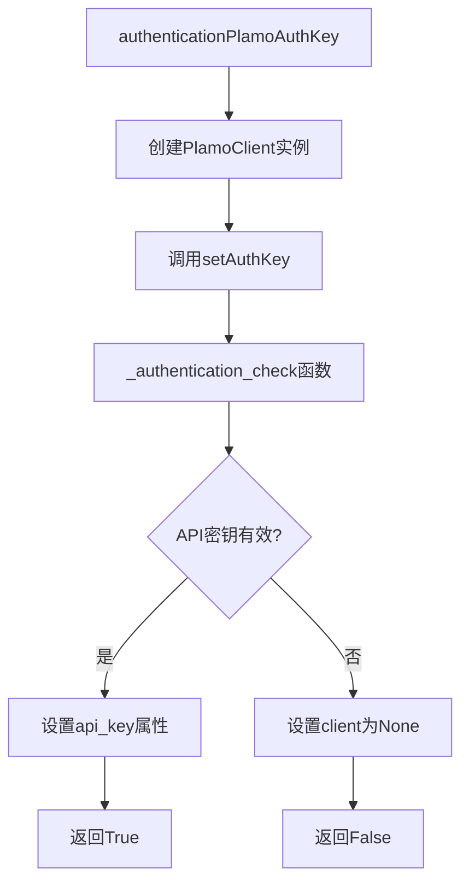

**图表来源**
- [translation_plamo.py](file://src-python/models/translation/translation_plamo.py#L77-L87)

### Gemini认证方法

Gemini认证包含更严格的模型过滤逻辑：

**章节来源**
- [translation_gemini.py](file://src-python/models/translation/translation_gemini.py#L111-L128)

### OpenAI认证方法

OpenAI认证支持自定义基础URL，增加了灵活性：

**章节来源**
- [translation_openai.py](file://src-python/models/translation/translation_openai.py#L131-L140)

### LMStudio认证方法

LMStudio认证专注于验证服务器连接：

**章节来源**
- [translation_lmstudio.py](file://src-python/models/translation/translation_lmstudio.py#L111-L118)

### Ollama认证方法

Ollama认证检查本地服务的可用性：

**章节来源**
- [translation_ollama.py](file://src-python/models/translation/translation_ollama.py#L105-L112)

## 模型管理与切换

每个客户端都提供了模型列表获取、模型设置和客户端更新的功能，支持运行时动态切换翻译模型。

### 模型列表获取机制

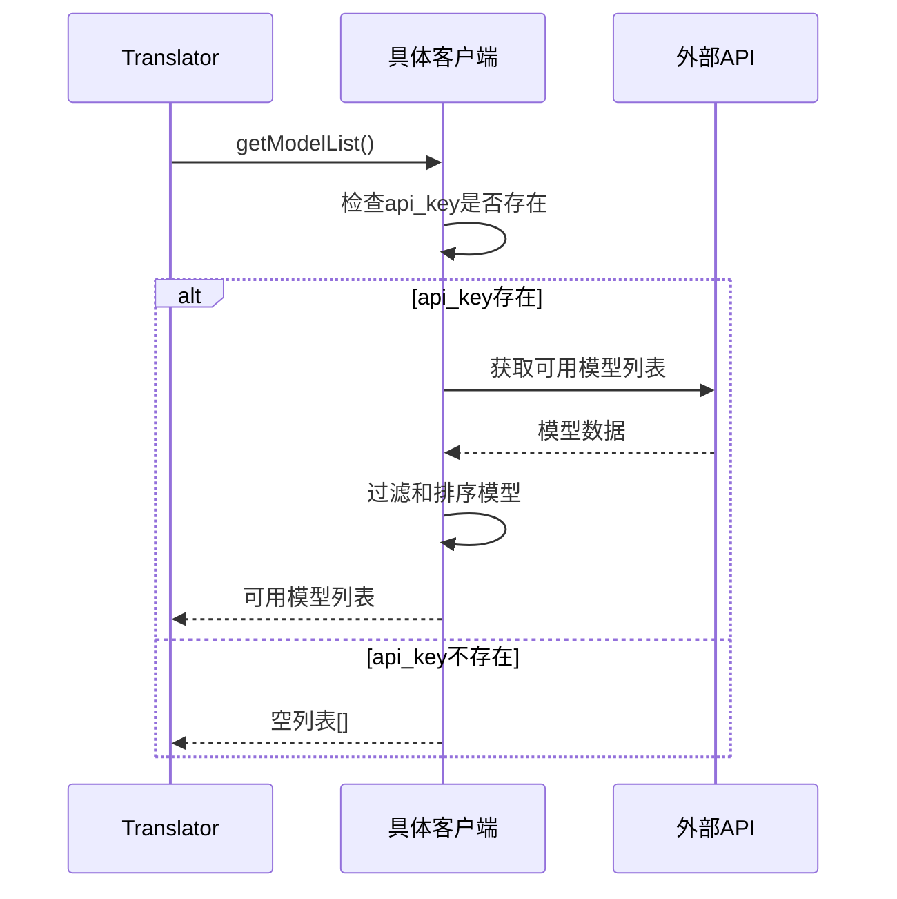

**图表来源**
- [translation_plamo.py](file://src-python/models/translation/translation_plamo.py#L52-L53)
- [translation_gemini.py](file://src-python/models/translation/translation_gemini.py#L66-L67)
- [translation_openai.py](file://src-python/models/translation/translation_openai.py#L77-L78)

### 模型切换流程

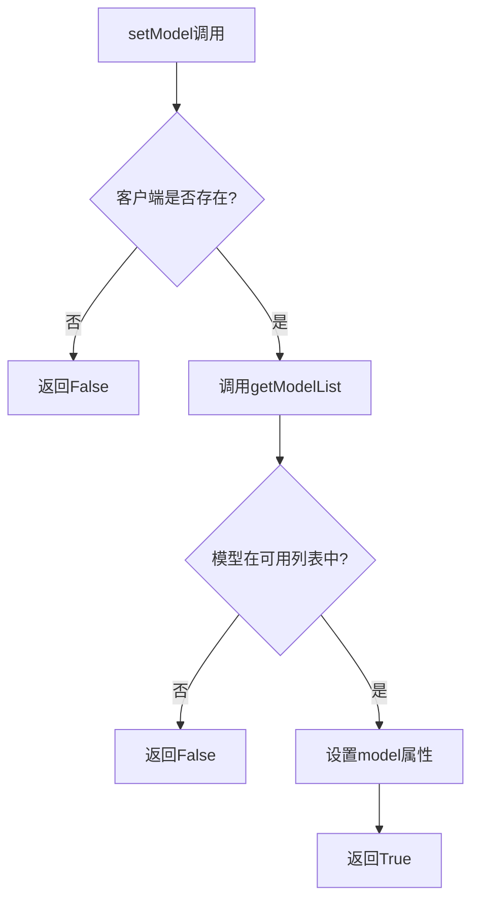

**图表来源**
- [translation_plamo.py](file://src-python/models/translation/translation_plamo.py#L67-L72)
- [translation_gemini.py](file://src-python/models/translation/translation_gemini.py#L81-L86)

### 客户端更新机制

每次模型切换后都需要调用对应的更新方法来重新创建客户端实例：

**章节来源**
- [translation_translator.py](file://src-python/models/translation/translation_translator.py#L107-L109)
- [translation_translator.py](file://src-python/models/translation/translation_translator.py#L140-L142)

## 统一接口设计

Translator类提供了统一的翻译接口，无论使用哪个翻译引擎，都可以通过相同的API进行调用。

### 翻译方法架构

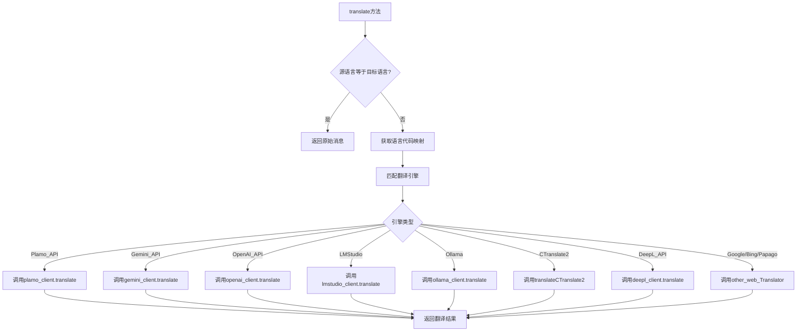

**图表来源**
- [translation_translator.py](file://src-python/models/translation/translation_translator.py#L331-L441)

### 引擎选择逻辑

系统根据配置的翻译引擎名称选择相应的客户端实例：

**章节来源**
- [translation_translator.py](file://src-python/models/translation/translation_translator.py#L343-L441)

## 异常处理策略

系统采用了多层次的异常处理策略，确保在各种故障情况下都能保持系统的稳定性。

### 错误处理层次

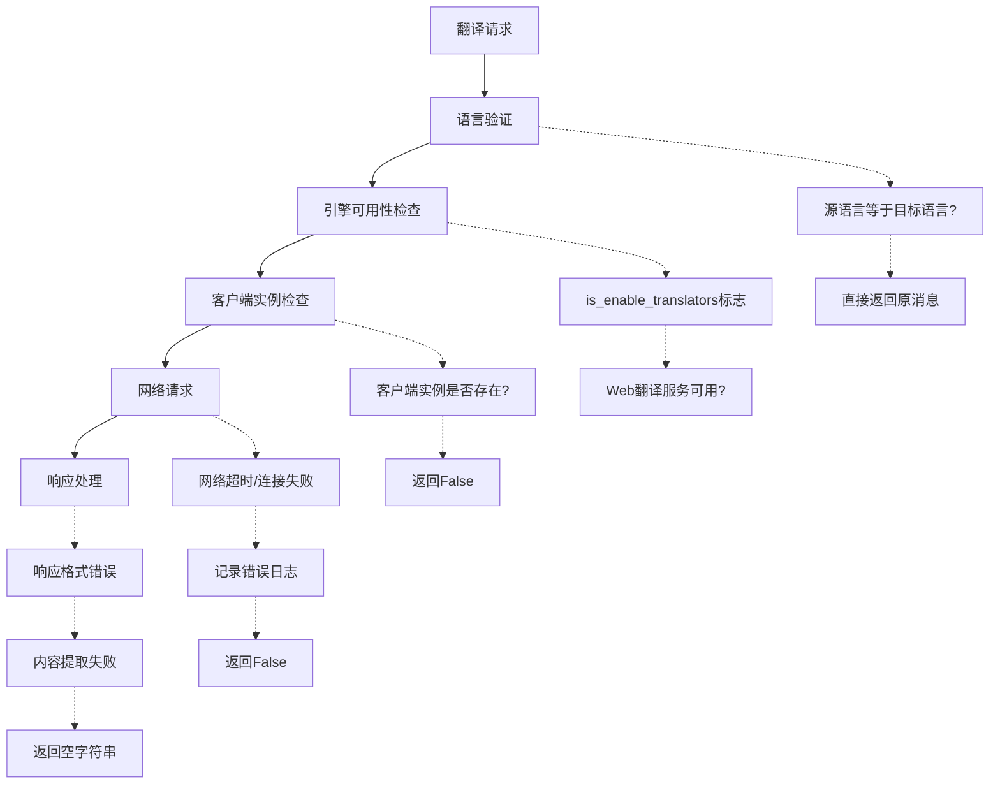

**图表来源**
- [translation_translator.py](file://src-python/models/translation/translation_translator.py#L438-L441)

### 异常捕获机制

系统在关键位置设置了异常捕获：

**章节来源**
- [translation_translator.py](file://src-python/models/translation/translation_translator.py#L438-L441)
- [translation_plamo.py](file://src-python/models/translation/translation_plamo.py#L103-L104)
- [translation_gemini.py](file://src-python/models/translation/translation_gemini.py#L116-L117)

### 日志记录系统

系统使用专门的日志记录函数来记录错误信息：

**章节来源**
- [utils.py](file://src-python/utils.py#L280-L291)

## 依赖可选性设计

系统采用了优雅的依赖可选性设计，即使某些翻译引擎的依赖库缺失，也不会影响其他功能的正常使用。

### 依赖检测机制

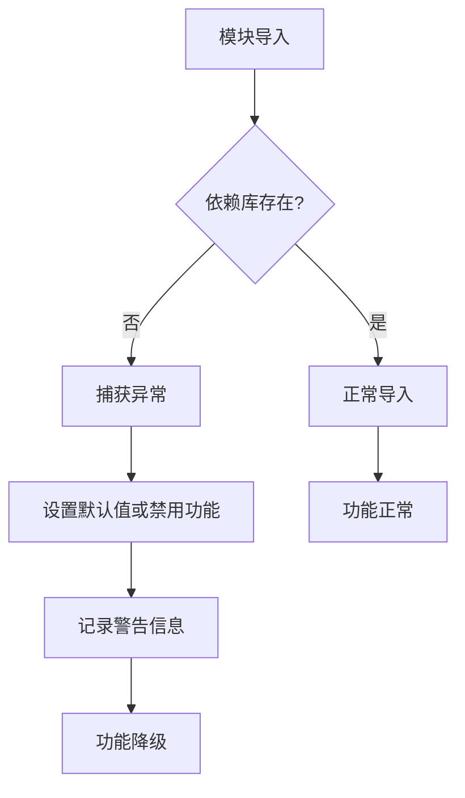

**图表来源**
- [translation_translator.py](file://src-python/models/translation/translation_translator.py#L1-L27)

### 功能降级策略

当某个翻译引擎的依赖缺失时，系统会自动禁用该引擎的相关功能：

**章节来源**
- [translation_translator.py](file://src-python/models/translation/translation_translator.py#L6-L8)
- [translation_translator.py](file://src-python/models/translation/translation_translator.py#L345-L346)

### 动态路径处理

系统具备动态路径处理能力，能够在不同环境下正确找到所需的模块：

**章节来源**
- [translation_plamo.py](file://src-python/models/translation/translation_plamo.py#L8-L15)
- [translation_gemini.py](file://src-python/models/translation/translation_gemini.py#L8-L15)

## 性能优化考虑

系统在设计时充分考虑了性能优化，特别是在网络请求和资源管理方面。

### 延迟加载策略

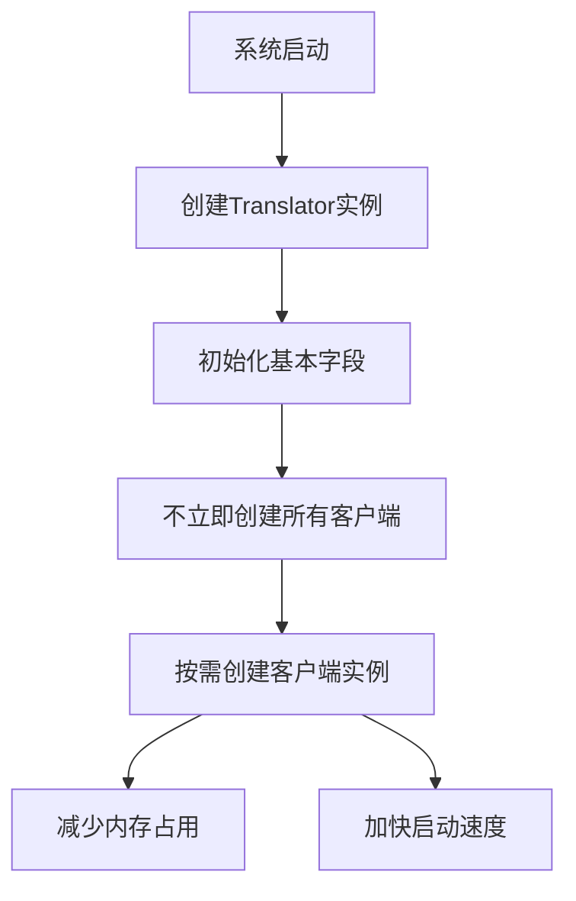

**图表来源**
- [translation_translator.py](file://src-python/models/translation/translation_translator.py#L48-L59)

### 缓存机制

虽然当前版本没有显式的缓存机制，但系统通过以下方式优化性能：

- **客户端实例复用**：同一个客户端实例可以多次使用
- **模型列表缓存**：模型列表在认证后保持不变
- **连接池管理**：底层HTTP客户端自动管理连接池

### 网络请求优化

每个客户端都实现了网络请求的优化：

**章节来源**
- [translation_plamo.py](file://src-python/models/translation/translation_plamo.py#L17-L25)
- [translation_gemini.py](file://src-python/models/translation/translation_gemini.py#L19-L27)
- [translation_openai.py](file://src-python/models/translation/translation_openai.py#L15-L23)

## 总结

VRCT项目的多引擎客户端管理系统展现了优秀的软件架构设计：

### 主要优势

1. **统一接口设计**：通过Translator类提供一致的API，隐藏了不同翻译引擎的复杂性
2. **模块化架构**：每个翻译引擎都是独立的客户端类，便于维护和扩展
3. **健壮的错误处理**：多层次的异常捕获和降级机制确保系统稳定性
4. **灵活的认证机制**：支持多种认证方式和自定义配置
5. **优雅的依赖管理**：可选依赖设计使系统更加灵活可靠

### 设计亮点

- **延迟加载**：只在需要时创建客户端实例，优化资源使用
- **配置驱动**：通过配置文件管理提示模板和语言支持
- **故障转移**：当某个引擎不可用时，系统能够自动切换到其他引擎
- **扩展性强**：新的翻译引擎可以通过类似的方式轻松集成

### 应用价值

这套多引擎客户端管理系统不仅适用于翻译场景，也为其他需要集成多个外部服务的项目提供了优秀的参考架构。其设计理念和实现方式值得在类似的多服务集成项目中借鉴和应用。