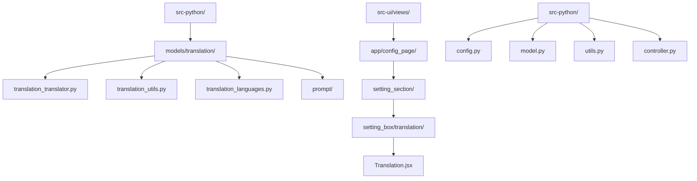
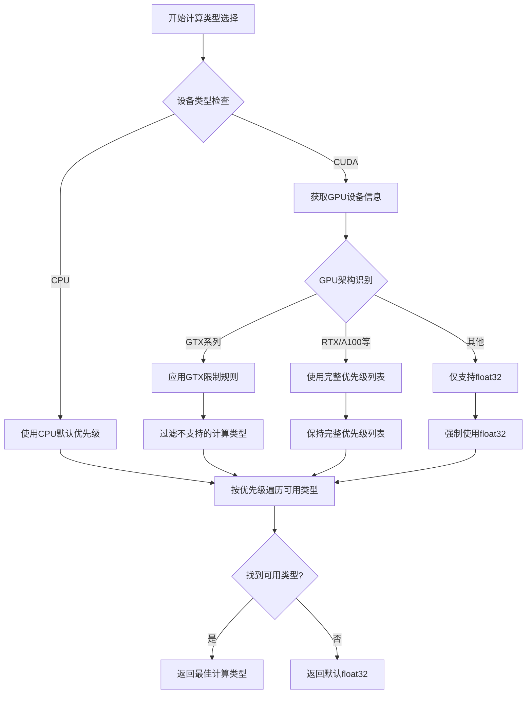
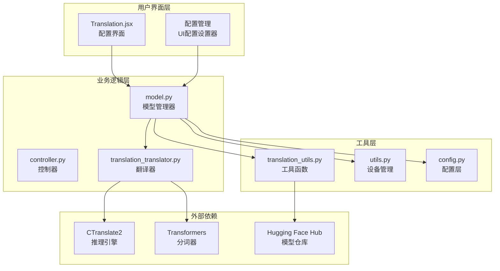
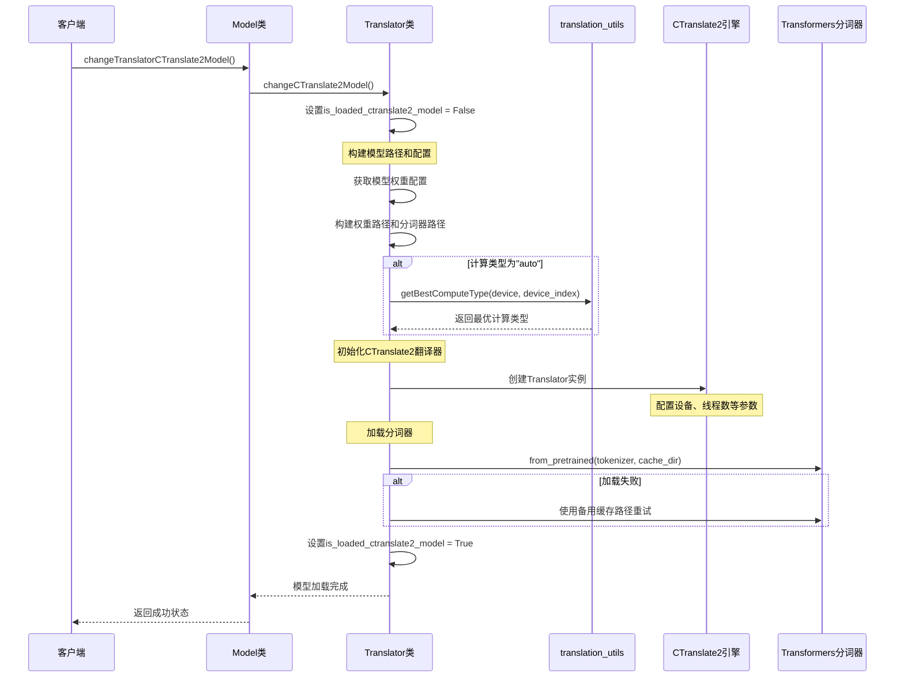
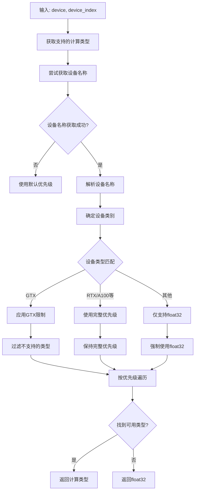
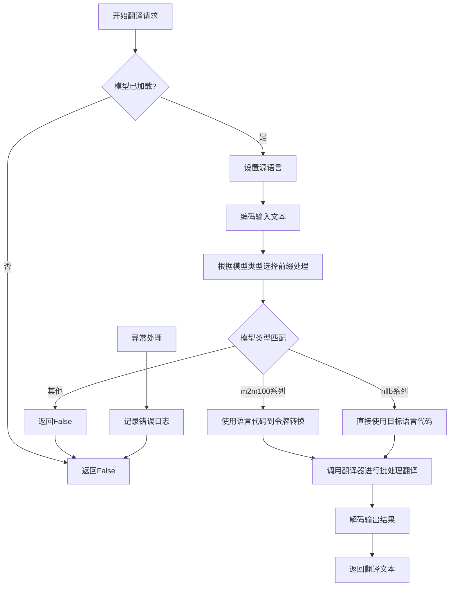
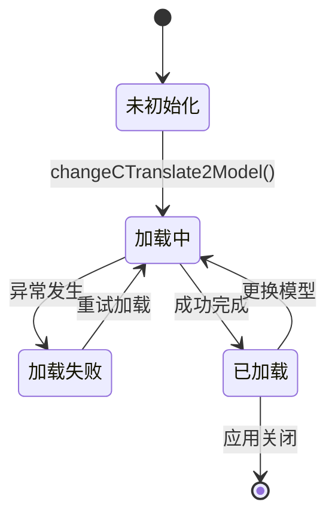
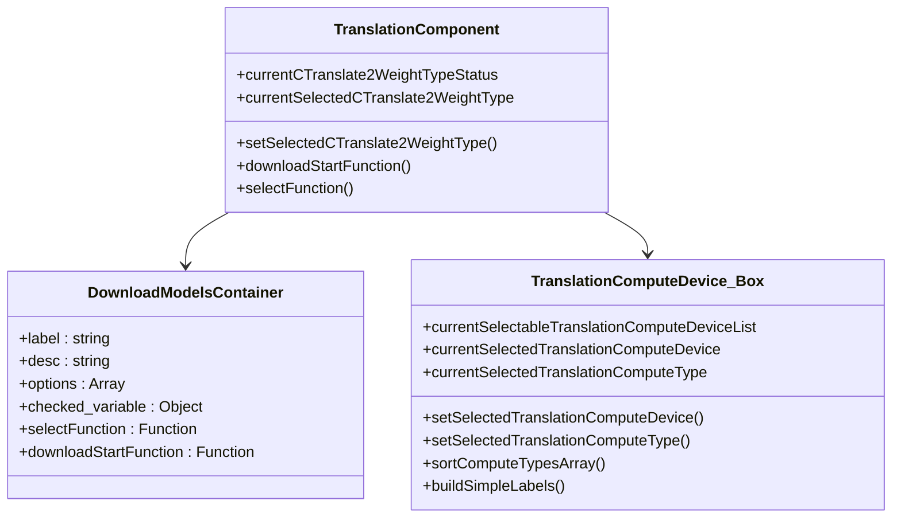
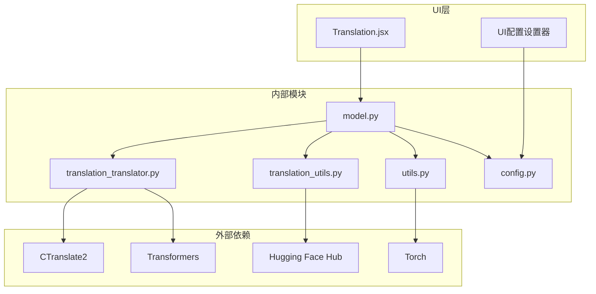

# 本地CTranslate2模型集成

<cite>
**本文档中引用的文件**
- [translation_translator.py](file://src-python/models/translation/translation_translator.py)
- [translation_utils.py](file://src-python/models/translation/translation_utils.py)
- [utils.py](file://src-python/utils.py)
- [config.py](file://src-python/config.py)
- [model.py](file://src-python/model.py)
- [Translation.jsx](file://src-ui/views/app/config_page/setting_section/setting_box/translation/Translation.jsx)
- [controller.py](file://src-python/controller.py)
</cite>

## 目录
1. [简介](#简介)
2. [项目结构概览](#项目结构概览)
3. [核心组件分析](#核心组件分析)
4. [架构概览](#架构概览)
5. [详细组件分析](#详细组件分析)
6. [依赖关系分析](#依赖关系分析)
7. [性能考虑](#性能考虑)
8. [故障排除指南](#故障排除指南)
9. [结论](#结论)

## 简介

本文档详细阐述了VRCT项目中CTranslate2本地翻译模型的集成机制。CTranslate2是一个高性能的神经机器翻译推理引擎，支持多种预训练模型，包括M2M100和NLLB系列。该系统提供了完整的模型加载、配置管理和翻译服务功能。

主要功能包括：
- 自动检测和选择最优计算类型
- 支持多种GPU设备和CPU计算
- 提供模型权重下载和缓存机制
- 实现目标语言前缀处理逻辑
- 提供状态标志和错误回退策略

## 项目结构概览

VRCT项目的翻译模块采用分层架构设计，主要包含以下核心目录：



**图表来源**
- [translation_translator.py](file://src-python/models/translation/translation_translator.py#L1-L50)
- [Translation.jsx](file://src-ui/views/app/config_page/setting_section/setting_box/translation/Translation.jsx#L1-L30)

## 核心组件分析

### CTranslate2模型权重配置

系统支持四种主要的CTranslate2模型类型，每种模型都有特定的配置参数：

| 模型类型 | Hugging Face仓库 | 目录名称 | 分词器类型 |
|---------|-----------------|---------|-----------|
| m2m100_418M-ct2-int8 | jncraton/m2m100_418M-ct2-int8 | m2m100_418M-ct2-int8 | facebook/m2m100_418M |
| m2m100_1.2B-ct2-int8 | jncraton/m2m100_1.2B-ct2-int8 | m2m100_1.2B-ct2-int8 | facebook/m2m100_1.2B |
| nllb-200-distilled-1.3B-ct2-int8 | OpenNMT/nllb-200-distilled-1.3B-ct2-int8 | nllb-200-distilled-1.3B-ct2-int8 | facebook/nllb-200-distilled-1.3B |
| nllb-200-3.3B-ct2-int8 | OpenNMT/nllb-200-3.3B-ct2-int8 | nllb-200-3.3B-ct2-int8 | facebook/nllb-200-3.3B |

**节来源**
- [translation_utils.py](file://src-python/models/translation/translation_utils.py#L27-L48)

### 计算类型优先级系统

系统实现了智能的计算类型选择机制，根据GPU架构自动优化性能：



**图表来源**
- [utils.py](file://src-python/utils.py#L134-L171)

**节来源**
- [utils.py](file://src-python/utils.py#L134-L171)

## 架构概览

CTranslate2集成系统采用多层架构设计，确保模块化和可扩展性：



**图表来源**
- [model.py](file://src-python/model.py#L81-L120)
- [translation_translator.py](file://src-python/models/translation/translation_translator.py#L38-L60)

## 详细组件分析

### changeCTranslate2Model方法详解

`changeCTranslate2Model`方法是CTranslate2模型加载的核心入口点，负责完整的模型初始化流程：



**图表来源**
- [translation_translator.py](file://src-python/models/translation/translation_translator.py#L240-L268)
- [model.py](file://src-python/model.py#L157-L165)

#### 关键参数配置

方法接受以下关键参数：

- **path**: 模型文件根目录路径
- **model_type**: 模型类型标识符
- **device**: 计算设备（"cpu"或"cuda"）
- **device_index**: GPU设备索引
- **compute_type**: 计算精度类型（"auto"时自动选择）

**节来源**
- [translation_translator.py](file://src-python/models/translation/translation_translator.py#L240-L268)

### getBestComputeType函数分析

`getBestComputeType`函数实现了智能的计算类型选择算法：



**图表来源**
- [utils.py](file://src-python/utils.py#L134-L171)

#### 设备特定优先级表

| GPU系列 | 优先级列表 | 说明 |
|---------|-----------|------|
| GTX系列 | ["float32"] | GTX系列不支持高效计算类型 |
| RTX系列 | ["int8_bfloat16", "int8_float16", "int8", "bfloat16", "float16", "int8_float32", "float32"] | 支持所有高效计算类型 |
| Tesla/A100/Quadro | ["int8_bfloat16", "int8_float16", "int8", "bfloat16", "float16", "int8_float32", "float32"] | 企业级GPU支持完整集 |
| 其他 | ["float32"] | 仅支持基础精度 |

**节来源**
- [utils.py](file://src-python/utils.py#L150-L166)

### translateCTranslate2方法实现

`translateCTranslate2`方法处理具体的翻译请求，包含目标语言前缀处理逻辑：



**图表来源**
- [translation_translator.py](file://src-python/models/translation/translation_translator.py#L279-L301)

#### 目标语言前缀处理逻辑

不同模型类型使用不同的前缀处理方式：

- **M2M100模型** (`m2m100_418M-ct2-int8`, `m2m100_1.2B-ct2-int8`):
  - 使用 `lang_code_to_token` 映射将目标语言代码转换为特殊令牌
  - 示例：`target_language` → `[self.ctranslate2_tokenizer.lang_code_to_token[target_language]]`

- **NLLB模型** (`nllb-200-distilled-1.3B-ct2-int8`, `nllb-200-3.3B-ct2-int8`):
  - 直接使用目标语言代码作为前缀
  - 示例：`target_language` → `[target_language]`

**节来源**
- [translation_translator.py](file://src-python/models/translation/translation_translator.py#L289-L294)

### isLoadedCTranslate2Model状态标志

`isLoadedCTranslate2Model`状态标志用于跟踪模型加载状态，提供以下功能：



**图表来源**
- [translation_translator.py](file://src-python/models/translation/translation_translator.py#L270-L271)

#### 状态检查机制

状态标志在多个关键位置被检查：

1. **翻译请求前**：确保模型已正确加载
2. **模型切换时**：验证当前状态
3. **错误恢复时**：决定是否重试

**节来源**
- [translation_translator.py](file://src-python/models/translation/translation_translator.py#L285-L286)

### 模型路径构造和缓存机制

系统实现了智能的模型路径构造和缓存管理：

```mermaid
graph TD
A[模型路径构造] --> B[基础路径: config.PATH_LOCAL]
B --> C[权重目录: weights/ctranslate2/]
C --> D[模型目录: {directory_name}/]
E[分词器路径构造] --> F[基础路径: config.PATH_LOCAL]
F --> G[权重目录: weights/ctranslate2/]
G --> H[模型目录: {directory_name}/]
H --> I[分词器子目录: tokenizer/]
J[缓存策略] --> K[首选缓存: {tokenizer_path}]
K --> L{缓存存在?}
L --> |是| M[直接使用]
L --> |否| N[备用缓存: ./weights/ctranslate2/...]
N --> O[重新下载分词器]
```

**图表来源**
- [translation_translator.py](file://src-python/models/translation/translation_translator.py#L247-L250)
- [translation_utils.py](file://src-python/models/translation/translation_utils.py#L92-L102)

#### 错误回退策略

当模型加载失败时，系统采用多层次的错误回退策略：

1. **首次尝试**：使用标准缓存路径
2. **错误捕获**：记录异常并继续执行
3. **备用路径**：使用相对路径重试
4. **分词器分离**：独立处理分词器加载问题

**节来源**
- [translation_translator.py](file://src-python/models/translation/translation_translator.py#L263-L267)

### 用户界面配置集成

前端界面提供了完整的CTranslate2配置管理功能：



**图表来源**
- [Translation.jsx](file://src-ui/views/app/config_page/setting_section/setting_box/translation/Translation.jsx#L57-L104)

#### 配置项说明

| 配置项 | 类型 | 功能描述 |
|-------|------|----------|
| CTranslate2WeightType | 下拉选择 | 选择要使用的模型类型 |
| SelectedTranslationComputeDevice | 多级下拉 | 选择计算设备和设备索引 |
| SelectedTranslationComputeType | 下拉选择 | 选择计算精度类型 |
| 下载状态监控 | 实时更新 | 监控模型下载进度和状态 |

**节来源**
- [Translation.jsx](file://src-ui/views/app/config_page/setting_section/setting_box/translation/Translation.jsx#L57-L104)

## 依赖关系分析

系统的依赖关系呈现清晰的分层结构：



**图表来源**
- [translation_translator.py](file://src-python/models/translation/translation_translator.py#L1-L32)
- [model.py](file://src-python/model.py#L1-L30)

### 模块间通信

各模块通过明确定义的接口进行通信：

1. **配置层**：提供全局配置和设备信息
2. **模型层**：协调各个翻译引擎的生命周期
3. **工具层**：提供通用的辅助功能
4. **UI层**：处理用户交互和状态显示

**节来源**
- [config.py](file://src-python/config.py#L531-L540)
- [model.py](file://src-python/model.py#L157-L165)

## 性能考虑

### 计算类型优化

系统通过智能计算类型选择最大化性能：

- **内存效率**：优先选择低精度计算类型（int8、float16）
- **计算速度**：根据GPU架构选择最适合的计算类型
- **兼容性保证**：提供float32作为最终回退选项

### 并发处理

翻译请求采用异步处理模式：

- **线程池管理**：合理配置内部和外部线程数量
- **资源隔离**：避免与其他任务竞争计算资源
- **错误隔离**：单个翻译失败不影响整体系统稳定性

### 缓存策略

多层次的缓存机制提升用户体验：

- **模型缓存**：避免重复加载大型模型文件
- **分词器缓存**：减少Hugging Face API调用
- **配置缓存**：快速响应用户配置变更

## 故障排除指南

### 常见问题及解决方案

#### 模型加载失败

**症状**：`isLoadedCTranslate2Model()` 返回 `False`

**可能原因**：
1. 磁盘空间不足
2. 权限问题导致文件访问失败
3. 网络连接问题导致模型下载中断

**解决步骤**：
1. 检查磁盘空间：`df -h` 或 Windows 磁盘管理
2. 验证权限：确保程序有写入权重目录的权限
3. 检查网络连接：测试到Hugging Face的网络连通性

#### GPU设备检测失败

**症状**：无法识别可用的GPU设备

**可能原因**：
1. CUDA驱动未正确安装
2. PyTorch与CUDA版本不兼容
3. GPU设备被其他进程占用

**解决步骤**：
1. 检查CUDA安装：`nvcc --version`
2. 验证PyTorch CUDA支持：`python -c "import torch; print(torch.cuda.is_available())"`
3. 检查GPU占用：`nvidia-smi`

#### 计算类型不兼容

**症状**：模型可以加载但翻译失败

**可能原因**：
1. GPU架构不支持所选计算类型
2. 内存不足导致计算类型降级

**解决步骤**：
1. 查看可用计算类型：`get_supported_compute_types(device, device_index)`
2. 手动选择兼容的计算类型
3. 增加GPU内存或使用CPU模式

**节来源**
- [utils.py](file://src-python/utils.py#L108-L132)
- [translation_translator.py](file://src-python/models/translation/translation_translator.py#L252-L253)

### 调试工具

系统提供了丰富的调试和诊断功能：

- **错误日志记录**：详细的异常堆栈信息
- **状态监控**：实时的模型加载状态
- **性能指标**：计算时间和内存使用情况

**节来源**
- [utils.py](file://src-python/utils.py#L280-L291)

## 结论

VRCT项目的CTranslate2模型集成展现了现代AI应用开发的最佳实践。通过精心设计的分层架构、智能的资源配置和完善的错误处理机制，系统实现了高性能、高可靠性的本地翻译服务。

### 主要优势

1. **智能化配置**：自动检测硬件能力并优化配置
2. **容错性强**：多层次的错误处理和回退机制
3. **用户体验佳**：直观的配置界面和实时状态反馈
4. **扩展性好**：模块化设计便于添加新的翻译引擎

### 技术亮点

- **动态计算类型选择**：根据硬件能力自动优化性能
- **智能路径管理**：灵活的模型和分词器路径处理
- **状态管理**：清晰的状态标志和生命周期管理
- **错误恢复**：健壮的异常处理和自动重试机制

该系统为本地AI应用开发提供了优秀的参考范例，展示了如何在保证性能的同时提供良好的用户体验和系统稳定性。