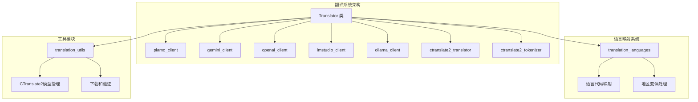
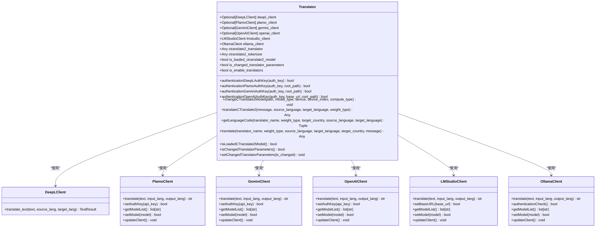
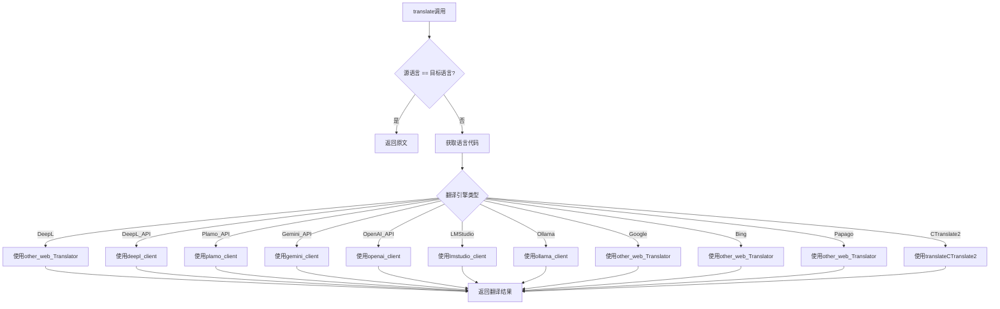
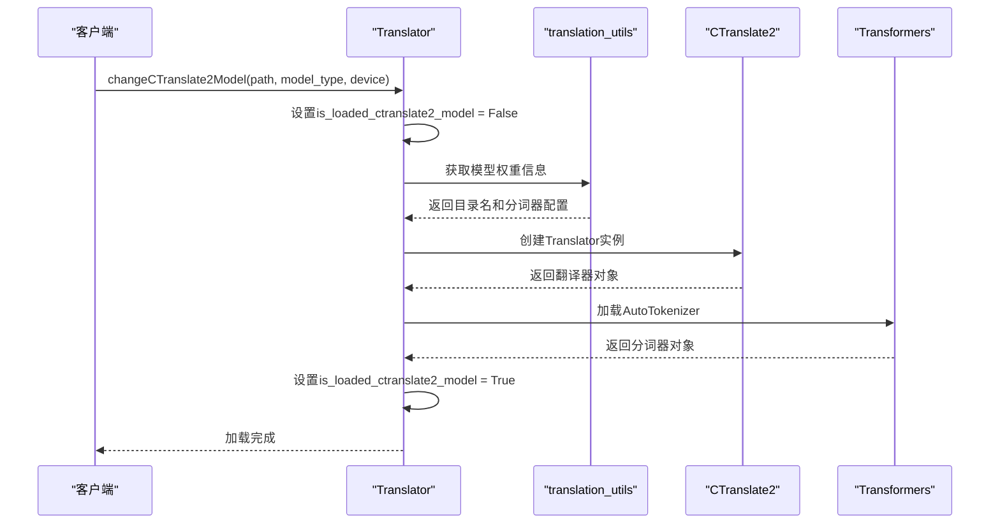
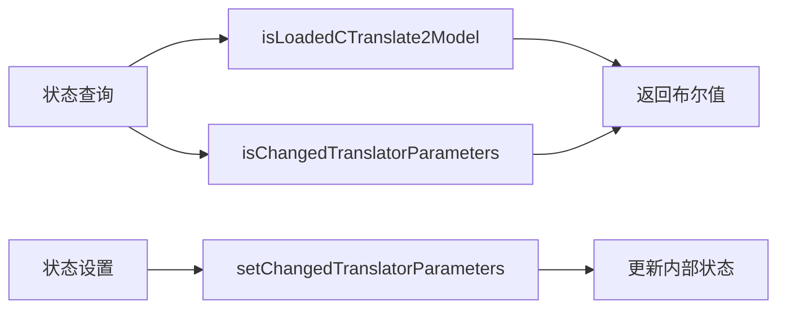
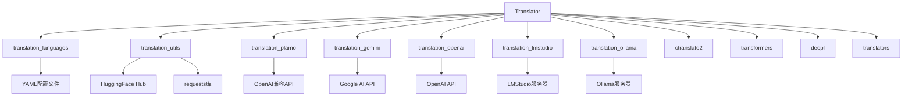
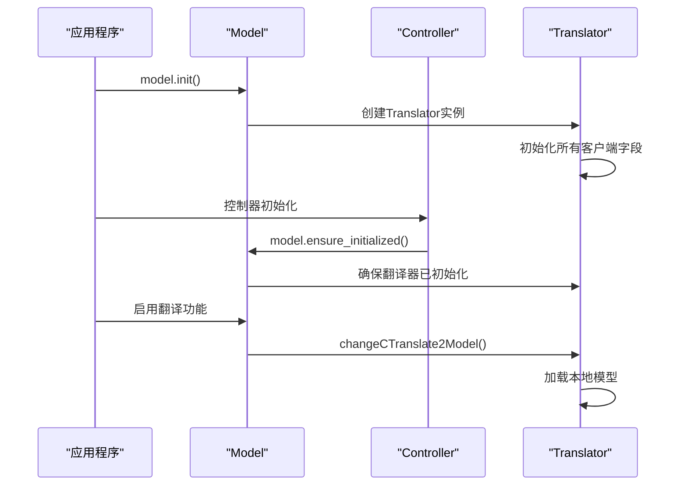

# 统一翻译接口

<cite>
**本文档中引用的文件**
- [translation_translator.py](file://src-python/models/translation/translation_translator.py)
- [translation_languages.py](file://src-python/models/translation/translation_languages.py)
- [translation_utils.py](file://src-python/models/translation/translation_utils.py)
- [model.py](file://src-python/model.py)
- [controller.py](file://src-python/controller.py)
- [translation_plamo.py](file://src-python/models/translation/translation_plamo.py)
- [translation_gemini.py](file://src-python/models/translation/translation_gemini.py)
- [translation_openai.py](file://src-python/models/translation/translation_openai.py)
- [translation_lmstudio.py](file://src-python/models/translation/translation_lmstudio.py)
- [translation_ollama.py](file://src-python/models/translation/translation_ollama.py)
</cite>

## 目录
1. [简介](#简介)
2. [项目结构](#项目结构)
3. [核心组件](#核心组件)
4. [架构概览](#架构概览)
5. [详细组件分析](#详细组件分析)
6. [依赖关系分析](#依赖关系分析)
7. [性能考虑](#性能考虑)
8. [故障排除指南](#故障排除指南)
9. [结论](#结论)

## 简介

Translator类是VRCT多引擎翻译系统的核心统一门面（Facade）模式实现。该类通过集成多种翻译后端（DeepL、Google、Bing、Papago、CTranslate2等），为上层应用提供统一的翻译接口。系统采用运行时动态调度机制，支持多种翻译引擎的无缝切换，并具备完善的错误处理和状态管理功能。

## 项目结构

**图表来源**
- [translation_translator.py](file://src-python/models/translation/translation_translator.py#L38-L59)
- [translation_languages.py](file://src-python/models/translation/translation_languages.py#L29-L30)
- [translation_utils.py](file://src-python/models/translation/translation_utils.py#L27-L48)

**章节来源**
- [translation_translator.py](file://src-python/models/translation/translation_translator.py#L1-L455)

## 核心组件

### Translator类设计

Translator类作为多引擎翻译系统的统一门面，封装了以下核心功能：

#### 字段属性
- **客户端连接**: plamo_client、gemini_client、openai_client等API客户端
- **本地模型**: ctranslate2_translator和ctranslate2_tokenizer用于本地翻译
- **状态管理**: is_loaded_ctranslate2_model和is_changed_translator_parameters标志位
- **功能开关**: is_enable_translators控制Web翻译服务的启用状态

#### 方法分类
- **认证方法**: 各种API的认证和密钥管理
- **模型管理**: CTranslate2模型的加载、切换和状态检查
- **翻译执行**: 统一的翻译接口和语言代码转换
- **状态查询**: 当前配置和模型状态的查询方法

**章节来源**
- [translation_translator.py](file://src-python/models/translation/translation_translator.py#L38-L59)

## 架构概览

**图表来源**
- [translation_translator.py](file://src-python/models/translation/translation_translator.py#L48-L59)
- [translation_plamo.py](file://src-python/models/translation/translation_plamo.py#L41-L115)

## 详细组件分析

### Facade模式实现

Translator类作为Facade模式的典型实现，隐藏了多个翻译后端的复杂性：

#### 运行时动态调度
系统通过`translate()`方法实现运行时动态调度，根据translator_name参数选择相应的翻译引擎：

**图表来源**
- [translation_translator.py](file://src-python/models/translation/translation_translator.py#L331-L441)

**章节来源**
- [translation_translator.py](file://src-python/models/translation/translation_translator.py#L331-L441)

### 语言代码映射机制

`getLanguageCode()`方法实现了复杂的语言代码映射逻辑：

#### 映射规则
1. **DeepL_API特殊处理**: 根据目标国家和地区处理英语和葡萄牙语的地区变体
2. **CTranslate2专用映射**: 基于权重类型进行特定的语言代码转换
3. **通用映射**: 其他引擎使用标准的语言代码映射

#### 地区变体处理
- 英语: 美式英语、英式英语
- 葡萄牙语: 欧洲葡萄牙语、巴西葡萄牙语

**章节来源**
- [translation_translator.py](file://src-python/models/translation/translation_translator.py#L303-L329)

### CTranslate2本地模型加载机制

`changeCTranslate2Model()`方法实现了基于ctranslate2的本地模型加载机制：

#### 加载流程

**图表来源**
- [translation_translator.py](file://src-python/models/translation/translation_translator.py#L240-L268)
- [translation_utils.py](file://src-python/models/translation/translation_utils.py#L27-L48)

#### 支持的模型类型
- **m2m100_418M-ct2-int8**: 小型模型，适合CPU推理
- **m2m100_1.2B-ct2-int8**: 大型模型，需要更多内存
- **nllb-200-distilled-1.3B-ct2-int8**: NLLB小型版本
- **nllb-200-3.3B-ct2-int8**: NLLB大型版本

**章节来源**
- [translation_translator.py](file://src-python/models/translation/translation_translator.py#L240-L268)
- [translation_utils.py](file://src-python/models/translation/translation_utils.py#L27-L48)

### 状态管理系统

#### 状态标志位
- **is_loaded_ctranslate2_model**: 标记CTranslate2模型是否已成功加载
- **is_changed_translator_parameters**: 标记翻译器参数是否发生变化
- **is_enable_translators**: 控制Web翻译服务的启用状态

#### 状态查询和设置

**图表来源**
- [translation_translator.py](file://src-python/models/translation/translation_translator.py#L270-L278)

**章节来源**
- [translation_translator.py](file://src-python/models/translation/translation_translator.py#L270-L278)

### 异常处理策略

#### 错误处理层次
1. **网络请求级**: API连接失败、认证错误
2. **模型加载级**: CTranslate2模型加载失败
3. **翻译执行级**: 翻译过程中的各种异常
4. **语言映射级**: 语言代码转换失败

#### 降级机制
- **在线引擎失败**: 自动尝试其他可用引擎
- **本地模型失败**: 返回False并记录错误日志
- **认证失败**: 清理客户端并返回失败状态

**章节来源**
- [translation_translator.py](file://src-python/models/translation/translation_translator.py#L438-L441)

## 依赖关系分析

### 核心依赖图

**图表来源**
- [translation_translator.py](file://src-python/models/translation/translation_translator.py#L1-L32)

### 初始化流程

**图表来源**
- [model.py](file://src-python\model.py#L81-L141)
- [controller.py](file://src-python\controller.py#L11-L27)

**章节来源**
- [model.py](file://src-python\model.py#L81-L141)
- [controller.py](file://src-python\controller.py#L11-L27)

## 性能考虑

### 内存管理
- **延迟加载**: 只在需要时初始化各个翻译客户端
- **资源清理**: 提供禁用翻译功能的方法释放内存
- **模型缓存**: CTranslate2模型加载后保持在内存中

### 计算优化
- **设备选择**: 支持CPU和GPU计算设备
- **精度控制**: 可配置的计算精度（int8、float16等）
- **线程配置**: 可调整的并发线程数

### 网络优化
- **连接复用**: API客户端支持连接池
- **超时控制**: 合理的网络请求超时设置
- **重试机制**: 网络错误时的自动重试

## 故障排除指南

### 常见问题及解决方案

#### CTranslate2模型加载失败
**症状**: `isLoadedCTranslate2Model()`返回False
**原因**: 
- 模型文件损坏或不完整
- VRAM不足
- 设备驱动问题

**解决方法**:
1. 检查模型文件完整性
2. 减少计算精度（如使用int8）
3. 切换到CPU设备

#### API认证失败
**症状**: 认证方法返回False
**原因**:
- API密钥无效
- 网络连接问题
- 服务配额限制

**解决方法**:
1. 验证API密钥格式
2. 检查网络连接
3. 查看服务配额状态

#### 语言代码转换错误
**症状**: 翻译失败但无明确错误信息
**原因**:
- 不支持的语言对
- 地区变体不匹配

**解决方法**:
1. 检查语言代码映射表
2. 使用备用语言代码
3. 更新语言支持配置

**章节来源**
- [translation_translator.py](file://src-python\models\translation\translation_translator.py#L438-L441)

## 结论

Translator类作为VRCT多引擎翻译系统的核心组件，成功实现了以下目标：

### 设计优势
1. **统一接口**: 为多种翻译引擎提供一致的调用方式
2. **灵活调度**: 支持运行时动态选择翻译引擎
3. **容错性强**: 完善的错误处理和降级机制
4. **扩展性好**: 易于添加新的翻译后端

### 技术特点
1. **Facade模式**: 有效隐藏复杂性，简化客户端调用
2. **状态管理**: 完整的状态跟踪和配置管理
3. **异步处理**: 支持多种计算设备和精度配置
4. **国际化**: 完善的语言代码映射和区域变体处理

### 应用价值
该设计为VRCT系统提供了强大而灵活的翻译能力，支持从云端API到本地模型的多种翻译方案，满足了不同场景下的翻译需求，同时保证了系统的稳定性和可维护性。