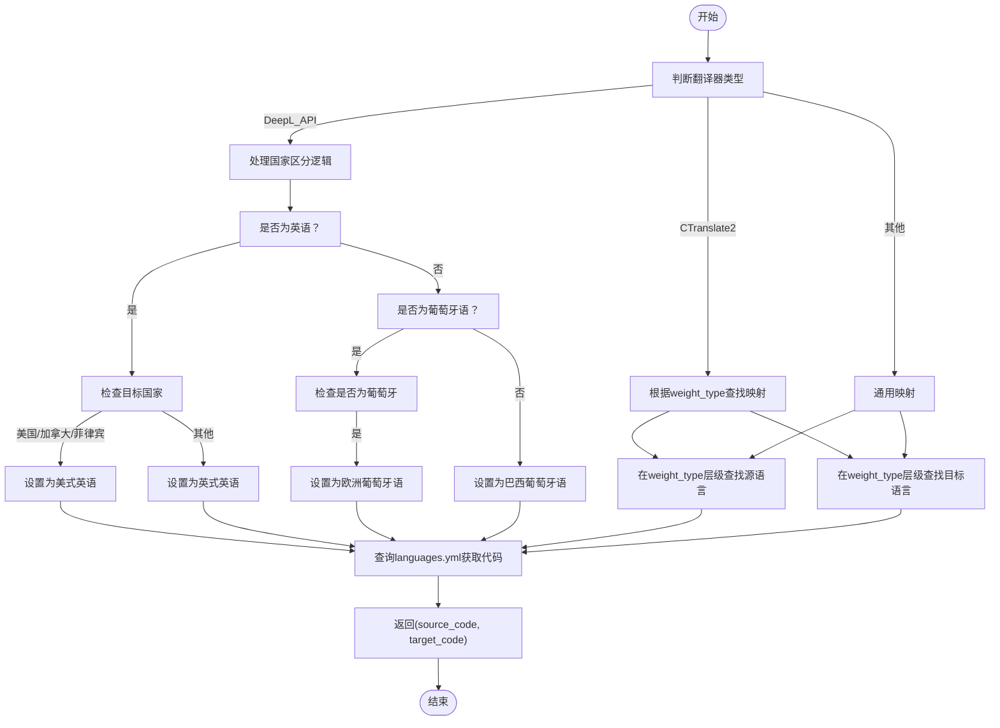
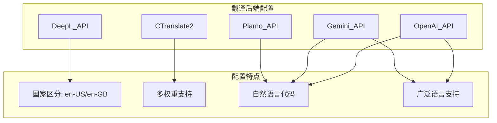

# 语言代码映射系统

<cite>
**本文档引用的文件**  
- [translation_translator.py](file://src-python/models/translation/translation_translator.py)
- [languages.yml](file://src-python/models/translation/languages/languages.yml)
</cite>

## 目录
1. [简介](#简介)
2. [核心组件](#核心组件)
3. [语言代码解析逻辑](#语言代码解析逻辑)
4. [不同翻译后端的语言配置差异](#不同翻译后端的语言配置差异)
5. [实际调用示例](#实际调用示例)
6. [总结](#总结)

## 简介
本系统负责将用户友好的语言名称（如“英语”、“日语”）转换为特定翻译后端所需的语言代码。该过程由 `getLanguageCode` 静态方法驱动，根据翻译器名称（translator_name）、模型权重类型（weight_type）和目标国家（target_country）进行智能映射。特别地，系统支持对英语（美式/英式）和葡萄牙语（欧洲/巴西）等语言基于国家的区分，并为 CTranslate2 等模型提供基于 weight_type 的多层语言映射结构。

## 核心组件

`getLanguageCode` 方法是语言代码映射的核心，其职责是根据输入参数解析出源语言和目标语言的正确代码。该方法位于 `translation_translator.py` 文件中，通过匹配不同的翻译器名称来应用相应的映射规则。

**核心功能包括：**
- 根据目标国家自动区分英语（美式/英式）
- 根据目标国家自动区分葡萄牙语（欧洲/巴西）
- 支持 CTranslate2 模型基于 weight_type 的多层级语言映射
- 统一接口处理多种翻译后端（如 DeepL、Plamo、Gemini 等）

**Section sources**
- [translation_translator.py](file://src-python/models/translation/translation_translator.py#L302-L328)

## 语言代码解析逻辑

### DeepL_API 国家区分逻辑
对于 DeepL_API 翻译器，系统会根据 `target_country` 参数对特定语言进行国家化处理：

- **英语**：
  - 若目标国家为美国、加拿大或菲律宾 → 映射为 "English American" → 语言代码 `en-US`
  - 其他国家 → 映射为 "English British" → 语言代码 `en-GB`

- **葡萄牙语**：
  - 若目标国家为葡萄牙 → 映射为 "Portuguese European" → 语言代码 `pt-PT`
  - 其他国家 → 映射为 "Portuguese Brazilian" → 语言代码 `pt-BR`

此逻辑确保了翻译结果符合目标地区的语言习惯。

### CTranslate2 多层语言映射结构
CTranslate2 模型支持多种权重类型（如 m2m100_418M、nllb-200-distilled-1.3B 等），每种权重类型可能支持不同的语言集。因此，语言映射采用三级结构：

```
translation_lang["CTranslate2"][weight_type]["source"|"target"][language_name]
```

例如：
- 使用 `m2m100_418M-ct2-int8` 权重时，"Chinese Simplified" 映射为 `zh`
- 使用 `nllb-200-distilled-1.3B-ct2-int8` 权重时，"Chinese Simplified" 映射为 `zho_Hans`

这种设计允许系统灵活适配不同模型的能力。



**Diagram sources**
- [translation_translator.py](file://src-python/models/translation/translation_translator.py#L302-L328)
- [languages.yml](file://src-python/models/translation/languages/languages.yml)

**Section sources**
- [translation_translator.py](file://src-python/models/translation/translation_translator.py#L302-L328)

## 不同翻译后端的语言配置差异

系统通过 `languages.yml` 文件集中管理所有翻译后端的语言代码配置。以下是主要后端的配置特点：

### DeepL_API
- 支持国家化语言代码（如 en-US, en-GB, pt-BR, pt-PT）
- 源语言和目标语言映射独立配置
- 仅支持 DeepL 官方 API 支持的语言对

### CTranslate2
- 按 weight_type 分组配置
- 不同模型权重支持不同的语言集和代码格式（如 m2m100 使用 `zh`，NLLB 使用 `zho_Hans`）
- 支持更广泛的语言覆盖

### Plamo_API
- 使用自然语言作为代码（如 "Simplified Chinese"）
- 不区分国家变体
- 适用于 Plamo 模型的特定输入格式

### Gemini_API / OpenAI_API
- 使用自然语言名称作为代码
- 支持广泛的现代语言
- 与 OpenAI/Gemini API 的语言参数兼容



**Diagram sources**
- [languages.yml](file://src-python/models/translation/languages/languages.yml)

**Section sources**
- [languages.yml](file://src-python/models/translation/languages/languages.yml)

## 实际调用示例

### 示例1：DeepL英语国家区分
```python
source, target = Translator.getLanguageCode(
    translator_name="DeepL_API",
    weight_type="",
    target_country="United States",
    source_language="Japanese",
    target_language="English"
)
# 结果: ("ja", "en-US")
```

### 示例2：DeepL葡萄牙语国家区分
```python
source, target = Translator.getLanguageCode(
    translator_name="DeepL_API",
    weight_type="",
    target_country="Portugal",
    source_language="English",
    target_language="Portuguese"
)
# 结果: ("en", "pt-PT")
```

### 示例3：CTranslate2多层映射
```python
source, target = Translator.getLanguageCode(
    translator_name="CTranslate2",
    weight_type="nllb-200-distilled-1.3B-ct2-int8",
    target_country="",
    source_language="Chinese Simplified",
    target_language="English"
)
# 结果: ("zho_Hans", "eng_Latn")
```

这些示例展示了系统如何根据不同的参数组合生成正确的语言代码。

**Section sources**
- [translation_translator.py](file://src-python/models/translation/translation_translator.py#L302-L328)

## 总结
本语言代码映射系统通过 `getLanguageCode` 方法实现了灵活、可扩展的语言代码转换机制。系统核心优势在于：
1. **智能国家区分**：自动根据目标国家选择合适的语言变体
2. **多模型支持**：通过 weight_type 支持不同 CTranslate2 模型的特定需求
3. **集中化配置**：所有语言映射通过 `languages.yml` 统一管理
4. **后端兼容性**：适配 DeepL、Plamo、Gemini 等多种翻译服务的接口要求

该设计确保了用户友好的语言选择能够准确转换为后端所需的格式，提升了系统的可用性和准确性。