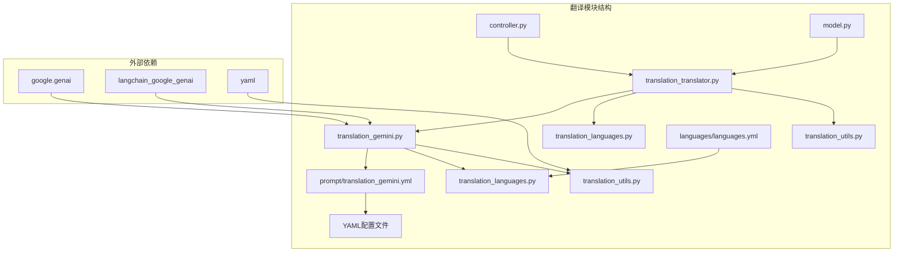
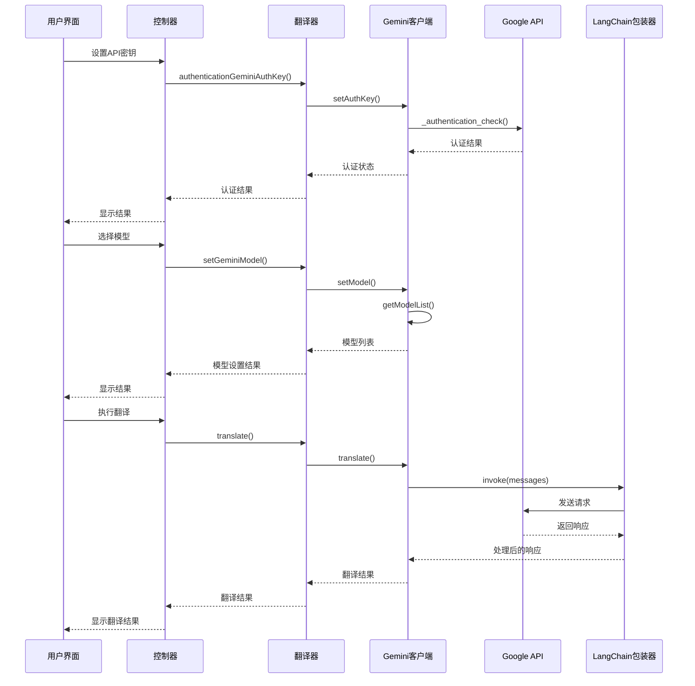
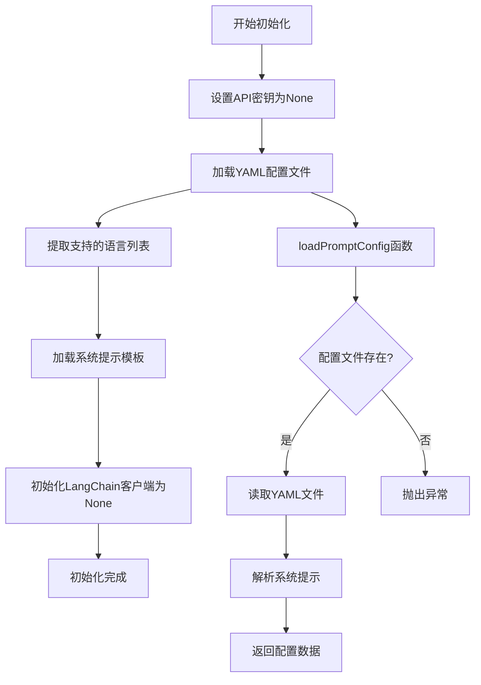
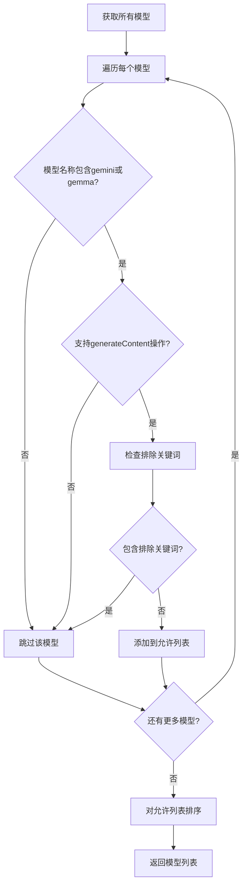
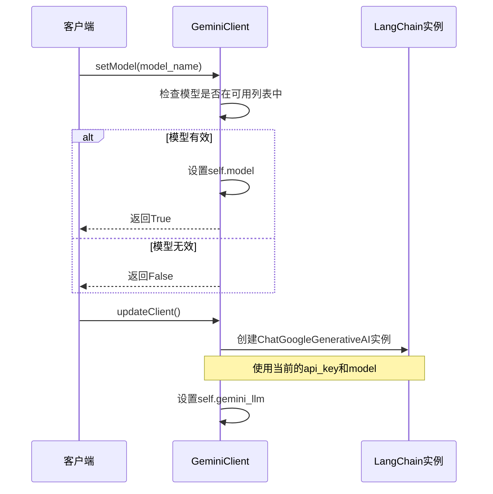
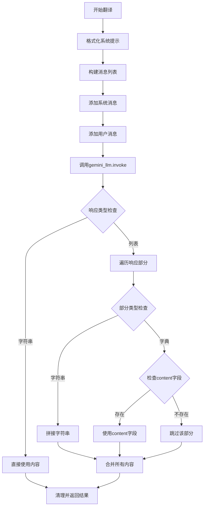
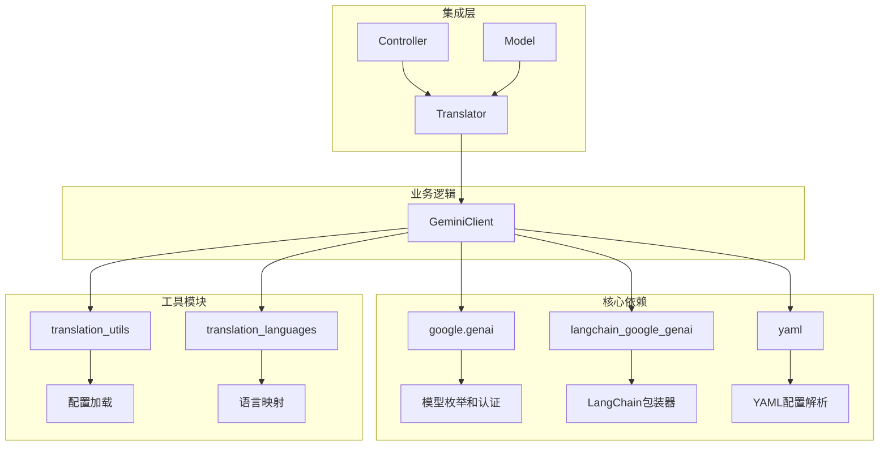

# Gemini翻译引擎

<cite>
**本文档中引用的文件**
- [translation_gemini.py](file://src-python/models/translation/translation_gemini.py)
- [translation_translator.py](file://src-python/models/translation/translation_translator.py)
- [translation_utils.py](file://src-python/models/translation/translation_utils.py)
- [translation_languages.py](file://src-python/models/translation/translation_languages.py)
- [translation_gemini.yml](file://src-python/models/translation/prompt/translation_gemini.yml)
- [languages.yml](file://src-python/models/translation/languages/languages.yml)
- [controller.py](file://src-python/controller.py)
- [model.py](file://src-python/model.py)
</cite>

## 目录
1. [简介](#简介)
2. [项目结构](#项目结构)
3. [核心组件](#核心组件)
4. [架构概览](#架构概览)
5. [详细组件分析](#详细组件分析)
6. [依赖关系分析](#依赖关系分析)
7. [性能考虑](#性能考虑)
8. [故障排除指南](#故障排除指南)
9. [结论](#结论)

## 简介

Gemini翻译引擎是VRCT项目中的一个核心翻译模块，基于Google Generative AI SDK与Gemini API进行交互。该引擎提供了完整的翻译服务，包括API密钥认证、模型选择、文本翻译等功能。通过统一的接口设计，它能够无缝集成到多后端翻译系统中，为用户提供高质量的多语言翻译服务。

## 项目结构

Gemini翻译引擎在项目中的组织结构如下：



**图表来源**
- [translation_gemini.py](file://src-python/models/translation/translation_gemini.py#L1-L128)
- [translation_translator.py](file://src-python/models/translation/translation_translator.py#L1-L455)

**章节来源**
- [translation_gemini.py](file://src-python/models/translation/translation_gemini.py#L1-L128)
- [translation_translator.py](file://src-python/models/translation/translation_translator.py#L1-L455)

## 核心组件

### GeminiClient类

GeminiClient是Gemini翻译引擎的核心类，负责与Google Generative AI API的所有交互。该类提供了完整的生命周期管理，从初始化到翻译执行的全过程控制。

主要功能包括：
- API密钥认证和管理
- 可用模型列表获取和筛选
- LangChain客户端的动态配置
- 多语言翻译服务提供

### 认证检查机制

系统实现了双重认证检查机制：

1. **API密钥格式验证**：确保密钥长度符合Google API的要求
2. **API可用性测试**：通过尝试列出模型来验证密钥的有效性

### 模型筛选算法

系统采用智能筛选算法来选择适合文本翻译的模型：

- 排除音频、图像、机器人等非文本模型
- 支持Gemini和Gemma系列模型
- 确保模型支持generateContent操作

**章节来源**
- [translation_gemini.py](file://src-python/models/translation/translation_gemini.py#L19-L52)

## 架构概览

Gemini翻译引擎采用分层架构设计，确保了良好的可维护性和扩展性：



**图表来源**
- [controller.py](file://src-python/controller.py#L1710-L1760)
- [translation_translator.py](file://src-python/models/translation/translation_translator.py#L111-L142)
- [translation_gemini.py](file://src-python/models/translation/translation_gemini.py#L94-L116)

## 详细组件分析

### 初始化流程

GeminiClient的初始化过程包含了多个关键步骤：



**图表来源**
- [translation_gemini.py](file://src-python/models/translation/translation_gemini.py#L54-L65)

### 认证检查机制

认证检查函数实现了健壮的安全验证：

```mermaid
flowchart TD
A[开始认证检查] --> B[创建genai.Client实例]
B --> C[调用client.models.list()]
C --> D{API调用成功?}
D --> |是| E[返回True]
D --> |否| F[捕获异常]
F --> G[返回False]
E --> H[认证成功]
G --> I[认证失败]
```

**图表来源**
- [translation_gemini.py](file://src-python/models/translation/translation_gemini.py#L19-L27)

### 模型筛选算法

模型筛选过程采用了多维度的过滤策略：



**图表来源**
- [translation_gemini.py](file://src-python/models/translation/translation_gemini.py#L29-L52)

### 系统提示词加载

系统提示词从YAML配置文件中动态加载，支持参数化替换：

| 配置项 | 描述 | 示例值 |
|--------|------|--------|
| `system_prompt` | 主要系统提示模板 | "You are a helpful translation assistant." |
| `{supported_languages}` | 支持的语言列表 | "Arabic, Bengali, Chinese Simplified..." |
| `{input_lang}` | 输入语言 | "Japanese" |
| `{output_lang}` | 输出语言 | "English" |

**章节来源**
- [translation_gemini.py](file://src-python/models/translation/translation_gemini.py#L59-L62)
- [translation_gemini.yml](file://src-python/models/translation/prompt/translation_gemini.yml#L1-L7)

### setModel和updateClient协同工作机制

这两个方法协同工作，确保LangChain客户端的正确配置：



**图表来源**
- [translation_gemini.py](file://src-python/models/translation/translation_gemini.py#L81-L92)

### translate方法实现

translate方法展示了完整的消息构建和响应处理流程：



**图表来源**
- [translation_gemini.py](file://src-python/models/translation/translation_gemini.py#L94-L116)

### 错误处理机制

系统实现了多层次的错误处理策略：

1. **API级别错误**：通过异常捕获处理网络和认证问题
2. **模型级别错误**：验证模型可用性和有效性
3. **响应级别错误**：处理不同类型的API响应格式
4. **配置级别错误**：确保配置文件和语言映射的完整性

**章节来源**
- [translation_gemini.py](file://src-python/models/translation/translation_gemini.py#L19-L27)
- [translation_translator.py](file://src-python/models/translation/translation_translator.py#L111-L142)

## 依赖关系分析

Gemini翻译引擎的依赖关系展现了清晰的模块化设计：



**图表来源**
- [translation_gemini.py](file://src-python/models/translation/translation_gemini.py#L1-L10)
- [translation_translator.py](file://src-python/models/translation/translation_translator.py#L1-L28)

**章节来源**
- [translation_gemini.py](file://src-python/models/translation/translation_gemini.py#L1-L10)
- [translation_utils.py](file://src-python/models/translation/translation_utils.py#L104-L117)

## 性能考虑

### 模型缓存策略

系统采用了智能的模型缓存机制：
- 模型列表仅在API密钥变更时重新获取
- LangChain客户端在配置变更时重建
- 避免重复的API调用和不必要的资源消耗

### 异步处理能力

虽然当前实现是同步的，但架构设计支持未来的异步扩展：
- LangChain客户端可以配置为异步模式
- API调用可以通过连接池优化
- 响应处理支持流式输出

### 内存管理

系统实现了有效的内存管理策略：
- 及时释放不再使用的LangChain实例
- 配置数据的按需加载
- 异常情况下的资源清理

## 故障排除指南

### 常见问题及解决方案

| 问题类型 | 症状 | 可能原因 | 解决方案 |
|----------|------|----------|----------|
| 认证失败 | setAuthKey返回False | API密钥无效或网络问题 | 检查密钥格式和网络连接 |
| 模型不可用 | getModelList为空 | 密钥无访问权限或配额不足 | 验证API权限和配额状态 |
| 翻译错误 | translate抛出异常 | 模型不支持或请求格式错误 | 检查模型兼容性和请求参数 |
| 配置错误 | 加载配置文件失败 | 文件路径或格式问题 | 验证YAML文件格式和路径 |

### 调试技巧

1. **启用详细日志**：通过修改logger级别获取更多调试信息
2. **检查网络连接**：确保能够访问Google API服务
3. **验证配置文件**：确认YAML文件格式正确且路径存在
4. **测试API连通性**：直接使用genai.Client测试基础功能

**章节来源**
- [translation_gemini.py](file://src-python/models/translation/translation_gemini.py#L19-L27)
- [translation_utils.py](file://src-python/models/translation/translation_utils.py#L104-L117)

## 结论

Gemini翻译引擎展现了优秀的软件工程实践，通过模块化设计、健壮的错误处理和灵活的配置机制，为VRCT项目提供了可靠的翻译服务。其核心特性包括：

1. **安全性**：完善的API密钥认证和验证机制
2. **灵活性**：支持多种模型和配置选项
3. **可维护性**：清晰的代码结构和文档
4. **可扩展性**：模块化设计便于功能扩展
5. **可靠性**：多层次的错误处理和恢复机制

该引擎不仅满足了当前的功能需求，还为未来的功能增强和技术演进奠定了坚实的基础。通过与其他翻译后端的统一接口集成，它为用户提供了多样化的翻译选择，提升了整体系统的竞争力和用户体验。