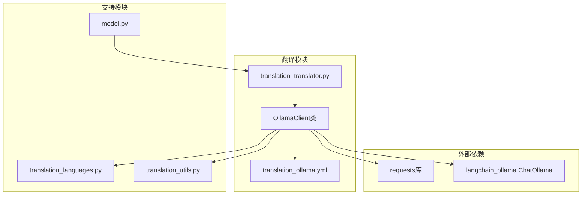
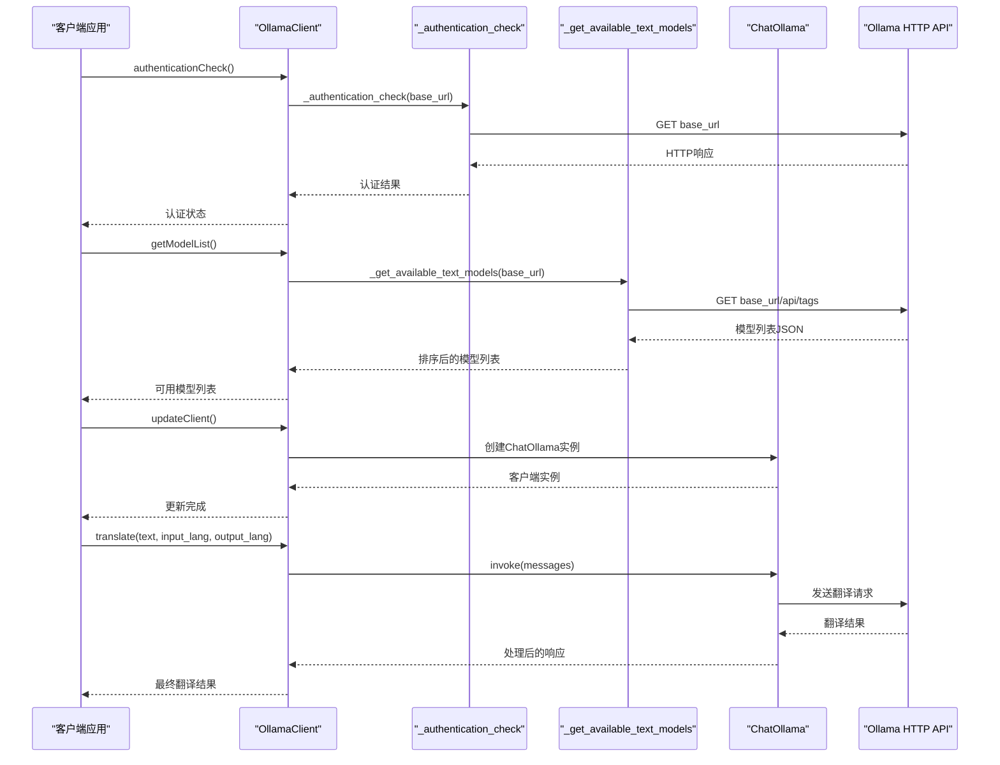
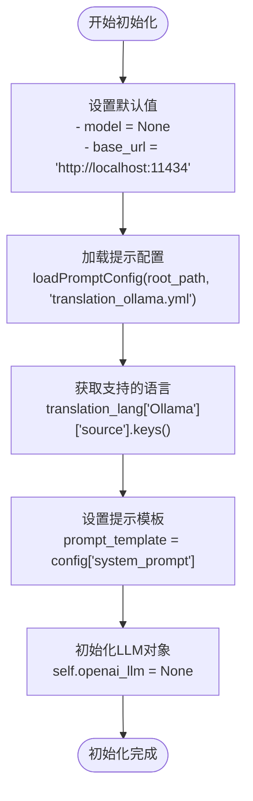
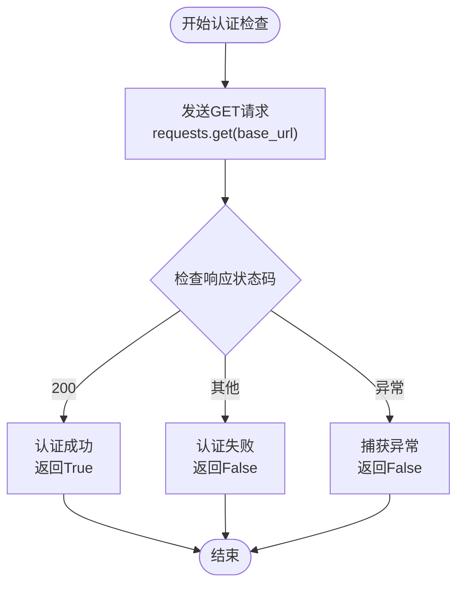
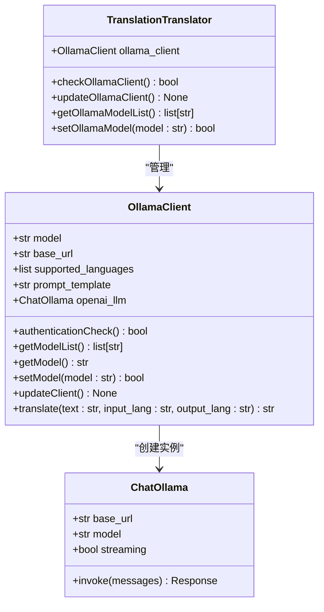
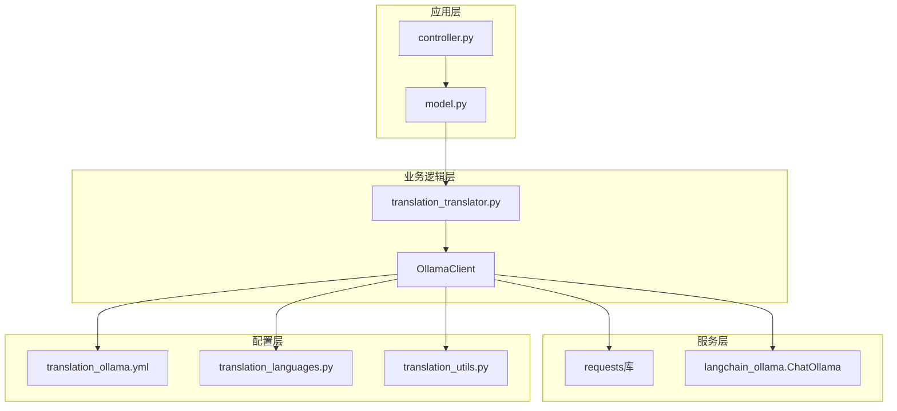

# Ollama翻译引擎详细文档

<cite>
**本文档中引用的文件**
- [translation_ollama.py](file://src-python/src/models/translation/translation_ollama.py)
- [translation_ollama.yml](file://src-python/src/models/translation/prompt/translation_ollama.yml)
- [translation_translator.py](file://src-python/src/models/translation/translation_translator.py)
- [model.py](file://src-python/model.py)
- [controller.py](file://src-python/controller.py)
- [translation_ollama.md](file://src-python/docs/details/translation_ollama.md)
</cite>

## 目录
1. [简介](#简介)
2. [项目结构概览](#项目结构概览)
3. [核心组件分析](#核心组件分析)
4. [架构概览](#架构概览)
5. [详细组件分析](#详细组件分析)
6. [依赖关系分析](#依赖关系分析)
7. [性能考虑](#性能考虑)
8. [故障排除指南](#故障排除指南)
9. [结论](#结论)

## 简介

Ollama翻译引擎是VRCT项目中的一个重要组成部分，它提供了一个本地化的大型语言模型翻译解决方案。该引擎通过HTTP API与本地运行的Ollama服务进行通信，支持多种语言之间的文本翻译。与传统的云服务相比，Ollama引擎具有无需API密钥、完全本地化处理等优势，同时也有其特定的限制和配置要求。

## 项目结构概览

Ollama翻译引擎在项目中的组织结构如下：

**图表来源**
- [translation_ollama.py](file://src-python/src/models/translation/translation_ollama.py#L1-L112)
- [translation_translator.py](file://src-python/src/models/translation/translation_translator.py#L47-L58)

**章节来源**
- [translation_ollama.py](file://src-python/src/models/translation/translation_ollama.py#L1-L112)
- [translation_translator.py](file://src-python/src/models/translation/translation_translator.py#L1-L100)

## 核心组件分析

### OllamaClient类

OllamaClient是整个翻译引擎的核心类，负责管理与Ollama服务的通信和翻译功能。该类提供了完整的生命周期管理，从初始化到实际翻译的全过程控制。

主要特性：
- **HTTP API通信**：通过requests库与Ollama服务进行HTTP通信
- **LangChain集成**：通过ChatOllama包装器集成到LangChain框架
- **模型管理**：支持动态选择和切换翻译模型
- **认证检查**：提供服务可用性验证机制

### 认证检查机制

认证检查通过`_authentication_check`函数实现，该函数执行以下操作：

1. **基础URL验证**：向指定的基础URL发送GET请求
2. **状态码检查**：验证响应状态码是否为200
3. **异常处理**：捕获所有异常情况并返回False

### 模型列表获取

`_get_available_text_models`函数负责从Ollama服务获取可用的文本模型列表：

1. **API调用**：访问`/api/tags`端点获取模型信息
2. **数据解析**：提取模型名称并排序
3. **错误恢复**：处理API调用失败的情况

**章节来源**
- [translation_ollama.py](file://src-python/src/models/translation/translation_ollama.py#L14-L40)

## 架构概览

Ollama翻译引擎采用分层架构设计，确保了良好的模块化和可维护性：

**图表来源**
- [translation_ollama.py](file://src-python/src/models/translation/translation_ollama.py#L56-L102)
- [translation_translator.py](file://src-python/src/models/translation/translation_translator.py#L209-L237)

## 详细组件分析

### OllamaClient类详细分析

#### 初始化过程

OllamaClient的初始化过程包含以下关键步骤：

**图表来源**
- [translation_ollama.py](file://src-python/src/models/translation/translation_ollama.py#L46-L53)

#### 认证检查流程

认证检查是确保Ollama服务可用性的关键机制：

**图表来源**
- [translation_ollama.py](file://src-python/src/models/translation/translation_ollama.py#L14-L24)

#### 模型管理机制

模型管理涉及多个层次的操作：

**图表来源**
- [translation_ollama.py](file://src-python/src/models/translation/translation_ollama.py#L41-L101)
- [translation_translator.py](file://src-python/src/models/translation/translation_translator.py#L47-L58)

#### 翻译方法实现

翻译方法是整个引擎的核心功能，其实现包含以下步骤：

1. **系统提示构建**：根据输入语言和输出语言格式化系统提示
2. **消息构造**：构建包含系统提示和用户消息的消息数组
3. **LLM调用**：通过ChatOllama调用翻译模型
4. **响应处理**：处理不同类型的响应内容并返回最终结果

**章节来源**
- [translation_ollama.py](file://src-python/src/models/translation/translation_ollama.py#L81-L102)

### LangChain集成分析

OllamaClient通过ChatOllama包装器与LangChain框架集成，这种集成提供了以下优势：

#### ChatOllama配置

ChatOllama的配置参数包括：
- **base_url**：指向本地Ollama服务的URL
- **model**：当前使用的翻译模型
- **streaming**：禁用流式传输（streaming=False）

#### 集成优势

1. **标准化接口**：通过ChatOllama提供统一的LLM接口
2. **错误处理**：LangChain框架提供的健壮错误处理机制
3. **扩展性**：便于与其他LangChain组件集成
4. **兼容性**：保持与OpenAI API的兼容性

**章节来源**
- [translation_ollama.py](file://src-python/src/models/translation/translation_ollama.py#L74-L79)

### 认证机制对比分析

Ollama引擎与云服务引擎在认证机制上存在显著差异：

| 特性 | Ollama引擎 | 云服务引擎 |
|------|------------|------------|
| **认证方式** | 基于网络可达性 | API Key认证 |
| **安全性** | 本地网络隔离 | 云端认证 |
| **配置复杂度** | 低（无需密钥） | 中等（需要管理密钥） |
| **成本** | 免费（本地部署） | 按使用付费 |
| **延迟** | 本地处理，低延迟 | 网络传输，较高延迟 |
| **可用性** | 依赖本地服务稳定性 | 云服务高可用性 |

#### 认证机制差异说明

**Ollama引擎特点**：
- 不需要API密钥，降低了配置复杂度
- 依赖本地网络连接，对网络环境有要求
- 数据完全本地化处理，隐私保护更好
- 需要确保Ollama服务持续运行

**云服务引擎特点**：
- 需要有效的API密钥才能访问
- 提供全球范围的服务可用性
- 数据传输可能涉及隐私风险
- 通常提供更好的技术支持和SLA

**章节来源**
- [translation_ollama.py](file://src-python/src/models/translation/translation_ollama.py#L14-L24)

## 依赖关系分析

Ollama翻译引擎的依赖关系体现了清晰的分层架构：

**图表来源**
- [translation_ollama.py](file://src-python/src/models/translation/translation_ollama.py#L1-L13)
- [translation_translator.py](file://src-python/src/models/translation/translation_translator.py#L1-L20)

### 关键依赖项说明

1. **requests库**：用于HTTP API通信
2. **langchain_ollama.ChatOllama**：LangChain集成包装器
3. **translation_languages**：语言支持配置
4. **translation_utils**：工具函数和配置加载

**章节来源**
- [translation_ollama.py](file://src-python/src/models/translation/translation_ollama.py#L1-L13)

## 性能考虑

### 网络延迟优化

由于Ollama引擎依赖本地网络通信，性能优化主要集中在以下几个方面：

1. **连接复用**：通过ChatOllama保持连接状态
2. **模型预加载**：提前加载常用模型
3. **缓存策略**：缓存认证状态和模型列表
4. **错误重试**：实现智能的错误恢复机制

### 内存使用优化

1. **对象生命周期管理**：及时清理不需要的对象
2. **响应内容处理**：优化大文本的处理方式
3. **并发控制**：避免过多的并发请求

### 扩展性考虑

1. **多模型支持**：支持动态切换不同模型
2. **配置灵活性**：允许自定义基础URL
3. **错误处理**：提供完善的错误恢复机制

## 故障排除指南

### 常见问题及解决方案

#### 连接问题

**问题**：无法连接到Ollama服务
**原因**：Ollama服务未启动或网络配置错误
**解决方案**：
1. 检查Ollama服务是否正在运行
2. 验证基础URL配置是否正确
3. 测试网络连通性

#### 模型问题

**问题**：无法获取模型列表
**原因**：认证失败或API端点不可用
**解决方案**：
1. 确认Ollama服务正常运行
2. 检查防火墙设置
3. 验证API权限配置

#### 翻译问题

**问题**：翻译结果不准确或为空
**原因**：模型配置错误或提示模板问题
**解决方案**：
1. 验证模型选择是否正确
2. 检查提示模板配置
3. 确认语言支持列表

**章节来源**
- [translation_ollama.py](file://src-python/src/models/translation/translation_ollama.py#L14-L40)

## 结论

Ollama翻译引擎为VRCT项目提供了一个强大而灵活的本地化翻译解决方案。通过HTTP API与本地Ollama服务的集成，该引擎实现了高质量的文本翻译功能，同时保持了良好的隐私保护和成本效益。

### 主要优势

1. **本地化处理**：完全本地化的数据处理，保护用户隐私
2. **零配置认证**：无需API密钥，简化部署流程
3. **LangChain集成**：与现代AI框架无缝集成
4. **灵活配置**：支持多种模型和配置选项

### 适用场景

- **隐私敏感应用**：需要保护数据隐私的场景
- **离线环境**：没有稳定互联网连接的环境
- **成本控制**：希望降低云服务成本的应用
- **定制化需求**：需要特定模型的定制化翻译

### 未来发展方向

1. **流式传输支持**：实现实时翻译显示
2. **模型优化**：支持更多高效的翻译模型
3. **性能提升**：优化内存使用和响应时间
4. **功能扩展**：添加更多语言对和特殊功能

通过深入理解Ollama翻译引擎的设计原理和实现细节，开发者可以更好地利用这一强大的翻译工具，为VRCT项目提供优质的本地化翻译服务。