# 翻译引擎实现深度分析

<cite>
**本文档中引用的文件**
- [translation_gemini.py](file://src-python/models/translation/translation_gemini.py)
- [translation_ollama.py](file://src-python/models/translation/translation_ollama.py)
- [translation_plamo.py](file://src-python/models/translation/translation_plamo.py)
- [translation_openai.py](file://src-python/models/translation/translation_openai.py)
- [translation_lmstudio.py](file://src-python/models/translation/translation_lmstudio.py)
- [translation_translator.py](file://src-python/models/translation/translation_translator.py)
- [translation_utils.py](file://src-python/models/translation/translation_utils.py)
- [languages.yml](file://src-python/models/translation/languages/languages.yml)
- [translation_gemini.yml](file://src-python/models/translation/prompt/translation_gemini.yml)
- [translation_openai.yml](file://src-python/models/translation/prompt/translation_openai.yml)
- [utils.py](file://src-python/utils.py)
</cite>

## 目录
1. [引言](#引言)
2. [系统架构概览](#系统架构概览)
3. [各翻译引擎详细分析](#各翻译引擎详细分析)
4. [统一客户端接口规范](#统一客户端接口规范)
5. [认证与模型管理机制](#认证与模型管理机制)
6. [错误处理与容错机制](#错误处理与容错机制)
7. [性能优化策略](#性能优化策略)
8. [总结与对比分析](#总结与对比分析)

## 引言

VRCT项目实现了一个高度模块化的翻译系统，支持多种云服务翻译引擎，包括Google Gemini、OpenAI、Ollama、Plamo和LMStudio等。该系统采用统一的客户端接口规范，为不同类型的翻译服务提供了标准化的访问方式，同时保持了各引擎特有的功能特性。

## 系统架构概览

整个翻译系统采用分层架构设计，主要包含以下几个层次：

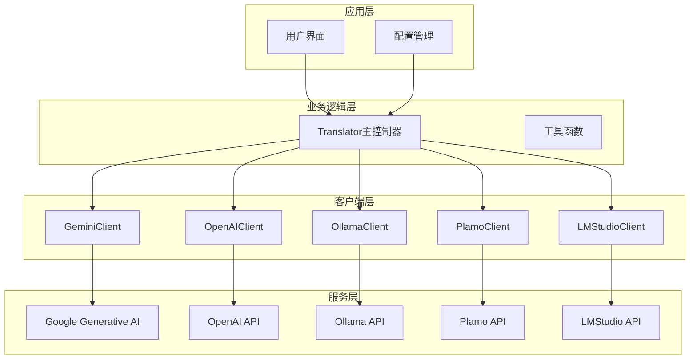

**图表来源**
- [translation_translator.py](file://src-python/models/translation/translation_translator.py#L39-L455)
- [translation_gemini.py](file://src-python/models/translation/translation_gemini.py#L54-L128)
- [translation_openai.py](file://src-python/models/translation/translation_openai.py#L62-L140)

**章节来源**
- [translation_translator.py](file://src-python/models/translation/translation_translator.py#L39-L455)

## 各翻译引擎详细分析

### GeminiClient - Google Generative AI SDK实现

GeminiClient通过Google Generative AI SDK实现流式翻译，具有以下特点：

#### 核心特性
- **SDK集成**: 使用官方的`google`和`langchain_google_genai`库
- **模型过滤**: 智能筛选适合翻译任务的文本模型
- **认证检查**: 提供完整的API密钥验证机制
- **流式处理**: 支持实时响应处理

#### 模型管理机制

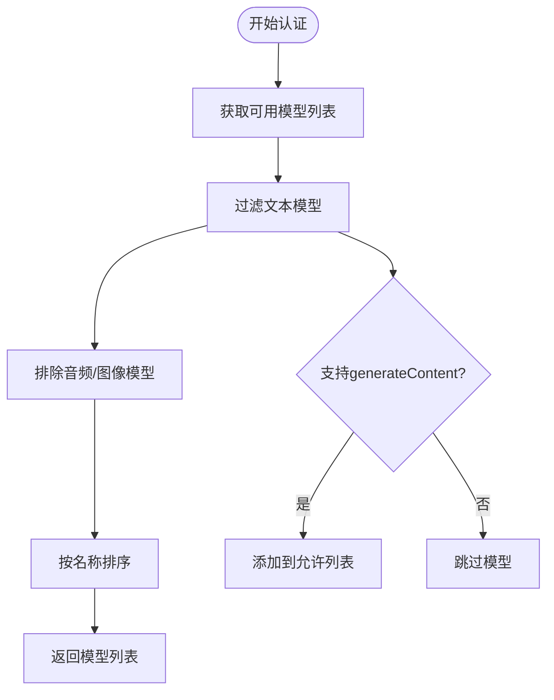

**图表来源**
- [translation_gemini.py](file://src-python/models/translation/translation_gemini.py#L29-L52)

#### 认证流程

GeminiClient实现了严格的认证检查机制：

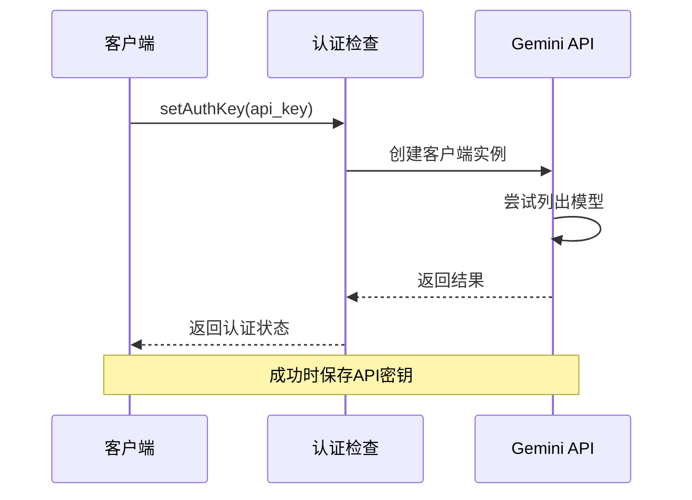

**图表来源**
- [translation_gemini.py](file://src-python/models/translation/translation_gemini.py#L19-L27)

**章节来源**
- [translation_gemini.py](file://src-python/models/translation/translation_gemini.py#L19-L128)

### OllamaClient - 本地API交互

OllamaClient通过本地API进行模型交互，专注于本地部署的大语言模型：

#### 核心特性
- **本地部署**: 无需互联网连接即可运行
- **灵活配置**: 支持自定义base_url
- **模型发现**: 自动扫描本地可用模型
- **轻量级**: 最小化外部依赖

#### 模型发现机制

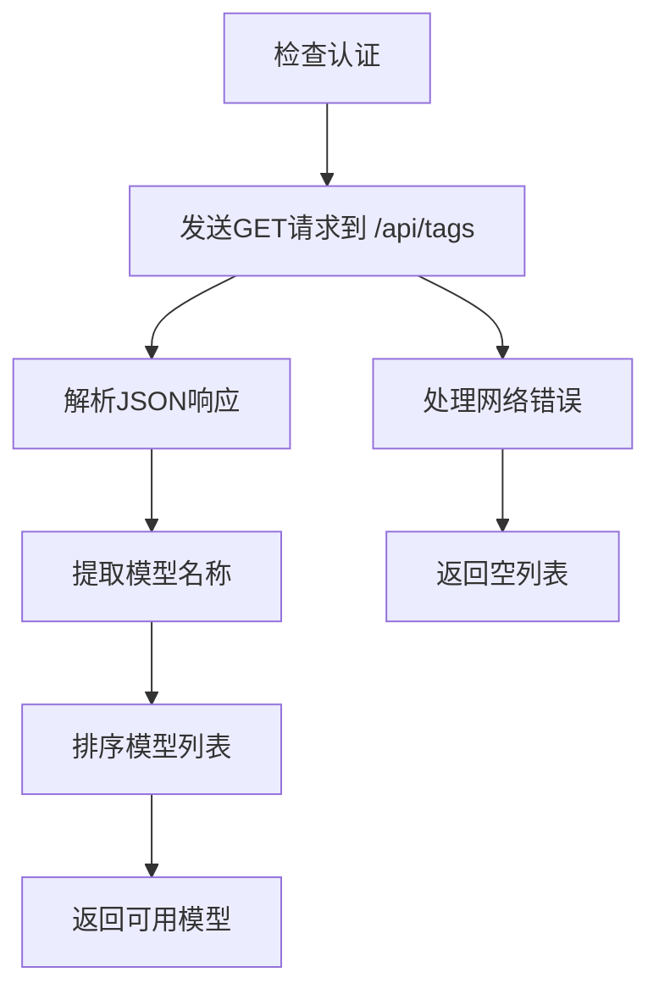

**图表来源**
- [translation_ollama.py](file://src-python/models/translation/translation_ollama.py#L26-L40)

**章节来源**
- [translation_ollama.py](file://src-python/models/translation/translation_ollama.py#L14-L112)

### PlamoClient - 特定HTTP端点调用

PlamoClient专门调用特定的HTTP端点完成翻译请求，针对日本PreferredAI平台优化：

#### 核心特性
- **平台专用**: 针对Plamo API优化
- **固定端点**: 使用预设的BASE_URL
- **兼容性**: 支持标准OpenAI格式
- **安全传输**: 使用SecretStr保护API密钥

#### API交互模式

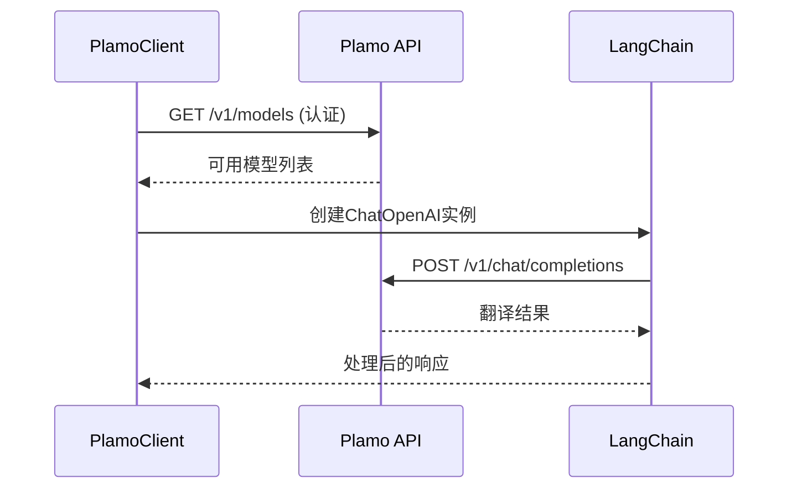

**图表来源**
- [translation_plamo.py](file://src-python/models/translation/translation_plamo.py#L17-L38)

**章节来源**
- [translation_plamo.py](file://src-python/models/translation/translation_plamo.py#L17-L115)

### OpenAIClient - 标准OpenAI API兼容

OpenAIClient兼容标准OpenAI API及各种Azure等兼容端点：

#### 核心特性
- **标准兼容**: 完全兼容OpenAI API规范
- **Azure支持**: 支持Azure OpenAI服务
- **代理兼容**: 支持各种代理端点
- **模型过滤**: 智能筛选适合翻译的GPT模型

#### 模型过滤算法

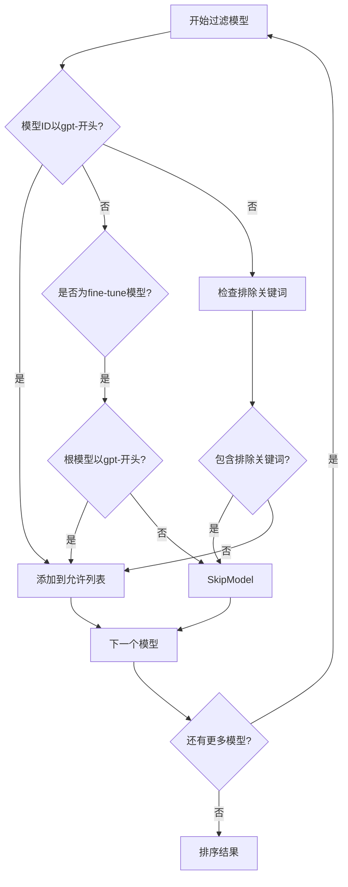

**图表来源**
- [translation_openai.py](file://src-python/models/translation/translation_openai.py#L25-L60)

**章节来源**
- [translation_openai.py](file://src-python/models/translation/translation_openai.py#L15-L140)

### LMStudioClient - 本地大模型服务连接

LMStudioClient通过自定义base_url连接本地大模型服务：

#### 核心特性
- **本地服务**: 连接本地运行的LM Studio
- **灵活配置**: 支持动态base_url设置
- **默认认证**: 使用固定的"lmstudio" API密钥
- **兼容性**: 完全兼容OpenAI格式

#### URL配置流程

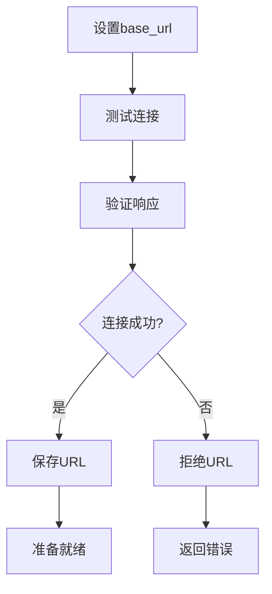

**图表来源**
- [translation_lmstudio.py](file://src-python/models/translation/translation_lmstudio.py#L57-L64)

**章节来源**
- [translation_lmstudio.py](file://src-python/models/translation/translation_lmstudio.py#L15-L118)

## 统一客户端接口规范

所有翻译引擎都遵循统一的客户端接口规范，确保系统的可扩展性和一致性：

### 接口方法定义

| 方法名 | 功能描述 | 参数类型 | 返回类型 |
|--------|----------|----------|----------|
| `getModelList()` | 获取可用模型列表 | 无 | `list[str]` |
| `getAuthKey()` | 获取当前API密钥 | 无 | `str` |
| `setAuthKey(api_key)` | 设置API密钥并验证 | `str` | `bool` |
| `getModel()` | 获取当前使用的模型 | 无 | `str` |
| `setModel(model)` | 设置使用的模型 | `str` | `bool` |
| `updateClient()` | 更新客户端实例 | 无 | `None` |
| `translate(text, input_lang, output_lang)` | 执行翻译操作 | `str, str, str` | `str` |

### 实现差异对比

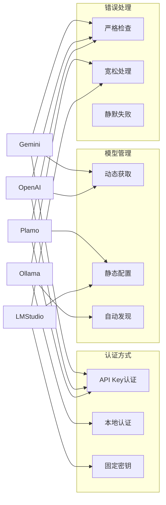

**图表来源**
- [translation_gemini.py](file://src-python/models/translation/translation_gemini.py#L66-L86)
- [translation_openai.py](file://src-python/models/translation/translation_openai.py#L77-L97)
- [translation_ollama.py](file://src-python/models/translation/translation_ollama.py#L59-L71)
- [translation_plamo.py](file://src-python/models/translation/translation_plamo.py#L52-L72)
- [translation_lmstudio.py](file://src-python/models/translation/translation_lmstudio.py#L66-L77)

## 认证与模型管理机制

### 认证机制对比

各引擎采用了不同的认证策略来适应各自的部署环境：

#### GeminiClient认证
- **实现方式**: 直接API调用验证
- **安全性**: 高，即时验证
- **可靠性**: 强，网络连接要求

#### OpenAIClient认证
- **实现方式**: 标准OpenAI认证流程
- **灵活性**: 高，支持多种端点
- **兼容性**: 优秀，广泛支持

#### OllamaClient认证
- **实现方式**: 基础URL可达性检查
- **便捷性**: 高，无需密钥
- **安全性**: 中等，基于网络可达性

#### PlamoClient认证
- **实现方式**: 固定端点验证
- **稳定性**: 高，平台保证
- **限制性**: 强，仅支持特定平台

#### LMStudioClient认证
- **实现方式**: 固定密钥+URL验证
- **简单性**: 高，配置最少
- **安全性**: 中等，固定密钥

### 模型管理策略

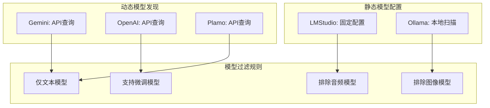

**图表来源**
- [translation_gemini.py](file://src-python/models/translation/translation_gemini.py#L29-L52)
- [translation_openai.py](file://src-python/models/translation/translation_openai.py#L25-L60)
- [translation_ollama.py](file://src-python/models/translation/translation_ollama.py#L26-L40)

**章节来源**
- [translation_gemini.py](file://src-python/models/translation/translation_gemini.py#L19-L86)
- [translation_openai.py](file://src-python/models/translation/translation_openai.py#L15-L97)
- [translation_ollama.py](file://src-python/models/translation/translation_ollama.py#L14-L71)
- [translation_plamo.py](file://src-python/models/translation/translation_plamo.py#L17-L72)
- [translation_lmstudio.py](file://src-python/models/translation/translation_lmstudio.py#L15-L77)

## 错误处理与容错机制

### 网络错误处理策略

系统实现了多层次的错误处理机制来应对常见的网络问题：

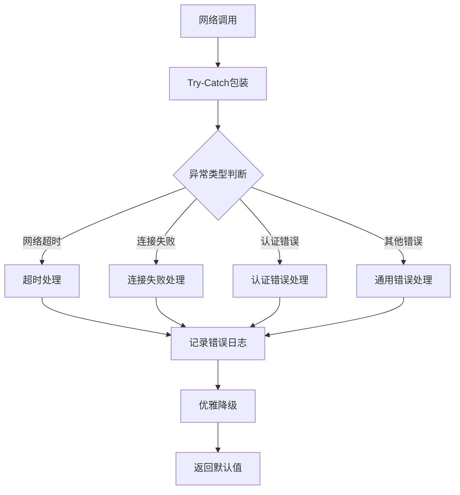

### 错误恢复机制

| 错误类型 | 处理策略 | 恢复方案 | 用户体验 |
|----------|----------|----------|----------|
| 网络超时 | 重试机制 | 指数退避重试 | 显示加载状态 |
| 认证失败 | 密钥重新验证 | 提示重新输入 | 显示认证错误 |
| 模型不可用 | 切换备用模型 | 自动选择可用模型 | 无缝切换 |
| API限流 | 等待重试 | 延迟后重试 | 静默等待 |
| 网络断开 | 本地缓存 | 使用离线模式 | 提示离线状态 |

### 日志记录系统

系统集成了完善的日志记录机制：

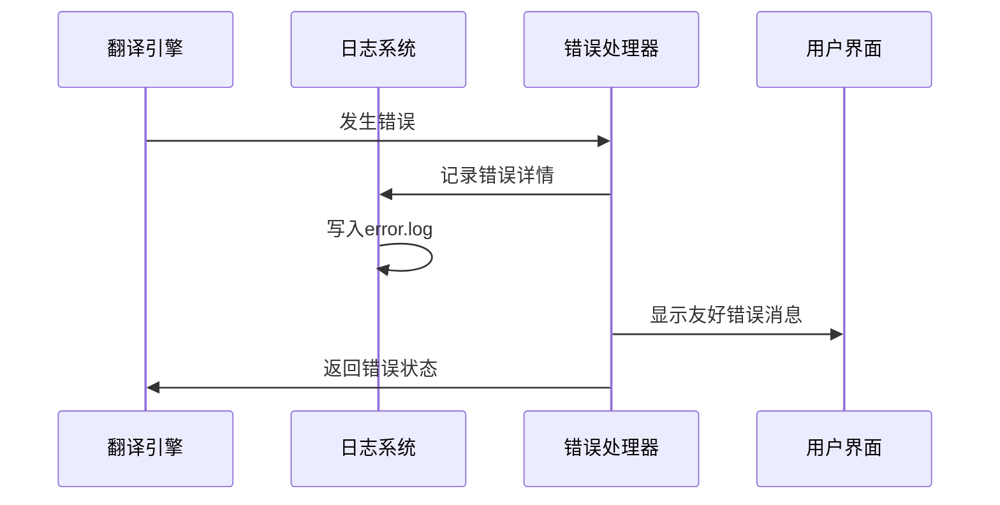

**图表来源**
- [utils.py](file://src-python/utils.py#L556-L566)

**章节来源**
- [utils.py](file://src-python/utils.py#L1-L200)

## 性能优化策略

### 模型加载优化

系统采用了多种策略来优化模型加载和推理性能：

#### CTranslate2本地模型
- **量化支持**: 支持INT8量化减少内存占用
- **多设备支持**: CPU和GPU加速
- **动态计算类型**: 根据硬件自动选择最优精度

#### 流式处理优化
- **实时响应**: 支持流式输出减少延迟
- **缓冲管理**: 智能缓冲区大小调整
- **并发控制**: 限制并发请求数量

#### 缓存机制
- **模型缓存**: 避免重复加载相同模型
- **翻译缓存**: 缓存常见翻译结果
- **配置缓存**: 缓存API配置信息

### 资源管理策略

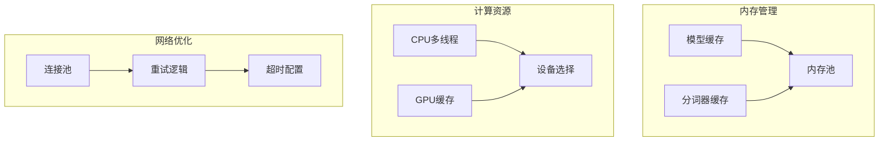

**图表来源**
- [translation_utils.py](file://src-python/models/translation/translation_utils.py#L27-L47)

**章节来源**
- [translation_utils.py](file://src-python/models/translation/translation_utils.py#L50-L139)

## 总结与对比分析

### 技术特点对比

| 特性 | GeminiClient | OpenAIClient | OllamaClient | PlamoClient | LMStudioClient |
|------|--------------|--------------|--------------|-------------|----------------|
| **部署方式** | 云端API | 云端API | 本地部署 | 平台API | 本地服务 |
| **认证复杂度** | 高 | 高 | 低 | 高 | 中 |
| **模型发现** | 动态 | 动态 | 自动 | 动态 | 静态 |
| **网络依赖** | 强 | 强 | 弱 | 强 | 弱 |
| **配置灵活性** | 中 | 高 | 高 | 低 | 中 |
| **本地隐私** | 差 | 差 | 好 | 差 | 好 |
| **成本控制** | 高 | 高 | 低 | 中 | 低 |

### 适用场景建议

#### 推荐使用场景
- **GeminiClient**: 需要Google AI能力的企业级应用
- **OpenAIClient**: 需要广泛模型选择和Azure兼容性的项目
- **OllamaClient**: 注重隐私和离线使用的场景
- **PlamoClient**: 日本市场特定需求的应用
- **LMStudioClient**: 本地开发和测试环境

#### 性能对比分析

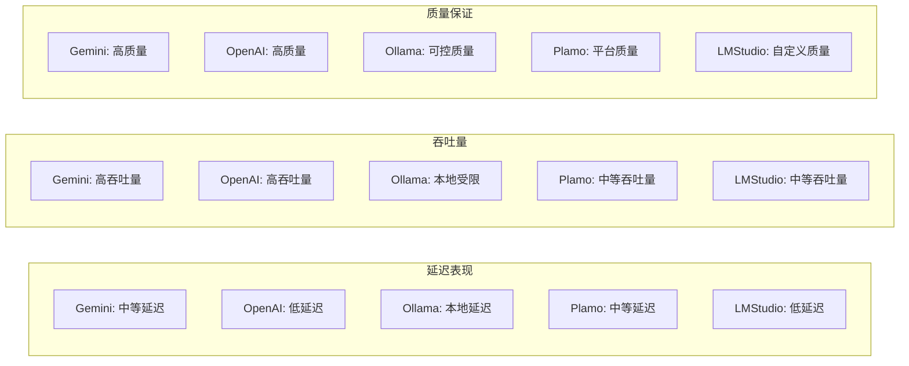

### 架构优势总结

1. **模块化设计**: 每个引擎都是独立的模块，便于维护和扩展
2. **统一接口**: 一致的API设计降低了学习成本和集成难度
3. **容错机制**: 完善的错误处理确保系统稳定性
4. **性能优化**: 多层次的优化策略提升了用户体验
5. **安全考虑**: 不同的安全策略适应各种部署环境

通过这种设计，VRCT项目成功地将多种不同的翻译服务整合到一个统一的框架中，既保持了各引擎的独特优势，又提供了统一的使用体验，为用户提供了灵活而强大的翻译解决方案。