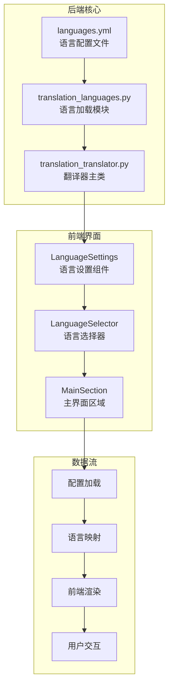
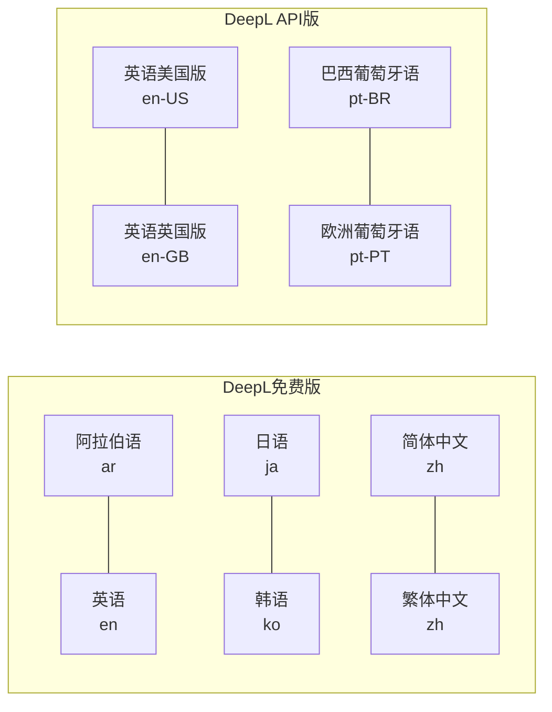
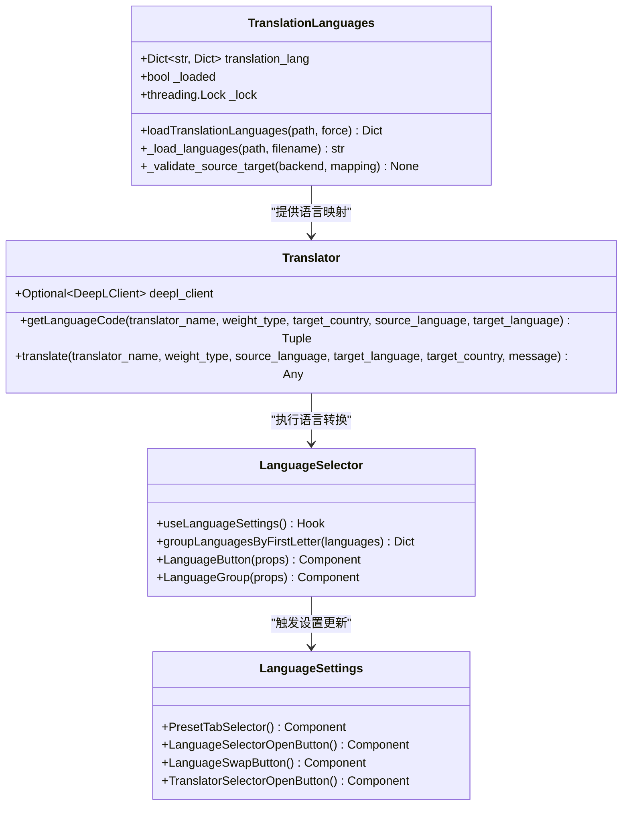
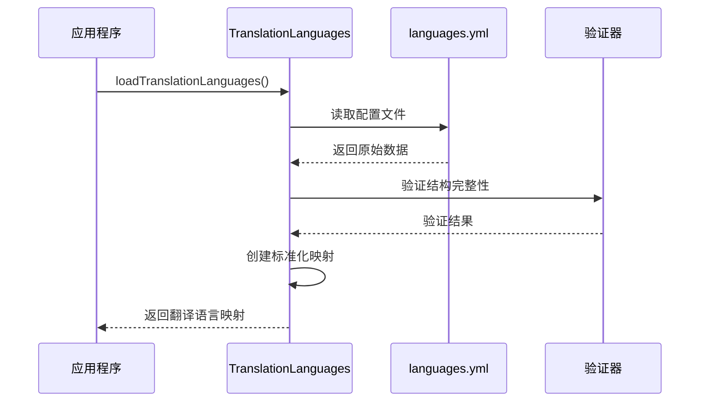
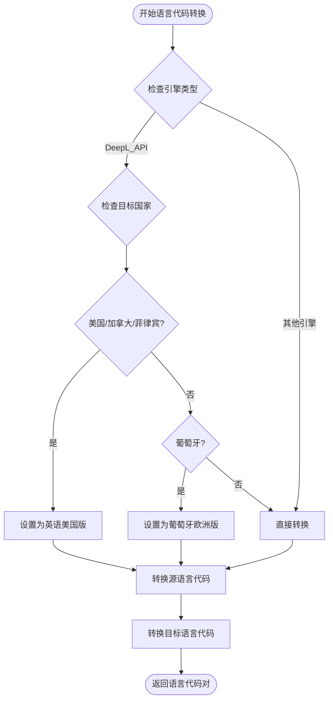
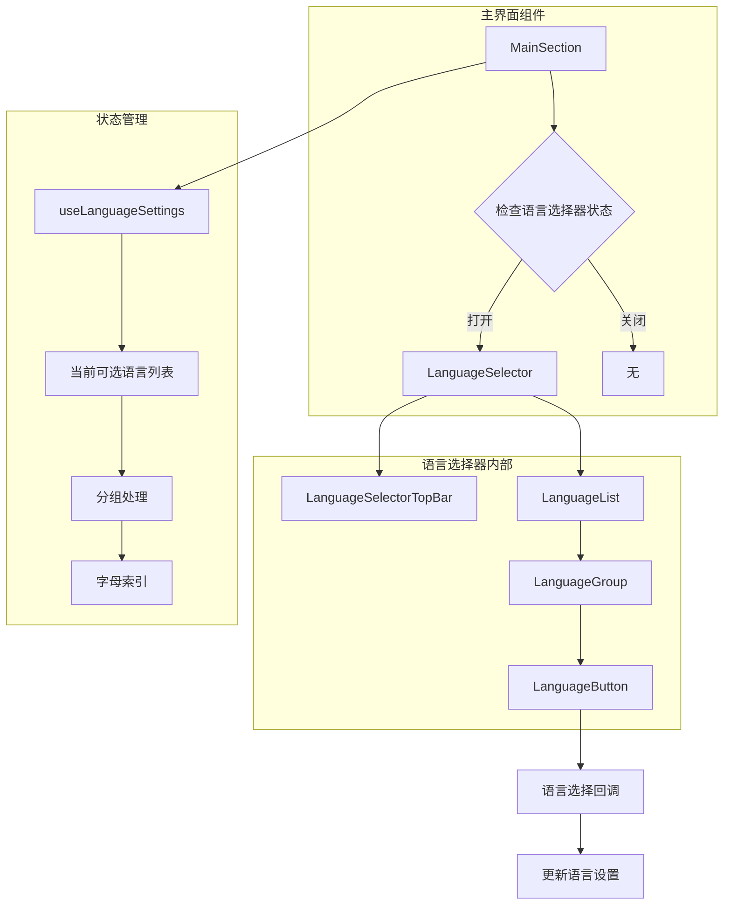
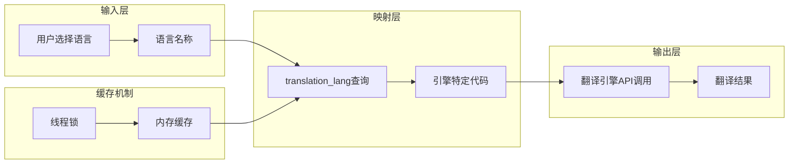
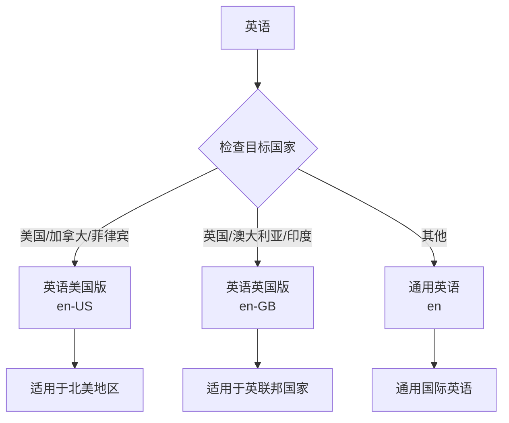

# DeepL 语言支持

<cite>
**本文档中引用的文件**
- [languages.yml](file://src-python/models/translation/languages/languages.yml)
- [translation_languages.py](file://src-python/models/translation/translation_languages.py)
- [translation_translator.py](file://src-python/models/translation/translation_translator.py)
- [LanguageSettings.jsx](file://src-ui/views/app/main_page/sidebar_section/language_settings/LanguageSettings.jsx)
- [LanguageSelector.jsx](file://src-ui/views/app/main_page/main_section/language_selector/LanguageSelector.jsx)
- [MainSection.jsx](file://src-ui/views/app/main_page/main_section/MainSection.jsx)
- [useLanguageSettings.js](file://src-ui/logics/main/useLanguageSettings.js)
- [translation_languages.md](file://src-python/docs/details/translation_languages.md)
</cite>

## 目录
1. [简介](#简介)
2. [项目结构概览](#项目结构概览)
3. [DeepL语言配置核心](#deepl语言配置核心)
4. [架构概览](#架构概览)
5. [详细组件分析](#详细组件分析)
6. [前端界面集成](#前端界面集成)
7. [语言代码映射机制](#语言代码映射机制)
8. [地域变体处理](#地域变体处理)
9. [性能考虑](#性能考虑)
10. [故障排除指南](#故障排除指南)
11. [结论](#结论)

## 简介

DeepL翻译引擎是VRCT项目中支持的多种翻译服务之一，提供了高质量的机器翻译功能。本文档详细解析了DeepL在VRCT系统中的语言支持配置，包括其独特的29种语言支持、简体中文与繁体中文共享'zh'代码的特殊处理机制，以及前端界面如何从配置中提取并渲染可用语言列表。

VRCT系统通过统一的语言代码映射机制，实现了不同翻译引擎之间的无缝切换，为用户提供了灵活且一致的翻译体验。

## 项目结构概览

VRCT项目的语言支持系统采用分层架构设计，主要包含以下核心组件：

**图表来源**
- [languages.yml](file://src-python/models/translation/languages/languages.yml#L1-L772)
- [translation_languages.py](file://src-python/models/translation/translation_languages.py#L1-L144)
- [LanguageSettings.jsx](file://src-ui/views/app/main_page/sidebar_section/language_settings/LanguageSettings.jsx#L1-L56)

## DeepL语言配置核心

### 支持的语言种类

DeepL翻译引擎在VRCT系统中支持29种语言，涵盖了全球主要语言群体：

| 语言类别 | 支持语言数量 | 示例语言 |
|---------|-------------|----------|
| 西欧语言 | 8种 | 英语、德语、法语、西班牙语、意大利语、荷兰语、瑞典语、挪威语 |
| 东欧/斯拉夫语言 | 8种 | 俄语、波兰语、捷克语、斯洛伐克语、乌克兰语、保加利亚语、克罗地亚语、斯洛文尼亚语 |
| 亚洲语言 | 5种 | 日语、韩语、简体中文、繁体中文、印尼语 |
| 其他语言 | 8种 | 阿拉伯语、土耳其语、芬兰语、爱沙尼亚语、拉脱维亚语、立陶宛语、马耳他语、爱尔兰语 |

### 语言代码映射表

DeepL的源语言和目标语言字段采用了对称性设计，确保双向翻译的一致性：

**图表来源**
- [languages.yml](file://src-python/models/translation/languages/languages.yml#L4-L40)
- [languages.yml](file://src-python/models/translation/languages/languages.yml#L42-L107)

**章节来源**
- [languages.yml](file://src-python/models/translation/languages/languages.yml#L4-L107)
- [translation_languages.md](file://src-python/docs/details/translation_languages.md#L76-L118)

## 架构概览

VRCT系统的语言支持架构采用模块化设计，通过统一的接口实现多引擎语言映射：

**图表来源**
- [translation_languages.py](file://src-python/models/translation/translation_languages.py#L29-L136)
- [translation_translator.py](file://src-python/models/translation/translation_translator.py#L39-L455)
- [LanguageSettings.jsx](file://src-ui/views/app/main_page/sidebar_section/language_settings/LanguageSettings.jsx#L1-L56)

## 详细组件分析

### 语言配置加载模块

`translation_languages.py`负责从YAML文件加载和验证语言映射配置：

**图表来源**
- [translation_languages.py](file://src-python/models/translation/translation_languages.py#L80-L136)

### 语言代码转换机制

`getLanguageCode`方法实现了不同翻译引擎间的语言代码转换：

**图表来源**
- [translation_translator.py](file://src-python/models/translation/translation_translator.py#L303-L328)

**章节来源**
- [translation_languages.py](file://src-python/models/translation/translation_languages.py#L80-L136)
- [translation_translator.py](file://src-python/models/translation/translation_translator.py#L303-L328)

## 前端界面集成

### 语言选择器组件架构

前端语言选择器采用响应式设计，支持按字母分组和动态筛选：

**图表来源**
- [MainSection.jsx](file://src-ui/views/app/main_page/main_section/MainSection.jsx#L40-L102)
- [LanguageSelector.jsx](file://src-ui/views/app/main_page/main_section/language_selector/LanguageSelector.jsx#L1-L63)

### 语言列表渲染逻辑

前端通过分组算法优化大量语言的显示效果：

| 分组策略 | 实现方式 | 性能优势 |
|---------|----------|----------|
| 字母分组 | 按首字母归类 | 快速定位特定语言 |
| 动态加载 | 按需渲染可见项 | 减少DOM节点数量 |
| 滚动优化 | 虚拟滚动技术 | 提升大数据集性能 |
| 异步处理 | 并行语言获取 | 改善用户体验 |

**章节来源**
- [MainSection.jsx](file://src-ui/views/app/main_page/main_section/MainSection.jsx#L40-L102)
- [LanguageSelector.jsx](file://src-ui/views/app/main_page/main_section/language_selector/LanguageSelector.jsx#L1-L63)
- [useLanguageSettings.js](file://src-ui/logics/main/useLanguageSettings.js#L1-L36)

## 语言代码映射机制

### 统一语言代码标准

VRCT系统通过统一的语言代码映射实现了跨引擎的兼容性：

**图表来源**
- [translation_languages.py](file://src-python/models/translation/translation_languages.py#L29-L136)

### 简体中文与繁体中文的特殊处理

DeepL对简体中文和繁体中文使用相同的语言代码'zh'，体现了对中文用户的友好设计：

| 中文变体 | DeepL代码 | 区别说明 |
|---------|-----------|----------|
| 简体中文 | zh | 中国大陆常用字符 |
| 繁体中文 | zh | 港澳台地区常用字符 |

这种设计简化了用户界面，避免了因文字系统差异导致的选择困惑。

**章节来源**
- [languages.yml](file://src-python/models/translation/languages/languages.yml#L38-L39)
- [translation_translator.py](file://src-python/models/translation/translation_translator.py#L303-L328)

## 地域变体处理

### 英语地域变体支持

DeepL API版本特别支持英语的地域变体：

**图表来源**
- [translation_translator.py](file://src-python/models/translation/translation_translator.py#L310-L316)

### 葡萄牙语地域变体

系统还支持葡萄牙语的不同地域版本：

| 地域变体 | 代码 | 适用地区 |
|---------|------|----------|
| 巴西葡萄牙语 | pt-BR | 巴西 |
| 欧洲葡萄牙语 | pt-PT | 葡萄牙及部分葡语国家 |

**章节来源**
- [translation_translator.py](file://src-python/models/translation/translation_translator.py#L316-L320)
- [languages.yml](file://src-python/models/translation/languages/languages.yml#L76-L78)

## 性能考虑

### 缓存策略

系统采用多层缓存机制提升性能：

1. **内存缓存**: 将已加载的语言映射存储在内存中
2. **线程安全**: 使用锁机制防止并发访问冲突
3. **延迟加载**: 仅在需要时加载特定引擎的语言配置

### 内存优化

- **按需加载**: 只加载当前使用的翻译引擎配置
- **引用共享**: 使用YAML锚点减少重复数据
- **垃圾回收**: 及时释放不再使用的配置对象

## 故障排除指南

### 常见问题及解决方案

| 问题类型 | 症状 | 解决方案 |
|---------|------|----------|
| 语言不支持 | 无法选择特定语言 | 检查languages.yml配置 |
| 翻译失败 | 返回False或空值 | 验证翻译引擎认证状态 |
| 性能问题 | 界面响应缓慢 | 清理缓存或重启应用 |
| 显示异常 | 语言列表错乱 | 检查语言分组逻辑 |

### 调试工具

系统提供了多种调试接口：
- `translation_lang`全局变量用于直接访问语言映射
- `get_supported_languages()`函数用于查询引擎支持的语言
- 错误日志记录用于诊断具体问题

**章节来源**
- [translation_languages.py](file://src-python/models/translation/translation_languages.py#L138-L144)

## 结论

VRCT系统的DeepL语言支持体现了现代软件工程的最佳实践：

1. **统一抽象**: 通过标准化的语言代码映射消除了引擎间的差异
2. **灵活扩展**: 模块化设计支持新翻译引擎的快速集成
3. **用户体验**: 直观的界面设计和智能的地域变体处理
4. **性能优化**: 多层缓存和异步处理确保流畅的用户体验

这种设计不仅满足了当前的功能需求，也为未来的功能扩展和技术升级奠定了坚实的基础。通过深入理解这些机制，开发者可以更好地维护和扩展VRCT系统的语言支持能力。