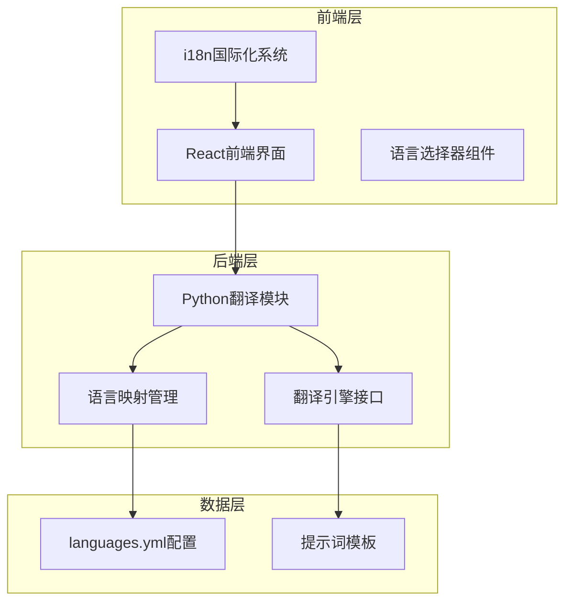
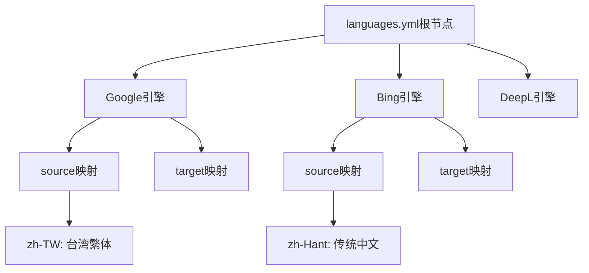
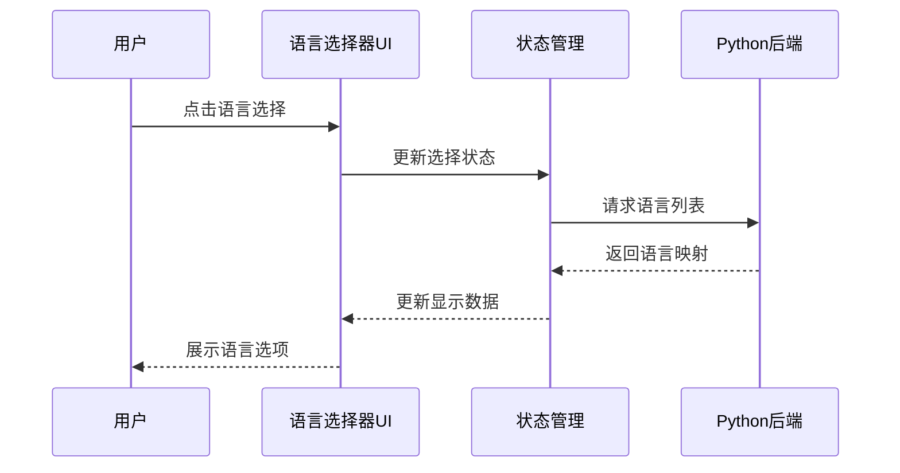
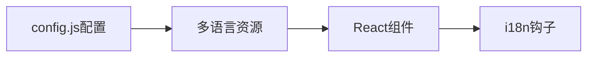
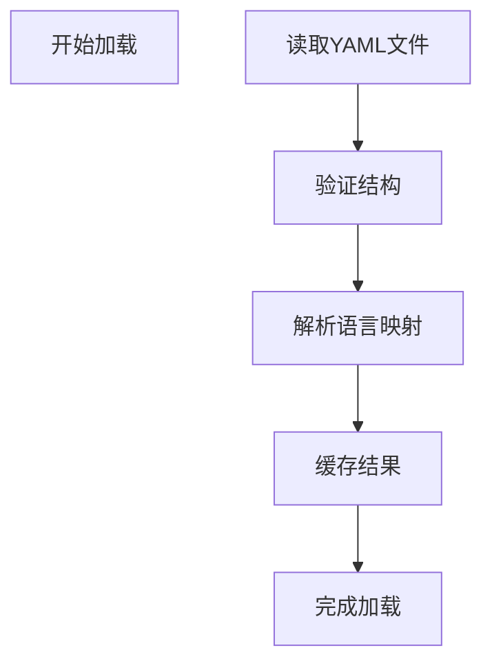

# Google与Bing语言支持对比分析

<cite>
**本文档引用的文件**
- [languages.yml](file://src-python/models/translation/languages/languages.yml)
- [translation_languages.py](file://src-python/models/translation/translation_languages.py)
- [translation_languages.md](file://src-python/docs/details/translation_languages.md)
- [transcription_languages.py](file://src-python/models/transcription/transcription_languages.py)
- [transcription_languages.md](file://src-python/docs/details/transcription_languages.md)
- [LanguageSelector.jsx](file://src-ui/views/app/main_page/main_section/language_selector/LanguageSelector.jsx)
- [LanguageSettings.jsx](file://src-ui/views/app/main_page/sidebar_section/language_settings/LanguageSettings.jsx)
- [config.js](file://locales/config.js)
- [useI18n.js](file://locales/useI18n.js)
</cite>

## 目录
1. [引言](#引言)
2. [项目架构概览](#项目架构概览)
3. [Google翻译引擎分析](#google翻译引擎分析)
4. [Bing翻译引擎分析](#bing翻译引擎分析)
5. [语言映射配置对比](#语言映射配置对比)
6. [前端UI语言选择器](#前端ui语言选择器)
7. [国际化显示机制](#国际化显示机制)
8. [技术实现细节](#技术实现细节)
9. [性能考虑](#性能考虑)
10. [总结](#总结)

## 引言

本文档深入分析了VRCT项目中Google和Bing翻译引擎的语言支持配置，重点探讨了它们在BCP 47标准语言标签处理上的技术差异，以及系统如何根据选定的引擎加载对应的语言集，并处理前端UI中语言名称的国际化显示问题。

VRCT项目采用了统一的语言映射管理系统，通过languages.yml配置文件为多个翻译引擎提供标准化的语言支持。该系统不仅支持传统的语言代码格式，还能够处理复杂的地区变体和字符系统差异。

## 项目架构概览

VRCT项目采用前后端分离的架构设计，翻译功能主要由Python后端负责，前端则提供用户界面交互。

**图表来源**
- [LanguageSelector.jsx](file://src-ui/views/app/main_page/main_section/language_selector/LanguageSelector.jsx#L1-L63)
- [translation_languages.py](file://src-python/models/translation/translation_languages.py#L1-L144)

**章节来源**
- [languages.yml](file://src-python/models/translation/languages/languages.yml#L1-L772)
- [translation_languages.py](file://src-python/models/translation/translation_languages.py#L1-L144)

## Google翻译引擎分析

### 广泛的语言覆盖范围

Google翻译引擎在languages.yml中展示了其强大的语言支持能力，涵盖了133种不同的语言。这种广泛的覆盖范围使其成为多语言应用的理想选择。

### 语言代码映射特点

Google引擎采用以下语言代码映射策略：

| 语言类别 | Google代码 | 描述 |
|---------|-----------|------|
| 中文简体 | zh | 标准简体中文 |
| 中文繁体 | zh-TW | 台湾繁体中文 |
| 地区变体 | en-US, en-GB | 美式英语、英式英语 |
| 字符系统 | zh-Hans, zh-Hant | 简体、繁体字符 |

### 技术实现优势

1. **统一性**: 所有语言代码均为小写字母，便于程序处理
2. **完整性**: 包含了从主要语言到少数民族语言的完整覆盖
3. **标准化**: 严格遵循BCP 47标准

**章节来源**
- [languages.yml](file://src-python/models/translation/languages/languages.yml#L109-L219)

## Bing翻译引擎分析

### 传统中文处理差异

Bing翻译引擎在处理传统中文时采用了与Google不同的技术方案，这是两者之间最重要的技术差异之一。

### zh-Hant vs zh-TW的技术差异

| 特征 | Google | Bing |
|-----|--------|------|
| 繁体中文代码 | zh-TW | zh-Hant |
| 字符系统标识 | 明确区分简繁体 | 统一使用zh-Hant |
| 地区特定性 | 区分台湾、香港等 | 不区分具体地区 |
| 兼容性 | 更广泛的国际兼容性 | 传统Microsoft标准 |

### 技术实现考量

Bing选择zh-Hant而非zh-TW的原因可能包括：

1. **历史兼容性**: 符合Microsoft的传统命名约定
2. **标准化路径**: 遵循ISO 639-3标准的扩展形式
3. **简化维护**: 统一的代码减少配置复杂度

**章节来源**
- [languages.yml](file://src-python/models/translation/languages/languages.yml#L221-L289)

## 语言映射配置对比

### 配置文件结构分析

languages.yml采用层次化的配置结构，为每个翻译引擎定义独立的语言映射：

**图表来源**
- [languages.yml](file://src-python/models/translation/languages/languages.yml#L109-L289)

### 关键差异对比表

| 对比维度 | Google | Bing | 影响 |
|---------|--------|------|------|
| 中文繁体代码 | zh-TW | zh-Hant | API调用差异 |
| 语言数量 | 133种 | 70+种 | 功能覆盖范围 |
| 地区变体支持 | 完整支持 | 基础支持 | 精度差异 |
| 字符系统区分 | 明确区分 | 统一处理 | 文本处理方式 |

**章节来源**
- [languages.yml](file://src-python/models/translation/languages/languages.yml#L109-L289)

## 前端UI语言选择器

### 组件架构设计

前端语言选择器采用模块化设计，支持动态加载不同翻译引擎的语言列表：

**图表来源**
- [LanguageSelector.jsx](file://src-ui/views/app/main_page/main_section/language_selector/LanguageSelector.jsx#L1-L63)
- [LanguageSettings.jsx](file://src-ui/views/app/main_page/sidebar_section/language_settings/LanguageSettings.jsx#L1-L56)

### 语言分组显示机制

语言选择器实现了智能的字母分组功能，提升用户体验：

1. **按首字母分组**: 将相同首字母的语言归类
2. **滚动容器**: 支持大量语言的流畅浏览
3. **响应式设计**: 适应不同屏幕尺寸

**章节来源**
- [LanguageSelector.jsx](file://src-ui/views/app/main_page/main_section/language_selector/LanguageSelector.jsx#L11-L22)

## 国际化显示机制

### 多语言支持架构

VRCT项目通过i18next框架实现了完整的国际化支持：

**图表来源**
- [config.js](file://locales/config.js#L1-L39)
- [useI18n.js](file://locales/useI18n.js#L1-L11)

### 语言资源管理

系统支持以下语言环境：
- 英语 (en)
- 日语 (ja)  
- 韩语 (ko)
- 简体中文 (zh-Hans)
- 繁体中文 (zh-Hant)

### 前端国际化流程

1. **初始化**: 在config.js中注册所有语言资源
2. **切换**: 通过useI18n钩子动态切换语言
3. **渲染**: 自动更新组件中的文本内容

**章节来源**
- [config.js](file://locales/config.js#L18-L24)
- [useI18n.js](file://locales/useI18n.js#L1-L11)

## 技术实现细节

### 语言映射加载机制

translation_languages.py模块负责语言映射的加载和验证：

**图表来源**
- [translation_languages.py](file://src-python/models/translation/translation_languages.py#L80-L136)

### 错误处理和验证

系统实现了完善的错误处理机制：

1. **文件存在性检查**: 确保配置文件可访问
2. **结构验证**: 验证YAML文件的正确格式
3. **类型检查**: 确保语言代码为字符串类型
4. **并发安全**: 使用线程锁防止竞态条件

**章节来源**
- [translation_languages.py](file://src-python/models/translation/translation_languages.py#L55-L79)

### 动态引擎切换

系统支持运行时动态切换翻译引擎，无需重启应用程序：

1. **引擎检测**: 自动识别可用的翻译服务
2. **配置热加载**: 实时更新语言映射
3. **兼容性检查**: 确保目标语言在新引擎中可用

**章节来源**
- [translation_languages.py](file://src-python/models/translation/translation_languages.py#L80-L136)

## 性能考虑

### 内存优化策略

1. **延迟加载**: 仅在需要时加载特定引擎的语言映射
2. **缓存机制**: 避免重复解析相同的配置文件
3. **内存回收**: 及时释放不再使用的语言数据

### 加载性能优化

1. **异步处理**: 使用线程锁确保并发安全
2. **增量更新**: 仅重新加载变更的部分
3. **预加载**: 在应用启动时预先加载常用语言

### 用户体验优化

1. **快速响应**: 语言选择器在毫秒级内响应用户操作
2. **平滑过渡**: 使用CSS动画提升界面流畅度
3. **错误恢复**: 在网络异常时提供降级方案

## 总结

VRCT项目在Google和Bing翻译引擎的语言支持方面展现了出色的技术实现：

### 主要成就

1. **标准化处理**: 统一的BCP 47标准语言标签处理
2. **灵活架构**: 支持多种翻译引擎的无缝切换
3. **国际化支持**: 完整的多语言界面显示
4. **性能优化**: 高效的语言映射加载和缓存机制

### 技术创新点

1. **zh-Hant vs zh-TW**: 体现了不同技术路线的选择考量
2. **动态语言映射**: 实现了运行时的语言引擎切换
3. **国际化集成**: 前后端完整的多语言支持

### 应用价值

该系统为多语言应用开发提供了可靠的基础设施，特别适合需要支持多种翻译服务的场景。Google的广泛覆盖和Bing的传统兼容性相结合，为用户提供了最佳的语言支持选择。

通过深入分析这些技术细节，我们可以看到VRCT项目在国际化和多语言支持方面的专业性和前瞻性，为现代软件产品的全球化部署奠定了坚实基础。