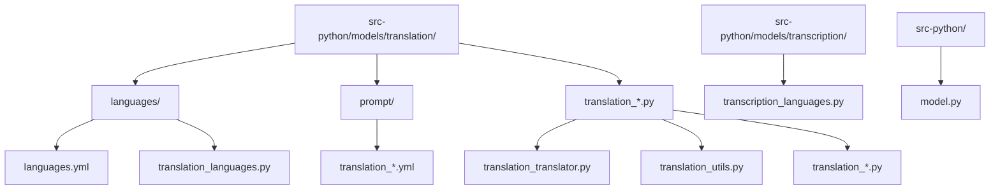
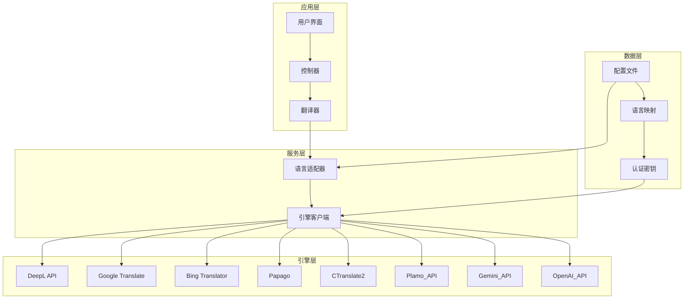
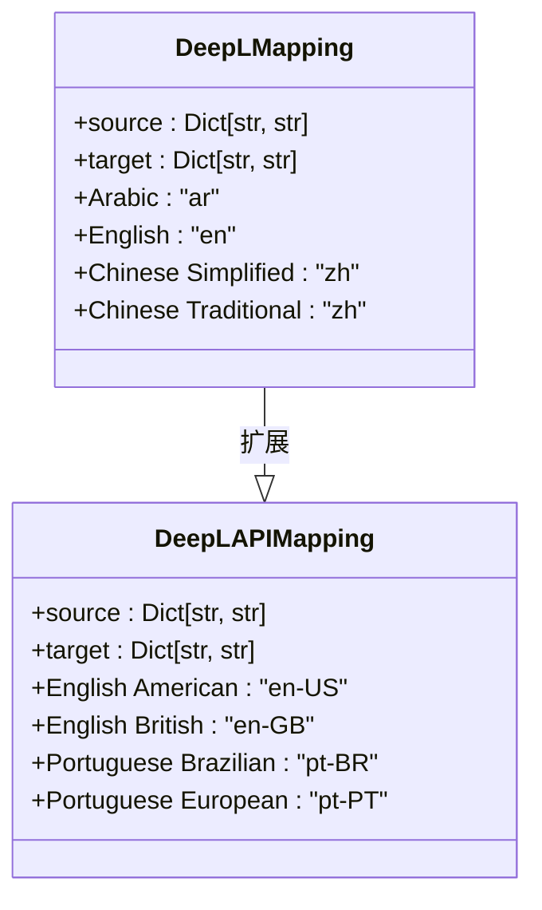
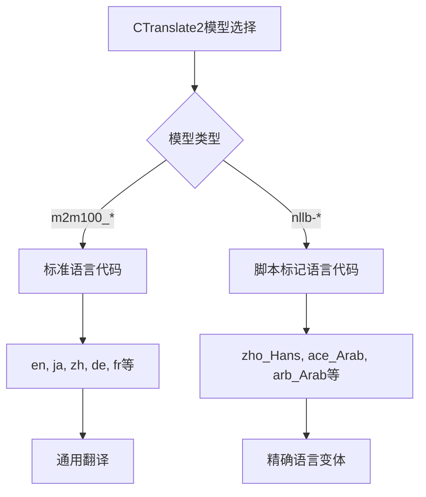
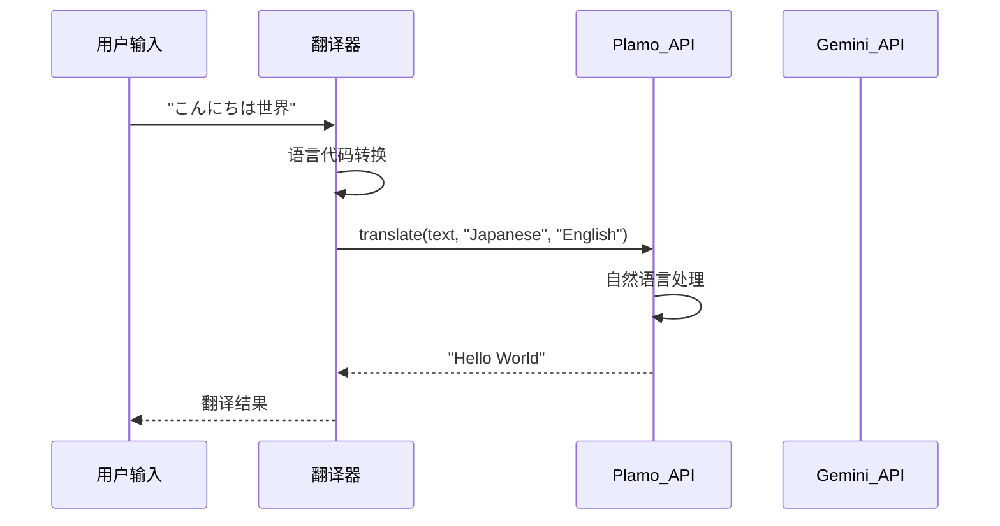
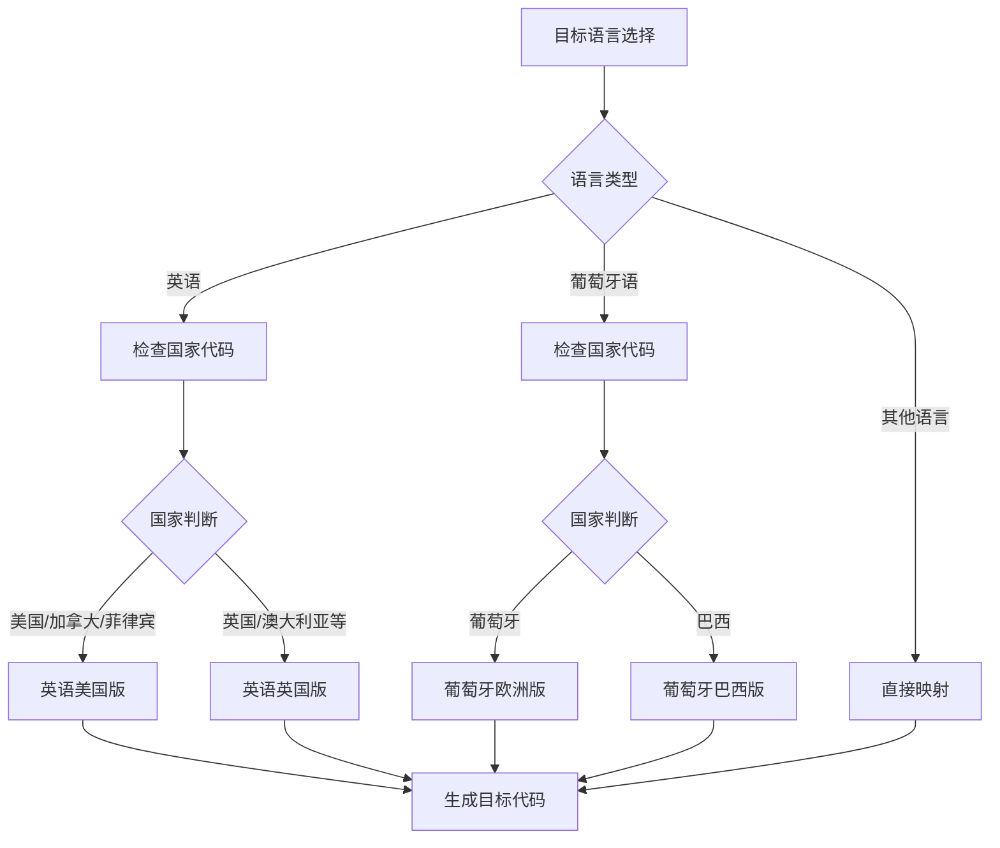
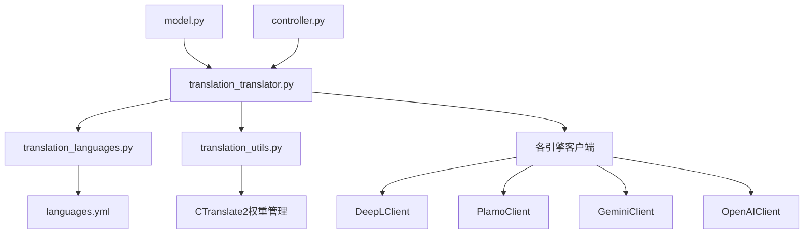

# 语言支持配置系统

<cite>
**本文档中引用的文件**
- [languages.yml](file://src-python/models/translation/languages/languages.yml)
- [translation_languages.py](file://src-python/models/translation/translation_languages.py)
- [translation_translator.py](file://src-python/models/translation/translation_translator.py)
- [translation_utils.py](file://src-python/models/translation/translation_utils.py)
- [translation_plamo.py](file://src-python/models/translation/translation_plamo.py)
- [translation_gemini.py](file://src-python/models/translation/translation_gemini.py)
- [translation_openai.py](file://src-python/models/translation/translation_openai.py)
- [transcription_languages.py](file://src-python/models/transcription/transcription_languages.py)
- [model.py](file://src-python/model.py)
</cite>

## 目录
1. [简介](#简介)
2. [项目结构概览](#项目结构概览)
3. [核心组件分析](#核心组件分析)
4. [架构概览](#架构概览)
5. [详细组件分析](#详细组件分析)
6. [依赖关系分析](#依赖关系分析)
7. [性能考虑](#性能考虑)
8. [故障排除指南](#故障排除指南)
9. [结论](#结论)

## 简介

VRCT项目实现了一个复杂而全面的语言支持配置系统，该系统能够统一管理13种不同翻译引擎的语言代码映射。这个系统不仅涵盖了主流的在线翻译服务（DeepL、Google、Bing、Papago），还包括了本地化的CTranslate2模型（m2m100和nllb系列），以及新兴的API驱动引擎（Plamo_API、Gemini_API、OpenAI_API等）。

该系统的核心优势在于其模块化设计，通过统一的配置文件和动态加载机制，实现了不同翻译引擎之间的无缝切换和语言代码的自动转换。特别是对于CTranslate2模型特有的语言编码规范（如zho_Hans、ace_Arab等），以及Plamo_API、Gemini_API等引擎使用的自然语言名称映射方式，系统提供了完整的解决方案。

## 项目结构概览

语言支持配置系统主要分布在以下目录结构中：

**图表来源**
- [languages.yml](file://src-python/models/translation/languages/languages.yml#L1-L772)
- [translation_languages.py](file://src-python/models/translation/translation_languages.py#L1-L144)

**章节来源**
- [languages.yml](file://src-python/models/translation/languages/languages.yml#L1-L772)
- [translation_languages.py](file://src-python/models/translation/translation_languages.py#L1-L144)

## 核心组件分析

### 语言映射配置系统

系统的核心是`languages.yml`文件，它定义了所有支持的翻译引擎及其对应的语言代码映射。这个文件采用层次化的YAML结构，为每个引擎维护独立的源语言（source）和目标语言（target）映射。

### 动态语言加载机制

`translation_languages.py`模块实现了语言映射的动态加载和验证机制。该模块使用线程安全的设计，确保在多线程环境下的一致性访问。

### 多引擎适配器模式

`translation_translator.py`实现了适配器模式，为不同的翻译引擎提供统一的接口。这个类负责：
- 引擎认证和初始化
- 语言代码转换
- 翻译请求的路由
- 错误处理和降级策略

**章节来源**
- [translation_languages.py](file://src-python/models/translation/translation_languages.py#L30-L144)
- [translation_translator.py](file://src-python/models/translation/translation_translator.py#L39-L455)

## 架构概览

系统采用分层架构设计，从底层的语言映射配置到顶层的应用接口：

**图表来源**
- [translation_translator.py](file://src-python/models/translation/translation_translator.py#L39-L60)
- [model.py](file://src-python/model.py#L118-L120)

## 详细组件分析

### DeepL引擎支持

DeepL引擎分为免费版（DeepL）和付费API版（DeepL_API）。两者的主要区别在于目标语言的地域变体支持：

**图表来源**
- [languages.yml](file://src-python/models/translation/languages/languages.yml#L4-L73)

### CTranslate2模型语言编码

CTranslate2引擎支持两种主要模型系列，每种都有独特的语言编码规范：

#### m2m100系列
- 支持标准ISO语言代码
- 单一语言变体映射
- 通用性强但覆盖范围有限

#### NLLB系列
- 支持复杂的脚本标记
- 语言代码格式：`{language}_{script}`
- 提供更精确的语言变体控制

**图表来源**
- [languages.yml](file://src-python/models/translation/languages/languages.yml#L310-L627)
- [translation_utils.py](file://src-python/models/translation/translation_utils.py#L27-L47)

### Plamo_API和Gemini_API自然语言映射

这些现代API引擎采用了完全不同的语言标识方式：

**图表来源**
- [translation_plamo.py](file://src-python/models/translation/translation_plamo.py#L82-L103)
- [translation_gemini.py](file://src-python/models/translation/translation_gemini.py#L94-L116)

### 地域变体智能识别

系统实现了智能的地域变体识别和转换机制：

**图表来源**
- [translation_translator.py](file://src-python/models/translation/translation_translator.py#L303-L328)

**章节来源**
- [languages.yml](file://src-python/models/translation/languages/languages.yml#L4-L772)
- [translation_translator.py](file://src-python/models/translation/translation_translator.py#L303-L328)

## 依赖关系分析

系统的依赖关系呈现清晰的分层结构：

**图表来源**
- [translation_translator.py](file://src-python/models/translation/translation_translator.py#L1-L27)
- [model.py](file://src-python/model.py#L21-L27)

**章节来源**
- [translation_translator.py](file://src-python/models/translation/translation_translator.py#L1-L27)
- [model.py](file://src-python/model.py#L21-L27)

## 性能考虑

### 并发安全性
系统使用线程锁确保语言映射的并发安全性，避免多线程环境下的数据竞争。

### 延迟优化
- 语言映射缓存机制
- 引擎连接池管理
- 异步请求处理

### 内存管理
- 权重文件的按需下载
- 模型实例的生命周期管理
- 及时释放不再使用的资源

## 故障排除指南

### 常见问题及解决方案

#### 语言代码不匹配
**症状**：翻译失败或返回空结果
**原因**：引擎间语言代码不兼容
**解决**：检查`translation_lang`映射表，确认目标引擎是否支持指定语言

#### CTranslate2模型加载失败
**症状**：本地翻译功能不可用
**原因**：模型权重文件缺失或损坏
**解决**：使用`downloadCTranslate2Weight`函数重新下载模型

#### API认证失败
**症状**：云端翻译服务无法使用
**原因**：API密钥无效或过期
**解决**：重新设置有效的API密钥

**章节来源**
- [translation_languages.py](file://src-python/models/translation/translation_languages.py#L55-L80)
- [translation_utils.py](file://src-python/models/translation/translation_utils.py#L50-L60)

## 结论

VRCT的语言支持配置系统展现了现代软件架构的最佳实践。通过统一的配置文件管理、模块化的引擎适配器设计，以及智能的语言代码转换机制，系统成功地解决了多翻译引擎间的兼容性问题。

该系统的主要创新点包括：
1. **统一配置管理**：单一配置文件管理所有引擎的语言映射
2. **智能语言转换**：自动处理地域变体和引擎特定的语言代码
3. **模块化架构**：清晰的分层设计便于维护和扩展
4. **性能优化**：并发安全和资源管理确保高效运行

这种设计不仅满足了当前的功能需求，还为未来的功能扩展和技术演进奠定了坚实的基础。随着新的翻译引擎和语言变体的出现，系统可以通过简单的配置更新即可支持，体现了良好的可扩展性和适应性。