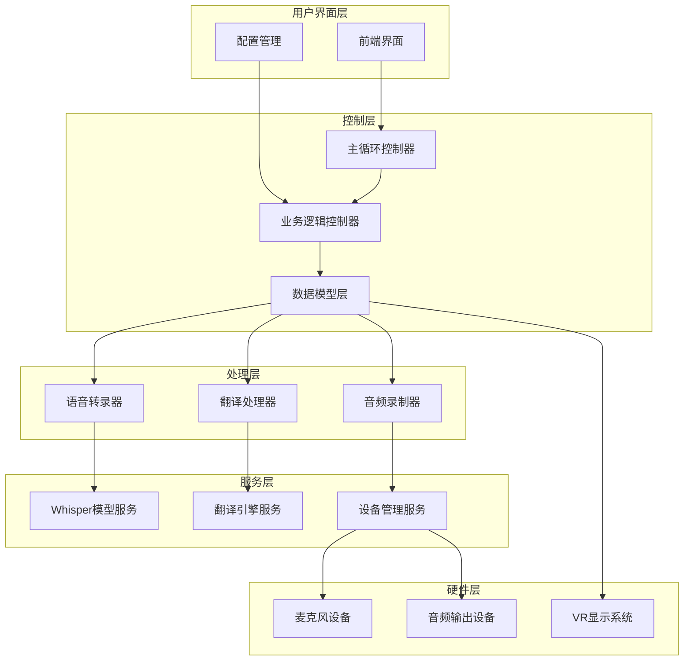
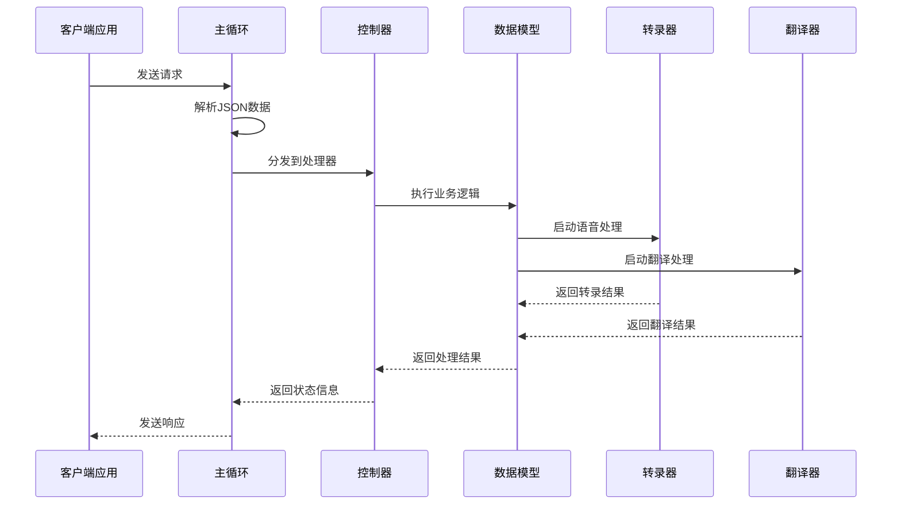
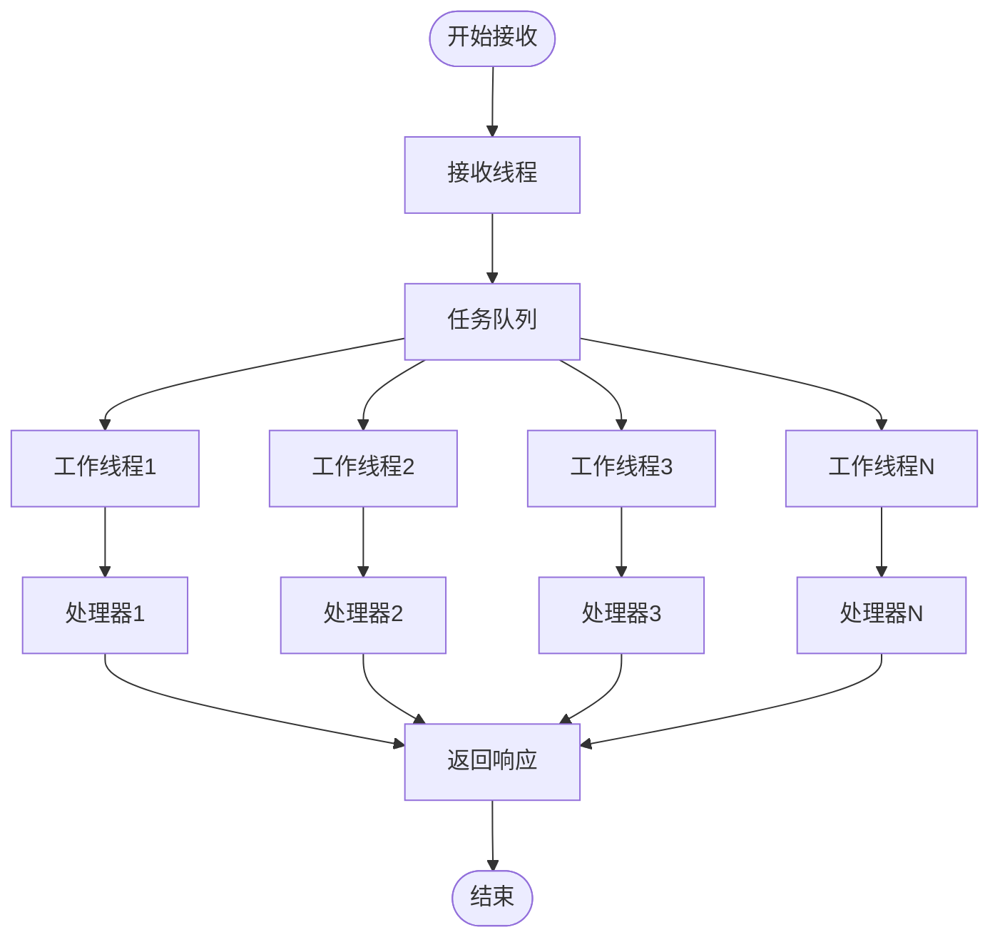
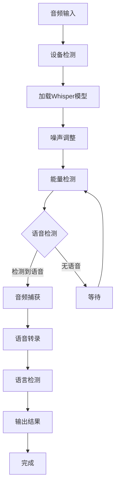
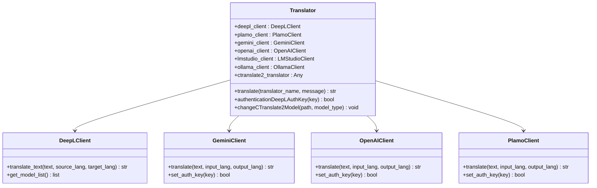
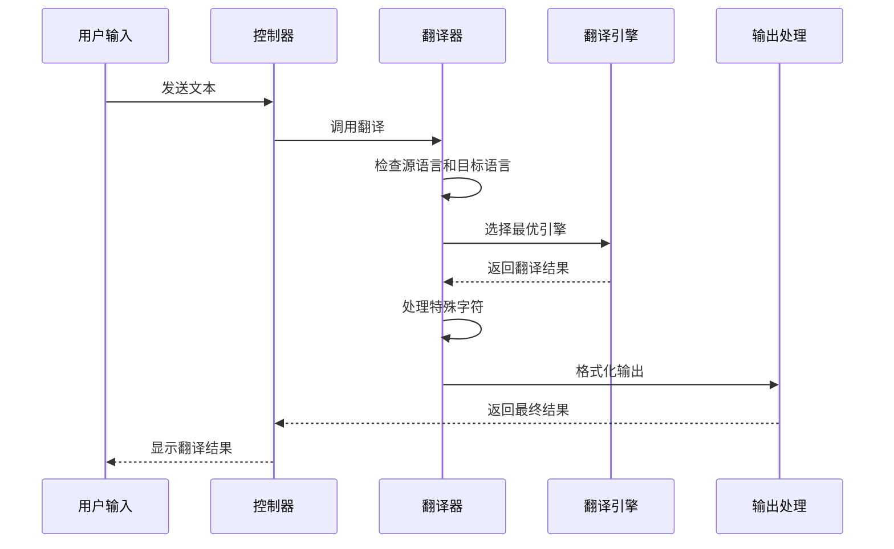
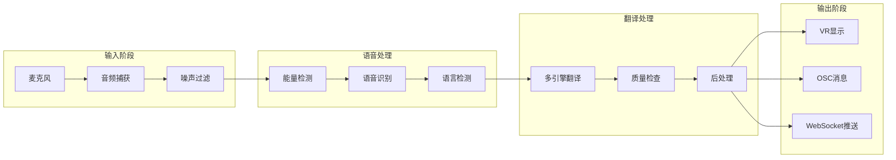
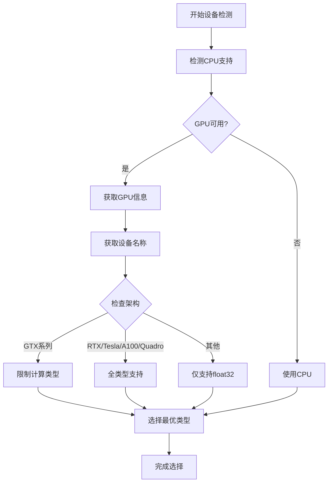
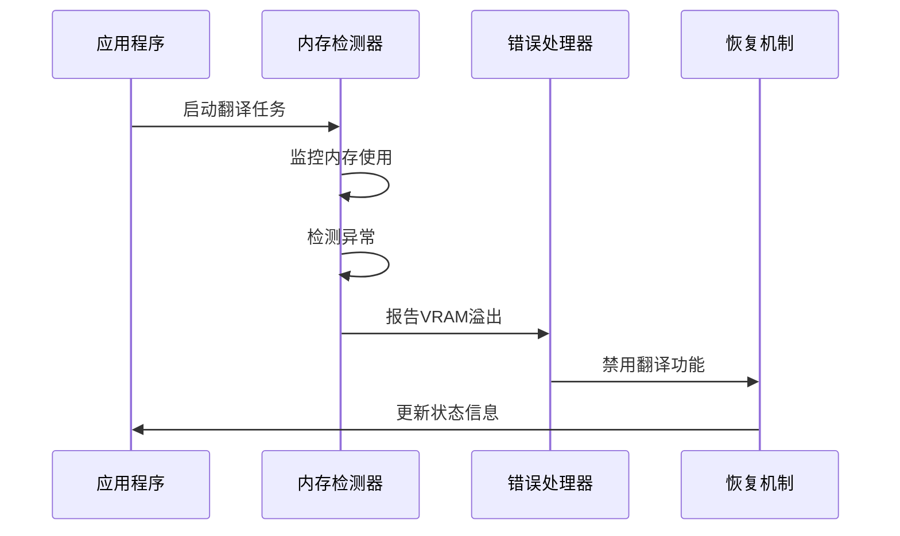
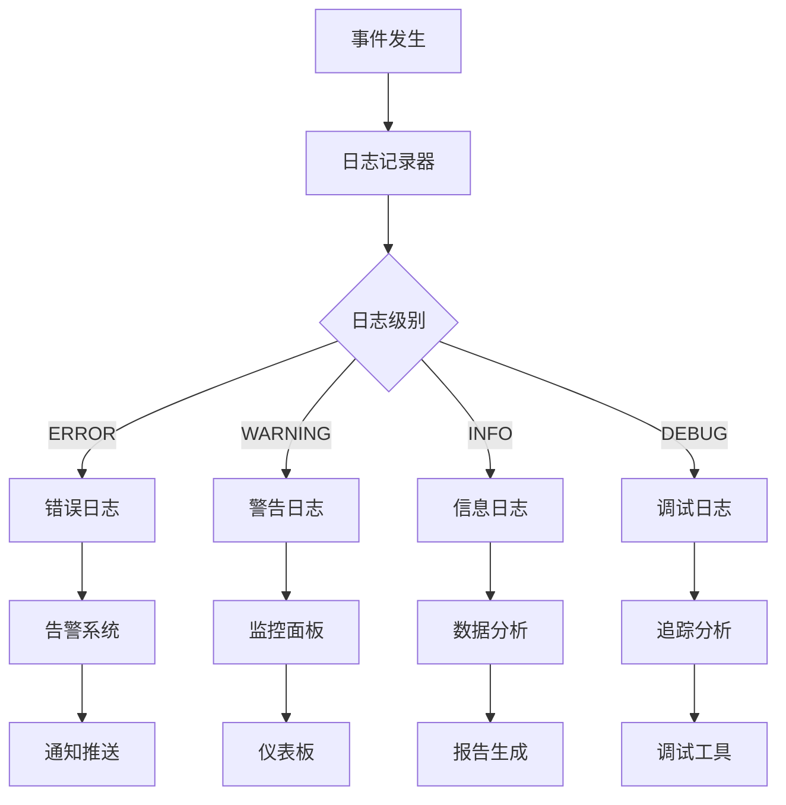

# VRCT核心功能详解

<cite>
**本文档引用的文件**
- [mainloop.py](file://src-python/mainloop.py)
- [controller.py](file://src-python/controller.py)
- [model.py](file://src-python/model.py)
- [transcription_whisper.py](file://src-python/models/transcription/transcription_whisper.py)
- [translation_translator.py](file://src-python/models/translation/translation_translator.py)
- [transcription_recorder.py](file://src-python/models/transcription/transcription_recorder.py)
- [utils.py](file://src-python/utils.py)
- [device_manager.py](file://src-python/device_manager.py)
- [config.py](file://src-python/config.py)
</cite>

## 目录
1. [系统概述](#系统概述)
2. [核心架构](#核心架构)
3. [系统主循环机制](#系统主循环机制)
4. [实时语音转录功能](#实时语音转录功能)
5. [多语言翻译引擎](#多语言翻译引擎)
6. [数据流处理链路](#数据流处理链路)
7. [性能优化策略](#性能优化策略)
8. [错误处理与监控](#错误处理与监控)
9. [总结](#总结)

## 系统概述

VRCT（Virtual Reality Communication Tool）是一个专为虚拟现实环境设计的实时语音转录与翻译系统。该系统通过先进的AI技术，实现了从麦克风输入到VR环境中实时显示的完整语音处理流程。

### 核心特性

- **实时语音转录**：支持多种Whisper模型的高性能语音识别
- **多引擎翻译**：集成Gemini、OpenAI、Ollama、Plamo等多种翻译服务
- **低延迟处理**：优化的异步处理架构确保最小化响应时间
- **智能设备管理**：自动检测和配置音频设备
- **VR集成**：无缝对接VR环境中的消息显示系统

## 核心架构

VRCT采用分层架构设计，主要包含以下核心组件：

**图表来源**
- [mainloop.py](file://src-python/mainloop.py#L408-L588)
- [controller.py](file://src-python/controller.py#L11-L800)
- [model.py](file://src-python/model.py#L81-L200)

## 系统主循环机制

### 主循环架构

VRCT的主循环通过`mainloop.py`实现，采用事件驱动的异步处理模式，确保系统的高并发性和响应性。

**图表来源**
- [mainloop.py](file://src-python/mainloop.py#L440-L545)
- [controller.py](file://src-python/controller.py#L471-L542)

### 并发处理机制

主循环采用多线程并发处理，支持多个工作线程同时处理不同类型的请求：

**图表来源**
- [mainloop.py](file://src-python/mainloop.py#L547-L551)

**章节来源**
- [mainloop.py](file://src-python/mainloop.py#L408-L588)

## 实时语音转录功能

### Whisper模型集成

VRCT通过`transcription_whisper.py`模块集成faster-whisper模型，实现高效的语音识别功能。

#### 模型下载与管理

系统支持多种Whisper模型权重类型，从轻量级的tiny到大型的large-v3：

| 模型类型 | 参数量 | 文件大小 | 推荐场景 |
|---------|--------|----------|----------|
| tiny | ~39M | ~794MB | 移动设备、低延迟需求 |
| base | ~74M | ~1.58GB | 一般用途、平衡性能 |
| small | ~244M | ~1.58GB | 高精度要求 |
| medium | ~749M | ~3.16GB | 专业应用 |
| large-v3 | ~1550M | ~6.32GB | 最高精度 |

#### 语音识别流程

**图表来源**
- [transcription_whisper.py](file://src-python/models/transcription/transcription_whisper.py#L112-L139)
- [transcription_recorder.py](file://src-python/models/transcription/transcription_recorder.py#L36-L241)

### 音频录制机制

系统通过`transcription_recorder.py`实现智能音频录制，支持多种录制模式：

#### 录制参数配置

| 参数名称 | 默认值 | 说明 |
|---------|--------|------|
| energy_threshold | 300 | 音频能量阈值 |
| dynamic_energy_threshold | False | 是否启用动态阈值 |
| record_timeout | 3秒 | 录制超时时间 |
| phrase_timeout | 3秒 | 话语间隔超时 |
| max_phrases | 10 | 最大话语数量 |

**章节来源**
- [transcription_whisper.py](file://src-python/models/transcription/transcription_whisper.py#L1-L161)
- [transcription_recorder.py](file://src-python/models/transcription/transcription_recorder.py#L36-L241)

## 多语言翻译引擎

### 统一翻译接口

VRCT通过`translation_translator.py`实现统一的翻译接口，支持多种翻译引擎：

**图表来源**
- [translation_translator.py](file://src-python/models/translation/translation_translator.py#L39-L455)

### 支持的翻译引擎

#### 云端翻译服务

| 引擎名称 | API提供商 | 支持语言对 | 认证方式 |
|---------|-----------|------------|----------|
| DeepL_API | DeepL | 30+ | API密钥 |
| Gemini_API | Google | 100+ | API密钥 |
| OpenAI_API | OpenAI | 100+ | API密钥 |
| Plamo_API | Plamo | 100+ | API密钥 |

#### 本地翻译模型

| 模型名称 | 参数量 | 支持语言 | 性能特点 |
|---------|--------|----------|----------|
| m2m100_418M-ct2-int8 | 418M | 46种语言 | 轻量级，低内存 |
| m2m100_1.2B-ct2-int8 | 1.2B | 46种语言 | 中等精度 |
| nllb-200-distilled-1.3B-ct2-int8 | 1.3B | 200种语言 | 广泛语言支持 |
| nllb-200-3.3B-ct2-int8 | 3.3B | 200种语言 | 高精度 |

### 翻译流程

**图表来源**
- [translation_translator.py](file://src-python/models/translation/translation_translator.py#L331-L441)

**章节来源**
- [translation_translator.py](file://src-python/models/translation/translation_translator.py#L1-L455)

## 数据流处理链路

### 完整处理流程

从麦克风输入到VR显示的完整数据流如下：

**图表来源**
- [controller.py](file://src-python/controller.py#L254-L410)
- [model.py](file://src-python/model.py#L595-L655)

### 关键处理节点

#### 1. 音频预处理
- **噪声抑制**：自动检测和过滤背景噪声
- **音量标准化**：确保音频信号强度适中
- **采样率转换**：统一为模型所需的采样率

#### 2. 语音识别
- **实时转录**：毫秒级语音到文本转换
- **语言识别**：自动检测说话语言
- **置信度评估**：评估识别准确性

#### 3. 翻译处理
- **引擎选择**：根据语言对选择最优引擎
- **批量处理**：支持多语言同时翻译
- **缓存机制**：避免重复翻译相同内容

#### 4. 结果输出
- **格式化**：统一输出格式
- **VR集成**：直接发送到VR显示系统
- **多通道输出**：支持多种输出方式

**章节来源**
- [controller.py](file://src-python/controller.py#L254-L410)
- [model.py](file://src-python/model.py#L595-L655)

## 性能优化策略

### 计算设备选择

VRCT通过智能算法选择最优的计算设备和计算类型：

#### GPU设备检测与优化

**图表来源**
- [utils.py](file://src-python/utils.py#L109-L167)

#### 计算类型优先级

| GPU架构 | 优先计算类型 | 性能特点 |
|---------|-------------|----------|
| GTX系列 | float32 | 兼容性好，稳定性高 |
| RTX系列 | int8_bfloat16 | 高性能，低延迟 |
| Tesla/A100 | int8_bfloat16 | 企业级性能 |
| Quadro | int8_bfloat16 | 专业图形优化 |

### 内存管理优化

#### VRAM溢出检测

系统实现了智能的VRAM溢出检测机制：

**图表来源**
- [controller.py](file://src-python/controller.py#L296-L317)

#### 性能优化建议

1. **设备选择策略**
   - 优先使用支持INT8计算的GPU
   - 避免GTX系列设备用于高精度模型
   - 根据模型大小选择合适的计算类型

2. **资源分配优化**
   - 动态调整工作线程数量
   - 实现任务优先级调度
   - 使用内存池减少分配开销

3. **网络优化**
   - 实现连接池复用
   - 添加请求重试机制
   - 支持断点续传

**章节来源**
- [utils.py](file://src-python/utils.py#L109-L167)
- [controller.py](file://src-python/controller.py#L296-L317)

## 错误处理与监控

### 错误分类与处理

VRCT实现了完善的错误处理机制，涵盖网络、设备、内存等多个方面：

#### 错误类型映射

| 错误类型 | 状态码 | 处理策略 |
|---------|--------|----------|
| 设备错误 | 400 | 设备重选或降级处理 |
| 网络错误 | 400 | 重试机制或离线模式 |
| 内存溢出 | 400 | 功能禁用或资源回收 |
| 认证失败 | 400 | 密钥重新配置 |
| 模型加载失败 | 500 | 降级到备用模型 |

### 监控与日志

系统提供了全面的监控和日志记录功能：

**章节来源**
- [controller.py](file://src-python/controller.py#L140-L180)
- [utils.py](file://src-python/utils.py#L192-L200)

## 总结

VRCT通过精心设计的架构和优化策略，实现了高效、稳定的实时语音转录与翻译功能。其核心优势包括：

### 技术亮点

1. **模块化设计**：清晰的分层架构便于维护和扩展
2. **异步处理**：多线程并发确保低延迟响应
3. **智能优化**：自动选择最优计算设备和参数
4. **容错机制**：完善的错误处理和恢复策略

### 应用价值

- **虚拟现实集成**：无缝对接VR环境的消息系统
- **多语言支持**：覆盖全球主要语言的翻译需求
- **性能优化**：针对不同硬件配置的智能适配
- **用户体验**：简洁直观的操作界面和配置选项

### 发展方向

未来VRCT可以在以下方面进一步优化：
- 支持更多翻译引擎和语音识别模型
- 实现更智能的语言检测和切换
- 增强离线处理能力和缓存机制
- 优化移动端和边缘设备的性能表现

通过持续的技术创新和优化，VRCT将为用户提供更加流畅、准确的跨语言通信体验。