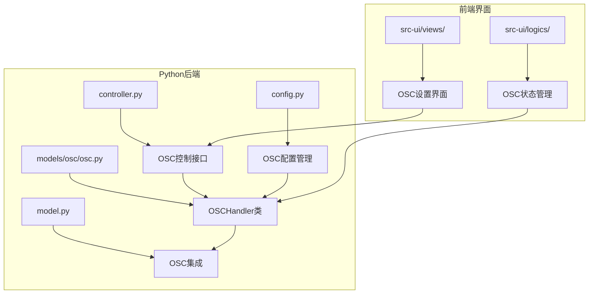
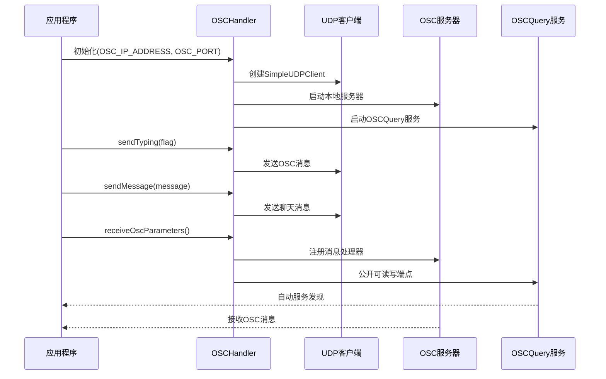
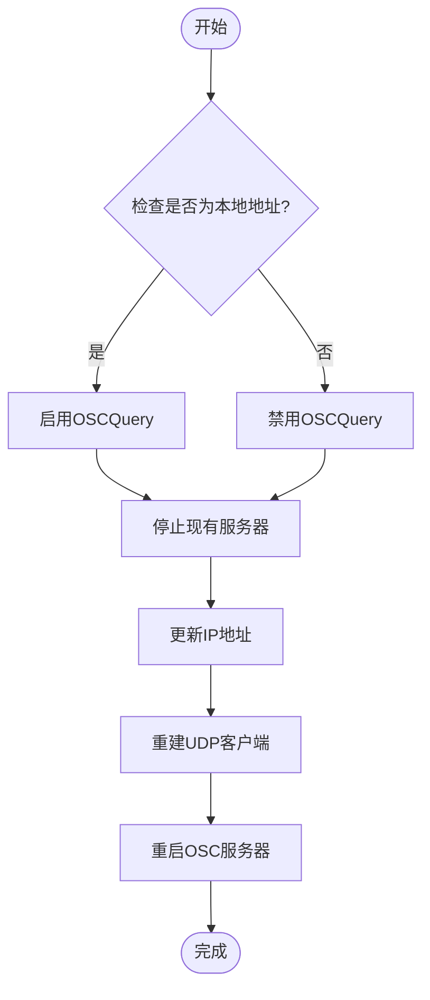
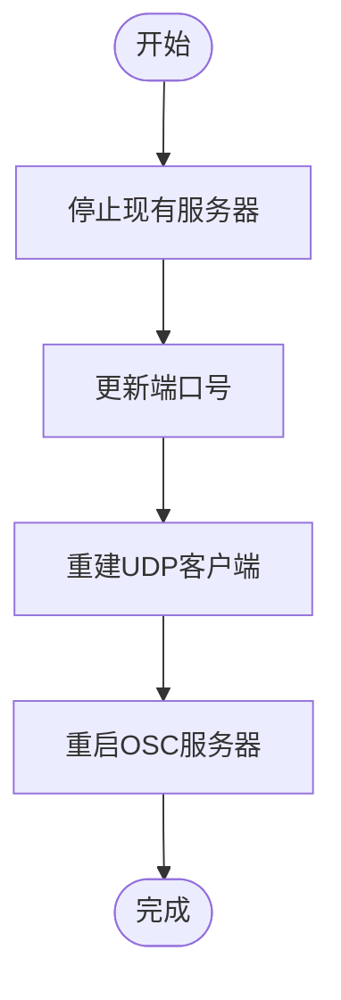
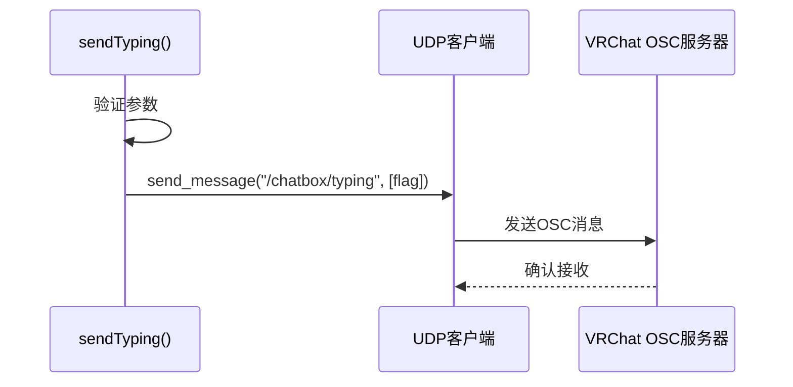
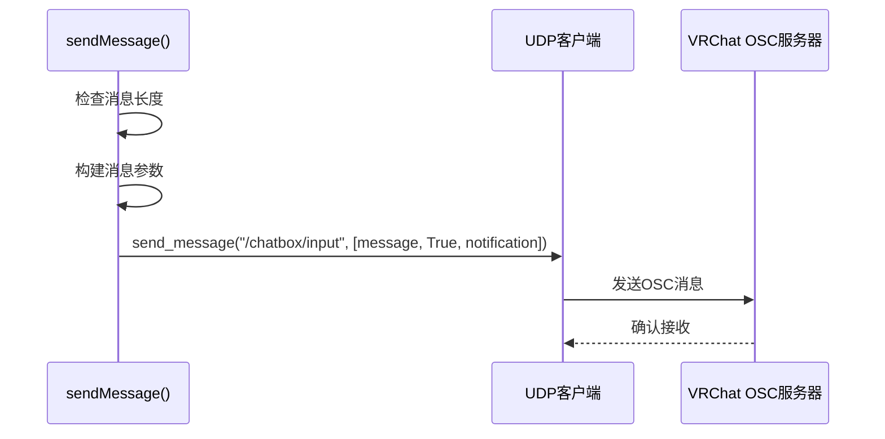
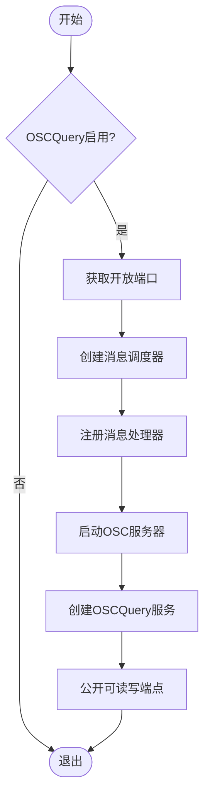
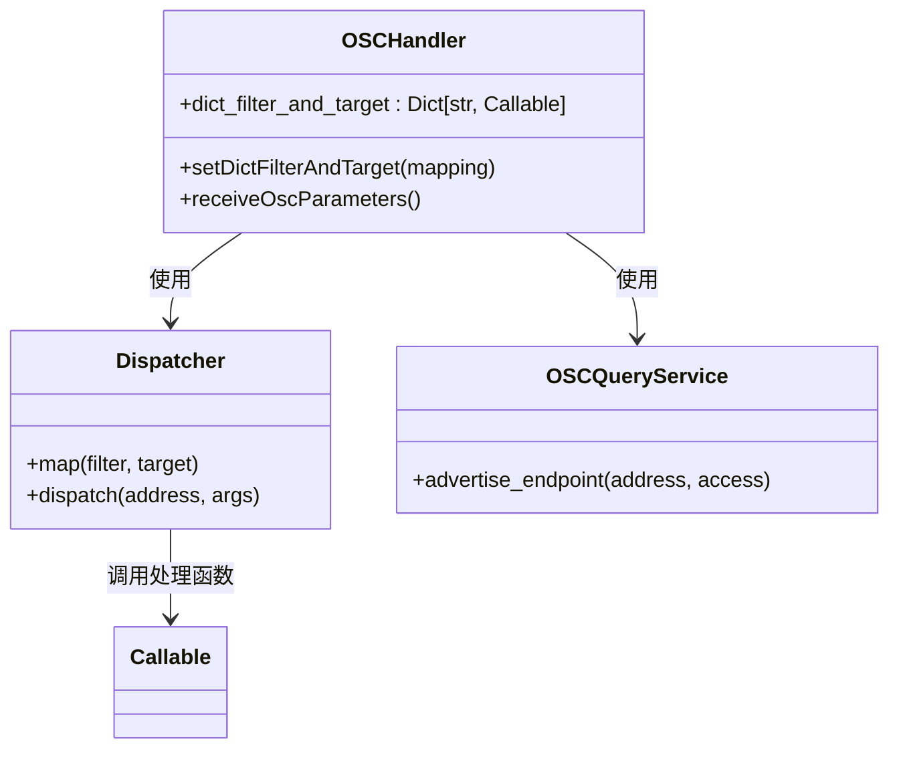
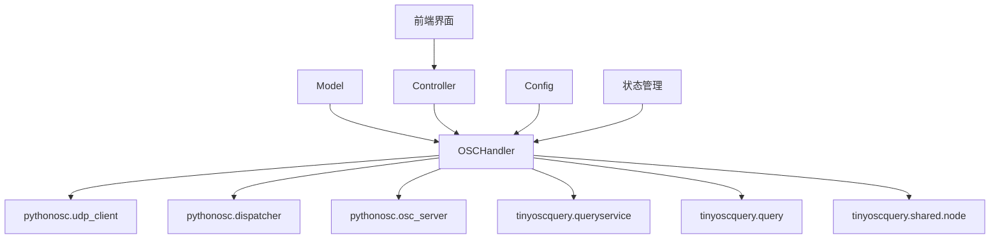

# OSC通信输出

<cite>
**本文档中引用的文件**
- [osc.py](file://src-python/models/osc/osc.py)
- [osc.md](file://src-python/docs/details/osc.md)
- [model.py](file://src-python/model.py)
- [config.py](file://src-python/config.py)
- [controller.py](file://src-python/controller.py)
- [AdvancedSettings.jsx](file://src-ui/views/app/config_page/setting_section/setting_box/advanced_settings/AdvancedSettings.jsx)
- [useHandleOscQuery.js](file://src-ui/logics/common/useHandleOscQuery.js)
</cite>

## 目录
1. [简介](#简介)
2. [项目结构](#项目结构)
3. [核心组件](#核心组件)
4. [架构概览](#架构概览)
5. [详细组件分析](#详细组件分析)
6. [依赖关系分析](#依赖关系分析)
7. [性能考虑](#性能考虑)
8. [故障排除指南](#故障排除指南)
9. [结论](#结论)

## 简介

OSCHandler类是VRCT项目中负责与VR平台（特别是VRChat）进行实时数据交互的核心组件。该类通过python-osc库实现了与VR平台的双向通信，支持聊天消息发送、打字状态控制以及参数监控等功能。通过OSCQuery协议，它还提供了自动服务发现和实时参数监控能力。

## 项目结构

VRCT项目的OSC通信功能主要分布在以下模块中：



**图表来源**
- [osc.py](file://src-python/models/osc/osc.py#L39-L214)
- [model.py](file://src-python/model.py#L132-L133)
- [controller.py](file://src-python/controller.py#L1505-L1542)

**章节来源**
- [osc.py](file://src-python/models/osc/osc.py#L1-L241)
- [model.py](file://src-python/model.py#L132-L133)

## 核心组件

### OSCHandler类

OSCHandler类是OSC通信功能的核心，提供了以下关键功能：

#### 主要属性
- **is_osc_query_enabled**: OSCQuery功能的启用状态标志
- **osc_ip_address**: OSC目标IP地址
- **osc_port**: UDP通信端口
- **udp_client**: OSC发送客户端
- **osc_server**: 本地OSC服务器
- **osc_query_service**: OSCQuery服务实例
- **dict_filter_and_target**: OSC地址过滤器到处理器的映射

#### 核心方法
- `setOscIpAddress()`: 动态调整目标IP地址
- `setOscPort()`: 动态调整通信端口
- `sendTyping()`: 发送打字状态消息
- `sendMessage()`: 发送聊天消息
- `receiveOscParameters()`: 启动本地OSC服务器
- `setDictFilterAndTarget()`: 设置OSC消息路由

**章节来源**
- [osc.py](file://src-python/models/osc/osc.py#L48-L67)

## 架构概览

OSCHandler类采用分层架构设计，支持本地和远程通信：



**图表来源**
- [osc.py](file://src-python/models/osc/osc.py#L48-L67)
- [osc.py](file://src-python/models/osc/osc.py#L153-L214)

## 详细组件分析

### setOscIpAddress和setOscPort方法

这两个方法实现了动态配置变更功能：

#### setOscIpAddress方法流程



**图表来源**
- [osc.py](file://src-python/models/osc/osc.py#L72-L80)

#### setOscPort方法流程



**图表来源**
- [osc.py](file://src-python/models/osc/osc.py#L81-L86)

### sendTyping和sendMessage方法

这两个方法负责向VRChat发送不同类型的消息：

#### sendTyping方法实现



**图表来源**
- [osc.py](file://src-python/models/osc/osc.py#L89-L92)

#### sendMessage方法实现



**图表来源**
- [osc.py](file://src-python/models/osc/osc.py#L94-L102)

### receiveOscParameters方法

该方法启动本地OSC服务器并利用OSCQuery服务暴露可读写端点：



**图表来源**
- [osc.py](file://src-python/models/osc/osc.py#L153-L185)

### dict_filter_and_target映射机制

该机制实现了外部OSC消息到相应处理函数的路由：



**图表来源**
- [osc.py](file://src-python/models/osc/osc.py#L150-L153)
- [osc.py](file://src-python/models/osc/osc.py#L166-L168)

**章节来源**
- [osc.py](file://src-python/models/osc/osc.py#L72-L102)
- [osc.py](file://src-python/models/osc/osc.py#L153-L185)

### 实际配置示例

#### 基本OSC配置

```javascript
// 基本OSC配置示例
const oscConfig = {
    ipAddress: "127.0.0.1",  // 本地VRChat
    port: 9000,              // 默认OSC端口
    enableOscQuery: true     // 启用OSCQuery
};

// 远程VRChat配置
const remoteOscConfig = {
    ipAddress: "192.168.1.100",  // 远程IP地址
    port: 9000,                  // 端口
    enableOscQuery: false        // 远程连接禁用OSCQuery
};
```

#### 双向通信配置

```javascript
// 双向OSC通信配置示例
const oscHandlers = {
    "/avatar/parameters/MuteSelf": (address, *args) => {
        console.log(`Mute状态变化: ${args}`);
        // 处理静音状态变化
    },
    "/chatbox/typing": (address, *args) => {
        console.log(`打字状态: ${args}`);
        // 处理打字状态变化
    },
    "/chatbox/input": (address, *args) => {
        console.log(`收到输入: ${args}`);
        // 处理聊天输入
    }
};

// 设置OSC参数监听
oscHandler.setDictFilterAndTarget(oscHandlers);
oscHandler.receiveOscParameters();
```

#### 处理本地与远程通信差异

```javascript
// 通信类型检测和配置
function configureOscCommunication(ipAddress) {
    const isLocal = ["127.0.0.1", "localhost"].includes(ipAddress);
    
    if (isLocal) {
        // 本地连接：启用完整OSCQuery功能
        oscHandler.setOscIpAddress(ipAddress);
        oscHandler.receiveOscParameters();  // 启用OSCQuery
        console.log("本地OSC连接已启用");
    } else {
        // 远程连接：禁用OSCQuery，仅使用基础OSC
        oscHandler.setOscIpAddress(ipAddress);
        console.log("远程OSC连接已启用（OSCQuery不可用）");
    }
}
```

**章节来源**
- [AdvancedSettings.jsx](file://src-ui/views/app/config_page/setting_section/setting_box/advanced_settings/AdvancedSettings.jsx#L37-L90)
- [controller.py](file://src-python/controller.py#L1505-L1542)

## 依赖关系分析

OSCHandler类的依赖关系图：



**图表来源**
- [osc.py](file://src-python/models/osc/osc.py#L10-L20)
- [model.py](file://src-python/model.py#L132-L133)

**章节来源**
- [osc.py](file://src-python/models/osc/osc.py#L10-L20)
- [model.py](file://src-python/model.py#L132-L133)

## 性能考虑

### CPU优化策略

OSCHandler类采用了多种性能优化策略：

1. **长轮询间隔**: OSC服务器使用10秒轮询间隔减少CPU使用
2. **线程池管理**: 使用守护线程避免阻塞主进程
3. **资源清理**: 及时关闭网络连接和清理资源

### 内存管理

- **浏览器实例复用**: OSCQuery浏览器实例在多次查询间保持
- **异常恢复**: 错误发生时自动清理和重建资源
- **弱引用**: 避免循环引用导致的内存泄漏

### 网络优化

- **UDP协议**: 使用无连接UDP协议降低开销
- **批量处理**: 支持消息队列和批量发送
- **连接复用**: 维护持久的UDP连接

## 故障排除指南

### 常见问题及解决方案

#### OSC连接失败

**症状**: 无法发送OSC消息或接收响应
**原因**: 
- 网络连接问题
- 端口被占用
- 防火墙阻止

**解决方案**:
```python
# 检查OSC可用性
def check_osc_availability():
    try:
        osc_handler = OSCHandler()
        # 测试基本连接
        osc_handler.sendMessage("测试消息")
        return True
    except Exception as e:
        print(f"OSC连接失败: {e}")
        return False
```

#### OSCQuery服务启动失败

**症状**: 无法发现OSCQuery服务或参数监控失效
**原因**:
- tinyoscquery库缺失
- 端口冲突
- 网络权限问题

**解决方案**:
```python
# 检查OSCQuery支持
def check_osc_query_support():
    if OSCQueryService is None:
        print("tinyoscquery库未安装，OSCQuery功能不可用")
        return False
    
    if not osc_handler.getIsOscQueryEnabled():
        print("OSCQuery仅支持本地连接")
        return False
    
    return True
```

#### 参数值获取失败

**症状**: 无法获取VRChat参数值
**原因**:
- VRChat未运行
- 参数不存在
- 网络延迟

**解决方案**:
```python
# 安全的参数获取
def safe_get_parameter_value(address, timeout=5.0):
    try:
        value = osc_handler.getOSCParameterValue(address)
        if value is None:
            print(f"参数 {address} 获取失败")
        return value
    except Exception as e:
        print(f"参数获取错误: {e}")
        return None
```

**章节来源**
- [osc.py](file://src-python/models/osc/osc.py#L103-L144)
- [useHandleOscQuery.js](file://src-ui/logics/common/useHandleOscQuery.js#L1-L38)

## 结论

OSCHandler类通过python-osc库实现了与VR平台的高效实时通信。其核心优势包括：

1. **灵活的配置管理**: 支持动态IP地址和端口配置
2. **双向通信能力**: 既可发送消息也可接收参数变化
3. **智能的服务发现**: 通过OSCQuery协议自动发现VRChat服务
4. **健壮的错误处理**: 提供优雅的错误恢复机制
5. **性能优化**: 采用多种策略确保低资源消耗

该实现为VRCT项目提供了稳定可靠的OSC通信基础设施，支持复杂的VRChat交互场景，同时保持了良好的扩展性和维护性。