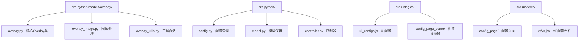
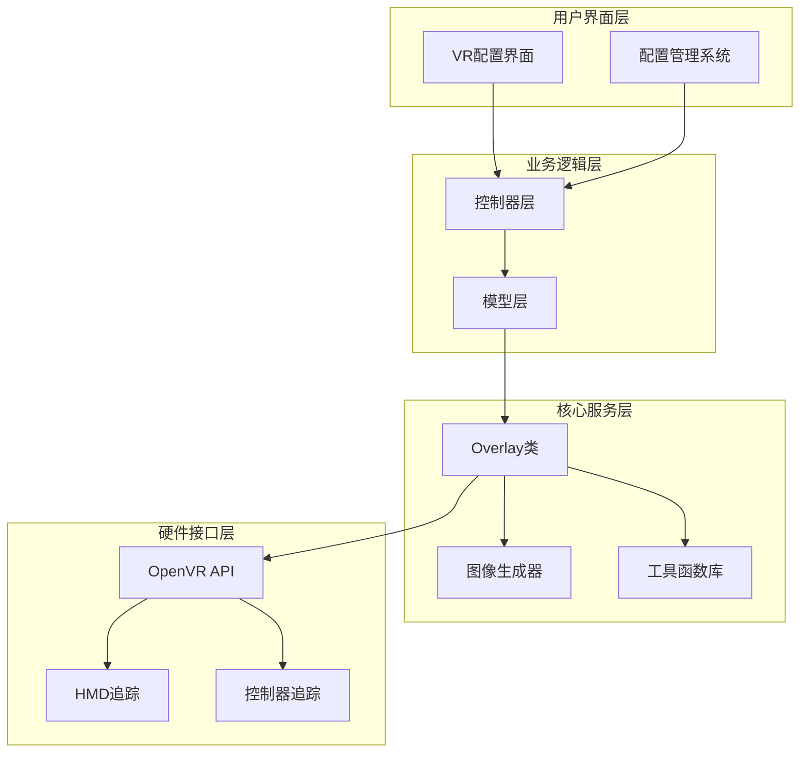
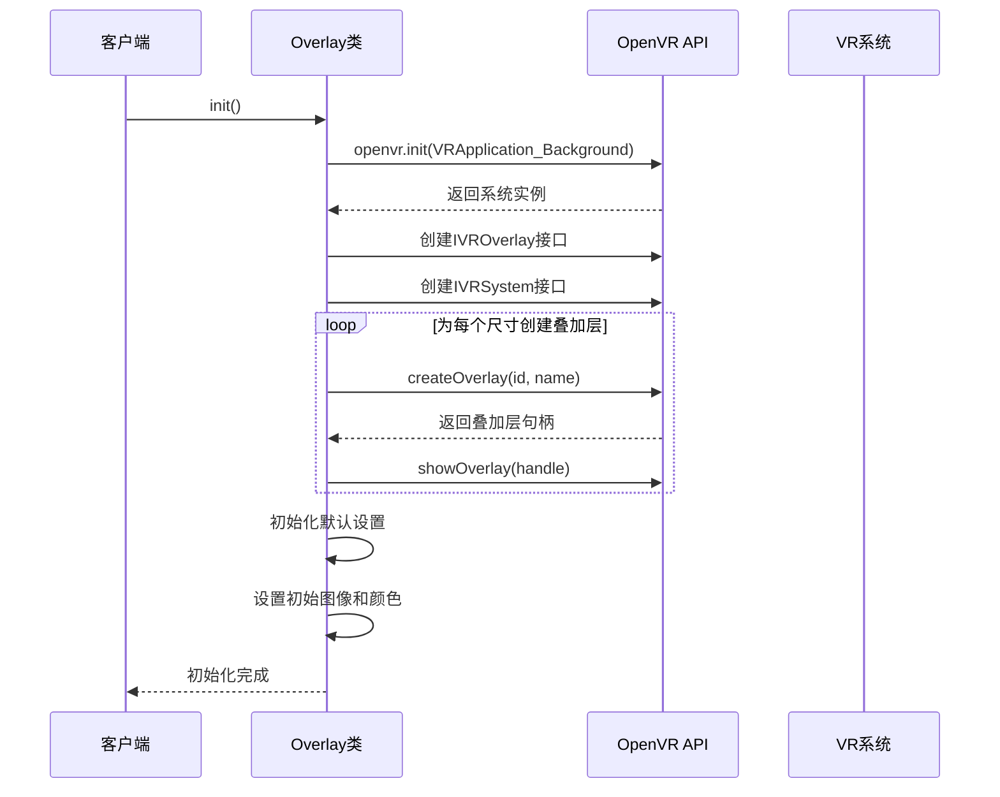
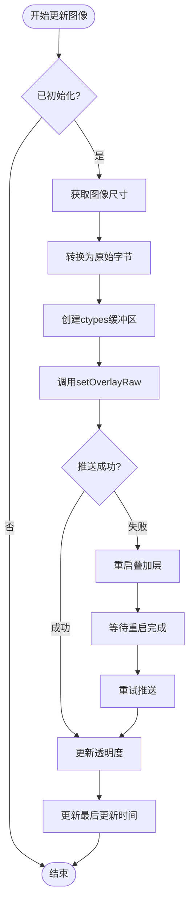
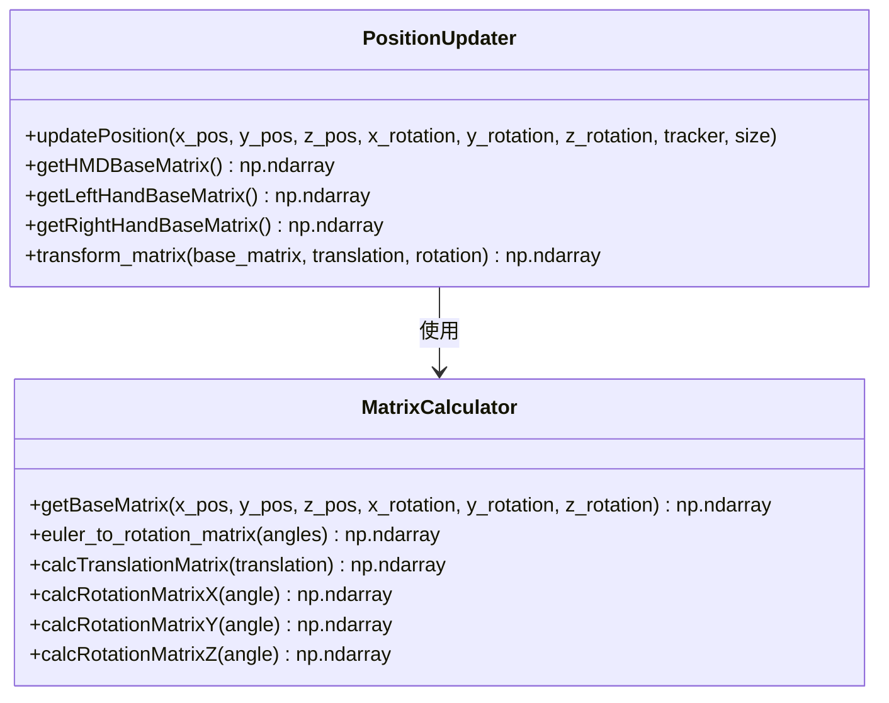
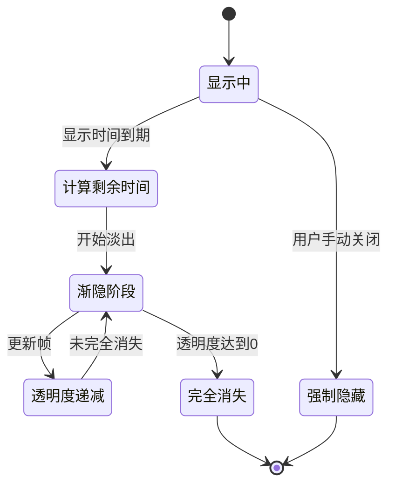
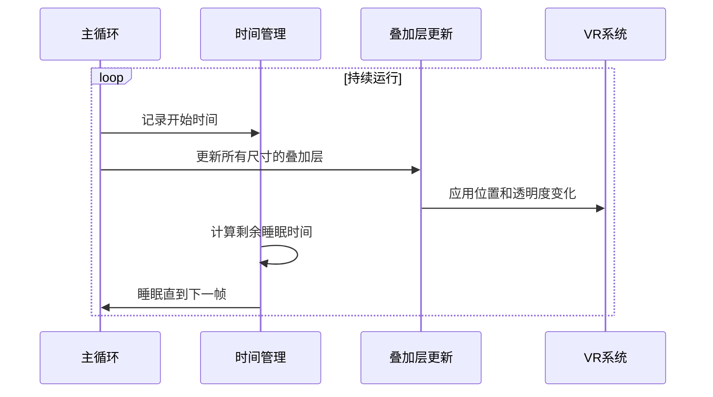
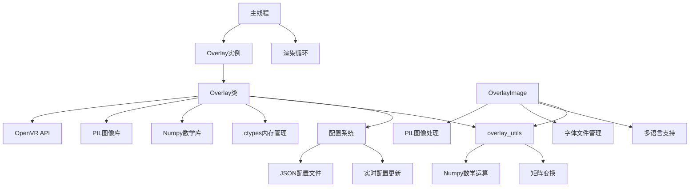

# VR叠加层显示

<cite>
**本文档中引用的文件**
- [overlay.py](file://src-python/models/overlay/overlay.py)
- [overlay_image.py](file://src-python/models/overlay/overlay_image.py)
- [overlay_utils.py](file://src-python/models/overlay/overlay_utils.py)
- [config.py](file://src-python/config.py)
- [model.py](file://src-python/model.py)
- [controller.py](file://src-python/controller.py)
- [ui_configs.js](file://src-ui/logics/ui_configs.js)
- [Vr.jsx](file://src-ui/views/app/config_page/setting_section/setting_box/vr/Vr.jsx)
</cite>

## 目录
1. [简介](#简介)
2. [项目结构](#项目结构)
3. [核心组件](#核心组件)
4. [架构概览](#架构概览)
5. [详细组件分析](#详细组件分析)
6. [依赖关系分析](#依赖关系分析)
7. [性能考虑](#性能考虑)
8. [故障排除指南](#故障排除指南)
9. [结论](#结论)

## 简介

VRCT项目中的Overlay类是一个专门用于在虚拟现实环境中创建和管理透明叠加层的核心组件。该系统通过OpenVR API实现了复杂的VR叠加层功能，支持多种尺寸的叠加层（small/large），能够根据HMD（头戴显示器）、左手控制器或右手控制器的追踪数据动态调整位置，并提供流畅的淡入淡出动画效果。

该系统的主要特点包括：
- 多尺寸叠加层管理（small和large）
- 基于OpenVR API的透明叠加层创建
- 实时追踪数据驱动的位置更新
- 淡入淡出动画效果
- 配置化的显示参数控制
- 自动化的渲染循环管理

## 项目结构

VR叠加层系统的文件组织结构清晰，主要分布在以下目录中：

**图表来源**
- [overlay.py](file://src-python/models/overlay/overlay.py#L1-L50)
- [overlay_image.py](file://src-python/models/overlay/overlay_image.py#L1-L50)
- [overlay_utils.py](file://src-python/models/overlay/overlay_utils.py#L1-L50)

**章节来源**
- [overlay.py](file://src-python/models/overlay/overlay.py#L1-L388)
- [overlay_image.py](file://src-python/models/overlay/overlay_image.py#L1-L733)
- [overlay_utils.py](file://src-python/models/overlay/overlay_utils.py#L1-L126)

## 核心组件

### Overlay类 - 主要控制器

Overlay类是整个VR叠加层系统的核心，负责管理多个尺寸的叠加层实例。该类提供了完整的生命周期管理，从初始化到渲染循环再到优雅关闭。

主要特性：
- 多尺寸叠加层支持（通过settings_dict参数）
- OpenVR系统集成
- 线程安全的渲染管理
- 实时配置更新支持

### 图像处理系统

OverlayImage类专门负责生成适合VR叠加层显示的图像内容，支持多种语言和格式化选项。

核心功能：
- 多语言字体支持（日语、韩语、中文等）
- Ruby标记系统（日语假名标注）
- 动态文本换行处理
- 角色圆角背景生成

### 工具函数库

overlay_utils模块提供了数学计算和矩阵变换所需的工具函数，支持复杂的3D空间变换。

**章节来源**
- [overlay.py](file://src-python/models/overlay/overlay.py#L85-L388)
- [overlay_image.py](file://src-python/models/overlay/overlay_image.py#L12-L733)
- [overlay_utils.py](file://src-python/models/overlay/overlay_utils.py#L1-L126)

## 架构概览

VR叠加层系统采用分层架构设计，确保了良好的模块化和可维护性：

**图表来源**
- [overlay.py](file://src-python/models/overlay/overlay.py#L85-L130)
- [model.py](file://src-python/model.py#L1000-L1114)
- [controller.py](file://src-python/controller.py#L2169-L2232)

## 详细组件分析

### init方法 - 系统初始化

init方法是Overlay类的核心初始化函数，负责建立与OpenVR系统的连接并创建所有必要的叠加层句柄。

**图表来源**
- [overlay.py](file://src-python/models/overlay/overlay.py#L104-L133)

关键步骤包括：
1. **OpenVR系统初始化**：使用`VRApplication_Background`模式启动VR系统
2. **接口创建**：建立IVROverlay和IVRSystem接口
3. **叠加层创建**：为每个配置的尺寸创建独立的叠加层实例
4. **默认设置应用**：初始化图像、颜色、透明度等基础属性

**章节来源**
- [overlay.py](file://src-python/models/overlay/overlay.py#L104-L133)

### updateImage方法 - 图像推送机制

updateImage方法负责将PIL图像转换为OpenVR兼容的原始字节格式并推送到VR叠加层。

**图表来源**
- [overlay.py](file://src-python/models/overlay/overlay.py#L137-L156)

实现细节：
- **图像格式转换**：将PIL图像转换为RGBA格式的原始字节
- **内存管理**：使用ctypes创建高效的内存缓冲区
- **错误处理**：自动重启机制确保系统稳定性
- **时间戳记录**：跟踪最后一次更新时间用于动画计算

**章节来源**
- [overlay.py](file://src-python/models/overlay/overlay.py#L137-L156)

### updatePosition方法 - 动态位置更新

updatePosition方法根据HMD或手柄的追踪数据动态调整叠加层的空间位置，支持多种追踪目标。

**图表来源**
- [overlay.py](file://src-python/models/overlay/overlay.py#L184-L225)
- [overlay_utils.py](file://src-python/models/overlay/overlay_utils.py#L72-L92)

支持的追踪目标：
- **HMD（头戴显示器）**：默认追踪目标，提供稳定的头部参考点
- **左手控制器**：提供左侧手部的精确位置和姿态
- **右手控制器**：提供右侧手部的精确位置和姿态

**章节来源**
- [overlay.py](file://src-python/models/overlay/overlay.py#L184-L225)
- [overlay_utils.py](file://src-python/models/overlay/overlay_utils.py#L72-L92)

### updateOpacity和evaluateOpacityFade方法 - 动画效果

这两个方法协同工作，实现了流畅的淡入淡出动画效果。

**图表来源**
- [overlay.py](file://src-python/models/overlay/overlay.py#L244-L252)

动画计算逻辑：
1. **显示阶段**：叠加层保持完全可见状态
2. **淡出准备**：检测显示时间是否超过设定值
3. **渐隐计算**：基于当前时间和淡出持续时间计算透明度系数
4. **边界检查**：确保透明度不会低于0

**章节来源**
- [overlay.py](file://src-python/models/overlay/overlay.py#L244-L252)

### mainloop方法 - 渲染循环

mainloop方法维持16ms间隔的渲染循环，确保流畅的视觉体验。

**图表来源**
- [overlay.py](file://src-python/models/overlay/overlay.py#L259-L268)

性能优化策略：
- **固定帧率**：维持约60FPS（16ms间隔）
- **智能睡眠**：根据实际处理时间调整睡眠时长
- **事件驱动**：响应VR系统事件进行及时更新

**章节来源**
- [overlay.py](file://src-python/models/overlay/overlay.py#L259-L268)

### getBaseMatrix系列函数 - 基准变换矩阵

这些函数为不同的追踪目标创建基准变换矩阵，定义了叠加层相对于追踪设备的初始位置和姿态。

| 函数 | 默认位置 | 默认旋转 | 用途 |
|------|----------|----------|------|
| getHMDBaseMatrix() | (0.0, -0.4, 1.0) | (0.0, 0.0, 0.0) | HMD前方显示 |
| getLeftHandBaseMatrix() | (0.3, 0.1, -0.31) | (-65.0, 165.0, 115.0) | 左手控制器附近 |
| getRightHandBaseMatrix() | (-0.3, 0.1, -0.31) | (-65.0, -165.0, -115.0) | 右手控制器附近 |

基准矩阵构建过程：
1. **旋转矩阵计算**：将欧拉角转换为3x3旋转矩阵
2. **平移向量设置**：根据指定的位置参数设置平移
3. **齐次坐标扩展**：转换为4x4齐次变换矩阵
4. **最终矩阵生成**：组合旋转和平移得到完整变换

**章节来源**
- [overlay.py](file://src-python/models/overlay/overlay.py#L38-L83)
- [overlay_utils.py](file://src-python/models/overlay/overlay_utils.py#L72-L92)

## 依赖关系分析

VR叠加层系统的依赖关系复杂但结构清晰：

**图表来源**
- [overlay.py](file://src-python/models/overlay/overlay.py#L1-L22)
- [overlay_image.py](file://src-python/models/overlay/overlay_image.py#L1-L11)
- [overlay_utils.py](file://src-python/models/overlay/overlay_utils.py#L1-L5)

关键依赖项：
- **OpenVR API**：核心VR功能接口
- **PIL（Pillow）**：图像处理和字体渲染
- **Numpy**：高性能数值计算
- **ctypes**：C类型数据访问和内存管理

**章节来源**
- [overlay.py](file://src-python/models/overlay/overlay.py#L1-L22)
- [overlay_image.py](file://src-python/models/overlay/overlay_image.py#L1-L11)
- [overlay_utils.py](file://src-python/models/overlay/overlay_utils.py#L1-L5)

## 性能考虑

### 内存管理优化

1. **图像缓冲区复用**：使用ctypes创建高效的内存缓冲区
2. **字体缓存机制**：避免重复加载字体文件
3. **对象池模式**：重用临时对象减少GC压力

### 渲染性能优化

1. **固定帧率控制**：维持16ms间隔确保流畅性
2. **条件更新**：只在必要时更新叠加层属性
3. **异步处理**：使用独立线程处理渲染循环

### 网络和I/O优化

1. **配置延迟保存**：使用防抖机制减少磁盘写入
2. **字体预加载**：启动时预加载常用字体
3. **资源缓存**：缓存计算结果避免重复计算

## 故障排除指南

### 常见问题及解决方案

#### OpenVR初始化失败
**症状**：系统无法启动或出现初始化错误
**原因**：SteamVR未运行或版本不兼容
**解决方案**：确保SteamVR正常运行，检查OpenVR版本兼容性

#### 图像推送错误
**症状**：叠加层显示异常或无图像
**原因**：图像格式不兼容或内存不足
**解决方案**：验证图像格式为RGBA，检查可用内存

#### 追踪数据丢失
**症状**：叠加层位置异常或消失
**原因**：追踪设备断开连接或信号干扰
**解决方案**：检查设备连接状态，重新校准追踪系统

#### 性能问题
**症状**：帧率下降或卡顿
**原因**：渲染负载过高或资源竞争
**解决方案**：降低图像分辨率，优化更新频率

**章节来源**
- [overlay.py](file://src-python/models/overlay/overlay.py#L144-L156)
- [overlay.py](file://src-python/models/overlay/overlay.py#L232-L242)

## 结论

VRCT的Overlay类提供了一个完整而强大的VR叠加层解决方案，通过精心设计的架构和优化的算法，实现了高质量的虚拟现实显示效果。该系统的主要优势包括：

1. **模块化设计**：清晰的职责分离便于维护和扩展
2. **性能优化**：多层次的优化策略确保流畅的用户体验
3. **灵活性**：丰富的配置选项满足不同使用场景需求
4. **稳定性**：完善的错误处理和恢复机制保证系统可靠性

该系统为VR应用程序开发提供了一个可靠的基础设施，特别适用于需要实时文本显示和交互的应用场景。通过合理配置显示持续时间、透明度和UI缩放比例，开发者可以创造出符合特定需求的VR用户体验。