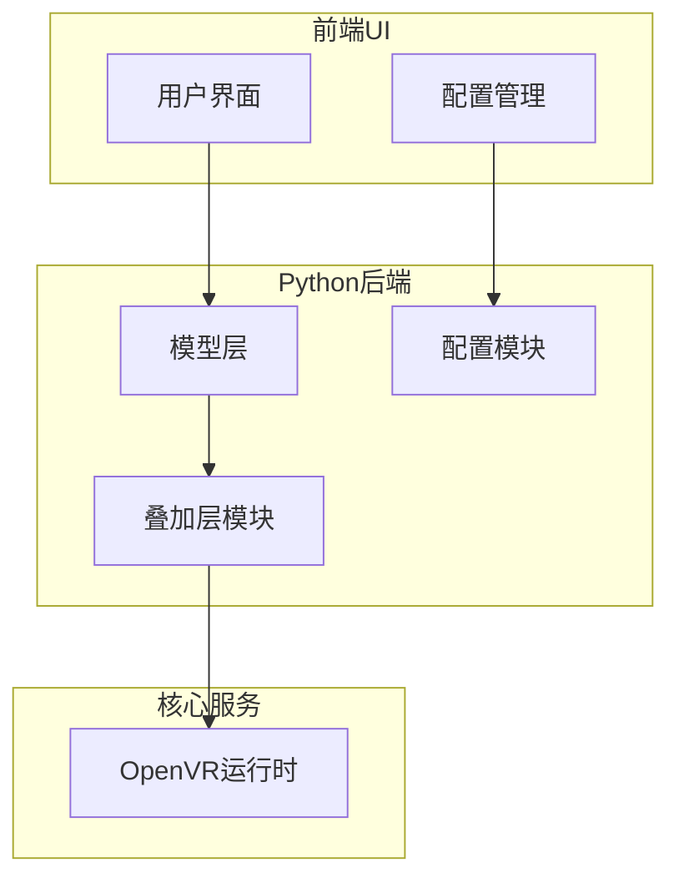
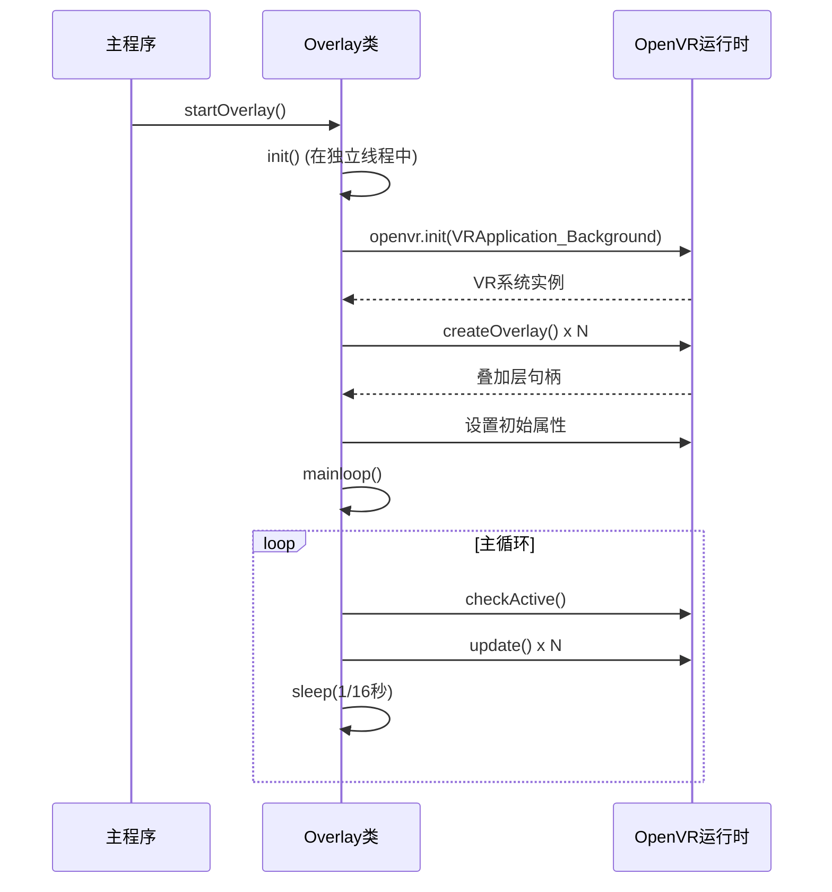
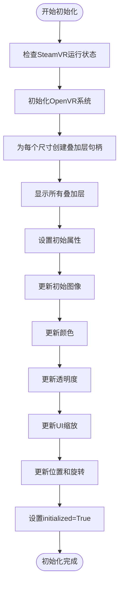
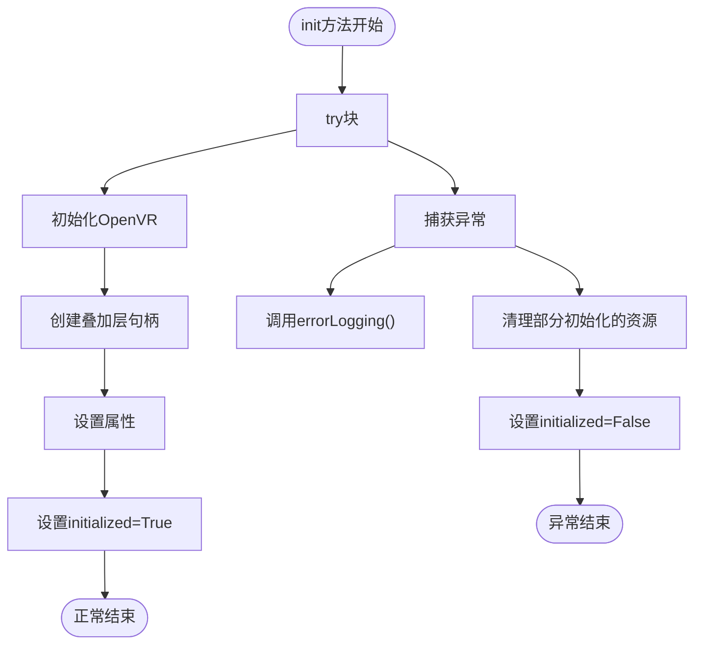
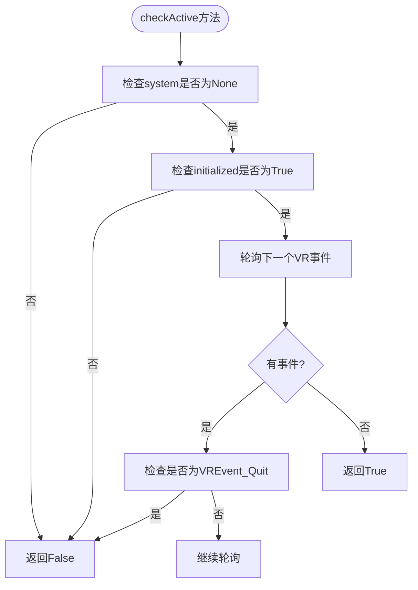
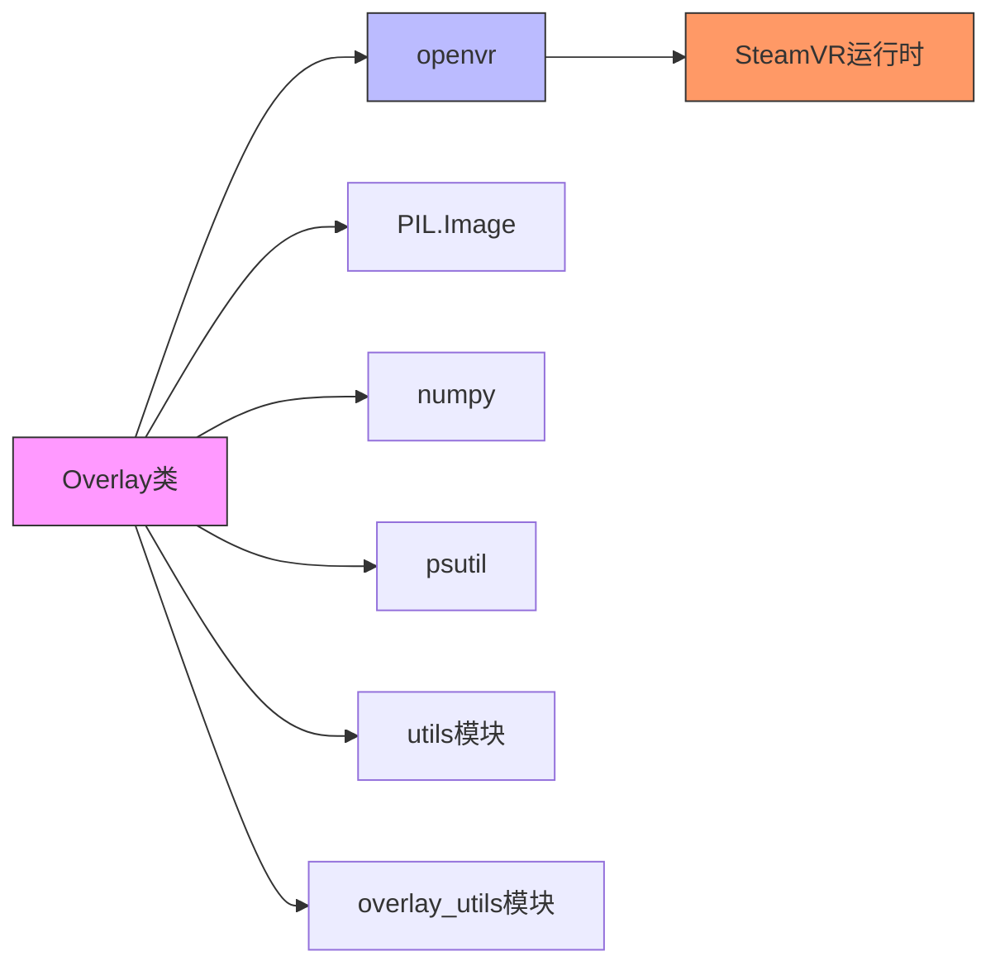

# 叠加层初始化

<cite>
**本文档中引用的文件**  
- [overlay.py](file://src-python/models/overlay/overlay.py)
- [model.py](file://src-python/model.py)
- [config.py](file://src-python/config.py)
- [controller.py](file://src-python/controller.py)
- [Vr.jsx](file://src-ui/views/app/config_page/setting_section/setting_box/vr/Vr.jsx)
- [ui_config_setter.js](file://src-ui/logics/configs/config_page_setter/ui_config_setter.js)
</cite>

## 目录
1. [简介](#简介)
2. [项目结构](#项目结构)
3. [核心组件](#核心组件)
4. [架构概述](#架构概述)
5. [详细组件分析](#详细组件分析)
6. [依赖分析](#依赖分析)
7. [性能考虑](#性能考虑)
8. [故障排除指南](#故障排除指南)
9. [结论](#结论)

## 简介
本文档详细说明了VRCT项目中`Overlay`类的`init`方法如何通过OpenVR接口初始化虚拟现实运行时环境。文档重点描述了如何创建多个指定尺寸（如512x512、256x256）的纹理叠加层句柄，并将其与对应的材质资源绑定。同时，文档还解释了在初始化过程中如何设置叠加层的默认属性，包括透明度模式、双面渲染标志和纹理格式。结合代码示例，展示了如何处理初始化失败的异常情况，以及如何验证VR系统是否就绪。最后，文档描述了初始化流程在整个系统启动过程中的时序位置及其与主循环的协作关系。

## 项目结构
VRCT项目采用模块化设计，主要分为前端UI、Python后端模型和Tauri核心三大部分。叠加层功能主要由Python后端的`models/overlay`模块实现，该模块通过OpenVR API与VR运行时环境交互。前端通过配置界面提供用户可调参数，这些参数最终传递给`Overlay`类用于初始化和运行时控制。

**Diagram sources**
- [overlay.py](file://src-python/models/overlay/overlay.py#L85-L388)
- [Vr.jsx](file://src-ui/views/app/config_page/setting_section/setting_box/vr/Vr.jsx#L42-L106)

**Section sources**
- [overlay.py](file://src-python/models/overlay/overlay.py#L1-L388)
- [project_structure](file://#L1-L200)

## 核心组件
`Overlay`类是VRCT项目中负责管理OpenVR叠加层的核心组件。它通过OpenVR接口与VR运行时环境通信，创建和管理多个不同尺寸的叠加层实例。该类在初始化时接收一个包含各种设置的字典，这些设置定义了每个叠加层的行为和外观属性。

**Section sources**
- [overlay.py](file://src-python/models/overlay/overlay.py#L85-L388)
- [model.py](file://src-python/model.py#L1089-L1114)

## 架构概述
`Overlay`类的架构设计遵循了资源管理和状态控制的分离原则。它通过独立的线程运行主循环，确保叠加层的更新不会阻塞主应用程序。初始化过程严格遵循OpenVR的API调用顺序，首先初始化VR系统，然后创建叠加层句柄，最后设置各种属性。

**Diagram sources**
- [overlay.py](file://src-python/models/overlay/overlay.py#L269-L275)
- [overlay.py](file://src-python/models/overlay/overlay.py#L104-L132)

## 详细组件分析

### Overlay类初始化分析
`Overlay`类的`init`方法是整个VR叠加层系统的核心初始化过程。该方法通过OpenVR接口建立与VR运行时环境的连接，并为每个预定义尺寸的叠加层创建相应的句柄。

#### 初始化流程

**Diagram sources**
- [overlay.py](file://src-python/models/overlay/overlay.py#L104-L132)
- [overlay.py](file://src-python/models/overlay/overlay.py#L115-L128)

#### 属性设置机制
`Overlay`类在初始化过程中会为每个叠加层设置一系列默认属性，这些属性通过配置系统从用户界面获取。主要属性包括：

| 属性 | 描述 | 默认值 | 设置方法 |
|------|------|--------|----------|
| 透明度 | 叠加层的不透明度 | 1.0 | updateOpacity() |
| UI缩放 | 用户界面缩放比例 | 1.0 | updateUiScaling() |
| 显示时长 | 消息显示持续时间 | 5秒 | updateDisplayDuration() |
| 淡出时长 | 消息淡出动画时间 | 2秒 | updateFadeoutDuration() |
| 跟踪目标 | 叠加层附着的设备 | HMD | updatePosition() |

**Section sources**
- [overlay.py](file://src-python/models/overlay/overlay.py#L115-L132)
- [config.py](file://src-python/config.py#L683-L684)
- [Vr.jsx](file://src-ui/views/app/config_page/setting_section/setting_box/vr/Vr.jsx#L468-L494)

### 异常处理与系统验证
`Overlay`类实现了健壮的异常处理机制，确保在初始化失败时能够正确清理资源并提供错误信息。

#### 异常处理流程

**Diagram sources**
- [overlay.py](file://src-python/models/overlay/overlay.py#L104-L136)
- [overlay.py](file://src-python/models/overlay/overlay.py#L34-L36)

#### 系统就绪验证
`Overlay`类通过`checkActive`方法持续验证VR系统的就绪状态。该方法会轮询VR事件队列，检测是否有退出事件。

**Diagram sources**
- [overlay.py](file://src-python/models/overlay/overlay.py#L232-L242)

## 依赖分析
`Overlay`类依赖于多个外部库和内部模块，形成了清晰的依赖关系图。

**Diagram sources**
- [overlay.py](file://src-python/models/overlay/overlay.py#L1-L8)
- [overlay.py](file://src-python/models/overlay/overlay.py#L85-L95)

**Section sources**
- [overlay.py](file://src-python/models/overlay/overlay.py#L1-L388)
- [go.mod](file://#L1-L10)

## 性能考虑
`Overlay`类的主循环以约60FPS的频率运行（每1/16秒一次），确保了叠加层更新的流畅性。通过在独立线程中运行，避免了阻塞主应用程序的UI线程。初始化过程中创建的叠加层句柄会一直保持，直到系统关闭，减少了运行时的资源分配开销。

## 故障排除指南
当`Overlay`类初始化失败时，可以按照以下步骤进行排查：

1. **检查SteamVR状态**：确保SteamVR正在运行，`checkSteamvrRunning`方法会检测`vrmonitor.exe`进程。
2. **验证OpenVR初始化**：`openvr.init()`调用可能因多种原因失败，包括驱动问题或权限不足。
3. **检查叠加层句柄**：确保`createOverlay`返回有效的句柄，无效句柄可能导致后续操作失败。
4. **查看日志输出**：`errorLogging`函数会输出详细的错误堆栈信息，帮助定位问题根源。

**Section sources**
- [overlay.py](file://src-python/models/overlay/overlay.py#L304-L307)
- [overlay.py](file://src-python/models/overlay/overlay.py#L134-L136)

## 结论
`Overlay`类的`init`方法实现了完整的VR叠加层初始化流程，通过OpenVR接口创建和配置多个叠加层实例。该实现具有良好的错误处理机制和资源管理策略，确保了系统的稳定性和可靠性。初始化流程与主循环分离，通过独立线程运行，保证了应用程序的响应性。整体设计充分考虑了用户体验和系统性能，为VR环境中的信息展示提供了坚实的基础。