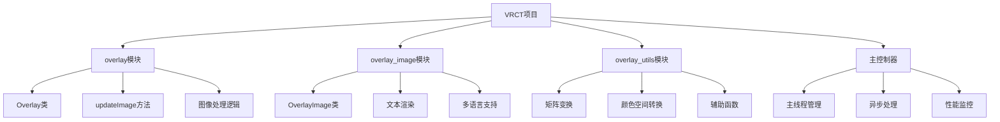
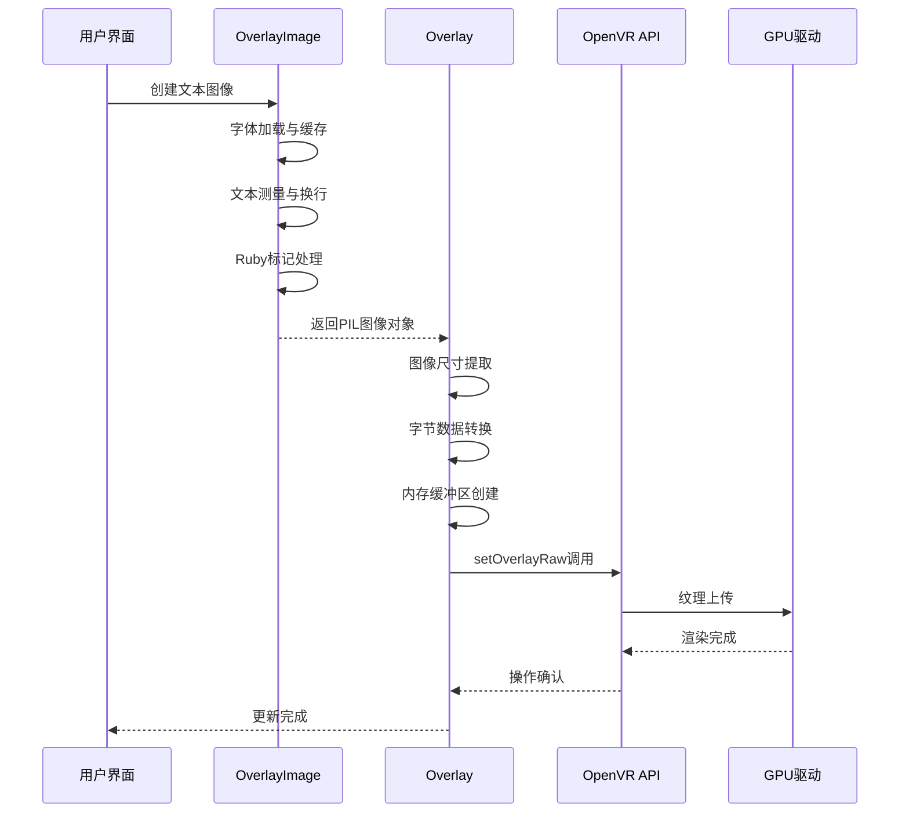
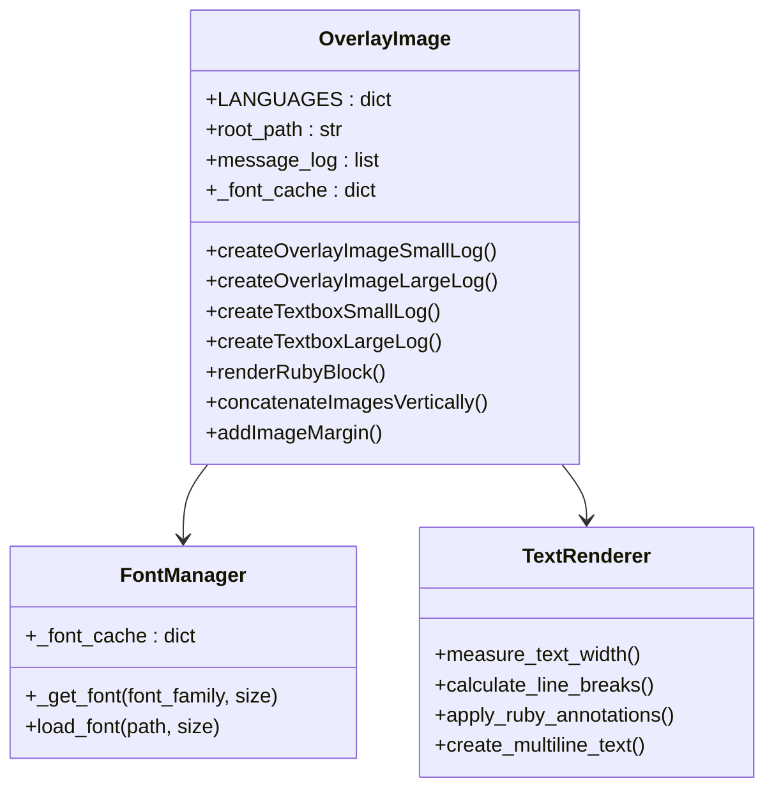
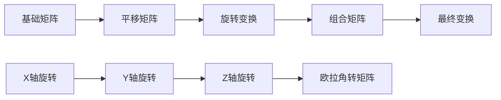
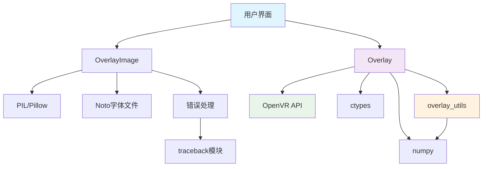

# 图像内容更新

<cite>
**本文档中引用的文件**
- [overlay.py](file://src-python/models/overlay/overlay.py)
- [overlay_image.py](file://src-python/models/overlay/overlay_image.py)
- [overlay_utils.py](file://src-python/models/overlay/overlay_utils.py)
- [overlay.md](file://src-python/docs/details/overlay.md)
- [model_zh.md](file://src-python/docs/model_zh.md)
</cite>

## 目录
1. [简介](#简介)
2. [项目结构](#项目结构)
3. [核心组件](#核心组件)
4. [架构概览](#架构概览)
5. [详细组件分析](#详细组件分析)
6. [依赖关系分析](#依赖关系分析)
7. [性能考虑](#性能考虑)
8. [故障排除指南](#故障排除指南)
9. [结论](#结论)

## 简介

VRCT项目中的图像内容更新系统是一个复杂的实时图形处理管道，负责将PIL格式的图像对象转换为符合OpenVR要求的原始RGBA字节流，并通过纹理更新接口推送到指定的叠加层句柄。该系统需要处理图像缩放、颜色空间转换和内存对齐等关键细节，同时通过优化的辅助函数避免主线程阻塞，确保VR环境中的流畅用户体验。

## 项目结构

该项目采用模块化的Python架构，主要包含以下核心模块：



**图表来源**
- [overlay.py](file://src-python/models/overlay/overlay.py#L85-L137)
- [overlay_image.py](file://src-python/models/overlay/overlay_image.py#L12-L13)
- [overlay_utils.py](file://src-python/models/overlay/overlay_utils.py#L1-L126)

**章节来源**
- [overlay.py](file://src-python/models/overlay/overlay.py#L1-L388)
- [overlay_image.py](file://src-python/models/overlay/overlay_image.py#L1-L733)

## 核心组件

### Overlay类 - 主要图像更新控制器

Overlay类是整个图像更新系统的核心控制器，负责管理多个尺寸的VR叠加层实例。该类维护着完整的状态管理系统，包括初始化状态、更新时间戳、透明度衰减比率等关键参数。

### updateImage方法 - 关键处理函数

updateImage方法是系统中最关键的函数，它接收PIL格式的图像对象，执行必要的转换步骤，然后通过OpenVR API推送到底层硬件。该方法实现了健壮的错误处理机制，包括自动重试和系统重启功能。

### OverlayImage类 - 文本渲染引擎

OverlayImage类专门负责文本渲染和图像生成，支持多种语言的字体渲染，包括日语、韩语、简体中文和繁体中文。该类实现了复杂的文本换行算法和Ruby标记系统，用于日语文本的音素标注。

**章节来源**
- [overlay.py](file://src-python/models/overlay/overlay.py#L85-L156)
- [overlay_image.py](file://src-python/models/overlay/overlay_image.py#L12-L733)

## 架构概览

整个图像更新系统采用分层架构设计，从高层的用户界面到底层的硬件抽象：



**图表来源**
- [overlay.py](file://src-python/models/overlay/overlay.py#L137-L156)
- [overlay_image.py](file://src-python/models/overlay/overlay_image.py#L244-L325)

## 详细组件分析

### updateImage方法深度解析

updateImage方法是整个系统的核心，其实现包含了多个关键步骤：

#### 图像格式转换流程

```mermaid
flowchart TD
A[PIL Image对象] --> B[尺寸提取<br/>width, height]
B --> C[字节数据转换<br/>img.tobytes()]
C --> D[内存缓冲区创建<br/>ctypes.c_char array]
D --> E[OpenVR纹理更新<br/>setOverlayRaw]
E --> F{更新成功?}
F --> |是| G[更新透明度]
F --> |否| H[重启Overlay]
H --> I[重新尝试更新]
I --> J[记录最后更新时间]
G --> J
J --> K[完成]
```

**图表来源**
- [overlay.py](file://src-python/models/overlay/overlay.py#L139-L155)

#### 内存对齐与缓冲区管理

系统使用ctypes模块进行高效的内存操作，确保图像数据能够正确传递给OpenVR API：

- **字节数据提取**: `img.tobytes()` 将PIL图像转换为连续的字节序列
- **类型安全数组**: `(ctypes.c_char * len(img)).from_buffer_copy(img)` 创建类型安全的字符数组
- **内存对齐**: 确保数据在内存中的正确对齐，避免潜在的性能问题

#### 错误处理与恢复机制

系统实现了多层次的错误处理策略：

1. **即时重试**: 当遇到临时错误时，系统会立即尝试重新启动Overlay
2. **阻塞等待**: 在重启过程中，系统会阻塞直到初始化完成
3. **最终失败处理**: 如果所有重试都失败，系统会记录错误并继续运行

**章节来源**
- [overlay.py](file://src-python/models/overlay/overlay.py#L137-L156)

### 文本渲染与图像生成

#### 多语言字体支持系统

OverlayImage类实现了完整的多语言字体支持系统：



**图表来源**
- [overlay_image.py](file://src-python/models/overlay/overlay_image.py#L12-L733)

#### Ruby标记系统

对于日语文本，系统实现了复杂的Ruby标记系统，支持音素标注：

- **原形标注**: 显示汉字的拼音
- **平假名标注**: 显示汉字对应的平假名
- **罗马字标注**: 提供国际化的读音参考

#### 文本换行算法

系统实现了智能的文本换行算法，根据容器宽度动态计算最佳的换行点：

1. **宽度测量**: 使用PIL的文本长度测量功能
2. **字符分割**: 根据测量结果分割长文本
3. **视觉平衡**: 确保每行文本的视觉平衡

**章节来源**
- [overlay_image.py](file://src-python/models/overlay/overlay_image.py#L139-L325)
- [overlay_image.py](file://src-python/models/overlay/overlay_image.py#L379-L551)

### 辅助函数与工具

#### 矩阵变换系统

overlay_utils模块提供了完整的3D变换矩阵系统：



**图表来源**
- [overlay_utils.py](file://src-python/models/overlay/overlay_utils.py#L72-L92)

#### 性能优化策略

系统采用了多种性能优化策略：

1. **字体缓存**: 避免重复加载相同的字体文件
2. **延迟计算**: 只在需要时才进行复杂的文本测量
3. **内存复用**: 重用图像缓冲区减少内存分配

**章节来源**
- [overlay_utils.py](file://src-python/models/overlay/overlay_utils.py#L1-L126)

## 依赖关系分析

系统的依赖关系展现了清晰的分层架构：



**图表来源**
- [overlay.py](file://src-python/models/overlay/overlay.py#L1-L22)
- [overlay_image.py](file://src-python/models/overlay/overlay_image.py#L1-L11)

**章节来源**
- [overlay.py](file://src-python/models/overlay/overlay.py#L1-L22)
- [overlay_image.py](file://src-python/models/overlay/overlay_image.py#L1-L11)

## 性能考虑

### 实时渲染性能

系统针对VR环境的实时渲染需求进行了专门优化：

#### 帧率目标与监控

- **目标帧率**: 90Hz（11.1ms/frame）
- **性能监控**: 实时跟踪帧时间分布
- **自适应优化**: 根据系统负载动态调整质量设置

#### 内存使用优化

- **字体缓存**: 避免重复加载字体文件
- **图像缓存**: 重用已生成的图像对象
- **垃圾回收**: 及时释放不需要的资源

#### CPU使用优化

- **异步处理**: 将耗时的文本渲染操作移到后台线程
- **批量更新**: 合并多个更新请求减少API调用
- **智能调度**: 在系统空闲时执行非关键任务

### 不同图像尺寸的性能影响

系统支持多种图像尺寸配置，每种尺寸对性能的影响如下：

| 尺寸类别 | 分辨率 | 内存使用 | 渲染时间 | 适用场景 |
|---------|--------|----------|----------|----------|
| 小型 | 3840×92 | ~350KB | 极快 | 状态指示器 |
| 中型 | 960×200 | ~1.5MB | 快速 | 简短消息 |
| 大型 | 960×400+ | ~3-6MB | 中等 | 详细对话 |

**章节来源**
- [overlay.md](file://src-python/docs/details/overlay.md#L530-L595)

## 故障排除指南

### 常见问题与解决方案

#### 初始化失败

**症状**: Overlay无法启动或初始化超时
**原因**: SteamVR未运行或OpenVR驱动程序问题
**解决方案**: 
1. 确认SteamVR已完全启动
2. 检查OpenVR驱动程序兼容性
3. 重启VR系统

#### 图像更新失败

**症状**: 图像无法正确显示或显示异常
**原因**: 内存不足或OpenVR API调用失败
**解决方案**:
1. 检查系统内存使用情况
2. 降低图像分辨率
3. 重启Overlay服务

#### 性能问题

**症状**: 帧率下降或卡顿
**原因**: CPU/GPU负载过高
**解决方案**:
1. 启用性能监控
2. 调整渲染质量设置
3. 减少并发更新数量

**章节来源**
- [overlay.md](file://src-python/docs/details/overlay.md#L597-L690)

## 结论

VRCT项目的图像内容更新系统是一个高度优化的实时图形处理管道，成功地解决了从PIL图像到OpenVR纹理的复杂转换过程。系统通过精心设计的架构，实现了以下关键特性：

1. **高性能**: 通过内存优化和异步处理确保90Hz的帧率目标
2. **多语言支持**: 完整的国际化文本渲染能力
3. **鲁棒性**: 强大的错误处理和自动恢复机制
4. **可扩展性**: 模块化设计便于功能扩展和维护

该系统为VR环境中的实时文本显示提供了可靠的解决方案，其设计理念和实现技术可以作为其他类似项目的参考。随着VR技术的不断发展，这套系统的设计原则和优化策略将继续发挥重要作用。