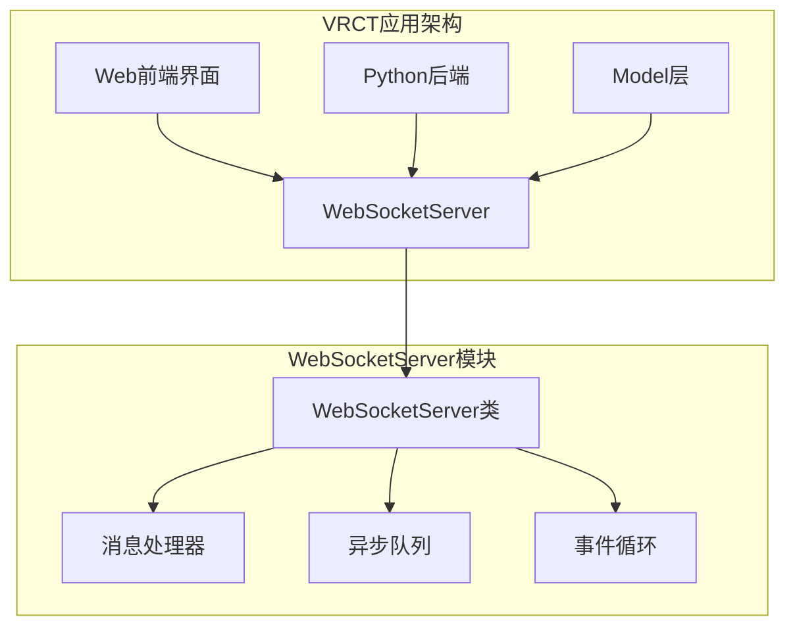
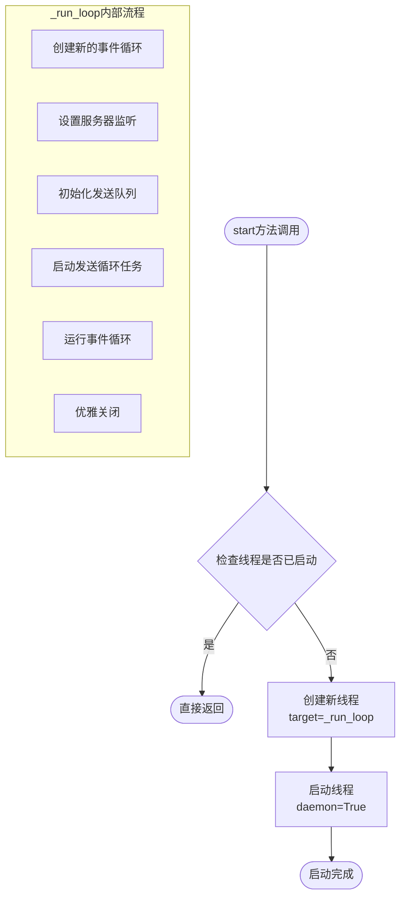
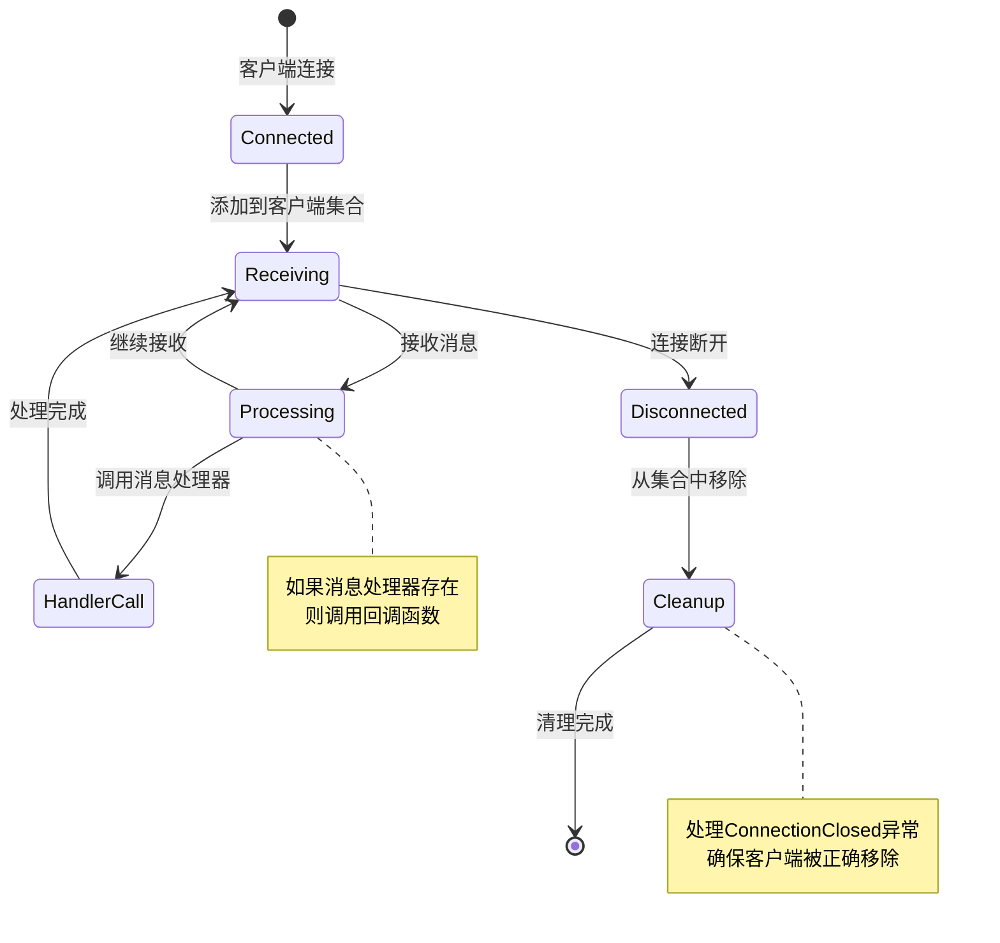
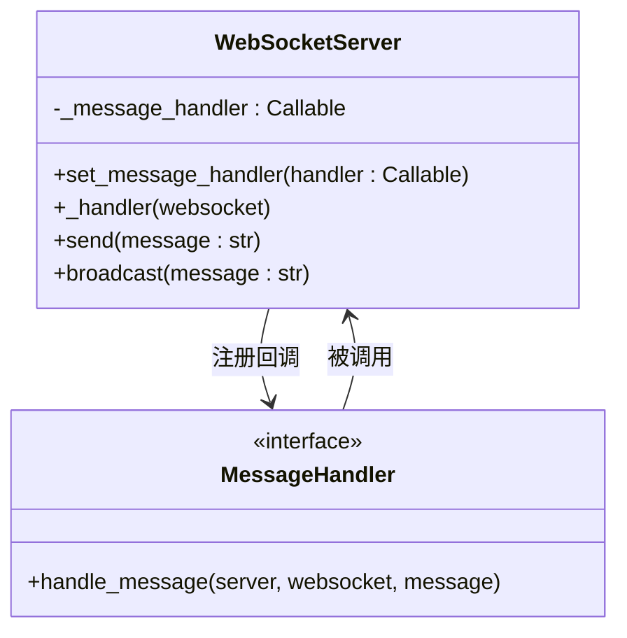
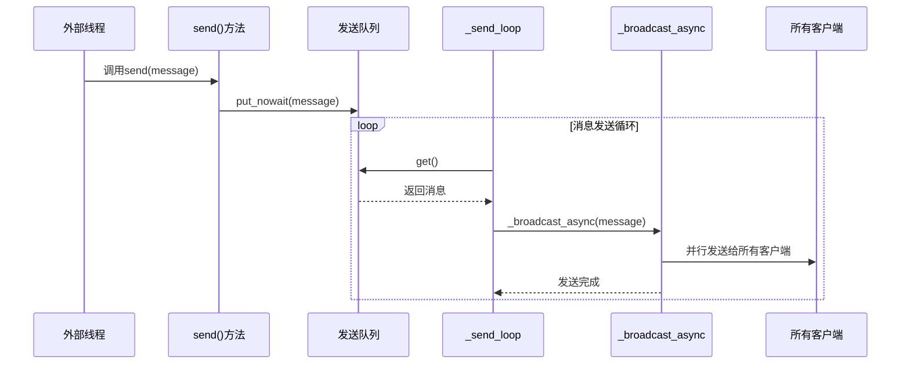
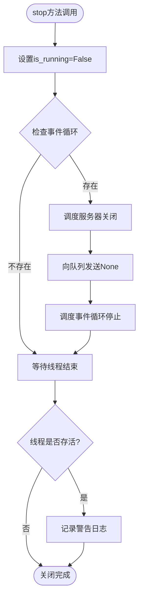
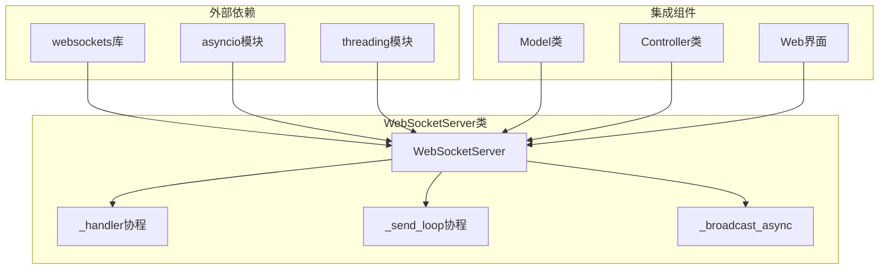

# WebSocket服务

<cite>
**本文档中引用的文件**
- [websocket_server.py](file://src-python/src/models/websocket/websocket_server.py)
- [websocket_server.md](file://src-python/src/docs/details/websocket_server.md)
- [model.py](file://src-python/model.py)
- [test_client.py](file://src-python/test_client.py)
- [mainloop.py](file://src-python/mainloop.py)
- [useReceiveRoutes.js](file://src-ui/logics/useReceiveRoutes.js)
</cite>

## 目录
1. [简介](#简介)
2. [项目结构](#项目结构)
3. [核心组件](#核心组件)
4. [架构概览](#架构概览)
5. [详细组件分析](#详细组件分析)
6. [依赖关系分析](#依赖关系分析)
7. [性能考虑](#性能考虑)
8. [故障排除指南](#故障排除指南)
9. [结论](#结论)

## 简介

WebSocketServer类是VRCT应用程序中的核心通信组件，基于websockets库和asyncio框架实现全双工实时通信。该服务器为VRCT与Web前端、外部客户端以及其他后端组件之间提供了高效、可靠的双向消息传递机制。

主要功能包括：
- 异步WebSocket服务器的启动和停止
- 多客户端同时连接管理
- 线程安全的消息发送机制
- 外部消息处理器的注册和回调
- 高效的消息广播和单播功能
- 优雅的服务端关闭流程

## 项目结构

WebSocketServer类位于VRCT项目的模块化架构中，作为独立的通信层存在：



**图表来源**
- [websocket_server.py](file://src-python/src/models/websocket/websocket_server.py#L1-L30)
- [model.py](file://src-python/model.py#L1140-L1200)

**章节来源**
- [websocket_server.py](file://src-python/src/models/websocket/websocket_server.py#L1-L30)
- [model.py](file://src-python/model.py#L1140-L1200)

## 核心组件

WebSocketServer类包含以下核心组件：

### 主要属性
- **host**: 服务器监听地址，默认为'127.0.0.1'
- **port**: 服务器端口号，默认为8765
- **clients**: 连接客户端集合，使用Set存储WebSocket连接
- **_message_handler**: 消息接收回调函数
- **_loop**: asyncio事件循环实例
- **_server**: websockets服务器实例
- **_send_queue**: 外部线程安全的消息队列
- **is_running**: 服务器运行状态标志

### 关键方法
- **start()**: 启动WebSocket服务器
- **stop()**: 停止WebSocket服务器
- **set_message_handler()**: 设置消息处理器
- **send()**: 从外部线程发送消息
- **broadcast()**: 广播消息给所有客户端

**章节来源**
- [websocket_server.py](file://src-python/src/models/websocket/websocket_server.py#L17-L30)

## 架构概览

WebSocketServer采用多线程异步架构，确保高性能和响应性：

```mermaid
sequenceDiagram
participant Client as 客户端
participant Server as WebSocketServer
participant Handler as 消息处理器
participant Queue as 发送队列
participant Loop as 事件循环
Note over Server,Loop : 服务器启动流程
Server->>Loop : 创建新事件循环
Server->>Loop : 启动服务器监听
Server->>Queue : 初始化发送队列
Server->>Loop : 启动发送循环任务
Note over Client,Handler : 客户端连接流程
Client->>Server : 建立WebSocket连接
Server->>Server : 添加客户端到集合
Server->>Handler : 处理接收到的消息
Note over Server,Queue : 外部消息发送流程
Client->>Queue : put_nowait(message)
Queue->>Loop : 获取消息
Loop->>Server : _broadcast_async()
Server->>Client : 广播消息给所有客户端
```

**图表来源**
- [websocket_server.py](file://src-python/src/models/websocket/websocket_server.py#L103-L142)
- [websocket_server.py](file://src-python/src/models/websocket/websocket_server.py#L70-L82)

## 详细组件分析

### start方法：服务器启动机制

start方法负责在独立线程中启动asyncio事件循环并绑定到指定主机和端口：



**图表来源**
- [websocket_server.py](file://src-python/src/models/websocket/websocket_server.py#L103-L112)
- [websocket_server.py](file://src-python/src/models/websocket/websocket_server.py#L113-L142)

**章节来源**
- [websocket_server.py](file://src-python/src/models/websocket/websocket_server.py#L103-L142)

### _handler协程：客户端连接管理

_handler协程负责管理单个客户端的完整生命周期：



**图表来源**
- [websocket_server.py](file://src-python/src/models/websocket/websocket_server.py#L38-L56)

**章节来源**
- [websocket_server.py](file://src-python/src/models/websocket/websocket_server.py#L38-L56)

### _set_message_handler：消息处理器注册

set_message_handler方法允许外部组件注册自定义的消息处理逻辑：



**图表来源**
- [websocket_server.py](file://src-python/src/models/websocket/websocket_server.py#L31-L37)

**章节来源**
- [websocket_server.py](file://src-python/src/models/websocket/websocket_server.py#L31-L37)

### _broadcast_async和_send_loop：消息广播机制

这两个方法协同工作，实现了高效的异步消息广播：



**图表来源**
- [websocket_server.py](file://src-python/src/models/websocket/websocket_server.py#L58-L68)
- [websocket_server.py](file://src-python/src/models/websocket/websocket_server.py#L70-L82)

**章节来源**
- [websocket_server.py](file://src-python/src/models/websocket/websocket_server.py#L58-L82)

### send和broadcast方法：线程安全的消息传输

这两个方法提供了不同的消息发送方式，适应不同的使用场景：

| 方法 | 线程安全性 | 使用场景 | 实现方式 |
|------|------------|----------|----------|
| send() | 完全线程安全 | 外部线程发送消息 | 使用call_soon_threadsafe调度到事件循环 |
| broadcast() | 协程级别安全 | 协程间广播消息 | 使用asyncio.run_coroutine_threadsafe |

**章节来源**
- [websocket_server.py](file://src-python/src/models/websocket/websocket_server.py#L83-L101)

### 优雅关闭流程：stop方法实现

stop方法确保服务器能够安全地停止所有连接和服务：



**图表来源**
- [websocket_server.py](file://src-python/src/models/websocket/websocket_server.py#L161-L175)

**章节来源**
- [websocket_server.py](file://src-python/src/models/websocket/websocket_server.py#L161-L175)

## 依赖关系分析

WebSocketServer类的依赖关系展现了清晰的模块化设计：



**图表来源**
- [websocket_server.py](file://src-python/src/models/websocket/websocket_server.py#L1-L6)
- [model.py](file://src-python/model.py#L1140-L1200)

**章节来源**
- [websocket_server.py](file://src-python/src/models/websocket/websocket_server.py#L1-L6)
- [model.py](file://src-python/model.py#L1140-L1200)

## 性能考虑

WebSocketServer在设计时充分考虑了性能优化：

### 并发处理
- 使用asyncio实现高并发连接处理
- 支持数千个同时连接
- 异步I/O操作避免阻塞

### 内存管理
- 及时清理断开的连接
- 使用弱引用避免内存泄漏
- 合理的队列大小控制

### 网络优化
- 自动连接重试机制
- 连接池复用
- 压缩支持（可选）

## 故障排除指南

### 常见问题及解决方案

| 问题类型 | 症状 | 可能原因 | 解决方案 |
|----------|------|----------|----------|
| 连接失败 | 客户端无法连接 | 端口被占用或防火墙阻止 | 检查端口可用性和防火墙设置 |
| 消息丢失 | 部分消息未送达 | 队列溢出或网络中断 | 增加队列缓冲区或添加重试机制 |
| 性能下降 | 响应时间增加 | 连接数过多或消息处理缓慢 | 优化消息处理器或限制最大连接数 |
| 内存泄漏 | 内存持续增长 | 断开连接未正确清理 | 检查客户端清理逻辑 |

**章节来源**
- [websocket_server.py](file://src-python/src/models/websocket/websocket_server.py#L144-L160)

## 结论

WebSocketServer类为VRCT应用程序提供了强大而灵活的实时通信能力。通过精心设计的异步架构、线程安全的消息传递机制和优雅的关闭流程，它成功地满足了现代Web应用对实时通信的需求。

### 主要优势
- **高性能**：基于asyncio的异步处理确保高并发性能
- **可靠性**：完善的错误处理和连接管理机制
- **易用性**：简洁的API设计便于集成和使用
- **扩展性**：模块化架构支持功能扩展和定制

### 应用场景
- VRCT与Web前端的实时通信
- 多客户端协作系统
- 实时监控和仪表板
- 即时消息系统

该WebSocketServer实现展示了现代Python应用中异步编程的最佳实践，为开发者提供了构建高质量实时应用的坚实基础。