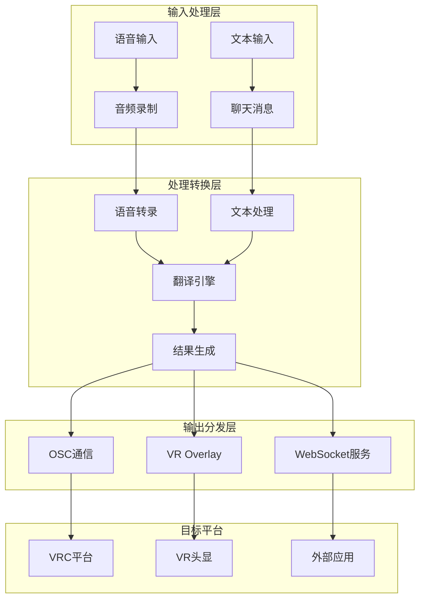
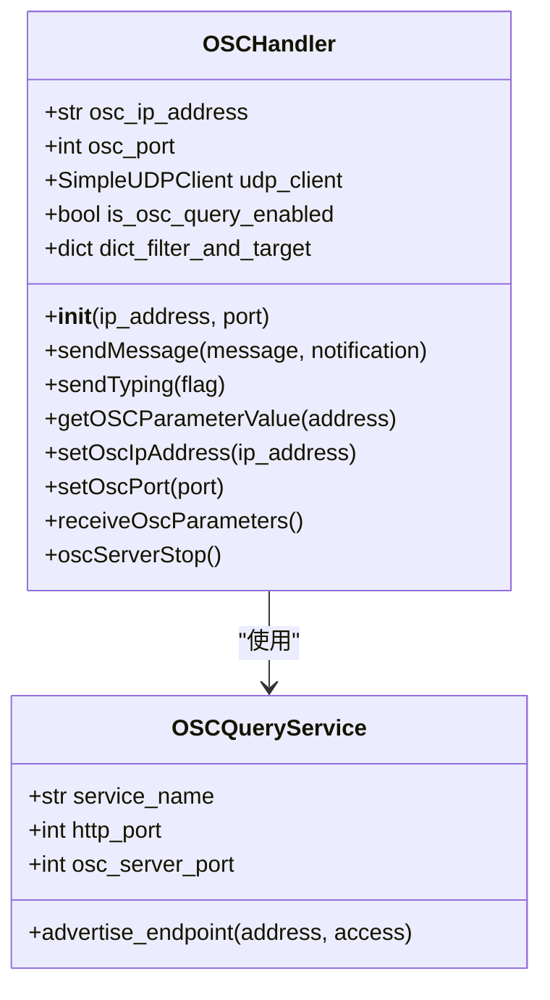
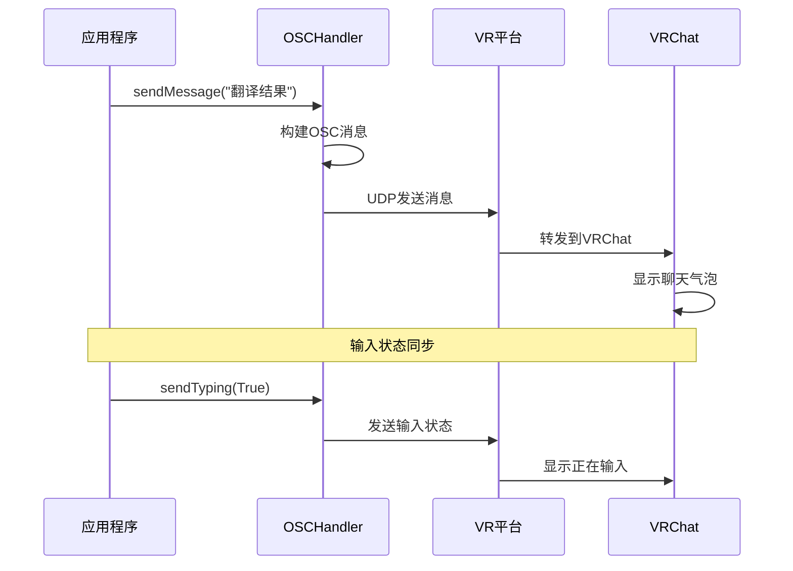
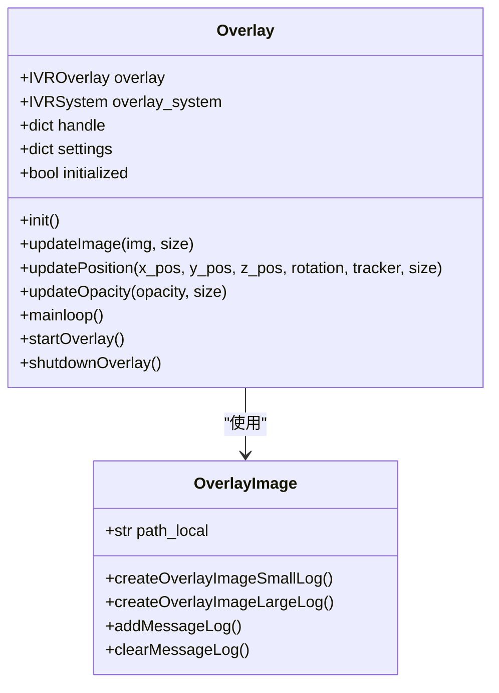
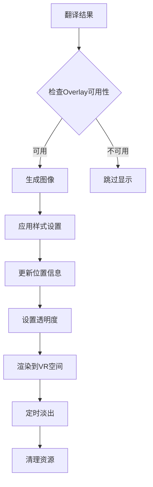
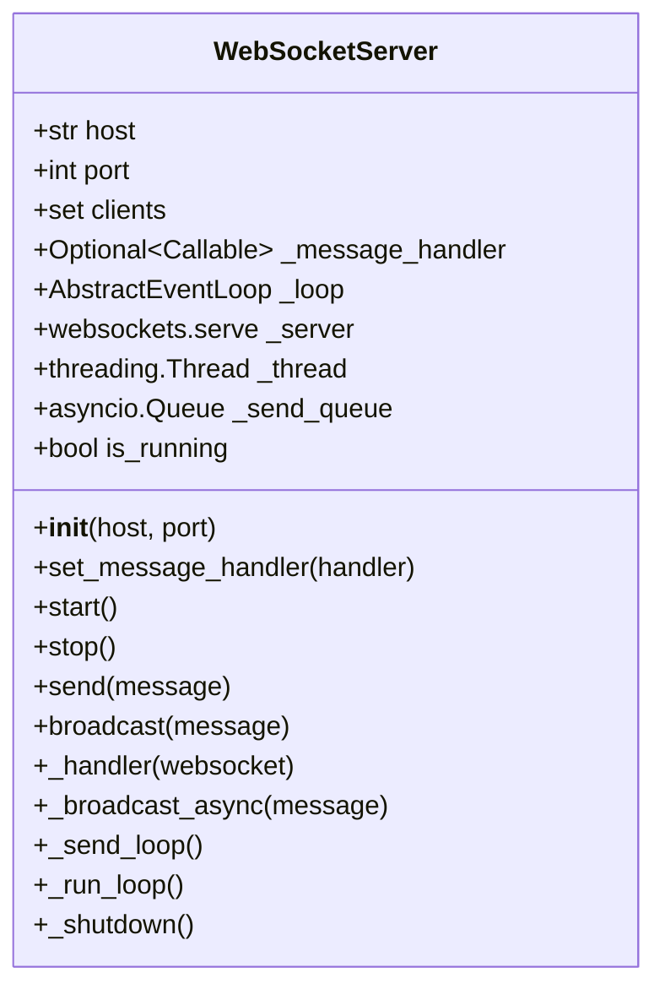
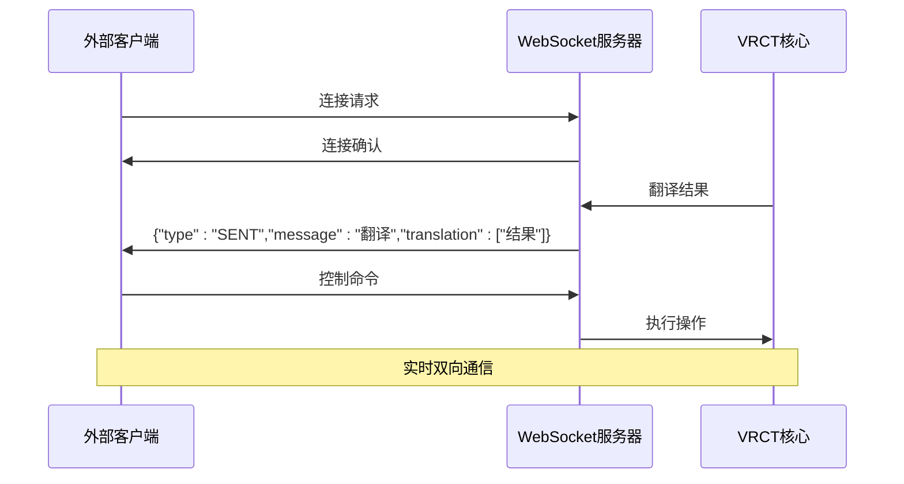
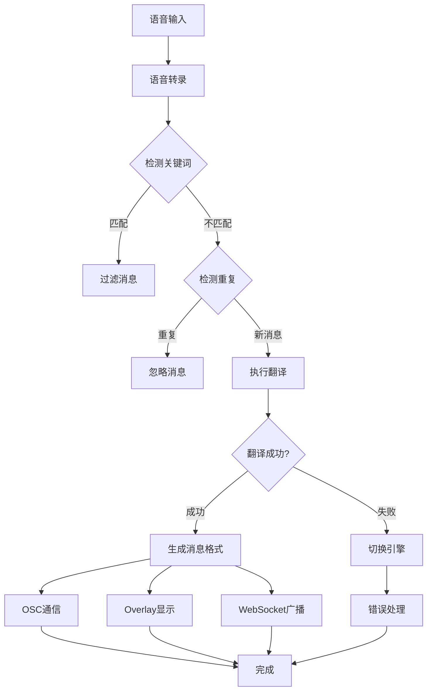
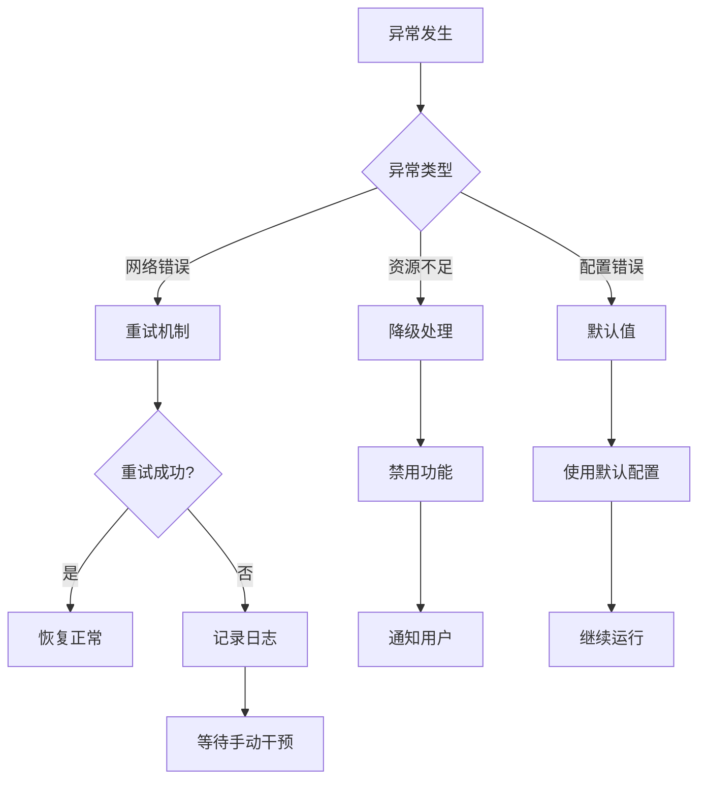

# 结果输出与投递

<cite>
**本文档中引用的文件**
- [osc.py](file://src-python/models/osc/osc.py)
- [overlay.py](file://src-python/models/overlay/overlay.py)
- [websocket_server.py](file://src-python/models/websocket/websocket_server.py)
- [controller.py](file://src-python/controller.py)
- [model.py](file://src-python/model.py)
- [config.py](file://src-python/config.py)
</cite>

## 目录
1. [简介](#简介)
2. [系统架构概览](#系统架构概览)
3. [OSC通信机制](#osc通信机制)
4. [VR Overlay显示系统](#vr-overlay显示系统)
5. [WebSocket服务架构](#websocket服务架构)
6. [消息路由与处理](#消息路由与处理)
7. [配置与应用实例](#配置与应用实例)
8. [性能优化与故障处理](#性能优化与故障处理)
9. [总结](#总结)

## 简介

VRCT（Virtual Reality Communication Tool）是一个专为虚拟现实环境设计的多通道结果输出系统。该系统通过三种主要输出方式——OSC通信、VR Overlay显示和WebSocket服务，实现了翻译结果在不同平台和设备间的实时传输与展示。

本文档详细阐述了VRCT的多通道输出机制，包括：
- **OSC通信**：通过python-osc库与VR平台（如VRC）进行实时数据交互
- **VR Overlay显示**：创建和管理透明叠加层显示翻译结果
- **WebSocket服务**：实现全双工通信支持外部客户端接入

## 系统架构概览

VRCT的输出系统采用模块化设计，各组件独立运行但协同工作：



**图表来源**
- [controller.py](file://src-python/controller.py#L254-L415)
- [model.py](file://src-python/model.py#L1121-L1187)

## OSC通信机制

### OSC处理器核心功能

OSC（Open Sound Control）通信是VRCT与VR平台交互的主要方式。系统通过`OSCHandler`类实现与VRChat等平台的实时数据交换。



**图表来源**
- [osc.py](file://src-python/models/osc/osc.py#L40-L241)

### OSC消息格式与地址路径

VRCT定义了标准的OSC地址路径用于不同类型的消息传输：

| 地址路径 | 功能描述 | 参数类型 |
|---------|----------|----------|
| `/chatbox/input` | 发送聊天消息 | `[message: str, clear: bool, notification: bool]` |
| `/chatbox/typing` | 发送输入状态 | `[typing: bool]` |
| `/avatar/parameters/MuteSelf` | 获取静音状态 | 无参数 |

### OSC通信流程



**图表来源**
- [osc.py](file://src-python/models/osc/osc.py#L88-L102)
- [controller.py](file://src-python/controller.py#L355-L356)

### OSC配置与连接管理

OSC系统支持动态IP地址和端口配置，具备自动重连和错误恢复机制：

**节来源**
- [osc.py](file://src-python/models/osc/osc.py#L72-L86)
- [model.py](file://src-python/model.py#L466-L472)

## VR Overlay显示系统

### Overlay架构设计

VRCT的Overlay系统基于OpenVR API构建，提供透明叠加层显示翻译结果的功能。



**图表来源**
- [overlay.py](file://src-python/models/overlay/overlay.py#L85-L388)

### Overlay尺寸与定位系统

系统支持多种尺寸的Overlay，每种都有独立的配置参数：

| 尺寸 | 默认缩放 | 位置偏移 | 跟踪器 |
|------|----------|----------|--------|
| small | 1.0 | HMD位置 | HMD |
| large | 0.25 | 手部位置 | LeftHand/RightHand |

### Overlay渲染流程



**图表来源**
- [overlay.py](file://src-python/models/overlay/overlay.py#L253-L267)
- [controller.py](file://src-python/controller.py#L374-L398)

### Overlay配置参数

每个Overlay实例都有一套完整的配置参数：

**节来源**
- [overlay.py](file://src-python/models/overlay/overlay.py#L184-L210)
- [config.py](file://src-python/config.py#L1-L200)

## WebSocket服务架构

### WebSocket服务器设计

WebSocket服务提供全双工通信能力，支持外部客户端实时接收翻译结果。



**图表来源**
- [websocket_server.py](file://src-python/models/websocket/websocket_server.py#L7-L222)

### WebSocket消息协议

系统定义了标准化的消息格式用于WebSocket通信：



**图表来源**
- [websocket_server.py](file://src-python/models/websocket/websocket_server.py#L38-L56)
- [model.py](file://src-python/model.py#L1187-L1195)

### WebSocket连接管理

WebSocket服务器采用异步架构，支持多客户端并发连接：

**节来源**
- [websocket_server.py](file://src-python/models/websocket/websocket_server.py#L103-L176)
- [model.py](file://src-python/model.py#L1121-L1187)

## 消息路由与处理

### micMessage方法处理流程

`micMessage`方法负责处理麦克风输入的语音消息，是系统的核心消息处理入口之一。



**图表来源**
- [controller.py](file://src-python/controller.py#L254-L415)

### speakerMessage方法处理流程

`speakerMessage`方法处理来自扬声器的语音消息，处理逻辑与micMessage类似但针对不同的输入源。

**节来源**
- [controller.py](file://src-python/controller.py#L415-L596)

### messageFormatter消息格式化

`messageFormatter`方法根据配置生成标准化的OSC消息格式：

**节来源**
- [controller.py](file://src-python/controller.py#L2487-L2509)

### 消息类型与路由逻辑

系统支持三种主要的消息类型及其对应的路由策略：

| 消息类型 | 路由目标 | 配置选项 |
|----------|----------|----------|
| SEND | 发送消息 | `SEND_MESSAGE_TO_VRC`, `SEND_ONLY_TRANSLATED_MESSAGES` |
| RECEIVED | 接收消息 | `SEND_RECEIVED_MESSAGE_TO_VRC`, `OVERLAY_SMALL_LOG` |
| CHAT | 聊天消息 | `OVERLAY_LARGE_LOG`, `WEBSOCKET_SERVER` |

**节来源**
- [controller.py](file://src-python/controller.py#L2487-L2509)
- [controller.py](file://src-python/controller.py#L597-L761)

## 配置与应用实例

### OSC地址路径配置

系统允许用户自定义OSC消息的地址路径和格式：

```yaml
# 示例配置片段
OSC_IP_ADDRESS: "127.0.0.1"
OSC_PORT: 9000
SEND_MESSAGE_TO_VRC: true
SEND_RECEIVED_MESSAGE_TO_VRC: true
SEND_ONLY_TRANSLATED_MESSAGES: false
NOTIFICATION_VRC_SFX: true
```

### WebSocket订阅主题

WebSocket客户端可以订阅以下主题：

| 主题 | 描述 | 数据格式 |
|------|------|----------|
| `SENT` | 发送的消息 | `{type: "SENT", message: "...", translation: [...]}` |
| `RECEIVED` | 接收的消息 | `{type: "RECEIVED", message: "...", translation: [...]}` |
| `CHAT` | 聊天消息 | `{type: "CHAT", message: "...", translation: [...]}` |

### 实际应用场景示例

#### 1. VRChat集成配置
```python
# OSC配置示例
osc_handler = OSCHandler(ip_address="127.0.0.1", port=9000)
osc_handler.sendMessage("Hello VRChat!", notification=True)
```

#### 2. WebSocket客户端连接
```javascript
// JavaScript WebSocket客户端示例
const ws = new WebSocket('ws://localhost:8765');
ws.onmessage = (event) => {
    const data = JSON.parse(event.data);
    console.log('收到消息:', data);
};
```

#### 3. Overlay显示配置
```python
# Overlay配置示例
overlay_settings = {
    "small": {
        "x_pos": 0.0,
        "y_pos": 0.0,
        "z_pos": 1.0,
        "display_duration": 5.0,
        "fadeout_duration": 2.0,
        "opacity": 0.8
    }
}
```

**节来源**
- [config.py](file://src-python/config.py#L1-L200)
- [osc.py](file://src-python/models/osc/osc.py#L48-L66)

## 性能优化与故障处理

### OSC通信优化

系统实现了多项性能优化措施：

1. **批量消息处理**：减少网络往返次数
2. **连接复用**：避免频繁建立TCP连接
3. **错误重试机制**：确保消息可靠传输
4. **资源池管理**：优化内存使用

### Overlay渲染优化

Overlay系统采用以下优化策略：

1. **帧率控制**：限制渲染频率避免过度消耗GPU
2. **条件更新**：仅在内容变化时更新图像
3. **内存管理**：及时释放不需要的资源
4. **多线程处理**：分离渲染和逻辑处理

### WebSocket性能优化

WebSocket服务实现了异步非阻塞架构：

1. **事件驱动模型**：使用asyncio处理并发连接
2. **消息队列**：缓冲待发送的消息
3. **连接池**：管理多个客户端连接
4. **心跳检测**：维护长连接的活跃状态

### 故障处理机制

系统具备完善的错误处理和恢复机制：



**节来源**
- [osc.py](file://src-python/models/osc/osc.py#L132-L144)
- [overlay.py](file://src-python/models/overlay/overlay.py#L137-L152)
- [websocket_server.py](file://src-python/models/websocket/websocket_server.py#L144-L160)

## 总结

VRCT的多通道结果输出系统通过OSC通信、VR Overlay显示和WebSocket服务三大核心组件，实现了翻译结果在虚拟现实环境中的多样化展示和传输。该系统具有以下特点：

### 技术优势
1. **模块化设计**：各输出组件独立开发，便于维护和扩展
2. **实时性**：采用异步架构确保低延迟的消息传递
3. **可靠性**：完善的错误处理和恢复机制
4. **可配置性**：丰富的配置选项满足不同使用场景

### 应用价值
1. **VRChat集成**：无缝对接主流VR社交平台
2. **多平台支持**：同时支持多种输出方式
3. **开发者友好**：提供标准化的API接口
4. **性能优化**：针对VR环境的专门优化

### 未来发展方向
1. **协议扩展**：支持更多VR平台和通信协议
2. **智能路由**：基于上下文的智能消息分发
3. **增强显示**：支持更丰富的视觉效果
4. **云端集成**：与云服务的深度整合

通过这三大输出方式的协同工作，VRCT为虚拟现实环境中的跨语言交流提供了完整的技术解决方案，显著提升了用户体验和沟通效率。