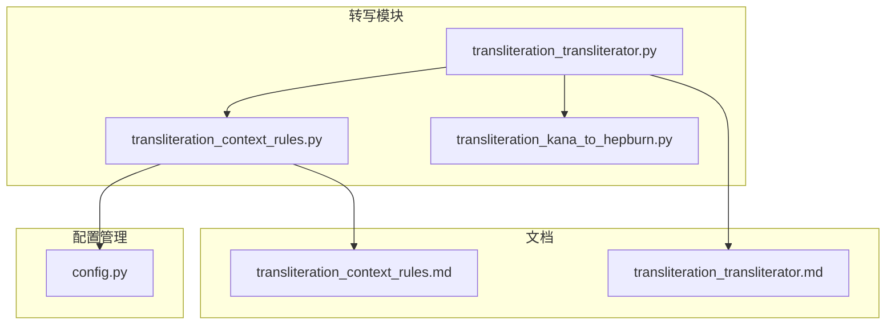
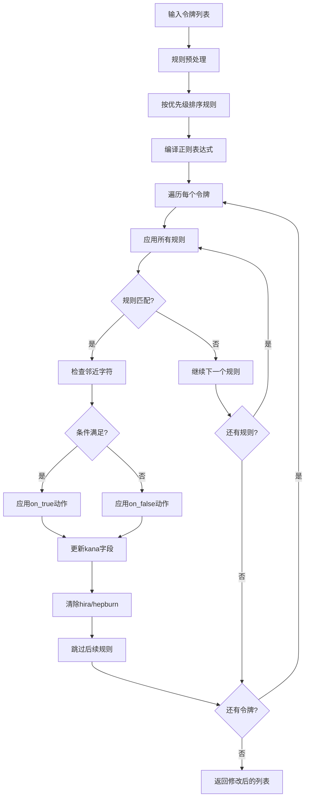
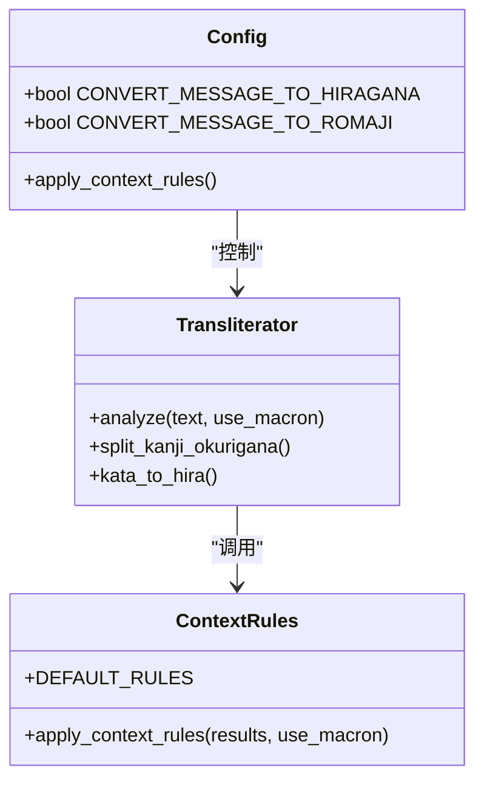
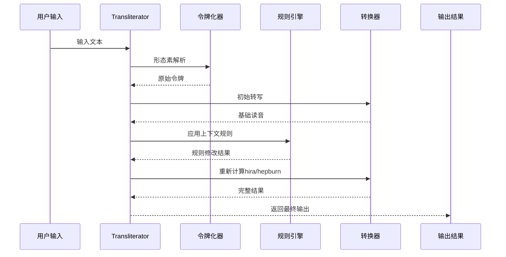
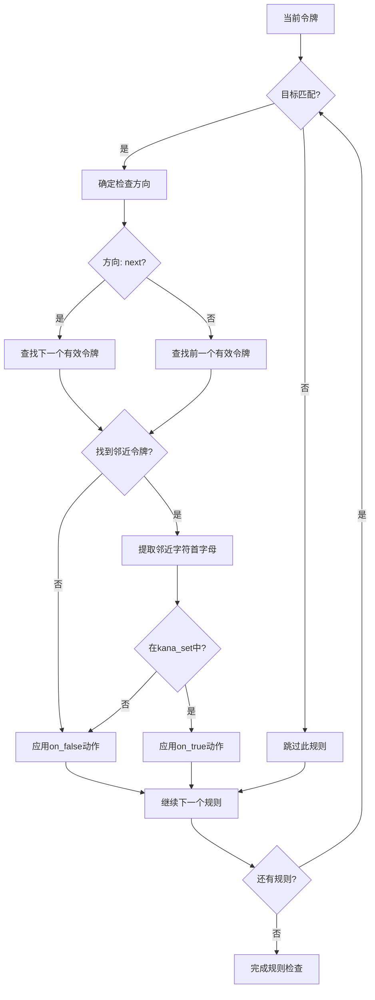
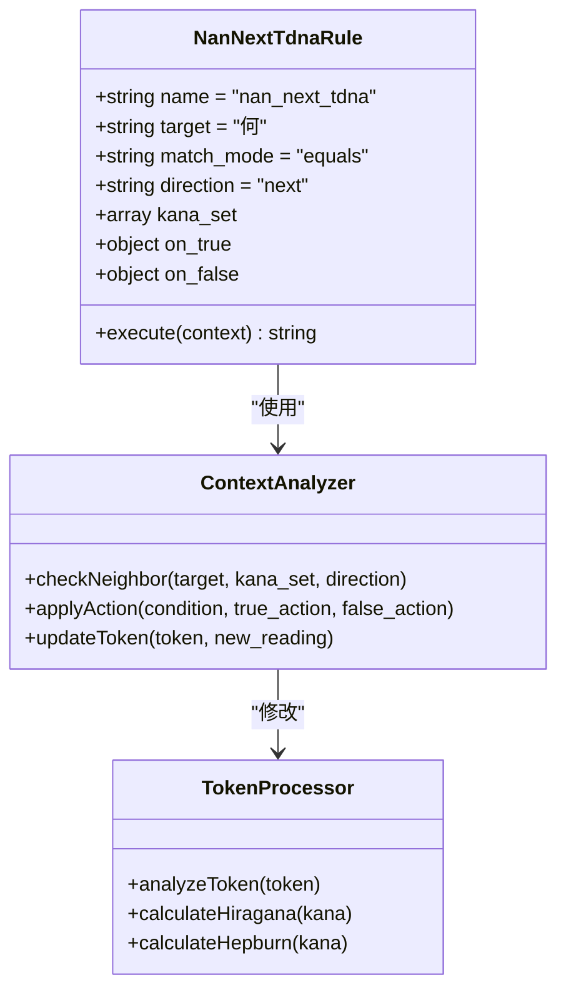
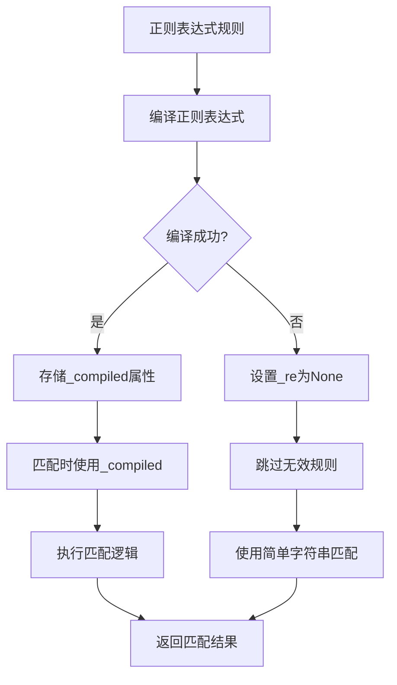
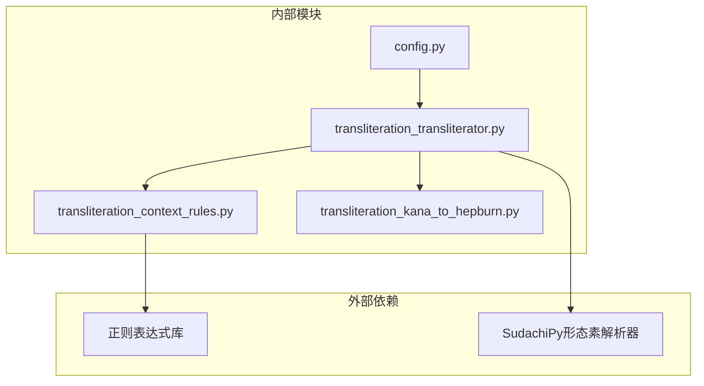
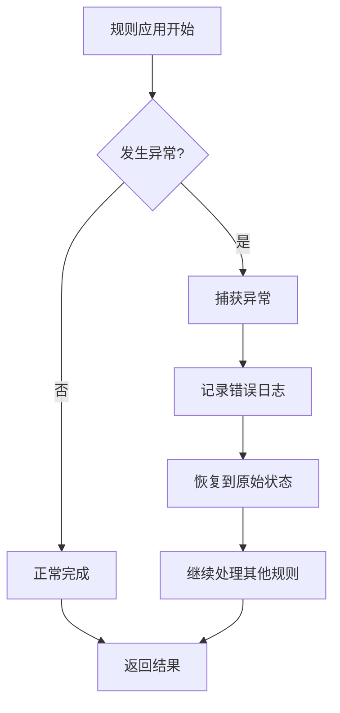

# 上下文规则处理

<cite>
**本文档中引用的文件**
- [transliteration_context_rules.py](file://src-python/models/transliteration/transliteration_context_rules.py)
- [config.py](file://src-python/config.py)
- [transliteration_transliterator.py](file://src-python/models/transliteration/transliteration_transliterator.py)
- [transliteration_kana_to_hepburn.py](file://src-python/models/transliteration/transliteration_kana_to_hepburn.py)
- [transliteration_context_rules.md](file://src-python/docs/details/transliteration_context_rules.md)
- [transliteration_transliterator.md](file://src-python/docs/details/transliteration_transliterator.md)
- [utils.py](file://src-python/utils.py)
</cite>

## 目录
1. [简介](#简介)
2. [项目结构](#项目结构)
3. [核心组件](#核心组件)
4. [架构概览](#架构概览)
5. [详细组件分析](#详细组件分析)
6. [依赖关系分析](#依赖关系分析)
7. [性能考虑](#性能考虑)
8. [故障排除指南](#故障排除指南)
9. [结论](#结论)

## 简介

VRCT项目的上下文敏感转换规则系统是一个精密的文法引擎，专门用于处理日语文本的音变规则。该系统通过分析相邻字符的关系，动态调整汉字的读音，实现更加自然和准确的日语转写效果。

### 核心功能特性

- **上下文感知**：基于邻近字符信息动态调整读音
- **优先级处理**：支持多层级规则优先级系统
- **灵活匹配**：支持精确匹配和正则表达式匹配
- **双向检查**：可选择向前或向后检查邻近字符
- **自动重计算**：规则修改后自动更新相关字段

## 项目结构



**图表来源**
- [transliteration_transliterator.py](file://src-python/models/transliteration/transliteration_transliterator.py#L1-L20)
- [transliteration_context_rules.py](file://src-python/models/transliteration/transliteration_context_rules.py#L1-L20)

**章节来源**
- [transliteration_transliterator.py](file://src-python/models/transliteration/transliteration_transliterator.py#L1-L50)
- [transliteration_context_rules.py](file://src-python/models/transliteration/transliteration_context_rules.py#L1-L50)

## 核心组件

### 规则引擎核心

规则引擎的核心是`apply_context_rules`函数，它实现了完整的规则匹配和应用逻辑：



**图表来源**
- [transliteration_context_rules.py](file://src-python/models/transliteration/transliteration_context_rules.py#L36-L135)

### 配置系统集成

系统通过配置文件控制规则的启用和禁用：



**图表来源**
- [config.py](file://src-python/config.py#L625-L626)
- [transliteration_transliterator.py](file://src-python/models/transliteration/transliteration_transliterator.py#L121-L190)

**章节来源**
- [config.py](file://src-python/config.py#L625-L626)
- [transliteration_transliterator.py](file://src-python/models/transliteration/transliteration_transliterator.py#L121-L190)

## 架构概览

### 转写处理流水线

系统的整体架构采用流水线模式，将复杂的转写任务分解为多个阶段：



**图表来源**
- [transliteration_transliterator.py](file://src-python/models/transliteration/transliteration_transliterator.py#L121-L190)

### 规则匹配机制

规则引擎采用双重检查机制确保准确性：



**图表来源**
- [transliteration_context_rules.py](file://src-python/models/transliteration/transliteration_context_rules.py#L72-L128)

**章节来源**
- [transliteration_transliterator.py](file://src-python/models/transliteration/transliteration_transliterator.py#L121-L190)
- [transliteration_context_rules.py](file://src-python/models/transliteration/transliteration_context_rules.py#L36-L135)

## 详细组件分析

### 规则定义结构

系统使用标准化的规则定义格式，支持多种匹配模式和动作类型：

| 字段名称 | 类型 | 描述 | 示例值 |
|---------|------|------|--------|
| name | string | 规则唯一标识符 | "nan_next_tdna" |
| target | string | 匹配的目标字符 | "何" |
| match_mode | string | 匹配模式 | "equals" 或 "regex" |
| direction | string | 检查方向 | "next" 或 "prev" |
| kana_set | array | 条件字符集合 | ["タ","チ","ツ"...] |
| priority | number | 规则优先级 | 0（默认） |
| on_true | object | 条件为真时的动作 | {"kana": "ナン"} |
| on_false | object | 条件为假时的动作 | {"kana": "ナニ"} |

### 连浊规则实现

以"何"字的连浊规则为例，展示了系统如何处理音变：



**图表来源**
- [transliteration_context_rules.py](file://src-python/models/transliteration/transliteration_context_rules.py#L22-L30)

### 正则表达式支持

系统支持正则表达式匹配，扩展了规则的灵活性：



**图表来源**
- [transliteration_context_rules.py](file://src-python/models/transliteration/transliteration_context_rules.py#L56-L60)

### 音变规则类型

系统支持多种类型的音变规则，包括但不限于：

#### 连浊规则（濁音化）
- **触发条件**：当前字符后跟随特定清音
- **变化规则**：清音变为对应的浊音
- **应用场景**："何"字在不同后缀下的读音变化

#### 半浊规则
- **触发条件**：特定的送假名组合
- **变化规则**：清音变为半浊音
- **应用场景**：商务用语中的特殊读音

#### 促音规则
- **触发条件**：连续的相同辅音
- **变化规则**：添加促音标记
- **应用场景**：外来语和拟声词

**章节来源**
- [transliteration_context_rules.py](file://src-python/models/transliteration/transliteration_context_rules.py#L1-L135)
- [transliteration_kana_to_hepburn.py](file://src-python/models/transliteration/transliteration_kana_to_hepburn.py#L90-L115)

## 依赖关系分析

### 模块间依赖关系



**图表来源**
- [config.py](file://src-python/config.py#L1-L20)
- [transliteration_transliterator.py](file://src-python/models/transliteration/transliteration_transliterator.py#L1-L15)

### 配置项映射

系统通过配置项控制规则的启用状态：

| 配置项 | 类型 | 默认值 | 功能描述 |
|--------|------|--------|----------|
| CONVERT_MESSAGE_TO_HIRAGANA | bool | False | 启用平假名转换 |
| CONVERT_MESSAGE_TO_ROMAJI | bool | False | 启用罗马字转换 |

**章节来源**
- [config.py](file://src-python/config.py#L625-L626)
- [transliteration_transliterator.py](file://src-python/models/transliteration/transliteration_transliterator.py#L320-L340)

## 性能考虑

### 规则匹配优化

系统采用了多项性能优化策略：

1. **优先级排序**：高优先级规则优先执行，减少不必要的检查
2. **早期退出**：规则匹配成功后立即应用动作并跳过后续规则
3. **缓存机制**：正则表达式编译结果缓存避免重复编译
4. **惰性计算**：仅在需要时才进行复杂的字符串操作

### 内存使用优化

- **就地修改**：直接修改输入列表，避免创建大量中间对象
- **字符串共享**：合理利用Python的字符串池机制
- **资源清理**：及时释放不再需要的正则表达式对象

### 并发安全性

系统通过以下方式确保并发安全：

- **锁机制**：SudachiPy形态素解析器使用线程锁防止并发访问
- **不可变数据**：规则定义使用不可变数据结构
- **异常隔离**：规则应用失败不影响整体流程

## 故障排除指南

### 常见问题诊断

#### 规则不生效

**症状**：预期的音变规则没有被应用

**可能原因**：
1. 规则优先级不足
2. 目标字符匹配失败
3. 邻近字符不在kana_set中
4. 配置项未正确启用

**解决方案**：
1. 检查规则的priority设置
2. 验证target字符的正确性
3. 确认kana_set包含正确的字符
4. 检查CONVERT_MESSAGE_TO_HIRAGANA配置

#### 性能问题

**症状**：转写处理速度缓慢

**诊断步骤**：
1. 检查规则数量和复杂度
2. 分析正则表达式的效率
3. 监控内存使用情况
4. 检查并发访问模式

**优化建议**：
1. 减少不必要的规则
2. 简化正则表达式
3. 实施规则缓存机制
4. 考虑异步处理

#### 错误处理

系统提供了完善的错误处理机制：



**图表来源**
- [transliteration_transliterator.py](file://src-python/models/transliteration/transliteration_transliterator.py#L177-L181)

### 调试工具和方法

#### 日志记录

系统使用结构化的日志记录：

```python
# 错误日志示例
error_logging()
# 进程日志示例
process_logger.info(response)
```

#### 性能监控

建议实施以下监控指标：

- 规则匹配时间
- 内存使用量
- 异常发生频率
- 规则命中率

**章节来源**
- [transliteration_transliterator.py](file://src-python/models/transliteration/transliteration_transliterator.py#L177-L181)
- [utils.py](file://src-python/utils.py#L244-L293)

## 结论

VRCT项目的上下文敏感转换规则系统是一个高度优化的文法引擎，通过精心设计的规则匹配机制和灵活的配置系统，实现了高质量的日语转写效果。

### 主要优势

1. **精确性**：基于上下文的智能音变处理
2. **灵活性**：支持多种匹配模式和自定义规则
3. **性能**：优化的算法和缓存机制
4. **可维护性**：清晰的代码结构和完善的错误处理

### 发展方向

1. **规则扩展**：增加更多音变规则类型
2. **性能优化**：进一步提升处理速度
3. **配置增强**：提供更直观的规则编辑界面
4. **测试覆盖**：完善自动化测试体系

该系统为日语文本处理提供了强大的基础，能够满足各种复杂的转写需求，是VRCT项目中不可或缺的核心组件。