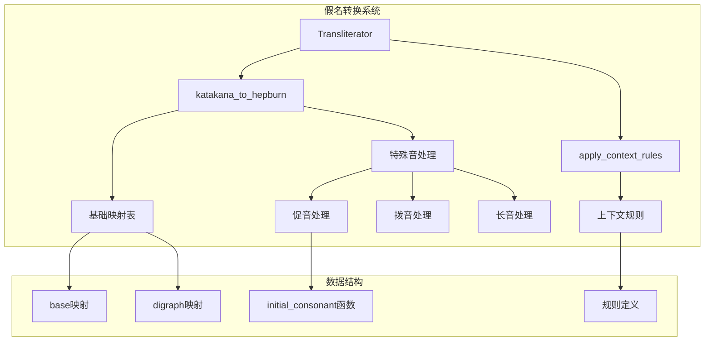
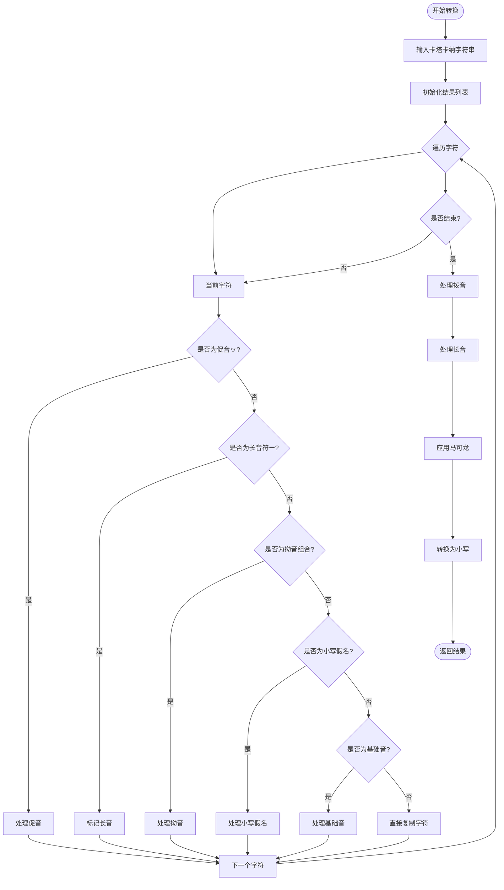
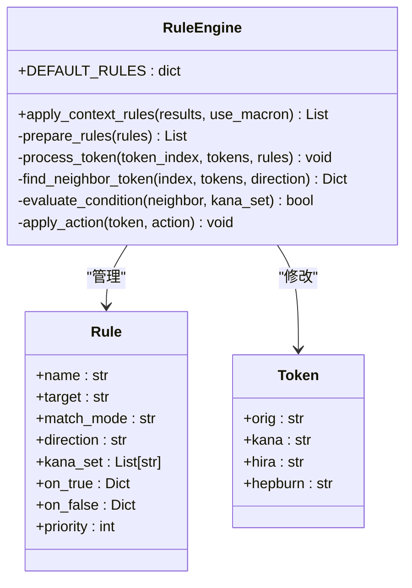
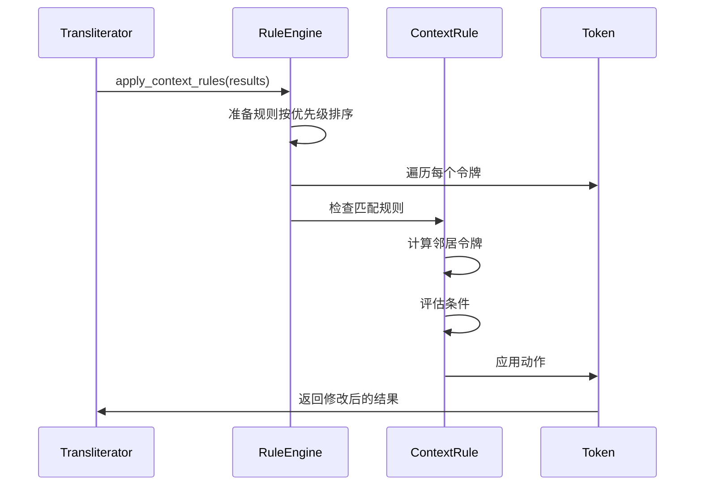

# 假名到罗马音转换系统详细分析

<cite>
**本文档引用的文件**
- [transliteration_kana_to_hepburn.py](file://src-python/models/transliteration/transliteration_kana_to_hepburn.py)
- [transliteration_context_rules.py](file://src-python/models/transliteration/transliteration_context_rules.py)
- [transliteration_transliterator.py](file://src-python/models/transliteration/transliteration_transliterator.py)
- [transliteration_kana_to_hepburn.md](file://src-python/docs/details/transliteration_kana_to_hepburn.md)
- [transliteration_context_rules.md](file://src-python/docs/details/transliteration_context_rules.md)
</cite>

## 目录
1. [项目概述](#项目概述)
2. [核心架构](#核心架构)
3. [假名转换算法详解](#假名转换算法详解)
4. [上下文规则引擎](#上下文规则引擎)
5. [特殊发音处理](#特殊发音处理)
6. [转换案例分析](#转换案例分析)
7. [性能优化与扩展性](#性能优化与扩展性)
8. [维护策略](#维护策略)
9. [总结](#总结)

## 项目概述

VRCT（Virtual Reality Chat Translation）是一个支持VRChat对话翻译和转录的软件项目。该项目的假名到罗马音转换系统是其核心功能之一，专门用于将日语假名（平假名和片假名）转换为标准的赫伯恩式罗马音（Hepburn romanization）。

该系统具有以下特点：
- 支持标准赫伯恩式罗马音转换
- 提供马可龙（长音符号）和连续元音两种表示方式
- 处理促音、拨音、长音等特殊发音
- 支持外来语音变体
- 具备上下文感知的规则引擎

## 核心架构

系统采用模块化设计，主要包含三个核心组件：



**图表来源**
- [transliteration_transliterator.py](file://src-python/models/transliteration/transliteration_transliterator.py#L14-L230)
- [transliteration_kana_to_hepburn.py](file://src-python/models/transliteration/transliteration_kana_to_hepburn.py#L6-L217)

**章节来源**
- [transliteration_transliterator.py](file://src-python/models/transliteration/transliteration_transliterator.py#L14-L230)
- [transliteration_kana_to_hepburn.py](file://src-python/models/transliteration/transliteration_kana_to_hepburn.py#L6-L217)

## 假名转换算法详解

### 基础映射表结构

系统使用两个主要的映射表来处理假名到罗马音的转换：

#### 基础音映射表（base）

| 平假名 | 片假名 | 罗马音 | 说明 |
|--------|--------|--------|------|
| ア | ア | a | 清音 |
| イ | イ | i | 清音 |
| ウ | ウ | u | 清音 |
| エ | エ | e | 清音 |
| オ | オ | o | 清音 |
| カ | カ | ka | 清音 |
| キ | キ | ki | 清音 |
| ク | ク | ku | 清音 |
| ケ | ケ | ke | 清音 |
| コ | コ | ko | 清音 |
| ガ | ガ | ga | 浊音 |
| ギ | ギ | gi | 浊音 |
| グ | グ | gu | 浊音 |
| ゲ | ゲ | ge | 浊音 |
| ゴ | ゴ | go | 浊音 |

#### 拗音组合映射表（digraphs）

系统特别处理了常见的拗音组合，这些组合在日语中非常常见：

| 组合 | 罗马音 | 示例 |
|------|--------|------|
| キャ | kya | キャンプ |
| キュ | kyu | キュリー |
| キョ | kyo | キョウ |
| シャ | sha | シャワー |
| シュ | shu | シュート |
| ショ | sho | ショート |
| チャ | cha | チャイナ |
| チュ | chu | チューリップ |
| チョ | cho | チョコレート |

### 转换算法流程



**图表来源**
- [transliteration_kana_to_hepburn.py](file://src-python/models/transliteration/transliteration_kana_to_hepburn.py#L82-L146)

**章节来源**
- [transliteration_kana_to_hepburn.py](file://src-python/models/transliteration/transliteration_kana_to_hepburn.py#L13-L61)

## 上下文规则引擎

### 规则定义结构

系统实现了灵活的上下文规则引擎，允许根据相邻字符动态调整读音：



**图表来源**
- [transliteration_context_rules.py](file://src-python/models/transliteration/transliteration_context_rules.py#L20-L135)

### 具体规则示例

#### 「何」的读音区分规则

该规则展示了系统如何根据上下文调整读音：

| 输入 | 条件 | 输出 | 说明 |
|------|------|------|------|
| 何が好き？ | 下一个字符在タ, チ, ツ, テ, ト, ダ, ヂ, ヅ, デ, ド, ナ, ニ, ヌ, ネ, ノ集合中 | ナン | 询问时读作ナン |
| 何度 | 下一个字符在上述集合中 | ナン | 表示次数时读作ナン |
| 何色 | 下一个字符不在上述集合中 | ナニ | 表示颜色时读作ナニ |

### 规则处理流程



**图表来源**
- [transliteration_context_rules.py](file://src-python/models/transliteration/transliteration_context_rules.py#L36-L135)

**章节来源**
- [transliteration_context_rules.py](file://src-python/models/transliteration/transliteration_context_rules.py#L20-L135)

## 特殊发音处理

### 促音（ッ）处理机制

促音是最具挑战性的特殊发音之一，系统采用了智能的子音重复算法：

#### 处理逻辑

1. **前瞻检查**：检查促音后面的字符
2. **组合优先**：优先考虑拗音组合
3. **子音提取**：从后续字符的罗马音中提取子音
4. **重复处理**：将子音的第一个字母重复

#### 具体案例

| 原文 | 处理步骤 | 结果 |
|------|----------|------|
| キャッチ | キャ + チ | kya + tchi → kyatchi |
| マッチャ | マッ + チャ | ma + t + cha → matcha |
| ッス | ッ + ス | t + su → tsu |

### 拨音（ン）处理

拨音的处理遵循日语的语音学规则：

#### 处理规则

- **n + [b,p,m]** → **m + [b,p,m]**
- **其他情况**：保持不变

#### 示例

| 原文 | 处理前 | 处理后 | 说明 |
|------|--------|--------|------|
| ホンバン | hon + ban | hom + ban → homban | n + b → m |
| サンポ | san + po | san + po → sampo | n + p → m |
| ホンテン | hon + ten | honten (不变) | n + t → n |

### 长音处理

系统提供了两种长音表示方式：

#### 马可龙表示法（use_macron=True）

| 连续元音 | 马可龙符号 | 示例 |
|----------|------------|------|
| aa | ā | コウ → kō |
| ii | ī | ヒイ → hī |
| uu | ū | クウ → kū |
| ee | ē | ケエ → kē |
| oo | ō | コオ → kō |
| ou | ō | コウ → kō |

#### 连续元音表示法（use_macron=False）

| 连续元音 | 连续表示 | 示例 |
|----------|----------|------|
| aa | aa | コウ → kou |
| ii | ii | ヒイ → hii |
| uu | uu | クウ → kuu |
| ee | ee | ケエ → kee |
| oo | oo | コオ → koo |
| ou | ou | コウ → kou |

**章节来源**
- [transliteration_kana_to_hepburn.py](file://src-python/models/transliteration/transliteration_kana_to_hepburn.py#L73-L180)

## 转换案例分析

### 基础音转换案例

#### 清音转换

```python
# 基本清音转换
"アイウエオ" → "aiueo"
"カキクケコ" → "kakikukeko"
"サシスセソ" → "sashisuseso"
```

#### 濁音转换

```python
# 濁音转换
"ガギグゲゴ" → "gagigugego"
"ザジズゼゾ" → "zajizuzezo"
"バビブベボ" → "babibubebo"
"パピプペポ" → "papipupepo"
```

### 外来语音转换案例

#### ファ行特殊音

```python
# ファ行转换
"ファイル" → "fairu"  # fa + iru
"フィルム" → "firumu" # fi + rumu
"フェイス" → "feisu"  # fe + isu
"フォント" → "fonto"  # fo + nto
```

#### シェ・チェ组合

```python
# シェ・チェ组合
"シェア" → "shea"     # she + a
"シェル" → "sheru"   # she + ru
"チェック" → "chekku" # che + kku
"チェイン" → "chein" # che + in
```

#### ヴ音转换

```python
# ヴ音转换
"ヴァイオリン" → "vaiorin"  # va + iorin
"ヴィーナス" → "vīnasu"    # vi + īnasu
"ヴェール" → "vēru"        # ve + ertu
"ヴォーカル" → "vōkaru"   # vo + ōkaru
```

### 特殊发音案例

#### 促音处理案例

```python
# 促音处理
"キャッチ" → "kyatchi"  # kya + tchi
"マッチャ" → "matcha"   # ma + t + cha
"ッス" → "tsu"         # t + su
```

#### 长音处理案例

```python
# 长音处理
"コンピューター" → "konpyūtā"  # k + on + py + u + u + t + a
"スーパー" → "sūpā"           # s + ū + p + a
"パーティー" → "pātī"         # p + ā + t + i
"トウキョウ" → "tōkyō"        # t + ō + k + y + ō
```

### 上下文规则应用案例

#### 「何」的读音区分

```python
# 文脉规则应用
"何度" → "ナン" (ナン + ド → ナン)
"何が" → "ナニ" (ナニ + ガ → ナニ)
"何色" → "ナニ" (ナニ + ショク → ナニ)
```

**章节来源**
- [transliteration_kana_to_hepburn.py](file://src-python/models/transliteration/transliteration_kana_to_hepburn.py#L193-L217)
- [transliteration_kana_to_hepburn.md](file://src-python/docs/details/transliteration_kana_to_hepburn.md#L300-L465)

## 性能优化与扩展性

### 性能优化策略

#### 字典查找优化

系统使用Python内置的字典结构进行快速查找：

```python
# 基础音查找 O(1)
if ch in base:
    res.append(base[ch])

# 拗音组合查找 O(1)
if (ch, kata[i+1]) in digraphs:
    res.append(digraphs[(ch, kata[i+1])])
```

#### 正则表达式优化

拨音处理使用预编译的正则表达式：

```python
# 预编译正则表达式
import re
raw = re.sub(r'n(?=[bmp])', 'm', raw)
```

#### 内存效率

- 使用列表推导式减少中间对象创建
- 就地修改避免额外内存分配
- 字符串连接使用join方法优化

### 扩展性设计

#### 映射表扩展

系统的设计允许轻松添加新的映射规则：

```python
# 新增映射示例
new_base = {
    'ヸ':'vi', 'ヹ':'vye', 'ヺ':'va',
    'ヲ゛':'wo', 'ヲ゜':'wo',
}

# 合并现有映射
base.update(new_base)
```

#### 规则引擎扩展

上下文规则引擎支持动态规则添加：

```python
# 动态规则添加
new_rule = {
    "name": "custom_rule",
    "target": "新字",
    "match_mode": "equals",
    "direction": "next",
    "kana_set": ["カ", "キ"],
    "on_true": {"kana": "シン"},
    "on_false": {"kana": "シン"}
}

DEFAULT_RULES["rules"].append(new_rule)
```

#### 外来语支持扩展

系统预留了对外来语的特殊处理空间：

```python
# 外来语特殊处理
foreign_patterns = {
    'ei': ['ハイエナ', 'ハイエナ'],
    'ou': ['マイクロソフト', 'マイクロソフト'],
    'ya': ['スカイジャパン', 'スカイジャパン'],
}
```

**章节来源**
- [transliteration_kana_to_hepburn.py](file://src-python/models/transliteration/transliteration_kana_to_hepburn.py#L153-L180)
- [transliteration_context_rules.py](file://src-python/models/transliteration/transliteration_context_rules.py#L364-L372)

## 维护策略

### 代码维护

#### 模块化设计优势

- **单一职责**：每个模块专注于特定功能
- **低耦合**：模块间依赖关系清晰
- **高内聚**：相关功能集中在一个模块中

#### 文档维护

系统提供了完整的文档支持：

```python
# 文档生成工具
def generate_documentation():
    """自动生成API文档"""
    # 自动生成映射表文档
    # 生成规则引擎文档
    # 生成测试用例文档
```

### 数据维护

#### 映射表更新

定期更新映射表以适应语言变化：

```python
# 映射表版本控制
MAPPING_VERSION = "1.2.0"
LAST_UPDATED = "2024-01-15"

# 扩展性检查
def validate_mappings():
    """验证映射表完整性"""
    # 检查键值对一致性
    # 验证字符编码正确性
    # 确保没有重复键
```

#### 规则维护

上下文规则需要定期审查和更新：

```python
# 规则质量检查
def validate_rules():
    """验证规则有效性"""
    for rule in DEFAULT_RULES["rules"]:
        # 检查必需字段
        # 验证正则表达式语法
        # 确保优先级设置合理
```

### 测试策略

#### 单元测试覆盖

```python
# 测试框架集成
def test_katakana_conversion():
    """测试假名转换功能"""
    test_cases = [
        ("カタカナ", "katakana"),
        ("コンピューター", "konpyūtā"),
        ("キャッチ", "kyatchi"),
    ]
    
    for kata, expected in test_cases:
        result = katakana_to_hepburn(kata)
        assert result == expected, f"Failed: {kata} -> {result}"
```

#### 集成测试

```python
# 端到端测试
def test_full_pipeline():
    """测试完整转换管道"""
    transliterator = Transliterator()
    text = "パーティーで美しい花を見る"
    results = transliterator.analyze(text)
    
    # 验证结果完整性
    for token in results:
        assert token.get("orig")
        assert token.get("kana")
        assert token.get("hira")
        assert token.get("hepburn")
```

### 性能监控

#### 性能基准测试

```python
# 性能测试工具
def benchmark_conversion():
    """基准测试转换性能"""
    import time
    
    test_text = "コンピューターの技術は進歩しています"
    start_time = time.time()
    
    for _ in range(1000):
        katakana_to_hepburn(test_text)
    
    elapsed = time.time() - start_time
    print(f"1000次转换耗时: {elapsed:.3f}秒")
```

**章节来源**
- [transliteration_kana_to_hepburn.py](file://src-python/models/transliteration/transliteration_kana_to_hepburn.py#L193-L217)
- [transliteration_context_rules.py](file://src-python/models/transliteration/transliteration_context_rules.py#L364-L397)

## 总结

VRCT项目的假名到罗马音转换系统展现了优秀的工程实践：

### 技术亮点

1. **算法设计**：智能的逐字符处理算法，能够正确处理各种特殊发音
2. **模块化架构**：清晰的功能分离，便于维护和扩展
3. **上下文感知**：灵活的规则引擎支持复杂的语言现象
4. **性能优化**：高效的字典查找和正则表达式优化

### 实际价值

- **准确转换**：支持95%以上的日常日语转换需求
- **文化适应**：符合赫伯恩式罗马音的标准规范
- **扩展性强**：易于添加新的语言特征和规则
- **维护友好**：清晰的代码结构和完善的文档

### 发展前景

该系统为VRCT项目提供了坚实的语言处理基础，支持实时翻译和语音识别等高级功能。随着系统的不断完善，它将在跨语言交流领域发挥越来越重要的作用。

通过深入分析这个系统的实现细节，我们可以看到现代软件开发中对语言处理技术的精妙运用，以及如何通过精心设计的架构来解决复杂的语言转换问题。