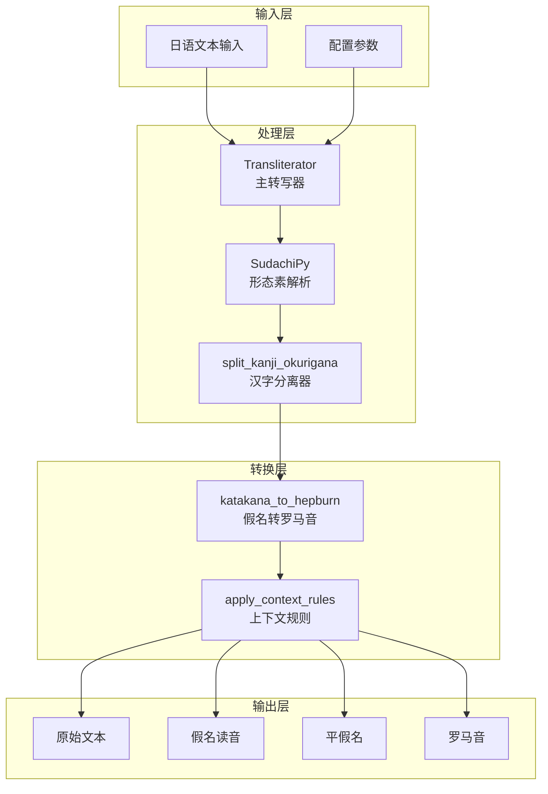
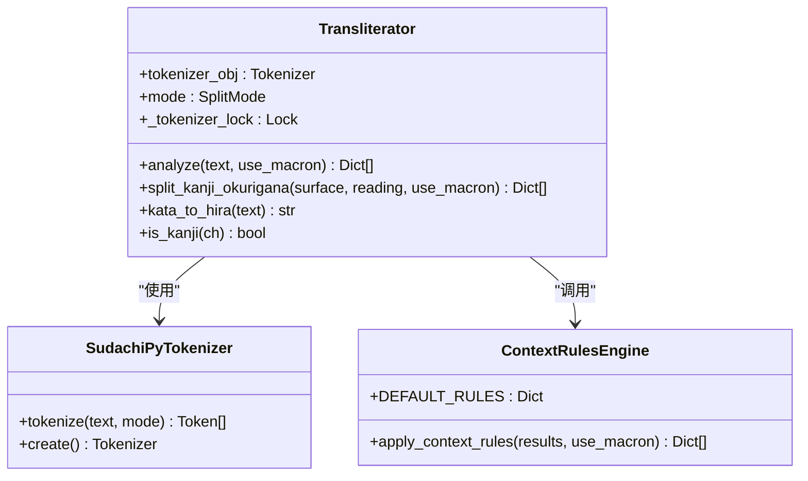
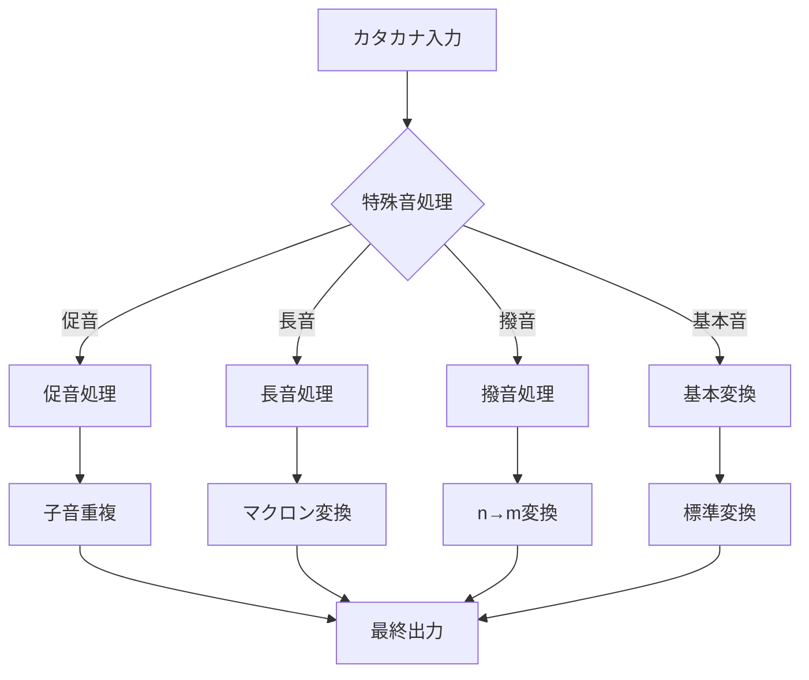
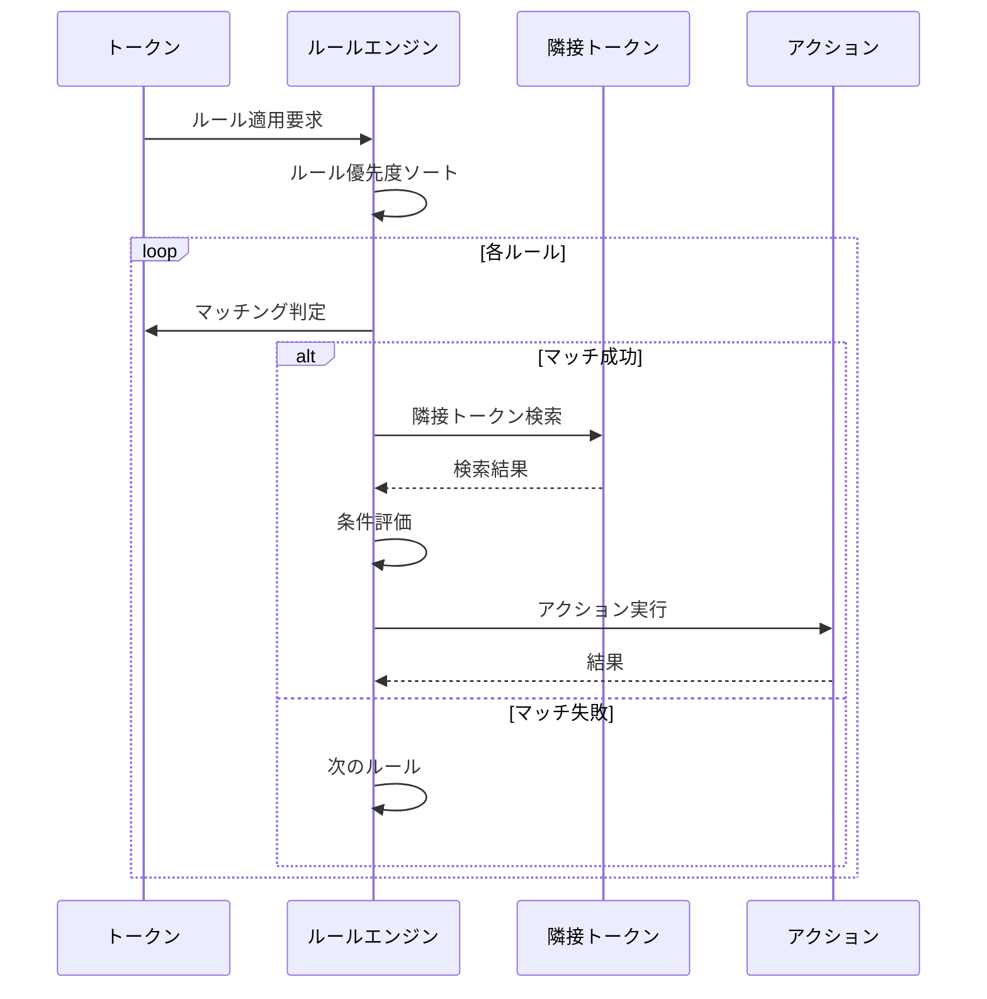
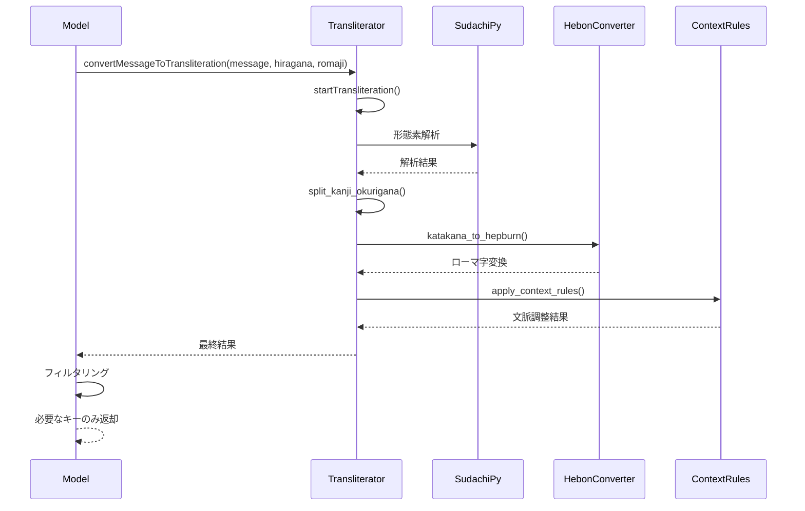

# 语音转写与罗马音转换

<cite>
**本文档中引用的文件**
- [transliteration_transliterator.py](file://src-python/models/transliteration/transliteration_transliterator.py)
- [transliteration_kana_to_hepburn.py](file://src-python/models/transliteration/transliteration_kana_to_hepburn.py)
- [transliteration_context_rules.py](file://src-python/models/transliteration/transliteration_context_rules.py)
- [model.py](file://src-python/model.py)
- [config.py](file://src-python/config.py)
- [transliteration_transliterator.md](file://src-python/docs/details/transliteration_transliterator.md)
- [transliteration_kana_to_hepburn.md](file://src-python/docs/details/transliteration_kana_to_hepburn.md)
- [transliteration_context_rules.md](file://src-python/docs/details/transliteration_context_rules.md)
</cite>

## 目录
1. [概述](#概述)
2. [系统架构](#系统架构)
3. [核心组件详解](#核心组件详解)
4. [转写流程协调](#转写流程协调)
5. [配置与启用](#配置与启用)
6. [实际转换示例](#实际转换示例)
7. [性能优化建议](#性能优化建议)
8. [故障排除指南](#故障排除指南)
9. [总结](#总结)

## 概述

VRCT的日语音写转写功能是一个高度集成的系统，专门用于将日语文本转换为罗马音表示。该系统通过三个核心模块的协同工作，实现了从假名到罗马音的精确转换，并支持复杂的上下文规则处理。

### 主要特性

- **多层转换处理**：从形态素解析到最终罗马音输出的完整管道
- **上下文感知**：基于邻近词汇的智能读音调整
- **高性能并发**：线程安全的并行处理能力
- **灵活配置**：支持多种输出格式和转换选项

## 系统架构



**图表来源**
- [transliteration_transliterator.py](file://src-python/models/transliteration/transliteration_transliterator.py#L14-L230)
- [transliteration_kana_to_hepburn.py](file://src-python/models/transliteration/transliteration_kana_to_hepburn.py#L6-L217)
- [transliteration_context_rules.py](file://src-python/models/transliteration/transliteration_context_rules.py#L36-L135)

## 核心组件详解

### Transliterator 主转写器

Transliterator类是整个转写系统的核心控制器，负责协调各个处理模块的工作。

#### 主要功能



**图表来源**
- [transliteration_transliterator.py](file://src-python/models/transliteration/transliteration_transliterator.py#L14-L230)

#### 关键算法

**汉字·送り仮名分离算法**

该算法是系统的核心技术之一，能够智能地将混合了汉字和假名的词语分解为独立的音节单元：

1. **文本块识别**：根据字符类型（汉字/假名）进行连续块分割
2. **长度分配**：基于块大小进行初始分配
3. **余量调整**：优先分配给汉字块，确保重要词汇的准确性
4. **边界处理**：处理读音不足或过长的情况

**并行处理机制**

系统采用锁机制确保SudachiPy的线程安全性：

- 使用`threading.Lock()`保护tokenizer访问
- 支持多线程环境下的稳定运行
- 避免"Already borrowed"错误

**段落来源**
- [transliteration_transliterator.py](file://src-python/models/transliteration/transliteration_transliterator.py#L33-L188)

### 假名到罗马音转换器

katakana_to_hepburn函数提供了标准的ヘボン式罗马字转换功能。

#### 转换规则体系



**图表来源**
- [transliteration_kana_to_hepburn.py](file://src-python/models/transliteration/transliteration_kana_to_hepburn.py#L82-L190)

#### 特殊音处理

**促音（ッ）処理**
- 识别促音位置
- 获取后续音节的子音部分
- 实现正确的子音重复（如"マッチャ"→"matcha"）

**長音処理**
- 支持マクロン（ā ī ū ē ō）和連続母音两种模式
- 自动识别長音符（ー）位置
- 智能处理"ou"→"ō"的特殊情况

**撥音処理**
- n + [bmp] → m + [bmp] 的转换规则
- 保留n→n的原始发音
- 处理复杂的音韵变化

**段落来源**
- [transliteration_kana_to_hepburn.py](file://src-python/models/transliteration/transliteration_kana_to_hepburn.py#L82-L190)

### 上下文规则引擎

context_rules模块实现了基于邻近词汇的智能读音调整。

#### 规则匹配机制



**图表来源**
- [transliteration_context_rules.py](file://src-python/models/transliteration/transliteration_context_rules.py#L62-L135)

#### 文脈ルール例

**「何」の読み分けルール**

这是系统中最典型的上下文规则应用：

- **条件**：目标字符"何"，检查下一个字符
- **规则**：如果后继字符属于"タチツテトダヂヅデドナニヌネノ"集合，则读作"ナン"
- **效果**：区分"何度"（ナン）和"何が"（ナニ）

**段落来源**
- [transliteration_context_rules.py](file://src-python/models/transliteration/transliteration_context_rules.py#L22-L30)

## 转写流程协调

### convertMessageToTransliteration 方法集成

model.py中的convertMessageToTransliteration方法将转写功能无缝集成到主翻译流程中。



**图表来源**
- [model.py](file://src-python/model.py#L445-L464)
- [transliteration_transliterator.py](file://src-python/models/transliteration/transliteration_transliterator.py#L121-L190)

### 流程控制机制

**初始化管理**
- 按需启动Transliterator实例
- 避免不必要的资源消耗
- 支持动态启停

**结果过滤**
- 根据配置参数选择输出字段
- 减少数据传输量
- 提高处理效率

**段落来源**
- [model.py](file://src-python/model.py#L435-L464)

## 配置与启用

### 配置参数详解

通过config.py中的配置项可以灵活控制转写行为：

| 配置项 | 类型 | 默认值 | 说明 |
|--------|------|--------|------|
| `CONVERT_MESSAGE_TO_HIRAGANA` | bool | False | 是否启用平假名转换 |
| `CONVERT_MESSAGE_TO_ROMAJI` | bool | False | 是否启用罗马音转换 |

### 启用步骤

1. **基础配置**：在config.py中设置相应的布尔值
2. **依赖检查**：确保SudachiPy和相关词典已正确安装
3. **权限设置**：验证必要的文件访问权限
4. **测试验证**：运行转换测试确认功能正常

**段落来源**
- [config.py](file://src-python/config.py#L625-L626)
- [model.py](file://src-python/model.py#L435-L444)

## 实际转换示例

### 基础转换示例

**简单句子转换**
```
输入：向こうへ行く
输出：
- 向こう: ムコウ -> むこう -> mukou
- へ: ヘ -> へ -> he
- 行く: イク -> いく -> iku
```

**长音处理示例**
```
输入：東京に行く
输出（マクロン使用）：tōkyō ni iku
输出（連続母音）：toukyou ni iku
```

**外来語转换**
```
输入：コンピューター
输出：konpyūtā (マクロン) / konpyuutaa (連続母音)
```

### 上下文规则效果

**「何」の読み分け**
```
入力：何度でも挑戦する
输出：
- 何: ナン -> nan
- 度: ド -> do
- も: モ -> mo
```

**促音処理**
```
入力：キャッチ
输出：kyatchi
```

**撥音処理**
```
入力：ホンバン
输出：homban
```

**段落来源**
- [transliteration_transliterator.md](file://src-python/docs/details/transliteration_transliterator.md#L120-L231)
- [transliteration_kana_to_hepburn.md](file://src-python/docs/details/transliteration_kana_to_hepburn.md#L41-L383)

## 性能优化建议

### 并发处理优化

**线程池配置**
```python
# 推荐的并发处理配置
import concurrent.futures

def process_texts_concurrently(texts, max_workers=4):
    transliterator = Transliterator()
    
    def process_single(text):
        return transliterator.analyze(text)
    
    with concurrent.futures.ThreadPoolExecutor(
        max_workers=max_workers
    ) as executor:
        results = list(executor.map(process_single, texts))
    
    return results
```

### 内存管理优化

**批量处理策略**
- 控制单次处理的文本数量
- 及时释放不需要的中间结果
- 使用生成器减少内存占用

**缓存机制**
- 缓存常用的转换结果
- 避免重复的形態素解析
- 实现智能的缓存清理策略

### 性能监控指标

| 指标 | 目標値 | 監視方法 |
|------|--------|----------|
| 単文書処理時間 | < 100ms | プロファイリング |
| メモリ使用量 | < 50MB | リソース監視 |
| 并行処理効率 | > 80% | スレッド統計 |
| エラー率 | < 1% | エラーログ分析 |

## 故障排除指南

### 常见问题及解决方案

**SudachiPy関連エラー**
```
RuntimeError: Already borrowed
```
- **原因**：并发アクセスによるロック競合
- **解決策**：使用内部锁机制，避免同时调用

**形態素解析失敗**
```
辞書ファイルが見つからない
```
- **原因**：SudachiPy辞書がインストールされていない
- **解決策**：自動ダウンロード機能を有効化

**转换精度問題**
```
未知語の読みが不正確
```
- **原因**：固有名詞や専門用語の辞書不足
- **解決策**：カスタム辞書の追加

### 调试技巧

**详细日志记录**
```python
import logging
logging.basicConfig(level=logging.DEBUG)

# 各モジュールの詳細ログを有効化
transliterator = Transliterator()
results = transliterator.analyze("テスト", debug=True)
```

**性能分析**
```python
import cProfile
import pstats

def profile_transliteration():
    transliterator = Transliterator()
    cProfile.run('transliterator.analyze("大量テキスト")', 'profile_stats')
    
    stats = pstats.Stats('profile_stats')
    stats.sort_stats('cumulative').print_stats(10)
```

## 总结

VRCT的日语音写转写功能通过精心设计的三层架构，实现了高质量的日语罗马音转换。Transliterator作为核心控制器，协调SudachiPy形态素解析、katakana_to_hepburn转换器和context_rules引擎的工作，形成了一个完整的转写流水线。

### 技术优势

1. **准确性**：基于SudachiPy的专业形態素解析
2. **智能性**：上下文感知的读音调整
3. **稳定性**：线程安全的并发处理
4. **灵活性**：可配置的输出格式

### 应用价值

该系统特别适用于：
- 虚拟现实环境中的语音交互
- 多语言内容的本地化处理
- 教育软件中的发音学习辅助
- 语音识别系统的后处理优化

通过合理的配置和优化，该转写功能能够在各种应用场景中提供可靠、高效的日语罗马音转换服务。