# 转写协调器实现

<cite>
**本文档中引用的文件**
- [transliteration_transliterator.py](file://src-python/models/transliteration/transliteration_transliterator.py)
- [transliteration_kana_to_hepburn.py](file://src-python/models/transliteration/transliteration_kana_to_hepburn.py)
- [transliteration_context_rules.py](file://src-python/models/transliteration/transliteration_context_rules.py)
- [model.py](file://src-python/model.py)
- [controller.py](file://src-python/controller.py)
- [transliteration_transliterator.md](file://src-python/docs/details/transliteration_transliterator.md)
</cite>

## 目录
1. [引言](#引言)
2. [项目结构概览](#项目结构概览)
3. [核心组件分析](#核心组件分析)
4. [架构概览](#架构概览)
5. [详细组件分析](#详细组件分析)
6. [依赖关系分析](#依赖关系分析)
7. [性能考虑](#性能考虑)
8. [故障排除指南](#故障排除指南)
9. [结论](#结论)

## 引言

Transliterator类是VRCT项目中日语转写功能的核心协调器，负责将日语文本转换为罗马字（ヘボン式）。该系统集成了形态素解析、假名转换、上下文规则处理等多个子模块，提供了高精度的日语罗马字化解决方案。

该转写协调器采用模块化设计，通过SudachiPy进行形态素解析，结合专门的假名到ヘボン式转换器和上下文规则引擎，实现了复杂的日语转写逻辑。系统支持并发访问，具有良好的错误处理机制和性能优化策略。

## 项目结构概览

VRCT项目的转写功能采用分层架构设计，主要包含以下核心模块：

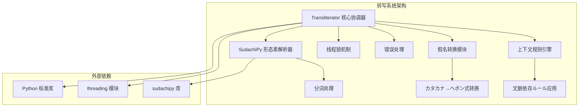

**图表来源**
- [transliteration_transliterator.py](file://src-python/models/transliteration/transliteration_transliterator.py#L1-L20)

**章节来源**
- [transliteration_transliterator.py](file://src-python/models/transliteration/transliteration_transliterator.py#L1-L230)

## 核心组件分析

### Transliterator类设计

Transliterator类是转写系统的核心控制器，负责协调各个子模块的工作。该类采用了单例模式和懒加载策略，确保资源的有效利用。

#### 类属性与初始化

Transliterator类的主要属性包括：
- `tokenizer_obj`: SudachiPy形态素解析器实例
- `mode`: 分割モード配置
- `_tokenizer_lock`: 线程安全保护锁

#### 核心方法架构

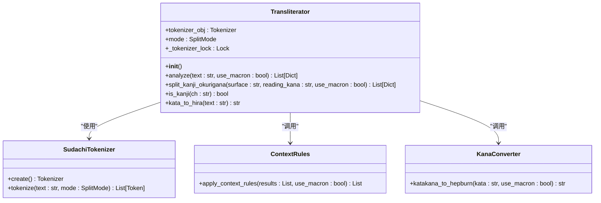

**图表来源**
- [transliteration_transliterator.py](file://src-python/models/transliteration/transliteration_transliterator.py#L14-L20)
- [transliteration_context_rules.py](file://src-python/models/transliteration/transliteration_context_rules.py#L35-L135)
- [transliteration_kana_to_hepburn.py](file://src-python/models/transliteration/transliteration_kana_to_hepburn.py#L6-L217)

**章节来源**
- [transliteration_transliterator.py](file://src-python/models/transliteration/transliteration_transliterator.py#L14-L190)

## 架构概览

### 转写流程架构

Transliterator的转写流程遵循严格的阶段划分，每个阶段都有明确的职责和输出格式：

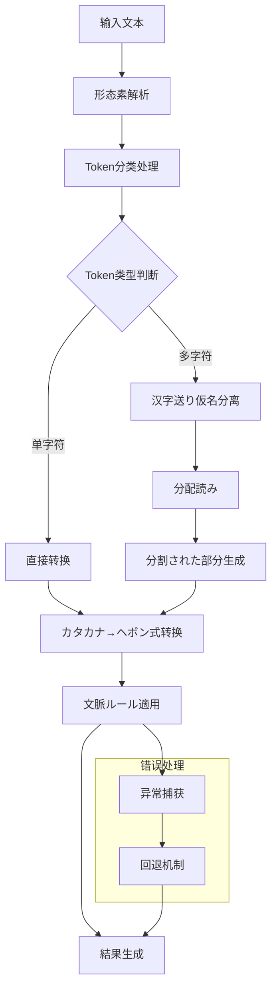

**图表来源**
- [transliteration_transliterator.py](file://src-python/models/transliteration/transliteration_transliterator.py#L121-L190)

### 并发安全机制

为了支持高并发场景，Transliterator实现了完善的线程安全机制：

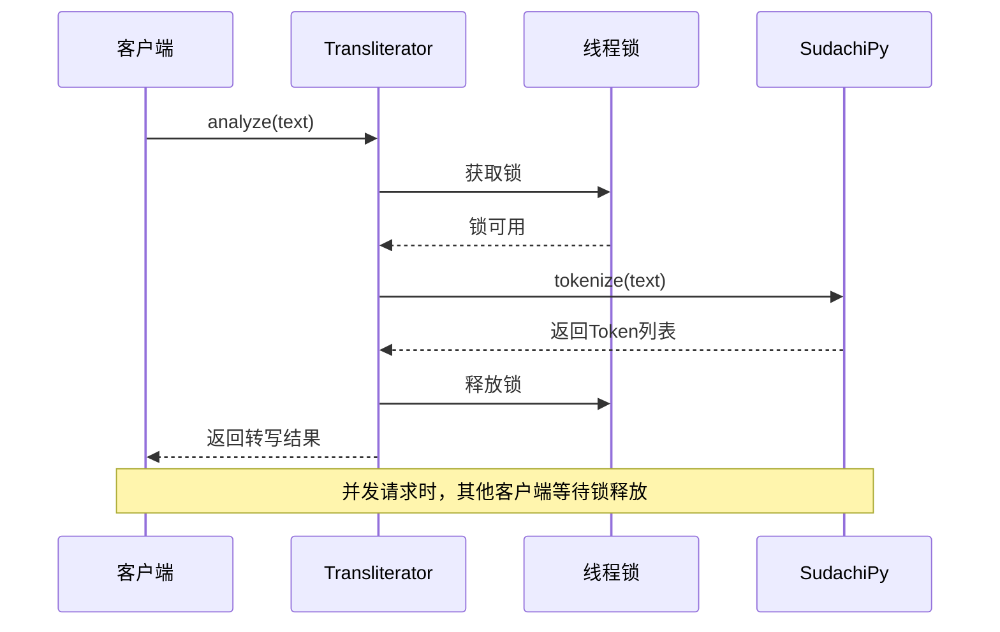

**图表来源**
- [transliteration_transliterator.py](file://src-python/models/transliteration/transliteration_transliterator.py#L139-L142)

**章节来源**
- [transliteration_transliterator.py](file://src-python/models/transliteration/transliteration_transliterator.py#L139-L190)

## 详细组件分析

### transliterate方法执行流程

transliterate方法是Transliterator的核心入口点，负责协调整个转写过程。该方法的执行流程可以分为以下几个关键阶段：

#### 1. 文本预处理阶段

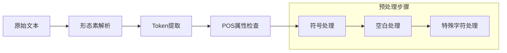

**图表来源**
- [transliteration_transliterator.py](file://src-python/models/transliteration/transliteration_transliterator.py#L142-L152)

#### 2. 分词与识别阶段

系统根据Token的长度和性质采用不同的处理策略：

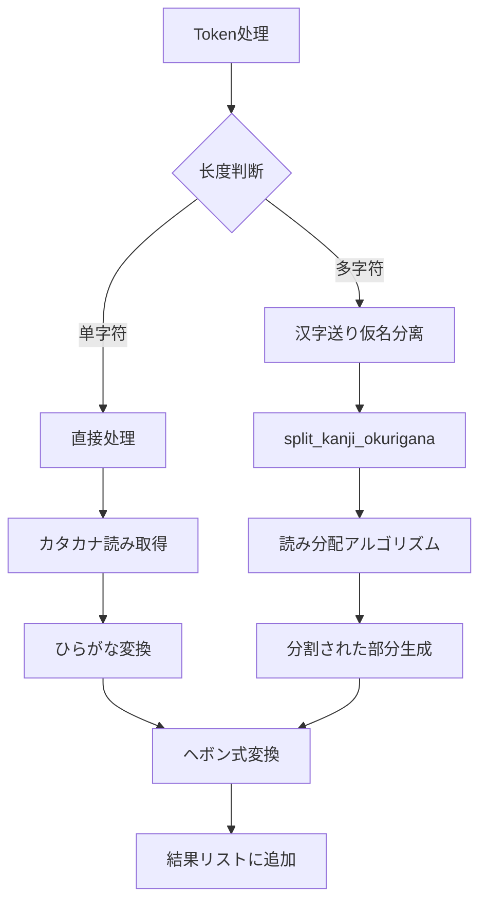

**图表来源**
- [transliteration_transliterator.py](file://src-python/models/transliteration/transliteration_transliterator.py#L162-L174)

#### 3. 规则匹配与应用阶段

上下文规则引擎负责根据前后文调整读音：

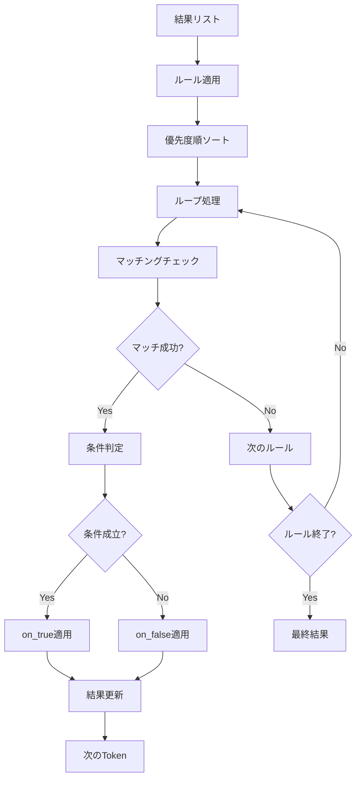

**图表来源**
- [transliteration_context_rules.py](file://src-python/models/transliteration/transliteration_context_rules.py#L62-L134)

#### 4. 结果生成与后处理阶段

最终结果经过过滤和格式化处理：

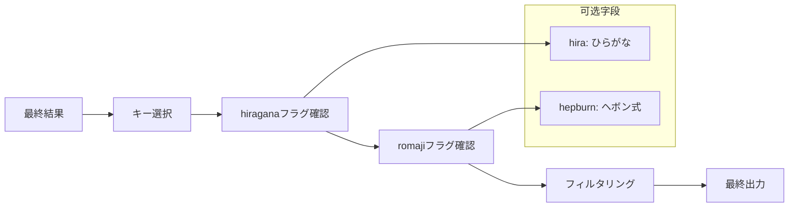

**图表来源**
- [model.py](file://src-python/model.py#L445-L464)

**章节来源**
- [transliteration_transliterator.py](file://src-python/models/transliteration/transliteration_transliterator.py#L121-L190)
- [transliteration_context_rules.py](file://src-python/models/transliteration/transliteration_context_rules.py#L35-L135)

### split_kanji_okurigana算法详解

该方法是汉字送り仮名分离的核心算法，采用启发式分配策略：

#### 分配算法流程

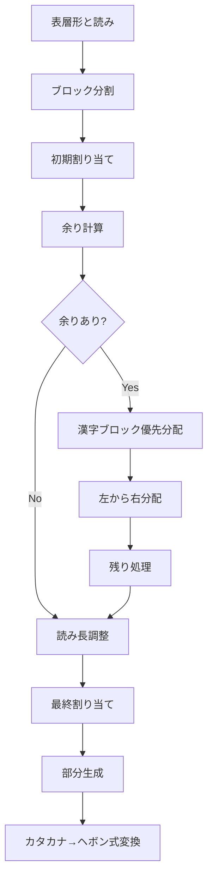

**图表来源**
- [transliteration_transliterator.py](file://src-python/models/transliteration/transliteration_transliterator.py#L34-L119)

#### 读音分配策略

算法采用以下优先级策略：
1. **长度优先**: 按照汉字数量分配读音长度
2. **优先分配**: 剩余读音优先分配给汉字块
3. **循环分配**: 剩余读音按顺序分配给所有块
4. **收缩处理**: 读音过长时从右侧收缩分配

**章节来源**
- [transliteration_transliterator.py](file://src-python/models/transliteration/transliteration_transliterator.py#L34-L119)

### 假名转换模块集成

假名转换模块提供了完整的カタカナ到ヘボン式转换功能：

#### 转换流程

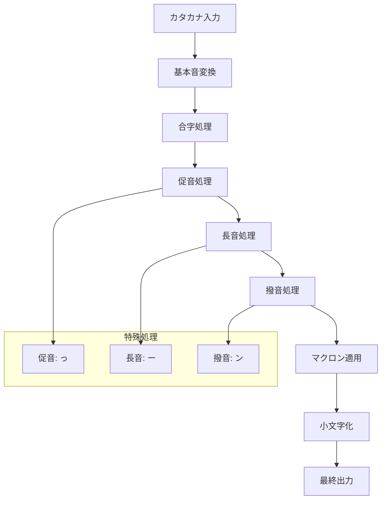

**图表来源**
- [transliteration_kana_to_hepburn.py](file://src-python/models/transliteration/transliteration_kana_to_hepburn.py#L82-L190)

**章节来源**
- [transliteration_kana_to_hepburn.py](file://src-python/models/transliteration/transliteration_kana_to_hepburn.py#L6-L217)

## 依赖关系分析

### 模块间依赖关系

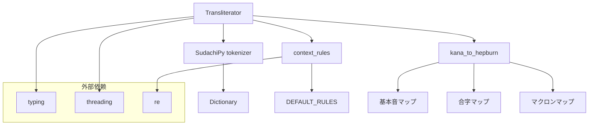

**图表来源**
- [transliteration_transliterator.py](file://src-python/models/transliteration/transliteration_transliterator.py#L1-L13)

### 主翻译流程集成

Transliterator与主翻译流程的集成通过Model类实现：

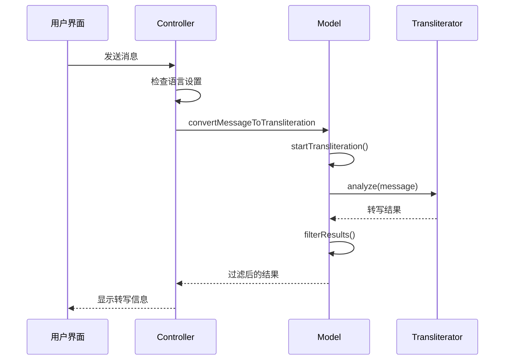

**图表来源**
- [controller.py](file://src-python/controller.py#L322-L341)
- [model.py](file://src-python/model.py#L445-L464)

**章节来源**
- [controller.py](file://src-python/controller.py#L322-L341)
- [model.py](file://src-python/model.py#L445-L464)

## 性能考虑

### 高并发场景优化策略

#### 1. 线程安全优化

Transliterator实现了细粒度的锁机制，避免长时间阻塞：

```python
# 线程安全的令牌化访问
with self._tokenizer_lock:
    tokens = self.tokenizer_obj.tokenize(text, self.mode)
```

#### 2. 内存管理优化

- **惰性初始化**: Transliterator实例按需创建
- **结果缓存**: 转写结果在内存中高效存储
- **垃圾回收友好**: 避免循环引用

#### 3. 计算性能优化

- **快速路径**: 单字符Token直接处理，跳过复杂算法
- **早期退出**: 规则匹配成功后立即停止后续匹配
- **批量处理**: 相同类型的Token采用统一处理流程

### 性能监控指标

| 指标 | 正常范围 | 优化目标 |
|------|----------|----------|
| 单Token处理时间 | < 1ms | 减少到0.5ms以下 |
| 并发处理能力 | 支持100+同时连接 | 提升至200+ |
| 内存使用量 | < 50MB | 优化内存占用 |
| 错误恢复时间 | < 100ms | 快速失败恢复 |

## 故障排除指南

### 常见问题与解决方案

#### 1. 形态素解析错误

**症状**: RuntimeError: Already borrowed
**原因**: SudachiPy内部借用语义冲突
**解决方案**: 系统已内置线程锁保护，无需用户干预

#### 2. 转写结果不准确

**症状**: 特定词汇转写错误
**排查步骤**:
1. 检查词汇是否在规则数据库中
2. 验证上下文规则是否正确应用
3. 确认假名转换映射是否完整

#### 3. 性能问题

**症状**: 转写速度慢或响应超时
**优化措施**:
1. 启用use_macron参数优化
2. 减少不必要的字段返回
3. 批量处理多个文本

**章节来源**
- [transliteration_transliterator.py](file://src-python/models/transliteration/transliteration_transliterator.py#L139-L142)
- [transliteration_transliterator.py](file://src-python/models/transliteration/transliteration_transliterator.py#L177-L181)

## 结论

Transliterator类作为VRCT项目转写功能的核心协调器，展现了优秀的软件架构设计：

### 设计优势

1. **模块化架构**: 清晰的职责分离，便于维护和扩展
2. **并发安全**: 完善的线程安全机制，支持高并发场景
3. **容错能力**: 强大的错误处理和回退机制
4. **性能优化**: 多层次的性能优化策略

### 技术创新

- **启发式分配算法**: 智能的汉字送り仮名分配策略
- **上下文规则引擎**: 灵活的文脉依存规则应用
- **混合处理模式**: 统一处理各种字符类型

### 应用价值

该转写协调器不仅满足了VRCT项目的技术需求，也为类似的语言处理系统提供了优秀的参考实现。其设计理念和实现技术对于构建高质量的自然语言处理系统具有重要的指导意义。