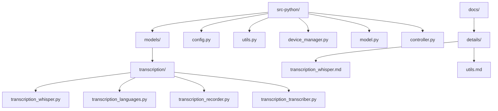
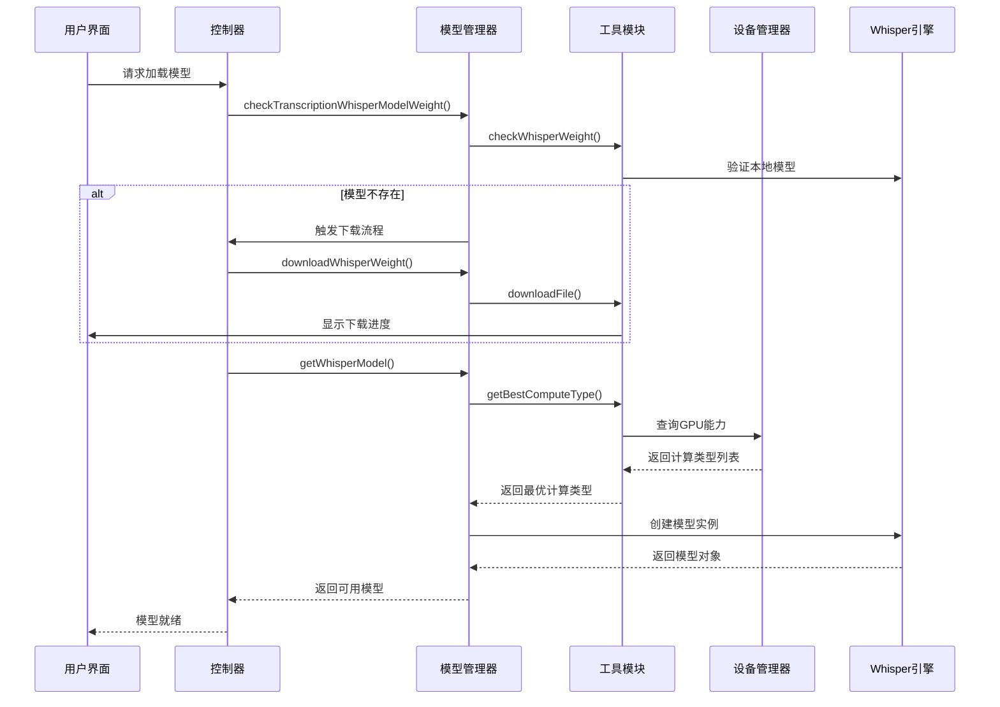
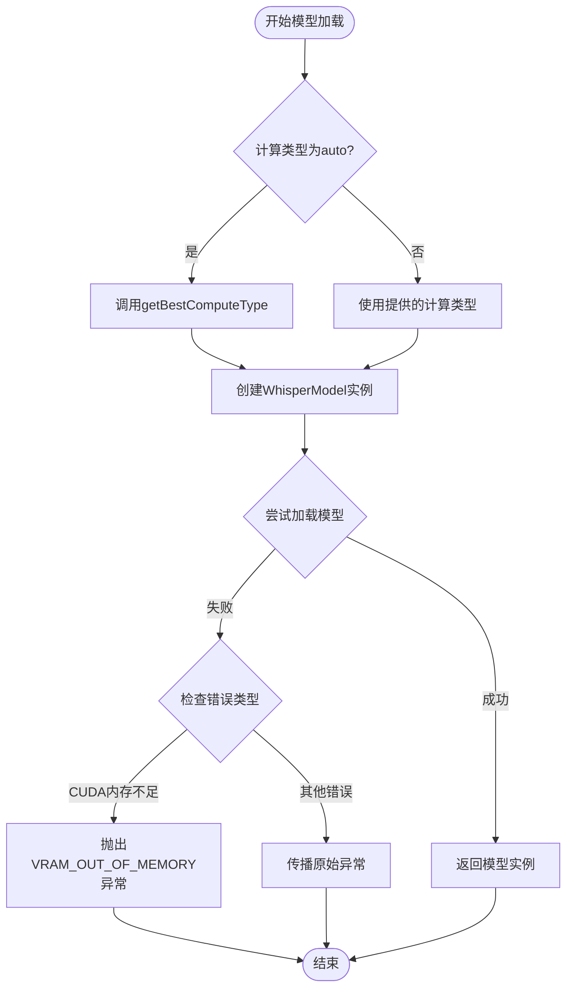
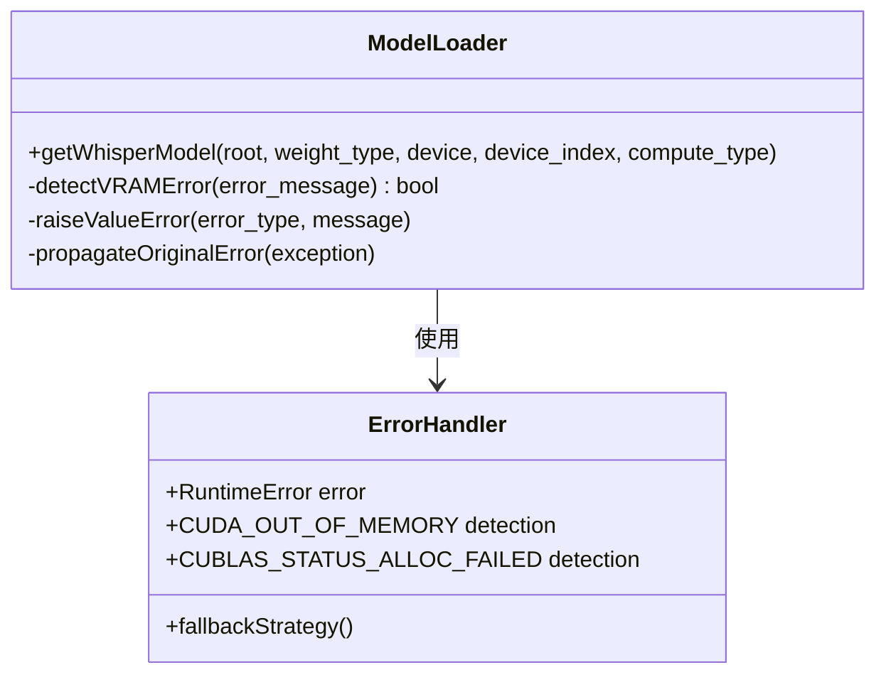
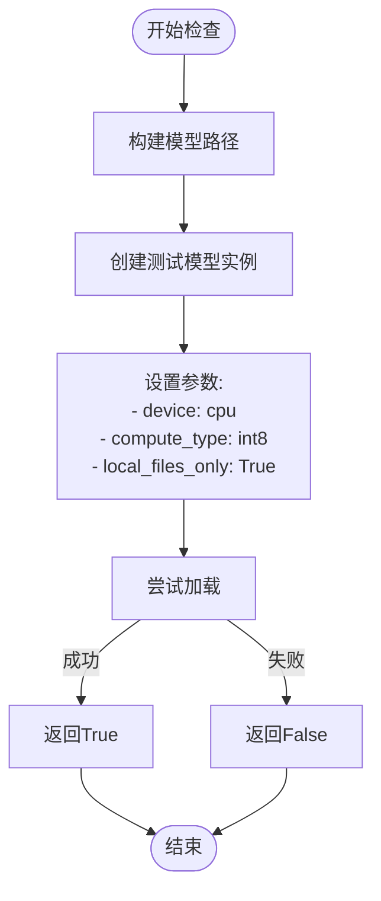
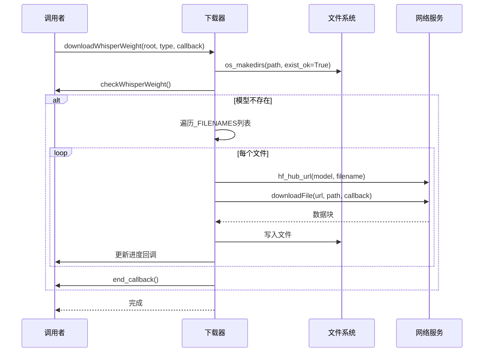
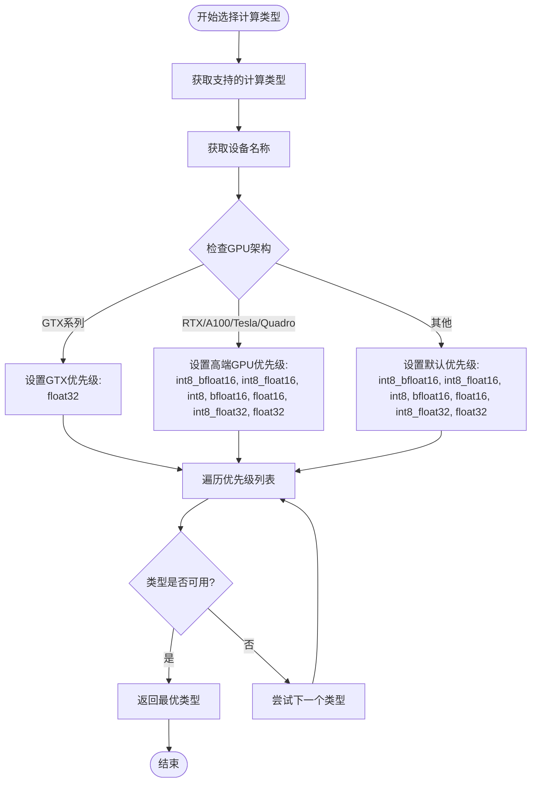
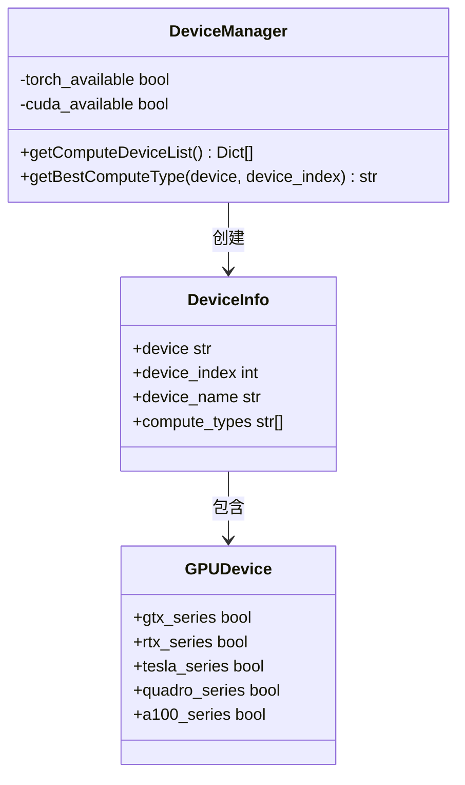
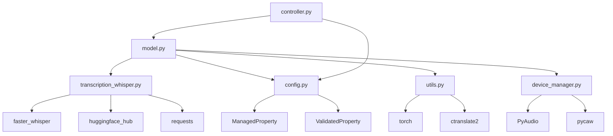

# Whisper模型管理

<cite>
**本文档中引用的文件**
- [transcription_whisper.py](file://src-python/models/transcription/transcription_whisper.py)
- [config.py](file://src-python/config.py)
- [utils.py](file://src-python/utils.py)
- [device_manager.py](file://src-python/device_manager.py)
- [model.py](file://src-python/model.py)
- [controller.py](file://src-python/controller.py)
- [transcription_whisper.md](file://src-python/docs/details/transcription_whisper.md)
- [utils.md](file://src-python/docs/utils.md)
</cite>

## 目录
1. [简介](#简介)
2. [项目结构概览](#项目结构概览)
3. [核心组件分析](#核心组件分析)
4. [架构概览](#架构概览)
5. [详细组件分析](#详细组件分析)
6. [依赖关系分析](#依赖关系分析)
7. [性能考量](#性能考量)
8. [故障排除指南](#故障排除指南)
9. [结论](#结论)

## 简介

本文档深入分析VRCT项目中transcription_whisper.py模块的getWhisperModel函数实现，重点探讨其如何根据硬件环境自动选择最优的Whisper模型配置。该系统具备智能的模型缓存机制、量化支持和VRAM不足时的降级处理策略，为不同硬件环境提供了灵活的模型管理解决方案。

## 项目结构概览

VRCT项目采用模块化架构，其中语音转录功能位于以下目录结构中：



**图表来源**
- [transcription_whisper.py](file://src-python/models/transcription/transcription_whisper.py#L1-L161)
- [config.py](file://src-python/config.py#L1-L100)

**章节来源**
- [transcription_whisper.py](file://src-python/models/transcription/transcription_whisper.py#L1-L161)
- [config.py](file://src-python/config.py#L1-L800)

## 核心组件分析

### 模型配置常量

系统定义了完整的Whisper模型配置映射表，支持从基础版到超大版的各种模型：

| 模型大小 | Hugging Face路径 | 文件大小 | 推荐用途 |
|---------|-----------------|---------|----------|
| tiny | Systran/faster-whisper-tiny | ~75MB | 实时处理 |
| base | Systran/faster-whisper-base | ~142MB | 平衡性能 |
| small | Systran/faster-whisper-small | ~469MB | 高精度需求 |
| medium | Systran/faster-whisper-medium | ~1.5GB | 专业应用 |
| large-v1 | Systran/faster-whisper-large-v1 | ~2.9GB | 最高精度 |
| large-v2 | Systran/faster-whisper-large-v2 | ~2.9GB | 改进版本 |
| large-v3 | Systran/faster-whisper-large-v3 | ~2.9GB | 最新版本 |
| large-v3-turbo-int8 | Zoont/faster-whisper-large-v3-turbo-int8-ct2 | ~794MB | 内存优化 |
| large-v3-turbo | deepdml/faster-whisper-large-v3-turbo-ct2 | ~1.58GB | 性能优化 |

### 下载文件清单

系统需要下载以下关键文件来完整安装模型：
- `config.json`: 模型配置文件
- `preprocessor_config.json`: 预处理器配置
- `model.bin`: 主要模型权重
- `tokenizer.json`: 分词器配置
- `vocabulary.txt`: 词汇表
- `vocabulary.json`: 词汇表映射

**章节来源**
- [transcription_whisper.py](file://src-python/models/transcription/transcription_whisper.py#L23-L42)

## 架构概览

系统采用分层架构设计，实现了模型管理的完整生命周期：



**图表来源**
- [controller.py](file://src-python/controller.py#L2470-L2485)
- [model.py](file://src-python/model.py#L185-L190)
- [transcription_whisper.py](file://src-python/models/transcription/transcription_whisper.py#L112-L144)

## 详细组件分析

### getWhisperModel函数实现

getWhisperModel函数是模型加载的核心入口，实现了智能的硬件适配和错误处理机制：



**图表来源**
- [transcription_whisper.py](file://src-python/models/transcription/transcription_whisper.py#L112-L144)

#### 关键参数配置

函数接受以下关键参数：

| 参数 | 类型 | 默认值 | 描述 |
|------|------|--------|------|
| root | str | 必需 | 应用程序根路径 |
| weight_type | str | 必需 | 模型类型标识符 |
| device | str | "cpu" | 计算设备类型 |
| device_index | int | 0 | 设备索引号 |
| compute_type | str | "auto" | 计算精度类型 |

#### 错误处理机制

系统实现了智能的错误检测和处理：



**图表来源**
- [transcription_whisper.py](file://src-python/models/transcription/transcription_whisper.py#L139-L144)

**章节来源**
- [transcription_whisper.py](file://src-python/models/transcription/transcription_whisper.py#L112-L144)

### 模型缓存机制

#### checkWhisperWeight函数

该函数实现了模型存在性验证，确保模型文件的完整性：



**图表来源**
- [transcription_whisper.py](file://src-python/models/transcription/transcription_whisper.py#L67-L86)

#### downloadWhisperWeight函数

实现了完整的模型下载流程，支持进度回调和异步处理：



**图表来源**
- [transcription_whisper.py](file://src-python/models/transcription/transcription_whisper.py#L88-L111)

**章节来源**
- [transcription_whisper.py](file://src-python/models/transcription/transcription_whisper.py#L67-L111)

### 计算类型优化系统

#### getBestComputeType函数

该函数实现了基于GPU架构的最优计算类型选择：



**图表来源**
- [utils.py](file://src-python/utils.py#L134-L171)

#### GPU架构兼容性矩阵

| GPU系列 | 支持的计算类型 | 优先级 | 内存效率 |
|---------|---------------|--------|----------|
| GTX系列 | float32 | 最高 | 低 |
| RTX 20xx+ | int8_bfloat16, int8_float16, int8, bfloat16, float16, int8_float32, float32 | 最高 | 中等 |
| RTX 30xx+ | int8_bfloat16, int8_float16, int8, bfloat16, float16, int8_float32, float32 | 最高 | 高 |
| RTX 40xx+ | int8_bfloat16, int8_float16, int8, bfloat16, float16, int8_float32, float32 | 最高 | 最高 |
| Tesla/A100 | int8_bfloat16, int8_float16, int8, bfloat16, float16, int8_float32, float32 | 最高 | 高 |
| Quadro系列 | int8_bfloat16, int8_float16, int8, bfloat16, float16, int8_float32, float32 | 最高 | 中等 |

**章节来源**
- [utils.py](file://src-python/utils.py#L134-L171)
- [utils.md](file://src-python/docs/utils.md#L254-L345)

### 设备管理集成

#### getComputeDeviceList函数

实现了完整的设备发现和配置功能：



**图表来源**
- [utils.py](file://src-python/utils.py#L92-L132)
- [device_manager.py](file://src-python/device_manager.py#L1-L200)

**章节来源**
- [utils.py](file://src-python/utils.py#L92-L132)
- [device_manager.py](file://src-python/device_manager.py#L1-L200)

## 依赖关系分析

系统采用了清晰的依赖层次结构：



**图表来源**
- [transcription_whisper.py](file://src-python/models/transcription/transcription_whisper.py#L1-L20)
- [model.py](file://src-python/model.py#L1-L40)

**章节来源**
- [transcription_whisper.py](file://src-python/models/transcription/transcription_whisper.py#L1-L20)
- [model.py](file://src-python/model.py#L1-L40)

## 性能考量

### 模型加载时间优化

系统通过多种策略优化模型加载性能：

1. **异步下载**: 使用独立线程进行模型下载，避免阻塞主线程
2. **并行初始化**: 支持CTranslate2和Whisper模型的并行加载
3. **延迟加载**: 翻译模型在实际使用时才加载
4. **缓存机制**: 本地文件验证减少重复下载

### VRAM使用优化

不同模型配置的内存使用情况：

| 模型大小 | VRAM需求 | 处理速度 | 推荐场景 |
|---------|---------|---------|----------|
| tiny | ~200MB | 实时 | 移动设备、低配置PC |
| base | ~300MB | 1-2x实时 | 一般用途 |
| small | ~600MB | 0.5-1x实时 | 高精度需求 |
| medium | ~1.8GB | 0.2-0.5x实时 | 专业应用 |
| large | ~3.5GB | 0.1-0.3x实时 | 最高精度 |

### 计算类型性能对比

| 计算类型 | 内存使用 | 处理速度 | 精度 | GPU要求 |
|---------|---------|---------|------|---------|
| int8_bfloat16 | 最小 | 最快 | 高 | RTX 30xx+ |
| int8_float16 | 最小 | 最快 | 高 | RTX 20xx+ |
| int8 | 小 | 高速 | 中 | 多数GPU |
| bfloat16 | 中 | 高速 | 高 | RTX 30xx+ |
| float16 | 中 | 高速 | 高 | RTX 20xx+ |
| float32 | 大 | 标准 | 最高 | 全部 |

## 故障排除指南

### 常见问题及解决方案

#### VRAM不足错误

当遇到CUDA内存不足时，系统会抛出明确的异常：

```python
# 错误检测逻辑
if "CUDA out of memory" in error_message or "CUBLAS_STATUS_ALLOC_FAILED" in error_message:
    raise ValueError("VRAM_OUT_OF_MEMORY", error_message)
```

**解决策略**:
1. 降低模型大小（如从medium切换到base）
2. 使用更高效的计算类型（如int8替代float16）
3. 增加系统虚拟内存
4. 关闭其他GPU占用的应用程序

#### 模型下载失败

常见的下载问题包括网络连接、磁盘空间和权限问题：

1. **网络问题**: 检查网络连接，考虑使用代理
2. **磁盘空间**: 确保有足够的可用存储空间
3. **权限问题**: 检查写入权限，以管理员身份运行

#### 设备兼容性问题

对于不支持的GPU架构，系统会自动降级到CPU模式：

```python
# 设备兼容性检查
if not any(keyword in gpu_device_name for keyword in ["RTX", "Tesla", "A100", "Quadro"]):
    gpu_compute_types = ["float32"]
```

**章节来源**
- [transcription_whisper.py](file://src-python/models/transcription/transcription_whisper.py#L139-L144)
- [utils.md](file://src-python/docs/utils.md#L254-L345)

## 结论

VRCT项目的Whisper模型管理系统展现了现代AI应用开发的最佳实践。通过智能的硬件适配、完善的错误处理和优化的性能策略，该系统能够为不同硬件环境提供最佳的用户体验。

### 主要优势

1. **智能硬件适配**: 自动检测硬件能力并选择最优配置
2. **完善的缓存机制**: 避免重复下载，提升加载速度
3. **健壮的错误处理**: 清晰的错误信息和合理的降级策略
4. **灵活的配置选项**: 支持多种计算类型和设备组合
5. **异步处理**: 不阻塞用户界面，提升响应性

### 未来改进方向

1. **模型量化优化**: 进一步探索INT4等更高效的数据格式
2. **动态负载均衡**: 根据系统资源动态调整模型配置
3. **云端模型支持**: 扩展到远程模型服务
4. **多模态融合**: 集成视觉和其他感知模态

该系统为开发者提供了一个可扩展、高性能的语音转录解决方案，适用于从个人应用到企业级部署的各种场景。