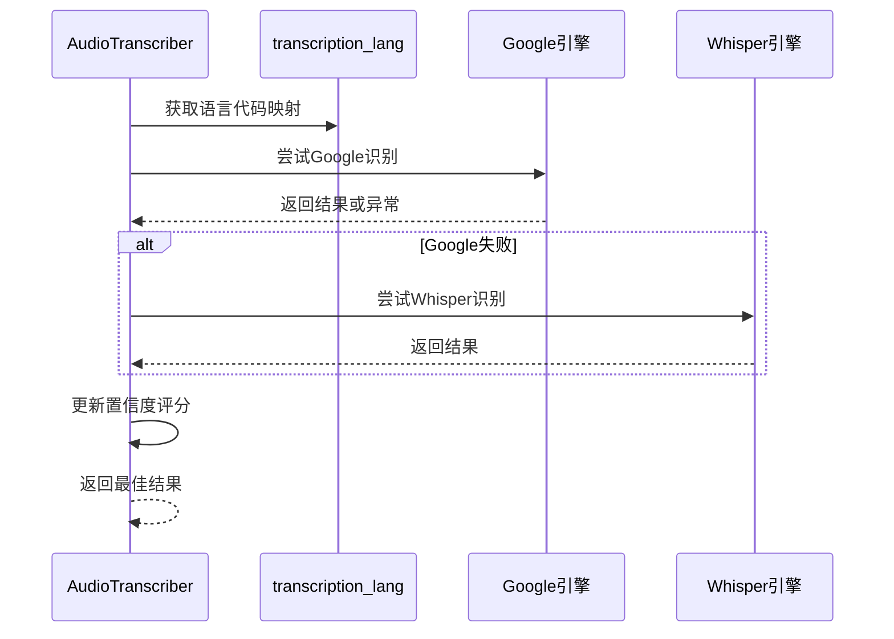
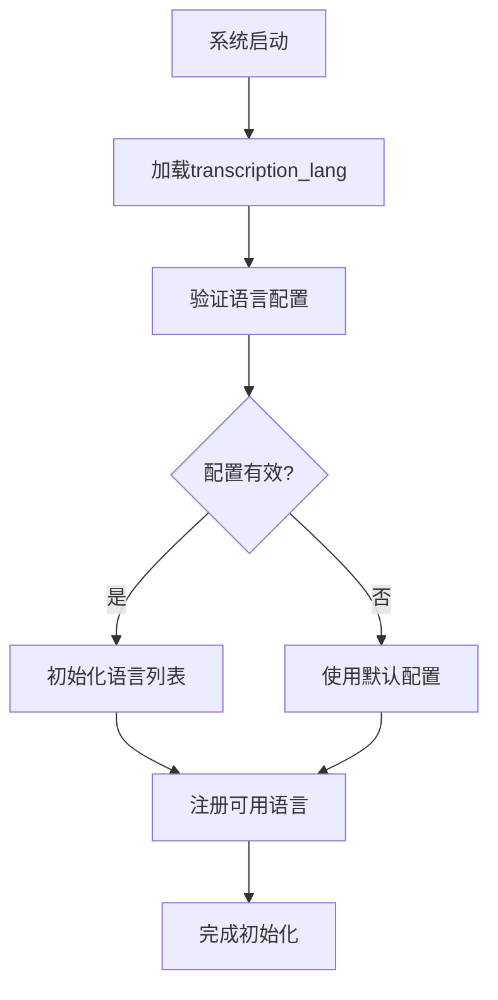
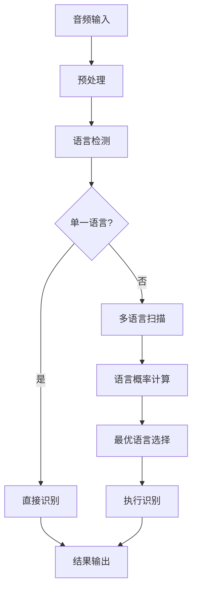
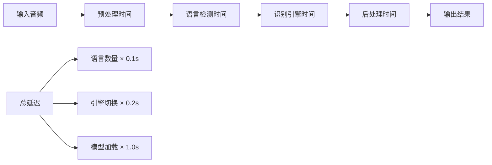

# 多语言支持机制

<cite>
**本文档中引用的文件**
- [transcription_languages.py](file://src-python/models/transcription/transcription_languages.py)
- [transcription_transcriber.py](file://src-python/models/transcription/transcription_transcriber.py)
- [transcription_whisper.py](file://src-python/models/transcription/transcription_whisper.py)
- [transcription_languages.md](file://src-python/docs/details/transcription_languages.md)
- [transcription_transcriber.md](file://src-python/docs/details/transcription_transcriber.md)
- [config.py](file://src-python/config.py)
- [model.py](file://src-python/model.py)
- [controller.py](file://src-python/controller.py)
</cite>

## 目录
1. [概述](#概述)
2. [语言代码映射表结构](#语言代码映射表结构)
3. [语音识别流程中的语言处理](#语音识别流程中的语言处理)
4. [动态语言加载机制](#动态语言加载机制)
5. [多语言混合输入处理策略](#多语言混合输入处理策略)
6. [配置多语言识别流水线](#配置多语言识别流水线)
7. [性能影响分析](#性能影响分析)
8. [故障排除指南](#故障排除指南)
9. [总结](#总结)

## 概述

VRCT系统采用了一套完整的多语言支持机制，通过`transcription_languages.py`模块的语言代码映射表和`transcription_transcriber.py`模块的智能识别引擎，实现了高效的多语言语音识别功能。该系统支持超过70种语言和地区变体，能够处理单语言、多语言混合输入场景，并提供自动语言检测和目标语言验证功能。

## 语言代码映射表结构

### 核心数据结构

语言映射表采用三层嵌套字典结构，提供了统一的语言代码管理接口：

```mermaid
graph TD
A[transcription_lang] --> B[语言名称]
B --> C[地区/国家]
C --> D[引擎类型]
D --> E[具体代码]
F[Google引擎] --> G["en-US", "ja-JP", "zh-CN"]
H[Whisper引擎] --> I["en", "ja", "zh"]
```

**图表来源**
- [transcription_languages.py](file://src-python/models/transcription/transcription_languages.py#L6-L734)

### 映射表设计特点

1. **标准化接口**：统一不同语音识别引擎的代码格式
2. **地区变体支持**：精确到国家或地区的语言变体
3. **向后兼容**：保持与现有系统的兼容性
4. **可扩展性**：易于添加新语言和引擎支持

### 支持的语言范围

系统支持以下主要语言类别：

- **西欧语言**：英语、西班牙语、法语、德语、意大利语、葡萄牙语
- **亚洲语言**：日语、韩语、中文简体/繁体、泰语、越南语
- **其他语言**：俄语、阿拉伯语、印地语、荷兰语、瑞典语等

**章节来源**
- [transcription_languages.py](file://src-python/models/transcription/transcription_languages.py#L1-L734)
- [transcription_languages.md](file://src-python/docs/details/transcription_languages.md#L95-L117)

## 语音识别流程中的语言处理

### 自动语言检测机制

`AudioTranscriber`类实现了智能的语言检测和切换机制：



**图表来源**
- [transcription_transcriber.py](file://src-python/models/transcription/transcription_transcriber.py#L80-L160)

### 目标语言验证流程

系统实现了严格的目标语言验证机制：

1. **语言匹配检查**：验证识别结果是否为目标语言
2. **置信度评估**：计算识别结果的可信度分数
3. **自动切换**：在多个语言选项间智能切换
4. **错误恢复**：处理识别失败情况

### 区域变体处理

针对同一语言的不同地区变体，系统提供：

- **精确匹配**：优先使用指定的地区代码
- **降级处理**：当特定地区不可用时使用默认值
- **方言识别**：支持中文简体/繁体等方言变体

**章节来源**
- [transcription_transcriber.py](file://src-python/models/transcription/transcription_transcriber.py#L97-L155)

## 动态语言加载机制

### 配置初始化过程

系统启动时会动态加载语言配置：



**图表来源**
- [config.py](file://src-python/config.py#L762-L768)

### 运行时语言切换

系统支持运行时动态切换语言设置：

1. **配置验证**：确保新配置的有效性
2. **状态更新**：更新内部语言状态
3. **缓存清理**：清除相关缓存数据
4. **重新初始化**：重新配置识别引擎

### 语言兼容性检查

系统实现了多层次的兼容性检查：

- **引擎兼容性**：检查特定语言是否被当前引擎支持
- **模型可用性**：验证Whisper模型是否存在
- **网络连接**：确认Google API的可用性

**章节来源**
- [config.py](file://src-python/config.py#L806-L826)
- [model.py](file://src-python/model.py#L296-L318)

## 多语言混合输入处理策略

### 混合语言识别算法

系统采用智能算法处理多语言混合输入：



### 识别策略优化

1. **自适应阈值**：根据输入内容调整识别阈值
2. **上下文感知**：利用前后文信息提高准确性
3. **动态权重**：为不同语言分配不同的识别权重
4. **错误修正**：实施后处理纠错机制

### 性能优化措施

- **并行处理**：同时尝试多种语言识别
- **缓存机制**：缓存常用语言的识别结果
- **资源管理**：合理分配计算资源
- **内存优化**：控制内存使用量

**章节来源**
- [transcription_transcriber.py](file://src-python/models/transcription/transcription_transcriber.py#L119-L148)

## 配置多语言识别流水线

### 基础配置示例

以下是配置多语言识别流水线的基本步骤：

```python
# 基础多语言配置
languages = ["Japanese", "English", "Chinese Simplified"]
countries = ["Japan", "United States", "China"]

# 初始化转录器
transcriber = AudioTranscriber(
    speaker=False,
    source=mic_source,
    phrase_timeout=3,
    max_phrases=10,
    transcription_engine="Google"
)

# 执行多语言识别
while True:
    success = transcriber.transcribeAudioQueue(
        audio_queue, languages, countries
    )
    if success:
        result = transcriber.getTranscript()
        print(f"识别结果: {result['text']}")
        print(f"语言: {result['language']}")
```

### 高级配置选项

对于复杂的多语言场景，可以使用更高级的配置：

```python
# Whisper引擎配置
whisper_transcriber = AudioTranscriber(
    speaker=True,
    source=speaker_source,
    phrase_timeout=5,
    max_phrases=5,
    transcription_engine="Whisper",
    whisper_weight_type="base",
    device="cuda",
    device_index=0,
    compute_type="float16"
)

# 高质量参数配置
success = whisper_transcriber.transcribeAudioQueue(
    audio_queue, languages, countries,
    avg_logprob=-0.5,          # 更严格的质量阈值
    no_speech_prob=0.4,        # 更敏感的静音检测
    no_repeat_ngram_size=3,    # 避免重复
    vad_filter=True            # 使用语音活动检测
)
```

### 配置验证和测试

系统提供了完整的配置验证机制：

1. **语法检查**：验证配置文件格式正确性
2. **语义验证**：检查语言组合的合理性
3. **性能测试**：评估配置的性能表现
4. **兼容性测试**：确保与现有系统的兼容性

**章节来源**
- [transcription_transcriber.md](file://src-python/docs/details/transcription_transcriber.md#L107-L146)

## 性能影响分析

### 识别准确率影响因素

多语言支持对识别准确率的影响主要体现在以下几个方面：

| 影响因素 | 正面影响 | 负面影响 | 优化建议 |
|---------|---------|---------|---------|
| 语言数量 | 提高覆盖率 | 增加混淆风险 | 控制同时识别语言数量 |
| 地区变体 | 提高本地化准确性 | 增加复杂性 | 优先使用主流变体 |
| 引擎选择 | 发挥各自优势 | 性能差异 | 根据场景选择合适引擎 |
| 阈值设置 | 平衡准确性和速度 | 参数调优困难 | 基于实际使用场景调整 |

### 延迟性能分析



### 内存使用优化

系统采用了多种内存优化策略：

- **模型共享**：多个语言共享同一模型实例
- **懒加载**：按需加载语言模型
- **缓存管理**：智能管理识别结果缓存
- **垃圾回收**：及时释放不需要的资源

**章节来源**
- [transcription_transcriber.md](file://src-python/docs/details/transcription_transcriber.md#L268-L283)

## 故障排除指南

### 常见问题及解决方案

1. **语言不支持错误**
   - 检查语言代码是否存在于映射表中
   - 验证引擎是否支持该语言
   - 确认模型文件是否下载完整

2. **识别准确率低**
   - 调整质量阈值参数
   - 检查音频质量和噪声水平
   - 尝试不同的识别引擎

3. **性能问题**
   - 优化并发语言数量
   - 调整缓冲区大小
   - 使用GPU加速（如可用）

### 调试工具和技巧

系统提供了丰富的调试功能：

- **详细日志记录**：记录每个识别步骤的详细信息
- **性能监控**：实时监控识别性能指标
- **错误报告**：生成详细的错误诊断报告
- **配置验证**：自动验证配置的有效性

**章节来源**
- [transcription_transcriber.md](file://src-python/docs/details/transcription_transcriber.md#L285-L310)

## 总结

VRCT系统的多语言支持机制通过精心设计的语言代码映射表和智能识别引擎，实现了高效、准确的多语言语音识别功能。该系统的主要优势包括：

1. **统一接口**：通过标准化的语言映射表简化了多引擎支持
2. **智能切换**：自动在不同引擎间切换以获得最佳效果
3. **灵活配置**：支持运行时动态调整语言设置
4. **性能优化**：采用多种优化策略确保系统高效运行
5. **可扩展性**：易于添加新语言和识别引擎支持

该多语言支持机制为VRCT系统在国际化应用场景中提供了坚实的技术基础，能够满足各种复杂的多语言识别需求。