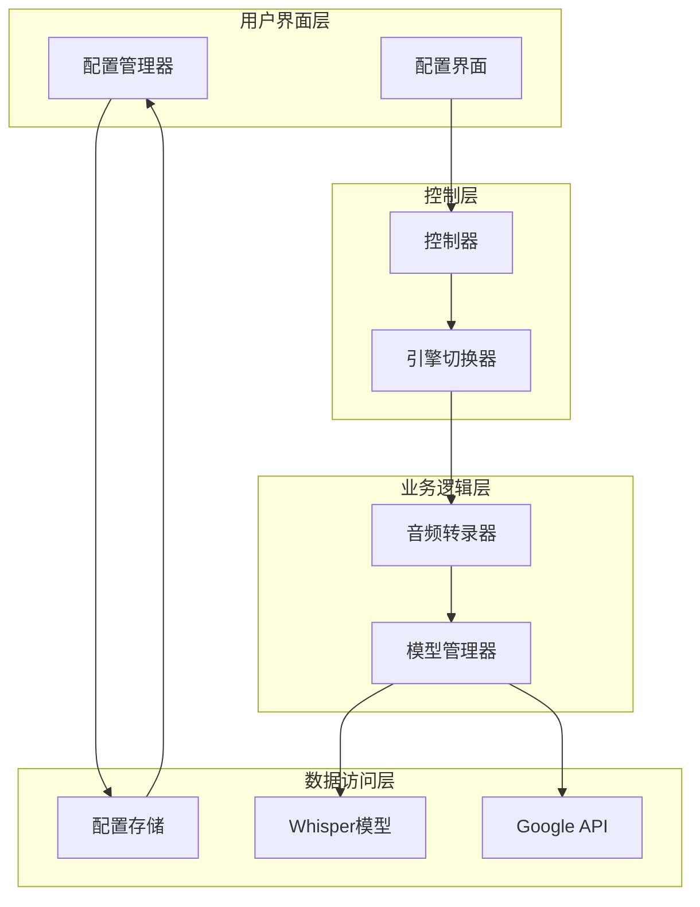
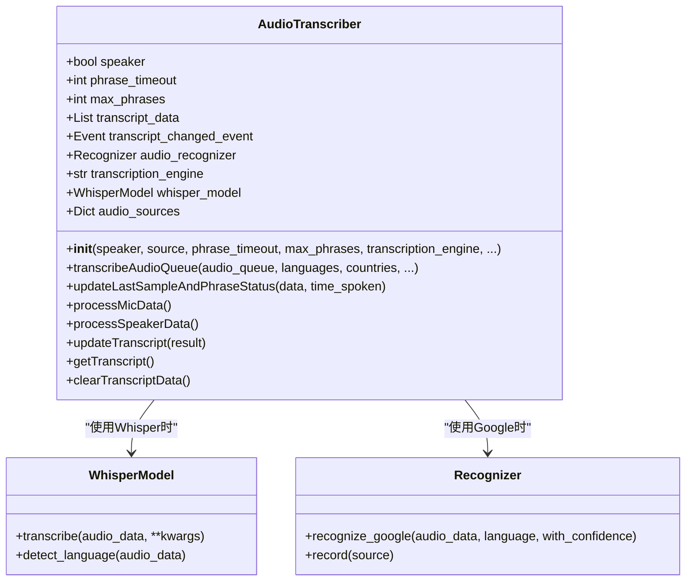
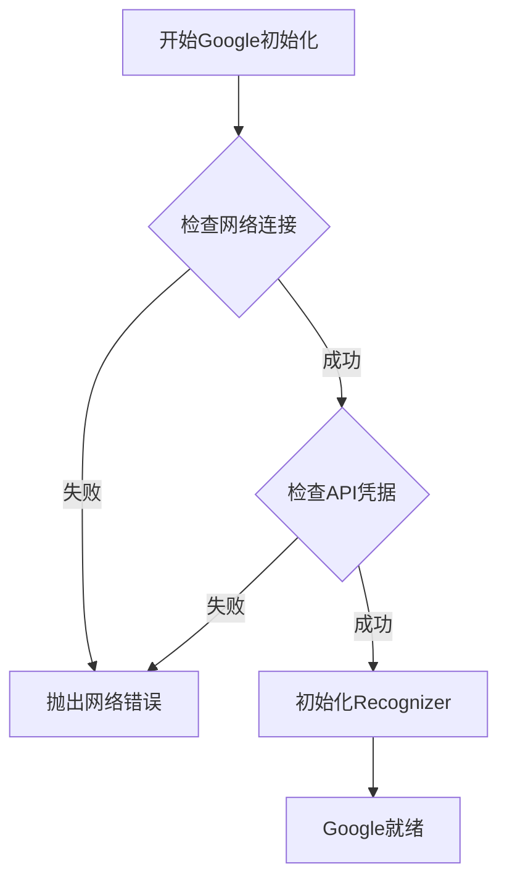
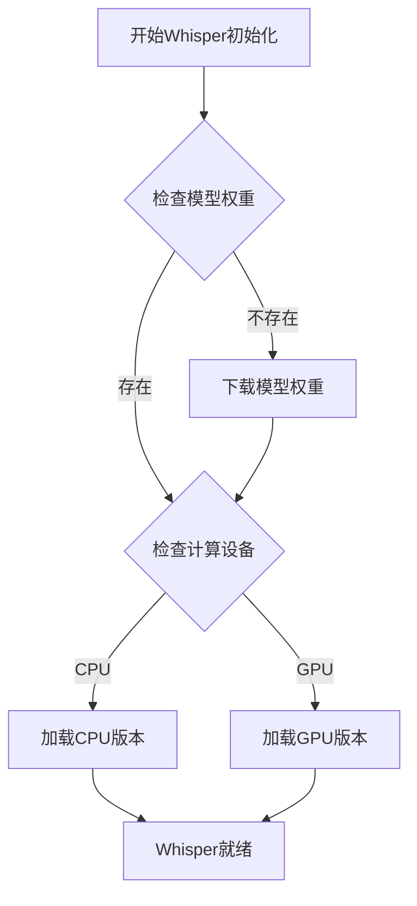
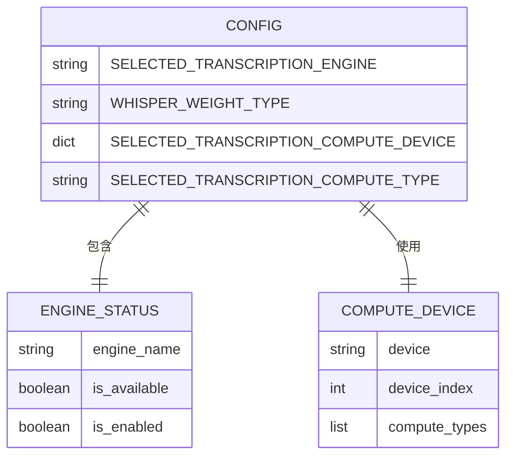
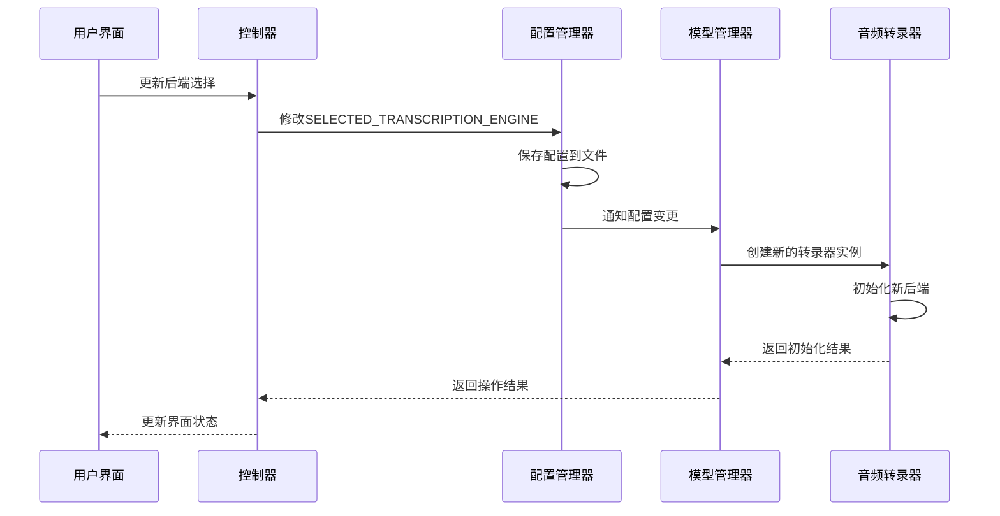
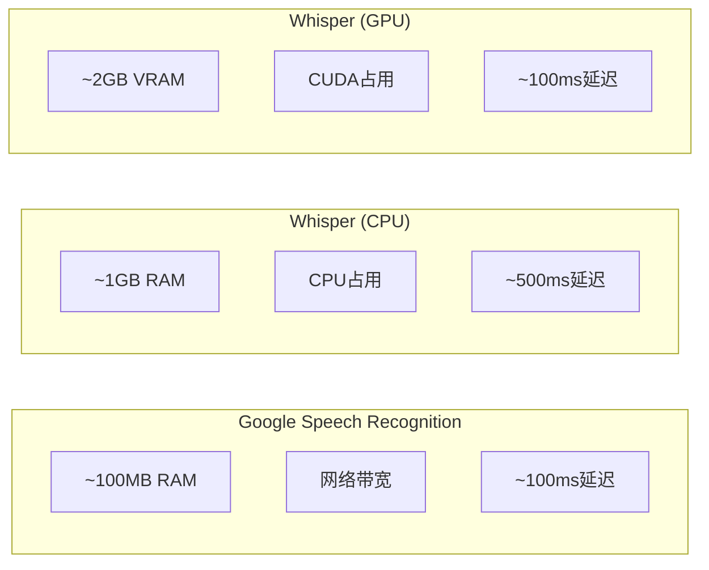

# 语音识别后端选择

<cite>
**本文档中引用的文件**
- [transcription_transcriber.py](file://src-python/models/transcription/transcription_transcriber.py)
- [config.py](file://src-python/config.py)
- [transcription_whisper.py](file://src-python/models/transcription/transcription_whisper.py)
- [model.py](file://src-python/model.py)
- [controller.py](file://src-python/controller.py)
- [Transcription.jsx](file://src-ui/views/app/config_page/setting_section/setting_box/transcription/Transcription.jsx)
</cite>

## 目录
1. [简介](#简介)
2. [系统架构概览](#系统架构概览)
3. [核心组件分析](#核心组件分析)
4. [后端选择机制](#后端选择机制)
5. [配置管理系统](#配置管理系统)
6. [实际应用示例](#实际应用示例)
7. [性能对比分析](#性能对比分析)
8. [故障排除指南](#故障排除指南)
9. [总结](#总结)

## 简介

VRCT语音识别系统采用动态后端选择架构，支持Google Speech Recognition和Whisper两种不同的语音识别引擎。通过`AudioTranscriber`类的智能切换机制，系统能够在运行时根据配置自动选择最适合的识别后端，为用户提供灵活且高效的语音转文字服务。

该系统的核心优势在于：
- **动态后端切换**：运行时可无缝切换Google和Whisper后端
- **智能资源配置**：根据可用资源自动优化后端选择
- **低延迟优化**：针对不同使用场景提供专门的优化策略
- **高准确性保障**：在保证速度的同时确保识别质量

## 系统架构概览



**图表来源**
- [transcription_transcriber.py](file://src-python/models/transcription/transcription_transcriber.py#L31-L220)
- [config.py](file://src-python/config.py#L531-L800)
- [controller.py](file://src-python/controller.py#L2680-L2700)

## 核心组件分析

### AudioTranscriber类结构

`AudioTranscriber`是语音识别系统的核心类，负责处理音频数据并调用相应的识别后端。



**图表来源**
- [transcription_transcriber.py](file://src-python/models/transcription/transcription_transcriber.py#L31-L220)

**章节来源**
- [transcription_transcriber.py](file://src-python/models/transcription/transcription_transcriber.py#L31-L220)

### 后端初始化流程

系统在初始化`AudioTranscriber`实例时会根据配置决定使用哪个识别后端：

```mermaid
flowchart TD
Start([开始初始化]) --> CheckEngine{检查TRANSCRIPTION_ENGINE}
CheckEngine --> |Google| InitGoogle[初始化Google后端]
CheckEngine --> |Whisper| CheckWhisper{检查Whisper权重}
CheckWhisper --> |可用| InitWhisper[初始化Whisper后端]
CheckWhisper --> |不可用| FallbackGoogle[回退到Google]
InitGoogle --> SetEngine[设置transcription_engine="Google"]
InitWhisper --> SetWhisperModel[加载Whisper模型]
SetWhisperModel --> SetEngine2[设置transcription_engine="Whisper"]
FallbackGoogle --> SetEngine
SetEngine --> End([初始化完成])
SetEngine2 --> End
```

**图表来源**
- [transcription_transcriber.py](file://src-python/models/transcription/transcription_transcriber.py#L43-L80)

## 后端选择机制

### _backend_switcher方法实现逻辑

虽然源代码中没有直接名为`_backend_switcher`的方法，但系统通过以下机制实现了动态后端切换：

#### 1. 初始化阶段的后端选择

在`AudioTranscriber`的构造函数中，系统根据配置进行初始后端选择：

```python
# 初始化时的后端选择逻辑
if transcription_engine == "Whisper" and checkWhisperWeight(root, whisper_weight_type) is True:
    self.whisper_model = getWhisperModel(
        root, whisper_weight_type, device=device, device_index=device_index, compute_type=compute_type
    )
    self.transcription_engine = "Whisper"
else:
    self.transcription_engine = "Google"
```

#### 2. 运行时的后端切换

系统提供了控制器级别的后端切换功能：

```python
def updateTranscriptionEngine(self):
    weight_type = config.WHISPER_WEIGHT_TYPE
    weight_type_dict = config.SELECTABLE_WHISPER_WEIGHT_TYPE_DICT
    weight_available = bool(weight_type_dict.get(weight_type))
    current_engine = config.SELECTED_TRANSCRIPTION_ENGINE
    selected_engines = [key for key, value in config.SELECTABLE_TRANSCRIPTION_ENGINE_STATUS.items() if value is True]
    
    if current_engine in {"Whisper", "Google"}:
        if current_engine not in selected_engines:
            if weight_available:
                alternate = "Google" if current_engine == "Whisper" else "Whisper"
                config.SELECTED_TRANSCRIPTION_ENGINE = alternate if alternate in selected_engines else None
            else:
                config.SELECTED_TRANSCRIPTION_ENGINE = "Whisper"
    else:
        config.SELECTED_TRANSCRIPTION_ENGINE = "Whisper"
```

#### 3. 上下文管理

当后端切换发生时，系统需要处理以下上下文状态：

- **音频队列状态**：清空当前音频缓冲区
- **模型状态**：释放旧模型资源，加载新模型
- **配置状态**：更新全局配置参数
- **线程状态**：重启相关处理线程

**章节来源**
- [transcription_transcriber.py](file://src-python/models/transcription/transcription_transcriber.py#L43-L80)
- [controller.py](file://src-python/controller.py#L2680-L2700)

### 不同后端的初始化条件

#### Google Speech Recognition初始化条件



#### Whisper本地模型初始化条件



**图表来源**
- [transcription_whisper.py](file://src-python/models/transcription/transcription_whisper.py#L67-L86)

## 配置管理系统

### TRANSCRIPTION_ENGINE配置项

系统通过配置管理器统一管理后端选择：



**图表来源**
- [config.py](file://src-python/config.py#L709-L710)
- [config.py](file://src-python/config.py#L735-L736)

### 配置更新流程



**图表来源**
- [controller.py](file://src-python/controller.py#L961-L963)
- [model.py](file://src-python/model.py#L644-L655)

**章节来源**
- [config.py](file://src-python/config.py#L709-L710)
- [controller.py](file://src-python/controller.py#L961-L963)

## 实际应用示例

### 从Google后端切换到Whisper后端

以下展示了完整的切换过程：

#### 1. 配置变更前的状态

```python
# 当前配置
config.SELECTED_TRANSCRIPTION_ENGINE = "Google"
config.WHISPER_WEIGHT_TYPE = "base"
```

#### 2. 执行后端切换

```python
# 通过控制器接口切换
controller.setSelectedTranscriptionEngine("Whisper")

# 系统自动执行的切换逻辑
def updateTranscriptionEngine():
    # 检查Whisper权重是否可用
    weight_available = checkWhisperWeight(config.PATH_LOCAL, config.WHISPER_WEIGHT_TYPE)
    
    if weight_available:
        # 切换到Whisper
        config.SELECTED_TRANSCRIPTION_ENGINE = "Whisper"
    else:
        # 如果Whisper不可用，保持Google
        config.SELECTED_TRANSCRIPTION_ENGINE = "Google"
```

#### 3. 切换后的配置状态

```python
# 切换后的配置
config.SELECTED_TRANSCRIPTION_ENGINE = "Whisper"
config.WHISPER_WEIGHT_TYPE = "base"

# 音频转录器状态
transcriber = AudioTranscriber(
    speaker=False,
    source=microphone_source,
    phrase_timeout=3,
    max_phrases=10,
    transcription_engine="Whisper",  # 已切换
    root=config.PATH_LOCAL,
    whisper_weight_type="base",
    device="cpu",
    compute_type="auto"
)
```

#### 4. 运行时影响分析

| 影响方面 | Google后端 | Whisper后端 |
|---------|-----------|------------|
| 延迟 | 低延迟（实时） | 中等延迟（本地处理） |
| 准确性 | 高准确性（云端） | 中等准确性（本地模型） |
| 资源占用 | 网络带宽 | CPU/GPU内存 |
| 离线能力 | 需要网络连接 | 完全离线 |
| 配置复杂度 | 简单（API密钥） | 复杂（模型下载） |

**章节来源**
- [controller.py](file://src-python/controller.py#L2680-L2700)
- [transcription_transcriber.py](file://src-python/models/transcription/transcription_transcriber.py#L43-L80)

### 低延迟需求场景

对于需要低延迟的应用场景，系统推荐使用Google后端：

```python
# 低延迟配置
config.SELECTED_TRANSCRIPTION_ENGINE = "Google"
config.MIC_PHRASE_TIMEOUT = 1  # 较短的超时时间
config.MIC_RECORD_TIMEOUT = 2  # 较短的录音时间
```

### 高准确性需求场景

对于需要高准确性的应用场景，系统推荐使用Whisper后端：

```python
# 高准确性配置
config.SELECTED_TRANSCRIPTION_ENGINE = "Whisper"
config.WHISPER_WEIGHT_TYPE = "large-v3"  # 使用最大模型
config.MIC_AVG_LOGPROB = -0.5  # 更严格的概率阈值
config.MIC_NO_SPEECH_PROB = 0.4  # 更严格的静音检测
```

## 性能对比分析

### 资源占用差异



### 后端选择策略表

| 场景类型 | 推荐后端 | 主要考虑因素 | 配置建议 |
|---------|---------|-------------|---------|
| 实时对话 | Google | 低延迟、高并发 | 短超时、快速响应 |
| 批量转录 | Whisper | 高准确性、离线 | 大模型、严格阈值 |
| 移动设备 | Whisper | 节省流量、离线 | CPU优化、小模型 |
| 服务器部署 | 可选 | 成本与性能平衡 | GPU加速、负载均衡 |

## 故障排除指南

### 常见问题及解决方案

#### 1. Whisper模型加载失败

**症状**：系统无法启动Whisper后端

**原因分析**：
- 模型文件损坏或不完整
- 计算设备不兼容
- 内存不足

**解决方案**：
```python
# 检查模型可用性
if not checkWhisperWeight(config.PATH_LOCAL, config.WHISPER_WEIGHT_TYPE):
    # 重新下载模型
    downloadWhisperWeight(config.PATH_LOCAL, config.WHISPER_WEIGHT_TYPE)
    
# 检查设备兼容性
available_devices = getComputeDeviceList()
if config.SELECTED_TRANSCRIPTION_COMPUTE_DEVICE["device"] not in available_devices:
    config.SELECTED_TRANSCRIPTION_COMPUTE_DEVICE["device"] = "cpu"
```

#### 2. Google API认证失败

**症状**：Google后端无法正常工作

**原因分析**：
- API密钥无效
- 网络连接问题
- 配额超出限制

**解决方案**：
```python
# 检查网络连接
import requests
try:
    response = requests.get("https://speech.googleapis.com/")
    if response.status_code == 200:
        # 网络正常
        pass
except Exception:
    # 网络异常，回退到Whisper
    config.SELECTED_TRANSCRIPTION_ENGINE = "Whisper"
```

#### 3. 后端切换失败

**症状**：配置更新后后端未生效

**原因分析**：
- 配置未正确保存
- 实例未重新创建
- 线程同步问题

**解决方案**：
```python
# 强制重新初始化
def forceReinitializeTranscriber():
    # 清理现有实例
    if hasattr(model, 'mic_transcriber'):
        model.mic_transcriber = None
    if hasattr(model, 'speaker_transcriber'):
        model.speaker_transcriber = None
    
    # 重新创建实例
    model.startMicTranscript()
    model.startSpeakerTranscript()
```

**章节来源**
- [transcription_whisper.py](file://src-python/models/transcription/transcription_whisper.py#L67-L86)
- [controller.py](file://src-python/controller.py#L2680-L2700)

## 总结

VRCT语音识别系统通过精心设计的动态后端选择机制，为用户提供了灵活且高效的语音转文字解决方案。系统的核心优势包括：

1. **智能后端选择**：根据可用资源和配置自动选择最优后端
2. **无缝切换体验**：运行时可平滑切换，不影响用户体验
3. **灵活配置管理**：支持多种配置组合，满足不同使用场景
4. **完善的错误处理**：提供多级容错机制，确保系统稳定性

通过合理配置和使用策略，用户可以在低延迟和高准确性之间找到最佳平衡点，充分发挥两种识别后端的优势。系统的设计理念体现了现代软件架构中"灵活性"和"可靠性"的完美结合，为语音识别应用提供了坚实的技术基础。