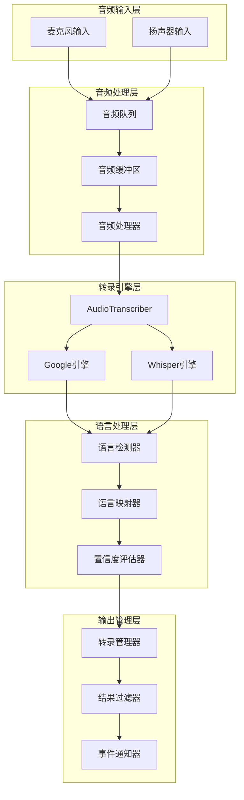
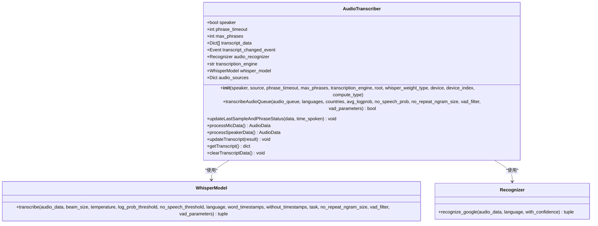
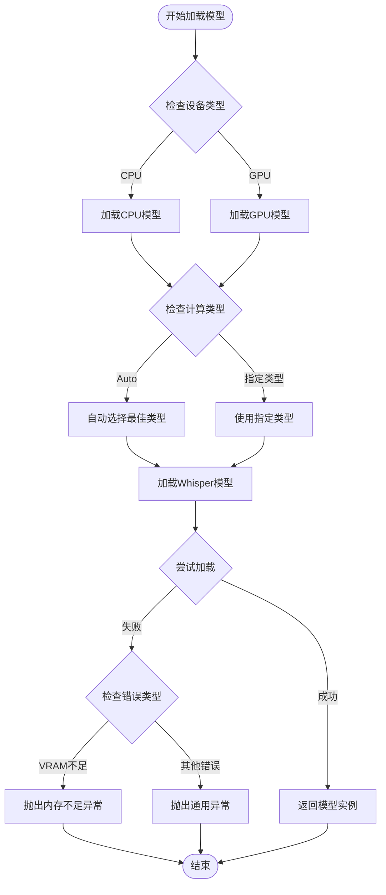
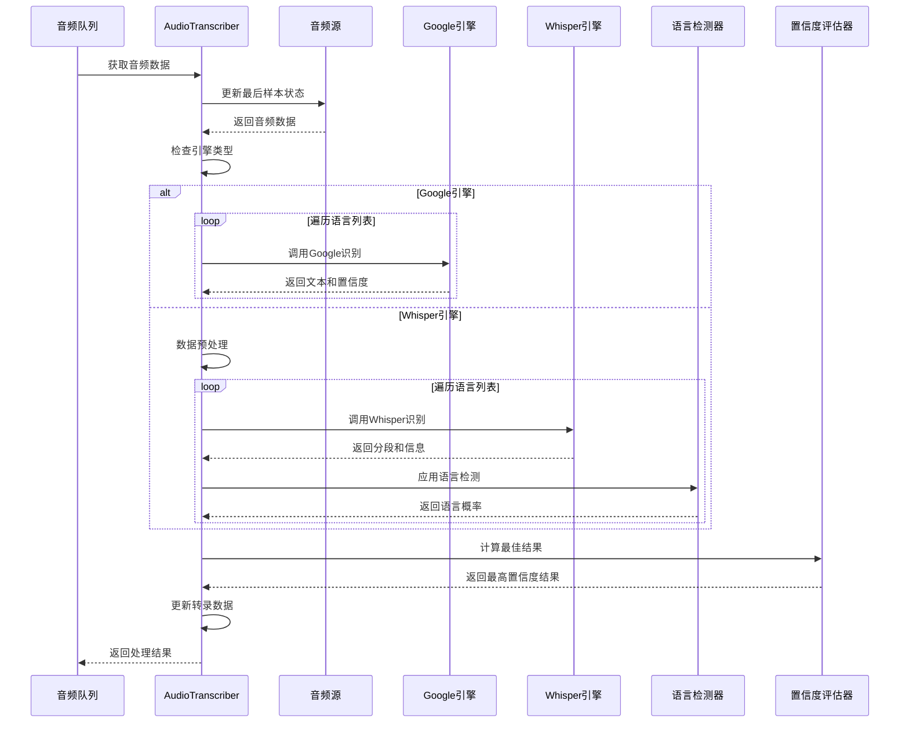
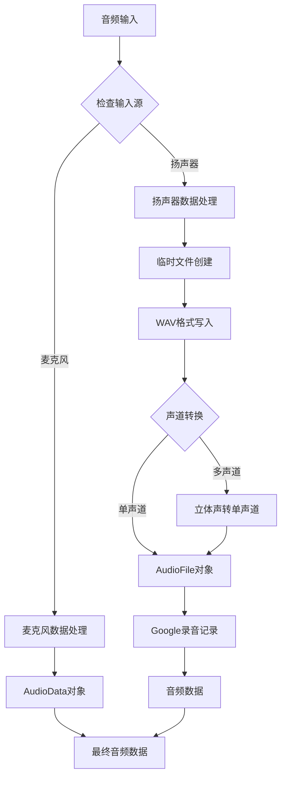
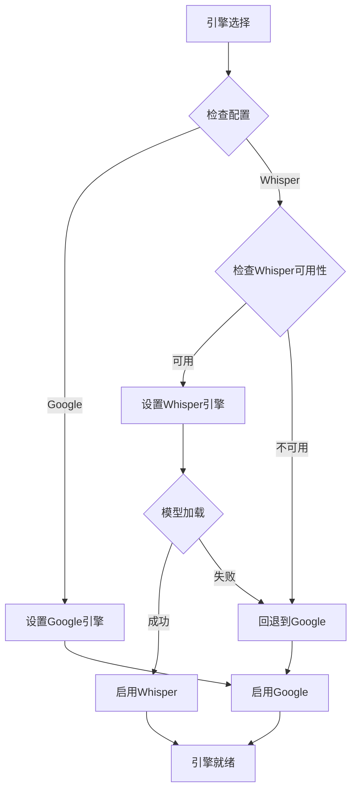
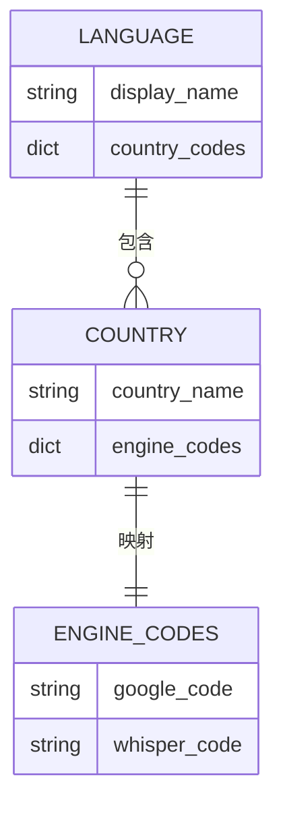
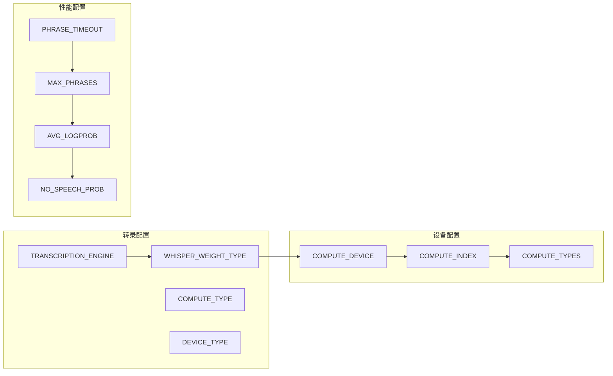
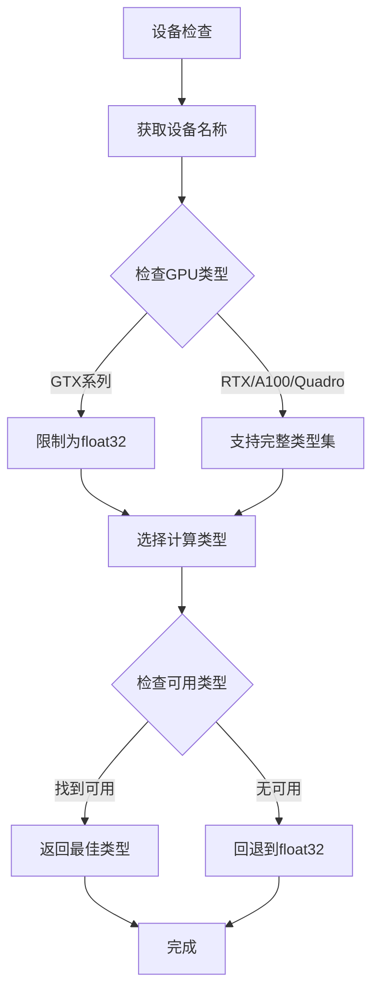
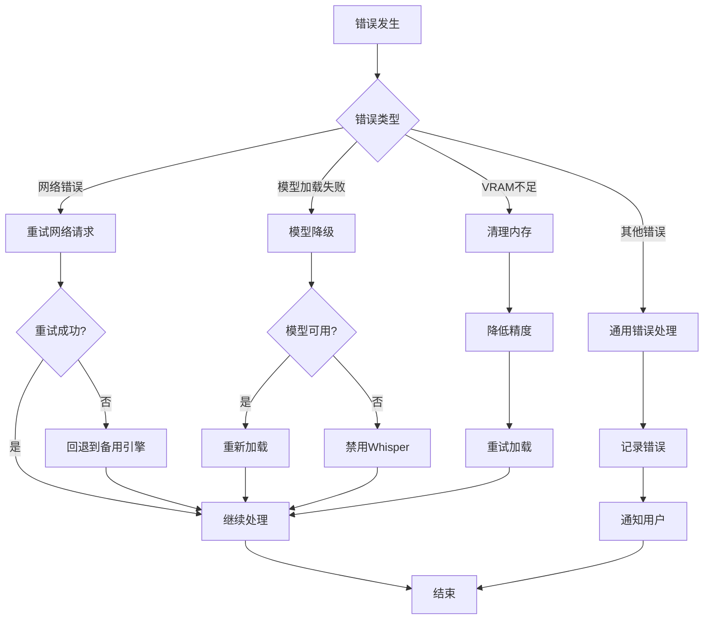

# VRCT语音识别引擎架构详解

<cite>
**本文档引用的文件**
- [transcription_transcriber.py](file://src-python/models/transcription/transcription_transcriber.py)
- [transcription_whisper.py](file://src-python/models/transcription/transcription_whisper.py)
- [transcription_languages.py](file://src-python/models/transcription/transcription_languages.py)
- [config.py](file://src-python/config.py)
- [utils.py](file://src-python/utils.py)
- [model.py](file://src-python/model.py)
- [Transcription.jsx](file://src-ui/views/app/config_page/setting_section/setting_box/transcription/Transcription.jsx)
</cite>

## 目录
1. [概述](#概述)
2. [系统架构](#系统架构)
3. [核心组件分析](#核心组件分析)
4. [音频转录流程](#音频转录流程)
5. [多引擎切换机制](#多引擎切换机制)
6. [语言支持系统](#语言支持系统)
7. [配置管理系统](#配置管理系统)
8. [性能优化策略](#性能优化策略)
9. [故障排除指南](#故障排除指南)
10. [总结](#总结)

## 概述

VRCT语音识别引擎是一个高度集成的多模态语音处理系统，支持实时音频转录功能。该系统采用模块化设计，集成了Google Speech Recognition和faster-whisper两种语音识别引擎，提供在线和离线两种工作模式，支持多种语言和地区变体，具备智能的引擎切换和性能优化机制。

### 主要特性

- **双引擎架构**：同时支持Google Speech Recognition和Whisper引擎
- **实时处理**：基于队列的异步音频处理架构
- **多语言支持**：覆盖全球主要语言和地区变体
- **智能切换**：根据可用性和性能自动选择最优引擎
- **高性能优化**：针对不同硬件配置的计算类型优化

## 系统架构

**图表来源**
- [transcription_transcriber.py](file://src-python/models/transcription/transcription_transcriber.py#L31-L220)
- [model.py](file://src-python/model.py#L644-L867)

## 核心组件分析

### AudioTranscriber类架构

AudioTranscriber是语音识别系统的核心控制器，负责协调音频处理和引擎切换。

**图表来源**
- [transcription_transcriber.py](file://src-python/models/transcription/transcription_transcriber.py#L31-L220)

**章节来源**
- [transcription_transcriber.py](file://src-python/models/transcription/transcription_transcriber.py#L31-L220)

### Whisper模型加载机制

getWhisperModel函数实现了智能的模型加载和异常处理机制：

**图表来源**
- [transcription_whisper.py](file://src-python/models/transcription/transcription_whisper.py#L112-L145)

**章节来源**
- [transcription_whisper.py](file://src-python/models/transcription/transcription_whisper.py#L112-L145)

## 音频转录流程

### transcribeAudioQueue方法详解

transcribeAudioQueue是音频转录的核心方法，实现了完整的音频处理和识别流程：

**图表来源**
- [transcription_transcriber.py](file://src-python/models/transcription/transcription_transcriber.py#L80-L160)

### 音频数据处理流程

系统支持麦克风和扬声器两种音频输入源，每种都有专门的数据处理方法：

**图表来源**
- [transcription_transcriber.py](file://src-python/models/transcription/transcription_transcriber.py#L173-L197)

**章节来源**
- [transcription_transcriber.py](file://src-python/models/transcription/transcription_transcriber.py#L80-L160)

## 多引擎切换机制

### 引擎选择策略

系统根据配置和可用性自动选择最优的语音识别引擎：

**图表来源**
- [transcription_transcriber.py](file://src-python/models/transcription/transcription_transcriber.py#L74-L78)

### 引擎切换逻辑

系统在运行时维护两个引擎实例，根据需要进行切换：

| 切换条件 | 触发时机 | 处理方式 |
|---------|---------|---------|
| 配置变更 | 用户修改设置 | 重新初始化对应引擎 |
| 模型加载失败 | Whisper启动失败 | 自动回退到Google引擎 |
| 性能监控 | 实时性能评估 | 动态调整引擎选择 |
| 资源限制 | VRAM不足 | 降级计算精度或回退 |

**章节来源**
- [transcription_transcriber.py](file://src-python/models/transcription/transcription_transcriber.py#L74-L78)

## 语言支持系统

### 多语言映射机制

transcription_languages.py提供了完整的语言代码映射系统：

**图表来源**
- [transcription_languages.py](file://src-python/models/transcription/transcription_languages.py#L6-L735)

### 支持的语言范围

系统支持以下主要语言类别：

| 语言类别 | 支持数量 | 示例语言 |
|---------|---------|---------|
| 欧洲语言 | 40+ | 英语、法语、德语、西班牙语 |
| 亚洲语言 | 30+ | 中文、日语、韩语、泰语 |
| 非洲语言 | 20+ | 阿拉伯语、斯瓦希里语 |
| 其他语言 | 10+ | 印地语、乌尔都语 |

**章节来源**
- [transcription_languages.py](file://src-python/models/transcription/transcription_languages.py#L6-L735)

## 配置管理系统

### 关键配置参数

系统通过config.py集中管理所有配置参数：

**图表来源**
- [config.py](file://src-python/config.py#L680-L717)

### 配置验证机制

系统实现了严格的配置验证机制：

| 验证类型 | 检查项目 | 错误处理 |
|---------|---------|---------|
| 类型验证 | 参数类型匹配 | 使用默认值 |
| 范围验证 | 数值范围检查 | 截断到有效范围 |
| 可选验证 | 必需参数存在 | 抛出配置异常 |
| 依赖验证 | 参数间依赖关系 | 自动修正依赖 |

**章节来源**
- [config.py](file://src-python/config.py#L680-L717)

## 性能优化策略

### 计算类型优化

utils.py中的getBestComputeType函数实现了智能的计算类型选择：

**图表来源**
- [utils.py](file://src-python/utils.py#L134-L171)

### VRAM管理策略

系统实现了完善的VRAM管理机制：

| 设备类型 | 推荐计算类型 | VRAM需求 | 性能等级 |
|---------|-------------|---------|---------|
| GTX系列 | float32 | 低 | 基础 |
| RTX系列 | int8_bfloat16 | 中等 | 高 |
| A100 | int8_bfloat16 | 高 | 最高 |
| CPU | float32 | 低 | 中等 |

**章节来源**
- [utils.py](file://src-python/utils.py#L134-L171)

## 故障排除指南

### 常见问题诊断

系统提供了完整的错误处理和诊断机制：

### 性能监控指标

系统监控以下关键性能指标：

| 指标类型 | 监控项目 | 正常范围 | 异常处理 |
|---------|---------|---------|---------|
| 延迟指标 | 识别延迟 | < 2秒 | 自动切换引擎 |
| 准确率指标 | 置信度分数 | > 0.8 | 调整阈值 |
| 资源指标 | VRAM使用率 | < 90% | 降级处理 |
| 稳定性指标 | 错误率 | < 5% | 记录日志 |

## 总结

VRCT语音识别引擎展现了现代语音处理系统的最佳实践，通过以下关键设计实现了卓越的性能：

### 架构优势

1. **模块化设计**：清晰的职责分离和接口定义
2. **容错机制**：完善的错误处理和回退策略
3. **性能优化**：针对不同硬件的智能优化
4. **扩展性**：易于添加新语言和引擎支持

### 技术创新

1. **智能引擎切换**：基于性能和可用性的动态选择
2. **多语言统一**：标准化的语言映射和处理
3. **资源管理**：精细化的计算资源控制
4. **实时处理**：高效的队列和异步处理架构

该系统为VRCT项目提供了稳定可靠的语音识别基础，支持复杂的多语言交互场景，是现代语音处理应用的优秀范例。