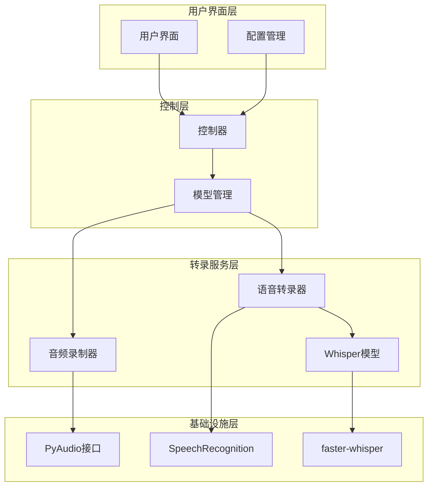
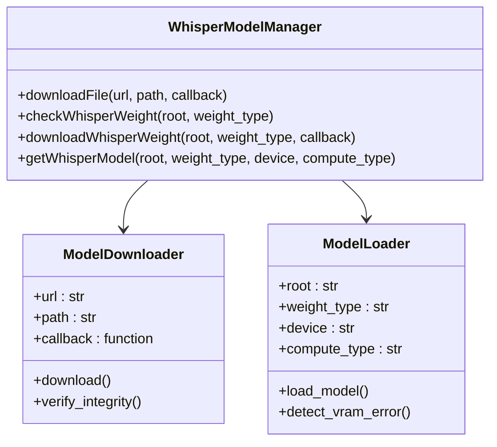
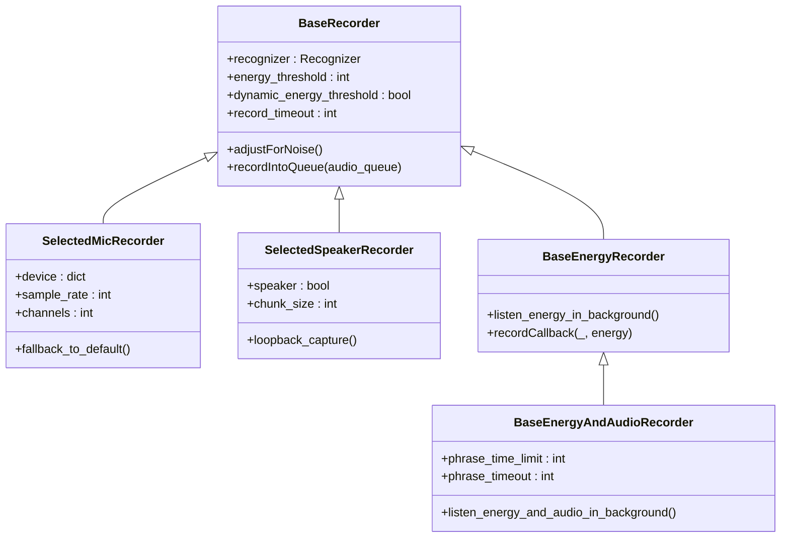
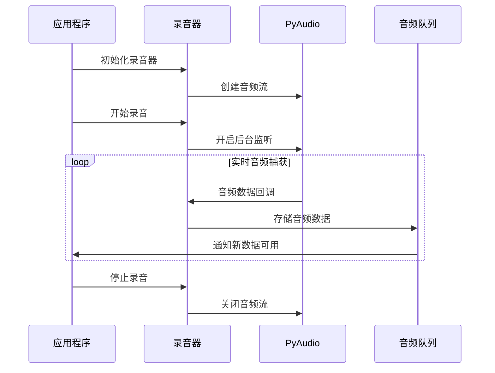
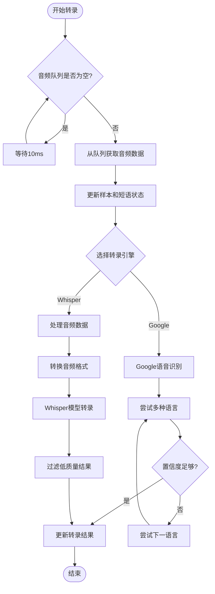
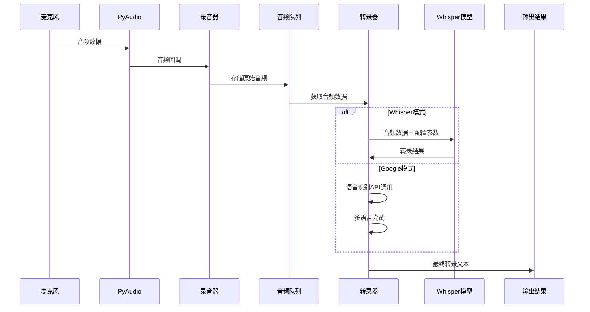
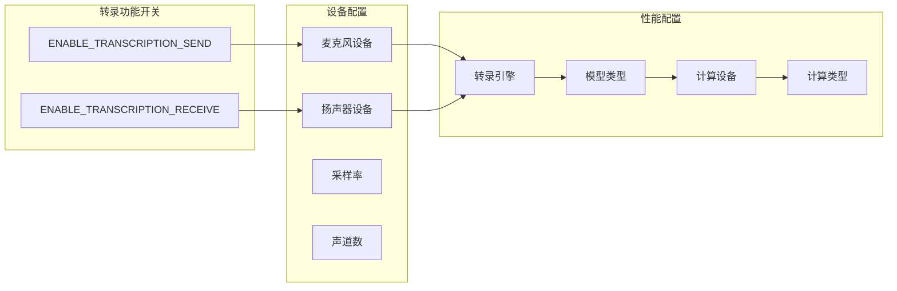
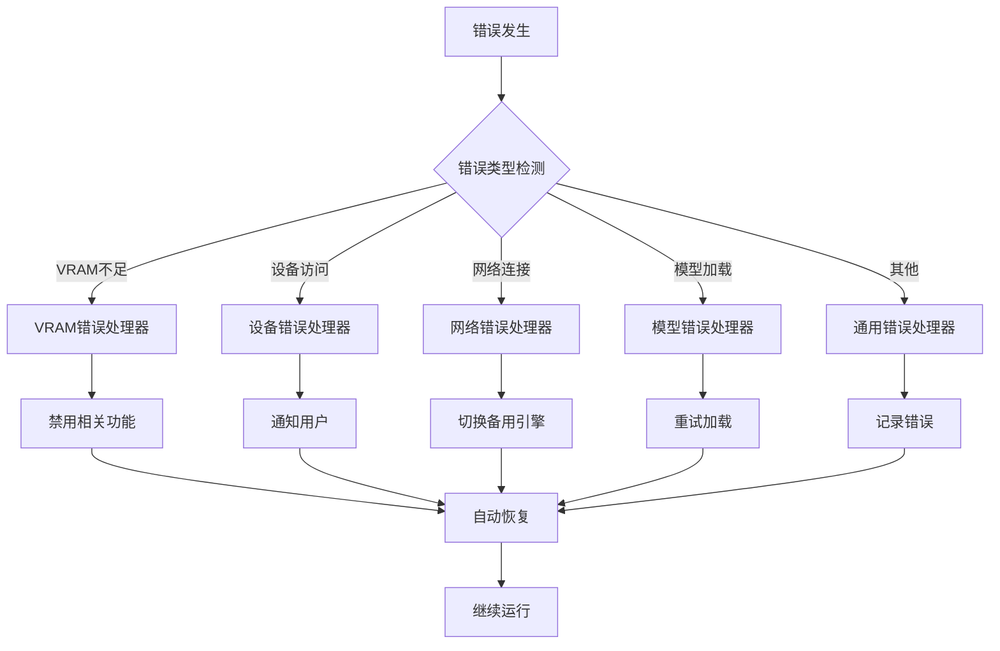

# VRCT语音转录系统技术文档

<cite>
**本文档引用的文件**
- [transcription_whisper.py](file://src-python/models/transcription/transcription_whisper.py)
- [transcription_recorder.py](file://src-python/models/transcription/transcription_recorder.py)
- [transcription_transcriber.py](file://src-python/models/transcription/transcription_transcriber.py)
- [transcription_languages.py](file://src-python/models/transcription/transcription_languages.py)
- [config.py](file://src-python/config.py)
- [utils.py](file://src-python/utils.py)
- [controller.py](file://src-python/controller.py)
- [model.py](file://src-python/model.py)
</cite>

## 目录
1. [系统概述](#系统概述)
2. [架构设计](#架构设计)
3. [核心组件详解](#核心组件详解)
4. [数据流分析](#数据流分析)
5. [配置管理](#配置管理)
6. [错误处理机制](#错误处理机制)
7. [性能优化策略](#性能优化策略)
8. [实际应用示例](#实际应用示例)
9. [故障排除指南](#故障排除指南)
10. [总结](#总结)

## 系统概述

VRCT语音转录系统是一个基于Python的实时语音识别解决方案，集成了faster-whisper模型和PyAudio音频采集技术。该系统支持多种音频输入源（麦克风、扬声器输出），提供离线和在线两种转录模式，并具备完善的错误处理和资源管理机制。

### 主要特性

- **多引擎支持**：同时支持Google Web Speech Recognition和faster-whisper本地模型
- **实时处理**：采用异步队列机制实现低延迟语音转录
- **多语言支持**：支持超过100种语言的语音识别
- **灵活配置**：丰富的配置选项支持个性化设置
- **健壮性**：完善的错误处理和资源管理机制

## 架构设计

VRCT语音转录系统采用模块化架构设计，主要包含以下层次：



**图表来源**
- [controller.py](file://src-python/controller.py#L1-L50)
- [model.py](file://src-python/model.py#L1-L100)

### 核心设计理念

1. **分离关注点**：每个模块负责特定功能，降低耦合度
2. **异步处理**：使用队列机制实现非阻塞的数据流处理
3. **容错设计**：多层次的错误检测和恢复机制
4. **可扩展性**：支持插件式扩展和配置热更新

## 核心组件详解

### 1. Whisper模型管理 (transcription_whisper.py)

Whisper模型管理模块负责faster-whisper模型的下载、验证和加载。

#### 主要功能

- **模型下载管理**：支持增量下载和进度回调
- **模型验证**：检查模型文件完整性
- **模型加载**：根据硬件配置选择最优计算类型



**图表来源**
- [transcription_whisper.py](file://src-python/models/transcription/transcription_whisper.py#L44-L161)

#### 关键配置参数

| 参数 | 类型 | 默认值 | 描述 |
|------|------|--------|------|
| weight_type | str | "base" | Whisper模型类型（tiny/base/small/medium/large） |
| device | str | "cpu" | 计算设备（cpu/cuda） |
| compute_type | str | "auto" | 计算精度类型 |
| local_files_only | bool | True | 仅使用本地文件 |

**章节来源**
- [transcription_whisper.py](file://src-python/models/transcription/transcription_whisper.py#L112-L161)

### 2. 音频录制系统 (transcription_recorder.py)

音频录制系统基于PyAudio和speech_recognition库，提供多种音频输入方式和实时音频处理能力。

#### 录制器类型



**图表来源**
- [transcription_recorder.py](file://src-python/models/transcription/transcription_recorder.py#L14-L264)

#### 音频处理流程



**图表来源**
- [transcription_recorder.py](file://src-python/models/transcription/transcription_recorder.py#L31-L36)

**章节来源**
- [transcription_recorder.py](file://src-python/models/transcription/transcription_recorder.py#L1-L264)

### 3. 语音转录引擎 (transcription_transcriber.py)

语音转录引擎是系统的核心组件，负责将音频数据转换为文本，并提供多语言支持和质量控制。

#### 转录流程



**图表来源**
- [transcription_transcriber.py](file://src-python/models/transcription/transcription_transcriber.py#L80-L160)

#### 质量控制参数

| 参数 | 类型 | 默认值 | 描述 |
|------|------|--------|------|
| avg_logprob | float | -0.8 | 平均对数概率阈值 |
| no_speech_prob | float | 0.6 | 无语音概率阈值 |
| no_repeat_ngram_size | int | 0 | 避免重复n-gram大小 |
| vad_filter | bool | False | 是否启用语音活动检测 |
| beam_size | int | 5 | Beam搜索大小 |
| temperature | float | 0.0 | 温度参数 |

**章节来源**
- [transcription_transcriber.py](file://src-python/models/transcription/transcription_transcriber.py#L1-L220)

## 数据流分析

### 完整数据流路径

从麦克风输入到文本输出的完整数据流如下：



**图表来源**
- [transcription_recorder.py](file://src-python/models/transcription/transcription_recorder.py#L31-L36)
- [transcription_transcriber.py](file://src-python/models/transcription/transcription_transcriber.py#L80-L160)

### 音频分块处理

系统采用分块处理机制来优化内存使用和处理效率：

1. **音频采集**：实时捕获音频数据到缓冲区
2. **数据预处理**：格式转换和采样率调整
3. **批量处理**：累积一定量后统一处理
4. **结果缓存**：维护最近的转录结果列表

**章节来源**
- [transcription_transcriber.py](file://src-python/models/transcription/transcription_transcriber.py#L162-L198)

## 配置管理

### 功能开关配置

VRCT提供了灵活的功能开关配置，通过config.py中的ManagedProperty实现：



**图表来源**
- [config.py](file://src-python/config.py#L604-L605)
- [config.py](file://src-python/config.py#L776-L777)

### 关键配置参数说明

| 配置项 | 类型 | 默认值 | 说明 |
|--------|------|--------|------|
| ENABLE_TRANSCRIPTION_SEND | bool | False | 启用发送端语音转录 |
| ENABLE_TRANSCRIPTION_RECEIVE | bool | False | 启用接收端语音转录 |
| MIC_THRESHOLD | int | 变化 | 麦克风能量阈值 |
| SPEAKER_THRESHOLD | int | 变化 | 扬声器能量阈值 |
| WHISPER_WEIGHT_TYPE | str | "base" | Whisper模型类型 |
| SELECTED_TRANSCRIPTION_COMPUTE_DEVICE | dict | CPU | 转录计算设备配置 |

**章节来源**
- [config.py](file://src-python/config.py#L604-L605)
- [config.py](file://src-python/config.py#L680-L682)

## 错误处理机制

### 多层次错误处理策略

VRCT实现了完善的错误处理机制，确保系统稳定性和用户体验：



**图表来源**
- [controller.py](file://src-python/controller.py#L446-L865)
- [utils.py](file://src-python/utils.py#L1-L200)

### 常见错误类型及处理

1. **VRAM内存溢出**
   - 检测：通过模型加载时的异常判断
   - 处理：禁用相关功能，切换到CPU模式
   - 恢复：自动重试或降级处理

2. **音频设备访问失败**
   - 检测：设备初始化时的异常
   - 处理：使用默认设备或提示用户重新选择
   - 恢复：提供设备列表供用户选择

3. **网络连接问题**
   - 检测：API调用超时或连接失败
   - 处理：切换到本地模型或离线模式
   - 恢复：定期重试连接

**章节来源**
- [controller.py](file://src-python/controller.py#L446-L865)

## 性能优化策略

### 资源管理优化

1. **延迟加载**：模型和资源按需加载，减少启动时间
2. **内存管理**：及时释放不需要的音频数据和中间结果
3. **并发控制**：合理控制并发线程数量，避免资源竞争

### 计算优化

1. **设备选择**：自动选择最适合的计算设备
2. **精度适配**：根据硬件能力选择合适的计算精度
3. **批处理**：累积多个音频片段进行批量处理

### 网络优化

1. **连接池**：复用HTTP连接，减少建立连接开销
2. **压缩传输**：使用gzip压缩减少传输数据量
3. **缓存机制**：缓存常用的语言模型和配置

**章节来源**
- [utils.py](file://src-python/utils.py#L92-L171)

## 实际应用示例

### 基本使用流程

以下是使用VRCT语音转录系统的基本流程：

1. **初始化配置**
```python
# 启用语音转录功能
config.ENABLE_TRANSCRIPTION_SEND = True
config.ENABLE_TRANSCRIPTION_RECEIVE = True

# 设置麦克风设备
config.SELECTED_MIC_DEVICE = "内置麦克风"
config.MIC_THRESHOLD = 300
```

2. **启动录音服务**
```python
# 创建音频队列
audio_queue = Queue()

# 初始化录音器
recorder = SelectedMicRecorder(
    device=microphone_device,
    energy_threshold=300,
    dynamic_energy_threshold=True,
    record_timeout=5
)

# 开始录音
recorder.adjustForNoise()
recorder.recordIntoQueue(audio_queue)
```

3. **处理转录结果**
```python
# 初始化转录器
transcriber = AudioTranscriber(
    speaker=False,
    source=microphone_device,
    phrase_timeout=3,
    max_phrases=10,
    transcription_engine="Whisper",
    root=config.PATH_LOCAL,
    whisper_weight_type=config.WHISPER_WEIGHT_TYPE
)

# 处理转录循环
while True:
    if not audio_queue.empty():
        transcriber.transcribeAudioQueue(
            audio_queue,
            languages=["英语"],
            countries=["美国"],
            avg_logprob=-0.8,
            no_speech_prob=0.6
        )
```

### 高级配置示例

```python
# 多语言支持配置
selected_languages = [
    {"language": "英语", "country": "美国", "enable": True},
    {"language": "日语", "country": "日本", "enable": True},
    {"language": "中文简体", "country": "中国", "enable": True}
]

# 性能优化配置
transcriber_config = {
    "avg_logprob": -0.8,
    "no_speech_prob": 0.6,
    "beam_size": 5,
    "temperature": 0.0,
    "vad_filter": True,
    "no_repeat_ngram_size": 0
}
```

## 故障排除指南

### 常见问题及解决方案

1. **模型加载失败**
   - 检查磁盘空间是否充足
   - 验证网络连接状态
   - 查看错误日志获取详细信息

2. **音频设备无法访问**
   - 确认设备驱动程序正常
   - 检查设备权限设置
   - 尝试使用不同的设备索引

3. **转录准确率低**
   - 调整能量阈值设置
   - 优化音频环境噪声
   - 尝试不同的模型类型

4. **性能问题**
   - 检查系统资源使用情况
   - 调整并发处理参数
   - 考虑使用CPU模式而非GPU模式

### 调试技巧

1. **启用详细日志**：通过配置日志级别获取更多信息
2. **监控资源使用**：观察CPU、内存和GPU使用情况
3. **测试不同配置**：逐步调整参数找到最佳设置
4. **隔离问题**：分别测试录音和转录功能

**章节来源**
- [utils.py](file://src-python/utils.py#L192-L293)

## 总结

VRCT语音转录系统是一个功能完善、设计精良的实时语音识别解决方案。通过模块化架构设计、多层次错误处理机制和灵活的配置管理，系统能够在各种环境下稳定运行。

### 主要优势

1. **技术先进**：集成最新的faster-whisper模型和PyAudio技术
2. **功能丰富**：支持多种音频输入源和转录模式
3. **易于使用**：提供直观的配置界面和详细的文档
4. **稳定可靠**：完善的错误处理和资源管理机制

### 发展方向

1. **模型优化**：持续集成新的语音识别模型
2. **性能提升**：优化算法和硬件加速
3. **功能扩展**：增加更多语言支持和特殊场景适配
4. **用户体验**：改进界面设计和交互体验

通过本文档的详细介绍，开发者可以深入理解VRCT语音转录系统的工作原理，并能够有效地使用和扩展该系统功能。