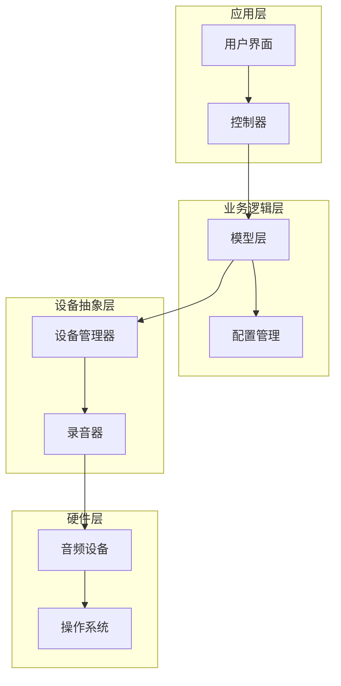
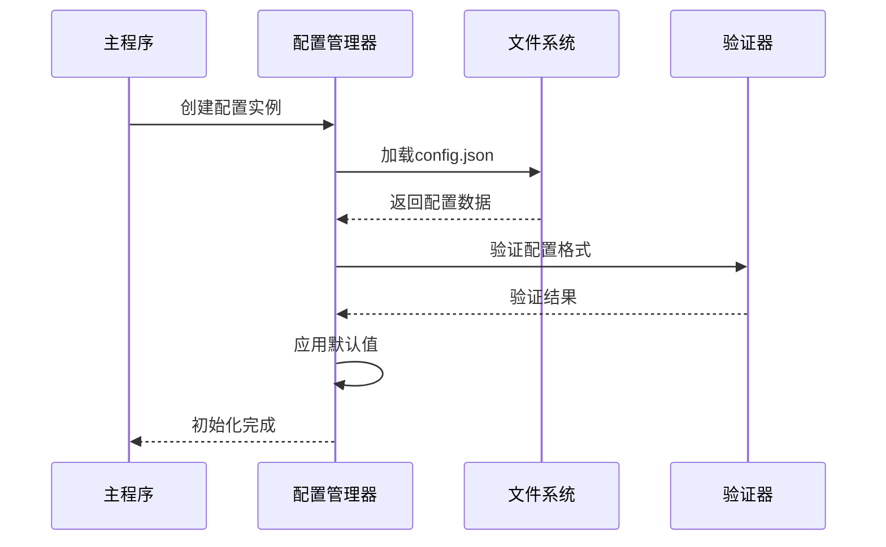
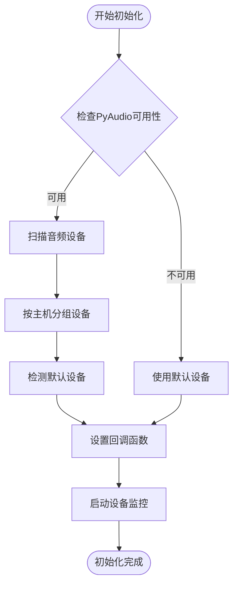
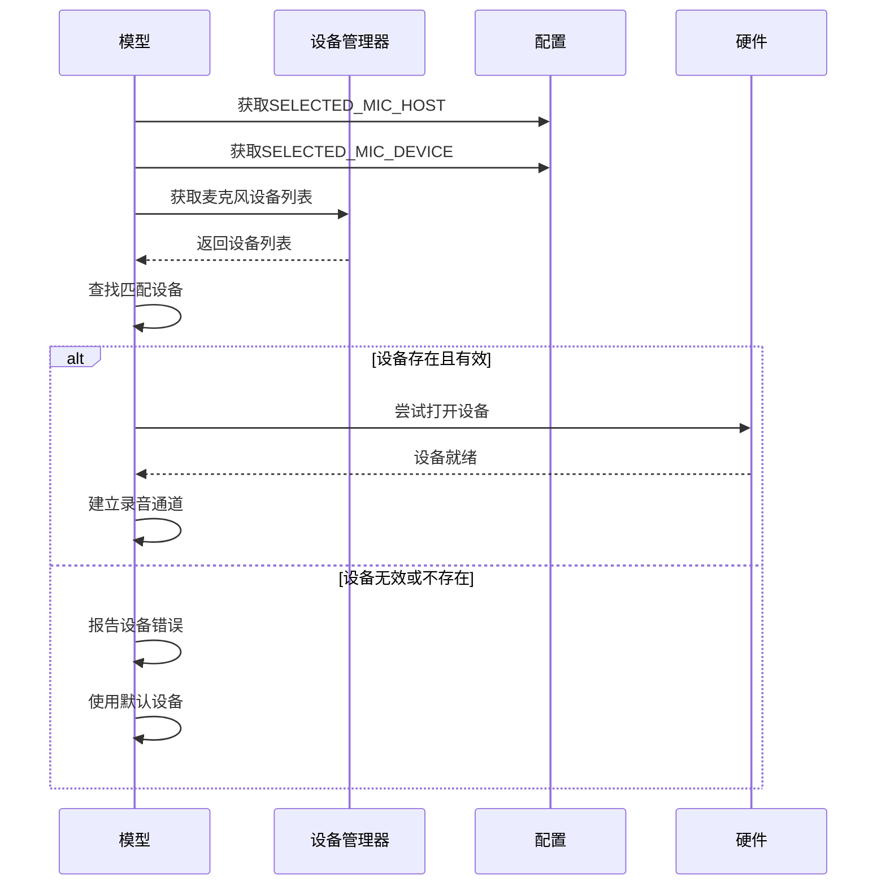
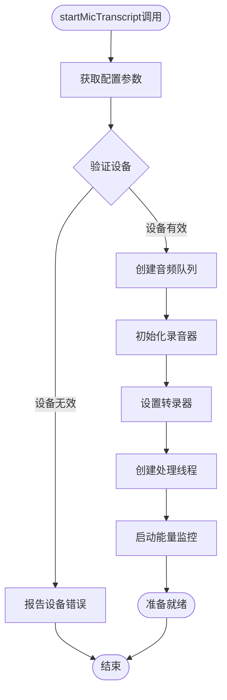
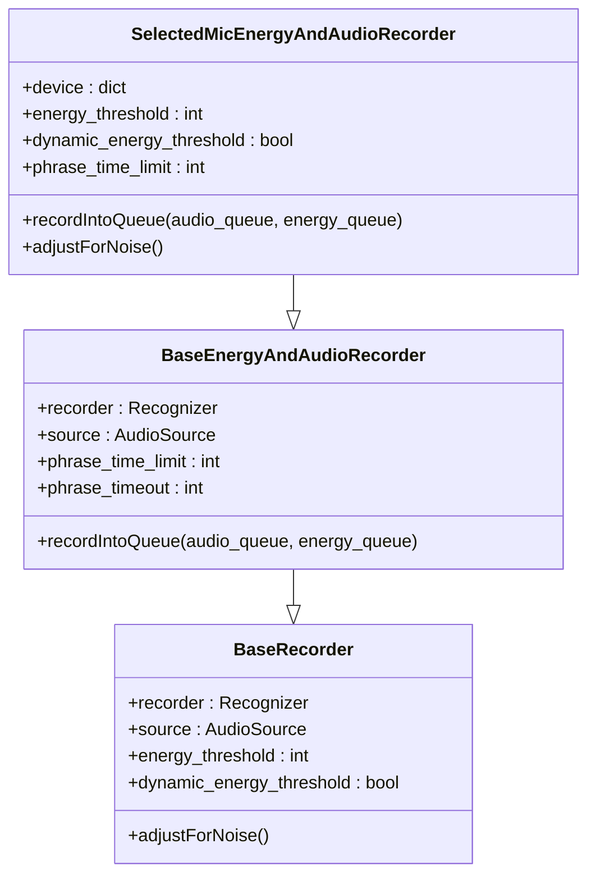
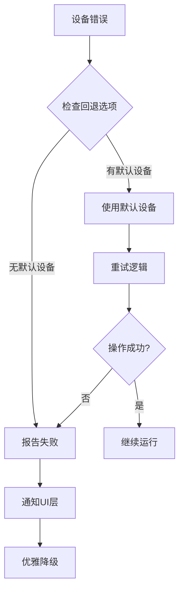
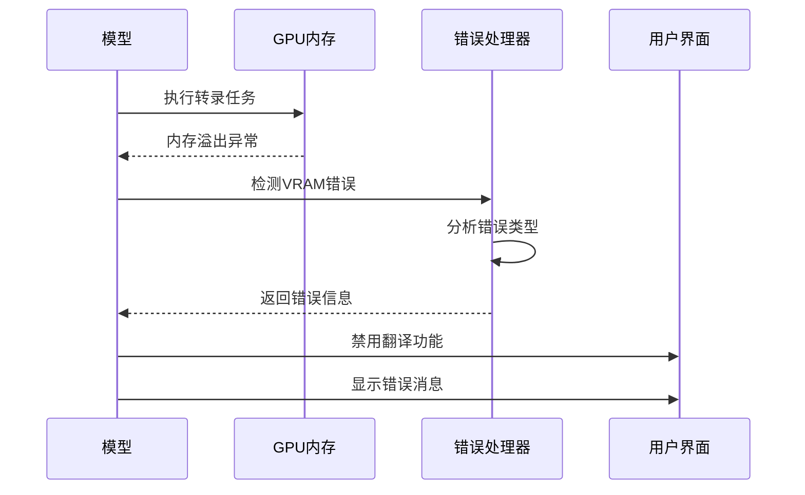
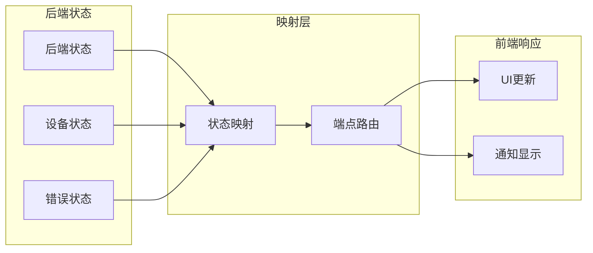

# 转录初始化

<cite>
**本文档引用的文件**
- [model.py](file://src-python/model.py)
- [controller.py](file://src-python/controller.py)
- [config.py](file://src-python/config.py)
- [mainloop.py](file://src-python/mainloop.py)
- [device_manager.py](file://src-python/device_manager.py)
- [transcription_recorder.py](file://src-python/models/transcription/transcription_recorder.py)
</cite>

## 目录
1. [概述](#概述)
2. [系统架构](#系统架构)
3. [配置初始化](#配置初始化)
4. [设备管理器初始化](#设备管理器初始化)
5. [麦克风转录初始化](#麦克风转录初始化)
6. [错误处理机制](#错误处理机制)
7. [UI状态映射](#ui状态映射)
8. [总结](#总结)

## 概述

VRCT项目的转录初始化是一个复杂的多阶段过程，涉及配置加载、设备发现、音频录制通道建立和状态同步等多个组件的协调工作。本文档详细阐述了从启动到麦克风转录功能完全可用的完整初始化流程。

## 系统架构

转录初始化系统采用分层架构设计，主要包含以下核心组件：

**图表来源**
- [controller.py](file://src-python/controller.py#L11-L50)
- [model.py](file://src-python/model.py#L81-L150)
- [device_manager.py](file://src-python/device_manager.py#L56-L120)

## 配置初始化

### 配置加载流程

配置初始化是整个转录系统的基础，通过`config.py`中的`Config`类实现：

**图表来源**
- [config.py](file://src-python/config.py#L531-L580)
- [mainloop.py](file://src-python/mainloop.py#L581-L583)

### 关键配置参数

系统使用多个关键配置参数来控制转录行为：

| 配置项 | 类型 | 默认值 | 描述 |
|--------|------|--------|------|
| SELECTED_MIC_HOST | String | "NoHost" | 当前选择的麦克风主机 |
| SELECTED_MIC_DEVICE | String | "NoDevice" | 当前选择的麦克风设备 |
| MIC_THRESHOLD | Integer | 100 | 麦克风能量阈值 |
| MIC_AUTOMATIC_THRESHOLD | Boolean | False | 是否启用自动能量阈值 |
| MIC_RECORD_TIMEOUT | Integer | 30 | 录音超时时间（秒） |
| MIC_PHRASE_TIMEOUT | Integer | 1 | 句子超时时间（秒） |

**章节来源**
- [config.py](file://src-python/config.py#L728-L735)
- [config.py](file://src-python/config.py#L640-L650)

## 设备管理器初始化

### 设备发现机制

设备管理器负责扫描和管理音频设备，通过`device_manager.py`实现：

**图表来源**
- [device_manager.py](file://src-python/device_manager.py#L140-L200)

### 设备验证流程

设备验证确保所选设备的有效性和可用性：

**图表来源**
- [model.py](file://src-python/model.py#L616-L626)
- [device_manager.py](file://src-python/device_manager.py#L140-L200)

**章节来源**
- [device_manager.py](file://src-python/device_manager.py#L56-L120)
- [model.py](file://src-python/model.py#L576-L604)

## 麦克风转录初始化

### startMicTranscript方法详解

`startMicTranscript`方法是转录初始化的核心入口，负责建立完整的音频录制和转录管道：

**图表来源**
- [model.py](file://src-python/model.py#L616-L703)

### 设备验证和选择

系统通过以下步骤验证和选择音频设备：

1. **主机验证**：检查`SELECTED_MIC_HOST`是否存在于设备列表中
2. **设备验证**：确认`SELECTED_MIC_DEVICE`在选定主机下存在
3. **回退机制**：如果设备无效，使用默认设备或报告错误

### 录音器初始化

SelectedMicEnergyAndAudioRecorder负责音频录制的核心功能：

**图表来源**
- [transcription_recorder.py](file://src-python/models/transcription/transcription_recorder.py#L149-L200)

### 能量阈值设置

系统支持两种能量阈值模式：

| 模式 | 描述 | 配置参数 |
|------|------|----------|
| 固定阈值 | 使用预设的能量阈值 | `MIC_THRESHOLD` |
| 动态阈值 | 根据环境噪声自动调整 | `MIC_AUTOMATIC_THRESHOLD` |

**章节来源**
- [model.py](file://src-python/model.py#L636-L642)
- [transcription_recorder.py](file://src-python/models/transcription/transcription_recorder.py#L149-L192)

## 错误处理机制

### 设备不可用处理

系统实现了多层次的错误处理机制：

**图表来源**
- [model.py](file://src-python/model.py#L624-L626)
- [controller.py](file://src-python/controller.py#L112-L119)

### VRAM内存溢出检测

系统能够检测和处理GPU内存不足的情况：

**图表来源**
- [model.py](file://src-python/model.py#L731-L740)

**章节来源**
- [model.py](file://src-python/model.py#L731-L740)
- [controller.py](file://src-python/controller.py#L112-L119)

## UI状态映射

### 映射机制

主循环通过映射机制将内部状态变化同步到UI层：

**图表来源**
- [mainloop.py](file://src-python/mainloop.py#L13-L76)
- [mainloop.py](file://src-python/mainloop.py#L85-L401)

### 状态报告流程

系统通过特定的端点向UI报告设备状态：

| 端点 | 用途 | 参数 |
|------|------|------|
| `/run/error_device` | 报告设备错误 | `{message, data}` |
| `/run/check_mic_volume` | 报告麦克风音量 | `energy_level` |
| `/run/initialization_complete` | 报告初始化完成 | `settings` |

**章节来源**
- [mainloop.py](file://src-python/mainloop.py#L13-L76)
- [controller.py](file://src-python/controller.py#L154-L169)

## 总结

VRCT项目的转录初始化是一个精心设计的多阶段过程，通过以下关键特性确保系统的稳定性和可靠性：

1. **模块化设计**：各组件职责明确，便于维护和扩展
2. **健壮的错误处理**：多层次的错误检测和恢复机制
3. **灵活的配置管理**：支持运行时配置修改和设备切换
4. **实时状态同步**：通过映射机制实现实时UI状态更新
5. **资源优化**：智能的设备选择和资源分配策略

这种设计使得VRCT能够在各种硬件环境下稳定运行，同时为用户提供流畅的转录体验。初始化过程的每个环节都经过精心设计，确保系统在面对各种异常情况时都能保持良好的用户体验。