# 转录处理流程

<cite>
**本文档引用的文件**
- [mainloop.py](file://src-python/mainloop.py)
- [controller.py](file://src-python/controller.py)
- [model.py](file://src-python/model.py)
- [utils.py](file://src-python/utils.py)
- [config.py](file://src-python/config.py)
- [transcription_recorder.py](file://src-python/models/transcription/transcription_recorder.py)
- [transcription_transcriber.py](file://src-python/models/transcription/transcription_transcriber.py)
- [transcription_whisper.py](file://src-python/models/transcription/transcription_whisper.py)
</cite>

## 目录
1. [系统概述](#系统概述)
2. [核心组件架构](#核心组件架构)
3. [主循环协调机制](#主循环协调机制)
4. [转录生命周期控制](#转录生命周期控制)
5. [音频处理流水线](#音频处理流水线)
6. [数据流向分析](#数据流向分析)
7. [异常处理与资源清理](#异常处理与资源清理)
8. [性能监控与优化](#性能监控与优化)
9. [总结](#总结)

## 系统概述

VRCT系统实现了一个完整的从音频输入到文本输出的转录流水线，支持实时语音识别、多语言翻译和消息转发功能。系统采用模块化设计，通过主循环协调各个组件的工作，确保音频采集、处理、识别和输出的流畅运行。

### 核心功能特性

- **双模式转录**：支持麦克风输入（发送）和系统音频回放（接收）两种模式
- **多引擎识别**：集成Google Speech Recognition和Whisper本地模型
- **实时处理**：基于队列的异步处理架构，支持低延迟音频识别
- **多语言支持**：支持多种语言的语音识别和翻译
- **设备管理**：动态音频设备检测和配置

## 核心组件架构

系统由以下核心组件构成：

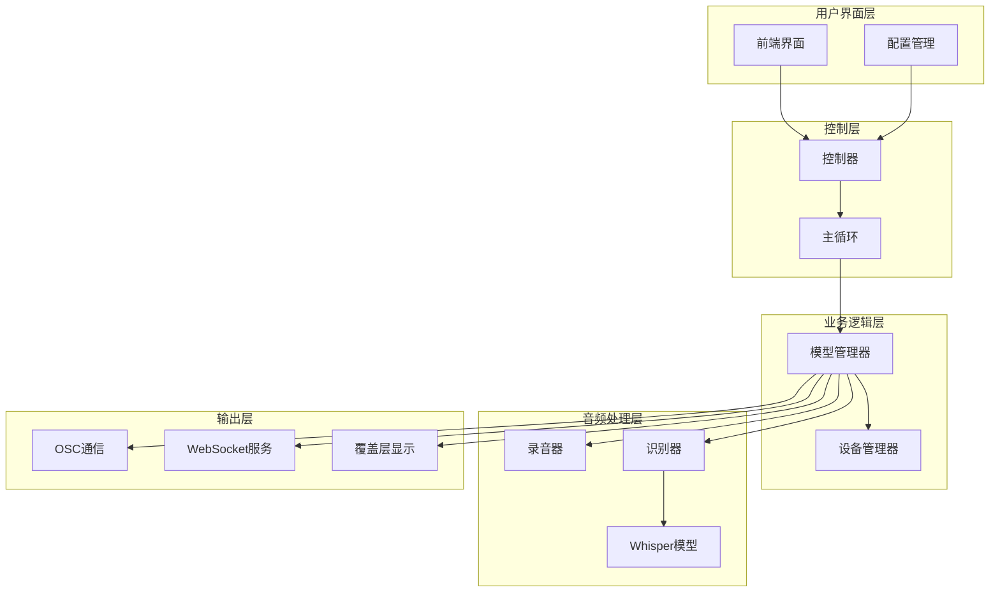

**图表来源**
- [mainloop.py](file://src-python/mainloop.py#L408-L588)
- [controller.py](file://src-python/controller.py#L11-L800)
- [model.py](file://src-python/model.py#L81-L800)

**章节来源**
- [mainloop.py](file://src-python/mainloop.py#L1-L588)
- [controller.py](file://src-python/controller.py#L1-L800)
- [model.py](file://src-python/model.py#L1-L800)

## 主循环协调机制

主循环是整个系统的核心调度器，负责协调各个组件的协同工作。它采用事件驱动的架构，通过队列机制实现异步处理。

### 主循环架构

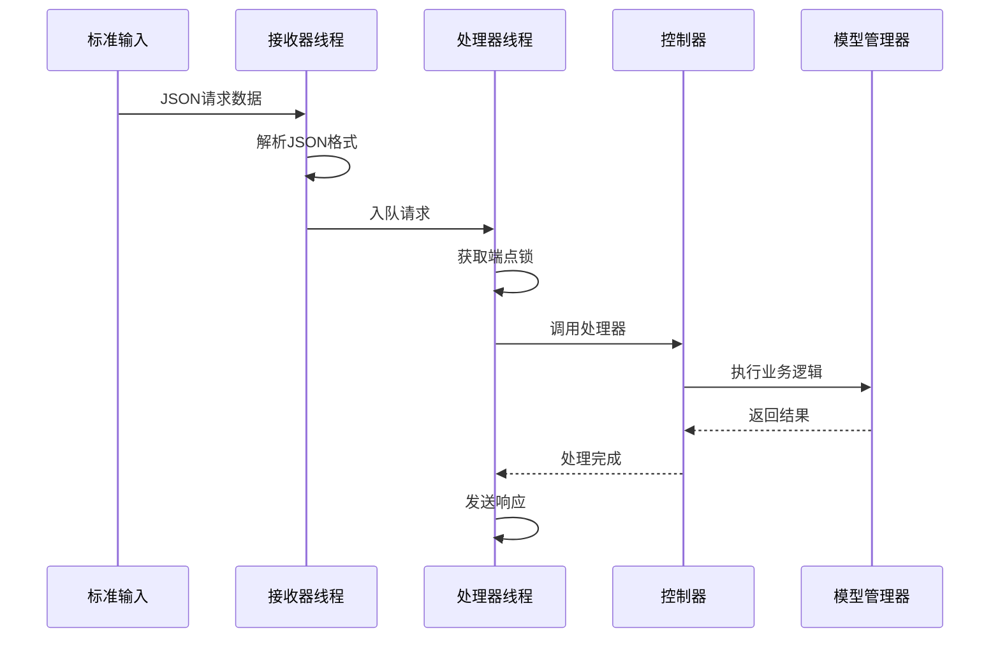

**图表来源**
- [mainloop.py](file://src-python/mainloop.py#L439-L546)

### 锁机制与并发控制

主循环实现了细粒度的锁机制来防止同一功能的并发执行：

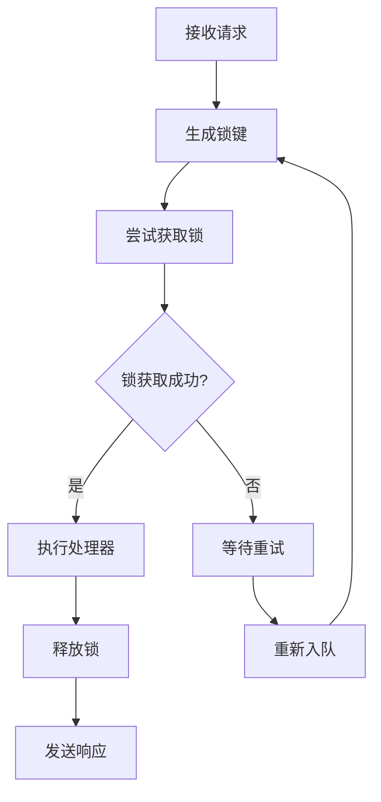

**图表来源**
- [mainloop.py](file://src-python/mainloop.py#L418-L438)

**章节来源**
- [mainloop.py](file://src-python/mainloop.py#L408-L588)

## 转录生命周期控制

转录功能的生命周期通过控制器中的专门方法进行管理，主要包括启动和停止两个核心操作。

### startMicTranscription方法

该方法负责启动麦克风转录功能，建立完整的音频处理流水线：

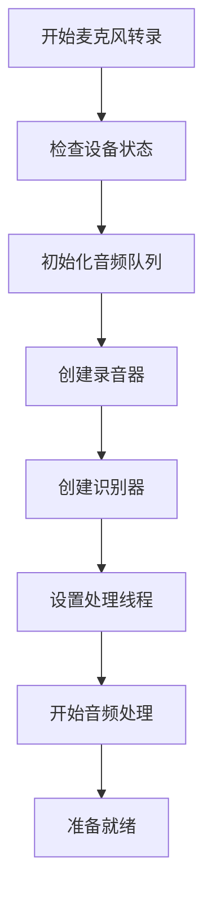

**图表来源**
- [controller.py](file://src-python/controller.py#L2519-L2552)
- [model.py](file://src-python/model.py#L616-L704)

### stopMicTranscription方法

该方法负责优雅地停止转录功能，确保所有资源得到正确清理：

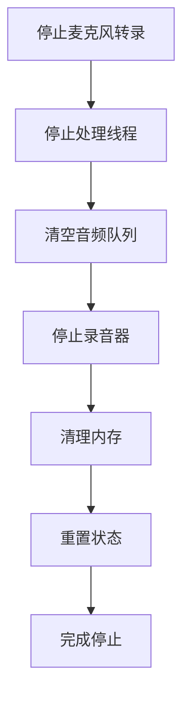

**图表来源**
- [controller.py](file://src-python/controller.py#L2553-L2556)
- [model.py](file://src-python/model.py#L755-L768)

**章节来源**
- [controller.py](file://src-python/controller.py#L2519-L2610)
- [model.py](file://src-python/model.py#L616-L768)

## 音频处理流水线

音频处理流水线是系统的核心，负责从原始音频到文本输出的完整转换过程。

### 录音器组件

录音器负责捕获音频数据并将其推送到队列中：

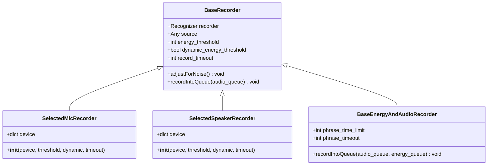

**图表来源**
- [transcription_recorder.py](file://src-python/models/transcription/transcription_recorder.py#L14-L200)

### 识别器组件

识别器负责将音频数据转换为文本：

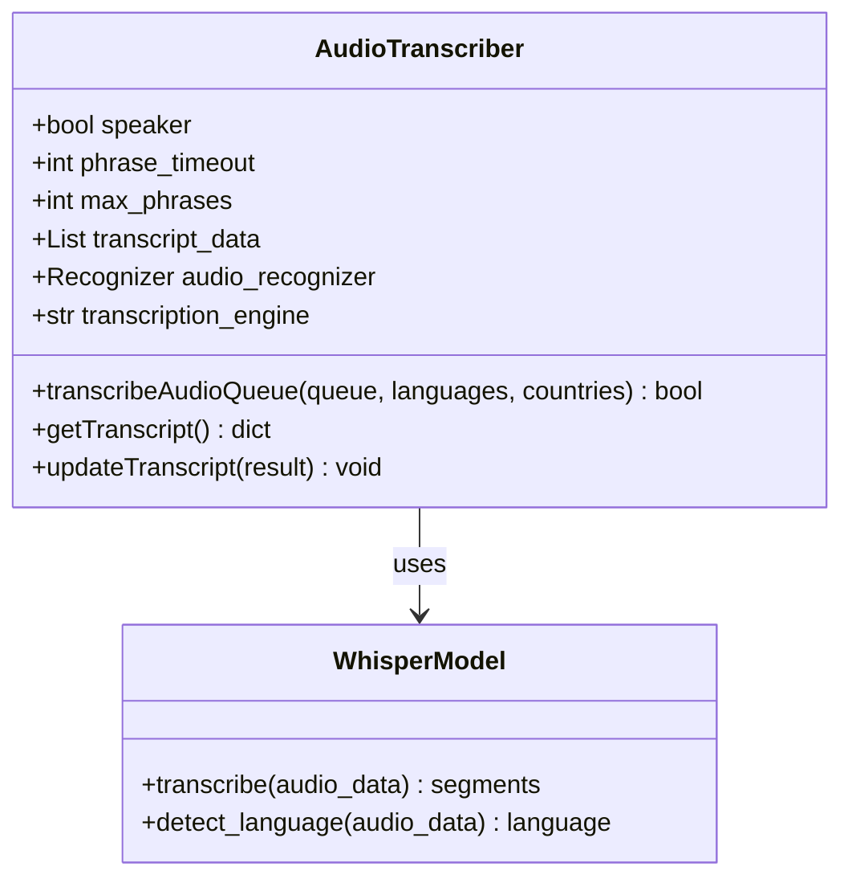

**图表来源**
- [transcription_transcriber.py](file://src-python/models/transcription/transcription_transcriber.py#L31-L200)

### 音频格式转换

系统支持多种音频格式的转换和处理：

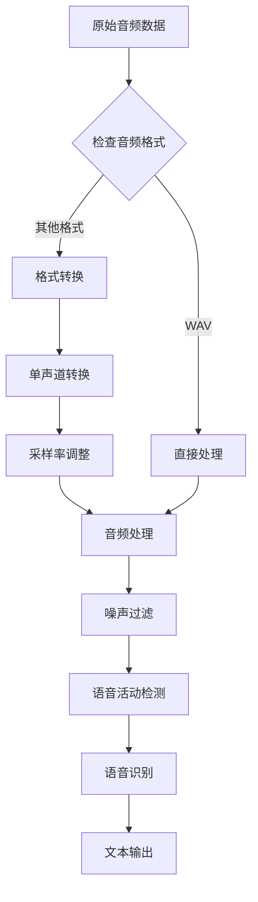

**图表来源**
- [transcription_transcriber.py](file://src-python/models/transcription/transcription_transcriber.py#L173-L197)

**章节来源**
- [transcription_recorder.py](file://src-python/models/transcription/transcription_recorder.py#L1-L200)
- [transcription_transcriber.py](file://src-python/models/transcription/transcription_transcriber.py#L1-L200)

## 数据流向分析

当启用ENABLE_TRANSCRIPTION_SEND时，系统会按照以下流程处理音频数据：

### 完整数据流图

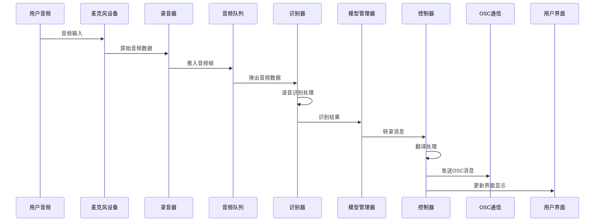

**图表来源**
- [model.py](file://src-python/model.py#L656-L677)
- [controller.py](file://src-python/controller.py#L2519-L2552)

### 关键处理节点

1. **音频采集阶段**
   - 麦克风设备捕获用户音频
   - 录音器进行预处理和阈值检测
   - 音频数据被推入共享队列

2. **识别处理阶段**
   - 识别器从队列中获取音频数据
   - 根据配置的语言列表进行多语言识别
   - 使用Google Speech或Whisper模型进行语音识别

3. **后处理阶段**
   - 结果经过质量评估和过滤
   - 进行翻译和转写处理
   - 格式化最终的消息内容

**章节来源**
- [model.py](file://src-python/model.py#L616-L704)
- [controller.py](file://src-python/controller.py#L2519-L2552)

## 异常处理与资源清理

系统实现了完善的异常处理机制和资源清理流程，确保在各种异常情况下都能正确恢复。

### VRAM溢出检测

系统能够检测和处理GPU内存不足的情况：

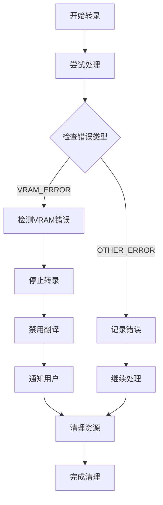

**图表来源**
- [model.py](file://src-python/model.py#L731-L751)
- [controller.py](file://src-python/controller.py#L2526-L2549)

### 资源清理流程

当转录功能异常中断时，系统会执行以下清理步骤：

1. **线程终止**：停止所有音频处理线程
2. **队列清理**：清空音频和结果队列
3. **设备释放**：释放音频设备访问权限
4. **内存回收**：触发垃圾回收机制
5. **状态重置**：重置相关状态变量

**章节来源**
- [model.py](file://src-python/model.py#L731-L768)
- [controller.py](file://src-python/controller.py#L2526-L2599)

## 性能监控与优化

系统提供了多层次的性能监控和优化机制：

### 日志记录系统

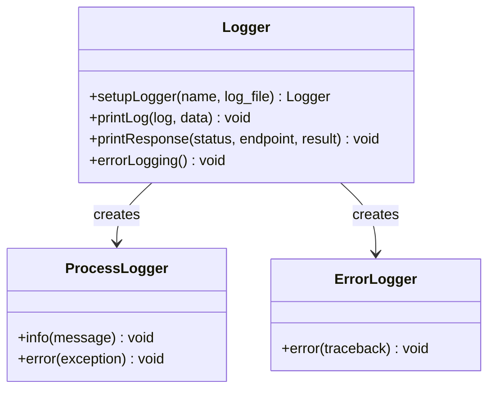

**图表来源**
- [utils.py](file://src-python/utils.py#L227-L292)

### 性能指标监控

- **音频延迟监控**：跟踪从音频采集到文本输出的总延迟
- **识别准确率统计**：记录不同语言和场景下的识别成功率
- **资源使用监控**：监控CPU、GPU和内存使用情况
- **错误率统计**：统计各类错误的发生频率和类型

**章节来源**
- [utils.py](file://src-python/utils.py#L227-L292)

## 总结

VRCT系统的转录处理流程体现了现代语音识别系统的最佳实践：

1. **模块化设计**：清晰的组件分离使得系统易于维护和扩展
2. **异步处理**：基于队列的异步架构确保了系统的响应性和稳定性
3. **容错机制**：完善的异常处理和资源清理确保了系统的健壮性
4. **性能优化**：多层次的监控和优化机制保证了良好的用户体验

该系统为实时语音识别应用提供了一个完整、可靠的技术解决方案，适用于各种需要高质量语音转录的场景。