# 转录执行

<cite>
**本文档中引用的文件**
- [transcription_transcriber.py](file://src-python/models/transcription/transcription_transcriber.py)
- [config.py](file://src-python/config.py)
- [mainloop.py](file://src-python/mainloop.py)
- [utils.py](file://src-python/utils.py)
- [transcription_languages.py](file://src-python/models/transcription/transcription_languages.py)
- [controller.py](file://src-python/controller.py)
- [model.py](file://src-python/model.py)
</cite>

## 目录
1. [概述](#概述)
2. [系统架构](#系统架构)
3. [核心组件分析](#核心组件分析)
4. [转录执行流程](#转录执行流程)
5. [多语言识别机制](#多语言识别机制)
6. [VAD过滤与质量控制](#vad过滤与质量控制)
7. [性能监控与时序控制](#性能监控与时序控制)
8. [错误处理与恢复](#错误处理与恢复)
9. [总结](#总结)

## 概述

VRCT项目的转录执行阶段是一个复杂的音频处理系统，负责将实时音频流转换为文本。该系统采用模块化设计，支持多种语音识别引擎（Google Web Speech Recognition和Whisper），具备多语言识别能力，并实现了智能的质量控制和性能监控机制。

核心功能包括：
- 音频队列处理与实时转录
- 多引擎语音识别支持
- 多语言自动检测与识别
- VAD（Voice Activity Detection）过滤
- 性能监控与延迟控制
- 错误处理与系统恢复

## 系统架构

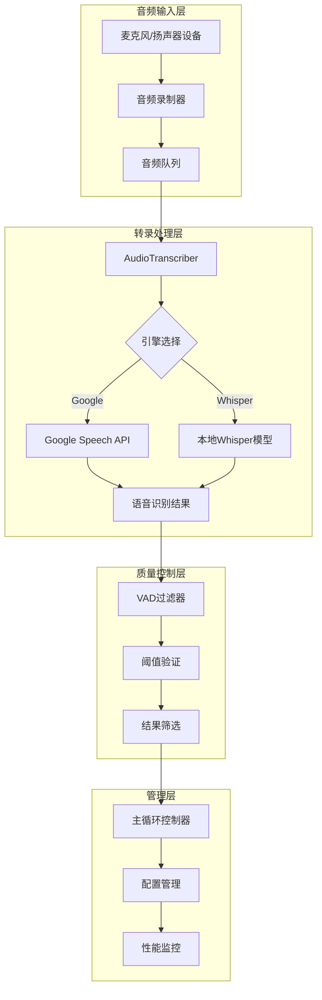

**图表来源**
- [transcription_transcriber.py](file://src-python/models/transcription/transcription_transcriber.py#L31-L220)
- [mainloop.py](file://src-python/mainloop.py#L408-L588)

## 核心组件分析

### AudioTranscriber类

AudioTranscriber是转录系统的核心类，负责音频数据的处理和语音识别的执行。

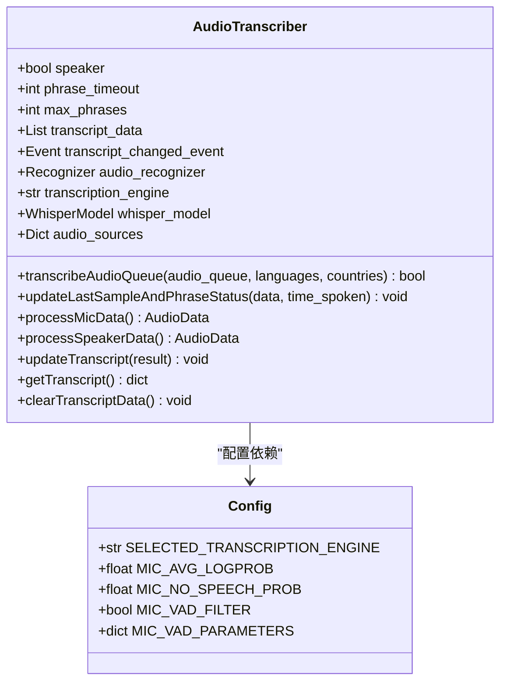

**图表来源**
- [transcription_transcriber.py](file://src-python/models/transcription/transcription_transcriber.py#L31-L220)
- [config.py](file://src-python/config.py#L680-L710)

**章节来源**
- [transcription_transcriber.py](file://src-python/models/transcription/transcription_transcriber.py#L31-L220)
- [config.py](file://src-python/config.py#L680-L710)

### 配置管理系统

配置系统通过Config类管理所有转录相关的参数，支持运行时动态调整。

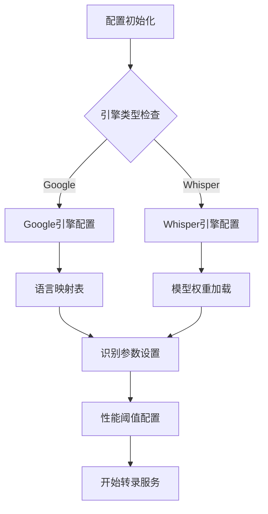

**图表来源**
- [config.py](file://src-python/config.py#L680-L710)
- [transcription_languages.py](file://src-python/models/transcription/transcription_languages.py#L6-L735)

**章节来源**
- [config.py](file://src-python/config.py#L680-L710)
- [transcription_languages.py](file://src-python/models/transcription/transcription_languages.py#L6-L735)

## 转录执行流程

### transcribeAudioQueue方法详解

transcribeAudioQueue是转录系统的核心方法，负责从音频队列中获取数据并进行语音识别。

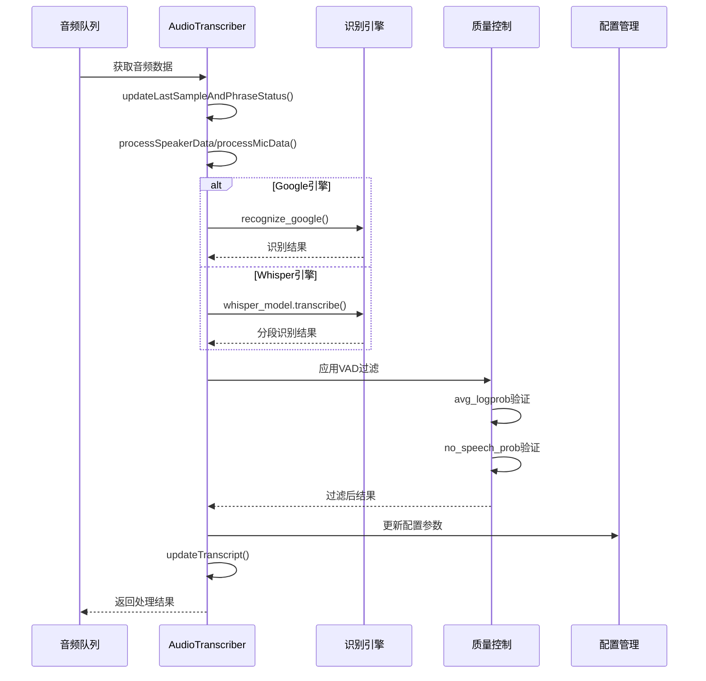

**图表来源**
- [transcription_transcriber.py](file://src-python/models/transcription/transcription_transcriber.py#L80-L160)

#### 方法参数与配置

| 参数名称 | 类型 | 默认值 | 描述 |
|---------|------|--------|------|
| audio_queue | Queue | 必需 | 包含音频数据的队列 |
| languages | List[str] | 必需 | 识别目标语言列表 |
| countries | List[str] | 必需 | 对应国家/地区代码 |
| avg_logprob | float | -0.8 | Whisper平均对数概率阈值 |
| no_speech_prob | float | 0.6 | 无语音检测阈值 |
| no_repeat_ngram_size | int | 0 | 防重复ngram大小 |
| vad_filter | bool | False | 是否启用VAD过滤 |
| vad_parameters | dict | None | VAD过滤参数 |

**章节来源**
- [transcription_transcriber.py](file://src-python/models/transcription/transcription_transcriber.py#L80-L160)

### 引擎选择机制

系统根据config.py中的SELECTED_TRANSCRIPTION_ENGINE配置动态选择识别引擎：

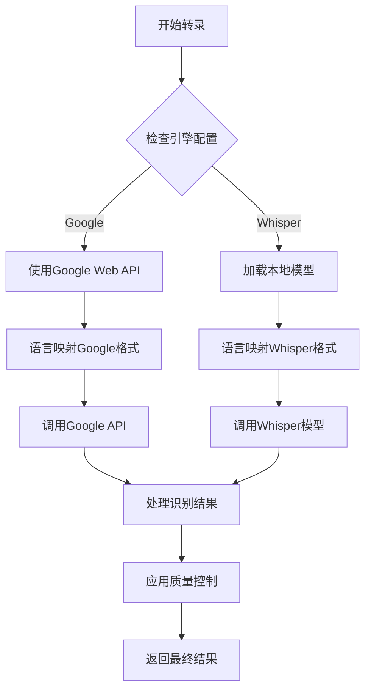

**图表来源**
- [transcription_transcriber.py](file://src-python/models/transcription/transcription_transcriber.py#L74-L89)
- [transcription_languages.py](file://src-python/models/transcription/transcription_languages.py#L6-L735)

**章节来源**
- [transcription_transcriber.py](file://src-python/models/transcription/transcription_transcriber.py#L74-L89)
- [transcription_languages.py](file://src-python/models/transcription/transcription_languages.py#L6-L735)

## 多语言识别机制

### 语言映射系统

系统维护了一个完整的语言映射表，支持Google和Whisper两种引擎的语言代码转换。

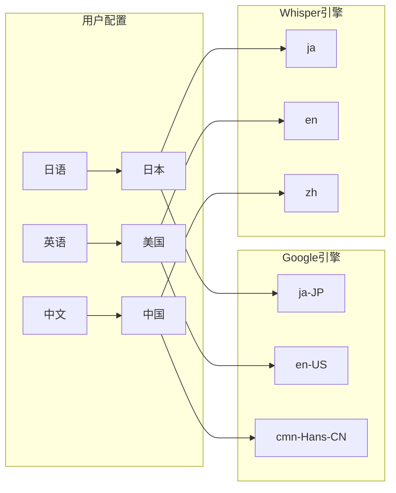

**图表来源**
- [transcription_languages.py](file://src-python/models/transcription/transcription_languages.py#L152-L165)

### 多语言处理流程

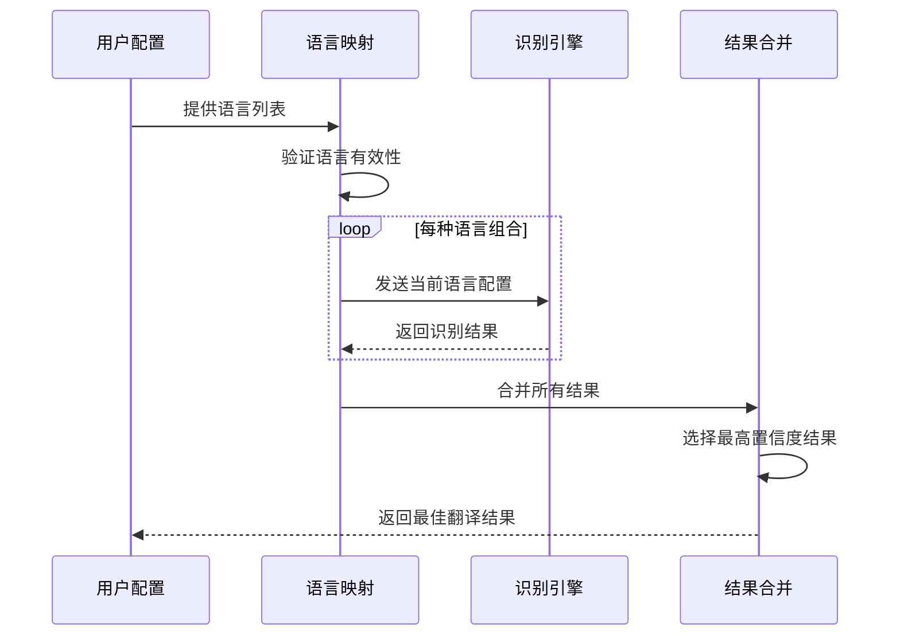

**图表来源**
- [transcription_transcriber.py](file://src-python/models/transcription/transcription_transcriber.py#L102-L111)
- [transcription_transcriber.py](file://src-python/models/transcription/transcription_transcriber.py#L119-L148)

**章节来源**
- [transcription_languages.py](file://src-python/models/transcription/transcription_languages.py#L6-L735)
- [transcription_transcriber.py](file://src-python/models/transcription/transcription_transcriber.py#L102-L148)

## VAD过滤与质量控制

### VAD过滤机制

Voice Activity Detection（VAD）过滤器用于识别和过滤掉非语音信号，提高识别质量。

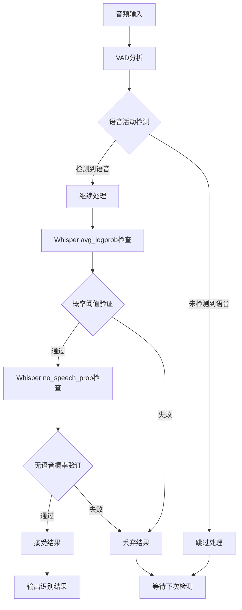

**图表来源**
- [transcription_transcriber.py](file://src-python/models/transcription/transcription_transcriber.py#L140-L144)

### 质量控制参数

| 参数名称 | 默认值 | 描述 | 影响 |
|---------|--------|------|------|
| avg_logprob | -0.8 | 平均对数概率阈值 | 控制识别准确性 |
| no_speech_prob | 0.6 | 无语音检测阈值 | 过滤静音和噪音 |
| no_repeat_ngram_size | 0 | 防重复ngram大小 | 避免重复内容 |

**章节来源**
- [transcription_transcriber.py](file://src-python/models/transcription/transcription_transcriber.py#L85-L88)
- [controller.py](file://src-python/controller.py#L1288-L1303)

## 性能监控与时序控制

### 主循环协调机制

mainloop.py中的Main类负责协调整个系统的时序和资源管理。

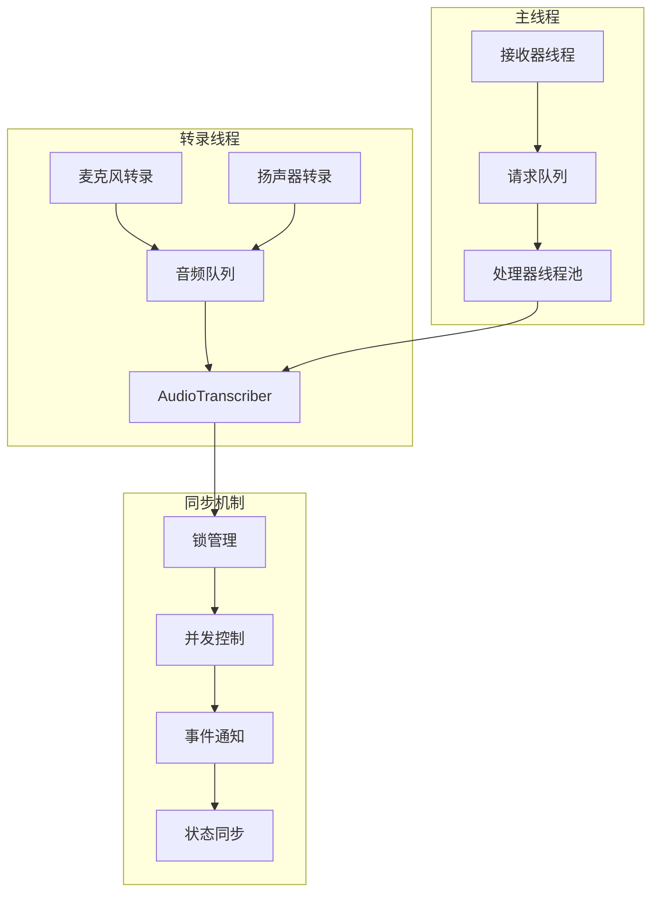

**图表来源**
- [mainloop.py](file://src-python/mainloop.py#L408-L588)

### 性能监控工具

utils.py提供了多种性能监控功能：

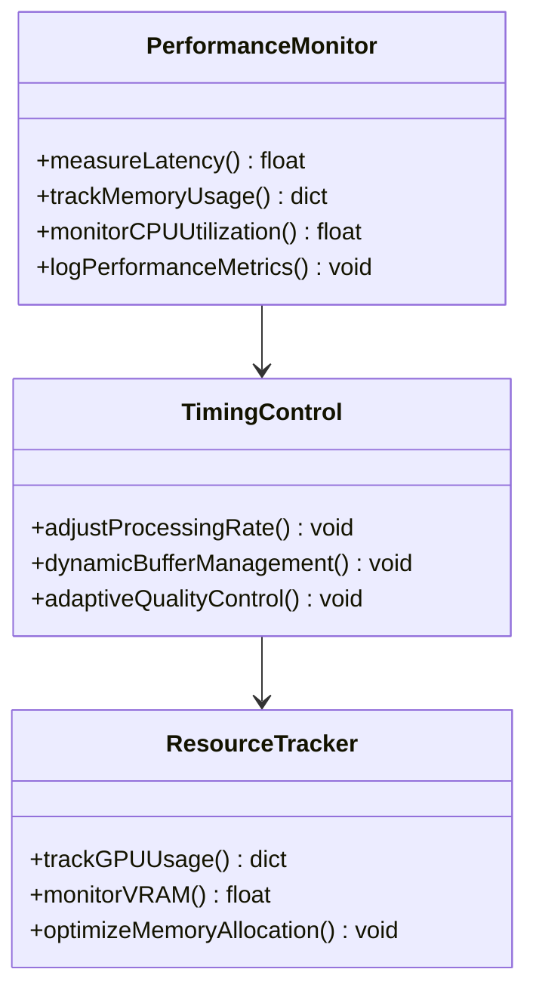

**图表来源**
- [utils.py](file://src-python/utils.py#L1-L293)

**章节来源**
- [mainloop.py](file://src-python/mainloop.py#L408-L588)
- [utils.py](file://src-python/utils.py#L1-L293)

## 错误处理与恢复

### 异常处理策略

系统实现了多层次的异常处理机制：

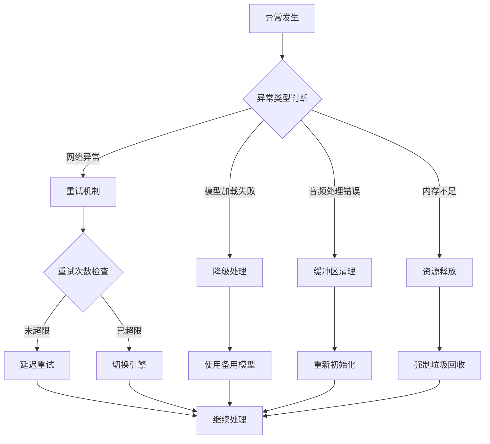

**图表来源**
- [transcription_transcriber.py](file://src-python/models/transcription/transcription_transcriber.py#L150-L153)
- [utils.py](file://src-python/utils.py#L280-L291)

### 自动恢复机制

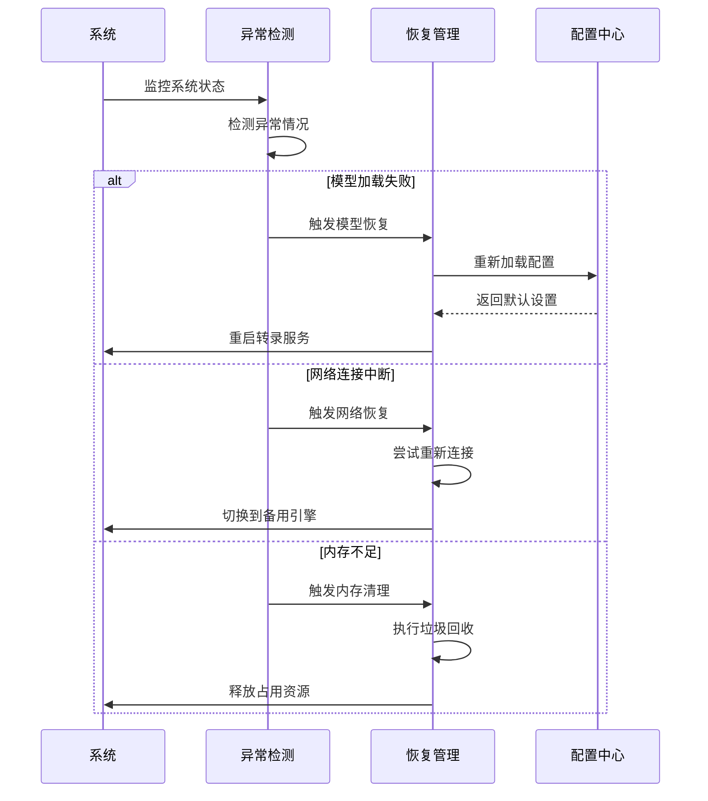

**图表来源**
- [model.py](file://src-python/model.py#L731-L738)
- [controller.py](file://src-python/controller.py#L1275-L1310)

**章节来源**
- [transcription_transcriber.py](file://src-python/models/transcription/transcription_transcriber.py#L150-L153)
- [utils.py](file://src-python/utils.py#L280-L291)
- [model.py](file://src-python/model.py#L731-L738)

## 总结

VRCT项目的转录执行阶段展现了现代语音识别系统的复杂性和精密性。通过AudioTranscriber类的核心处理、灵活的引擎选择机制、完善的多语言支持、智能的质量控制和强大的性能监控，系统能够高效准确地处理各种音频转录任务。

### 关键特性

1. **双引擎支持**：同时支持Google Web API和本地Whisper模型，提供灵活性和可靠性
2. **智能质量控制**：通过VAD过滤和阈值验证确保识别质量
3. **多语言处理**：完整的语言映射系统支持全球主要语言
4. **性能优化**：实时性能监控和自适应调整机制
5. **容错能力**：多层次异常处理和自动恢复机制

### 技术优势

- **模块化设计**：清晰的组件分离便于维护和扩展
- **异步处理**：多线程架构确保系统响应性
- **资源管理**：智能的内存和计算资源管理
- **配置驱动**：灵活的配置系统支持运行时调整

该系统为VRCT项目提供了坚实的语音识别基础，能够满足各种应用场景的需求，从简单的实时转录到复杂的多语言对话处理。