# VRCT能量监控机制深度解析

<cite>
**本文档引用的文件**
- [transcription_recorder.py](file://src-python/models/transcription/transcription_recorder.py)
- [config.py](file://src-python/config.py)
- [model.py](file://src-python/model.py)
- [controller.py](file://src-python/controller.py)
- [device_manager.py](file://src-python/device_manager.py)
- [transcription_recorder.md](file://src-python/docs/details/transcription_recorder.md)
</cite>

## 目录
1. [引言](#引言)
2. [系统架构概览](#系统架构概览)
3. [BaseEnergyRecorder核心机制](#baseenergyrecorder核心机制)
4. [音频源分离的能量监控](#音频源分离的能量监控)
5. [能量队列与音频队列同步](#能量队列与音频队列同步)
6. [动态阈值调整算法](#动态阈值调整算法)
7. [配置参数详解](#配置参数详解)
8. [性能优化策略](#性能优化策略)
9. [故障排除指南](#故障排除指南)
10. [总结](#总结)

## 引言

VRCT（Virtual Reality Communication Tool）的能量监控机制是一个精密设计的音频信号处理系统，专门用于实时监测语音活动检测（VAD）过程中的音频能量变化。该系统通过SpeechRecognition库的`listen_energy_in_background`方法，实现了对麦克风和扬声器音频输入的独立能量监控，为语音识别提供了精确的触发控制。

本文档将深入探讨VRCT中能量监控机制的技术实现细节，包括BaseEnergyRecorder类的设计理念、不同音频源的能量流管理、动态阈值调整算法以及系统级的性能优化策略。

## 系统架构概览

VRCT的能量监控系统采用分层架构设计，主要包含以下核心组件：

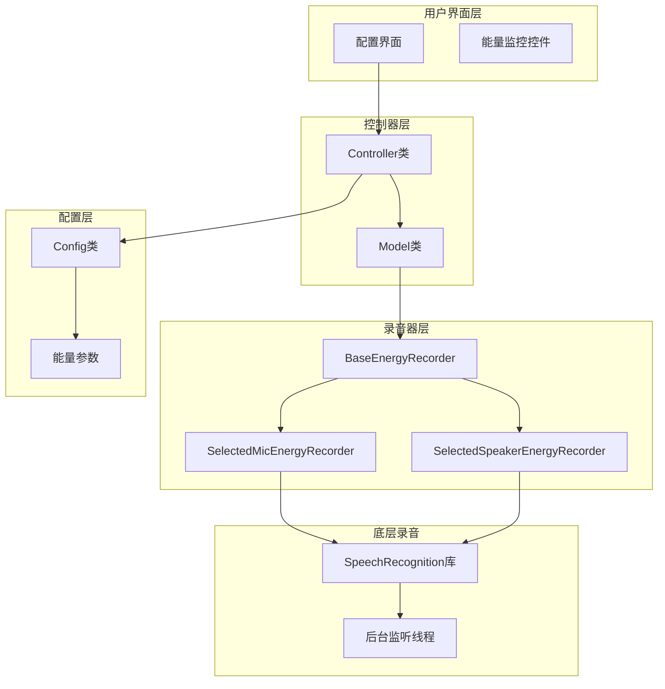

**图表来源**
- [controller.py](file://src-python/controller.py#L2319-L2744)
- [model.py](file://src-python/model.py#L769-L948)
- [transcription_recorder.py](file://src-python/models/transcription/transcription_recorder.py#L84-L264)

**章节来源**
- [controller.py](file://src-python/controller.py#L2319-L2744)
- [model.py](file://src-python/model.py#L769-L948)

## BaseEnergyRecorder核心机制

### 类设计原理

BaseEnergyRecorder是整个能量监控系统的核心基类，它继承自Recognizer类并专门针对能量监控进行了优化。该类的设计遵循了单一职责原则，专注于提供高效的后台能量监听功能。

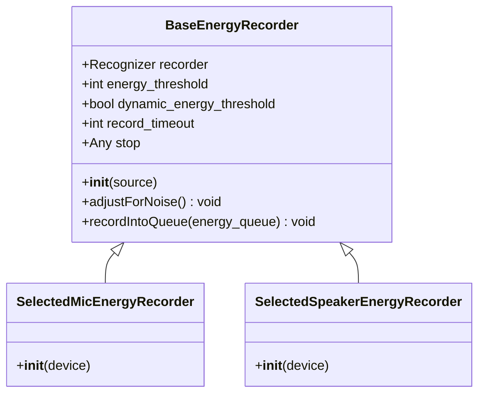

**图表来源**
- [transcription_recorder.py](file://src-python/models/transcription/transcription_recorder.py#L84-L148)

### listen_energy_in_background方法详解

BaseEnergyRecorder的核心功能通过SpeechRecognition库的`listen_energy_in_background`方法实现。这个方法的特点包括：

1. **非阻塞监听**：在后台线程中持续监听音频输入
2. **实时回调**：每当检测到音频能量变化时立即触发回调函数
3. **资源管理**：自动管理音频设备的打开和关闭

回调函数的实现采用了闭包模式，确保了能量数据能够准确地传递到指定的队列中：

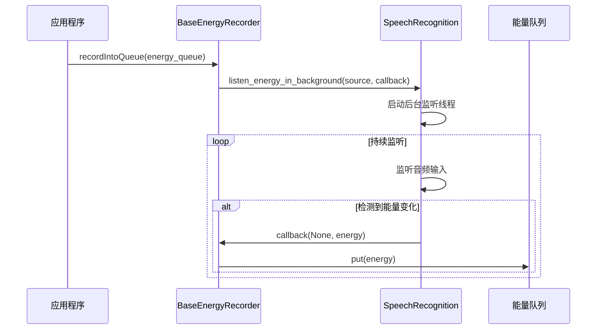

**图表来源**
- [transcription_recorder.py](file://src-python/models/transcription/transcription_recorder.py#L101-L105)

**章节来源**
- [transcription_recorder.py](file://src-python/models/transcription/transcription_recorder.py#L84-L148)

## 音频源分离的能量监控

### SelectedMicEnergyRecorder实现

SelectedMicEnergyRecorder专门负责麦克风音频源的能量监控。它通过设备配置参数创建合适的Microphone实例，并确保设备索引的有效性：

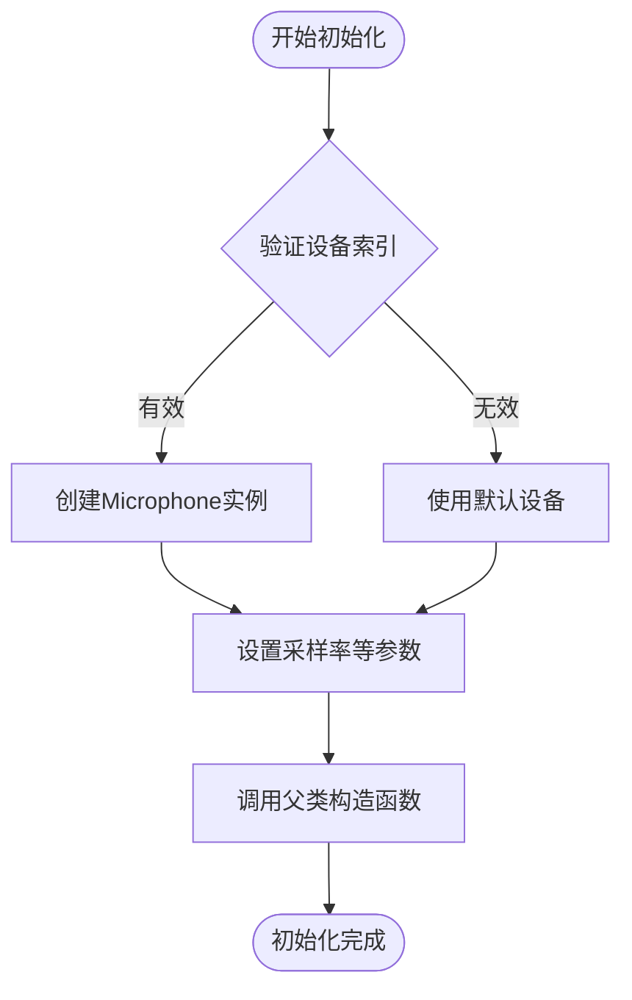

**图表来源**
- [transcription_recorder.py](file://src-python/models/transcription/transcription_recorder.py#L108-L125)

### SelectedSpeakerEnergyRecorder实现

SelectedSpeakerEnergyRecorder处理扬声器音频源的监控，特别支持回环录制（Loopback Recording）功能：

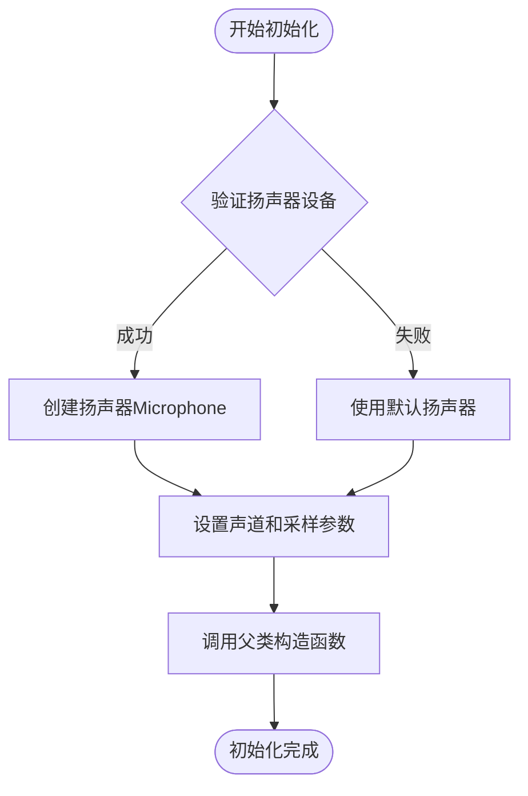

**图表来源**
- [transcription_recorder.py](file://src-python/models/transcription/transcription_recorder.py#L128-L148)

### 独立能量流的优势

两种不同的能量监控器为系统带来了显著优势：

1. **隔离性**：麦克风和扬声器的能量监控互不干扰
2. **灵活性**：可以独立配置各自的阈值和参数
3. **准确性**：避免了混音导致的能量测量误差

**章节来源**
- [transcription_recorder.py](file://src-python/models/transcription/transcription_recorder.py#L108-L148)

## 能量队列与音频队列同步

### 同步机制设计

VRCT采用多队列架构来管理不同类型的数据流。虽然当前实现中某些队列被注释掉，但系统设计支持同时进行音频录制和能量监控：

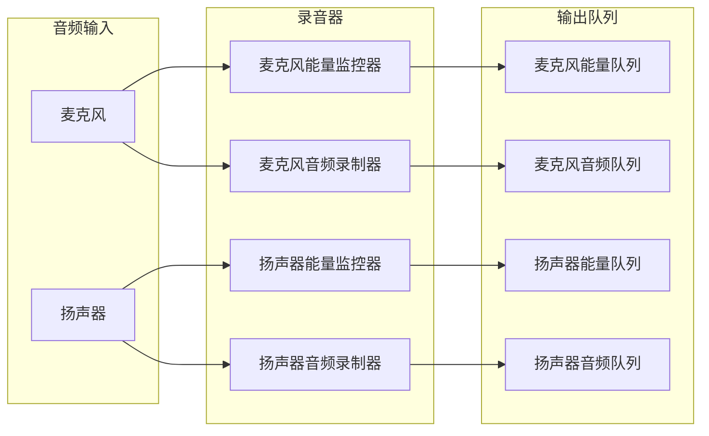

**图表来源**
- [model.py](file://src-python/model.py#L636-L643)
- [model.py](file://src-python/model.py#L831-L838)

### 数据流处理

系统通过后台线程处理队列中的数据，确保不会阻塞主应用程序：

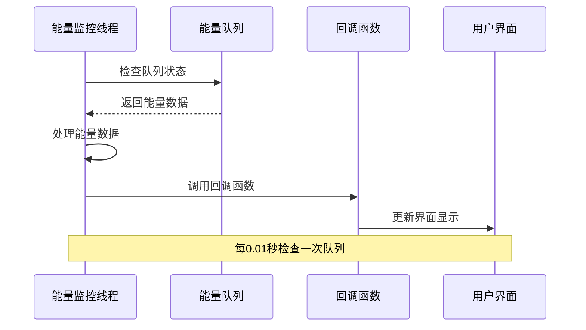

**图表来源**
- [model.py](file://src-python/model.py#L784-L791)
- [model.py](file://src-python/model.py#L925-L932)

**章节来源**
- [model.py](file://src-python/model.py#L784-L791)
- [model.py](file://src-python/model.py#L925-L932)

## 动态阈值调整算法

### 自动阈值调节机制

VRCT支持动态能量阈值调整，这是通过SpeechRecognition库的`dynamic_energy_threshold`参数实现的。当启用此功能时，系统会自动计算环境噪声水平并相应调整阈值。

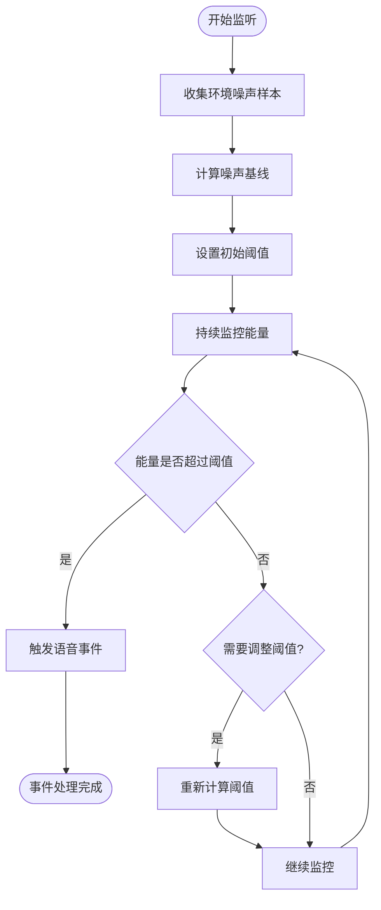

**图表来源**
- [config.py](file://src-python/config.py#L641-L642)
- [model.py](file://src-python/model.py#L638-L639)

### 阈值调整策略

系统采用渐进式阈值调整策略，避免因环境变化导致的频繁触发：

1. **噪声基线校准**：在静默期收集足够的噪声样本
2. **平滑调整**：阈值变化采用指数移动平均算法
3. **响应时间控制**：设置合理的调整延迟以避免抖动

**章节来源**
- [config.py](file://src-python/config.py#L641-L642)
- [model.py](file://src-python/model.py#L638-L639)

## 配置参数详解

### 核心配置参数

VRCT提供了丰富的配置选项来微调能量监控行为：

| 参数名称 | 类型 | 默认值 | 取值范围 | 描述 |
|---------|------|--------|----------|------|
| MIC_THRESHOLD | int | 0 | 0-2000 | 麦克风静态能量阈值 |
| MIC_AUTOMATIC_THRESHOLD | bool | False | - | 是否启用自动阈值调整 |
| SPEAKER_THRESHOLD | int | 0 | 0-4000 | 扬声器静态能量阈值 |
| SPEAKER_AUTOMATIC_THRESHOLD | bool | False | - | 是否启用扬声器自动阈值调整 |
| MIC_RECORD_TIMEOUT | int | 5 | 1-30 | 麦克风录音超时时间 |
| MIC_PHRASE_TIMEOUT | int | 1 | 1-10 | 麦克风短语超时时间 |

### 参数影响分析

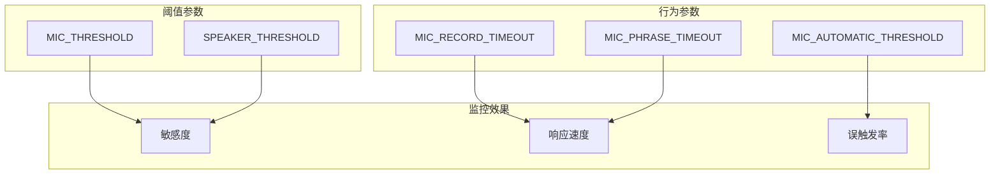

**图表来源**
- [config.py](file://src-python/config.py#L641-L662)

**章节来源**
- [config.py](file://src-python/config.py#L641-L662)

## 性能优化策略

### 内存管理优化

VRCT在能量监控过程中采用了多种内存优化策略：

1. **队列容量控制**：合理设置队列大小避免内存泄漏
2. **及时清理**：在停止监控时主动清空队列内容
3. **垃圾回收**：定期执行垃圾回收以释放不再使用的对象

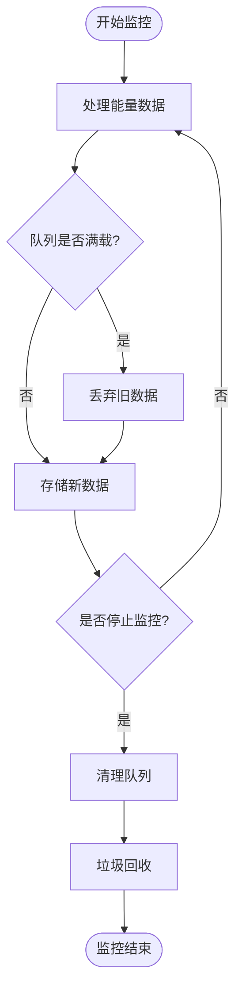

**图表来源**
- [model.py](file://src-python/model.py#L681-L682)
- [model.py](file://src-python/model.py#L876-L877)

### 线程安全保证

系统通过以下机制确保多线程环境下的安全性：

1. **队列操作原子性**：使用线程安全的Queue类
2. **状态同步**：通过适当的锁机制保护共享状态
3. **异常处理**：完善的异常捕获和恢复机制

**章节来源**
- [model.py](file://src-python/model.py#L681-L682)
- [model.py](file://src-python/model.py#L876-L877)

## 故障排除指南

### 常见问题诊断

#### 能量监控无响应

**可能原因**：
1. 音频设备权限不足
2. 设备索引配置错误
3. 后台线程被阻塞

**解决方案**：
1. 检查设备访问权限
2. 验证设备配置参数
3. 查看系统日志确认线程状态

#### 频繁误触发

**可能原因**：
1. 静态阈值设置过低
2. 环境噪声较大
3. 自动阈值调整不稳定

**解决方案**：
1. 提高静态阈值设置
2. 启用自动阈值调整
3. 增加噪声基线校准时间

#### 性能问题

**可能原因**：
1. 队列积压过多数据
2. 回调函数处理耗时过长
3. 内存泄漏

**解决方案**：
1. 优化队列容量设置
2. 减少回调函数复杂度
3. 定期检查内存使用情况

### 调试工具

VRCT提供了多种调试工具来帮助开发者诊断能量监控问题：

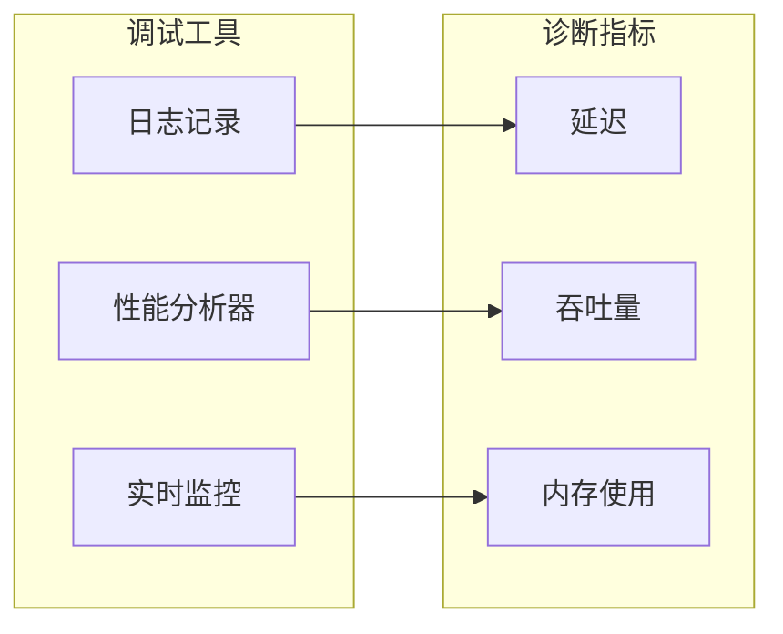

**章节来源**
- [model.py](file://src-python/model.py#L681-L682)
- [model.py](file://src-python/model.py#L876-L877)

## 总结

VRCT的能量监控机制是一个精心设计的音频信号处理系统，它通过以下关键特性实现了高效可靠的语音活动检测：

1. **模块化架构**：BaseEnergyRecorder及其子类提供了清晰的代码结构和良好的扩展性
2. **实时处理能力**：基于后台线程的能量监听确保了系统的响应性
3. **智能阈值调整**：动态阈值算法适应不同的环境条件
4. **资源优化**：完善的内存管理和线程安全机制保证了系统稳定性
5. **灵活配置**：丰富的配置选项满足不同应用场景的需求

该系统不仅为VRCT的语音识别功能提供了坚实的基础，也为类似应用的开发提供了有价值的参考。通过深入理解这些技术细节，开发者可以更好地利用和扩展VRCT的功能，或者将其设计理念应用到其他项目中。