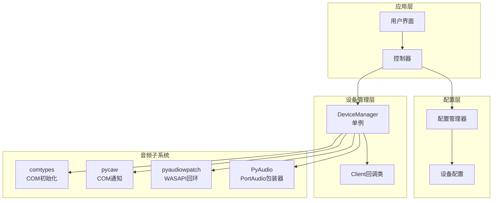
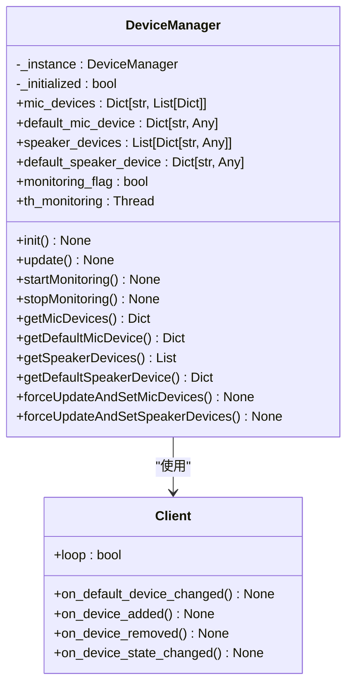
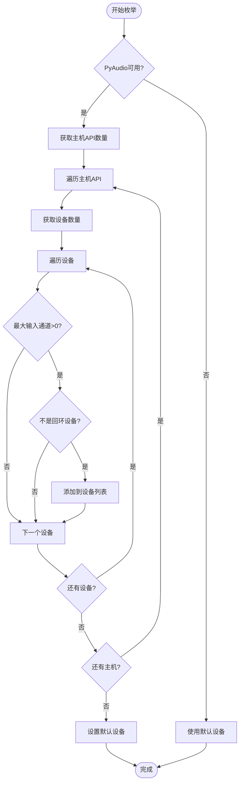
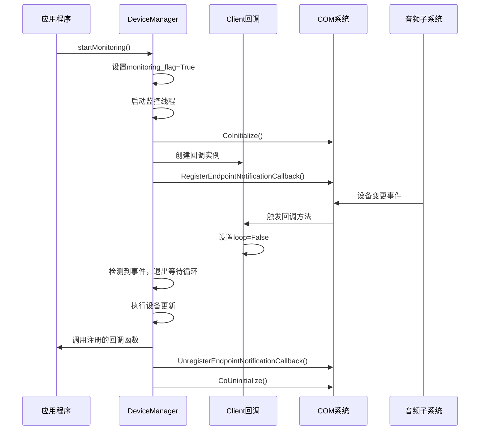
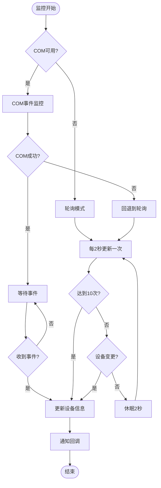
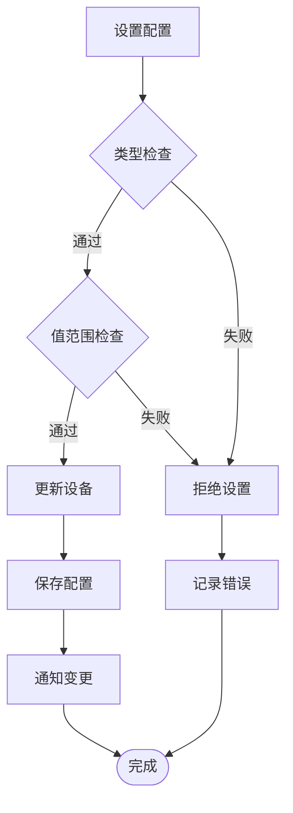
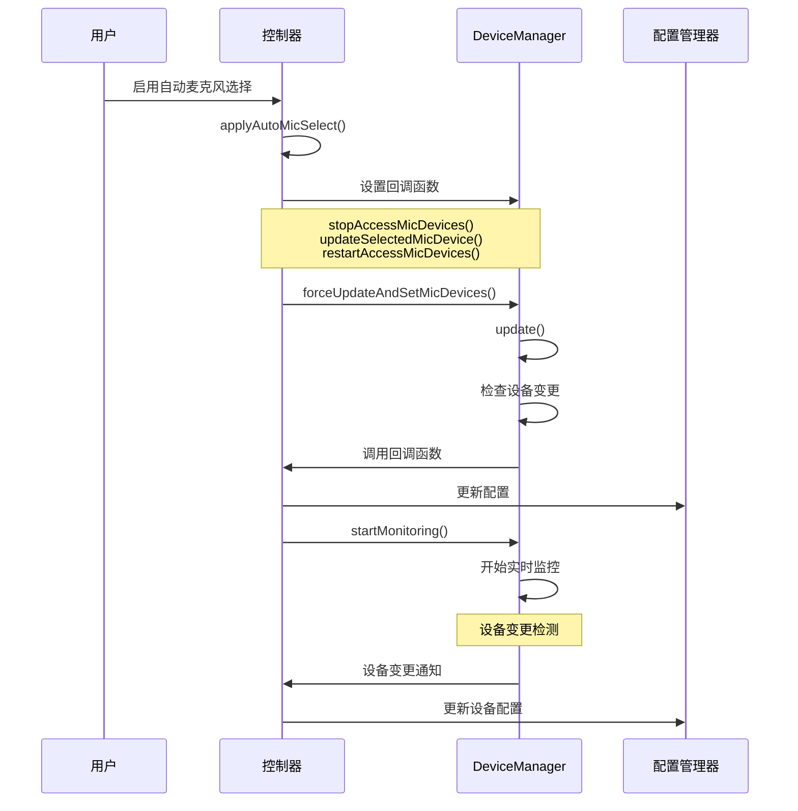
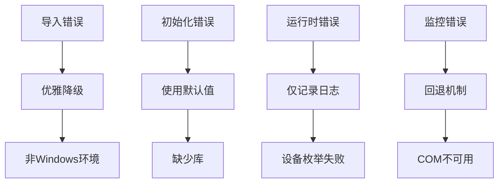

# VRCT音频设备管理机制深度解析

<cite>
**本文档引用的文件**
- [device_manager.py](file://src-python/device_manager.py)
- [config.py](file://src-python/config.py)
- [controller.py](file://src-python/controller.py)
- [mainloop.py](file://src-python/mainloop.py)
- [utils.py](file://src-python/utils.py)
- [device_manager.md](file://src-python/docs/device_manager.md)
- [device_manager_zh.md](file://src-python/docs/device_manager_zh.md)
</cite>

## 目录
1. [概述](#概述)
2. [核心架构](#核心架构)
3. [DeviceManager类详解](#devicemanager类详解)
4. [音频设备枚举机制](#音频设备枚举机制)
5. [实时监控系统](#实时监控系统)
6. [配置项交互](#配置项交互)
7. [自动选择逻辑](#自动选择逻辑)
8. [错误处理与资源管理](#错误处理与资源管理)
9. [使用示例](#使用示例)
10. [最佳实践](#最佳实践)

## 概述

VRCT的音频设备管理机制是一个高度集成的系统，负责管理麦克风和扬声器设备的发现、监控和自动选择。该系统基于Windows特定的音频API（pyaudiowpatch和pycaw），同时提供了优雅的降级方案以支持非Windows环境。

### 主要特性

- **跨平台兼容性**: Windows完整功能，其他平台优雅降级
- **实时监控**: 事件驱动的设备变更检测
- **灵活的回调系统**: 支持多种设备变更场景
- **强大的错误处理**: 即使在异常情况下也能继续运行
- **性能优化**: 单例模式、延迟初始化、事件驱动设计

## 核心架构



**图表来源**
- [device_manager.py](file://src-python/device_manager.py#L57-L71)
- [controller.py](file://src-python/controller.py#L1-L50)

## DeviceManager类详解

DeviceManager采用单例模式设计，确保整个应用程序中只有一个设备管理实例，避免重复的设备枚举和资源浪费。

### 类结构概览



**图表来源**
- [device_manager.py](file://src-python/device_manager.py#L57-L122)
- [device_manager.py](file://src-python/device_manager.py#L26-L55)

### 单例模式实现

DeviceManager的单例模式设计具有以下特点：

1. **延迟初始化**: 在首次访问时才进行实际初始化
2. **轻量级预初始化**: 避免导入时的重负载操作
3. **线程安全**: 使用类变量保证单例唯一性

**章节来源**
- [device_manager.py](file://src-python/device_manager.py#L57-L71)

## 音频设备枚举机制

### 微型设备枚举

设备管理器通过PyAudio API枚举所有可用的输入设备，并按主机API类型分组：



**图表来源**
- [device_manager.py](file://src-python/device_manager.py#L140-L238)

### 扬声器设备枚举

扬声器设备枚举使用WASAPI回环技术，需要特殊的处理逻辑：

1. **WASAPI主机识别**: 专门查找WASAPI类型的主机API
2. **回环设备匹配**: 通过名称包含关系匹配回环设备
3. **去重排序**: 确保设备列表的唯一性和有序性

**章节来源**
- [device_manager.py](file://src-python/device_manager.py#L182-L238)

## 实时监控系统

### COM事件监听机制

Windows环境下的实时监控主要依赖于pycaw库的COM事件系统：



**图表来源**
- [device_manager.py](file://src-python/device_manager.py#L266-L305)

### 轮询作为回退机制

当COM系统不可用时，监控系统会自动切换到轮询模式：



**图表来源**
- [device_manager.py](file://src-python/device_manager.py#L266-L305)

### Client回调类设计

Client类继承自MMNotificationClient，实现了轻量级的事件处理：

| 方法 | 功能 | 触发条件 |
|------|------|----------|
| `on_default_device_changed` | 默认设备变更 | 默认输入/输出设备改变 |
| `on_device_added` | 设备添加 | 新增音频设备 |
| `on_device_removed` | 设备移除 | 音频设备被移除 |
| `on_device_state_changed` | 设备状态变更 | 设备启用/禁用 |

**章节来源**
- [device_manager.py](file://src-python/device_manager.py#L26-L55)

## 配置项交互

### 关键配置项

VRCT的设备管理与多个配置项紧密关联：

| 配置项 | 类型 | 默认值 | 描述 |
|--------|------|--------|------|
| `AUTO_MIC_SELECT` | bool | True | 是否启用自动麦克风选择 |
| `AUTO_SPEAKER_SELECT` | bool | True | 是否启用自动扬声器选择 |
| `SELECTED_MIC_HOST` | str | "NoHost" | 选定的麦克风主机API |
| `SELECTED_MIC_DEVICE` | str | "NoDevice" | 选定的麦克风设备 |
| `SELECTED_SPEAKER_DEVICE` | str | "NoDevice" | 选定的扬声器设备 |

### 配置验证机制

每个配置项都有对应的验证器，确保配置的有效性：



**图表来源**
- [config.py](file://src-python/config.py#L491-L520)

**章节来源**
- [config.py](file://src-python/config.py#L728-L733)

## 自动选择逻辑

### AUTO_MIC_SELECT自动选择流程

当`AUTO_MIC_SELECT`为True时，系统会自动选择最佳的麦克风设备：



**图表来源**
- [controller.py](file://src-python/controller.py#L1113-L1118)

### 自动选择触发机制

自动选择逻辑通过以下步骤实现：

1. **回调函数设置**: 注册设备变更时的处理函数
2. **强制更新**: 立即执行设备更新操作
3. **监控启动**: 开始实时设备监控
4. **事件响应**: 响应设备变更事件

**章节来源**
- [controller.py](file://src-python/controller.py#L1113-L1136)

## 错误处理与资源管理

### 分层错误处理策略

VRCT的设备管理器采用了多层次的错误处理机制：



**图表来源**
- [device_manager.py](file://src-python/device_manager.py#L67-L77)
- [device_manager.py](file://src-python/device_manager.py#L132-L138)

### 资源管理策略

1. **延迟初始化**: 避免导入时的重负载操作
2. **线程安全**: 监控线程的安全启动和停止
3. **COM资源管理**: 正确的COM初始化和清理
4. **内存管理**: 及时释放不再使用的资源

**章节来源**
- [device_manager.py](file://src-python/device_manager.py#L307-L323)

## 使用示例

### 基本使用模式

```python
# 1. 初始化设备管理器
from device_manager import device_manager

# 2. 显式初始化（避免导入时的副作用）
device_manager.init()

# 3. 启动设备监控
device_manager.startMonitoring()

# 4. 注册回调函数
def on_default_mic_change(host, device):
    print(f"默认麦克风已变更为: {host} - {device}")

device_manager.setCallbackDefaultMicDevice(on_default_mic_change)

# 5. 获取设备信息
mic_devices = device_manager.getMicDevices()
default_mic = device_manager.getDefaultMicDevice()
```

### 配置管理示例

```python
from config import config

# 1. 获取当前配置
print(f"自动麦克风选择: {config.AUTO_MIC_SELECT}")
print(f"选定麦克风主机: {config.SELECTED_MIC_HOST}")
print(f"选定麦克风设备: {config.SELECTED_MIC_DEVICE}")

# 2. 设置新配置
config.AUTO_MIC_SELECT = True
config.SELECTED_MIC_HOST = "WASAPI"
config.SELECTED_MIC_DEVICE = "麦克风 (Realtek High Definition Audio)"

# 3. 启用自动选择
from controller import Controller
controller = Controller()
controller.setEnableAutoMicSelect()
```

### 错误处理示例

```python
from device_manager import device_manager
from utils import errorLogging

try:
    device_manager.init()
    device_manager.startMonitoring()
except Exception as e:
    errorLogging(f"设备管理器初始化失败: {e}")
    # 降级处理：使用默认设备
    mic_devices = device_manager.getMicDevices()
    default_mic = device_manager.getDefaultMicDevice()
```

## 最佳实践

### 性能优化建议

1. **延迟初始化**: 在真正需要时才调用`device_manager.init()`
2. **合理使用监控**: 仅在需要实时设备变更通知时启动监控
3. **回调函数优化**: 确保回调函数执行迅速，避免阻塞监控线程
4. **资源清理**: 在应用程序退出前正确停止监控

### 错误处理最佳实践

1. **导入保护**: 使用try-except块保护外部库的导入
2. **渐进式初始化**: 允许部分功能在某些条件下不可用
3. **优雅降级**: 提供合理的默认行为
4. **详细日志**: 记录详细的错误信息用于调试

### 配置管理建议

1. **验证优先**: 在设置配置前进行有效性验证
2. **回调同步**: 确保配置变更后及时更新相关组件
3. **持久化**: 使用配置管理器自动保存重要设置
4. **默认值**: 为所有配置项提供合理的默认值

### 线程安全注意事项

1. **单例访问**: 通过`device_manager`全局变量访问实例
2. **回调线程**: 确保回调函数在正确的线程上下文中执行
3. **资源竞争**: 避免在回调函数中直接修改共享资源
4. **异常隔离**: 在回调函数中捕获并处理异常

**章节来源**
- [device_manager.py](file://src-python/device_manager.py#L1-L529)
- [config.py](file://src-python/config.py#L1-L1027)