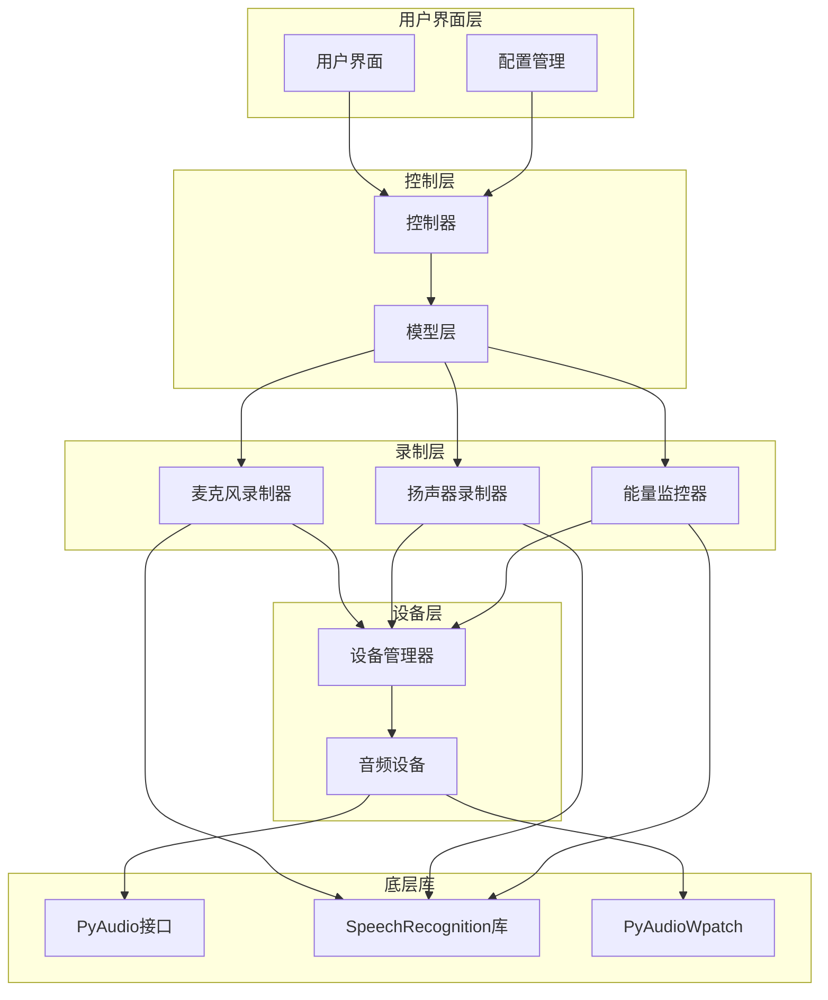
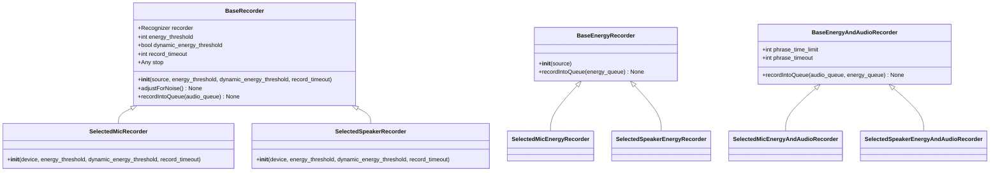
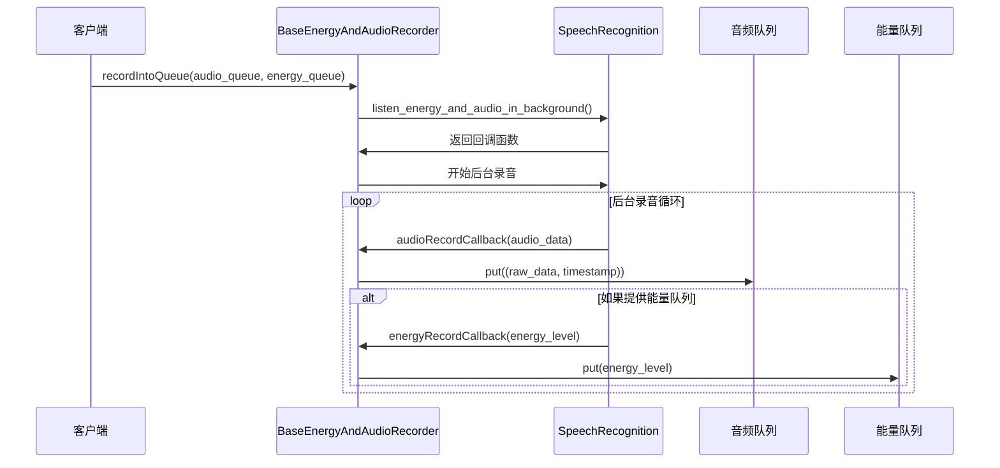
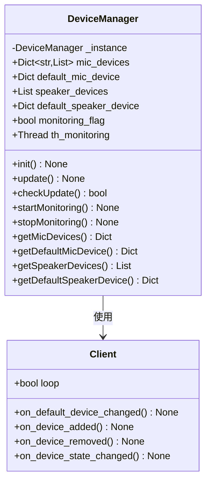
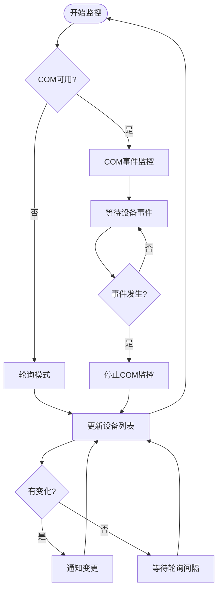
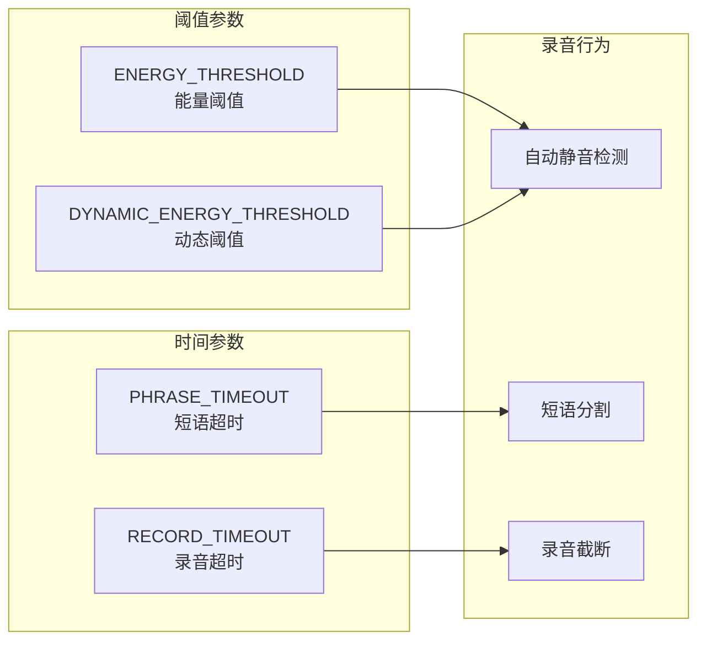
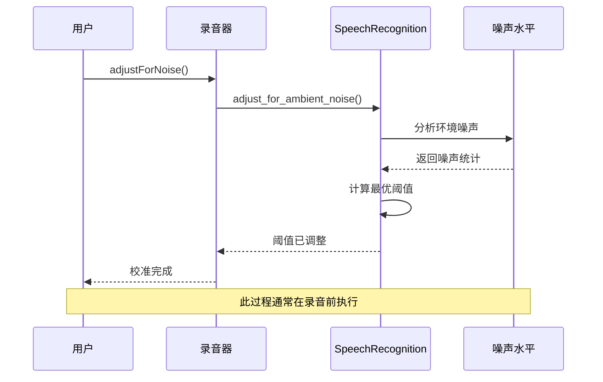
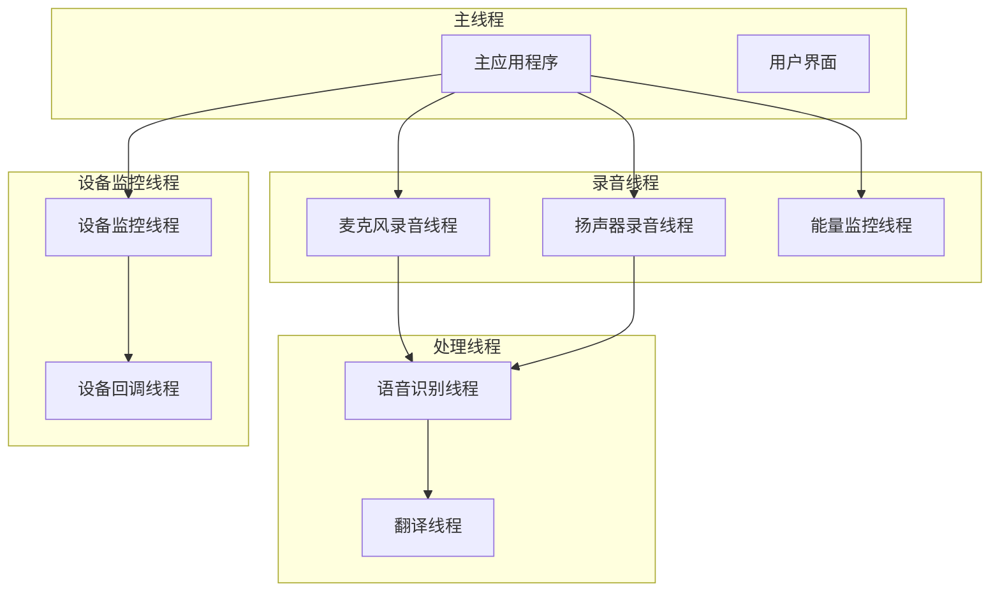
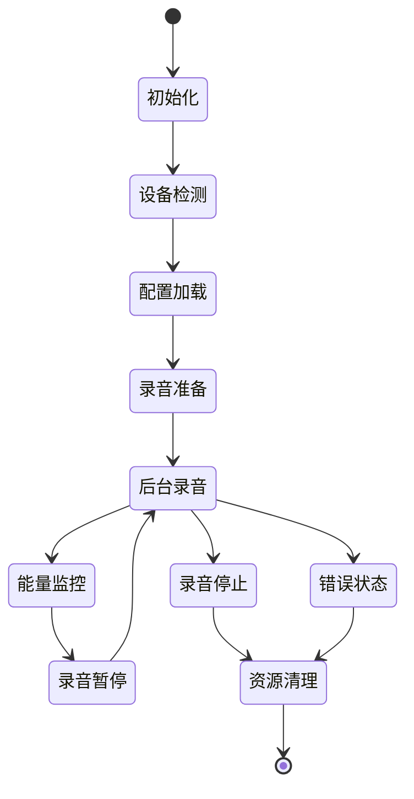
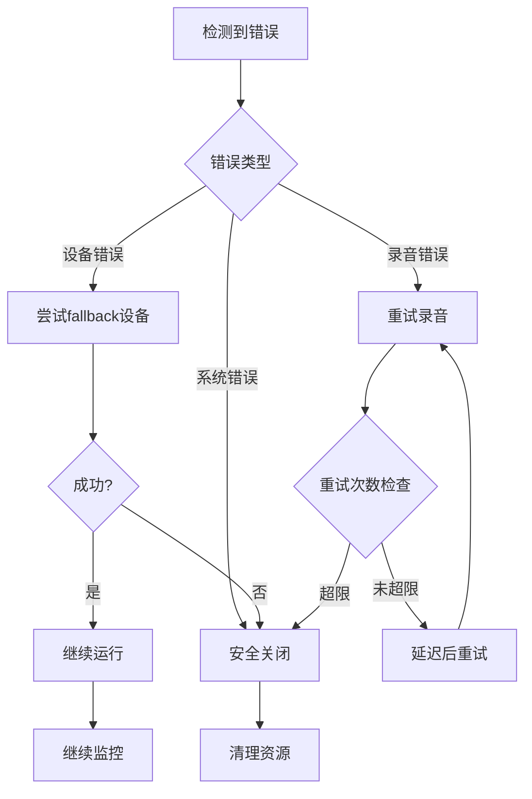

# VRCT音频录制机制深度解析

<cite>
**本文档引用的文件**
- [transcription_recorder.py](file://src-python/models/transcription/transcription_recorder.py)
- [device_manager.py](file://src-python/device_manager.py)
- [config.py](file://src-python/config.py)
- [model.py](file://src-python/model.py)
- [controller.py](file://src-python/controller.py)
</cite>

## 目录
1. [概述](#概述)
2. [核心架构](#核心架构)
3. [音频录制类详解](#音频录制类详解)
4. [设备管理机制](#设备管理机制)
5. [配置参数系统](#配置参数系统)
6. [动态能量阈值调整](#动态能量阈值调整)
7. [多线程资源管理](#多线程资源管理)
8. [错误恢复策略](#错误恢复策略)
9. [实际应用示例](#实际应用示例)
10. [性能优化建议](#性能优化建议)

## 概述

VRCT的音频录制机制是一个高度模块化的系统，通过多个层次的设计实现了灵活且可靠的语音识别功能。该系统主要由三个核心组件构成：音频录制层、设备管理层和配置控制层。

### 核心特性

- **双模式录制**：支持麦克风直接录音和扬声器环回录音两种模式
- **实时能量监控**：提供音频能量级别的实时检测和可视化
- **动态阈值调整**：根据环境噪声自动调整录音阈值
- **多线程架构**：采用后台线程处理录音和音频处理任务
- **设备热插拔支持**：动态检测和响应音频设备变化

## 核心架构

**图表来源**
- [model.py](file://src-python/model.py#L81-L140)
- [device_manager.py](file://src-python/device_manager.py#L57-L120)
- [transcription_recorder.py](file://src-python/models/transcription/transcription_recorder.py#L14-L100)

## 音频录制类详解

### BaseRecorder基础类

BaseRecorder是所有音频录制类的基类，提供了统一的接口和基本功能。

**图表来源**
- [transcription_recorder.py](file://src-python/models/transcription/transcription_recorder.py#L14-L100)
- [transcription_recorder.py](file://src-python/models/transcription/transcription_recorder.py#L149-L190)

### SelectedMicRecorder类

SelectedMicRecorder专门用于处理麦克风音频输入，支持自定义采样率和设备索引。

**关键特性：**
- **设备选择机制**：从配置中读取设备信息，支持fallback到默认设备
- **采样率配置**：可配置的采样率，默认为16000Hz
- **异常处理**：优雅的设备选择失败处理

**Section sources**
- [transcription_recorder.py](file://src-python/models/transcription/transcription_recorder.py#L38-L60)

### SelectedSpeakerRecorder类

SelectedSpeakerRecorder用于处理扬声器环回音频，需要WASAPI支持。

**关键特性：**
- **环回录音**：通过WASAPI捕获系统音频输出
- **通道配置**：支持多声道音频录制
- **缓冲区管理**：使用pyaudiowpatch的样本大小计算

**Section sources**
- [transcription_recorder.py](file://src-python/models/transcription/transcription_recorder.py#L62-L82)

### BaseEnergyAndAudioRecorder类

这是最复杂的录制类，同时处理音频数据和能量级别。

**核心方法：recordIntoQueue**

该方法是音频录制的核心，负责将音频块推送到处理队列：

**图表来源**
- [transcription_recorder.py](file://src-python/models/transcription/transcription_recorder.py#L176-L190)

**Section sources**
- [transcription_recorder.py](file://src-python/models/transcription/transcription_recorder.py#L149-L190)

## 设备管理机制

### DeviceManager单例模式

DeviceManager采用单例模式，确保全局唯一的设备管理实例。

**图表来源**
- [device_manager.py](file://src-python/device_manager.py#L57-L120)
- [device_manager.py](file://src-python/device_manager.py#L26-L52)

### 设备枚举与选择逻辑

设备管理器通过以下步骤实现设备的枚举和选择：

1. **主机API扫描**：遍历所有可用的音频主机API
2. **设备过滤**：筛选具有输入通道的设备
3. **WASAPI特殊处理**：为扬声器设备启用WASAPI支持
4. **默认设备检测**：确定系统的默认输入和输出设备

**Section sources**
- [device_manager.py](file://src-python/device_manager.py#L140-L238)

### 动态设备监控

DeviceManager实现了设备变化的实时监控机制：

**图表来源**
- [device_manager.py](file://src-python/device_manager.py#L266-L305)

**Section sources**
- [device_manager.py](file://src-python/device_manager.py#L266-L305)

## 配置参数系统

### 关键配置参数

VRCT的音频录制系统依赖多个配置参数来控制录音行为：

| 参数名称 | 类型 | 默认值 | 描述 |
|---------|------|--------|------|
| ENERGY_THRESHOLD | int | 300 | 静音检测的初始阈值 |
| PHRASE_TIMEOUT | int | 3 | 单词间最大静默时间 |
| RECORD_TIMEOUT | int | 5 | 单次录音的最大持续时间 |
| DYNAMIC_ENERGY_THRESHOLD | bool | True | 是否启用动态阈值调整 |
| MAX_MIC_THRESHOLD | int | 2000 | 微调阈值的最大限制 |

**Section sources**
- [config.py](file://src-python/config.py#L641-L670)
- [config.py](file://src-python/config.py#L864-L899)

### 参数对录音行为的影响

不同参数对录音质量有重要影响：

**图表来源**
- [config.py](file://src-python/config.py#L641-L670)

## 动态能量阈值调整

### 自动噪声校准流程

动态能量阈值调整是VRCT音频录制的核心功能之一：

**图表来源**
- [transcription_recorder.py](file://src-python/models/transcription/transcription_recorder.py#L27-L30)

### 能量级别监控

系统提供实时的能量级别监控功能：

**Section sources**
- [model.py](file://src-python/model.py#L769-L800)
- [model.py](file://src-python/model.py#L912-L935)

## 多线程资源管理

### 线程架构设计

VRCT采用了分层的多线程架构来处理不同的任务：

**图表来源**
- [model.py](file://src-python/model.py#L37-L80)
- [device_manager.py](file://src-python/device_manager.py#L307-L317)

### 资源生命周期管理

每个音频录制组件都有明确的生命周期管理：

**Section sources**
- [model.py](file://src-python/model.py#L616-L768)
- [model.py](file://src-python/model.py#L812-L911)

## 错误恢复策略

### 异常处理机制

VRCT实现了多层次的异常处理机制：

1. **设备级异常**：设备选择失败时的fallback机制
2. **录音级异常**：录音过程中出现的临时性错误
3. **系统级异常**：底层音频库的不可恢复错误

### 自动重试机制

对于临时性错误，系统实现了智能重试机制：

**Section sources**
- [transcription_recorder.py](file://src-python/models/transcription/transcription_recorder.py#L42-L57)
- [device_manager.py](file://src-python/device_manager.py#L306-L308)

## 实际应用示例

### 基础麦克风录音设置

以下是典型的麦克风录音配置示例：

**配置参数设置：**
- 能量阈值：300
- 动态阈值：启用
- 短语超时：3秒
- 录音超时：5秒

**录音流程：**
1. 初始化SelectedMicEnergyAndAudioRecorder
2. 设置音频队列和能量队列
3. 启动后台录音
4. 开始语音识别处理

**Section sources**
- [model.py](file://src-python/model.py#L636-L643)

### 扬声器环回录音配置

扬声器录音需要特殊的配置和权限：

**关键配置：**
- WASAPI支持：必需
- 环回设备：自动检测
- 多声道支持：可配置

**Section sources**
- [model.py](file://src-python/model.py#L831-L838)

### 能量监控集成

能量监控可以独立运行或与录音集成：

**独立监控：**
- 创建SelectedMicEnergyRecorder
- 设置能量队列
- 启动能量监控线程

**集成监控：**
- 使用BaseEnergyAndAudioRecorder
- 同时处理音频和能量数据
- 实时反馈给用户界面

**Section sources**
- [model.py](file://src-python/model.py#L769-L800)
- [model.py](file://src-python/model.py#L912-L935)

## 性能优化建议

### 内存管理优化

1. **队列大小控制**：合理设置音频队列和能量队列的大小
2. **垃圾回收**：定期调用gc.collect()清理无用对象
3. **资源池化**：复用音频处理对象减少内存分配

### CPU使用优化

1. **线程优先级**：适当调整录音线程的优先级
2. **批处理**：合并多个小的音频片段减少处理开销
3. **异步处理**：使用异步I/O避免阻塞主线程

### 延迟优化

1. **缓冲区调优**：平衡延迟和稳定性
2. **预处理**：在后台线程中进行音频预处理
3. **预测算法**：使用机器学习预测最佳阈值

### 网络优化

对于远程音频处理：
1. **压缩传输**：使用适当的音频格式压缩
2. **错误恢复**：实现网络中断后的自动重连
3. **带宽适配**：根据网络状况调整音频质量

通过以上优化策略，VRCT的音频录制系统能够在各种环境下提供稳定、低延迟的语音识别服务。