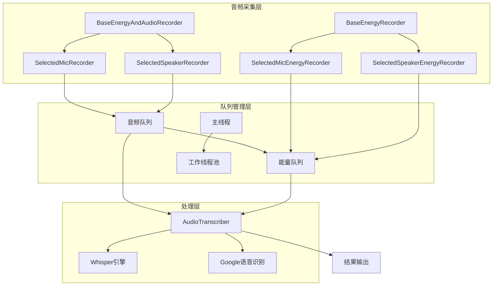
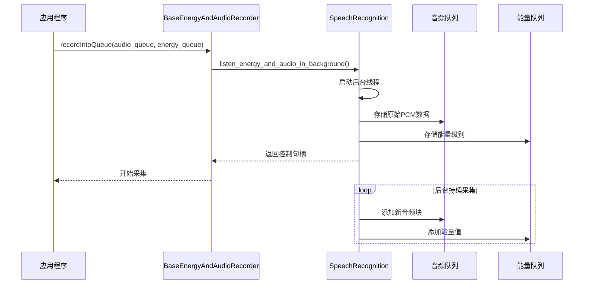
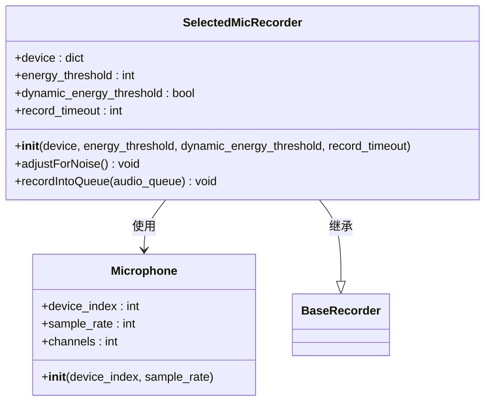
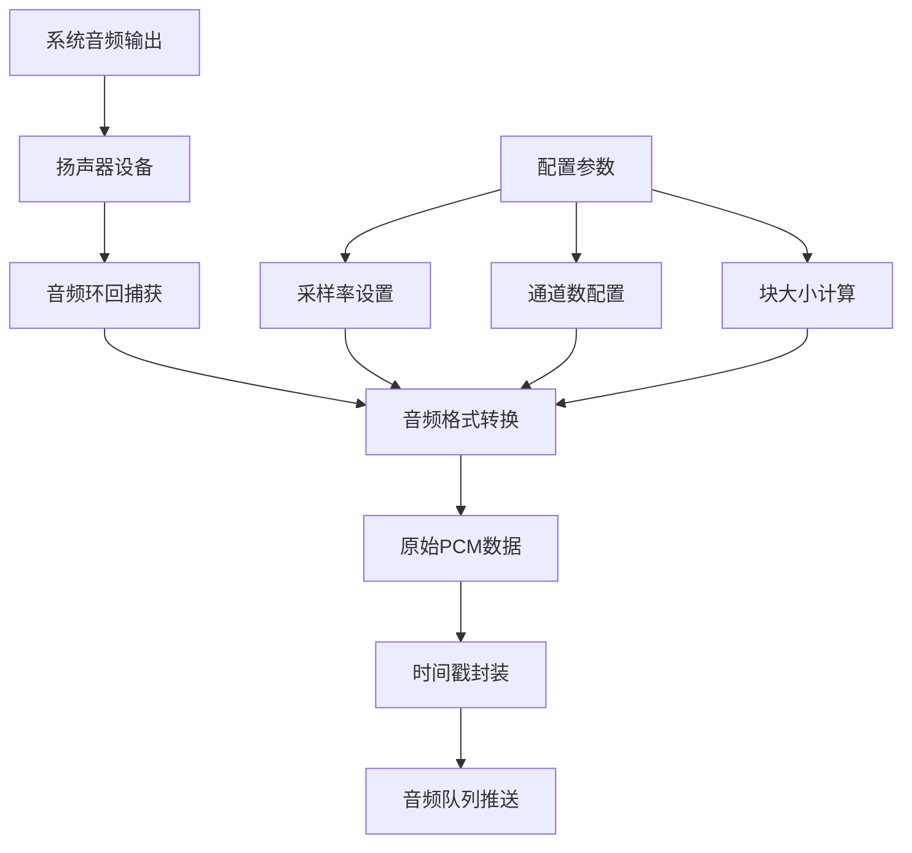
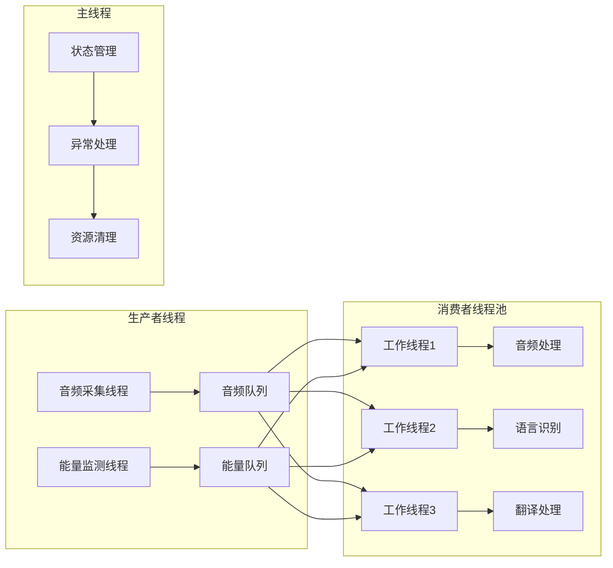
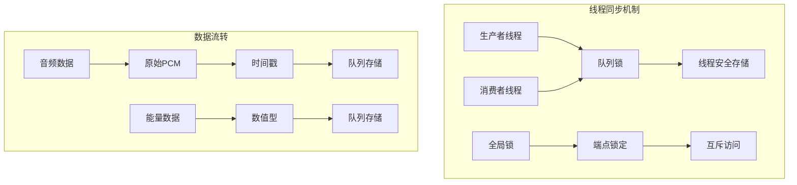
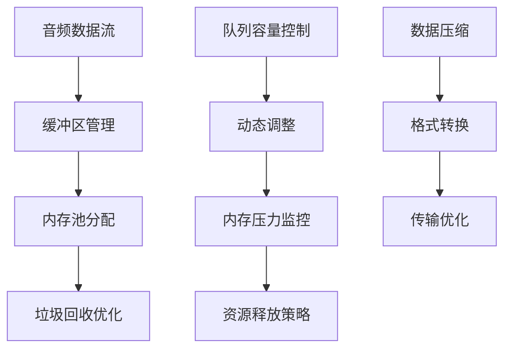
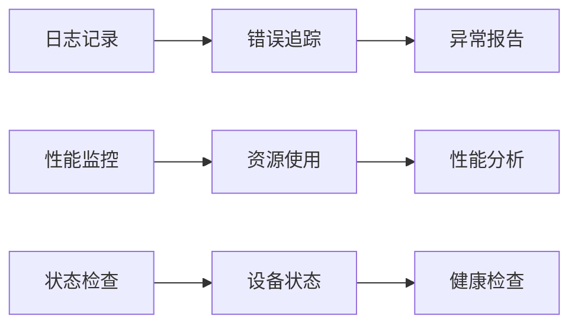

# VRCT音频数据采集机制深度解析

<cite>
**本文档引用的文件**
- [transcription_recorder.py](file://src-python/models/transcription/transcription_recorder.py)
- [mainloop.py](file://src-python/mainloop.py)
- [model.py](file://src-python/model.py)
- [config.py](file://src-python/config.py)
- [controller.py](file://src-python/controller.py)
- [transcription_transcriber.py](file://src-python/models/transcription/transcription_transcriber.py)
</cite>

## 目录
1. [引言](#引言)
2. [系统架构概览](#系统架构概览)
3. [BaseEnergyAndAudioRecorder核心机制](#baseenergyandaudiorrecorder核心机制)
4. [麦克风与扬声器音频流处理](#麦克风与扬声器音频流处理)
5. [音频队列消费与异常处理](#音频队列消费与异常处理)
6. [多线程数据同步策略](#多线程数据同步策略)
7. [性能优化与内存管理](#性能优化与内存管理)
8. [配置参数详解](#配置参数详解)
9. [故障排除指南](#故障排除指南)
10. [总结](#总结)

## 引言

VRCT（Virtual Reality Communication Tool）采用了一套高度优化的音频数据采集系统，该系统基于SpeechRecognition库的`listen_in_background`方法实现了非阻塞式的音频流采集。本文档将深入解析这一复杂系统的各个组成部分，包括音频数据的捕获、处理、队列管理和多线程同步机制。

## 系统架构概览

VRCT的音频采集系统采用了分层架构设计，主要包含以下核心组件：

**图表来源**
- [transcription_recorder.py](file://src-python/models/transcription/transcription_recorder.py#L149-L264)
- [transcription_transcriber.py](file://src-python/models/transcription/transcription_transcriber.py#L31-L192)

## BaseEnergyAndAudioRecorder核心机制

### 非阻塞式音频采集原理

`BaseEnergyAndAudioRecorder`类是整个音频采集系统的核心，它通过SpeechRecognition库的`listen_energy_and_audio_in_background`方法实现了真正的非阻塞式音频采集。

**图表来源**
- [transcription_recorder.py](file://src-python/models/transcription/transcription_recorder.py#L176-L190)

### listen_in_background方法的工作机制

该方法的核心优势在于其异步执行特性：

1. **后台线程启动**：在独立线程中运行音频采集逻辑
2. **实时回调**：每当采集到新的音频数据时立即触发回调函数
3. **非阻塞接口**：主程序可以继续执行其他任务
4. **自动资源管理**：支持暂停、恢复和停止操作

**章节来源**
- [transcription_recorder.py](file://src-python/models/transcription/transcription_recorder.py#L176-L190)

## 麦克风与扬声器音频流处理

### SelectedMicRecorder实现

麦克风录音器专门处理来自物理麦克风设备的音频输入：

**图表来源**
- [transcription_recorder.py](file://src-python/models/transcription/transcription_recorder.py#L38-L60)

### SelectedSpeakerRecorder实现

扬声器环回录音器处理系统音频输出的捕获：

**图表来源**
- [transcription_recorder.py](file://src-python/models/transcription/transcription_recorder.py#L62-L82)

### recordIntoQueue方法的数据封装

该方法将原始音频数据与时间戳封装后推送到处理队列：

| 参数 | 类型 | 描述 | 默认值 |
|------|------|------|--------|
| audio_queue | Queue | 音频数据目标队列 | 必需 |
| energy_queue | Queue | 能量级别目标队列 | 可选 |

**章节来源**
- [transcription_recorder.py](file://src-python/models/transcription/transcription_recorder.py#L177-L182)

## 音频队列消费与异常处理

### 主循环队列消费机制

VRCT的主循环通过多线程队列消费机制实现音频数据的高效处理：

**图表来源**
- [mainloop.py](file://src-python/mainloop.py#L408-L588)

### 异常处理机制

系统实现了多层次的异常处理策略：

1. **设备级异常**：设备连接失败时的降级处理
2. **音频格式异常**：不支持的音频格式自动转换
3. **内存溢出保护**：队列满载时的缓冲区管理
4. **网络异常处理**：远程语音识别服务的重试机制

**章节来源**
- [mainloop.py](file://src-python/mainloop.py#L471-L544)

## 多线程数据同步策略

### 线程安全队列设计

VRCT使用Python标准库的`Queue`模块确保线程间的数据安全传输：

**图表来源**
- [mainloop.py](file://src-python/mainloop.py#L417-L438)

### 锁机制与并发控制

系统采用细粒度锁策略避免死锁和性能瓶颈：

| 锁类型 | 作用范围 | 使用场景 |
|--------|----------|----------|
| 端点锁 | 特定API端点 | 防止重复调用 |
| 全局锁 | 整个系统 | 关键资源访问 |
| 队列锁 | 单个队列 | 数据一致性保证 |

**章节来源**
- [mainloop.py](file://src-python/mainloop.py#L417-L438)

## 性能优化与内存管理

### 内存使用模式分析

VRCT的音频采集系统采用了多种内存优化技术：

### 性能优化策略

1. **音频块大小配置**：根据网络带宽和延迟需求动态调整
2. **采样率优化**：在质量与性能之间找到平衡点
3. **数据格式转换**：减少不必要的格式转换开销
4. **批量处理**：合并多个小数据包提高效率

**章节来源**
- [transcription_recorder.py](file://src-python/models/transcription/transcription_recorder.py#L1-L264)

## 配置参数详解

### 核心配置参数表

| 参数名称 | 类型 | 默认值 | 描述 | 影响范围 |
|----------|------|--------|------|----------|
| energy_threshold | int | 300 | 音量阈值 | 音频触发灵敏度 |
| dynamic_energy_threshold | bool | True | 动态阈值调整 | 自适应噪声处理 |
| phrase_time_limit | int | 5 | 单次语音片段最大时长 | 识别准确性 |
| phrase_timeout | int | 1 | 语音间隔超时时间 | 实时性 |
| record_timeout | int | 5 | 录音超时时间 | 资源占用 |

### 设备配置参数

| 参数 | 类型 | 示例值 | 说明 |
|------|------|--------|------|
| device_index | int | 0 | 设备索引号 |
| sample_rate | int | 16000 | 采样频率(Hz) |
| channels | int | 1 | 声道数 |
| maxInputChannels | int | 2 | 最大输入声道 |

**章节来源**
- [config.py](file://src-python/config.py#L1-L200)

## 故障排除指南

### 常见问题与解决方案

1. **音频设备无法访问**
   - 检查设备权限设置
   - 验证驱动程序完整性
   - 确认设备未被其他程序占用

2. **音频质量不佳**
   - 调整能量阈值参数
   - 检查设备采样率设置
   - 优化音频预处理参数

3. **性能问题**
   - 监控内存使用情况
   - 调整队列缓冲区大小
   - 优化线程数量配置

### 调试工具与监控

系统提供了完善的调试和监控功能：

**章节来源**
- [device_manager.md](file://src-python/docs/device_manager.md#L1001-L1053)

## 总结

VRCT的音频数据采集机制展现了现代软件工程中音频处理的最佳实践。通过精心设计的分层架构、非阻塞式采集、多线程同步和完善的异常处理，系统实现了高性能、高可靠性的音频数据处理能力。

关键技术特点包括：
- 基于SpeechRecognition库的`listen_in_background`方法实现的非阻塞音频采集
- 麦克风和扬声器双路径的音频输入处理
- 多队列架构支持音频数据和能量级别的并行处理
- 完善的异常处理和资源管理机制
- 灵活的配置参数支持不同使用场景

这套音频采集系统为VRCT的实时语音转录和翻译功能奠定了坚实的基础，是现代虚拟现实通信工具的重要组成部分。