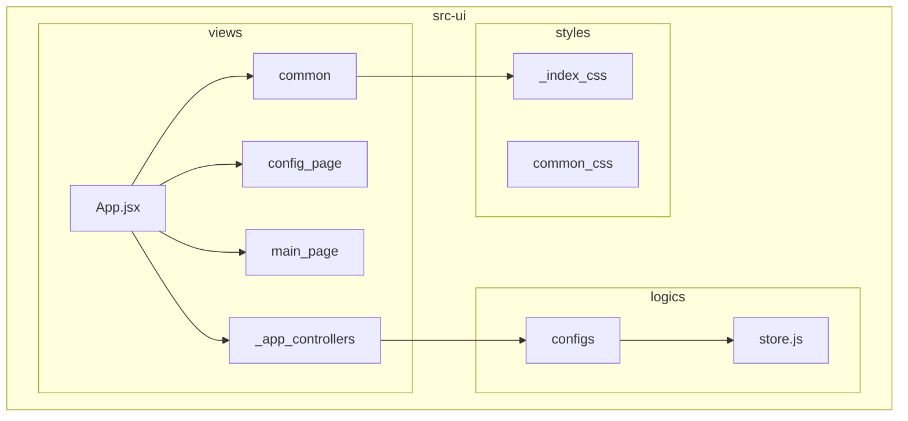
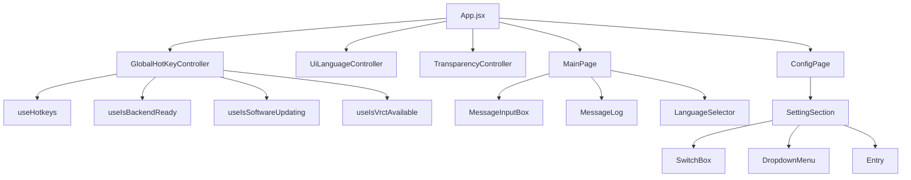
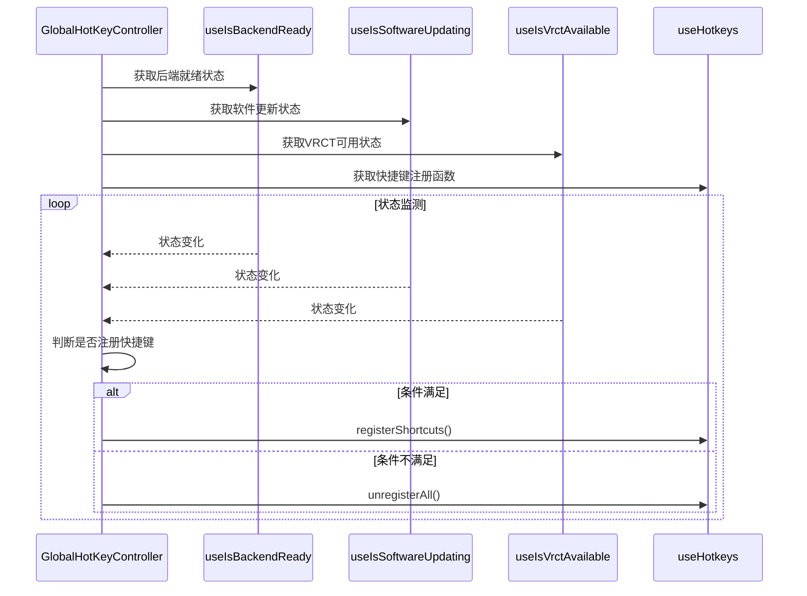
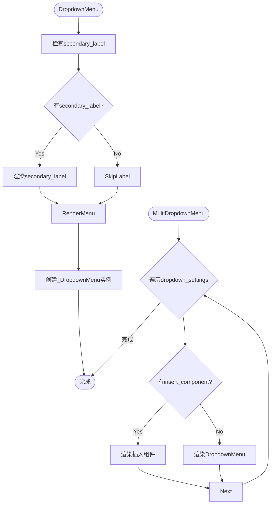
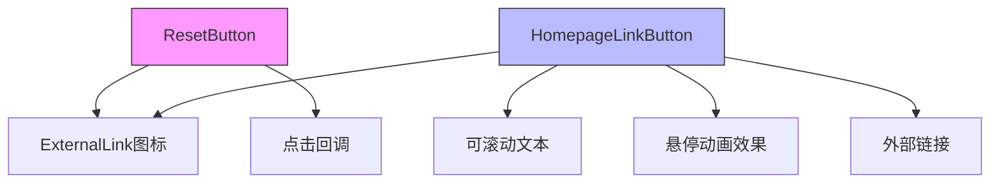
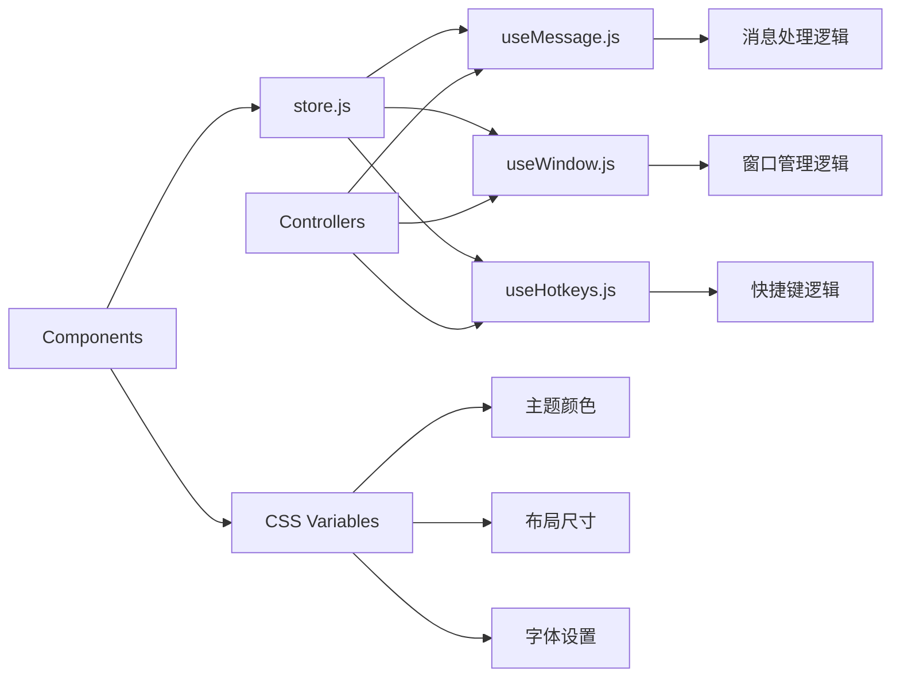

# UI组件参考

<cite>
**本文档中引用的文件**
- [GlobalHotKeyController.jsx](file://src-ui/views/app/_app_controllers/GlobalHotKeyController.jsx)
- [SwitchBox.jsx](file://src-ui/views/app/config_page/setting_section/setting_box/SwitchBox.jsx)
- [DropdownMenu.jsx](file://src-ui/views/app/config_page/setting_section/setting_box/DropdownMenu.jsx)
- [Checkbox.jsx](file://src-ui/views/common_components/checkbox/Checkbox.jsx)
- [ResetButton.jsx](file://src-ui/views/common_components/reset_button/ResetButton.jsx)
- [HomepageLinkButton.jsx](file://src-ui/views/common_components/homepage_link_button/HomepageLinkButton.jsx)
- [useMessage.js](file://src-ui/logics/common/useMessage.js)
- [useWindow.js](file://src-ui/logics/common/useWindow.js)
- [variables.css](file://src-ui/views/app/_index_css/variables.css)
- [root.css](file://src-ui/views/app/_index_css/root.css)
</cite>

## 目录
1. [简介](#简介)
2. [项目结构](#项目结构)
3. [核心组件](#核心组件)
4. [架构概述](#架构概述)
5. [详细组件分析](#详细组件分析)
6. [依赖分析](#依赖分析)
7. [性能考虑](#性能考虑)
8. [故障排除指南](#故障排除指南)
9. [结论](#结论)

## 简介
本文档系统性地介绍VRCT项目中的核心UI组件设计与使用。重点说明控制器组件（如GlobalHotKeyController.jsx）如何处理应用级状态，以及基础组件（如SwitchBox、DropdownMenu）的属性接口和事件机制。结合React组件代码，解释组件间的组合模式和状态传递方式。文档包含组件用途、属性列表、事件回调和使用示例，为开发者提供清晰的组件使用指南。

## 项目结构
VRCT项目的UI组件主要组织在`src-ui`目录下，采用模块化和分层的架构设计。核心视图组件位于`views`目录，逻辑处理位于`logics`目录，样式定义在`_index_css`目录。



**Diagram sources**
- [App.jsx](file://src-ui/views/app/App.jsx)
- [GlobalHotKeyController.jsx](file://src-ui/views/app/_app_controllers/GlobalHotKeyController.jsx)
- [store.js](file://src-ui/logics/store.js)

**Section sources**
- [src-ui](file://src-ui)

## 核心组件
本项目的核心UI组件分为两大类：控制器组件和基础UI组件。控制器组件负责应用级状态管理和副作用处理，基础UI组件提供可复用的界面元素。

**Section sources**
- [GlobalHotKeyController.jsx](file://src-ui/views/app/_app_controllers/GlobalHotKeyController.jsx)
- [SwitchBox.jsx](file://src-ui/views/app/config_page/setting_section/setting_box/SwitchBox.jsx)

## 架构概述
VRCT的UI架构采用React函数组件与Hooks的组合模式，通过自定义Hooks实现逻辑复用和状态管理。组件层级清晰，遵循单一职责原则。



**Diagram sources**
- [App.jsx](file://src-ui/views/app/App.jsx)
- [GlobalHotKeyController.jsx](file://src-ui/views/app/_app_controllers/GlobalHotKeyController.jsx)
- [MainPage.jsx](file://src-ui/views/app/main_page/MainPage.jsx)
- [ConfigPage.jsx](file://src-ui/views/app/config_page/ConfigPage.jsx)

## 详细组件分析
本节详细分析关键的UI组件，包括其设计模式、属性接口和使用方法。

### 控制器组件分析
控制器组件是应用的状态管理中心，通常不渲染UI元素，而是通过useEffect处理应用级状态和副作用。

#### GlobalHotKeyController分析
GlobalHotKeyController组件负责全局快捷键的注册和注销，根据应用状态动态管理快捷键。



**Diagram sources**
- [GlobalHotKeyController.jsx](file://src-ui/views/app/_app_controllers/GlobalHotKeyController.jsx)
- [useHotkeys.js](file://src-ui/logics/configs/config_page_setter/hotkeys/useHotkeys.js)

**Section sources**
- [GlobalHotKeyController.jsx](file://src-ui/views/app/_app_controllers/GlobalHotKeyController.jsx)

### 基础组件分析
基础UI组件提供可复用的界面元素，具有清晰的属性接口和事件机制。

#### SwitchBox组件分析
SwitchBox组件用于布尔值的切换操作，支持二次标签显示和状态管理。

```mermaid
classDiagram
class SwitchBox {
+secondary_label : string
+variable : object
+is_available : boolean
+toggleFunction : function
+size : string
+borderWidth : string
+padding : string
}
SwitchBox --> _SwitchBox : "组合"
SwitchBox --> "CSS Modules" : "使用样式"
note right of SwitchBox
外层容器组件，提供二次标签
和布局包装功能
end
```

**Diagram sources**
- [SwitchBox.jsx](file://src-ui/views/app/config_page/setting_section/setting_box/SwitchBox.jsx)
- [_SwitchBox.jsx](file://src-ui/views/app/config_page/setting_section/setting_box/_components/_atoms/_switch_box/_SwitchBox.jsx)

**Section sources**
- [SwitchBox.jsx](file://src-ui/views/app/config_page/setting_section/setting_box/SwitchBox.jsx)

#### DropdownMenu组件分析
DropdownMenu组件提供下拉菜单功能，支持单个和多个菜单的渲染。



**Diagram sources**
- [DropdownMenu.jsx](file://src-ui/views/app/config_page/setting_section/setting_box/DropdownMenu.jsx)
- [_DropdownMenu.jsx](file://src-ui/views/app/config_page/setting_section/setting_box/_components/_atoms/_dropdown_menu/_DropdownMenu.jsx)

**Section sources**
- [DropdownMenu.jsx](file://src-ui/views/app/config_page/setting_section/setting_box/DropdownMenu.jsx)

#### Checkbox组件分析
Checkbox组件提供复选框功能，支持禁用状态和加载状态的视觉反馈。

```mermaid
classDiagram
class Checkbox {
+checkboxId : string
+variable : object
+is_available : boolean
+toggleFunction : function
+size : string
+borderWidth : string
+padding : string
}
Checkbox --> "CSS Modules" : "使用样式"
Checkbox --> "SVG" : "渲染勾选图标"
note right of Checkbox
支持自定义尺寸和边框
通过variable.state处理pending状态
end
```

**Diagram sources**
- [Checkbox.jsx](file://src-ui/views/common_components/checkbox/Checkbox.jsx)
- [Checkbox.module.scss](file://src-ui/views/common_components/checkbox/Checkbox.module.scss)

**Section sources**
- [Checkbox.jsx](file://src-ui/views/common_components/checkbox/Checkbox.jsx)

#### 其他基础组件
项目还包含多种其他基础组件，如重置按钮和主页链接按钮。



**Diagram sources**
- [ResetButton.jsx](file://src-ui/views/common_components/reset_button/ResetButton.jsx)
- [HomepageLinkButton.jsx](file://src-ui/views/common_components/homepage_link_button/HomepageLinkButton.jsx)

**Section sources**
- [ResetButton.jsx](file://src-ui/views/common_components/reset_button/ResetButton.jsx)
- [HomepageLinkButton.jsx](file://src-ui/views/common_components/homepage_link_button/HomepageLinkButton.jsx)

## 依赖分析
UI组件之间的依赖关系清晰，遵循自上而下的数据流和自定义Hooks的逻辑复用模式。



**Diagram sources**
- [store.js](file://src-ui/logics/store.js)
- [useMessage.js](file://src-ui/logics/common/useMessage.js)
- [useWindow.js](file://src-ui/logics/common/useWindow.js)
- [variables.css](file://src-ui/views/app/_index_css/variables.css)

**Section sources**
- [store.js](file://src-ui/logics/store.js)
- [useMessage.js](file://src-ui/logics/common/useMessage.js)
- [useWindow.js](file://src-ui/logics/common/useWindow.js)

## 性能考虑
UI组件在设计时考虑了性能优化，包括：

1. **防抖处理**：窗口大小调整和位置变化使用200ms防抖
2. **条件渲染**：仅在必要时注册全局快捷键
3. **样式优化**：使用CSS变量和模块化样式减少重复
4. **事件委托**：合理使用事件冒泡和委托
5. **资源管理**：及时清理事件监听器

这些优化确保了应用在各种使用场景下的流畅性。

## 故障排除指南
常见UI组件问题及解决方案：

1. **快捷键不工作**：检查GlobalHotKeyController的依赖状态是否满足
2. **样式不生效**：确认CSS模块正确导入和使用
3. **状态更新延迟**：检查自定义Hooks的状态更新逻辑
4. **组件不渲染**：验证父组件的条件渲染逻辑
5. **内存泄漏**：确保在useEffect清理函数中移除事件监听器

**Section sources**
- [GlobalHotKeyController.jsx](file://src-ui/views/app/_app_controllers/GlobalHotKeyController.jsx)
- [useWindow.js](file://src-ui/logics/common/useWindow.js)

## 结论
VRCT项目的UI组件设计遵循现代React最佳实践，通过控制器组件管理应用状态，基础组件提供可复用的界面元素。组件间通过清晰的属性接口和事件机制进行通信，形成良好的组合模式。这种架构既保证了代码的可维护性，又提供了灵活的扩展能力。