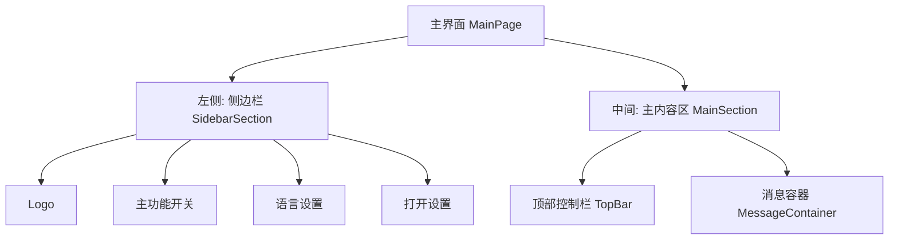
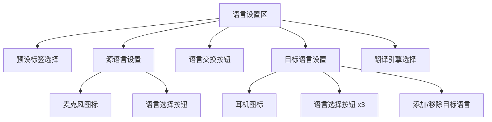
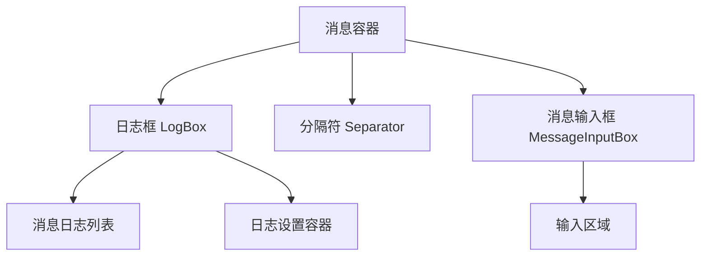
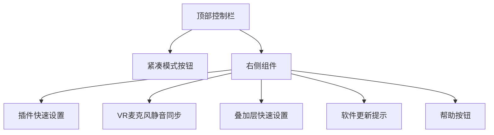
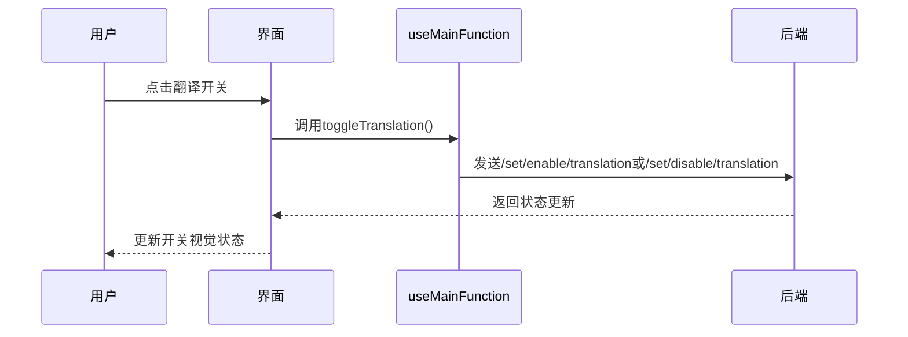

# 主界面概览

<cite>
**本文档引用的文件**  
- [MainPage.jsx](file://src-ui/views/app/main_page/MainPage.jsx)
- [MainSection.jsx](file://src-ui/views/app/main_page/main_section/MainSection.jsx)
- [SidebarSection.jsx](file://src-ui/views/app/main_page/sidebar_section/SidebarSection.jsx)
- [LanguageSettings.jsx](file://src-ui/views/app/main_page/sidebar_section/language_settings/LanguageSettings.jsx)
- [MainFunctionSwitch.jsx](file://src-ui/views/app/main_page/sidebar_section/main_function_switch/MainFunctionSwitch.jsx)
- [TopBar.jsx](file://src-ui/views/app/main_page/main_section/top_bar/TopBar.jsx)
- [MessageContainer.jsx](file://src-ui/views/app/main_page/main_section/message_container/MessageContainer.jsx)
- [useLanguageSettings.js](file://src-ui/logics/main/useLanguageSettings.js)
- [useMainFunction.js](file://src-ui/logics/main/useMainFunction.js)
- [useIsMainPageCompactMode.js](file://src-ui/logics/main/useIsMainPageCompactMode.js)
- [useMessageInputBoxRatio.js](file://src-ui/logics/main/useMessageInputBoxRatio.js)
</cite>

## 目录
1. [主界面布局](#主界面布局)
2. [左侧语言设置区](#左侧语言设置区)
3. [中间消息显示区](#中间消息显示区)
4. [顶部控制栏](#顶部控制栏)
5. [核心功能交互逻辑](#核心功能交互逻辑)
6. [实际操作示例](#实际操作示例)

## 主界面布局

VRCT主界面采用三栏式布局结构，由左侧语言设置区、中间消息显示区和顶部控制栏组成。整体布局通过`MainPage.jsx`组件进行组织，该组件包含`SidebarSection`（侧边栏）和`MainSection`（主内容区）两个主要子组件。

**图示来源**  
- [MainPage.jsx](file://src-ui/views/app/main_page/MainPage.jsx#L7-L21)
- [SidebarSection.jsx](file://src-ui/views/app/main_page/sidebar_section/SidebarSection.jsx#L12-L33)

## 左侧语言设置区

左侧语言设置区位于界面左侧，包含语言预设、源语言与目标语言选择、翻译引擎选择等功能。该区域由`LanguageSettings.jsx`组件实现，其核心功能包括：

- **预设标签选择器**：允许用户在多个预设配置之间切换
- **语言选择按钮**：分别用于设置源语言和目标语言
- **语言交换按钮**：快速交换源语言和目标语言
- **翻译引擎选择器**：选择使用的翻译服务

当用户点击语言选择按钮时，会触发语言选择器弹窗，允许用户从支持的语言列表中选择所需语言。

**图示来源**  
- [LanguageSettings.jsx](file://src-ui/views/app/main_page/sidebar_section/language_settings/LanguageSettings.jsx#L10-L56)
- [useLanguageSettings.js](file://src-ui/logics/main/useLanguageSettings.js#L5-L188)

### 语言切换功能

语言切换功能通过`useLanguageSettings`逻辑钩子实现。当用户选择新语言时，系统会通过WebSocket向后端发送`/set/data/selected_your_languages`或`/set/data/selected_target_languages`指令，更新当前语言设置。

语言选择器的状态由`useStore_IsOpenedLanguageSelector`管理，包含`your_language`、`target_language`和`target_key`三个状态字段，用于跟踪当前打开的语言选择器类型和目标语言键。

**节来源**  
- [useLanguageSettings.js](file://src-ui/logics/main/useLanguageSettings.js#L58-L84)
- [LanguageSelectorOpenButton.jsx](file://src-ui/views/app/main_page/sidebar_section/language_settings/language_selector_open_button/LanguageSelectorOpenButton.jsx#L20-L30)

## 中间消息显示区

中间消息显示区是用户查看翻译结果和输入消息的主要区域，由`MessageContainer.jsx`组件实现。该区域采用可调节分割布局，包含消息日志显示区和消息输入框。

### 消息容器布局

消息容器使用`react-resizable-layout`库实现可拖拽分割功能，允许用户调整消息显示区和输入框的高度比例。默认情况下，消息日志占据大部分空间，输入框位于底部。

**图示来源**  
- [MessageContainer.jsx](file://src-ui/views/app/main_page/main_section/message_container/MessageContainer.jsx#L9-L88)
- [LogBox.jsx](file://src-ui/views/app/main_page/main_section/message_container/log_box/LogBox.jsx#L8-L28)

### 消息显示比例调整

用户可以通过拖动消息容器中的分隔符来调整消息显示区和输入框的高度比例。这一功能由`useMessageInputBoxRatio`钩子管理，该钩子会：

1. 监听分隔符的拖动事件
2. 计算新的高度比例
3. 通过`asyncSetMessageInputBoxRatio`函数将比例保存到后端
4. 更新UI显示

比例数据通过`/set/data/message_box_ratio`指令发送到后端，并在窗口非最小化状态下保存。

**节来源**  
- [MessageContainer.jsx](file://src-ui/views/app/main_page/main_section/message_container/MessageContainer.jsx#L19-L55)
- [useMessageInputBoxRatio.js](file://src-ui/logics/main/useMessageInputBoxRatio.js#L15-L21)

## 顶部控制栏

顶部控制栏位于主内容区的顶部，提供紧凑模式切换和快速设置访问功能。该栏由`TopBar.jsx`组件实现，包含两个主要组件：

- **侧边栏紧凑模式按钮**：用于切换侧边栏的紧凑显示模式
- **右侧组件容器**：包含多个快速设置按钮

**图示来源**  
- [TopBar.jsx](file://src-ui/views/app/main_page/main_section/top_bar/TopBar.jsx#L6-L13)
- [RightSideComponents.jsx](file://src-ui/views/app/main_page/main_section/top_bar/right_side_components/RightSideComponents.jsx#L15-L33)

### 紧凑模式切换

紧凑模式切换功能允许用户将侧边栏切换到紧凑显示状态，以节省屏幕空间。该功能由`useIsMainPageCompactMode`钩子实现：

1. 当用户点击紧凑模式按钮时，触发`toggleIsMainPageCompactMode`函数
2. 函数根据当前状态发送`/set/enable/main_window_sidebar_compact_mode`或`/set/disable/main_window_sidebar_compact_mode`指令
3. 界面根据`currentIsMainPageCompactMode`状态更新显示样式

在紧凑模式下，语言设置区域会被隐藏，只显示主要功能开关。

**节来源**  
- [SidebarCompactModeButton.jsx](file://src-ui/views/app/main_page/main_section/top_bar/sidebar_compact_mode_button/SidebarCompactModeButton.jsx#L8-L19)
- [useIsMainPageCompactMode.js](file://src-ui/logics/main/useIsMainPageCompactMode.js#L12-L18)

## 核心功能交互逻辑

主界面的核心功能通过多个逻辑钩子和状态管理实现，形成了完整的用户交互闭环。

### 翻译功能开关

翻译功能开关由`MainFunctionSwitch.jsx`组件实现，包含四个主要功能开关：

- **翻译**：启用/禁用翻译功能
- **语音转录发送**：启用/禁用语音识别（麦克风）
- **语音转录接收**：启用/禁用语音识别（扬声器）
- **置顶显示**：设置窗口置顶

这些开关的状态由`useMainFunction`钩子管理，每个开关的切换都会向后端发送相应的启用/禁用指令。

**图示来源**  
- [MainFunctionSwitch.jsx](file://src-ui/views/app/main_page/sidebar_section/main_function_switch/MainFunctionSwitch.jsx#L13-L118)
- [useMainFunction.js](file://src-ui/logics/main/useMainFunction.js#L44-L48)

### 状态响应机制

界面状态响应后端事件的机制基于WebSocket通信和状态管理：

1. 组件在挂载时调用相应的`get`函数（如`getSelectedPresetTabNumber`）
2. 后端通过WebSocket发送数据更新
3. 前端状态管理器更新相应状态
4. React组件自动重新渲染以反映新状态

这种机制确保了界面状态与后端配置保持同步。

**节来源**  
- [useLanguageSettings.js](file://src-ui/logics/main/useLanguageSettings.js#L40-L43)
- [useMainFunction.js](file://src-ui/logics/main/useMainFunction.js#L11-L109)

## 实际操作示例

### 启动实时翻译会话

要启动实时翻译会话，请按以下步骤操作：

1. 在左侧语言设置区，点击"您的语言"选择按钮，选择您的源语言
2. 点击"目标语言"选择按钮，选择一个或多个目标语言
3. 点击顶部的"翻译"开关，启用翻译功能
4. （可选）点击"语音转录发送"开关，启用麦克风语音识别
5. （可选）点击"语音转录接收"开关，启用扬声器语音识别

系统将开始实时翻译您的语音或输入文本。

**节来源**  
- [MainFunctionSwitch.jsx](file://src-ui/views/app/main_page/sidebar_section/main_function_switch/MainFunctionSwitch.jsx#L24-L53)
- [LanguageSettings.jsx](file://src-ui/views/app/main_page/sidebar_section/language_settings/LanguageSettings.jsx#L44-L52)

### 调整消息显示比例

要调整消息显示区和输入框的高度比例：

1. 将鼠标悬停在消息区域和输入框之间的分隔符上
2. 按住鼠标左键并上下拖动
3. 释放鼠标以确认新的比例

系统会自动保存您选择的比例设置，并在下次启动时应用。

**节来源**  
- [MessageContainer.jsx](file://src-ui/views/app/main_page/main_section/message_container/MessageContainer.jsx#L42-L55)
- [useMessageInputBoxRatio.js](file://src-ui/logics/main/useMessageInputBoxRatio.js#L15-L21)