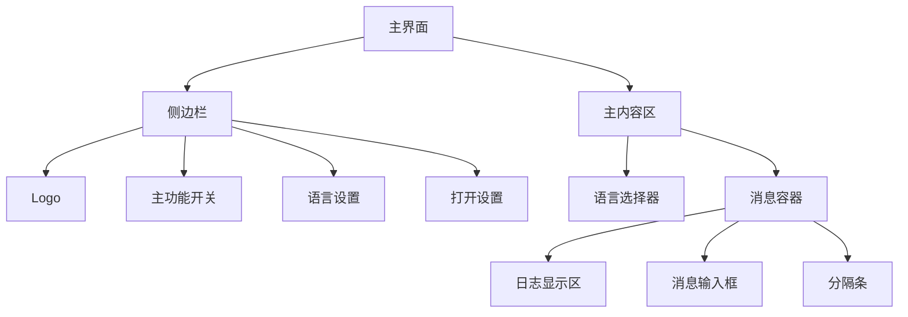
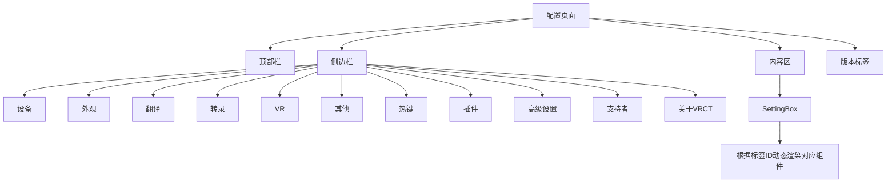

# 用户界面指南

<cite>
**本文档引用的文件**
- [MainPage.jsx](file://src-ui/views/app/main_page/MainPage.jsx)
- [ConfigPage.jsx](file://src-ui/views/app/config_page/ConfigPage.jsx)
- [LanguageSelector.jsx](file://src-ui/views/app/main_page/main_section/language_selector/LanguageSelector.jsx)
- [MessageContainer.jsx](file://src-ui/views/app/main_page/main_section/message_container/MessageContainer.jsx)
- [SettingSection.jsx](file://src-ui/views/app/config_page/setting_section/SettingSection.jsx)
- [SettingBox.jsx](file://src-ui/views/app/config_page/setting_section/setting_box/SettingBox.jsx)
- [SidebarSection.jsx](file://src-ui/views/app/main_page/sidebar_section/SidebarSection.jsx)
- [SidebarSection.jsx](file://src-ui/views/app/config_page/sidebar_section/SidebarSection.jsx)
- [useLanguageSettings.js](file://src-ui/logics/main/useLanguageSettings.js)
- [index.js](file://src-ui/logics/main/index.js)
- [index.js](file://src-ui/logics/configs/index.js)
</cite>

## 目录
1. [简介](#简介)
2. [主界面布局与功能](#主界面布局与功能)
3. [配置页面结构与导航](#配置页面结构与导航)
4. [核心组件交互逻辑](#核心组件交互逻辑)
5. [语言与翻译配置](#语言与翻译配置)
6. [设备与外观设置](#设备与外观设置)
7. [热键与高级功能](#热键与高级功能)
8. [实际使用场景示例](#实际使用场景示例)
9. [结论](#结论)

## 简介
本指南旨在全面介绍VRCT（Voice Recognition & Translation）应用程序的用户界面功能布局与交互逻辑。文档将深入解析主页面和配置页面的各个组件，说明其用途和操作方式，并结合React组件代码解释UI状态如何与后端配置同步。通过本指南，用户将能够熟练掌握双语翻译设置、Overlay显示样式调整以及热键功能配置等核心操作。

**Section sources**
- [MainPage.jsx](file://src-ui/views/app/main_page/MainPage.jsx#L1-L21)
- [ConfigPage.jsx](file://src-ui/views/app/config_page/ConfigPage.jsx#L1-L21)

## 主界面布局与功能
主界面由侧边栏（SidebarSection）和主内容区（MainSection）组成，采用响应式布局设计。侧边栏包含应用Logo、主功能开关和语言设置入口，主内容区则集中展示语言选择器、消息输入框和日志显示区域等核心交互组件。

**Diagram sources**
- [MainPage.jsx](file://src-ui/views/app/main_page/MainPage.jsx#L7-L21)
- [SidebarSection.jsx](file://src-ui/views/app/main_page/sidebar_section/SidebarSection.jsx#L1-L33)

### 语言选择器
语言选择器组件（LanguageSelector）提供直观的语言选择界面，支持按首字母分组显示可选语言。用户可通过点击语言按钮来设置源语言或目标语言。该组件通过`useLanguageSettings` Hook获取当前可选语言列表，并将用户选择通过回调函数传递给父组件。

**Section sources**
- [LanguageSelector.jsx](file://src-ui/views/app/main_page/main_section/language_selector/LanguageSelector.jsx#L1-L63)
- [useLanguageSettings.js](file://src-ui/logics/main/useLanguageSettings.js)

### 消息输入与日志显示
消息容器（MessageContainer）采用可调节布局，通过拖拽分隔条可以调整日志显示区和消息输入框的高度比例。该组件使用`react-resizable-layout`库实现拖拽功能，并通过`useMessageInputBoxRatio` Hook持久化存储用户设置的高度比例。

**Section sources**
- [MessageContainer.jsx](file://src-ui/views/app/main_page/main_section/message_container/MessageContainer.jsx#L1-L89)
- [useMessageInputBoxRatio.js](file://src-ui/logics/main/useMessageInputBoxRatio.js)

## 配置页面结构与导航
配置页面采用标签式导航设计，左侧为功能标签栏，右侧为内容显示区。标签栏包含设备、外观、翻译、转录、VR、其他、热键、插件、高级设置等主要配置类别，底部还设有支持者和关于VRCT等辅助信息标签。

**Diagram sources**
- [ConfigPage.jsx](file://src-ui/views/app/config_page/ConfigPage.jsx#L1-L21)
- [SidebarSection.jsx](file://src-ui/views/app/config_page/sidebar_section/SidebarSection.jsx#L1-L61)

### 标签导航机制
配置页面的标签导航通过`useStore_SelectedConfigTabId`状态管理实现。当用户点击某个标签时，`updateSelectedConfigTabId`函数会被调用，更新当前选中的标签ID。`SettingBox`组件监听此状态变化，并根据当前标签ID动态渲染对应的配置组件。

**Section sources**
- [SettingSection.jsx](file://src-ui/views/app/config_page/setting_section/SettingSection.jsx#L1-L28)
- [SettingBox.jsx](file://src-ui/views/app/config_page/setting_section/setting_box/SettingBox.jsx#L1-L46)

## 核心组件交互逻辑
系统采用模块化的状态管理架构，将UI逻辑与配置逻辑分离。主页面使用`@logics_main`命名空间下的Hook，而配置页面使用`@logics_configs`命名空间下的Hook，确保功能关注点分离。

```mermaid
classDiagram
class MainPage {
+SidebarSection
+MainSection
}
class ConfigPage {
+Topbar
+SidebarSection
+SettingSection
+VersionLabel
}
class SettingSection {
+SettingBox
}
class SettingBox {
+Device
+Appearance
+Translation
+Transcription
+Others
+AdvancedSettings
+Vr
+Hotkeys
+Plugins
+Supporters
+AboutVrct
}
class SidebarSection_Main {
+Logo
+MainFunctionSwitch
+LanguageSettings
+OpenSettings
}
class SidebarSection_Config {
+Tab[ ]
}
MainPage --> SidebarSection_Main : 包含
MainPage --> MainSection : 包含
ConfigPage --> SidebarSection_Config : 包含
ConfigPage --> SettingSection : 包含
SettingSection --> SettingBox : 包含
```

**Diagram sources**
- [MainPage.jsx](file://src-ui/views/app/main_page/MainPage.jsx#L7-L21)
- [ConfigPage.jsx](file://src-ui/views/app/config_page/ConfigPage.jsx#L8-L21)
- [SettingSection.jsx](file://src-ui/views/app/config_page/setting_section/SettingSection.jsx#L8-L28)
- [SettingBox.jsx](file://src-ui/views/app/config_page/setting_section/setting_box/SettingBox.jsx#L17-L46)

### 状态管理与配置同步
配置系统的状态管理采用工厂模式创建，通过`createCategoryHook`函数为每个配置类别（如Appearance、Device等）生成对应的Hook。这种设计确保了配置数据的类型安全和访问一致性。特殊配置项如热键、支持者等则通过独立的Hook进行管理。

**Section sources**
- [index.js](file://src-ui/logics/configs/index.js#L1-L22)
- [ui_config_setter.js](file://src-ui/logics/configs/config_page_setter/ui_config_setter.js)

## 语言与翻译配置
翻译配置板块允许用户设置源语言和目标语言，支持多种翻译服务（如Gemini、OpenAI等）。用户可以在语言设置中添加多个目标语言，实现多语言同步翻译。系统通过`useLanguageSettings` Hook管理语言选择状态，并与后端翻译服务进行同步。

**Section sources**
- [useLanguageSettings.js](file://src-ui/logics/main/useLanguageSettings.js)
- [Translation.jsx](file://src-ui/views/app/config_page/setting_section/setting_box/translation/Translation.jsx)

## 设备与外观设置
设备设置板块允许用户配置音频输入输出设备、计算设备（CPU/GPU）等硬件相关选项。外观设置则提供主题颜色、字体、圆角半径等UI个性化选项。这些设置通过对应的Hook（`useDevice`、`useAppearance`）与全局状态存储同步，并在应用重启后保持。

**Section sources**
- [Device.jsx](file://src-ui/views/app/config_page/setting_section/setting_box/device/Device.jsx)
- [Appearance.jsx](file://src-ui/views/app/config_page/setting_section/setting_box/appearance/Appearance.jsx)
- [useDevice.js](file://src-ui/logics/configs/config_page_setter/ui_config_setter.js)
- [useAppearance.js](file://src-ui/logics/configs/config_page_setter/ui_config_setter.js)

## 热键与高级功能
热键配置板块允许用户自定义快捷键来控制翻译功能的开关。系统通过`useHotkeys` Hook管理热键设置，并与全局事件监听器集成。高级设置包含性能优化选项和实验性功能，适合高级用户进行精细化调整。

**Section sources**
- [Hotkeys.jsx](file://src-ui/views/app/config_page/setting_section/setting_box/hotkeys/Hotkeys.jsx)
- [useHotkeys.js](file://src-ui/logics/configs/config_page_setter/hotkeys/useHotkeys.js)
- [AdvancedSettings.jsx](file://src-ui/views/app/config_page/setting_section/setting_box/advanced_settings/AdvancedSettings.jsx)

## 实际使用场景示例

### 设置双语翻译
1. 打开主界面的语言设置
2. 点击"添加目标语言"按钮
3. 从语言选择器中选择需要的第二语言
4. 系统将自动为新添加的语言创建独立的翻译流
5. 在配置页面的翻译板块中，可为每种语言对单独配置翻译服务和参数

### 调整Overlay显示样式
1. 进入配置页面的"外观"板块
2. 调整"字体大小"滑块以改变文字尺寸
3. 使用"圆角半径"滑块调整窗口圆角程度
4. 通过"透明度"设置控制Overlay的透明度
5. 所有更改将实时预览，并在确认后保存

### 配置热键开关翻译功能
1. 进入配置页面的"热键"板块
2. 点击"翻译开关"热键设置项
3. 按下期望的快捷键组合（如Ctrl+Shift+T）
4. 系统将记录该组合并绑定到翻译开关功能
5. 之后可通过该快捷键快速启用或禁用翻译功能

**Section sources**
- [Translation.jsx](file://src-ui/views/app/config_page/setting_section/setting_box/translation/Translation.jsx)
- [Appearance.jsx](file://src-ui/views/app/config_page/setting_section/setting_box/appearance/Appearance.jsx)
- [Hotkeys.jsx](file://src-ui/views/app/config_page/setting_section/setting_box/hotkeys/Hotkeys.jsx)

## 结论
本指南详细介绍了VRCT应用程序的用户界面设计与功能实现。通过模块化的组件架构和清晰的状态管理，系统实现了高度的可维护性和可扩展性。用户可以根据个人需求灵活配置翻译、外观和热键等各项功能，获得个性化的使用体验。建议用户在使用过程中参考本指南，充分发挥应用程序的各项功能。