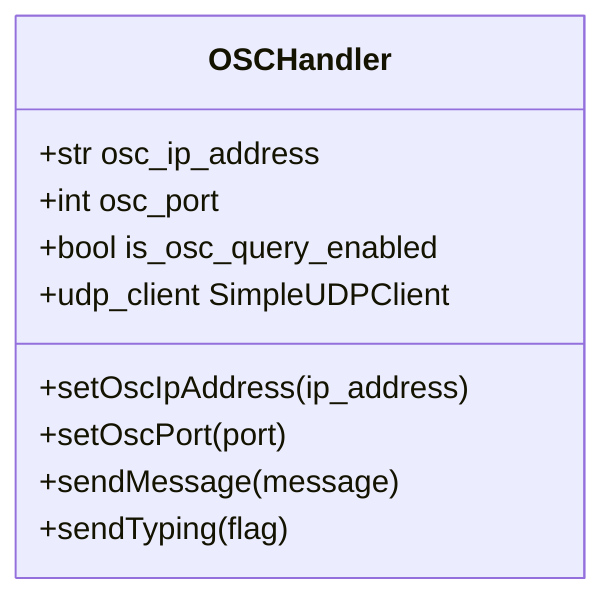
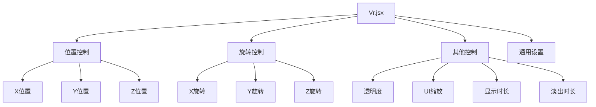
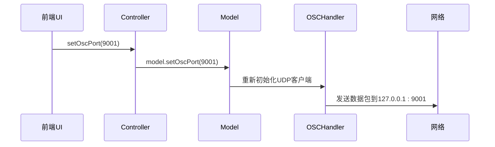
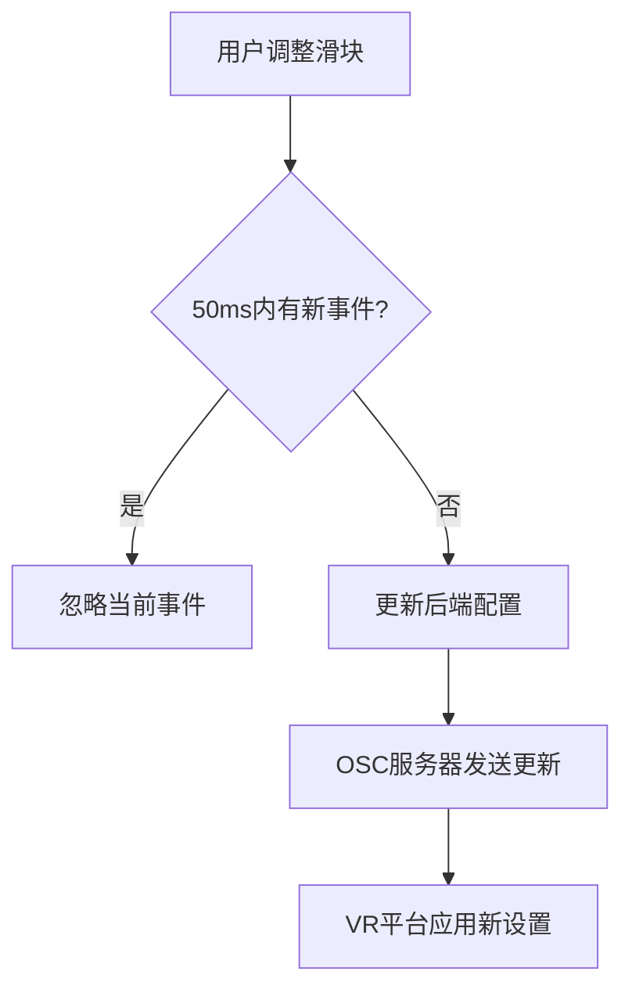

# VR集成设置

<cite>
**本文档引用的文件**   
- [Vr.jsx](file://src-ui/views/app/config_page/setting_section/setting_box/vr/Vr.jsx)
- [osc.py](file://src-python/models/osc/osc.py)
- [overlay.py](file://src-python/models/overlay/overlay.py)
- [controller.py](file://src-python/controller.py)
- [ui_configs.js](file://src-ui/logics/ui_configs.js)
</cite>

## 目录
1. [简介](#简介)
2. [OSC通信配置](#osc通信配置)
3. [VR参数映射与动作触发](#vr参数映射与动作触发)
4. [Vr.jsx组件与OSC路径树](#vrjsx组件与osc路径树)
5. [OSC协议与数据包格式](#osc协议与数据包格式)
6. [VR状态同步与延迟优化](#vr状态同步与延迟优化)

## 简介
本项目通过Open Sound Control (OSC) 协议实现与VR平台（如VRC）的深度集成。系统核心由前端UI配置和后端OSC处理模块协同工作，实现消息发送、参数映射和状态同步等功能。前端通过`Vr.jsx`组件提供直观的配置界面，后端`osc.py`模块负责处理OSC通信协议，确保数据的准确传输和实时交互。

## OSC通信配置

### 发送目标地址与端口设置
OSC通信的发送目标地址和端口是集成配置的基础。系统通过`OSCHandler`类管理这些核心参数。



**Diagram sources**
- [osc.py](file://src-python/models/osc/osc.py#L48-L67)

`OSCHandler`类在初始化时接收IP地址和端口作为参数，默认值为`127.0.0.1`和`9000`。当IP地址为`127.0.0.1`或`localhost`时，`is_osc_query_enabled`标志被设置为`true`，启用OSCQuery功能，实现双方向通信和参数发现。

**Section sources**
- [osc.py](file://src-python/models/osc/osc.py#L48-L67)

### 配置更新流程
当用户在UI中更改OSC配置时，系统通过`controller.py`中的`setOscIpAddress`和`setOscPort`方法处理更新。这些方法不仅更新全局配置，还会重新初始化OSC服务，确保新设置立即生效。

**Section sources**
- [controller.py](file://src-python/controller.py#L1505-L1542)

## VR参数映射与动作触发

### Avatar参数映射
系统预定义了关键的Avatar参数路径，用于控制VR中的各种状态。

```mermaid
graph TD
A[/avatar/parameters/MuteSelf] --> |布尔值| B[控制用户静音状态]
C[/chatbox/typing] --> |布尔值| D[控制打字指示器]
E[/chatbox/input] --> |字符串| F[向聊天框发送消息]
```

**Diagram sources**
- [osc.py](file://src-python/models/osc/osc.py#L54-L56)

这些参数路径遵循VRC的OSC协议规范。`/avatar/parameters/MuteSelf`用于同步用户的静音状态，`/chatbox/typing`控制打字动画的显示，而`/chatbox/input`则用于向VR聊天框注入文本。

### 动作触发规则
动作触发通过调用`OSCHandler`的特定方法实现。例如，调用`sendTyping(true)`会向`/chatbox/typing`发送`true`值，触发VR中的打字动画。

**Section sources**
- [osc.py](file://src-python/models/osc/osc.py#L88-L91)

## Vr.jsx组件与OSC路径树

### 组件结构与功能
`Vr.jsx`组件是VR配置的前端入口，提供了一个完整的配置界面，允许用户调整VR叠加层的位置、旋转、透明度等属性。



**Diagram sources**
- [Vr.jsx](file://src-ui/views/app/config_page/setting_section/setting_box/vr/Vr.jsx)

### 自定义参数绑定
`Vr.jsx`组件通过`useVr` Hook与后端模型连接，实现配置的双向绑定。当用户调整滑块时，`onchangeFunction`会被调用，它使用防抖技术（50ms延迟）来优化性能，避免频繁的后端更新。

**Section sources**
- [Vr.jsx](file://src-ui/views/app/config_page/setting_section/setting_box/vr/Vr.jsx#L116-L127)

## OSC协议与数据包格式

### 数据包转换
前端配置通过`model.py`中的`OSCHandler`实例转换为符合OSC标准的数据包。`python-osc`库负责将Python数据结构序列化为UDP数据包。



**Diagram sources**
- [controller.py](file://src-python/controller.py#L1538-L1541)
- [osc.py](file://src-python/models/osc/osc.py#L81-L86)

### 与后端osc.py模块协同
`osc.py`模块作为OSC通信的薄层包装器，封装了发送和接收逻辑。`OSCHandler`实例在`model.py`中被创建并初始化，与`controller.py`中的业务逻辑层紧密协作。

**Section sources**
- [model.py](file://src-python/model.py#L140)
- [osc.py](file://src-python/models/osc/osc.py)

## VR状态同步与延迟优化

### 状态同步机制
当`is_osc_query_enabled`为`true`时，系统会启动一个本地OSC服务器和OSCQuery服务。这允许系统不仅发送消息，还能接收来自VR平台的状态更新，实现双向同步。

**Section sources**
- [osc.py](file://src-python/models/osc/osc.py#L154-L185)

### 延迟优化配置
系统通过多种方式优化延迟：
- **防抖配置更新**：`Vr.jsx`中的`setTimeout`防止了配置的频繁更新。
- **长轮询间隔**：OSC服务器使用10秒的轮询间隔，减少CPU占用。
- **资源预加载**：关键模型和资源在应用启动时进行延迟初始化。



**Diagram sources**
- [Vr.jsx](file://src-ui/views/app/config_page/setting_section/setting_box/vr/Vr.jsx#L121-L124)
- [osc.py](file://src-python/models/osc/osc.py#L188-L190)