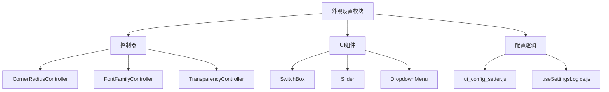
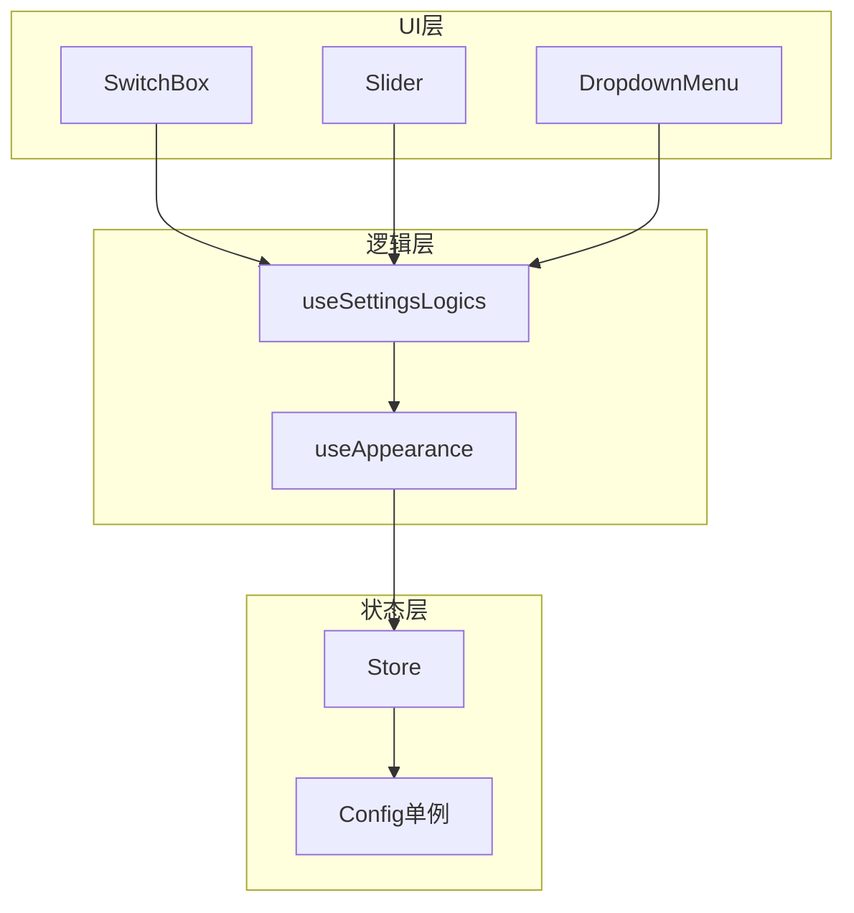
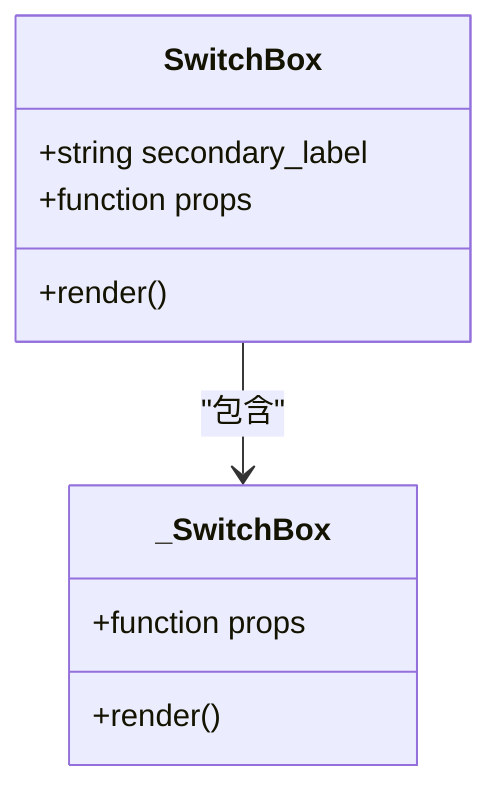
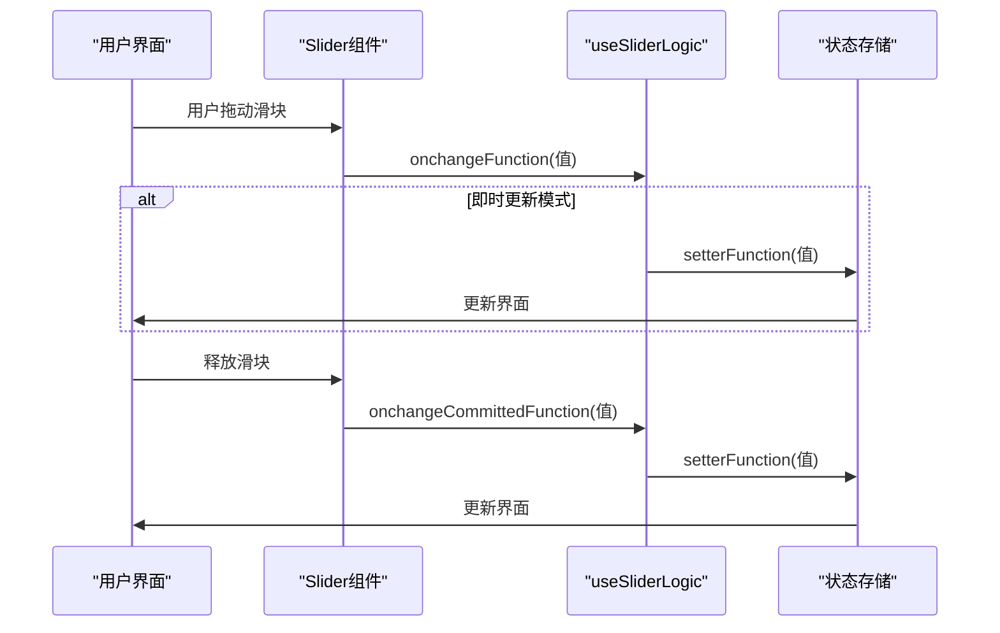
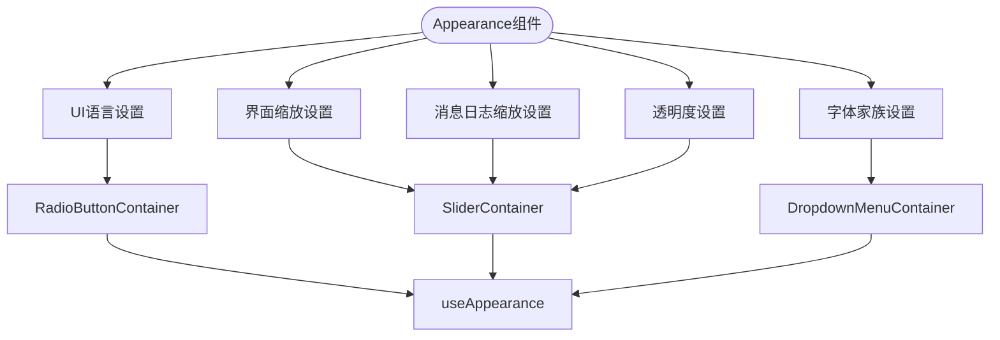
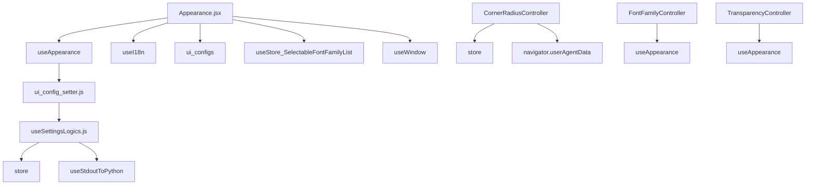

# 外观设置

<cite>
**本文档引用的文件**
- [Appearance.jsx](file://src-ui/views/app/config_page/setting_section/setting_box/appearance/Appearance.jsx)
- [ui_config_setter.js](file://src-ui/logics/configs/config_page_setter/ui_config_setter.js)
- [useSettingsLogics.js](file://src-ui/logics/configs/config_page_setter/useSettingsLogics.js)
- [CornerRadiusController.jsx](file://src-ui/views/app/_app_controllers/CornerRadiusController.jsx)
- [FontFamilyController.jsx](file://src-ui/views/app/_app_controllers/FontFamilyController.jsx)
- [TransparencyController.jsx](file://src-ui/views/app/_app_controllers/TransparencyController.jsx)
- [SwitchBox.jsx](file://src-ui/views/app/config_page/setting_section/setting_box/_components/switch_box/SwitchBox.jsx)
- [Slider.jsx](file://src-ui/views/app/config_page/setting_section/setting_box/_components/slider/Slider.jsx)
- [Templates.jsx](file://src-ui/views/app/config_page/setting_section/setting_box/_templates/Templates.jsx)
</cite>

## 目录
1. [项目结构](#项目结构)
2. [核心组件](#核心组件)
3. [架构概述](#架构概述)
4. [详细组件分析](#详细组件分析)
5. [依赖分析](#依赖分析)

## 项目结构

VRCT项目的外观设置模块位于`src-ui`目录下，主要包含配置页面的UI组件和逻辑控制器。该模块实现了界面主题、窗口圆角、透明度和字体设置等功能。

**图表来源**
- [CornerRadiusController.jsx](file://src-ui/views/app/_app_controllers/CornerRadiusController.jsx)
- [FontFamilyController.jsx](file://src-ui/views/app/_app_controllers/FontFamilyController.jsx)
- [TransparencyController.jsx](file://src-ui/views/app/_app_controllers/TransparencyController.jsx)
- [SwitchBox.jsx](file://src-ui/views/app/config_page/setting_section/setting_box/_components/switch_box/SwitchBox.jsx)
- [Slider.jsx](file://src-ui/views/app/config_page/setting_section/setting_box/_components/slider/Slider.jsx)
- [ui_config_setter.js](file://src-ui/logics/configs/config_page_setter/ui_config_setter.js)

**章节来源**
- [Appearance.jsx](file://src-ui/views/app/config_page/setting_section/setting_box/appearance/Appearance.jsx)
- [CornerRadiusController.jsx](file://src-ui/views/app/_app_controllers/CornerRadiusController.jsx)

## 核心组件

外观设置模块的核心组件包括SwitchBox和Slider等UI控件，它们通过React状态绑定实现即时预览效果。配置项与后端Config单例的同步机制确保了用户界面设置的持久化。

**章节来源**
- [Appearance.jsx](file://src-ui/views/app/config_page/setting_section/setting_box/appearance/Appearance.jsx)
- [ui_config_setter.js](file://src-ui/logics/configs/config_page_setter/ui_config_setter.js)

## 架构概述

外观设置模块采用分层架构设计，将UI组件、业务逻辑和状态管理分离。通过useAppearance钩子函数提供统一的API接口，实现配置项的获取、设置和状态更新。

**图表来源**
- [useSettingsLogics.js](file://src-ui/logics/configs/config_page_setter/useSettingsLogics.js)
- [ui_config_setter.js](file://src-ui/logics/configs/config_page_setter/ui_config_setter.js)
- [Appearance.jsx](file://src-ui/views/app/config_page/setting_section/setting_box/appearance/Appearance.jsx)

## 详细组件分析

### SwitchBox组件分析

SwitchBox组件用于实现开关功能，通过React状态管理实现即时预览效果。组件支持二次标签显示，提供良好的用户体验。

**图表来源**
- [SwitchBox.jsx](file://src-ui/views/app/config_page/setting_section/setting_box/_components/switch_box/SwitchBox.jsx)
- [\_SwitchBox.jsx](file://src-ui/views/app/config_page/setting_section/setting_box/_components/_atoms/_switch_box/_SwitchBox.jsx)

### Slider组件分析

Slider组件基于MUI Slider实现，支持自定义样式和值标签显示。通过useSliderLogic钩子函数管理滑块状态，实现即时预览和提交更新两种模式。

**图表来源**
- [Slider.jsx](file://src-ui/views/app/config_page/setting_section/setting_box/_components/slider/Slider.jsx)
- [useSettingsLogics.js](file://src-ui/logics/configs/config_page_setter/useSettingsLogics.js)

### 外观设置功能分析

Appearance组件整合了多个设置项，包括UI语言、界面缩放、字体家族和透明度等。每个设置项通过相应的容器组件进行封装，保持代码的模块化和可维护性。

**图表来源**
- [Appearance.jsx](file://src-ui/views/app/config_page/setting_section/setting_box/appearance/Appearance.jsx)
- [Templates.jsx](file://src-ui/views/app/config_page/setting_section/setting_box/_templates/Templates.jsx)

**章节来源**
- [Appearance.jsx](file://src-ui/views/app/config_page/setting_section/setting_box/appearance/Appearance.jsx)
- [Templates.jsx](file://src-ui/views/app/config_page/setting_section/setting_box/_templates/Templates.jsx)

## 依赖分析

外观设置模块依赖于多个核心组件和工具函数，形成了完整的配置管理系统。

**图表来源**
- [Appearance.jsx](file://src-ui/views/app/config_page/setting_section/setting_box/appearance/Appearance.jsx)
- [ui_config_setter.js](file://src-ui/logics/configs/config_page_setter/ui_config_setter.js)
- [useSettingsLogics.js](file://src-ui/logics/configs/config_page_setter/useSettingsLogics.js)
- [CornerRadiusController.jsx](file://src-ui/views/app/_app_controllers/CornerRadiusController.jsx)
- [FontFamilyController.jsx](file://src-ui/views/app/_app_controllers/FontFamilyController.jsx)
- [TransparencyController.jsx](file://src-ui/views/app/_app_controllers/TransparencyController.jsx)

**章节来源**
- [Appearance.jsx](file://src-ui/views/app/config_page/setting_section/setting_box/appearance/Appearance.jsx)
- [ui_config_setter.js](file://src-ui/logics/configs/config_page_setter/ui_config_setter.js)
- [useSettingsLogics.js](file://src-ui/logics/configs/config_page_setter/useSettingsLogics.js)